# Stock Analysis Report — Aeroflex Industries Ltd (NSE: AEROFLEX / BSE 543972)
**Date:** 2026-10-09
**Analyst:** Claude (Stock Fundamental Analysis Skill v3.3)
**Investment Horizon:** 2–3 Years
**Recommendation:** AVOID at current price → WATCHLIST (Quality at Wrong Price), buy-below ~₹220–240
**Conviction Score:** 4.5 / 10

## Revision Log
| Version | Date | Recommendation | Conviction | Price | Key change |
|---|---|---|---|---|---|
| Current | 2026-10-09 | Avoid at CMP → Watchlist (buy ₹220–240) | 4.5/10 | ₹524 | Initial report |

**Validation of previous report:** Initial report (no earlier AEROFLEX file in the library).

---

## Executive Summary

Aeroflex makes stainless-steel flexible hoses, hose assemblies and metal bellows for 80+ countries. In the last year it has built a second engine: **SFN liquid-cooling skid assemblies for AI data centres**. Q1 FY27 was its best quarter ever: **revenue ₹146 Cr (+72% YoY), EBITDA ₹33.5 Cr (23.0%), PAT ₹18.8 Cr (+162%)**. Skids alone contributed **₹32.4 Cr (23% of revenue; 1,040 skids at ~₹3.1 lakh)**, up from ₹18.9 Cr in Q4 FY26. Skid capacity was raised from 6,000 to 9,000/yr on 1 Jul 2026 and is going to **15,000/yr by Oct–Nov 2026** for only ₹48 Cr of capex. Hose capacity rises from 17.5 to 20 mn m by Q3. Management reaffirmed **30–35% FY27 revenue growth** and a **25% EBITDA margin** target ([Q1 FY27 call](https://www.bseindia.com/xml-data/corpfiling/AttachHis/6401402c-a5ca-4785-87db-477dd4e8d73c.pdf)).

It is a genuinely good business: ROCE 19–36% since FY22, debt-free, cash-backed earnings, 20%+ revenue growth. **The price has run far ahead of it.** The stock tripled in a year (₹159 in Jan 2026 → ₹524; 52-week high ₹584). It trades at **103× TTM EPS, 15.5× book (94th–96th percentile of its post-IPO range) and ~60× FY28E base EPS**. The base-case DCF is ₹106–172, and even the bull DCF tops out at ₹269. Our 2-year scenarios (bear ₹160 / base ₹390 / bull ₹650) give an expected value of **₹398 (−24%)** and **U/D 0.35:1**, so the hard stop applies. The data-centre story is real but early, and it runs through a single Indian channel partner today. A buyer at ₹524 pays now for a skid business that would have to reach several times its 15,000-unit capacity.

### C1 — Growth Index: Revenue vs Fixed Assets vs Profit (FY22 = 100)

| ₹ Cr | FY22 | FY23 | FY24 | FY25 | FY26 | 4-yr CAGR |
|---|---|---|---|---|---|---|
| Revenue | 241 | 269 | 318 | 376 | 442 | 16.4% |
| Gross Block | 113 | 128 | 161 | 263 | 330 | 30.7% |
| EBITDA | 47 | 53 | 62 | 80 | 100 | 20.8% |
| PAT | 28 | 30 | 42 | 53 | 56 | 18.9% |

*Source: Screener.in consolidated; gross block from the fixed-asset schedule. FY22 base (FY20–21 PAT ₹5–6 Cr is too small a base to index). TTM (Jun 2026): revenue ₹503 Cr, EBITDA ₹118 Cr, PAT ₹67 Cr. Standalone history: revenue ₹122 Cr (FY18) → ₹145 Cr (FY21), so the growth phase began in FY22.*

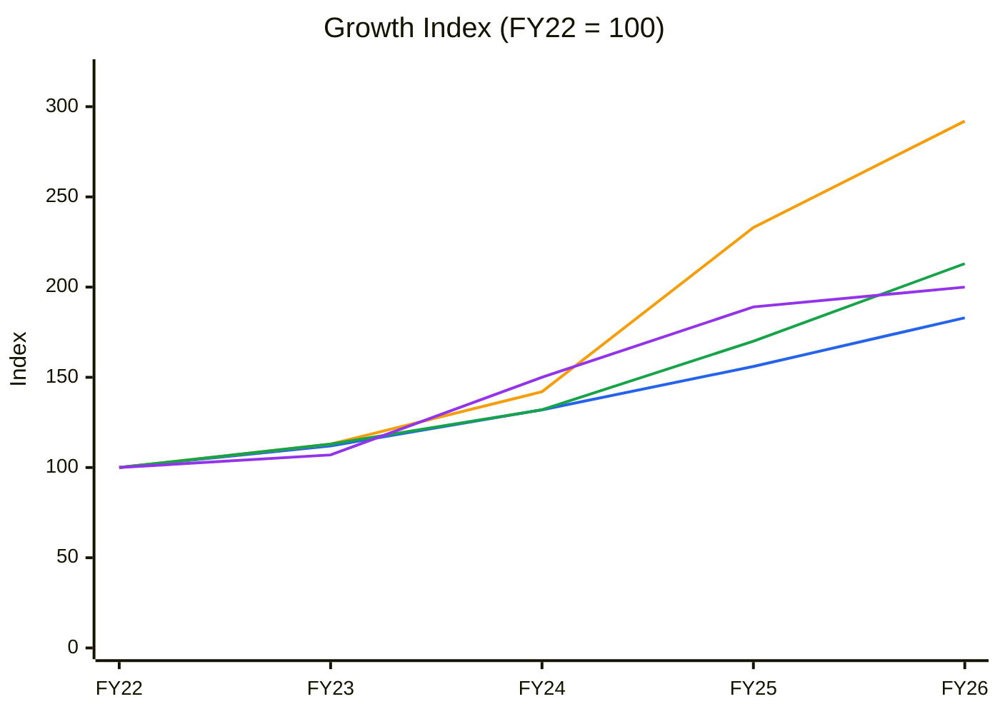
```mermaid
%%{init: {"themeVariables": {"xyChart": {"plotColorPalette": "#2563eb, #f59e0b, #16a34a, #9333ea"}}}}%%
xychart-beta
    title "Growth Index (FY22 = 100)"
    x-axis [FY22, FY23, FY24, FY25, FY26]
    y-axis "Index" 0 --> 320
    line [100, 112, 132, 156, 183]
    line [100, 113, 142, 233, 292]
    line [100, 113, 132, 170, 213]
    line [100, 107, 150, 189, 200]
```
🟦 Revenue (CAGR 16.4%) · 🟧 Gross Block (30.7%) · 🟩 EBITDA (20.8%) · 🟪 PAT (18.9%)

**Read:** EBITDA (213) has grown faster than revenue (183), so margins expanded every year. From FY25 the gross block (292) pulled ahead of both, reflecting IPO-funded capex in hoses, bellows (Hyd-Air) and SFN skids. PAT (200) lagged EBITDA in FY26 as depreciation rose from ₹11 Cr to ₹26 Cr. Q1 FY27 annualised revenue (~₹584 Cr) puts the revenue index at ~242, so it is starting to catch up.

**Business inference:** Aeroflex has grown with steadily improving economics, moving up from bare hose to assemblies and now skids. Each step adds margin, and that is real operating quality. FY25–26 was an investment phase in which capital ran ahead of sales. Q1 FY27 shows the new assets starting to pay. Because skid capacity is cheap (₹48 Cr for 13,000 units), the next leg of growth is far less capital-intensive than the chart suggests, so ROCE should rise rather than fall as skids scale.

---

## Business Primer

Aeroflex designs and manufactures environment-friendly metallic flow products. The core is corrugated stainless-steel flexible hoses (17.5 → 20 mn metres/yr), sold bare or as engineered assemblies with braiding and fittings. These serve HVAC, oil and gas, industrial process, solar, semiconductor, railways, firefighting and, increasingly, data-centre applications. It also makes metal bellows (including miniature bellows) and, through its Hyd-Air subsidiary, precision components. Since FY26 it has assembled **SFN (secondary fluid network) liquid-cooling skids**: the piping-and-manifold modules that circulate coolant across a data-centre floor, sold to an Indian partner who serves the data-centre builder. Historically ~80% of revenue was exported (Europe, USA, 80+ countries; [Outlook Business, IPO](https://www.outlookbusiness.com/news/aeroflex-industries-gets-sebi-s-clearance-to-float-ipo-news-307439)). Domestic share has risen with skids. Returns depend on capacity utilisation, the assembly/skid mix (bare hose ~16–20% EBITDA, assemblies ~22–26%, per the Q1 call), and the pace of data-centre construction.

This is a **niche, export-led precision manufacturer (capital-moderate compounder) with a new, high-growth, customer-concentrated data-centre vertical**. The key value drivers are volume (capacity fill), mix (assemblies and skids) and the number of liquid-cooled megawatts commissioned (~40 skids per MW). The key risks are concentration in the skid channel, design-approval-driven lumpiness, entry of global players (Parker, Senior) and stainless-steel/freight costs. Structural features: Aeroflex is a 65.5% subsidiary of the listed Sat Industries group (now Aeroflex Enterprises), listed only since Aug 2023, so long-run market data is short. Its valuation has moved from "industrial hose maker" to "AI-infrastructure play" within six months.

**New Segment Protocol:** Segment **not previously covered**. A new block, *Engineered Flow Solutions / Metallic Flexible Hoses & Data-Centre Liquid-Cooling Assemblies*, was added to `references/05-industry-kpis-india.md` with user approval (8 KPIs: utilisation by line, value-added mix, DC share and customer concentration, gross margin vs SS/nickel, export spread, CCC, DC content per MW, ROCE ex-cash).

---

## Module 1 — Broad Market Cycle

Nifty 50 at 22,556 (5 Oct 2026, ~−6% since June), India VIX 14.7, persistent FII selling absorbed by DIIs ([StockPil](https://stockpil.com/india-markets-today-2026-10-05/)). **Verdict: CAUTIOUS.** The broad market is weak while the AI/data-centre theme (STL +5.6× in six months, HFCL, cable and cooling plays) is in a speculative phase. Aeroflex's 1-year return of +206% is part of that theme.

---

## Module 1b — Sector Cycle: Tailwinds & Headwinds

**Secular (core hoses):** Replacement of rubber with metal hoses (fire safety, durability), HVAC, process industry, semiconductor and solar build-outs, and China+1 sourcing by Western OEMs. Durable growth is ~12–15% (management sees the hose segment at 15–20%; peak hose revenue at full 20 mn m capacity of ₹650–675 Cr).
**Secular (data centres):** India data-centre capacity of ~1.6 GW is set to grow toward ~9–10 GW by 2030–31 (Morgan Stanley via the STL Q1 FY27 call), and AI racks increasingly need liquid cooling. At ~40 skids/MW × ~₹3.1 lakh, **1 GW of liquid-cooled load ≈ 40,000 skids ≈ ₹1,250 Cr of skid content**. Even if only a third of India's ~8 GW of additions is liquid-cooled, that is ~₹3,000–3,500 Cr of skids over five years, against Aeroflex's 15,000-unit capacity (~₹465 Cr/yr at full).
**Cyclical:** Data-centre construction is lumpy and depends on financing and power availability. Q1 FY27 also carried West Asia freight inflation (call).
**Competition:** "Among the few" Indian skid makers today, but Parker and Senior have entered skids globally, and local players are starting up. Skid capacity costs little, so the barrier is customer qualification (10–11 months for a new partner), not capital.
**FX:** Export-heavy core (historically ~80% of revenue) → long USD/EUR; INR weakness helps.

**Sector cycle verdict: STRONG TAILWIND (multi-year, secular), early-stage in India data centres.** Durable baseline for the DCF: ~15% core + skid ramp to the 15,000-unit ceiling, then growth tied to new capacity.

---

## Module 1c — Stock Cycle: Company Positioning

### C2 — Quarterly YoY Growth (last 8 quarters)

| Quarter | Sep24 | Dec24 | Mar25 | Jun25 | Sep25 | Dec25 | Mar26 | Jun26 |
|---|---|---|---|---|---|---|---|---|
| Revenue (₹ Cr) | 95 | 100 | 92 | 84 | 111 | 121 | 126 | 146 |
| Revenue YoY % | +13.1 | +37.0 | +17.9 | −6.7 | +16.8 | +21.0 | +37.0 | +72.4 |
| EBITDA (₹ Cr) | 20 | 22 | 19 | 15 | 26 | 28 | 30 | 33.5 |
| EBITDA YoY % | +11 | +57 | +36 | −17 | +30 | +27 | +58 | +116 |
| OPM % | 21 | 22 | 21 | 18 | 23 | 23 | 24 | 23 |

*Source: Screener.in quarterly (consolidated); Q1 FY27 YoY from company figures.*

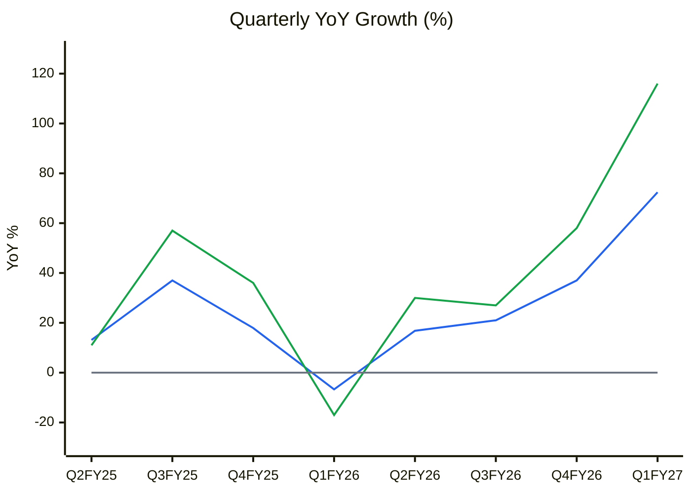
```mermaid
%%{init: {"themeVariables": {"xyChart": {"plotColorPalette": "#2563eb, #16a34a, #6b7280"}}}}%%
xychart-beta
    title "Quarterly YoY Growth (%)"
    x-axis [Q2FY25, Q3FY25, Q4FY25, Q1FY26, Q2FY26, Q3FY26, Q4FY26, Q1FY27]
    y-axis "YoY %" -30 --> 130
    line [13.1, 37.0, 17.9, -6.7, 16.8, 21.0, 37.0, 72.4]
    line [11, 57, 36, -17, 30, 27, 58, 116]
    line [0, 0, 0, 0, 0, 0, 0, 0]
```
🟦 Revenue YoY % · 🟩 EBITDA YoY % · ⬜ zero line

**Read:** After a soft Q1 FY26 (−7%), growth **accelerated for four straight quarters** (+17% → +21% → +37% → +72%), with EBITDA growth running at 1.6–2× revenue growth. Q1 FY27 also benefits from a weak base (₹84 Cr). Core hoses alone grew +41% YoY in Q1, so this is not only skids.

**Business inference:** Two engines are firing together: the core export hose business is in a strong upturn, and the skid vertical is adding a new layer on top. The core is the more durable of the two because it is diversified across 80+ countries and many industries. The skid layer is the faster but lumpier one. The YoY rate will normalise from Q2 FY27 as the base rises (Q2 FY26: ₹111 Cr), so the stock's next test is sequential growth, not YoY.

### Capacity & ramp
- **Hoses:** 17.5 → 20 mn m by Q3 FY27 (₹54 Cr programme); utilisation 65–66%; peak revenue at full ~₹650–675 Cr including assemblies.
- **SFN skids:** 2,000 → 6,000 → 9,000 (1 Jul 2026) → **15,000/yr (Oct–Nov 2026)**; ₹48 Cr total capex; Q4 FY27 exit target ~65% utilisation of 15,000 (≈ 750 skids/month ≈ ₹70 Cr/qtr at ~₹3.1 lakh). Optimal utilisation ~80% in FY28 → **~12,000 skids ≈ ₹370 Cr/yr**.
- **Combined ceiling (FY28–29):** ~₹1,000–1,050 Cr of revenue at optimal utilisation, **~2.3× FY26**. Beyond that needs new capex (under discussion with the customer; not announced).

### Operating leverage
Q1 FY27: revenue +72%, EBITDA +116% → **DOL ≈ 1.6×** at EBITDA. Debt-free, so DFL ≈ 1.0. Employee cost and new-plant start-up costs (Chakan, Taloja) absorbed ~300 bps in Q1.

### CY7 — EBITDA Margin vs its own history

| | FY20 | FY21 | FY22 | FY23 | FY24 | FY25 | FY26 | Q1FY27 |
|---|---|---|---|---|---|---|---|---|
| EBITDA margin % | 15 | 16 | 20 | 20 | 20 | 21 | 23 | 23 |

7-year median 20%, SD 2.6 → band 17.4–22.6% (short history; FY20–21 under the old leveraged structure).

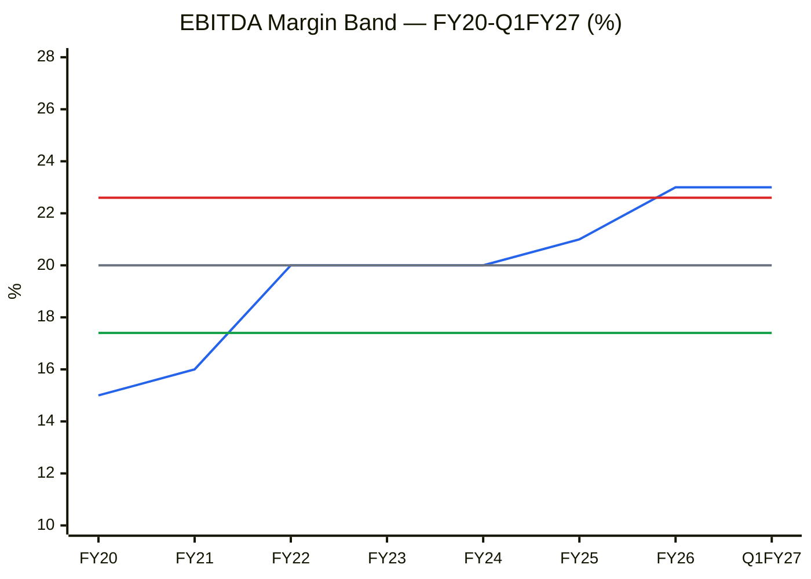
```mermaid
%%{init: {"themeVariables": {"xyChart": {"plotColorPalette": "#2563eb, #6b7280, #dc2626, #16a34a"}}}}%%
xychart-beta
    title "EBITDA Margin Band — FY20-Q1FY27 (%)"
    x-axis [FY20, FY21, FY22, FY23, FY24, FY25, FY26, Q1FY27]
    y-axis "%" 10 --> 28
    line [15, 16, 20, 20, 20, 21, 23, 23]
    line [20, 20, 20, 20, 20, 20, 20, 20]
    line [22.6, 22.6, 22.6, 22.6, 22.6, 22.6, 22.6, 22.6]
    line [17.4, 17.4, 17.4, 17.4, 17.4, 17.4, 17.4, 17.4]
```
🟦 EBITDA margin · ⬜ Median 20% · 🟥 +1SD 22.6% · 🟩 −1SD 17.4%

**Read:** Margin has stepped up in a **staircase, not a cycle**: 15–16% (FY20–21) → 20–21% (FY22–25) → 23% (FY26–Q1 FY27), now just above +1SD. Management targets 25% blended "over the next few years".

**Business inference:** Unlike the fibre and chemical companies in this library, Aeroflex's margin gains look structural, driven by mix (assemblies at 22–26% replacing bare hose at 16–20%, and skids at "company-average" margins) and scale. There is no evidence of a cyclical peak. The upside is limited, though: 25% is the stated ceiling, so future profit growth must come from volume, not margin.

**Stock cycle classification: EARLY-TO-MID GROWTH (capacity-led ramp; margins structurally rising).** Not late-cycle on operations. **Valuation**, however, is late-cycle (Module 9).

**FCF inflection:** FY25–FY26 FCF −₹78 / −₹5 Cr (IPO-funded capex). With the ₹48 Cr skid and ₹54 Cr hose programmes completing in FY27, **FCF turns sustainably positive from FY27–FY28** (~₹30–60 Cr/yr after working capital).

**Guidance accuracy:** see Module 4 (WTT 0.75, MODERATE-HIGH).

---

## Module 2 — Industry Structure & Capital Cycle

**Five Forces:** entry barriers **moderate** (hose know-how, certifications and global distribution are real barriers in the core; skids are qualification-led but cheap to build), supplier power **moderate** (SS coil and nickel-linked; freight), buyer power **moderate in the core** (fragmented global OEMs and distributors) and **high in skids** (one channel partner; data-centre builders specify designs), substitutes **low** (rubber → metal is the substitution trend in Aeroflex's favour), rivalry **moderate** (global: Parker, Senior/Flexonics, Witzenmann; domestic: few). **Verdict: Attractive (core) / Neutral (skids).**

**Capital cycle:** Aeroflex's capex/depreciation was 3.5–6.9× in FY24–26, and it is now finishing. Data-centre liquid cooling globally is in the "capital flooding in" phase (integrators, CDU makers and skid makers all expanding), but skid capacity is cheap and flexible: management says the machines can be repurposed for bellows and industrial piping. **Signal: early-to-mid capital cycle for India data-centre cooling; returns high, competition arriving.**

---

## Module 3 — Business Quality & Moat

**Greenwald:** (1) cost advantage **partial**: Indian manufacturing cost plus a vertically integrated hose-to-assembly chain; (2) customer captivity **moderate**: 2,938 SKUs, certifications, long OEM relationships in 80+ countries, and engineered-to-order skids that take 10–11 months to qualify; (3) local scale **yes**: the leading Indian SS flexible-hose maker. **Buffett 10% price test: Pass (partial)**: margins rose through FY22–26 despite SS price swings. **Moat: NARROW, widening** (assemblies and qualification).

### C4 — Margin trend

| % | FY20 | FY21 | FY22 | FY23 | FY24 | FY25 | FY26 |
|---|---|---|---|---|---|---|---|
| Gross margin (1 − material %) | 34 | 35 | 35 | 37 | 37 | 42 | 43 |
| EBITDA margin | 15 | 16 | 20 | 20 | 20 | 21 | 23 |
| PAT margin | 3.5 | 4.2 | 11.6 | 11.2 | 13.2 | 14.1 | 12.7 |

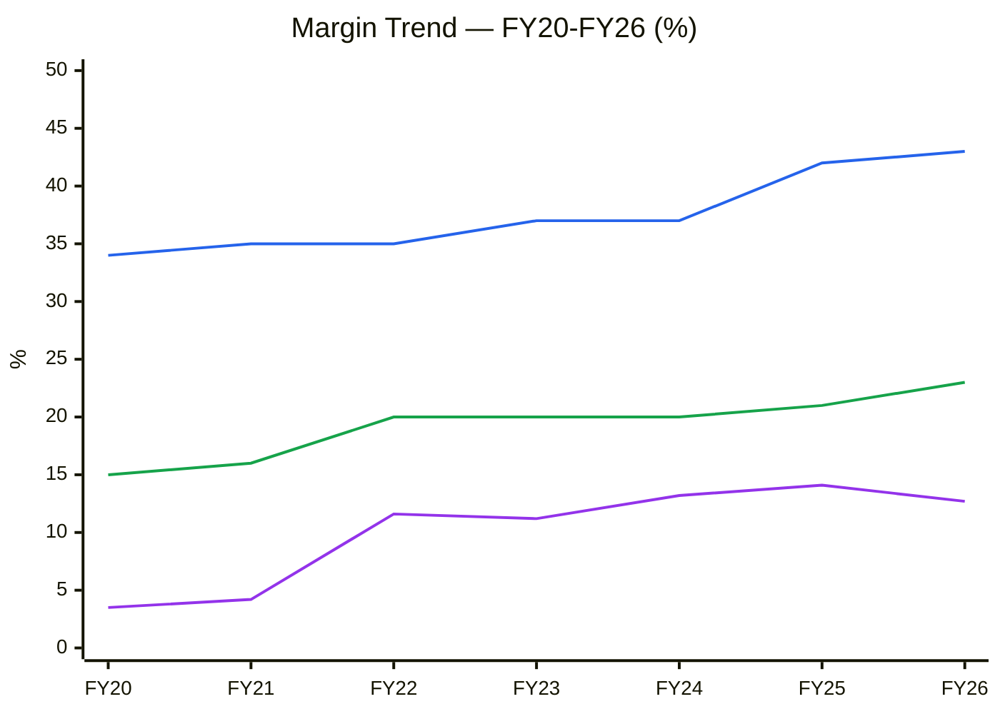
```mermaid
%%{init: {"themeVariables": {"xyChart": {"plotColorPalette": "#2563eb, #16a34a, #9333ea"}}}}%%
xychart-beta
    title "Margin Trend — FY20-FY26 (%)"
    x-axis [FY20, FY21, FY22, FY23, FY24, FY25, FY26]
    y-axis "%" 0 --> 50
    line [34, 35, 35, 37, 37, 42, 43]
    line [15, 16, 20, 20, 20, 21, 23]
    line [3.5, 4.2, 11.6, 11.2, 13.2, 14.1, 12.7]
```
🟦 Gross margin · 🟩 EBITDA margin · 🟪 PAT margin

**Read:** Gross margin rose **9 points** (34% → 43%) and EBITDA margin 8 points over six years. PAT margin jumped in FY22 as interest fell (debt ₹63 Cr → ₹0 after the IPO) and dipped in FY26 (12.7%) as depreciation more than doubled on new capacity.

**Business inference:** Rising gross margin is the clearest evidence that Aeroflex is moving up the value chain, from selling metres of hose to selling engineered assemblies and systems, rather than riding a metal cycle. That is the quality signal behind the premium multiple. The FY26 PAT-margin dip is the cost of building capacity and should reverse as the new lines fill.

**Fisher 15-point:** ~33/45. Strong on market potential, product development (fire-hose assemblies for a US data-centre customer, 15 new DC products shown in April 2026) and margin improvement. Weaker on disclosure (no skid margin or customer detail) and on dilution history (IPO fresh issue). Point 15 integrity: **Pass** (no adverse findings surfaced).

---

## Module 4 — Management & Capital Allocation

### C9 — Promoter & institutional holding (12 quarters)

| % | Sep23 | Dec23 | Mar24 | Jun24 | Sep24 | Dec24 | Mar25 | Jun25 | Sep25 | Dec25 | Mar26 | Jun26 |
|---|---|---|---|---|---|---|---|---|---|---|---|---|
| Promoters | 66.99 | 66.99 | 66.99 | 66.99 | 66.99 | 66.99 | 66.99 | 66.99 | 66.99 | 66.99 | 65.47 | 65.47 |
| FIIs | 1.13 | 0.36 | 0.29 | 0.21 | 0.13 | 1.57 | 0.66 | 0.39 | 0.23 | 0.99 | 1.49 | 3.61 |
| DIIs | 6.76 | 5.83 | 6.16 | 5.91 | 5.59 | 5.66 | 5.91 | 3.87 | 3.43 | 3.55 | 3.80 | 1.48 |

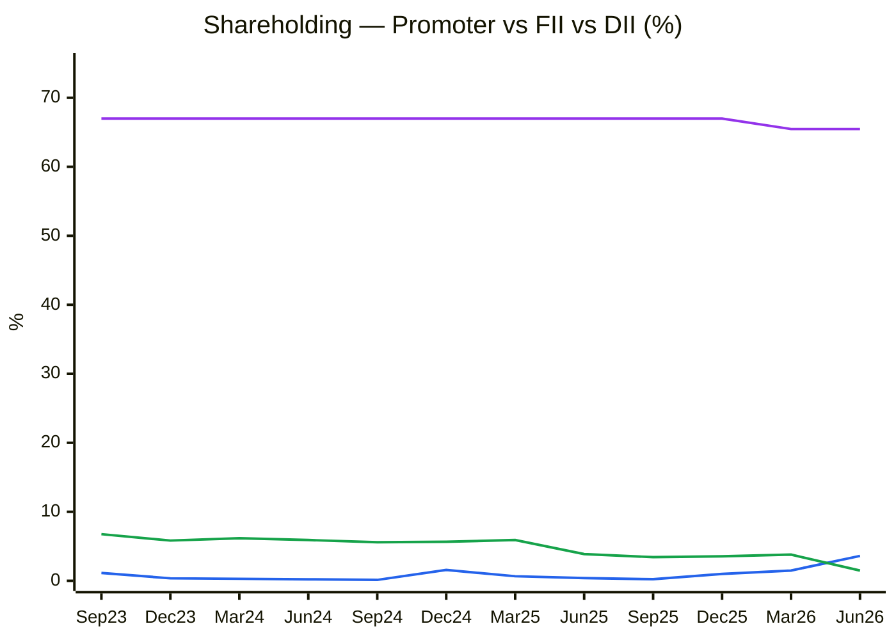
```mermaid
%%{init: {"themeVariables": {"xyChart": {"plotColorPalette": "#9333ea, #2563eb, #16a34a"}}}}%%
xychart-beta
    title "Shareholding — Promoter vs FII vs DII (%)"
    x-axis [Sep23, Dec23, Mar24, Jun24, Sep24, Dec24, Mar25, Jun25, Sep25, Dec25, Mar26, Jun26]
    y-axis "%" 0 --> 75
    line [66.99, 66.99, 66.99, 66.99, 66.99, 66.99, 66.99, 66.99, 66.99, 66.99, 65.47, 65.47]
    line [1.13, 0.36, 0.29, 0.21, 0.13, 1.57, 0.66, 0.39, 0.23, 0.99, 1.49, 3.61]
    line [6.76, 5.83, 6.16, 5.91, 5.59, 5.66, 5.91, 3.87, 3.43, 3.55, 3.80, 1.48]
```
🟪 Promoters · 🟦 FIIs · 🟩 DIIs

**Read:** The promoter (Sat Industries group) held 66.99% for ten quarters, then dropped **1.5pp in the Mar 2026 quarter** with no change in share capital, i.e. a secondary sale (cause not sourced). DIIs exited steadily (6.8% → 1.5%), mostly during the rally. FIIs rose to 3.6% in Jun 2026. Retail now holds ~29.5% (110k shareholders).

**Business inference:** The register points the opposite way to the narrative. The promoter group trimmed and domestic institutions sold as the AI-cooling story took off, while momentum FIIs and retail bought. Insiders and long-term institutions are not adding at these prices, which fits the valuation conclusion. The stock's marginal buyer is thematic rather than fundamental.

| Item | Reading |
|---|---|
| Pledge | Not sourced this run (data gap) |
| Dilution | IPO Aug 2023: ₹160 Cr fresh issue + OFS; shares 11.5 → 13.2 Cr equivalent. No raise since |
| Dividend payout | 7–10% |
| Capital allocation | IPO proceeds repaid debt and funded hose, bellows and skid capacity; Hyd-Air acquisition (components). ROCE stayed ≥ 19%. **Rating: Good** |
| RPT | Group company (Sat Industries / Aeroflex Enterprises) relationships; RPT schedule not reviewed (data gap) |
| Three C's | Candor ~ (limited segment/customer disclosure) · Competence ✓ · Caring ~ (low payout, but reinvesting at high ROCE) |

### Walk-the-Talk Scorecard
| Period guided | Statement | Guided | Actual | Verdict |
|---|---|---|---|---|
| FY26 calls | Skid capacity expansion | 6,000 → 9,000 | Done 1 Jul 2026 | ✅ |
| FY26 calls | FY27 revenue growth | 30–35% | Q1 +72% (on track, likely beat) | ✅ |
| FY26 calls | Skids ~25% of revenue by FY27 end | 25% | 23% in Q1 | ✅ (on track) |
| FY25 calls | Hose capacity 16.5 → 20 mn m | FY26 | Partly done; completion Q3 FY27 | ⚠️ Slip ~2–3 qtrs |
| FY25 calls | Hose-assembly margin toward 25% | 25% | Blended 23% | ⚠️ Near |
| Q1 FY27 call | 15,000 skids by Q3 FY27 | Oct–Nov 2026 | Pending (machine-supplier delays flagged) | — |

**WTT Score: 0.75 → MODERATE-HIGH** (3 hits, 2 near). **Pattern:** delivers on growth and capacity, with machine-delivery delays of a few months. **Insider action:** promoter trimmed 1.5pp (mildly bearish). **DCF impact:** guidance used as-is for FY27. **Credibility: MODERATE-HIGH.**

---

## Module 5 — Financial Forensics

| Test | Result |
|---|---|
| CFO vs PAT | FY20–26 cumulative CFO ₹201 Cr vs PAT ₹220 Cr (**0.91**); FY23 weak (₹7 Cr vs ₹30 Cr: pre-IPO WC build) |
| Sloan (CF, FY26) | (56 − 66 + 120) / avg TA 496 = **+22%**, driven by growth capex; operating accruals negative → acceptable |
| Beneish M (est.) | DSRI ~0.95 (debtor days 113 → 107), TATA −0.02 → **unlikely manipulator** |
| Altman Z'' | > 6 (net cash, equity ₹447 Cr vs liabilities ₹118 Cr) → **Safe** |
| Piotroski FY26 | ~6/9 (ROA down on depreciation; AT down on capex) |
| Receivables | Debtor days 72 (FY20) → 107–113 (FY24–26): export credit plus skid customer terms; **watch** |
| Auditor / KAMs | Not reviewed (data gap); no adverse items surfaced |

### C7 — Cumulative PAT vs CFO vs FCF (₹ Cr)

| | FY20 | FY21 | FY22 | FY23 | FY24 | FY25 | FY26 |
|---|---|---|---|---|---|---|---|
| Cum. PAT | 5 | 11 | 39 | 69 | 111 | 164 | 220 |
| Cum. CFO | 13 | 25 | 57 | 64 | 108 | 135 | 201 |
| Cum. FCF | 12 | 21 | 40 | 38 | 44 | −34 | −39 |

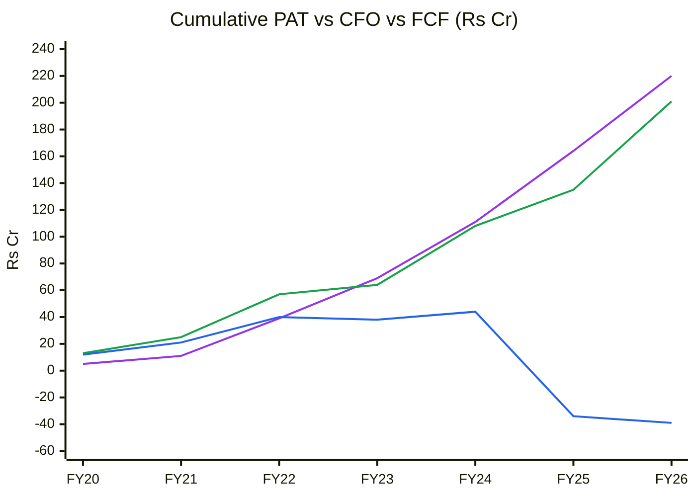
```mermaid
%%{init: {"themeVariables": {"xyChart": {"plotColorPalette": "#9333ea, #16a34a, #2563eb"}}}}%%
xychart-beta
    title "Cumulative PAT vs CFO vs FCF (Rs Cr)"
    x-axis [FY20, FY21, FY22, FY23, FY24, FY25, FY26]
    y-axis "Rs Cr" -60 --> 240
    line [5, 11, 39, 69, 111, 164, 220]
    line [13, 25, 57, 64, 108, 135, 201]
    line [12, 21, 40, 38, 44, -34, -39]
```
🟪 Cumulative PAT · 🟩 Cumulative CFO · 🟦 Cumulative FCF (CFO − capex)

**Read:** CFO tracks PAT closely (0.91 cumulative). The gap opened in FY23 (WC build before the IPO) and FY25 (receivables) and narrowed again in FY26 (CFO ₹66 Cr vs PAT ₹56 Cr). Cumulative FCF went negative in FY25–26 because ~₹175 Cr of capex was funded from IPO cash.

**Business inference:** Earnings are real and convert to cash at roughly 90%, which is normal for an export manufacturer offering 3–4 months' credit. The negative FCF reflects a one-off capacity build. Both capex programmes complete in FY27 and incremental skid capacity is cheap, so FCF should track PAT closely from FY28. This is a self-funding grower that will not need more equity at its current ambitions.

### C8 — Working-capital days

| Days | FY20 | FY21 | FY22 | FY23 | FY24 | FY25 | FY26 |
|---|---|---|---|---|---|---|---|
| Debtor | 72 | 85 | 80 | 91 | 109 | 113 | 107 |
| Inventory | 122 | 134 | 84 | 120 | 107 | 111 | 122 |
| Payable | 130 | 157 | 80 | 78 | 100 | 94 | 117 |
| CCC | 64 | 62 | 84 | 132 | 116 | 129 | 112 |

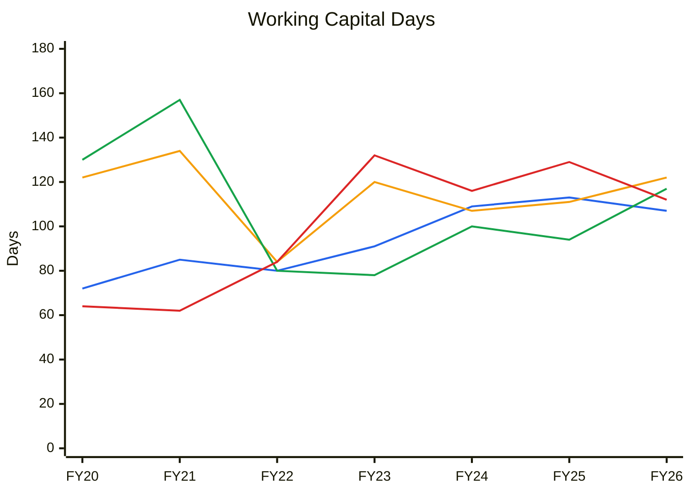
```mermaid
%%{init: {"themeVariables": {"xyChart": {"plotColorPalette": "#2563eb, #f59e0b, #16a34a, #dc2626"}}}}%%
xychart-beta
    title "Working Capital Days"
    x-axis [FY20, FY21, FY22, FY23, FY24, FY25, FY26]
    y-axis "Days" 0 --> 180
    line [72, 85, 80, 91, 109, 113, 107]
    line [122, 134, 84, 120, 107, 111, 122]
    line [130, 157, 80, 78, 100, 94, 117]
    line [64, 62, 84, 132, 116, 129, 112]
```
🟦 Debtor days · 🟧 Inventory days · 🟩 Payable days · 🟥 Cash conversion cycle

**Read:** The CCC doubled from ~60 days (FY20–21, when suppliers financed more) to 112–132 days (FY23–26), driven by debtors (72 → 107–113) and lower payables. FY26 improved slightly (129 → 112) as payables lengthened.

**Business inference:** Growth needs ~30% of incremental revenue in working capital, a moderate drag that is the main reason the DCF is far below the price. The FY26 improvement is encouraging. The KPI to watch is debtor days as skids grow: a single domestic channel partner with long payment terms could push the CCC back toward 130+ days and slow the FCF inflection.

**Forensic verdict: CLEAN (minor: rising debtor days).** Red-flag count 1/15.

---

## Module 6 — Earnings Quality & Financial Statements

**ROIC (FY26):** EBIT (100 + 1 − 26) ₹75 Cr × 0.75 = NOPAT ₹56 Cr ÷ invested capital (equity 447 + debt 9 − cash 70) ₹386 Cr = **14.5%**. TTM (EBIT ₹92 Cr): **~17–18%**. Q1 FY27 annualised (~₹105 Cr EBIT): **~20%**. **WACC ~12%.** ROIC ex-CWIP and ex-new-capacity start-up is higher.

### C5 — ROCE vs WACC

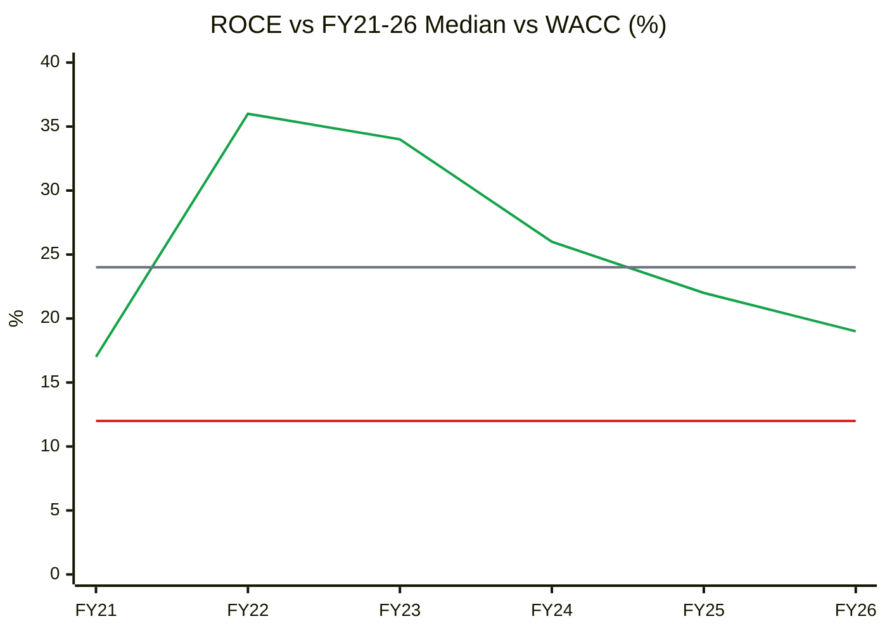
```mermaid
%%{init: {"themeVariables": {"xyChart": {"plotColorPalette": "#16a34a, #6b7280, #dc2626"}}}}%%
xychart-beta
    title "ROCE vs FY21-26 Median vs WACC (%)"
    x-axis [FY21, FY22, FY23, FY24, FY25, FY26]
    y-axis "%" 0 --> 40
    line [17, 36, 34, 26, 22, 19]
    line [24, 24, 24, 24, 24, 24]
    line [12, 12, 12, 12, 12, 12]
```
🟩 ROCE (pre-tax, Screener) · ⬜ FY21–26 median 24% · 🟥 WACC 12%

**Read:** ROCE peaked at **34–36%** in FY22–23 on a small, fully depreciated asset base, then declined to **19%** (FY26) as IPO cash and ₹175 Cr of new capacity entered the capital base. It has stayed above WACC throughout. On Q1 FY27 run-rate earnings it is back to the mid-20s.

**Business inference:** The ROCE decline is dilution from growth capital, not deterioration. Aeroflex still earns well above its cost of capital, and the next leg (skids at ~₹48 Cr for ~₹370 Cr of revenue) is extremely capital-light. A 20–25% through-cycle ROCE is credible, which justifies a premium multiple, but a 25–30× premium, not 100×.

### C6 — Asset Turnover (Revenue / Gross Block)

| | FY20 | FY21 | FY22 | FY23 | FY24 | FY25 | FY26 | TTM |
|---|---|---|---|---|---|---|---|---|
| AT (×) | 1.40 | 1.36 | 2.13 | 2.10 | 1.98 | 1.43 | 1.34 | 1.52 |

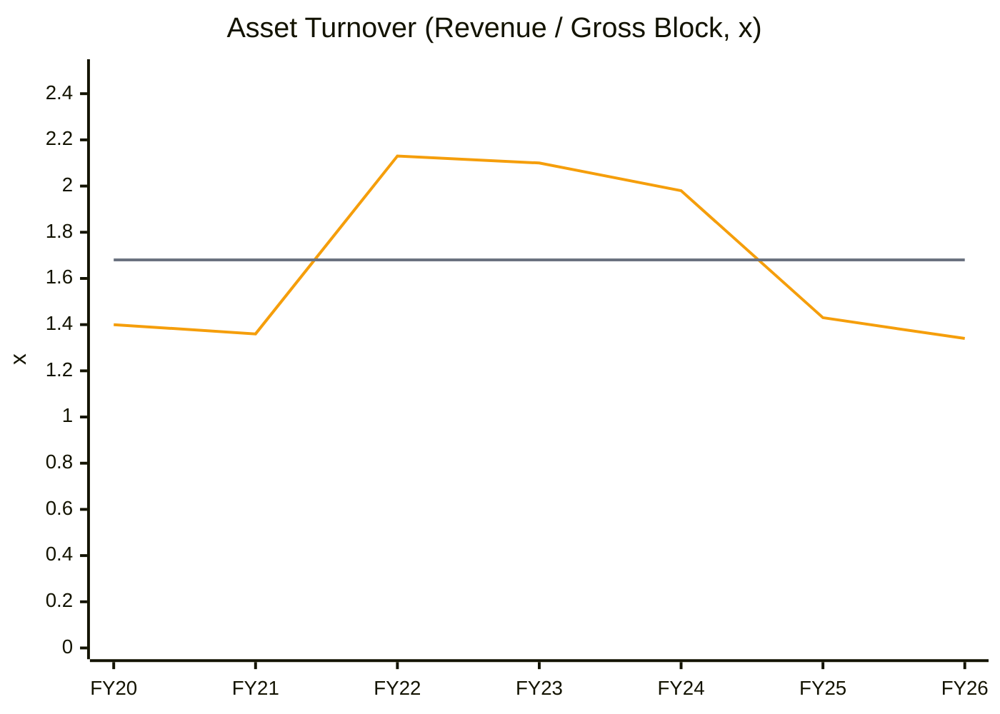
```mermaid
%%{init: {"themeVariables": {"xyChart": {"plotColorPalette": "#f59e0b, #6b7280"}}}}%%
xychart-beta
    title "Asset Turnover (Revenue / Gross Block, x)"
    x-axis [FY20, FY21, FY22, FY23, FY24, FY25, FY26]
    y-axis "x" 0 --> 2.5
    line [1.40, 1.36, 2.13, 2.10, 1.98, 1.43, 1.34]
    line [1.68, 1.68, 1.68, 1.68, 1.68, 1.68, 1.68]
```
🟧 AT · ⬜ FY20–26 average 1.68×

**Read:** AT was ~2.0–2.1× in FY22–24 (old plant running hot) and fell to **1.34× in FY26** as gross block doubled. The TTM figure (1.52×) and Q1 FY27 annualised (~1.8×) show it recovering as new capacity fills.

**Business inference:** New capacity is filling about a year after commissioning, which is normal. Because the skid line generates roughly ₹8 of revenue per ₹1 of capex, blended AT should rise toward ~1.8–2.0× by FY28–29, the main driver of ROCE recovery. The C14 forward model uses ~1.6–1.7×, which is conservative.

### DuPont (FY22–FY26)
| Year | EBIT margin | AT (Rev/TA) | Equity mult. | Interest burden | Tax burden | ROE |
|---|---|---|---|---|---|---|
| FY22 | 18.4% | 1.32 | 2.13 | 0.84 | 0.75 | 32.6% |
| FY23 | 16.4% | 1.26 | 1.88 | 0.93 | 0.73 | 26.3% |
| FY24 | 18.9% | 0.85 | 1.28 | 0.95 | 0.73 | 14.4% |
| FY25 | 18.6% | 0.88 | 1.25 | 0.99 | 0.75 | 15.5% |
| FY26 | 17.0% | 0.78 | 1.26 | 0.97 | 0.75 | 12.5% |

**Verdict:** The ROE fall from 33% to 13% is **financing and asset-turn, not operations**. EBIT margin held at 17–19%. The IPO deleveraged the company (equity multiplier 2.1× → 1.3×) and added cash and new assets (AT down). This is the healthy kind of ROE decline, and it reverses as assets fill. **Base-case forward AT ~1.6–1.7× (gross block).**

---

## Module 7 — Industry KPIs & Peer Analysis

| KPI (new Engineered Flow Solutions block) | Aeroflex | Healthy | Red flag | Status |
|---|---|---|---|---|
| Capacity utilisation | Hoses 65–66%; skids ramping (Q4 FY27 exit target ~65% of 15,000) | 70–85% | < 55% after ramp | ✅ Room to grow |
| Value-added mix | Assemblies 63% of hose business + skids 23% of revenue | > 60%, rising | Falling | ✅ |
| DC share / customer concentration | DC skids 23% of revenue via one Indian partner; plus DC hose assemblies (Europe, US) | ≥ 2 customers; top < 30% | > 40% single channel | ⚠️ Rising concentration |
| Gross margin vs SS/nickel | 34% → 43% (FY20–26) | Stable/rising | Falls with nickel | ✅ |
| Export share | Historically ~80%; Q1 domestic share up (skids); exports +43% YoY | 60–80% | Single-country > 40% | ✅ (mix shifting) |
| CCC | 112 days | < 110 | > 150 | ⚠️ Borderline |
| DC content per MW | ~40 skids × ~₹3.1 lakh ≈ ₹1.25 Cr/MW | — | Falling ₹/skid with flat margin | ✅ (design-driven) |
| ROCE ex-cash | ~17–20% (TTM / run-rate) | > 20% | < 15% post-expansion | ✅ / borderline |

### Peer comparison (no clean listed pure-play; SS-tube and metal-products references)

| Metric | Aeroflex | APL Apollo | Ratnamani | Welspun Corp | Usha Martin |
|---|---|---|---|---|---|
| Mcap (₹ Cr) | 6,932 | 57,303 | 17,314 | 70,230 | 15,236 |
| P/E (TTM) | 103 | 46.6 | 39.5 | 30.4 | 28.0 |
| ROCE % | 18.9 | 31.8 | 17.9 | 22.9 | 19.5 |
| Latest-qtr sales YoY | +72% | +8% | −16% | +15% | +16% |

*Source: Screener.in peer table, 9 Oct 2026. Global flow/thermal peers (Parker Hannifin, Senior plc) trade at roughly 20–35× P/E.*

### C12 — P/E vs Peers

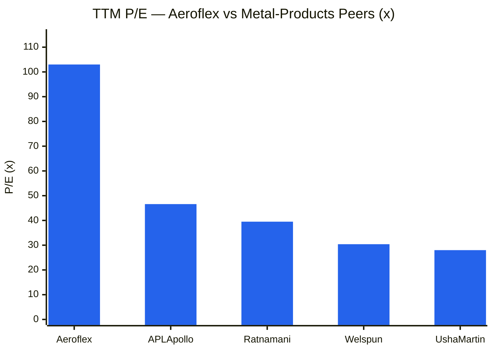
```mermaid
%%{init: {"themeVariables": {"xyChart": {"plotColorPalette": "#2563eb"}}}}%%
xychart-beta
    title "TTM P/E — Aeroflex vs Metal-Products Peers (x)"
    x-axis [Aeroflex, APLApollo, Ratnamani, Welspun, UshaMartin]
    y-axis "P/E (x)" 0 --> 115
    bar [103, 46.6, 39.5, 30.4, 28.0]
```

**Read:** Aeroflex trades at **2.2× APL Apollo's P/E** (which earns a higher 31.8% ROCE) and 2.6–3.7× the other metal-products names, with ROCE in line with the group (18.9%). The only thing that separates it is growth (+72% in the latest quarter vs −16% to +16%).

**Business inference:** The market is pricing Aeroflex as a data-centre growth company, not an engineered-hose maker. That is partly fair: growth is real and the skid vertical has no Indian listed equivalent. But at 100× the price assumes today's 70% growth persists for years, while management's own guide is 30–35% and the skid line hits its capacity ceiling in FY28. A premium of 1.3–1.5× peers (≈ 40–60×) would already credit the growth generously.

**Peer positioning:** Premium; justified on growth and mix, not at 2–3× peers.

---

## Module 8 — Market Size & Market Share

**Core hoses:** global metallic flexible-hose market (~$3–4 bn; industrial, HVAC, oil and gas, fire) growing ~5–7%. Aeroflex at ~₹390 Cr of hose and assembly revenue is a low-single-digit global share, gaining (Q1 hose revenue +41% vs market ~6%). **Taking share**, structurally (cost, product breadth, rubber → metal substitution).
**Data-centre skids:** India's liquid-cooled build-out (Module 1b) ≈ ₹3,000–3,500 Cr of skid content over ~5 years (one-third liquid-cooled scenario). At 15,000 units (~₹465 Cr/yr) Aeroflex could supply ~12–15% of that. Exports (US/Europe) are a multiple of India but need different designs and new qualifications (management: "international business in this financial year").
**Verdict: taking share in hoses; early leader in Indian DC skids, with share contestable once global players localise.**

---

## Module 9 — Valuation: PIE First, Then DCF

**CMP ₹524 (9 Oct 2026) · Mcap ₹6,932 Cr · cash ₹70 Cr · debt ₹9 Cr · EV ~₹6,871 Cr · TTM EPS ₹5.13 · P/E 103× · P/B 15.5× (BV ₹33.8) · EV/TTM EBITDA 58× · 13.23 Cr shares.**

### PIE
TTM NOPAT (EBIT ₹90 Cr × 0.75) ≈ ₹67.5 Cr → EV/NOPAT 102× → implied perpetual g = (6,871 × 12% − 67.5)/(6,871 + 67.5) = **10.9%**, essentially WACC. Two-stage: to earn 12% from here, FY31 equity value must be ~₹12,200 Cr. At a mature 25–30× P/E, that needs **FY31 PAT of ~₹410–490 Cr**, i.e. **revenue of ~₹2,400–2,900 Cr** at a ~17% PAT margin (**~40% revenue CAGR for five years**).

| PIE driver | Market-implied | My base case | Gap |
|---|---|---|---|
| Revenue CAGR FY26–31 | ~40% (₹2,400–2,900 Cr) | 22% (₹1,200 Cr) | **Market far more optimistic** |
| EBITDA margin | ~25–26% (target achieved and held) | 23.5–24.5% | Mild |
| Capacity | 4–5× today's combined ceiling | Announced capacity (~₹1,000–1,050 Cr) + modest additions | **Market pricing unannounced capex** |

**Physical plausibility:** Announced capacity (20 mn m of hose and 15,000 skids) supports ~₹1,000–1,050 Cr of revenue at optimal utilisation. **The PIE needs ~2.5× more capacity than is announced**, i.e. several further skid expansions plus international skid wins. Possible, since skid capex is cheap, but none of it is contracted or guided.
**Expectations treadmill:** To beat the price, Aeroflex must (a) fill 15,000 skids in FY28, (b) win international skid customers at scale, (c) add capacity several times over, and (d) hold 25% margins, all while Parker and Senior enter the same niche.
**Triggers:** + Q2 FY27 revenue ≥ ₹160 Cr; first international skid order; a second domestic skid customer; capacity beyond 15,000 announced. − Data-centre project delays (design approvals); skid revenue down QoQ; debtor days > 120; a global entrant wins the Indian partner.
**SVAR:** bear ₹160 → **69%** (> 40% = unfavourable).

### Own DCF (5-yr explicit; WC 30% of Δrevenue; tax 25%; net cash ₹61 Cr; 13.23 Cr shares)

| ₹/share | WACC 12%, g 6%, RONIC 20% | 11.5%, 6.5%, 25% | 11%, 7%, 30% |
|---|---|---|---|
| Bear (FY31 revenue ₹800 Cr, 21%) | 63 | 78 | 98 |
| **Base (FY31 revenue ₹1,200 Cr; 23.5–24.5%)** | **106** | **133** | **172** |
| Bull (FY31 revenue ₹1,750 Cr; 24–26%) | 162 | 206 | 269 |

**DCF note:** Even a bull case of 4× revenue by FY31 at 25% margins is worth ₹162–269, half the price or less. The market is not discounting cash flows. It is capitalising a narrative at an AI-theme multiple.

### Relative (2-yr, FY28E)
FY27E: revenue ~₹620 Cr (vs 30–35% guidance ≈ ₹575–600 Cr; Q1 run-rate higher), EBITDA 23.5%, PAT ~₹85 Cr, **EPS ~₹6.4** → **82× FY27E**. FY28E base EPS ~₹8.7 → **60× FY28E**.

### CY1 — P/E Band (post-IPO, quarter-ends)

| | Sep23 | Dec23 | Mar24 | Jun24 | Sep24 | Dec24 | Mar25 | Jun25 | Sep25 | Dec25 | Mar26 | Jun26 | Sep26 |
|---|---|---|---|---|---|---|---|---|---|---|---|---|---|
| P/E (×) | 53.8 | 54.6 | 33.2 | 49.5 | 54.2 | 59.3 | 42.9 | 52.8 | 44.2 | 49.4 | 59.1 | 109.5 | 102.5 |

163 observations since listing (Aug 2023): **median 50.7×, SD 19.3 → band 31.4–70.0×; current 103× = 96th percentile.** *(Screener.in; only ~3 years of listed history.)*

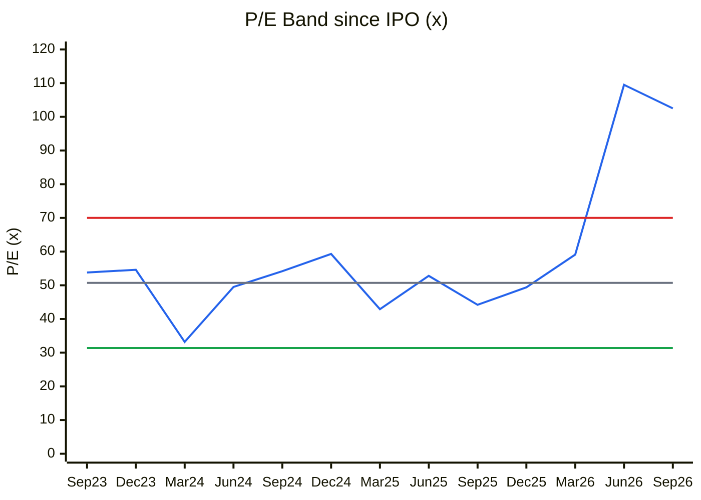
```mermaid
%%{init: {"themeVariables": {"xyChart": {"plotColorPalette": "#2563eb, #6b7280, #dc2626, #16a34a"}}}}%%
xychart-beta
    title "P/E Band since IPO (x)"
    x-axis [Sep23, Dec23, Mar24, Jun24, Sep24, Dec24, Mar25, Jun25, Sep25, Dec25, Mar26, Jun26, Sep26]
    y-axis "P/E (x)" 0 --> 120
    line [53.8, 54.6, 33.2, 49.5, 54.2, 59.3, 42.9, 52.8, 44.2, 49.4, 59.1, 109.5, 102.5]
    line [50.7, 50.7, 50.7, 50.7, 50.7, 50.7, 50.7, 50.7, 50.7, 50.7, 50.7, 50.7, 50.7]
    line [70.0, 70.0, 70.0, 70.0, 70.0, 70.0, 70.0, 70.0, 70.0, 70.0, 70.0, 70.0, 70.0]
    line [31.4, 31.4, 31.4, 31.4, 31.4, 31.4, 31.4, 31.4, 31.4, 31.4, 31.4, 31.4, 31.4]
```
🟦 P/E · ⬜ Median 50.7× · 🟥 +1SD 70.0× · 🟩 −1SD 31.4×

**Read:** For 2.5 years after listing, P/E moved in a 33–59× range around ~50×, already a growth premium. In the Jun 2026 quarter it **doubled to 103–110×**, well above +1SD, as the data-centre narrative took hold. Earnings did not double: TTM EPS rose ~20% over that period.

**Business inference:** Even before the AI story, the market paid ~50× for a 20% grower with rising margins, a full price for a hose maker. The extra doubling is purely thematic. If the skid ramp merely meets guidance, the multiple can revert to the ~50× band while earnings grow, and that de-rating alone would offset roughly two years of 30% EPS growth.

### CY2 — P/B Band (post-IPO, with ROE)

| | Dec23 | Mar24 | Jun24 | Sep24 | Dec24 | Mar25 | Jun25 | Sep25 | Dec25 | Mar26 | Jun26 | Sep26 |
|---|---|---|---|---|---|---|---|---|---|---|---|---|
| P/B (×) | 7.3 | 5.7 | 7.1 | 8.0 | 8.5 | 7.0 | 9.2 | 6.8 | 7.2 | 8.6 | 17.6 | 15.6 |

ROE: FY24 ~14% (post-IPO equity), FY25 16.7%, FY26 14.2%, TTM ~15%. **Median 7.5×, SD 3.0 → band 4.5–10.5×; current 15.5× = 94th percentile.**

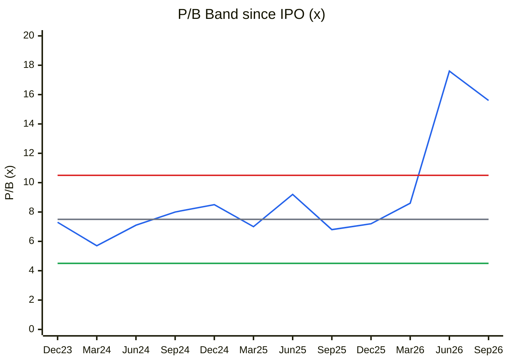
```mermaid
%%{init: {"themeVariables": {"xyChart": {"plotColorPalette": "#2563eb, #6b7280, #dc2626, #16a34a"}}}}%%
xychart-beta
    title "P/B Band since IPO (x)"
    x-axis [Dec23, Mar24, Jun24, Sep24, Dec24, Mar25, Jun25, Sep25, Dec25, Mar26, Jun26, Sep26]
    y-axis "P/B (x)" 0 --> 20
    line [7.3, 5.7, 7.1, 8.0, 8.5, 7.0, 9.2, 6.8, 7.2, 8.6, 17.6, 15.6]
    line [7.5, 7.5, 7.5, 7.5, 7.5, 7.5, 7.5, 7.5, 7.5, 7.5, 7.5, 7.5]
    line [10.5, 10.5, 10.5, 10.5, 10.5, 10.5, 10.5, 10.5, 10.5, 10.5, 10.5, 10.5]
    line [4.5, 4.5, 4.5, 4.5, 4.5, 4.5, 4.5, 4.5, 4.5, 4.5, 4.5, 4.5]
```
🟦 P/B · ⬜ Median 7.5× · 🟥 +1SD 10.5× · 🟩 −1SD 4.5×

**Read:** P/B is ~1.5× its +1SD line. With ROE at 14–17% (diluted by IPO cash and new capacity; ~20%+ on run-rate earnings), justified P/B at Ke 12%, g 8% and ROE 20% is **~3×**. At 30% ROE it is ~5.5×. **15.5× book prices an ROE of ~70%** on today's equity, or rapid book compounding.

**Business inference:** On book, Aeroflex is priced like an asset-light software or consumer franchise, but it is a manufacturer that needs about ₹1 of plant per ₹1.7–2.0 of revenue and ~₹0.30 of working capital per ₹1 of growth. Its returns are good, not extraordinary, and the P/B confirms the price depends on a growth runway far longer than the visible capacity.

### CY4 — Price vs TTM EPS Index (Mar 2024 = 100)

| | Mar24 | Jun24 | Sep24 | Dec24 | Mar25 | Jun25 | Sep25 | Dec25 | Mar26 | Jun26 | Sep26 | Oct26 |
|---|---|---|---|---|---|---|---|---|---|---|---|---|
| Price (₹) | 121.4 | 160.0 | 181.1 | 206.8 | 170.2 | 209.6 | 179.8 | 201.1 | 240.6 | 466.7 | 525.7 | 524 |
| TTM EPS (₹, from quarterly) | 3.35 | 3.34 | 3.50 | 3.98 | 4.07 | 3.66 | 3.70 | 3.80 | 4.26 | 5.13 | 5.13 | 5.13 |

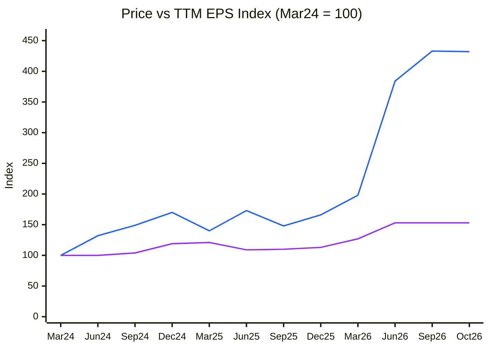
```mermaid
%%{init: {"themeVariables": {"xyChart": {"plotColorPalette": "#2563eb, #9333ea"}}}}%%
xychart-beta
    title "Price vs TTM EPS Index (Mar24 = 100)"
    x-axis [Mar24, Jun24, Sep24, Dec24, Mar25, Jun25, Sep25, Dec25, Mar26, Jun26, Sep26, Oct26]
    y-axis "Index" 0 --> 460
    line [100, 132, 149, 170, 140, 173, 148, 166, 198, 384, 433, 432]
    line [100, 100, 104, 119, 121, 109, 110, 113, 127, 153, 153, 153]
```
🟦 Price index · 🟪 TTM EPS index

**Read:** Until Mar 2026 price ran modestly ahead of EPS (index 198 vs 127). From April to October 2026 the price index **more than doubled (198 → 432)** while TTM EPS rose 20% (127 → 153). Since Mar 2024, price is up 4.3× and EPS 1.5×.

**Business inference:** Nearly all of the 2026 return is multiple expansion on the data-centre narrative, not earnings. Aeroflex's EPS growth (~25–35%/yr) is excellent for a manufacturer, but at this price it would take roughly 4–5 years of that growth just to get back to the stock's own historical ~50× multiple. Future returns depend on the theme staying fashionable as well as on delivery.

### C13 — Scenario Targets (2-yr, FY28E EPS × multiple; 13.23 Cr shares)

| Scenario | Driver | FY28E revenue | EBITDA margin | FY28E EPS | P/E | Target | Prob. |
|---|---|---|---|---|---|---|---|
| Bear | DC projects delayed; skid partner diversifies; hoses +15% | ₹620 Cr | 21% | ₹5.3 | 30× | **₹160** | 25% |
| Base | Guidance delivered; skids ~12,000/yr in FY28; hoses at 20 mn m | ₹800 Cr | 24% | ₹8.7 | 45× | **₹390** | 50% |
| Bull | International skid wins; capacity beyond 15,000; 25% margin | ₹1,000 Cr | 25% | ₹11.8 | 55× | **₹650** | 25% |
| **Expected value** | | | | | | **₹398** | |

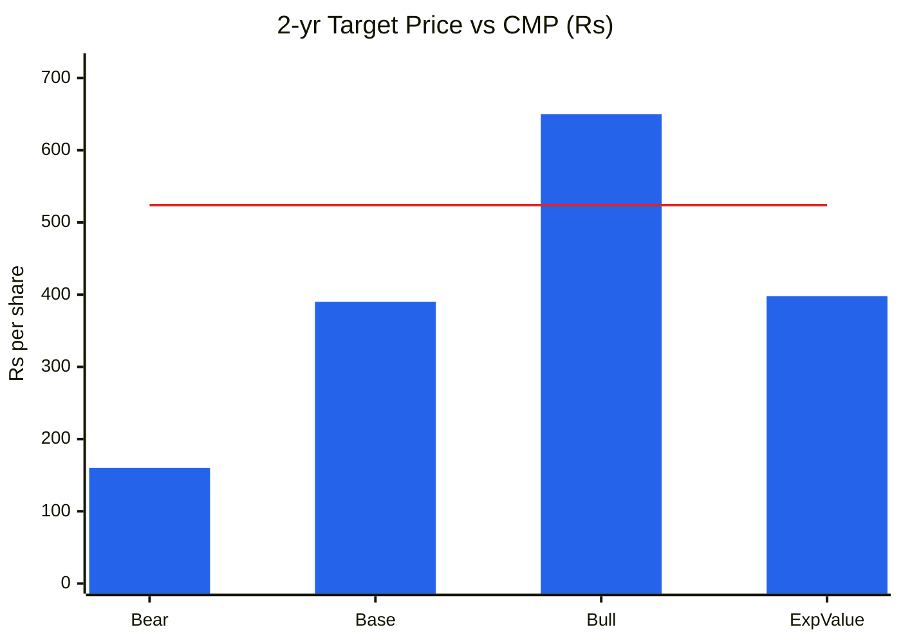
```mermaid
%%{init: {"themeVariables": {"xyChart": {"plotColorPalette": "#2563eb, #dc2626"}}}}%%
xychart-beta
    title "2-yr Target Price vs CMP (Rs)"
    x-axis [Bear, Base, Bull, ExpValue]
    y-axis "Rs per share" 0 --> 720
    bar [160, 390, 650, 398]
    line [524, 524, 524, 524]
```
🟦 Scenario price · 🟥 CMP ₹524

**Read:** Only the bull case is above the price (+24%). The base case is −26%, the bear case −69% and the expected value **−24%**. **U/D = 0.35:1**, so the hard stop applies. The base multiple (45×) is already generous: a premium to every metal-products peer and close to the stock's pre-theme median.

**Business inference:** Aeroflex can deliver its plan in full (revenue up 80% in two years, record margins) and the stock can still fall a quarter, because the price already discounts the bull case. The quality is real, which means the downside is a de-rating rather than a business failure. That is still a large loss, and the investor is not being paid for it.

### Cycle Position Dashboard

| Dimension | Current | Post-IPO median | Percentile | Signal |
|---|---|---|---|---|
| P/E | 103× | 50.7× | 96% | **Extreme** |
| P/B | 15.5× | 7.5× | 94% | **Extreme** |
| EBITDA margin | 23% | 20% (FY20–26) | ~90% | Structural high (mix), not a cyclical peak |
| ROCE | 19% (FY26) → ~20% run-rate | 24% (FY21–26) | ~35% | Mid (capex-diluted) |
| Asset turnover | 1.34× → ~1.8× run-rate | 1.68× | 15% → 70% | Filling |
| Capacity utilisation | Hoses 65%; skids ramping | — | — | Room to grow (to FY28) |
| **Overall cycle position** | | | | **EARLY-MID growth (operations) · PEAK (valuation)** |

**Graham number:** √(22.5 × 3-yr avg EPS ₹4.16 × BV ₹33.8) = **₹56**. **MoS:** −26% vs relative base, −75% vs base DCF → **Inadequate.**
**Misprice reason:** None for a buyer. The stock is **over**-priced by AI-theme momentum. **Catalyst for re-pricing:** Q2 FY27 results (early Nov 2026); 15,000-skid commissioning.

---

## Module 10 — Technical Stage (Weinstein + CANSLIM)

| Item | Reading (Screener, 9 Oct 2026) |
|---|---|
| Price | ₹524; 52-wk ₹158–584 |
| Path | ₹159 (23 Jan) → ₹253 (2 Apr) → ₹439 (8 May) → ₹411 (17 Jul) → ₹503 (21 Aug) → ₹526 (25 Sep) → ₹524 |
| 50-DMA / 200-DMA | ₹506 / ₹388, both rising; price 4% / 35% above |
| RS vs Nifty | Very strong (+206% 1-yr vs Nifty negative) |
| Institutions | FII 1.0 → 3.6%; DII 3.6 → 1.5% (selling) |

**Stage 2 (advancing), extended and consolidating** below the ₹584 high. The trend is intact, with no topping evidence. **Stop for holders:** weekly close < ₹440 (Jul swing low / 30-week MA zone).
**CANSLIM:** C ✓ (Q1 EPS +162%) · A ✗ (3-yr EPS CAGR ~20%, ROE 14–17%) · N ✓ (skids, new highs) · S ✓ (13.2 Cr shares) · L ✓ (leader by RS) · I ✗ (DIIs exiting) · M ✗ → **4 / 7.**

---

## Module 11 — Forward View: 2–3 Year Thesis

### Capex classification
| Capex type | FY27E | FY28E | FY29E | In AT model? |
|---|---|---|---|---|
| Skids (2,000 → 15,000; ₹48 Cr total, balance FY27) | ~20 | — | — | ✅ |
| Hoses (16.5 → 20 mn m; ₹54 Cr, balance FY27) | ~20 | — | — | ✅ |
| Chakan facility / fire-hose assemblies / bellows / automation | ~30 | ~50 | ~50 | ✅ |
| Further skid capacity (> 15,000; not announced) | — | ~20 | ~20 | ✅ (assumed in base) |
| Maintenance (≈ depreciation, partly) | ~10 | ~20 | ~20 | ❌ |
| **Total** | **~80** | **~90** | **~90** | |

**CWIP:** ₹23 Cr (Mar 2026), to be capitalised in FY27 with the Q3 commissioning.

### C14 — Gross Block → Revenue bridge (history + base case)

| ₹ Cr | FY22 | FY23 | FY24 | FY25 | FY26 | FY27E | FY28E | FY29E |
|---|---|---|---|---|---|---|---|---|
| Gross Block | 113 | 128 | 161 | 263 | 330 | 410 | 490 | 560 |
| Revenue | 241 | 269 | 318 | 376 | 442 | 620 | 800 | 950 |
| AT (×) | 2.13 | 2.10 | 1.98 | 1.43 | 1.34 | 1.51 | 1.63 | 1.70 |

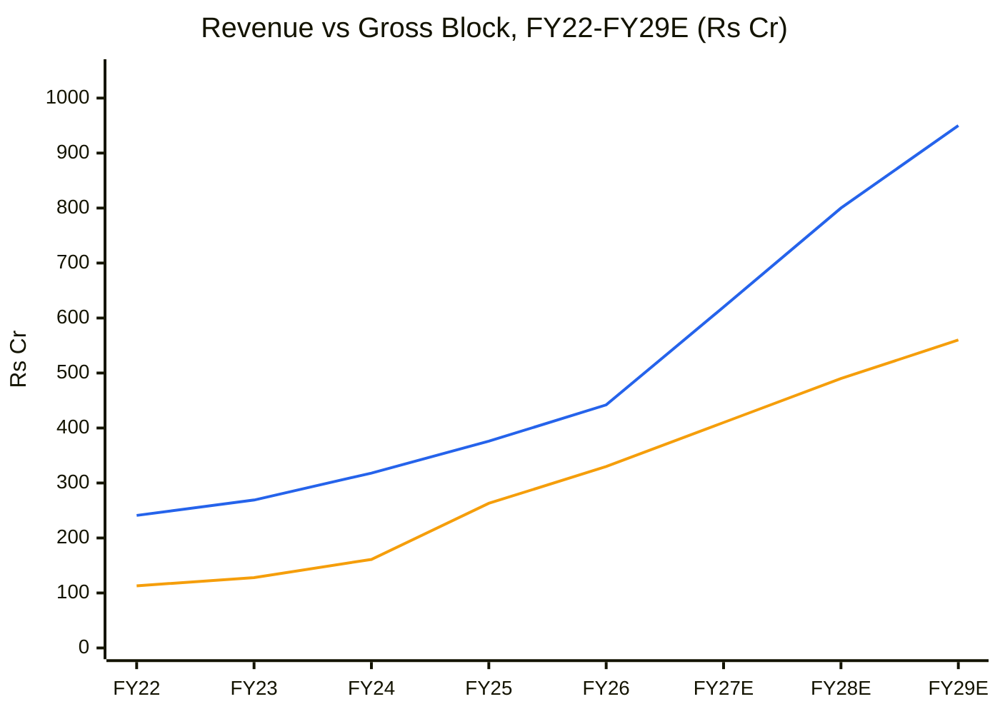
```mermaid
%%{init: {"themeVariables": {"xyChart": {"plotColorPalette": "#2563eb, #f59e0b"}}}}%%
xychart-beta
    title "Revenue vs Gross Block, FY22-FY29E (Rs Cr)"
    x-axis [FY22, FY23, FY24, FY25, FY26, FY27E, FY28E, FY29E]
    y-axis "Rs Cr" 0 --> 1050
    line [241, 269, 318, 376, 442, 620, 800, 950]
    line [113, 128, 161, 263, 330, 410, 490, 560]
```
🟦 Revenue · 🟧 Gross block

**Read:** The base case takes revenue from ₹442 Cr to ₹950 Cr (**2.1×**) on a 1.7× larger gross block, with AT recovering from 1.34× to 1.70× (the FY20–26 average). **Incremental ROIC:** ΔRevenue ~₹508 Cr × EBIT margin ~19.7% → ΔEBIT ~₹113 Cr × 0.75 ≈ ₹85 Cr NOPAT ÷ (capex ~₹260 Cr + WC ~₹150 Cr) ≈ **21% vs WACC 12% → value-creating**. Capex-model revenue CAGR FY26–29 is **29%** vs PIE-implied ~40% to FY31: the market prices capacity that has not been announced.

**Business inference:** Aeroflex's growth plan creates value. Every rupee it invests earns around 20%, which is why it deserves to trade at a premium. The plan roughly doubles revenue by FY29, in line with guidance and capacity. The stock price needs it to double twice more after that, so the gap between a good business and a good investment here is about three years of flawless execution.

### Base-case earnings
| ₹ Cr | FY27E | FY28E | FY29E |
|---|---|---|---|
| Revenue | 620 | 800 | 950 |
| EBITDA (margin) | 146 (23.5%) | 192 (24%) | 233 (24.5%) |
| D&A / Interest / Other income | 34 / 2 / 3 | 40 / 2 / 3 | 46 / 2 / 3 |
| PAT | ~85 | ~115 | ~142 |
| EPS (₹, 13.23 Cr sh) | 6.4 | 8.7 | 10.7 |
| ΔWC (30%) | ~54 | ~54 | ~45 |
| FCF | ≈ −10 to +10 | ≈ +30 | ≈ +60 |

**FCF inflection: FY28.** **Debt:** none needed (net cash).

### Key catalysts
1. **Q2 FY27 results (early Nov 2026):** revenue ≥ ₹160 Cr; skid revenue ≥ ₹40 Cr.
2. **15,000-skid capacity commissioned** (Oct–Nov 2026) and Q4 exit at ~750 skids/month.
3. **First international skid order** (guided "this financial year").
4. **Second domestic skid customer** (de-risks concentration).
5. Fire-hose assemblies for the US data-centre customer commercialised (Q2–Q3 FY27).

### Key risks
1. **Valuation de-rating** from 103× toward the ~50× pre-theme band even on good results: **High**.
2. **Skid customer concentration** (one Indian partner) and project-timing lumpiness: **Medium-High**.
3. **Competition** from global players (Parker, Senior) and new local entrants compressing skid pricing: **Medium**.
4. **Working capital** (debtor days creeping up with domestic skid sales): **Medium**.
5. **SS/nickel and freight costs** (West Asia): **Low-Medium** (pass-through demonstrated).

**Thesis:** Aeroflex is a well-run, debt-free, high-ROCE engineered-hose maker that has opened a real and growing data-centre cooling line. At ₹524 the market prices it as if the skid business will be many times its planned capacity within five years. Buy the quality after the multiple resets, not during the theme.

---

## Checklist Summary
**Section 0 (Existing Report Protocol):** ✓ (initial report)
**Section A (Business Quality):** 14 / 18 (scuttlebutt, RPT schedule, pledge not sourced; skid customer undisclosed)
**Section B (Forensics):** 7 / 9 (KAMs and RPT not reviewed; M-score estimated)
**Section C (Financial Statements):** 11 / 12 (7-year history only)
**Section D (KPIs & Peers):** 6 / 7 (new KPI block added with approval; no clean listed peer)
**Section E (Market Size & Share):** 5 / 7 (TAM derived from skids/MW × India GW; no third-party skid market data)
**Section F (Valuation):** 10 / 10
**Section G (Technical):** 7 / 8
**Section H (Forward View):** 22 / 28 (segment revenue/margin split partly disclosed)
**Section I (Charts):** 5 / 5 (CY5/CY6/CY8 not applicable/no sourced series; every chart has Read + Business inference; P/E and P/B bands use post-IPO history only)
**Order Book Tracker:** Not applicable (no disclosed order book; skid dispatch schedules 2–3 months ahead)
**Hard Stops Triggered:** **Upside/downside < 1.5:1** (0.35:1).

---

## Investment Decision
**Recommendation:** **AVOID at ₹524 (hard stop: U/D < 1.5:1) → WATCHLIST (Quality at Wrong Price)**
**Conviction Score:** 4.5 / 10 (Cycle 0.6 · Industry 0.8 · Moat 1.3 · Management 0.7 · Financial quality 1.6 · Valuation/PIE 0.0 · Technical 0.6; financial quality and growth economics are genuine strengths)
**Suggested Position Size:** 0% now; 2–3% in the buy zone.
**Entry Price Range:** **₹220–240** (U/D ≥ 2:1 vs ₹390 base / ₹160 bear needs ≤ ₹237; ≈ 26–28× FY28E base EPS; ≈ the stock's pre-theme ~50× on FY27E)
**Stop-Loss (existing holders):** weekly close < ₹440
**Target Price (Base, 2-yr):** ₹390
**Review Triggers:**
- *Upgrade:* a second skid customer or a material international skid order; capacity beyond 15,000 announced with customer commitments; price toward ₹250–300 with the ramp intact.
- *Further caution:* QoQ revenue decline; skid revenue < ₹30 Cr/qtr after 15,000 is commissioned; EBITDA margin < 21%; debtor days > 125.

---

## Data Sources & Citations
- [Screener.in — AEROFLEX consolidated](https://www.screener.in/company/AEROFLEX/consolidated/) (+ standalone for FY18–19): P&L, balance sheet, cash flow, ratios, fixed-asset/expense/investing/other-asset schedules, shareholding, P/E, P/B and price data (accessed 9 Oct 2026)
- [Aeroflex Q1 FY27 earnings call transcript (28 Jul 2026, BSE)](https://www.bseindia.com/xml-data/corpfiling/AttachHis/6401402c-a5ca-4785-87db-477dd4e8d73c.pdf)
- [ICICI Direct — Q1 FY27 revenue +72.4%](https://www.icicidirect.com/research/equity/trending-news/aeroflex-q1fy27-revenue-jumps-724-yoy-to-1454-crore) · [Sahi — Q1 FY27 standalone](https://www.sahi.com/news/aeroflex-industries-q1-standalone-net-profit-rises-to-191m-rupees-on-1-4b-revenue-3826-PE1_COR) · [Whalesbook — 30–35% growth guidance](https://www.whalesbook.com/news/English/industrial-goodsservices/Aeroflex-Industries-Projects-30-35percent-Growth-Led-by-Data-Centers/6a6893460622961329059071) · [Multibagg — FY26 results / Q1 call](https://www.multibagg.ai/market-pulse/articles/aeroflex-fy26-results-q1fy27-call-cms3bd3j48ysk0zjuth7s9fp3)
- IPO / promoter background: [Outlook Business](https://www.outlookbusiness.com/news/aeroflex-industries-gets-sebi-s-clearance-to-float-ipo-news-307439)
- India data-centre GW outlook: Morgan Stanley via [STL Q1 FY27 call](https://stl.tech/wp-content/uploads/2026/07/Transcript-July-24-2026.pdf)
- [StockPil — markets 5 Oct 2026](https://stockpil.com/india-markets-today-2026-10-05/)
- Peers: Screener.in peer table (9 Oct 2026)

**Remaining data gaps:** skid customer identity and concentration %, skid segment margin, pledge status, RPT schedule (Sat Industries / Aeroflex Enterprises group), cause of the Mar 2026 promoter stake reduction, Hyd-Air acquisition terms, FY26 annual-report KAMs.

---
*Report generated by Stock Fundamental Analysis Skill v3.3 | Indian Markets Context*
*Save path: C:\Users\anubh\Documents\Anubhav\Stock Analysis\Stock Analysis\*
*DISCLAIMER: For informational purposes only; not investment advice. FY27E–FY31E, DCF and scenario values are the analyst model's estimates.*
