# Stock Analysis Report — Arfin India Ltd (NSE: ARFIN | BSE: 539151)
**Date:** 2026-10-09
**Analyst:** Claude (Stock Fundamental Analysis Skill v3.1)
**Investment Horizon:** 2–3 Years
**CMP:** ₹107.5 | **Market Cap:** ₹1,814 cr | **TTM P/E:** 98× | **P/B:** 10.6× | **EV/TTM EBITDA:** 39×
**Recommendation:** AVOID
**Conviction Score:** 2 / 10

---

## Executive Summary
Arfin India is a Gujarat-based aluminium recycler. It turns imported and domestic scrap into deoxidiser, wire rod, alloy ingots, cored wire, ferro-titanium and conductors, mainly for steel plants. It is a low-value-add, working-capital-heavy commodity converter: 10-year ROE ~8%, ROCE ≈ its cost of capital, inventory days rising from 84 to 151, and fixed assets that grew 5.3× while revenue grew 2.2×. The stock is up 113% in a year and trades at 98× trailing earnings and 10.6× book, against a sector norm of 4–7× EV/EBITDA and ~1× book. A ₹300 cr contract and a strong Q1 (revenue +95%) are real, but even a bull case does not reach today's price. Several hard stops trigger, including U/D well below 1.5:1, so this is an Avoid despite a Stage 2 chart.

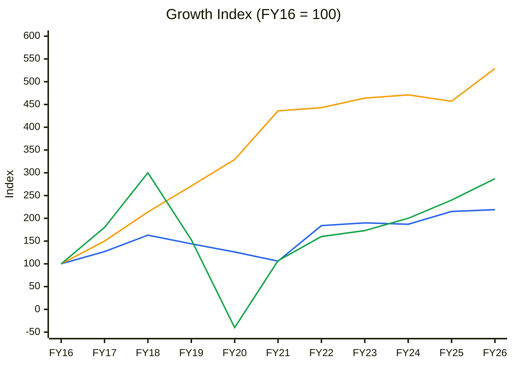
🟦 Revenue (CAGR 8.2%) · 🟧 Net Fixed Assets* (18.1%) · 🟩 EBITDA (11.1%). 🟪 PAT is omitted because its FY20 loss distorts the scale (PAT CAGR 7.2%).
*Standalone, Screener net block; the gross-block PPE note was not extracted.
**Read:** Fixed assets compounded at more than twice the rate of revenue for a decade, so asset turnover fell from 20× to 8×. **Each new rupee of capex earns far less revenue than the old.** EBITDA only modestly outgrew revenue, and FY18's peak (index 300) has not been regained in absolute margin terms.

---

## Business Primer

Arfin India (est. 1992, Chhatral, Gujarat; promoters Mahendra R. Shah and Jatin M. Shah) buys aluminium scrap, about half of it imported from Japan and Europe (CARE, Aug 2023). It melts the scrap into aluminium deoxidiser ("deox": notches, cubes, shots), aluminium wire rod, secondary alloy ingots for foundries, cored wire and ferro/master alloys (ferro-titanium, inoculants), plus AL-59 conductors and cables. Steel plants are the dominant end-market: about 63% of income in FY23, with automobiles at 24% and power/others the rest. The top five clients were ~54% of income (CARE). Revenue is tonnes × aluminium price-linked realisation, with steel-sector supply repriced quarterly. Installed capacity is 71,000 MTPA (FY26 annual report), and gross exports were ₹98 cr in FY26 (~16%). The business depends on (1) the spread between LME-linked scrap cost and domestic realisation, and (2) domestic steel production volumes.

This is a **pure commodity converter** with "limited value addition" (CARE's words). It has no pricing power, profitability swings with scrap and aluminium prices and the rupee, and roughly 4–5 months of inventory makes it working-capital-hungry. The key value driver is the volume × spread per tonne. The key risks are commodity margin compression and leverage on a thin equity base: interest consumes ~40–45% of EBITDA and ICR is only 1.7–2.3×. The structural features that colour the analysis are a speculative re-rating (stock +113% in 1 yr; retail holders 5,400 → 13,548 in 3 years while FIIs fell from 2.7% to 0.8%), a new subsidiary (Arfin Titanium & Speciality Alloys, incorporated Jan-2025, with a JFE Shoji / Toyo Denka supply collaboration) and a planned Medium Voltage Covered Conductor (MVCC) project.

**Segment check:** Near match to **Ferroalloys / Base Metals Manufacturing** ✓ (KPI reference line 696). It is used with scrap cost substituted for ore cost.

---

## Module 1 — Market, Sector & Stock Cycle

### 1a. Broad market
Nifty 22,232 (8-Oct-26): −13.5% YoY, at its 52-wk low, below a declining 30-wk MA (23,699). India VIX 15.3, up 34% in 4 weeks. **Assessment: Cautious → Fearful.** Sizing: small and defensive.

### 1b. Sector cycle — secondary aluminium / steel additives
- **Secular vs cyclical:** Steel output growth of ~7–8% (KPI reference: FY27 India steel demand) is the secular base for deox and cored wire. Q1FY27's +95% revenue jump is **largely cyclical/contract-driven**: the ₹300 cr order announced 19-Jun-26 equals 15–20% of annual revenue, with 2–3 quarters of visibility. Aluminium price inflation is also cyclical. **Durable baseline: ~8–10% volume growth.**
- **Input cost cycle:** Scrap is LME-linked; ~50% is imported and exposed to USD/INR. Rising aluminium prices help revenue optics but compress spreads when pass-through lags (quarterly repricing for steel customers). Q1FY27 OPM collapsed to **4.8% from 8.5%** in Q4FY26, the first sign of the spread squeeze.
- **Competitive capacity:** Fragmented, with many unorganised recyclers (CARE). Low barriers mean supply responds quickly to good spreads.
- **Geopolitics:** Middle East conflict and freight disruption (2026) affect imported-scrap logistics. **Transient.**
- **FX:** Imports ~50% of raw material vs exports ~16% of revenue → **net USD-short**. A 5% INR depreciation on ~₹250 cr of imported scrap is ~₹12 cr, about 25% of EBITDA, if not passed through.

**Sector verdict: NEUTRAL.** Steel demand is a tailwind, but there is spread volatility and no pricing power.
*CY5 (industry capacity vs demand) and CY6 (scrap–realisation spread / EBITDA per MT): not built. No sourced industry capacity series exists, and Arfin does not disclose volumes, so EBITDA/MT cannot be computed. **The absence of volume disclosure is itself a flag.** Rough cross-check: FY26 revenue ₹625 cr ÷ ~₹230–260/kg realisation ≈ 24–27k MT, implying **~35–40% utilisation of the 71,000 MT nameplate** (estimate, not sourced).*

### 1c. Stock cycle
| Quarter | Revenue ₹cr | YoY | EBITDA ₹cr | YoY | OPM |
|---|---|---|---|---|---|
| Q4FY25 | 153.4 | +12% | 6.6 | −21% | 4.3% |
| Q1FY26 | 108.9 | −18% | 6.6 | −27% | 6.1% |
| Q2FY26 | 127.9 | −14% | 9.4 | −3% | 7.3% |
| Q3FY26 | 188.0 | +4% | 13.9 | +27% | 7.4% |
| Q4FY26 | 193.2 | +26% | 16.3 | +148% | 8.5% |
| Q1FY27 | 212.8 | +95% | 10.2 | +54% | 4.8% |

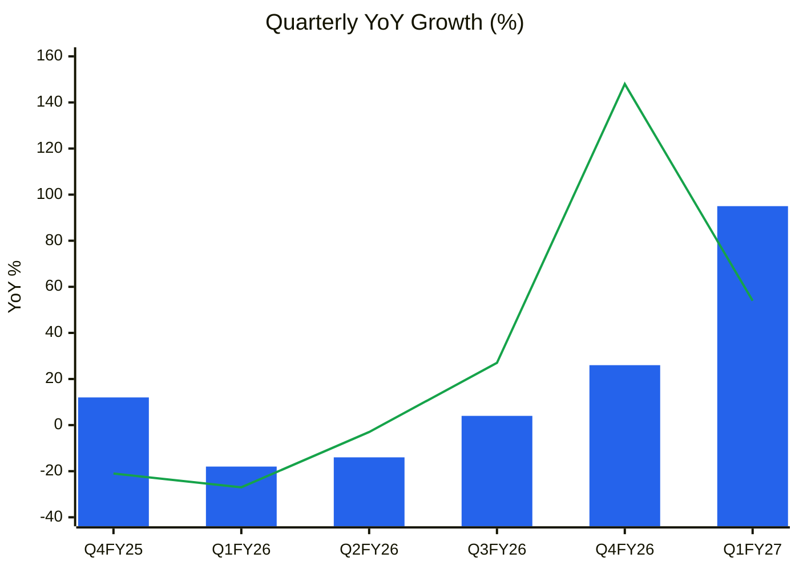
🟦 Revenue YoY % · 🟩 EBITDA YoY %
**Read:** Revenue growth is **accelerating** (contract-led), but EBITDA growth **peaked in Q4FY26** (+148%) and margin halved sequentially in Q1FY27. The new volume is lower-margin. The market is extrapolating the revenue line, not the margin line.

**Volume / price / mix:** Not decomposable, because no volume is disclosed. FY26 revenue was flat (+1.5%) while EBITDA rose 19%, so mix and spread drove FY26, and Q1FY27 is volume/contract-led at a thin spread. **Mix** (inoculants, AL-59 conductors, ferro-titanium via ATSAL) is the only durable lever, and it is small today.
**Operating leverage:** DFL = EBIT 40 / (40 − 19) = **1.9×**. A 10% EBIT miss becomes a ~19% EPS miss. **ICR** = 2.26× (FY25) → 1.72× (FY26, company-reported PBIT / finance cost; annual report key ratios). This is **< 2.5× → lender-behaviour risk → +5–10pp MoS.**
**Management guidance accuracy:** Insufficient data. There is one concall on record (Mar-2024) and no quantitative guidance.
**FCF inflection:** Not visible. Working capital absorbs growth (Module 11).
**Stock cycle classification: LATE CYCLE / MATURING on margins.** FY26 OPM of 6.9% is above its 10-yr average of 5.4% (within +1SD of 8.0%), and Q4FY26 at 8.5% was above +1SD. Revenue is accelerating on one contract. → +5–10% MoS, strict valuation discipline.

---

## Module 2 — Industry Structure & Capital Cycle
| Force | Assessment | Signal |
|---|---|---|
| New entrants | Furnaces are cheap; scrap trading is open. "Fragmented... numerous small and unorganised players" (CARE) | Low barriers ✗ |
| Supplier power | Scrap is a global commodity; imports are LME-priced | High ✗ |
| Buyer power | Steel majors are concentrated (top 5 = ~54% of income) and reprice quarterly | High ✗ |
| Substitutes | Alternative deoxidisers (Si, FeSi, CaSi) | Moderate |
| Rivalry | Price-driven | High ✗ |

**Industry verdict: UNATTRACTIVE** (structurally low returns). **Capital cycle:** neutral. No visible capacity flood, but Arfin itself raised equity in FY25 (₹52.5 cr preferential at ₹53.58) and keeps adding assets at a declining AT.

---

## Module 3 — Business Quality & Moat
- **Supply/cost advantage:** none. EBITDA margin of 4.6–7% over a decade, with no sustained edge.
- **Customer captivity:** weak. Supplier approvals at steel plants (BIS/quality), but the product is a commodity.
- **Local scale:** none.
- **Buffett 10% price test:** **Fail.** CARE: "limited pricing power".
- **Market share:** not disclosed; no trend can be built.

**Moat verdict: NONE.**
**Fisher 15-point:** Market potential 2 · New products 2 (inoculants, MVCC, ATSAL) · R&D 1 · Sales org 2 · Margin level 1 · Margin improvement 2 · Labour 2 · Exec relations 2 · Depth 1 (promoter-family led) · Cost controls 2 · Industry advantages 1 · Long-range 2 · Dilution 1 (equity raised FY17, FY18 and FY25) · Candor 1 (minimal disclosure: no volumes, one concall in 3 years) · **Integrity 2 (no SEBI/enforcement issues found; pass)** → **24 / 45**

---

## Module 4 — Management & Capital Allocation
**Promoter holding:** 74.11% (Sep-23) → **69.77%** (Jun-26), diluted via the Jun-24 preferential issue to non-promoters | **Pledge:** none disclosed → Normal

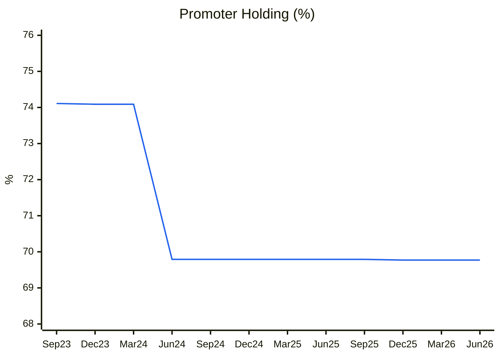
🟦 Promoter holding % (pledge 0% throughout)
**Read:** A one-step 4.3pp dilution (equity raise), flat since. Not promoter selling. Meanwhile **FIIs fell from 2.68% (Dec-25) to 0.79% (Jun-26)** while retail holders rose 9,081 → 13,548 in a year: smart money exiting into the rally.

**Share count:** diluting (FY15 ~11.5 cr → 16.8 cr equivalent shares).
**FCF vs EPS (10 yr):** cumulative FCF ≈ ₹0 (FY16–26: −7 −26 −30 −4 +18 +6 +8 +21 +1 −27 +19 = −21) vs EPS growth of 7%/yr. **Cash has never reached shareholders.** Payout is ~0–14%; an interim dividend of ₹0.12 was paid in Sep-26.
**Capital allocation rating: POOR.** A decade of asset growth at declining AT, ROE below cost of equity, and repeated equity raises.
**RPT:** Group company Krish Ferro Industries Pvt Ltd. Unsecured loans *from* directors and ICDs (~₹17–26 cr, annual report note on borrowings) are inflows, not leakage, but they show reliance on promoter funding. AOC-2 states no non-arm's-length transactions. **Flag: moderate. Krish Ferro transaction values not extracted.**
**Three C's:** Candor **Low** (no volumes, no guidance, sparse concalls) · Competence **Low** (ROCE ≈ WACC over 10 yrs; FY20 loss) · Caring **Low-moderate**.

### Walk the Talk
| Source | Statement | Actual | Verdict |
|---|---|---|---|
| CARE Aug-23 (company plan) | Inoculant plant (1,000 MT, ₹10 cr) | Inoculants launched in FY26 | ✅ (timing unclear) |
| Mar-24 board | ₹52.5 cr preferential issue | Completed (FY25 reserves +₹60 cr) | ✅ |
| Jun-26 | ₹300 cr contract: 2–3 qtrs of visibility | Q1FY27 revenue +95% | ✅ so far |
| CARE sensitivities | PBILDT > 7%, gearing < 1× | FY26 OPM 7.6% (company) / 6.9% (Screener); D/E 0.75× | ✅ FY26; ❌ Q1FY27 OPM 4.8% |
| FY26 AR | MVCC project "upcoming" | No timeline or capex disclosed | ⏳ selective disclosure |

**WTT score:** not reliably computable. Fewer than 6 quantified guidance points and no regular concalls → treated as **LOW** credibility.
**Key pattern:** **Selective disclosure.** It announces orders and contracts, but stays silent on volumes, spreads and capex.
**Insider action:** No promoter buying identified (Form C not retrieved). FIIs exiting → **BEARISH**.
**Management credibility: LOW-MODERATE.**

---

## Module 5 — Financial Forensics
| Model | Value | Interpretation |
|---|---|---|
| Beneish M (proxy, FY26) | **−3.47** | Unlikely manipulator. But DSRI is 0.58, i.e. receivables collapsed |
| Altman Z'' | 4.7 (FY26); 2.3–2.9 (FY22–24) | Safe now (equity raise); grey zone pre-FY25 |
| Piotroski F | **6 / 9** | Average. Fails leverage, current ratio, asset turnover |
| Sloan accrual | +2.2% (FY26); +12.1% (FY25) | Acceptable FY26; warning FY25 |
| 10-yr cumulative CFO / PAT | ₹67 / ₹81 = **0.83** | Medium quality (< 0.9) |

**Indian-specific / Schilit flags**
- 🔴 **Inventory days 84 (FY22) → 124 → 130 → 151 (FY26)**. The annual report's inventory turnover days went 70 → 132. Inventory rose to ₹223 cr vs ₹618 cr revenue. Either the build is for the ₹300 cr contract, or stock is slow-moving. **O'Glove #4.**
- 🟠 **Debtor days 36 → 31 → 18 (FY24–26)**, with the annual report showing 27 → 15. A sudden collapse in DSO is the Schilit CFS #1 pattern (bill discounting / factoring), and contingent liabilities include ₹10.9 cr of bank guarantees. *Verify whether receivables are discounted.*
- 🟠 Tax rate rose from 6% (FY22–23) to 36% (FY25–26) as earlier loss carry-forwards were used up. Reported PAT growth overstates the operating trend.
- Customs classification dispute of ₹0.4 cr (contingent, small).
- Auditor: Raman M. Jain & Co., Ahmedabad (small firm; term to 2027). No qualification or EoM found in the FY26 annual report ✓.

**Forensic red-flag count: 3 / 15** (inventory build, DSO collapse, CFO/PAT < 0.9). **Overall forensic verdict: MINOR-TO-SIGNIFICANT CONCERNS.**

---

## Module 6 — Earnings Quality & Financial Statements
**ROCE (pre-tax):** FY26 14.0% · 10-yr avg 14.9% (SD 8.8) | **WACC:** 13.5% | **ROE:** 10-yr avg ~8% (Screener). **Below the 14–15% cost of equity.**
**Post-tax ROIC** ≈ 14% × (1 − 0.33) ≈ **9–10% < WACC → value destroying**
**Economic profit:** negative across the decade except FY16–18

| Year | Revenue | EBITDA | OPM % | PAT % | ROCE % | ROE % | CFO | PAT |
|---|---|---|---|---|---|---|---|---|
| FY16 | 286 | 15 | 5.2 | 2.4 | 22.1 | 29.2 | −2 | 7 |
| FY17 | 363 | 27 | 7.4 | 3.6 | 28.1 | 23.6 | −22 | 13 |
| FY18 | 466 | 45 | 9.7 | 4.7 | 29.9 | 26.8 | −10 | 22 |
| FY19 | 413 | 23 | 5.6 | 1.7 | 11.7 | 8.1 | 13 | 7 |
| FY20 | 359 | −6 | −1.7 | −6.1 | −3.7 | −33.8 | 23 | −22 |
| FY21 | 303 | 16 | 5.3 | 1.3 | 9.1 | 5.9 | 11 | 4 |
| FY22 | 526 | 24 | 4.6 | 1.7 | 12.0 | 11.5 | 11 | 9 |
| FY23 | 544 | 26 | 4.8 | 1.8 | 12.8 | 11.4 | 29 | 10 |
| FY24 | 535 | 30 | 5.6 | 1.5 | 13.9 | 8.3 | 5 | 8 |
| FY25 | 616 | 36 | 5.8 | 1.5 | 13.9 | 5.7 | −21 | 9 |
| FY26 | 625 | 43 | 6.9 | 2.2 | 14.0 | 8.3 | 30 | 14 |
*(₹cr, standalone, Screener. ROCE = (PBT + interest) / average (equity + borrowings); ROE = PAT / year-end net worth)*

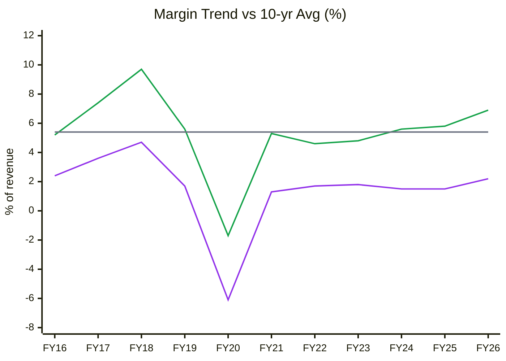
🟩 EBITDA margin · 🟪 PAT margin · ⬜ 10-yr avg EBITDA margin 5.4% (+1SD 8.0%, −1SD 2.8%)
**Read:** FY26 OPM of 6.9% is at the **80th percentile** of its decade. It is cyclically good, but Q1FY27 (4.8%) has already reverted below the average. PAT margin never exceeded 4.7%, and interest takes ~40% of EBITDA. This is the textbook cyclical P/E trap: **a high multiple on near-peak margins.**

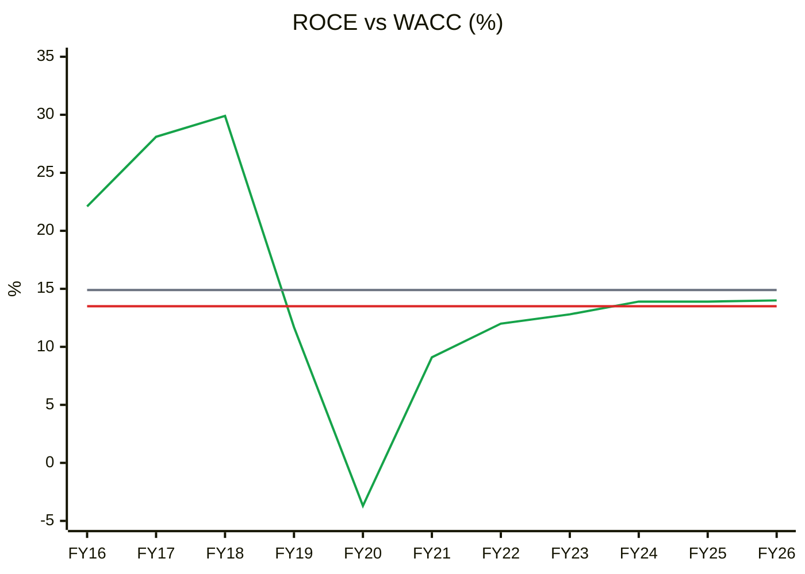
🟩 ROCE (pre-tax) · 🟥 WACC 13.5% · ⬜ 10-yr average 14.9%
**Read:** After the FY17–18 supercycle, pre-tax ROCE has hugged WACC (+0.5pp in FY26), so post-tax returns are **below** the cost of capital. Current ROCE is at the 10-yr average (~50th percentile). There is no moat-driven spread.

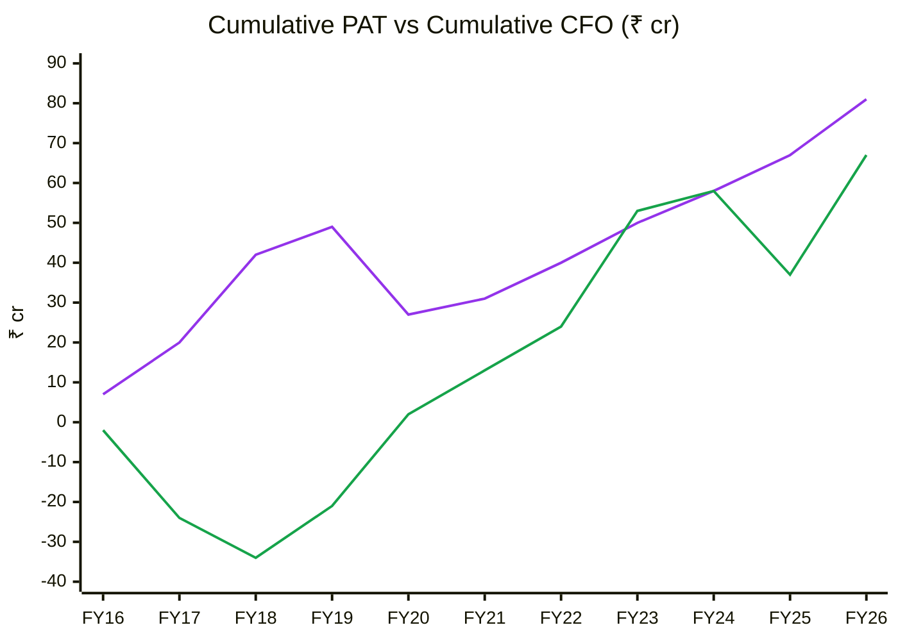
🟪 Cumulative PAT · 🟩 Cumulative CFO
**Read:** Cumulative CFO/PAT is **0.83** (medium). The lines converged in FY23–24, then diverged again in FY25 as inventory ballooned. Profits are only partly cash-backed.

| Year | Debtor days | Inventory days | Payable days | CCC |
|---|---|---|---|---|
| FY20 | 32 | 121 | 23 | 129 |
| FY21 | 51 | 168 | 72 | 147 |
| FY22 | 51 | 84 | 44 | 91 |
| FY23 | 38 | 89 | 49 | 78 |
| FY24 | 36 | 124 | 55 | 105 |
| FY25 | 31 | 130 | 45 | 116 |
| FY26 | 19 | 151 | 42 | 129 |

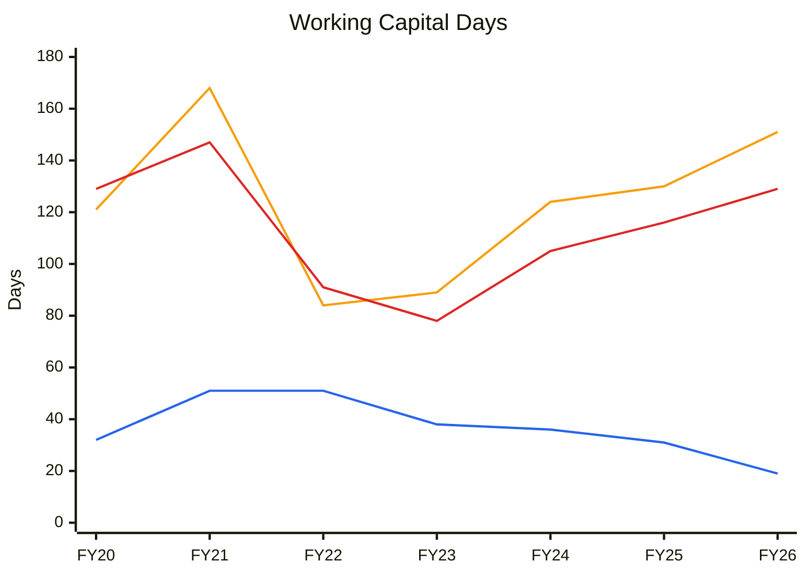
🟦 Debtor days · 🟧 Inventory days · 🟥 Cash conversion cycle
**Read:** The CCC has crept from 78 to 129 days in three years. Collapsing debtor days are **masking** a steep inventory build. Without the DSO drop, the CCC would be ~145 days, near CARE's 180-day downgrade trigger zone.

**DuPont (5-factor, consolidated FY22–26)**
| Year | EBIT margin | Asset turnover | Equity multiplier | Interest burden | Tax burden | ROE |
|---|---|---|---|---|---|---|
| FY22 | 4.2% | 2.13× | 3.17× | 0.45 | 0.90 | 11.5% |
| FY23 | 4.6% | 2.12× | 3.10× | 0.44 | 0.91 | 12.0% |
| FY24 | 5.4% | 1.94× | 3.00× | 0.34 | 0.80 | 8.7% |
| FY25 | 5.5% | 1.96× | 2.49× | 0.41 | 0.64 | 7.1% |
| FY26 | 7.0% | 1.73× | 2.19× | 0.56 | 0.62 | 9.2% |
| **Δ** | **+2.8pp** | **−0.40×** | **−0.98×** | +0.11 | **−0.28** | **−2.3pp** |

**Operating contribution** (EBIT margin × AT): 8.9% → 12.1%, improving on margin while **AT declines**. **Financing contribution:** falling (equity raise).
**DuPont verdict:** Margin gains were eaten by falling asset turnover and the end of the tax shield (tax burden 0.90 → 0.62). ROE is **stuck at 7–12%**, below the cost of equity, with or without leverage.
**AT trend → Module 11 base AT:** declining (2.1× → 1.7× total assets). Use the current level, not the historical one.
**O'Glove flags: 4 / 15** (inventory days, NI vs OCF in FY25, tax rate vs statutory in FY22–23, Sloan FY25).

---

## Module 7 — Industry KPIs & Peer Analysis
**Sector:** Ferroalloys / Base Metals (near match; KPI reference line 696)

| KPI | Arfin | Healthy range | Assessment |
|---|---|---|---|
| EBITDA/MT | **Not disclosed** (est. ₹16–18k/MT on ~25k MT) | ₹8–20k/MT | Cannot verify ⚠️ |
| Capacity utilisation | **Not disclosed** (est. 35–40% of 71,000 MT) | > 75% | Likely below the red flag (< 60%) ✗ |
| Working capital days | CCC 129 | < 90 | ✗ |
| Net debt / EBITDA | 124 / 46 = **2.7×** (FY26) | < 1.5× | ✗ |
| Export % | ~16% | 30–50% | Below ✗ |
| Other income / EBIT | 1 / 40 = 3% | < 20% | ✓ |

**Peer comparison** (KPI reference, Jun-2026 figures; no direct listed aluminium-deox pure play)
| Metric | Arfin | Maithan Alloys | IMFA | Balasore Alloys | Nava |
|---|---|---|---|---|---|
| P/B | **10.6×** | 0.84× | 1.0–1.3× | 0.7–1.0× | 1.0–1.5× |
| EV / op. EBITDA | **39×** (TTM) | ~3× | 5–7× | 4–6× | 5–8× |
| ROIC | ~9–10% | ~32% | 15–20% | 8–12% | 15–20% |

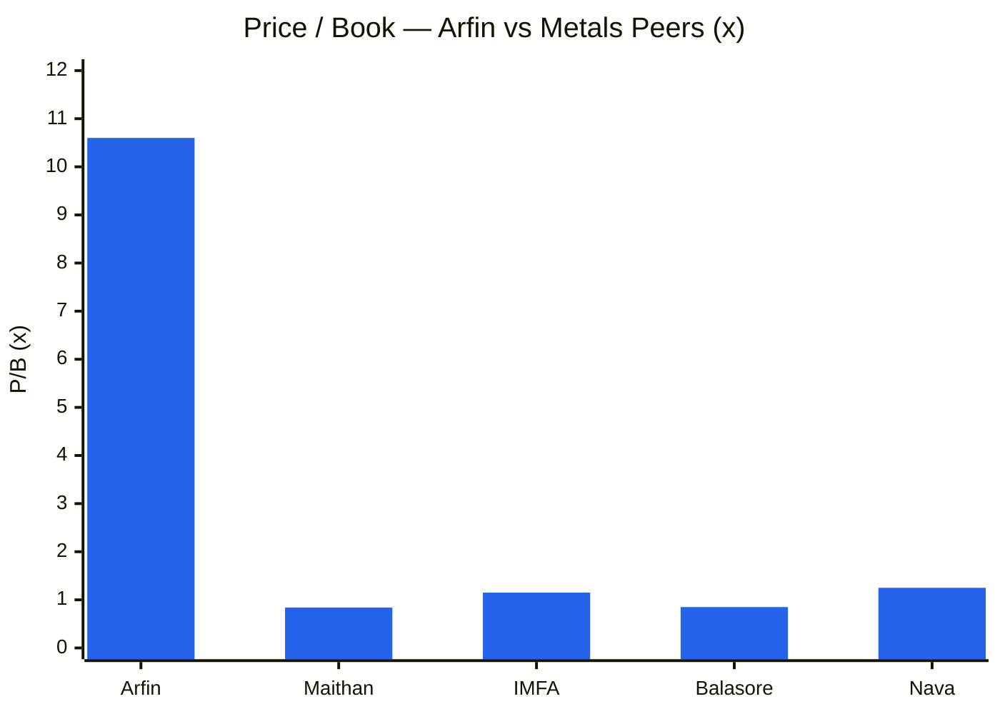
**Read:** Arfin trades at **~9× the P/B of peers that earn equal or higher returns**. Peer midpoints are taken from the KPI reference ranges. Nothing in its ROE (8%) justifies a premium. A justified P/B of (ROE 8% − g 6%) / (Ke 14% − g 6%) is **0.25×**.
**Peer positioning:** Extreme premium. **Not justified.**

---

## Module 8 — Market Size & Market Share
**TAM:** India secondary aluminium plus steel-additive aluminium. No authoritative sourced size was retrieved, so penetration cannot be computed.
**Market share / trend:** not disclosed.
**Revenue vs market:** 10-yr revenue CAGR is 8.2% vs nominal steel output growth of ~8–10%, so Arfin is **growing with the market at best**, without share gains.
**Verdict:** Growing with the market (unverified); the Module 8 checklist is largely unanswerable from disclosures.

---

## Module 9 — Valuation: PIE First, Then Intrinsic Value

### 9A. PIE (two-stage reverse DCF)
*EV ₹1,938 cr · TTM revenue ₹722 cr · NOPAT ₹33.5 cr (4.6%) · sales-to-capital 2.1× · WACC 13.5% · terminal 6%*

| Driver | Market-implied | My base | Gap |
|---|---|---|---|
| Revenue CAGR (5 yr) | **> 100% (unsolvable)** | ~10% | Extreme optimistic gap |
| NOPAT margin | 4.6% | 4.0% | −0.6pp |
| Incremental ROIC | 4.6% × 2.1 = **9.7% < WACC** | same | **Growth destroys value** |

**Key insight:** At Arfin's economics (incremental ROIC ~10% vs WACC 13.5%), **faster growth lowers intrinsic value**, so no growth rate justifies ₹1,938 cr of EV. The price only works if *both* margins roughly double (~9%+ NOPAT) and capital turns improve. That is a business-model change the company has never shown.
**Physical plausibility:** Even 100% utilisation of 71,000 MT at ₹250/kg is ~₹1,775 cr of revenue. At a peak-cycle 9.7% OPM (FY18) that gives ~₹172 cr EBITDA and ~₹95 cr PAT, i.e. EPS ₹5.6. Today's ₹107.5 price is **19× that never-achieved blue-sky EPS**.
**Expectations treadmill:** Arfin would need to treble EBITDA *and* sustain it to merely earn its cost of capital at this price.
**Triggers:** Positive: MVCC/ATSAL margins and volume disclosure, a sustained OPM > 9%. Negative (likely): spread normalisation (already visible in Q1FY27), working capital/debt rising, contract completion after 2–3 quarters.
**SVAR:** downside (no-growth EPV) value ≈ ₹7 → **SVAR > 90%**.

### 9B. Intrinsic value
| Method | Bear | Base | Bull |
|---|---|---|---|
| DCF (incremental ROIC < WACC → ≈ EPV) | ₹5 | ₹7 | ₹15 |
| Relative: P/B on justified 0.5 / 1.5 / 3× BV ₹10.1 | ₹5 | ₹15 | ₹30 |
| Relative: P/E 15 / 25 / 35× on FY28E EPS ₹1.33 / bull ₹2.9 | ₹20 | ₹33 | ₹102 |
| **Consensus range** | **₹10** | **₹18** | **₹49** |

**CMP ₹107.5 vs base ₹18 → ~6× intrinsic. MoS gate FAILS decisively.**
**Graham Number:** √(22.5 × 5-yr avg EPS ₹0.61 × BVPS ₹10.1) = **₹11.8**
**Reverse DCF implied growth:** not achievable (aggressive)
**Misprice reason:** momentum and retail speculation (holder count 2.5× in 3 years); an "order win" narrative; a small free float (~30%).

**P/E band (10 yr; FY20 excluded because EPS < 0, so the chart starts FY21 to avoid a gap)**
| | FY21 | FY22 | FY23 | FY24 | FY25 | FY26 | Oct-26 (TTM) |
|---|---|---|---|---|---|---|---|
| March price ₹ | 5.24 | 16.02 | 20.04 | 51.18 | 27.25 | 72.91 | 107.5 |
| EPS ₹ | 0.25 | 0.58 | 0.65 | 0.52 | 0.54 | 0.81 | 1.10 |
| P/E | 21.0 | 27.6 | 30.8 | 98.4 | 50.5 | 90.0 | 98.2 |
*FY16–FY19 P/E: 4.7, 15.3, 28.3, 43.9. 10-yr median (excl. FY20) 29.6×, +1SD 58.9×; the −1SD value is ~0, so the 10-yr low of 4.7× is used as the floor.*

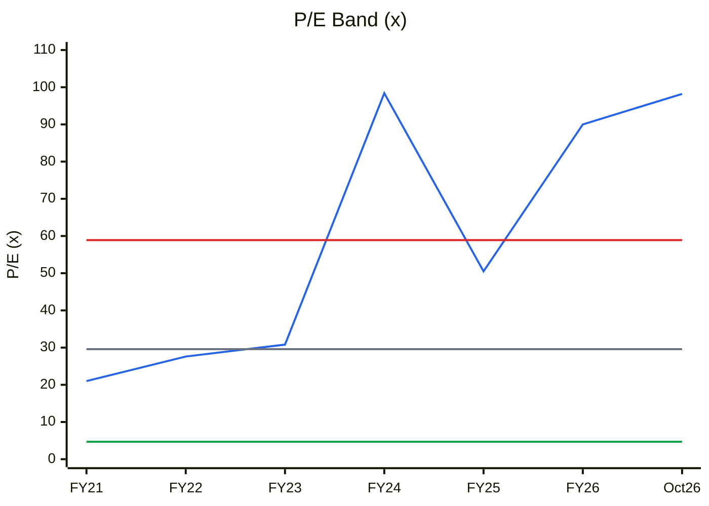
🟦 P/E · ⬜ Median 29.6× · 🟥 +1SD 58.9× · 🟩 10-yr low 4.7×
**Read:** At 98×, P/E sits at the **~95th percentile** of its own decade, more than 3× the median, *and* it is on near-peak margins. That is a double-peak (peak multiple × peak margin).

| | FY16 | FY17 | FY18 | FY19 | FY20 | FY21 | FY22 | FY23 | FY24 | FY25 | FY26 | Oct-26 |
|---|---|---|---|---|---|---|---|---|---|---|---|---|
| BVPS ₹ | 2.09 | 3.77 | 5.11 | 5.04 | 4.02 | 4.25 | 5.03 | 5.72 | 6.24 | 9.42 | 9.78 | 10.1 |
| P/B | 1.36 | 3.62 | 7.60 | 3.57 | 0.76 | 1.23 | 3.18 | 3.50 | 8.20 | 2.89 | 7.46 | 10.64 |
| ROE % | 29.2 | 23.6 | 26.8 | 8.1 | −33.8 | 5.9 | 11.5 | 11.4 | 8.3 | 5.7 | 8.3 | — |

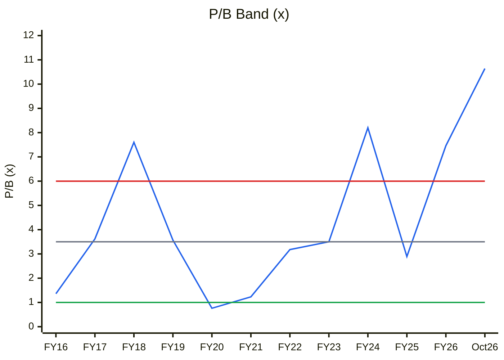
🟦 P/B · ⬜ Median 3.5× · 🟥 +1SD 6.0× · 🟩 −1SD 1.0×
**Read:** P/B of 10.6× is at the **100th percentile**, above the FY18 supercycle peak (7.6×) and FY24 (8.2×). Both of those peaks were followed by drops of −50% to −90% (FY19–20, FY25).

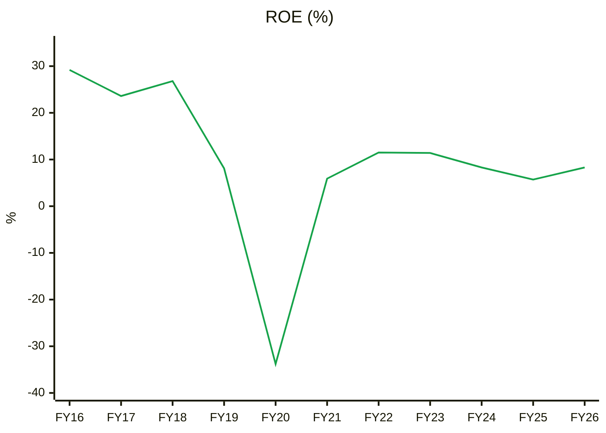
🟩 ROE
**Read:** P/B is at a decade high while ROE (8.3%) is **below** its 10-yr average (~11%). That is the inverse of what a re-rating needs.

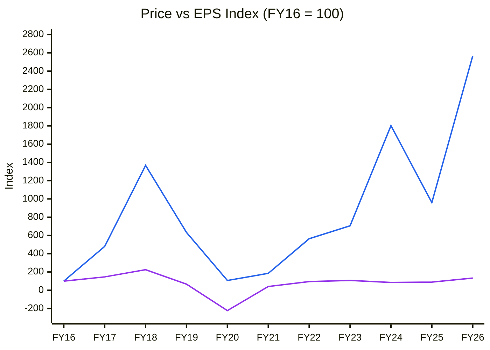
🟦 Price index (March close) · 🟪 EPS index
**Read:** Price is up 25.7× and EPS 1.3× over 10 years. **Essentially all of the return is multiple re-rating**, borrowed from the future, with high mean-reversion risk.

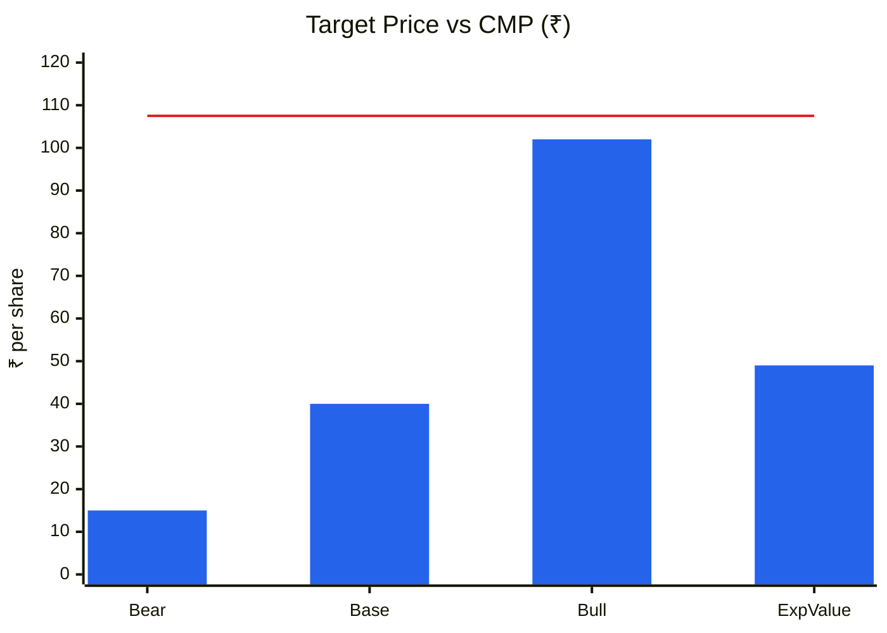
🟦 Scenario price (2-yr exit multiple; Module 11) · 🟥 CMP ₹107.5
**Read:** Even the bull case (₹102) is **below** CMP. Expected value is ₹49 (−54%), and **U/D is effectively 0:1**.

### Cycle Position Dashboard
| Dimension | Current | 10-yr median | Percentile | Signal |
|---|---|---|---|---|
| P/E | 98× | 29.6× | ~95% | **Very expensive** |
| P/B | 10.6× | 3.5× | 100% | **Very expensive** |
| EBITDA margin | 6.9% (FY26) / 4.8% (Q1FY27) | 5.4% avg | 80% (FY26) | Late cycle → rolling over |
| ROCE | 14.0% | 13.9% | ~50% | Mid |
| Utilisation | est. 35–40% | n/a | — | Under-utilised |
| Spread / realisation | n/a (not disclosed) | — | — | Q1FY27 compression |
| **Overall cycle position** | | | | **Late** (margins past peak; valuation at extreme) |
Consistent with Module 1c (Late cycle) and Module 1b (Neutral) ✓

---

## Module 10 — Technical Stage
| Item | Reading |
|---|---|
| Nifty stage | **Stage 4** |
| Sector (Nifty Metal) | Not retrieved |
| Stock stage | **Stage 2 (advancing).** ₹107.5 vs **rising** 30-wk SMA ₹90.2 (₹86.7 five weeks ago); 52-wk range ₹50.1–112.7 |
| Breakout | Jumped from the ₹84–90 base to ₹103–108 in the last 2 weeks |
| RS vs Nifty | Strongly positive (+112.9% vs −13.5% over 52 wks) |
| Volume | 4-wk average 12.8m vs 20-wk average 10.1m (+27%). **Below the 40–50% confirmation threshold** |
| Stop (for traders) | ₹89 (base top / 30-wk MA) |

**CANSLIM:** C 1 (Q1 EPS +277%) · A 0 (3-yr EPS CAGR ~10%, ROE 8%) · N 1 (52-wk high, new contract) · S 0 (volume not ≥ 1.5×; retail-driven) · L 1 · I 0 (FIIs exiting) · M 0 → **3 / 7**
**Stage + fundamentals:** **Misaligned.** This is a momentum Stage 2 in a Stage 4 market with no fundamental support.

---

## Module 11 — Forward View: 2–3 Year Thesis

### Capex & asset base
| Item | FY27E | FY28E | FY29E | Note |
|---|---|---|---|---|
| Growth capex (MVCC, ATSAL) | 10 | 5 | 5 | No disclosed project costs. Assumption |
| Maintenance (≈ depreciation) | 5 | 5 | 5 | |
| **Total capex** | **15** | **10** | **10** | CWIP at FY26 = ₹0 (Screener), so no committed pipeline |

| Year | Net fixed assets (₹cr) | Revenue (₹cr) | Revenue / NFA (×) |
|---|---|---|---|
| FY22 | 62 | 526 | 8.5 |
| FY23 | 65 | 544 | 8.4 |
| FY24 | 66 | 535 | 8.1 |
| FY25 | 64 | 616 | 9.6 |
| FY26 | 74 | 625 | 8.4 |
| **5-yr avg** | | | **8.6×** (vs 20× in FY16) |

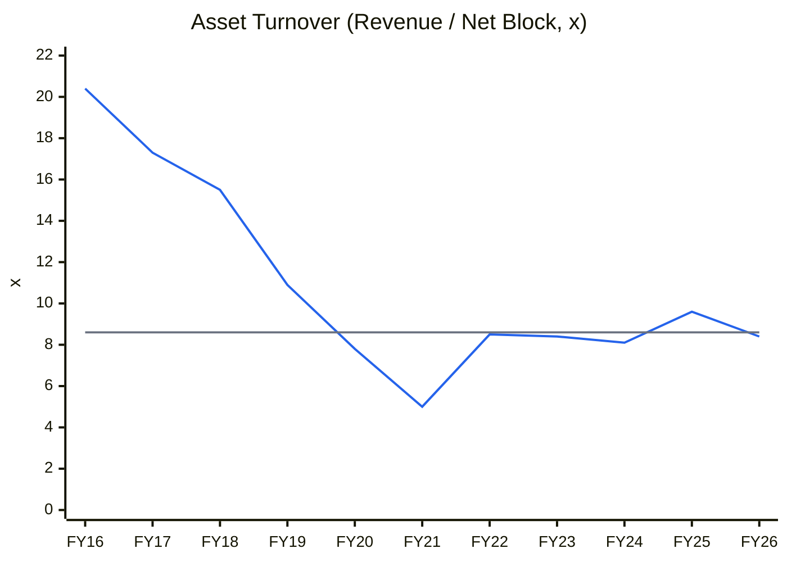
🟦 Revenue / Net Block · ⬜ 5-yr average 8.6×
**Read:** Turnover has been stable at ~8.5× for five years after a structural collapse from 20×. That puts the **base case at 8.6×, the bull case at ~10× (FY25 high) and the bear case at 8×**. Revenue growth needs volume from already-installed (under-utilised) capacity, not new capex.

**Incremental ROIC:** FY21→FY26, Δrevenue ₹322 cr × EBIT margin ~6% × 0.67 ≈ ₹13 cr NOPAT ÷ (Δfixed assets ₹13 cr + Δworking capital ~₹110 cr) ≈ **~10% < WACC 13.5% → VALUE-DESTROYING**. This feeds the Module 4 capital-allocation rating of POOR.

### Earnings model (base)
| Metric | FY27E | FY28E | FY29E |
|---|---|---|---|
| Revenue (₹cr) | 820 | 900 | 980 |
| EBITDA margin | 6.5% | 6.5% | 6.5% |
| EBITDA | 53 | 58.5 | 64 |
| D&A | 6 | 7 | 7 |
| EBIT (incl. other income ₹1 cr) | 48 | 52.5 | 58 |
| Interest | 19 | 19 | 19 |
| **ICR (×)** | **2.5×** ⚠️ | 2.8× | 3.1× |
| PBT | 29 | 33.5 | 39 |
| PAT (33% tax) | 19.4 | 22.4 | 26.1 |
| EPS (₹, 16.83 cr shares) | 1.15 | 1.33 | 1.55 |
| ΔWorking capital (CCC 129 days ≈ 35% of Δrevenue) | −70 | −28 | −28 |
| Capex | −15 | −10 | −10 |
| **FCF (₹cr)** | **−60** | **−9** | **−5** |
| Debt / EBITDA | **3.6×** ⚠️ | 3.4× | 3.1× |

**FCF inflection:** not within the horizon. **Debt ceiling: COVENANT RISK.** Peak debt is ~₹190 cr = 3.6× EBITDA in FY27E (> 3.0× flag). CARE's earlier downgrade trigger was TD/PBILDT > 6×; CRISIL now rates it BBB/Stable (Jun-2026).

### Catalysts
1. Execution of the ₹300 cr contract: Q2–Q3FY27 (revenue optics only)
2. ATSAL / JFE Shoji–Toyo Denka speciality alloy exports: FY27–28
3. MVCC commissioning: timeline undisclosed
4. Any volume / EBITDA-per-tonne disclosure that would enable valuation on fundamentals

### Risks
1. **Valuation mean-reversion** (P/B 10.6× vs 3.5× median; prior peaks fell 50–90%): **High**
2. **Spread compression** (Q1FY27 OPM 4.8%): **High**
3. Working capital/debt spiral (inventory 151 days, ICR ~2×): **Medium-High**
4. Steel-cycle slowdown (steel ~63% of revenue): **Medium**
5. FX on ~50% imported scrap: **Medium**

### Scenario analysis (AT-driven; exit ~Sep-2028 on FY29E EPS)
| Scenario | AT (rev / NFA) | Revenue FY29E | EBITDA margin | EPS FY29E | Exit multiple | Target | Prob. |
|---|---|---|---|---|---|---|---|
| Bull | ~11× + contract renewals | ₹1,150 cr | 8.0% | ₹2.92 | 35× | **₹102** | 25% |
| Base | 8.6× (5-yr avg), utilisation-led | ₹980 cr | 6.5% | ₹1.55 | 25× | **₹40** | 50% |
| Bear | 8× | ₹800 cr | 5.0% | ₹0.58 | 1.5× P/B | **₹15** | 25% |
| **Expected value** | | | | | | **₹49** | |

**Return from CMP (expected value):** **−54%**

---

## Checklist Summary
**Section A:** 13 / 18 (no concalls to score WTT; Form C not checked) · **B:** 8 / 9 · **C:** 11 / 12 · **D:** 5 / 7 (no direct peers; no volume KPI) · **E:** 3 / 7 (TAM/share undisclosed) · **F:** 10 / 10 · **G:** 7 / 8 · **H:** 20 / 28 (no capex/CWIP disclosure) · **I:** 4 / 4. Includes C1, C2, C4, C5, C6, C7, C8, C9, C12, C13, CY1, CY2 (+ROE), CY4, CY7; CY5/CY6 not sourced, stated.
**Hard stops triggered:**
1. ❌ **Upside/downside < 1.5:1.** Even the bull case is below CMP.
2. ❌ **ROIC < WACC** on a post-tax basis through most of the decade (FY19–26), with no turnaround evidence (Q1FY27 margin reverting).
**Pre-buy check:** Fails on valuation, the margin of safety, the "why mispriced" test (retail momentum, not a forced seller), and the market stage.

---

## Investment Decision
**Verdict: AVOID**
**Conviction score:** 2 / 10 (cycle 0 · industry 0 · moat 0 · management 0.5 · financial/earnings 0.5 · valuation 0 · technical 1)
**Suggested position size:** 0%
**Re-look price:** below **₹25** (~2.5× book, ~20× normalised EPS), *and* only with volume/spread disclosure
**If already holding:** this is a momentum stock in a Stage 4 market. Consider exiting into strength; any weekly close below ₹89 confirms a failed breakout.
**Target price (base, 2-yr):** ₹40 (exit multiple) / ₹18 (blended intrinsic)
**Review triggers:** sustained OPM > 9% with disclosed volumes; CCC < 90 days; ROE > 15% for 2 years. Without those, the price is untethered from the business.

---
*Sources: Screener.in (standalone and consolidated, accessed 9-Oct-2026); Arfin India Annual Report FY2025-26 (BSE); CRISIL Ratings credit bulletin (29-Jul-2026; rationale 26-Jun-2026); CARE Ratings press release (4-Aug-2023); Sahi / ScanX news on the ₹300 cr contract (19-Jun-2026) and Q1FY27 results; Yahoo Finance prices (monthly and weekly, to 8-Oct-2026); Stock-fundamental-analysis KPI reference (Ferroalloys block, peer multiples Jun-2026).*
*Report generated by Stock Fundamental Analysis Skill v3.1 | Indian Markets Context*
*Save path: C:\Users\anubh\Documents\Anubhav\Stock Analysis\Stock Analysis\*
