# Stock Analysis Report — Arihant Foundations & Housing Ltd (BSE: 531381 | Screener: ARIHANT)
**Date:** 2026-10-09
**Analyst:** Claude (Stock Fundamental Analysis Skill v3.1)
**Investment Horizon:** 2–3 Years
**CMP:** ₹940 | **Market Cap:** ₹1,021 cr (1.086 cr shares post warrant conversion) | **TTM P/E:** 15× | **P/B:** 2.5× | **P/NAV (base):** ~1.14×
**Recommendation:** AVOID at current price (watchlist for re-entry)
**Conviction Score:** 3.5 / 10

---

## Executive Summary
Arihant is a 40-year-old Chennai developer that runs ~95% of its projects as joint developments with landowners. After a lost decade (FY14–FY22 losses; ROE 10-yr avg ~4%), it has turned around sharply: revenue went from ₹64 cr to ₹420 cr in three years, FY26 pre-sales hit a record ₹514 cr, and it formed a JV with Prestige Estates (Padi, ₹5,000 cr GDV). The turnaround is real, but it has been re-priced from 0.2× book to 2.5× book (a 25× price move in 3 years). It is now debt-funded (net debt ₹288 cr, 3.5× higher YoY) and carries governance overhangs: 37% promoter holding, a web of 15 related LLPs/companies, a tiny auditor, a new profit-commission for promoters, and an unexplained Q4FY26 profit collapse. At ~1.1× our base NAV and with U/D below 1:1, the margin of safety is absent.

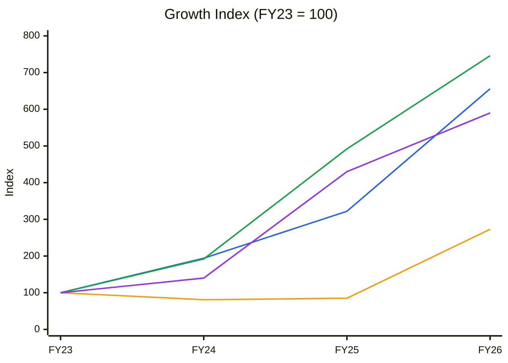
🟦 Revenue (CAGR 87%) · 🟧 Borrowings (40%) · 🟩 EBITDA (96%) · 🟪 PAT (81%)
*Base FY23 is the first year with positive PAT and EBITDA. Gross block is immaterial for a JD developer (₹21 cr), so it is replaced by Borrowings as the capital series.*
**Read:** Operating leverage is strong (EBITDA above revenue above PAT), but **borrowings nearly tripled in FY26 alone** (index 85 → 273) to fund the Padi land JV. The growth phase has moved from self-funded to debt-funded.

---

## Business Primer

Arihant Foundations & Housing (Chennai; promoters Kamal and Vimal Lunawath) develops residential apartments, Grade-A offices, plotted layouts and organised senior housing, all in Chennai. About 95% of developments are **joint developments (JDAs)**: landowners contribute land in return for a share of built-up area or revenue. Arihant therefore needs little land capex, but it keeps only its economic share of GDV (₹6,094 cr of ₹11,388 cr total GDV; Q1FY27 investor presentation). Revenue is recognised on percentage-of-completion/handover under Ind AS 115 from apartment and office sales to retail buyers and corporates; it has also sold completed commercial assets (Equitas Tower, 2024). The ongoing portfolio is 74% luxury residential and plotted, 13% commercial and 13% senior living (with Ashiana). The economics depend on (1) Chennai residential absorption and pricing (average city price up 7% to ₹5,135/sqft, FY26 annual report) and (2) the ability to fund approvals, construction and now land (Padi) without stressing the balance sheet.

This is an **asset-light-by-design but cyclical real-estate developer**, so the value drivers are pre-sales velocity × realisation × margin on its share of GDV, and collections that convert bookings into cash. The key risks are leverage plus collection slippage, and governance: a small promoter stake (37.3%), many related-party SPVs, and a history of losses and old Companies Act proceedings. Two structural features colour the analysis. First, a **step change in scale and risk via the Prestige JV** (Canopy Living LLP, Padi, 16.33 acres, ₹5,000 cr GDV, Arihant share ₹2,500 cr), funded mostly with debt: ₹179 cr already invested in Canopy LLP at 31-Mar-26. Second, a **lumpy, recognition-driven P&L**: quarterly margins swing from 8% to 37%.

**Segment check:** Real Estate ✓ (KPI reference line 325)

---

## Module 1 — Market, Sector & Stock Cycle

### 1a. Broad market
Nifty 22,232 (8-Oct-26): −13.5% YoY, at its 52-wk low, below a declining 30-wk MA. VIX 15.3, up 34% in 4 weeks. **Assessment: Cautious → Fearful.** Rate-sensitive sectors such as realty typically lead declines in Stage 4 markets. **Sizing:** small.

### 1b. Sector cycle — Chennai residential / office
- **Secular:** Tamil Nadu GSDP growth of 11.2%; 305 GCCs (213k professionals); ~9.1 mn sqft of Chennai office leasing (CY25); a #1 rank in electronics exports; data-centre build-out (company presentation, FY26 AR). Chennai is under-penetrated vs Mumbai and Bengaluru in branded developers. **Secular demand ~10–12%** in value terms.
- **Cyclical:** The national FY23–FY25 housing upcycle (premium segment) normalised from FY26 (KPI reference). Part of Arihant's growth comes from catching up on a decade of under-execution, which is not repeatable at this rate.
- **Supply:** Large national developers (Prestige, Brigade, Godrej, Casagrand locally) are expanding in Chennai. Arihant is partnering rather than competing (the Prestige JV).
- **Rates:** RBI cut cycle tailwind; but Nifty in Stage 4 points to a weakening risk appetite.

**Sector verdict: NEUTRAL-TO-TAILWIND** (Chennai structural, national cycle normalising).
*CY5/CY6 (Chennai supply vs absorption; price cycle): sourced multi-year series were not retrieved, so they are omitted.*

### 1c. Stock cycle
| Quarter | Revenue ₹cr | YoY | EBITDA ₹cr | YoY | OPM |
|---|---|---|---|---|---|
| Q3FY25 | 52 | +62% | 18 | +38% | 34% |
| Q4FY25 | 67 | +49% | 17 | +325% | 25% |
| Q1FY26 | 83 | +113% | 22 | +57% | 26% |
| Q2FY26 | 88 | +83% | 24 | +50% | 27% |
| Q3FY26 | 102 | +96% | 27 | +50% | 27% |
| Q4FY26 | 148 | +121% | 11 | −35% | **8%** |
| Q1FY27 | 134 | +61% | 36 | +64% | 27% |

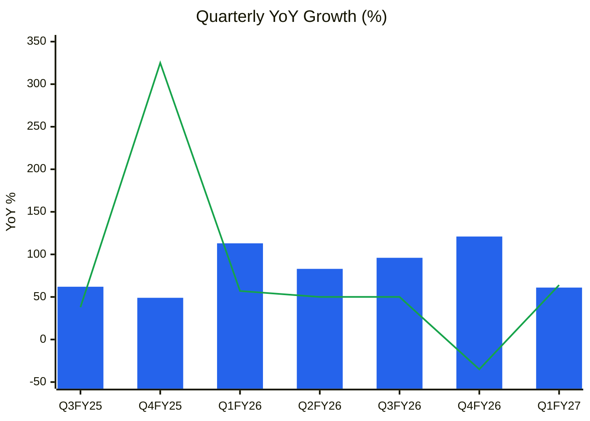
🟦 Revenue YoY % · 🟩 EBITDA YoY %. Q2FY25 (+433% on a ₹9 cr base) is excluded so the scale stays readable.
**Read:** Revenue growth is **strong but decelerating** (+121% → +61%). EBITDA is lumpy: the Q4FY26 collapse (OPM 8%, PAT ₹4 cr, tax 50%) had **no explanation in any filing or summary we found**.

**Pre-sales / collections**
| Period | Pre-sales ₹cr | Area sold (sqft) | Collections ₹cr | Collections / pre-sales |
|---|---|---|---|---|
| FY25 | ~401 (implied from +28%) | ~3.31 lakh (implied) | ~241 (implied from +49%) | ~60% |
| FY26 | 513.7 (+28%) | 5.69 lakh (+72%) | 359.6 (+49%) | **70%** |
| Q1FY26 | 99 | 94,671 | — | — |
| Q1FY27 | 168 (+69%) | 1,45,281 (+53%) | 69 | **41%** ⚠️ |
*(Company FY26 AR, Q1FY27 presentation; FY25 back-calculated from reported growth rates)*

**Realisation:** FY26 ₹9,030/sqft (513.7 cr / 5.69 lakh); Q1FY27 ₹11,560/sqft. **Mix shift to luxury** (Mehek, Park Street, Here & Now).
**Operating leverage:** DFL = EBIT 107 / (107 − 25) = 1.3× (FY26). It will rise as Padi debt costs hit the P&L once capitalisation ends.
**FCF inflection:** not in sight while the Padi land and construction phase runs (FY27–FY29).
**Stock cycle classification: EARLY-TO-MID CYCLE (turnaround ramp).** Margins are near average (25% vs a 3-yr avg of 25%); revenue is accelerating; the balance sheet is now expanding.

---

## Module 2 — Industry Structure & Capital Cycle
| Force | Assessment | Signal |
|---|---|---|
| New entrants | RERA, approvals and landowner trust form barriers. JDA relationships take decades (Arihant's 40-year landowner network) | Moderate barriers ✓ |
| Supplier power | Landowners in JDAs take 30–60% of GDV; cement/steel/labour inflation | High (landowner share) |
| Buyer power | Fragmented retail buyers | Low ✓ |
| Substitutes | Resale, rental | Low-moderate |
| Rivalry | National brands entering Chennai | Rising ✗ |

**Industry verdict: NEUTRAL.** **Capital cycle:** national developers are raising equity and buying land aggressively (2024–26), a late-cycle signal. Arihant raised equity too (₹108.6 cr preferential/warrants, FY25–26).

---

## Module 3 — Business Quality & Moat
- **Supply/cost:** none structurally.
- **Customer captivity:** weak. Some brand premium is claimed ("design-first") but not verifiable.
- **Local economies of scale / relationships:** **partial.** 40-year landowner relationships feed the JDA pipeline, and a Prestige alliance validates it, but share of Chennai supply is small.
- **Buffett 10% price test:** **Fail/untested.** Pricing follows the micro-market.
- **Market share trend:** not measurable from disclosures.

**Moat verdict: NARROW at best** (relationship capital in the JDA sourcing niche).
**Fisher 15-point:** Market potential 3 · New products 3 (senior living, plotted, commercial) · R&D 1 · Sales 2 · Margin level 2 · Margin improvement 2 · Labour 2 · Exec relations 2 · Depth 2 (professional CEO Arun Rajan, CFO Vimal Lunawath is promoter) · Cost/accounting controls 1 (Tier-3 auditor, ₹6 lakh audit fee) · Industry advantage 2 · Long-range 2 · Dilution 1 (warrants/preferential) · Candor 1 (Q4FY26 unexplained) · **Integrity 2 (pass, but see Module 5 legacy flags)** → **28 / 45**

---

## Module 4 — Management & Capital Allocation
**Promoter holding:** **37.29%** (Lunawath family: Kamal 14.6%, Vimal 14.1%, others) | **Pledge:** none disclosed (auditor CARO: no loans against pledge of securities) → Normal

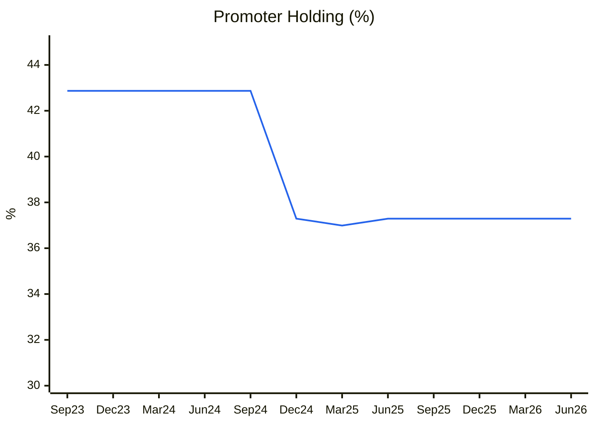
🟦 Promoter holding % (pledge 0%)
**Read:** Promoters were diluted by 5.6pp in Dec-24 through a preferential issue to outside investors (DIIs 0 → 1.84%). Promoters added only ~5,000 shares (Kamal Lunawath, FY26). **Low skin in the game** (37%) for a company with this many related-party SPVs.

**Share count:** 0.86 cr (to FY24) → 0.997 cr (FY25–26) → **1.086 cr** (May-26 warrant conversion of 8.97 lakh shares at ₹480; ₹32.3 cr balance received) → **+26% dilution in 2 years.**
**FCF vs EPS:** 11-yr cumulative CFO ₹9 cr vs cumulative PAT ₹79 cr. EPS has gone from negative to ₹59, but FCF per share is ~0 over the cycle.
**Capital allocation: AVERAGE** (improving). Equity raise used for land, projects and debt (₹76 cr of the ₹108.6 cr deployed, per the FY26 utilisation statement); a large debt-funded land bet (Padi); no dividend since a 6% payout in FY24.
**RPT / ICD:**
- 15 related parties (LLPs/companies: Canopy Living, Escapade Services, Questiva Estates, Vilaya Properties, Skyspan Projects, Vrikodara Realtors, Kairav Developers and others) with **omnibus approval for sales and trade advances of up to 365 days** (FY26 AR RPT annexure).
- Standalone **loans to related parties ₹41.7 cr** (FY25: ₹27.9 cr), ≈ 14% of standalone equity (< 20% threshold, but rising).
- Consolidated current investment in **Canopy Living LLP: ₹178.7 cr** (the Prestige JV SPV).
- **Promoter remuneration:** ₹96 lakh each for the MD and a WTD, plus ₹21 lakh (≈ 3.6% of PAT). **New** (Board, 4-Sep-26): commission of up to 5% each / 10% aggregate of net profit. At the cap, promoter pay would reach ~13% of PAT (> 10% red-flag threshold).

**Three C's:** Candor **Low** (Q4FY26 unexplained; no guidance) · Competence **Improving** (3-yr execution strong; 10-yr record poor) · Caring **Low-moderate** (dilution, a new commission, no dividend).

### Walk the Talk
| Source | Statement | Actual | Verdict |
|---|---|---|---|
| FY25 / Q-calls | Record pre-sales growth | FY26 ₹514 cr (+28%) | ✅ |
| FY25 | Collections growth | FY26 ₹360 cr (+49%) | ✅ |
| Preferential issue | Deploy ₹108.6 cr into projects / land / debt | ₹76 cr deployed, ₹32 cr received May-26 | ✅ |
| FY26 AR | "Highest-ever operating cash flow" | FY26 CFO ₹49 cr; FY23 was ₹147 cr (Screener) | 🔴 claim contradicts data* |
| Q4FY26 | (no guidance given) | OPM 8%, PAT −78% QoQ | ❌ silent miss |
*Possibly a standalone vs consolidated difference; not reconciled.

**WTT score:** ~0.6 on a thin sample → **LOW-MODERATE.** **Pattern:** selective disclosure (no quantitative guidance; Q4 unexplained). **Insider action:** no open-market promoter buying of size identified (Form C not retrieved) → **NEUTRAL**.

---

## Module 5 — Financial Forensics
| Model | Value | Interpretation |
|---|---|---|
| Beneish M (proxy, FY26) | **−1.47** | > −1.78. Driven by SGI 2.04 (revenue doubling) and LVGI 1.37. Real-estate POC lumpiness explains much of it; still a grey-to-red reading |
| Altman Z'' | 5.7 (FY26) vs 8.5 (FY25) | Safe but falling (leverage) |
| Piotroski F | **3 / 9** | Weak. Fails ΔROA, CFO>NI, leverage, liquidity, dilution, margin |
| Sloan accrual | +22.3% FY26; +17.2% FY25 | Warning (FY26 inflated by ₹168 cr JV investment in CFI) |
| 11-yr cumulative CFO / PAT | ₹9 / ₹79 = **0.11** | 🔴 Very low |

**Indian-specific flags**
- 🔴 **Auditor:** B P Jain & Co (Chennai), audit fee **₹6 lakh** for a group with ₹1,018 cr of assets and 8 subsidiaries plus a JV. Tier-3, with component-reliance risk.
- 🟠 **KAMs:** revenue recognition under Ind AS 115 (judgemental POC); uncertain tax positions.
- 🟠 **Legacy:** Companies Act 1956 proceedings u/s 58A (deposits), 299 and 295 following a s.209A inspection. A compounding application has been pending **since 19-Jan-2015**. Income-tax disputes of ~₹7.9 cr (AY2004–08, AY2011) and GST disputes of ₹1.8 cr.
- 🟠 **RPT web:** 15 related SPVs and rising related-party loans (Module 4).
- 🟠 **Collections:** FY26 collections/pre-sales of 70% is below the 75% healthy mark; Q1FY27 is **41%**.
- 🟠 **Q4FY26 anomaly:** OPM 8%, tax rate 50% and other income ₹10 cr in the same quarter, with no explanation.
- Pledge: none ✓

**Forensic red flags: 5 / 15** (auditor quality, cumulative CFO/PAT, Beneish grey, collections, related-party loans rising). **≥ 3 → deep investigation required.**
**Overall forensic verdict: SIGNIFICANT CONCERNS.** No evidence of fraud, but governance and earnings-quality opacity is high.

---

## Module 6 — Earnings Quality & Financial Statements
**ROCE (pre-tax):** FY26 16.3%; FY25 19.9%; **11-yr avg 7.6%** | **WACC:** 14% (small-cap realty, Ke ~16%, net D/E ~0.6) | **ROE:** FY26 15.9%; 10-yr ~4%
**ROIC vs WACC:** +2pp in FY26 (pre-tax); **below WACC on a post-tax basis** → value-neutral at best. It has only exceeded WACC in FY25.

| Year | Revenue | EBITDA | OPM % | PAT % | ROCE % | ROE % | CFO | PAT |
|---|---|---|---|---|---|---|---|---|
| FY16 | 125 | −4 | −3.2 | −9.6 | 1.3 | −8.1 | −38 | −12 |
| FY17 | 68 | 4 | 5.9 | −10.3 | 4.5 | −3.9 | −4 | −7 |
| FY18 | 66 | 1 | 1.5 | −1.5 | 6.4 | −0.7 | −1 | −1 |
| FY19 | 80 | −2 | −2.5 | 1.3 | 8.8 | 0.6 | −28 | 1 |
| FY20 | 47 | −18 | −38.3 | −14.9 | 3.1 | −6.3 | −220 | −7 |
| FY21 | 56 | −6 | −10.7 | −28.6 | 2.1 | −16.0 | 147 | −16 |
| FY22 | 83 | −3 | −3.6 | −6.0 | 1.8 | −4.2 | −34 | −5 |
| FY23 | 64 | 13 | 20.3 | 15.6 | 8.4 | 5.6 | 147 | 10 |
| FY24 | 124 | 25 | 20.2 | 11.3 | 10.8 | 7.3 | 30 | 14 |
| FY25 | 206 | 64 | 31.1 | 20.9 | 19.9 | 13.8 | −39 | 43 |
| FY26 | 420 | 97 | 23.1 | 14.0 | 16.3 | 15.9 | 49 | 59 |
*(₹cr, consolidated, Screener; FY14 period was Dec-2014 / 15 months, so the series starts at FY16)*

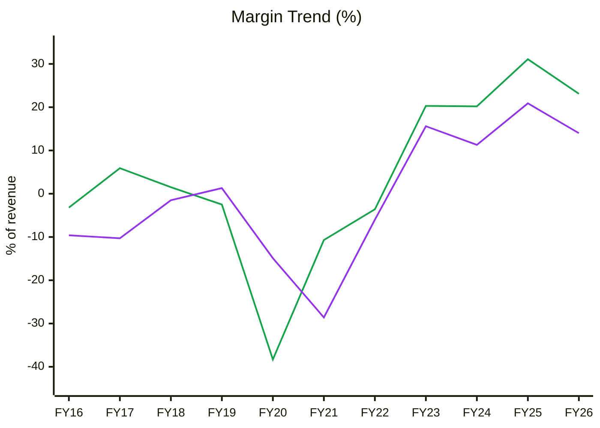
🟩 EBITDA margin · 🟪 PAT margin
**Read:** It was a regime change in FY23: seven years of losses followed by four years of 20–31% EBITDA margins. FY26 (23%) is already **below** FY25's peak (31%) and below the KPI-reference healthy band of 30–45%. Over the 4-year profitable regime, the margin sits at the 50th percentile.

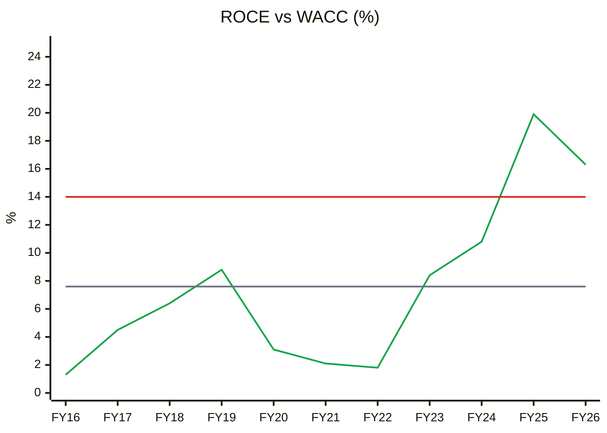
🟩 ROCE (pre-tax) · 🟥 WACC 14% · ⬜ 11-yr average 7.6% (SD 5.8)
**Read:** ROCE cleared WACC in only **2 of 11 years** (FY25–26). Current 16.3% is **+1.5SD above its decade average**, i.e. **late-cycle / peak-like on its own history**, and already falling from FY25.

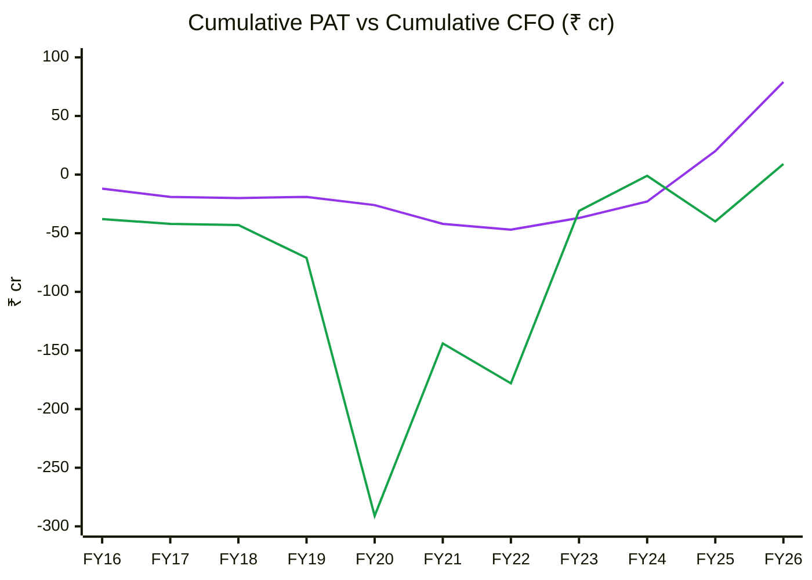
🟪 Cumulative PAT · 🟩 Cumulative CFO
**Read:** The 11-yr cumulative CFO/PAT is **0.11**, dragged down by FY20 (−₹220 cr). Over the profitable FY23–26 regime, CFO (₹187 cr) did exceed PAT (₹126 cr), but **all of that surplus is FY23 alone (₹147 cr)**. In FY25–26, CFO was ₹10 cr against ₹102 cr of PAT. The recent profit surge is not yet cash-backed.

**DuPont (5-factor, consolidated; EBIT includes other income)**
| Year | EBIT margin | Asset turnover | Equity multiplier | Interest burden | Tax burden | ROE |
|---|---|---|---|---|---|---|
| FY22 | 9.6% | 0.14× | 5.14× | −0.38 | n.m. | −4.2% |
| FY23 | 53.1% | 0.12× | 3.71× | 0.38 | 0.77 | 6.8% |
| FY24 | 29.8% | 0.27× | 2.52× | 0.54 | 0.70 | 7.6% |
| FY25 | 38.3% | 0.40× | 2.03× | 0.73 | 0.74 | 17.1% |
| FY26 | 25.5% | 0.53× | 2.34× | 0.77 | 0.72 | 17.3% |

**Operating contribution** (EBIT margin × AT): 6.4% (FY23) → 15.3% (FY25) → 13.5% (FY26), so it **peaked in FY25**. **Financing contribution:** the equity multiplier is **rising again** (2.03 → 2.34×).
**DuPont verdict:** FY26 ROE was held flat (17.1% → 17.3%) **only because leverage rose while operating returns fell**. This is the financial-engineering pattern the framework flags.
**O'Glove flags: 5 / 15** (NI vs OCF, Sloan, Beneish proxy, auditor, collections).

---

## Module 7 — Industry KPIs & Peer Analysis
**Sector:** Real Estate (KPI reference line 325)

| KPI | Arihant | Healthy | Red flag | Assessment |
|---|---|---|---|---|
| Pre-sales growth | +28% (FY26); +69% (Q1FY27) | > 15% YoY | 2 qtrs declining | ✓ |
| Collections / pre-sales | 70% (FY26); 41% (Q1FY27) | > 75% | < 60% | ⚠️ / ✗ |
| Net debt / equity | 0.78× (FY26); ~0.64× post-warrants | < 0.5 | > 1.5 | ⚠️ |
| Revenue / pre-sales lag | Revenue ₹432 cr vs pre-sales ₹514 cr = 0.84 | Revenue lags bookings | Revenue ≫ bookings | ✓ |
| EBITDA margin | 23% (FY26) | 30–45% | < 25% | ✗ |
| Launch pipeline | Padi 3.6 mn sqft (unlaunched); Park Street, Here & Now | > 25% of base | Shrinking | ✓ strong |
| Land bank (years) | Arihant-share GDV ₹6,094 cr / FY26 pre-sales ₹514 cr ≈ **12 years** | 3–5 yrs | > 8 yrs | ✗ capital tied up / execution stretch |

**Peers:** Sourced current peer financials for small-cap Chennai developers were not retrieved. The KPI-reference sector P/NAV band is 0.7–1.5×. **Arihant ~1.14× base NAV**, within the band but above its midpoint. *(C12 peer chart is omitted for lack of sourced peer data.)*
**Peer positioning:** In-line on P/NAV. A discount is warranted for governance and scale. **Not justified at par.**

---

## Module 8 — Market Size & Market Share
**TAM:** Chennai residential plus office sales. No sourced value total was retrieved. Chennai CY25 office leasing was ~9.1 mn sqft; average residential price ₹5,135/sqft (+7%).
**Arihant area sold FY26:** 5.69 lakh sqft. Its share of Chennai is small (est. < 3%).
**Trend:** gaining since FY23 (area sold +72% in FY26) from a very low base.
**Driver:** partly structural (Prestige alliance, launch pipeline), partly cyclical catch-up.
**Verdict:** Taking share from a low base (unverified quantitatively).

---

## Module 9 — Valuation: PIE First, Then NAV / Earnings

### 9A. PIE (reverse DCF)
*EV ₹1,277 cr (market cap ₹1,021 + net debt ₹288 − warrant cash ₹32) · TTM revenue ₹472 cr · NOPAT ₹73.5 cr (15.6%) · sales-to-capital 0.9× · WACC 14%*

| Driver | Market-implied | My base | Gap |
|---|---|---|---|
| Revenue CAGR (5 yr) | **~44%** | ~15–20% (pre-sales ₹514 → ~₹850 cr by FY29) | Optimistic gap |
| NOPAT margin | 15.6% | 15% | ≈ |
| Incremental ROIC | 15.6% × 0.9 = 14% ≈ WACC | same | Growth is value-neutral |

**Insight:** For a developer whose incremental ROIC ≈ WACC, DCF value collapses to roughly the no-growth EPV (~₹250–300/share). The market price embeds either **sustained ~44% growth** or a **step-up in returns** (margins back to 30%+ with faster capital turns). The DCF is shown for discipline; **NAV is the primary method** for real estate (KPI reference).
**Positive triggers:** Padi launch with strong absorption; collections > 80% of pre-sales; net debt falling; an explanation of the Q4 anomaly; a Tier-1 auditor appointment.
**Negative triggers:** collections staying < 60%; another unexplained quarter; Padi approval delay; rate or real-estate cycle turn.
**SVAR** (NAV bear): ₹610 → **35%**. Blended bear ₹515 → **45%** (> 40% = unfavourable).

### 9B. NAV (primary)
| Input | Bear | Base | Bull |
|---|---|---|---|
| Arihant-share GDV remaining (of ₹6,094 cr; ~15% assumed already recognised) | ₹5,200 cr | ₹5,200 cr | ₹5,200 cr |
| Pre-tax margin on share | 20% | 25% (FY24–26 avg) | 30% |
| Post-tax profit (25% tax) | ₹780 cr | ₹975 cr | ₹1,170 cr |
| Discount (14%, midpoint 4.5 / 3.5 / 3.5 yrs) | 0.555 | 0.632 | 0.632 |
| Execution/pipeline haircut (Padi unlaunched) | 40% | 20% | 0% |
| PV of future profit | ₹260 cr | ₹493 cr | ₹739 cr |
| + Book equity incl. warrant money | ₹403 cr | ₹403 cr | ₹403 cr |
| **Equity NAV** | **₹663 cr → ₹610/sh** | **₹896 cr → ₹825/sh** | **₹1,142 cr → ₹1,052/sh** |

*Simplification: book equity plus PV of future post-tax profit (RIM-style without a capital charge). Debt is implicitly netted in book equity, because the debt-funded land and WIP sit in book assets.*

| Method | Bear | Base | Bull |
|---|---|---|---|
| NAV (above) | ₹610 | ₹825 | ₹1,052 |
| P/E on FY28E EPS (7 / 10 / 14×; EPS ₹60 / ₹90 / ₹110) | ₹420 | ₹900 | ₹1,540 |
| DCF / EPV (incremental ROIC ≈ WACC) | ₹250 | ₹300 | ₹400 |
| **Consensus (NAV and P/E weighted equally)** | **₹515** | **₹862** | **₹1,296** |

**CMP ₹940 vs base ₹862 → 9% premium. MoS gate FAILS** (small-cap with governance flags requires 40–50% discount → buy below ~₹450–520).
**Graham Number:** √(22.5 × 5-yr avg EPS ₹22.3 × BVPS ₹371) = **₹431**
**Misprice reason:** none. The turnaround is now fully recognised (P/B 0.2× → 2.5×).

**P/B band (11 yr)**
| | FY16 | FY17 | FY18 | FY19 | FY20 | FY21 | FY22 | FY23 | FY24 | FY25 | FY26 | Oct-26 |
|---|---|---|---|---|---|---|---|---|---|---|---|---|
| March price ₹ | 38.1 | 49.4 | 47.45 | 32.4 | 15.2 | 16.9 | 32.4 | 38.6 | 120.6 | 730 | 970 | 940 |
| BVPS ₹ | 173 | 209 | 176 | 186 | 129 | 116 | 137 | 207 | 223 | 312 | 372 | 371 |
| P/B | 0.22 | 0.24 | 0.27 | 0.17 | 0.12 | 0.15 | 0.24 | 0.19 | 0.54 | 2.34 | 2.61 | 2.53 |
| ROE % | −8.1 | −3.9 | −0.7 | 0.6 | −6.3 | −16.0 | −4.2 | 5.6 | 7.3 | 13.8 | 15.9 | — |

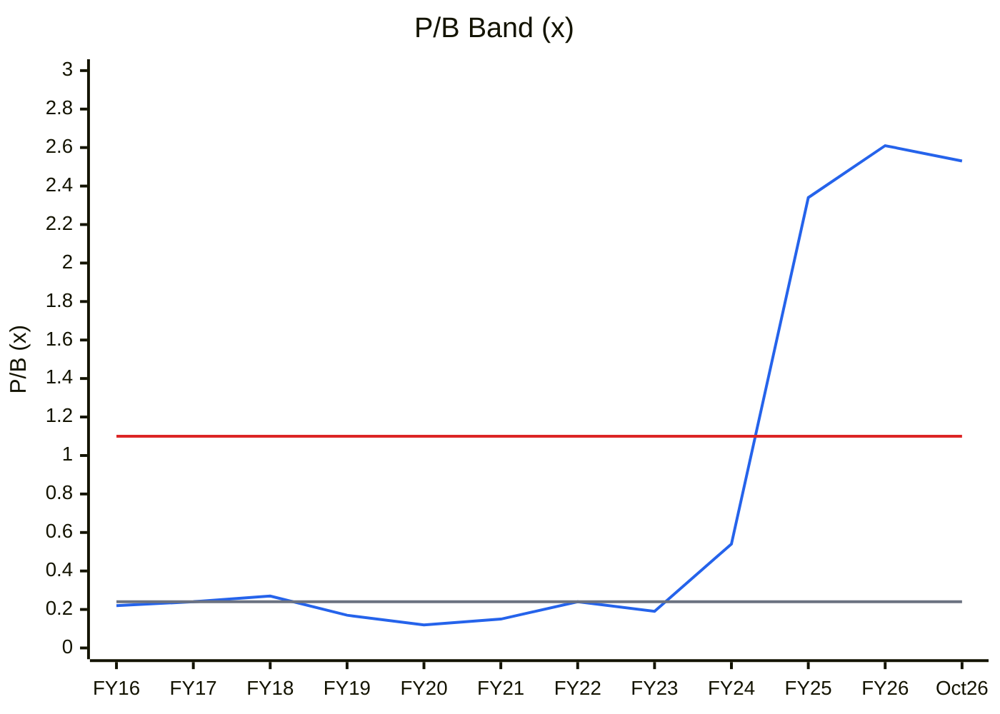
🟦 P/B · ⬜ Median 0.24× · 🟥 +1SD 1.1× (the −1SD value is below zero and not shown)
**Read:** P/B of 2.5× is at the **~90th percentile** of the decade and **10× its median**. The entire re-rating happened in FY24–FY25. The decade median reflects a loss-making era, so some re-rating is earned, but the band shows how far sentiment has moved.

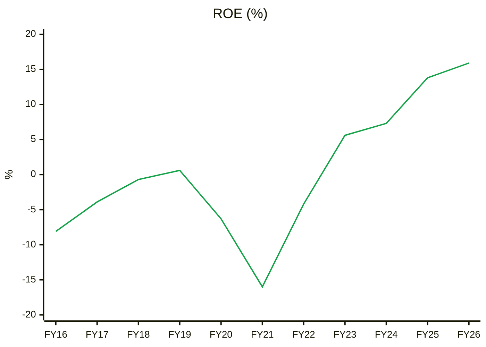
🟩 ROE
**Read:** ROE of 15.9% is the decade high. **Justified P/B = (15.9% − 8%) / (16% − 8%) ≈ 1.0×** vs 2.5× actual. The market is paying for ROE to rise well above today's level.

**P/E (EPS positive only from FY23; 4 annual points + TTM)**
| | FY23 | FY24 | FY25 | FY26 | Oct-26 TTM |
|---|---|---|---|---|---|
| P/E | 3.3× | 7.7× | 17.0× | 16.4× | 15.0× |

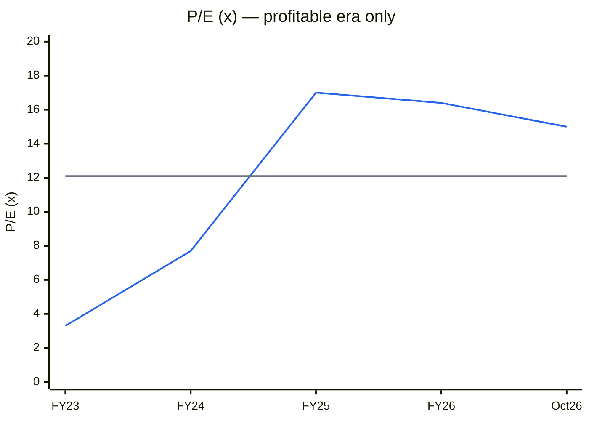
🟦 P/E · ⬜ Median of FY23–26 12.1×. ±1SD is not meaningful on 4 points.
**Read:** 15× sits at the upper end of its short profitable history. It is not extreme, but no longer cheap for a lumpy, leveraged developer.

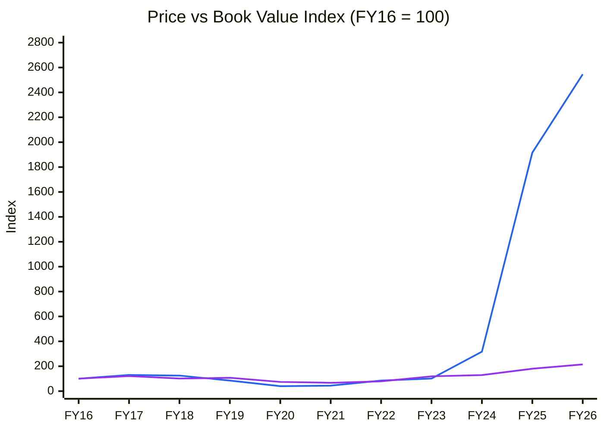
🟦 Price index · 🟪 Book value/share index (EPS ≤ 0 in the base year, so BVPS is used)
**Read:** Price is up 25× while BVPS is up 2.2×. Most of the return has been re-rating, which leaves little cushion if growth or governance disappoints.

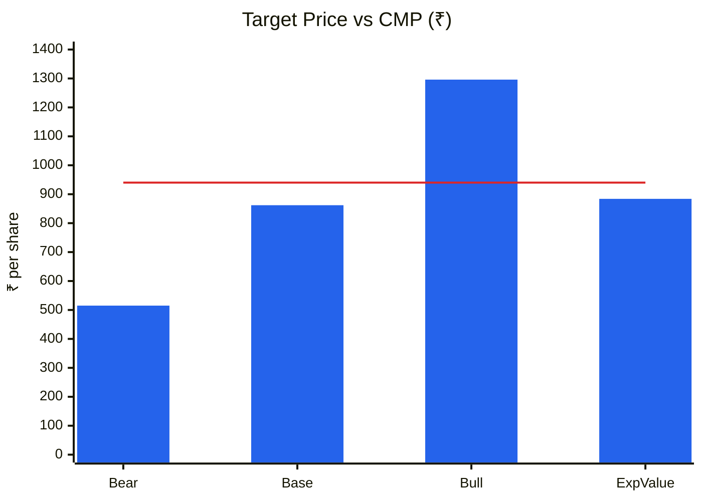
🟦 Scenario price (blended NAV + P/E, 2-yr) · 🟥 CMP ₹940
**Read:** Bear is −45% and bull +38%, so **U/D is 0.84:1**. Expected value is ₹884 (−6%). The asymmetry is unfavourable.

### Cycle Position Dashboard
| Dimension | Current | 10-yr median | Percentile | Signal |
|---|---|---|---|---|
| P/E | 15.0× | 12.1× (FY23–26) | ~60% | Fair-to-full |
| P/B | 2.53× | 0.24× | ~90% | **Expensive** |
| EBITDA margin | 23% | ~1.5% (decade); 25% (FY23–26) | 75% (decade) / 40% (profitable era) | Mid (off the FY25 peak) |
| ROCE | 16.3% | 6.4% | ~90% (+1.5SD) | **Late / peak** on own history |
| Pre-sales momentum | +69% (Q1) | — | — | Strong |
| **Overall cycle position** | | | | **Mid → Late** (returns near peak, valuation re-rated, leverage rising) |
Module 1c said *early-to-mid* on operating ramp; the valuation and returns data say *late*. **Per the consistency rule, the data wins: revised to MID-LATE.**

---

## Module 10 — Technical Stage
| Item | Reading |
|---|---|
| Nifty stage | **Stage 4** |
| Sector (Nifty Realty) | Not retrieved; realty typically leads Stage 4 markets down |
| Stock stage | **Stage 3 → 4 transition / early Stage 1.** ₹940 vs 30-wk SMA ₹933, which is **declining** (₹953 five weeks ago). Peaked at ₹1,288; fell ₹1,161 → ₹897 over the last 12 weeks, then bounced to ₹940 |
| 52-wk range | ₹731–1,288; −27% from the high |
| RS vs Nifty | 26-wk −4.2% vs Nifty −8.7% (slightly positive); 52-wk −13.2% vs −13.5% (neutral) |
| Liquidity | **Very thin** (BSE weekly volumes in the hundreds to low thousands of shares). Large exit risk |
| Stop | ₹880 (recent swing low) for any trading position |

**CANSLIM:** C 1 (Q1 EPS +47%) · A 1 (3-yr EPS CAGR 80%, ROE 16%) · N 1 (Prestige JV, Padi) · S 0 (illiquid; dilution) · L 0 · I 0 (FII 0%, DII 1.8%) · M 0 → **3 / 7**
**Stage + fundamentals:** Misaligned. No Stage 2 setup.

---

## Module 11 — Forward View: 2–3 Year Thesis
*Asset-light JDA model: the capex/asset-turnover framework does not apply (gross block ₹21 cr). The forward model is pre-sales → revenue recognition → margin, with the Padi JV as the main capital commitment.*

| Capital item | Amount | Status |
|---|---|---|
| Canopy Living LLP (Padi JV, 50% share) | ₹178.7 cr invested (31-Mar-26) | Land acquired; launch timing undisclosed |
| Inventory / WIP (consolidated) | ₹253 cr (FY26) vs ₹176 cr (FY25) | +44% |
| Security deposits to landowners (JDA) | ₹143 cr (FY26) vs ₹74 cr | Nearly doubled |
| Net debt | ₹288 cr (FY26) vs ₹49 cr (FY25); ~₹256 cr post-warrants | Gearing 44% (company) |

### Earnings model (base)
| Metric | FY27E | FY28E | FY29E |
|---|---|---|---|
| Pre-sales (₹cr) | 650 | 750 | 850 |
| Revenue recognised | 560 | 650 | 720 |
| EBITDA margin | 24% | 24% | 24% |
| EBITDA | 134 | 156 | 173 |
| Other income | 10 | 10 | 10 |
| Interest (P&L, post-capitalisation) | 30 | 35 | 35 |
| **ICR (×)** | 4.8× | 4.7× | 5.2× |
| PBT | 113 | 130 | 147 |
| PAT (25% tax) | 85 | 97.5 | 110 |
| EPS (₹, 1.086 cr shares) | 78 | 90 | 101 |
| Collections (≈ 70% of pre-sales) | 455 | 525 | 595 |
| Net debt / EBITDA | ~2.2× | ~2.0× | ~1.7× |

**FCF inflection:** FY29E+ (after the Padi construction peak). **Debt ceiling:** within the safe zone (< 3×) *if* collections hold at ≥ 70%. At 50% collections, net debt/EBITDA crosses 3×.

### Catalysts
1. Padi project launch (3.6 mn sqft, ₹5,000 cr GDV): timing undisclosed, likely FY27–28
2. Park Street (Velachery, ₹1,600 cr GDV) and Here & Now (Perungudi, ₹1,200 cr) sales velocity: FY27
3. Commercial asset monetisation (Silhouette, Sublime) à la Equitas Tower: FY27–29
4. Governance upgrade (auditor, explanation of Q4FY26, dividend): unknown

### Risks
1. **Collections slippage** (Q1FY27 at 41% of pre-sales) leading to a debt build: **High**
2. **Governance / RPT leakage** across 15 related SPVs: **Medium**
3. Padi approval or launch delay on a ₹179 cr debt-funded investment: **Medium**
4. Chennai cycle or rate-cycle turn, plus a Stage 4 market de-rating realty: **Medium**
5. Liquidity: an illiquid stock with a high retail float: **High** (exit risk)

### Scenario analysis (pre-sales × margin driven)
| Scenario | Pre-sales FY28E | EBITDA margin | EPS FY28E | NAV/sh | P/E | Target (blend) | Prob. |
|---|---|---|---|---|---|---|---|
| Bull | ₹950 cr | 30% | ₹110 | ₹1,052 | 14× | **₹1,296** | 25% |
| Base | ₹750 cr | 24% | ₹90 | ₹825 | 10× | **₹862** | 50% |
| Bear | ₹500 cr | 18% | ₹60 | ₹610 | 7× | **₹515** | 25% |
| **Expected value** | | | | | | **₹884** | |

**Return from CMP (expected value):** **−6%**

---

## Checklist Summary
**A:** 14 / 18 (thin WTT; Form C not checked) · **B:** 9 / 9 · **C:** 10 / 12 (Ind AS 116 immaterial; ROIC on a pre-tax proxy) · **D:** 5 / 7 (no sourced peer table) · **E:** 3 / 7 · **F:** 10 / 10 · **G:** 6 / 8 (sector index not retrieved) · **H:** 18 / 28 (capex-AT model not applicable; JDA model used) · **I:** 4 / 4. Includes C1, C2, C4, C5, C7, C9, C13, CY1 (short), CY2 (+ROE), CY4 (BVPS-based), CY7-equivalent; C12/CY5/CY6 omitted for lack of sourced data, stated.
**Hard stops triggered:**
1. ❌ **Upside/downside < 1.5:1** (0.84:1)
2. ⚠️ Forensic red flags ≥ 3 (5/15). Not "unresolved fraud" flags, but they require deep investigation (auditor, RPT web, Q4FY26, legacy s.58A matter).
3. ⚠️ ROIC < WACC for 9 of 11 years. There is now a credible turnaround thesis, so this is not applied as a hard stop.
**Pre-buy check:** Fails MoS, U/D and governance comfort.

---

## Investment Decision
**Verdict: AVOID** at ₹940 (it borders on *Cheap but Flawed* only below ~₹520)
**Conviction score:** 3.5 / 10 (cycle 0.5 · industry 0.5 · moat 0.5 · management 0.5 · financial/earnings 0.5 · valuation 0.5 · technical 0.5)
**Suggested position size:** 0%
**Re-look zone:** **₹450–520** (~0.55–0.65× base NAV, ≈ Graham Number ₹431), *or* on governance evidence: a Tier-1/2 auditor, explanation of Q4FY26, collections > 80% for 2 quarters, net debt falling
**Target price (base, 2-yr):** ₹862
**Review triggers:** Q2FY27 results (Nov-26), checking collections vs pre-sales and margin normalisation; the Padi launch announcement; any change in RPT loans; promoter buying in the open market.

---
*Sources: Screener.in (consolidated, accessed 9-Oct-2026); Arihant FY2025-26 Annual Report (BSE); Q1FY27 investor presentation (BSE, 18-Aug-2026); Valorem Advisors factsheet (Q1FY27); Business Standard / Construction World on the Prestige–Arihant Padi JV (Mar-2026); Whalesbook / Arthneeti / FilingReader result summaries; Yahoo Finance prices (BSE: ARIHANT.BO, monthly and weekly to 8-Oct-2026).*
*Report generated by Stock Fundamental Analysis Skill v3.1 | Indian Markets Context*
*Save path: C:\Users\anubh\Documents\Anubhav\Stock Analysis\Stock Analysis\*
