# Stock Analysis Report — Balaji Amines Limited (BALAMINES)
**Date:** 2026-10-09
**Analyst:** Claude (Stock Fundamental Analysis Skill v3.1)
**Investment Horizon:** 2–3 Years
**Recommendation:** AVOID at current price → WATCHLIST (buy-below ₹1,350–1,450)
**Conviction Score:** 4 / 10

## Revision Log
| Version | Date | Recommendation | Conviction | Price | Key change |
|---|---|---|---|---|---|
| Current | 2026-10-09 | Avoid at CMP → Watchlist (buy ₹1,350–1,450) | 4/10 | ₹2,086 | Recovery confirmed but price-led (volume −22%, realisation +62%); valuation at 80th-pct P/E; U/D hard stop |
| Previous | 2026-06-11 | Wait for Confirmation | 5/10 | ₹2,068 | Earlier file `BALAMINES_BalajiAmines_2026-06-11.md` merged into this report (full text in git history) |

**Validation of previous report:**
| Item | Previous (Jun 2026) | Now | Status |
|---|---|---|---|
| FY26 revenue / PAT / EPS | ₹1,425 Cr / ₹169 Cr / ₹51.60 | ₹1,419 Cr (Screener restated) / ₹169 Cr / ₹51.60 | ✅ Validated (revenue restated −₹6 Cr) |
| Q4 FY26 revenue / EBITDA margin | ₹403 Cr / 25.3% | ₹395 Cr / 23.9% (consolidated restated) | 🔄 Updated |
| Promoter pledge | "~18% of total share capital" | 17.66% of *promoter* holding ≈ 9.6% of equity | ❌ Corrected |
| BSCL Unit-I / Unit-II timing | H1 FY27 / Q4 FY27 | Unit-I guided Sep 2026 (not confirmed); Unit-II end-FY27 | 🔄 Updated |
| DME plant | Q1 FY27 commissioning | Commissioned 20 May 2026 | 🔄 Updated (delivered) |
| FY27 guidance | Not captured | Volume +10–15%, EBITDA 22–23%, FY28 revenue ₹3,000 Cr | 🔄 Updated |
| DCF base value | ~₹1,119 | ₹821–1,277 (normalised 21% margin, sensitivity table) | 🔄 Updated |
| Analyst consensus ₹1,674 / AlphaSpread DCF ₹1,130 | As stated | Not re-sourced | ⚠️ Unverifiable, dropped |
| Peer table (Alkyl Amines P/E ~30×, ROCE ~15%) | As stated | Alkyl 41.5× P/E, 16.6% ROCE (standalone) | 🔄 Updated |
| Fisher 10/15, Five Forces, TAM | As stated | Unchanged inputs | ✅ Validated (carried forward) |
| WTT score | 0.60 | 0.57 (7-item ledger) | 🔄 Updated |

---

## Executive Summary

Balaji Amines (India's largest aliphatic-amines maker) has turned the corner: revenue growth went from −18% YoY (Q3 FY25) to **+27% in Q1 FY27**, EBITDA margin jumped to **25.4%** (from 15.3%), and quarterly PAT doubled to ₹78 Cr. The "confirmation" the June report waited for has arrived. **But the charts show what kind of recovery it is.** Q1 FY27 sales volume *fell* 22% YoY (21,587 MT vs 27,570 MT) while revenue rose 27%. Realisation per tonne rose ~60%, and gross margin stayed flat at ~45%. This is a **price-led cyclical upswing** (helped by the July 2026 anti-dumping recommendation on ethylene diamine), not a volume-led structural one. The stock (₹2,086) has already re-rated **11.8× since FY16 while EPS rose 3.5×**, and trailing P/E sits at the **80th percentile** of its 10-year band. On FY28 estimates it is fair at best. The bear case (spread normalises) is **−60%** against a base-case **+15%**. That breaches the framework's upside/downside hard stop (< 1.5:1). Buy zone: ₹1,350–1,450.

**What changed since June:** Q1 FY27 confirmed the recovery (+) · DME plant commissioned 20 May 2026 (+) · EDA anti-dumping duty recommended (+, cyclical) · Volume is falling while price rises (−) · Stock ran to ₹2,525 (Sep 4) and is now 17% off the high (Stage 2 late / early Stage 3) · June report's pledge figure corrected (see Module 3).

### C1 — Growth Index: Revenue vs Fixed Assets vs Profit (FY16 = 100)

| ₹ Cr | FY16 | FY17 | FY18 | FY19 | FY20 | FY21 | FY22 | FY23 | FY24 | FY25 | FY26 | 10-yr CAGR |
|---|---|---|---|---|---|---|---|---|---|---|---|---|
| Revenue | 640 | 668 | 858 | 940 | 935 | 1,308 | 2,314 | 2,346 | 1,631 | 1,389 | 1,419 | 8.3% |
| Gross Block | 469 | 473 | 479 | 502 | 786 | 790 | 969 | 1,104 | 1,264 | 1,417 | 1,511 | 12.4% |
| EBITDA | 127 | 149 | 182 | 193 | 181 | 373 | 623 | 609 | 324 | 232 | 265 | 7.6% |
| PAT | 58 | 82 | 113 | 117 | 97 | 243 | 418 | 406 | 232 | 159 | 169 | 11.3% |

*Source: Screener.in consolidated P&L; Gross Block from Screener fixed-asset schedule (PPE note). FY26 CWIP ₹512 Cr not included.*

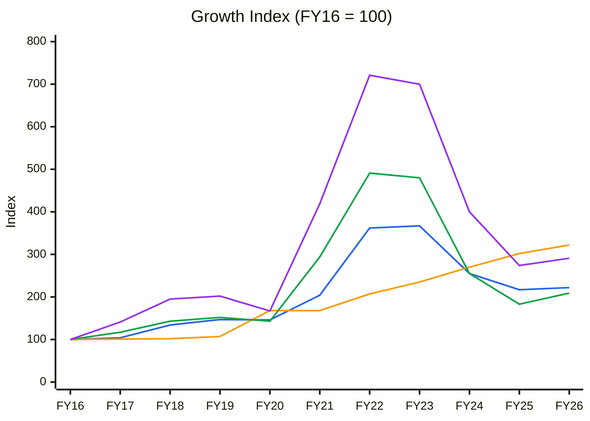
🟦 Revenue (CAGR 8.3%) · 🟧 Gross Block (12.4%) · 🟩 EBITDA (7.6%) · 🟪 PAT (11.3%)
**Read:** Fixed assets have grown every year (322) while revenue fell from its FY22–23 spike back to 222. Since FY24 🟧 sits *above* 🟦, so each rupee of plant now earns less than in any year of the decade. The FY21–23 profit spike (🟪 721) was a price event, not a capacity event: gross block barely moved while revenue and PAT tripled. The same mechanism is now restarting.

**Business inference:** Balaji's earnings follow amine prices, not its investment in capacity, and it has built plant ahead of demand that sits underused at normal prices. That makes it a high-operating-leverage price play: earnings can double when spreads widen, but the bigger asset base makes each downturn hit returns harder than the last.

---

## Business Primer

Balaji Amines makes aliphatic amines (methylamines, ethylamines), their derivatives (DMF, DMAc, NMP, morpholine, choline chloride), and specialty chemicals (DMC, acetonitrile, NMM, and from May 2026 dimethyl ether), mainly from methanol and ammonia at Solapur, Maharashtra. Customers are pharma API makers, agrochemical formulators, solvent users and, increasingly, battery-chemical buyers, almost all B2B and largely domestic. Revenue is volume × realisation, and realisation tracks global amine and solvent prices, which China sets as the marginal producer. Its subsidiary Balaji Speciality Chemicals (BSCL) makes ethylene amines (EDA and derivatives) and is building a ₹750 Cr greenfield for HCN, sodium cyanide and EDTA. Returns depend on two things: the spread between product prices and methanol/ammonia, and keeping a large, newly expanded asset base utilised.

This is a **commodity-to-specialty chemical business that is still cyclical**. The key value driver is **price (spread) × utilisation**. The key risk is that Chinese capacity resets amine prices, as it did in FY23–FY25 when revenue fell 41% and ROCE collapsed from 49% to 11%. The structural feature that colours this analysis is that the asset base has tripled since FY16 while revenue only doubled. The company has built ahead of demand, so the earnings swing from any price move is very large in both directions.

**New Segment Protocol:** Segment = Specialty Chemicals (aliphatic amines). KPI reference available ✓ (same block used in June report).

---

## Module 1 — Broad Market Cycle

| Indicator | Reading | Source |
|---|---|---|
| Nifty 50 | 22,556 (5 Oct 2026), down ~6% from ~24,000 in June | [stockpil.com](https://stockpil.com/india-markets-today-2026-10-05/) |
| India VIX | 14.7 (5 Oct) — calm, no fear premium | same |
| FII flows | Persistent selling (−₹4,699 Cr on 5 Oct); DIIs absorbing | same; [HDFC Sky](https://hdfcsky.com/news/india-vix-rises-1-41percent-as-global-yields-fii-selling-lift-early-session-volatility-october-1-2026) |

**Verdict: CAUTIOUS.** The index is in a slow grind lower with complacent volatility and steady FII selling. That is neither a fear-driven buying opportunity nor a supportive tape. Use normal-to-small position sizes.

---

## Module 1b — Sector Cycle: Tailwinds & Headwinds

**Secular vs cyclical decomposition.** FY26 to TTM revenue growth is +7%, and Q1 FY27 is +27% YoY. Q1 FY27 volume was −22% YoY ([multibagg](https://www.multibagg.ai/market-pulse/articles/balaji-amines-q1-fy27-results-cms624j217el30yqv3frpsq8o)), so **effectively all of the growth is price, which is cyclical**. Secular drivers (pharma/agro demand ~8–10%, battery solvents, China+1, import substitution in EDA/NaCN/EDTA) are real, but they show up in volume, which is not yet growing. **Durable baseline for the DCF: ~8–10% revenue growth (volume + mix), not the current 27%.**

**Spread cycle.** The **anti-dumping duty recommended in July 2026** on ethylene diamine from China, EU, Saudi Arabia and Taiwan, on BSCL's own application ([Bajaj Broking, 8 Jul 2026](https://www.bajajbroking.in/share-market-news/balaji-amines-alkyl-amines-rally-heres-why)), lifts EDA realisations if the Finance Ministry notifies it. This is a policy-driven tailwind for 5 years, but it supports price, not demand. Management called commodity prices "stable" in Q1 FY27 ([IndianChemicalNews](https://www.indianchemicalnews.com/chemical/balaji-amines-starts-fy27-on-a-strong-note-as-q1-revenue-touches-rs-461-crore-31267)).

**Capacity pipeline (supply side).** Balaji itself is adding the 1 lakh TPA DME plant (commissioned May 2026), NMM, acetonitrile, BSCL Unit-I (EDA derivatives, H1 FY27) and Unit-II (HCN/NaCN/EDTA, Q4 FY27). Alkyl Amines is also expanding. Domestic supply additions are front-loaded in FY27–28.

### CY5 — Industry Demand vs Supply: *not charted*
No sourced time series of Indian aliphatic-amine installed capacity versus consumption exists in public data (ChemAnalyst / Mordor give only market value). Per chart rules, nothing is charted from estimates. Company-level proxy: the **gross block index (C1, 🟧 322)** versus the **revenue index (🟦 222)** shows Balaji's own capacity running well ahead of what it sells.

### CY6 — Spread Cycle (proxy: gross margin = 1 − material cost / sales)

| | FY16 | FY17 | FY18 | FY19 | FY20 | FY21 | FY22 | FY23 | FY24 | FY25 | FY26 |
|---|---|---|---|---|---|---|---|---|---|---|---|
| Gross margin % | 44 | 49 | 46 | 45 | 45 | 52 | 47 | 47 | 45 | 44 | 44 |

10-yr median 45%, SD 2.4pp. *Source: Screener expense schedule (Material Cost %).* Quarterly gross margin for Q1 FY26–Q1 FY27: 41 / 47 / 45 / 44 / 45%.

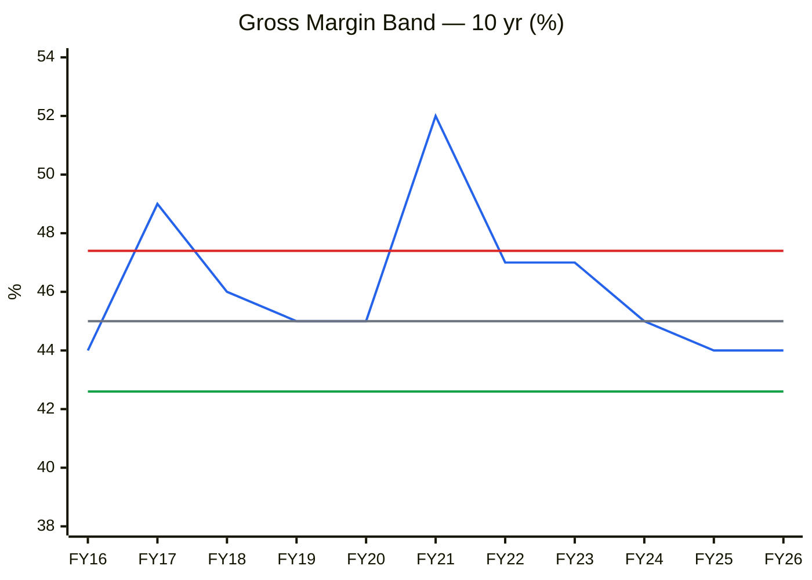
🟦 Gross margin · ⬜ Median 45% · 🟥 +1SD 47.4% · 🟩 −1SD 42.6%
**Read:** The percentage spread is remarkably stable (0th percentile at 44% but within 1SD). Balaji passes input costs through, so **the cycle lives in the absolute ₹ per tonne, not the percentage**. When product and feedstock prices rise together, gross profit per tonne rises, fixed costs are absorbed, and EBITDA margin jumps. That is exactly what happened in Q1 FY27 (gross margin flat at 45%, EBITDA margin 15% → 25%), and it reverses just as fast when prices deflate. This is a cyclical tailwind and should not be capitalised.

**Business inference:** Balaji can pass costs through but has no pricing power: it earns a steady percentage on whatever price China sets. Profitability therefore depends on absolute price levels and plant utilisation, neither of which management controls, so today's margin should be valued as cyclical, not structural.

**Sector cycle verdict: TAILWIND (cyclical, price-led; 12–24 months).** The primary driver is a realisation upswing plus EDA anti-dumping. Risk: Chinese price cuts or ADD non-notification. Module 8 must value on a **normalised margin (21%)**, not 25%.

---

## Module 1c — Stock Cycle: Company Positioning

### C2 — Quarterly YoY Growth Trajectory

| Quarter | Q2FY25 | Q3FY25 | Q4FY25 | Q1FY26 | Q2FY26 | Q3FY26 | Q4FY26 | Q1FY27 |
|---|---|---|---|---|---|---|---|---|
| Revenue (₹ Cr) | 347 | 313 | 353 | 358 | 341 | 331 | 395 | 456 |
| Revenue YoY % | −8.9 | −18.4 | −14.8 | −6.9 | −1.8 | +5.9 | +11.9 | +27.2 |
| EBITDA (₹ Cr) | 61 | 46 | 60 | 55 | 60 | 57 | 94 | 116 |
| EBITDA YoY % | +13 | −38 | −39 | −17 | −2 | +24 | +57 | +111 |
| OPM % | 17 | 15 | 17 | 15 | 18 | 17 | 24 | 25 |

*Source: Screener quarterly (consolidated; Q4 FY26 restated to ₹395 Cr).*

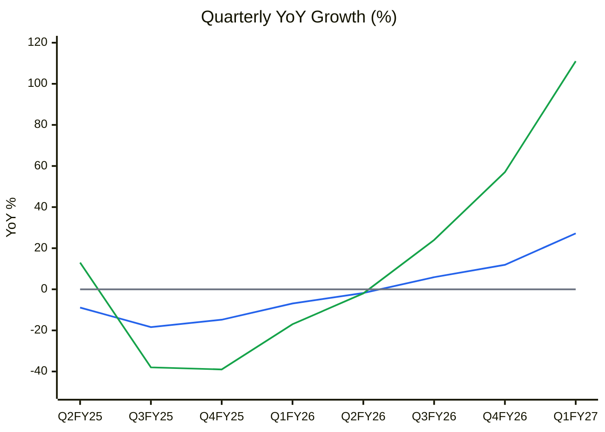
🟦 Revenue YoY % · 🟩 EBITDA YoY % · ⬜ zero line
**Read:** Revenue growth has **accelerated for five straight quarters** (−18% → +27%), and EBITDA growth is about 4× revenue growth, which is textbook operating leverage at a cycle turn. Base effects flatter it: Q1 FY26 was a trough quarter. The trajectory is the strongest buy-side signal in the report, *but* see the volume table below.

**Business inference:** The recovery is real at the profit line, but it comes from price and fixed-cost absorption, not from customers buying more. A lasting re-rating needs volume growth. Without it, earnings are as exposed to a price reversal as they were in FY23–25.

### Volume vs realisation (the decisive check)

| Quarter | Volume (MT) | Revenue (₹ Cr) | Realisation (₹ lakh/MT) |
|---|---|---|---|
| Q4 FY25 | 25,871 | 353 | 1.36 |
| Q1 FY26 | 27,570 | 358 | 1.30 |
| Q4 FY26 | 27,341 | 395 | 1.44 |
| Q1 FY27 | 21,587 | 456 | **2.11** |

*Sources: June report (Q4 volumes, company press release); Q1 volumes from [multibagg](https://www.multibagg.ai/market-pulse/articles/balaji-amines-q1-fy27-results-cms624j217el30yqv3frpsq8o) / [IndianChemicalNews](https://www.indianchemicalnews.com/chemical/balaji-amines-starts-fy27-on-a-strong-note-as-q1-revenue-touches-rs-461-crore-31267). Only 4 comparable points, so no chart (rule: ≥ 4 points with a consistent definition; the Q1 FY27 mix shifted toward specialty, 7,133 MT).*

**Volume −22% YoY, realisation +62%.** Part of this is mix (specialty chemicals were 33% of Q1 FY27 volume), but most is price. Management's FY27 guidance of +10–15% volume (25–30% exit rate) ([Q4 FY26 call](https://www.stockssena.com/stocks/BALAMINES/concall/q4-fy2026)) needs volumes to recover sharply from here. **Watch Q2 FY27 volume (results due ~early Nov).**

### C10 — Capacity & utilisation
Installed ~286,000 MTPA (plus DME 100,000 TPA from May 2026) against FY26 sales of roughly 105–110k MT annualised. That implies **~35–40% blended utilisation** (company does not disclose a single number; DMF/butylamines utilisation "low", battery chemicals 20–25%, DME guided 30–40% in FY27). Not charted: no disclosed history. Large idle capacity means volume can grow without capex, which is the bull case's engine.

### Operating leverage
Q1 FY27: revenue +27%, EBITDA +111% → **DOL ≈ 4.1×**. Interest is negligible (₹1 Cr/qtr), so DFL ≈ 1.0. This leverage cuts both ways: a 15% realisation reversal would take EBITDA margin back to ~17%.

### FCF inflection
FY26 FCF was **−₹186 Cr** (Screener: CFO 184 − capex ~344 − other). FY27 capex is guided at ₹275–290 Cr consolidated, so FCF stays around zero to slightly negative. **FCF inflection: FY28**, unchanged from June.

### CY7 — Margin & ROCE vs their own cycle

| | FY16 | FY17 | FY18 | FY19 | FY20 | FY21 | FY22 | FY23 | FY24 | FY25 | FY26 | TTM |
|---|---|---|---|---|---|---|---|---|---|---|---|---|
| EBITDA margin % | 20 | 22 | 21 | 21 | 19 | 29 | 27 | 26 | 20 | 17 | 19 | 21 (Q1FY27: 25) |
| ROCE % | 23 | 30 | 32 | 24 | 18 | 35 | 49 | 36 | 17 | 11 | 11 | ~14 (est.) |

EBITDA margin: 10-yr median 21%, SD 3.6 → band 17.4–24.6%. ROCE: median 24%, SD 11.2 → band 12.8–35.2%.

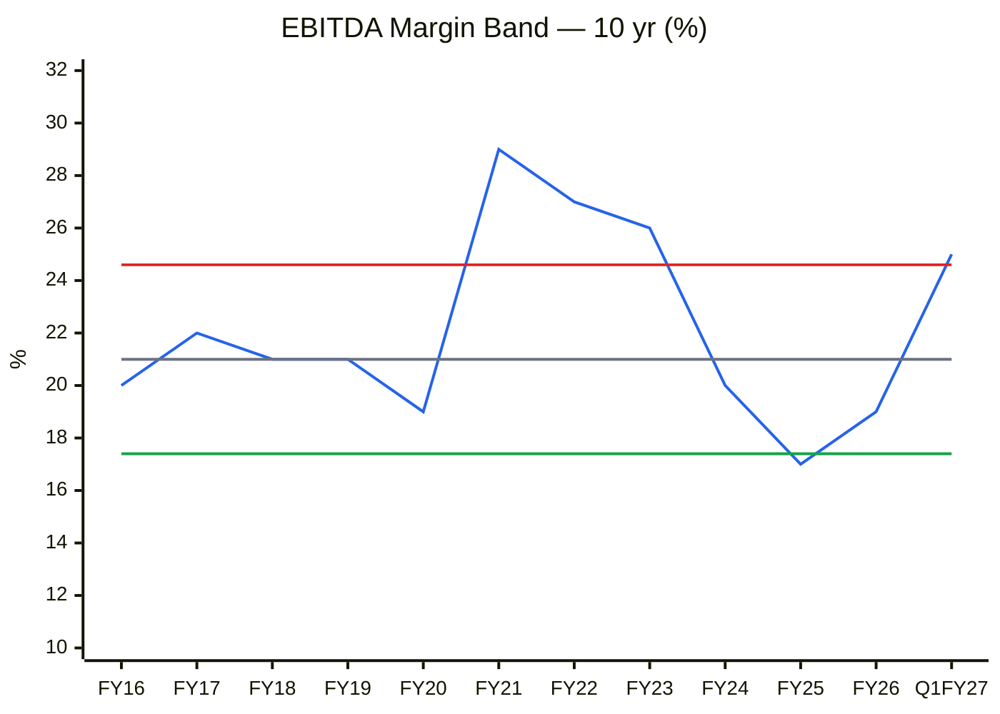
🟦 EBITDA margin · ⬜ Median 21% · 🟥 +1SD 24.6% · 🟩 −1SD 17.4%
**Read:** FY26 (19%) was mid-band. **Q1 FY27 at 25.4% is already above +1SD**, a peak-type margin that has only been sustained in the FY21–23 supercycle. Management itself guides 22–23% for FY27. Value on ~21–22%.

**Business inference:** Today's profitability reflects a favourable price environment, not a better business, and management's 22–23% guidance concedes it cannot be sustained. Valuing the company on Q1 FY27 margins would capitalise cyclical rent.

**Stock cycle classification: EARLY-TO-MID UPCYCLE (price-led), with margins already at a peak-type level.** Annual ROCE is at its 10-year low (11%, 0th percentile), which reads "trough". The quarterly margin reads "peak". The truth is in between: earnings are recovering off a trough, but the current quarter's profitability already prices in a strong spread.

**Management guidance accuracy (6–8 qtrs):** Revenue targets have been repeatedly missed (FY26 flat vs "recovery"; the FY28 ₹3,000 Cr target now implies a 28% CAGR). Capex timelines slip 1–2 quarters (NMM/ACN moved from FY26 to FY27). Margin guidance was beaten in Q4 FY26 and Q1 FY27. **Score ≈ 0.60 → haircut revenue guidance 20%.**

---

## Module 2 — Industry Structure & Capital Cycle

The Five Forces are unchanged from June (barriers 7/10, supplier power moderate, buyer power moderate-high in commodity grades, substitutes low, rivalry moderate with China as the effective third competitor). **Verdict: Neutral-to-attractive for incumbents.**

**Capital cycle.** Balaji's capex/depreciation over FY16–FY26 is 1.5, 0.5, 7.1, 6.0, 4.1, 1.8, 3.5, 4.6, 6.1, 2.9, **6.1×**. The company has reinvested at 3–7× depreciation for a decade, and both Indian majors are expanding again. *(CY8 industry chart not built: only one company's series is sourced; Alkyl Amines' consolidated history on Screener stops at FY20.)* Signal: **supply-heavy**. Domestic capacity is being added faster than domestic volume is growing, so pricing power depends on import protection (ADD) rather than demand tightness.

---

## Module 3 — Business Quality & Moat

**Greenwald:** (1) cost/scale advantage, **partial** (largest Indian producer, integrated, sole Indian DMC maker; China still lower-cost); (2) customer captivity, **partial** (pharma/food grades need qualification; commodity grades switch on price); (3) local scale, **yes** in methylamines/ethylamines domestically.
**Pricing-power test (C4/CY6):** Gross margin % is stable through cycles, so cost pass-through is **pass**. But EBITDA margin swings 17–29%, which means pricing *above* cost (the 10% price-raise test) is **fail** outside upcycles.
**Moat verdict: NARROW.**

### C4 — Margin Trend (10 yr)

| % | FY16 | FY17 | FY18 | FY19 | FY20 | FY21 | FY22 | FY23 | FY24 | FY25 | FY26 |
|---|---|---|---|---|---|---|---|---|---|---|---|
| Gross margin | 44 | 49 | 46 | 45 | 45 | 52 | 47 | 47 | 45 | 44 | 44 |
| EBITDA margin | 20 | 22 | 21 | 21 | 19 | 29 | 27 | 26 | 20 | 17 | 19 |
| PAT margin | 9.1 | 12.3 | 13.2 | 12.4 | 10.4 | 18.6 | 18.1 | 17.3 | 14.2 | 11.4 | 11.9 |

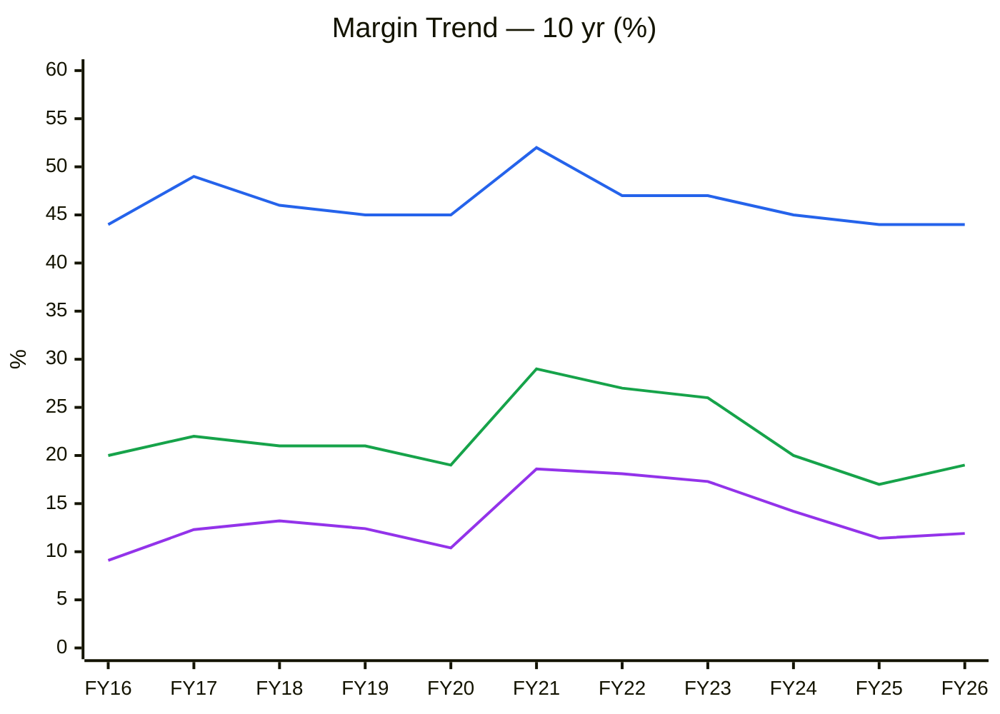
🟦 Gross margin · 🟩 EBITDA margin · 🟪 PAT margin
**Read:** The flat 🟦 line and swinging 🟩/🟪 lines show that **operating leverage, not spread percentage, drives the cycle**. PAT margin doubled from FY20 to FY21 on an unchanged gross margin.

**Business inference:** This is a high-fixed-cost commodity plant: small moves in realisation swing profit sharply. The earnings stream is inherently volatile, which argues for valuing on mid-cycle margins and applying a cyclical discount.

**Fisher 15-point:** 10/15 (unchanged; Point 15 integrity: Pass). **Market share:** stable ~50% of the domestic duopoly.

---

## Module 4 — Management & Capital Allocation

| Item | Reading |
|---|---|
| Promoter holding | 54.56% (Jun 2026); flat for 12 quarters (53.71% → 54.6% after Mar 2025 creep). No chart (no movement) |
| **Pledge** | **17.66% of promoter shares (~31.25 lakh of 176.87 lakh) ≈ 9.6% of total equity**, created Dec 2025 for BSCL credit facilities ([ScanX](https://scanx.trade/stock-market-news/stocks/balaji-amines-promoter-pledges-8-75-lakh-shares-to-hdfc-bank-for-credit-facilities/28892808)). *Correction: the June report said "~18% of total share capital"; it is 17.7% of the promoter holding.* Risk: **Normal (<20%)**, purpose-linked |
| FII / DII | FII 5.27% (Sep 24) → 3.17% (Jun 26); DII 1.58%. Institutions have **not** bought the rally |
| Dividend payout | 5% (FY22) → 21–23% (FY25–26); ₹11/share for FY26 |
| RPT | BSCL intra-group (normal); no adverse findings |
| Three C's | Candor ✓ (delays disclosed) · Competence ✓ · Caring ~ (payout rising) |

### Walk-the-Talk Scorecard

| Quarter | Statement | Guided | Actual | Verdict |
|---|---|---|---|---|
| Q4 FY25 | FY26 revenue recovery | Growth | +2% | ❌ |
| Q1 FY26 | NMM / ACN commissioning in FY26 | FY26 | Slipped to FY27 | ❌ |
| Q2 FY26 | Stable margins ~17–18% | 17–18% | 17–18% | ✅ |
| Q4 FY26 | DME commissioning Q1 FY27 | Q1 FY27 | 20 May 2026 | ✅ |
| Q4 FY26 | BSCL Unit-I in H1 FY27 | Sep 2026 | Pending (not confirmed by 9 Oct) | ⚠️ |
| Q4 FY26 | FY27 EBITDA margin 22–23% | 22–23% | Q1: 25.4% | ✅ (beat) |
| Q4 FY26 | FY27 volume +10–15% | +10–15% | Q1: −22% YoY | ❌ (so far) |

**WTT Score: 0.57 / 1.00 → LOW** (Hits 3, Near 1, Miss 3). **Pattern:** Margins are delivered; volume, revenue and timelines are not. **Insider action:** No open-market buys or sells; only the capex-linked pledge. **DCF impact:** Revenue guidance haircut 20–25%; the FY28 ₹3,000 Cr target is treated as the bull case only. **Credibility: MODERATE-LOW.**

---

## Module 5 — Financial Forensics

| Test | Result |
|---|---|
| Beneish M-Score | ~−2.4 (DSRI 1.24 on debtor days 72 → 89; LVGI up on new BSCL debt) → **Unlikely manipulator** |
| Altman Z'' | ~5.5 → **Safe** |
| Piotroski F | 7/9 → **Strong** |
| Sloan accrual | (169 − 184 + 344) / 2,498 = ~13% on the cash-flow definition, inflated by growth capex; operating accruals (NI − CFO) are negative → **acceptable** |
| Auditor | Unmodified opinions FY26; no KAM concerns surfaced |
| Indian flags | Pledge 17.7% of promoter holding (normal); RPT clean; no ICD concern |

### C7 — Earnings Quality: Cumulative PAT vs Cumulative CFO (₹ Cr)

| | FY16 | FY17 | FY18 | FY19 | FY20 | FY21 | FY22 | FY23 | FY24 | FY25 | FY26 |
|---|---|---|---|---|---|---|---|---|---|---|---|
| Cum. PAT | 58 | 140 | 253 | 370 | 467 | 710 | 1,128 | 1,534 | 1,766 | 1,925 | 2,094 |
| Cum. CFO | 85 | 145 | 285 | 379 | 523 | 633 | 853 | 1,207 | 1,541 | 1,796 | 1,980 |

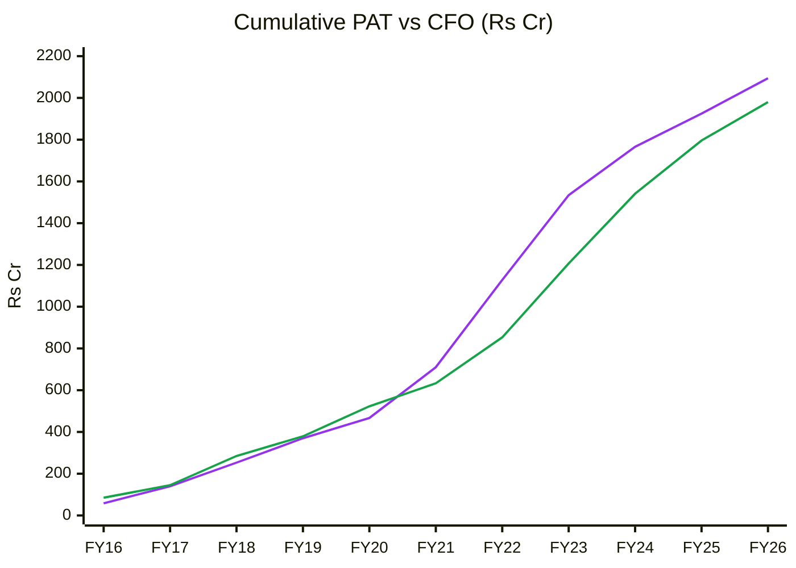
🟪 Cumulative PAT · 🟩 Cumulative CFO
**Read:** Over 11 years, CFO/PAT = **0.95**, which is healthy. The gap opened in the FY21–22 boom (working capital absorbed cash as prices rose) and closed in the FY23–25 downcycle. **Expect it to open again in FY27**: debtor days are already 89 (from 72), the normal pattern of a price upswing.

**Business inference:** Balaji's reported profits are genuinely backed by cash, a quality marker that sets it apart from many capex-heavy chemical peers. The receivable build expected in FY27 is normal for an upswing and does not threaten the thesis, though it will delay the FCF inflection.

**Forensic verdict: CLEAN (minor: rising receivables).** Red-flag count 1/15.

---

## Module 6 — Earnings Quality & Financial Statements

**ROIC (FY26):** EBIT ₹209 Cr (265 − 56) × 0.73 = NOPAT ~₹153 Cr. Invested capital (net block 1,043 + CWIP 512 + NWC ~300) ~₹1,855 Cr → **ROIC ~8% (FY26)**. Ex-CWIP it is ~11%. TTM is ~11–12%. **WACC 12.5%** (Rf 6.8%, β ~1.0, ERP 5.5%).

### C5 — ROCE vs WACC (and its own 10-yr median)

| % | FY16 | FY17 | FY18 | FY19 | FY20 | FY21 | FY22 | FY23 | FY24 | FY25 | FY26 |
|---|---|---|---|---|---|---|---|---|---|---|---|
| ROCE | 23 | 30 | 32 | 24 | 18 | 35 | 49 | 36 | 17 | 11 | 11 |

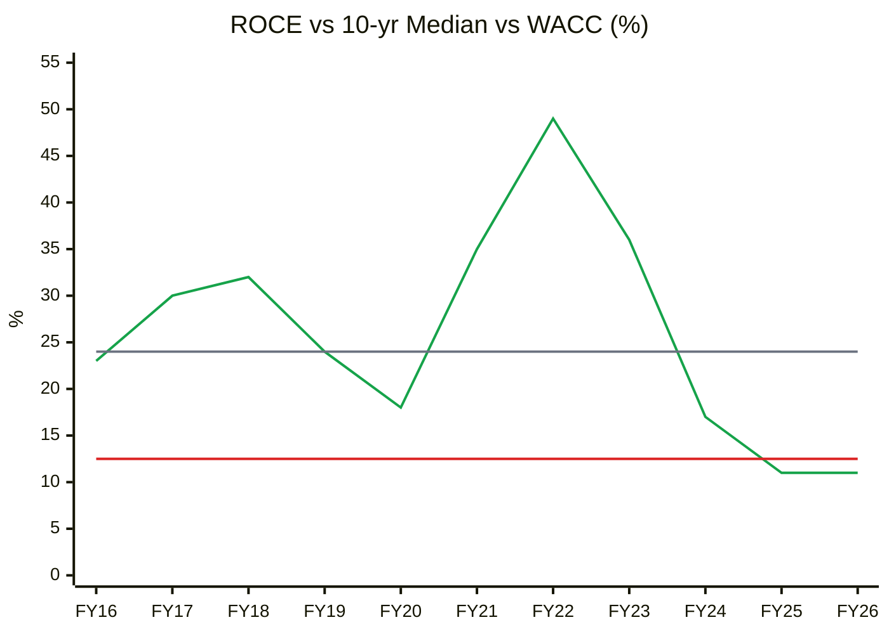
🟩 ROCE · ⬜ 10-yr median 24% · 🟥 WACC 12.5%
**Read:** ROCE fell **below WACC in FY25–26 for the first time in a decade** (0th percentile, below −1SD of 12.8%). Over the full cycle, median ROCE of 24% is about double WACC, so the business creates value *through* the cycle. The asset base is now 3× FY16, so getting back to median ROCE needs ~₹2,300+ Cr of revenue at a 21% margin. That is the right yardstick for the FY28 target.

**Business inference:** The franchise creates value over a full cycle, but recent capex has diluted returns, so growth no longer creates value automatically. Shareholders are funding capacity whose payoff depends on the next upcycle arriving and lasting.

### C6 — Asset Turnover (Revenue / Gross Block)

| | FY16 | FY17 | FY18 | FY19 | FY20 | FY21 | FY22 | FY23 | FY24 | FY25 | FY26 |
|---|---|---|---|---|---|---|---|---|---|---|---|
| AT (×) | 1.36 | 1.41 | 1.79 | 1.87 | 1.19 | 1.66 | 2.39 | 2.12 | 1.29 | 0.98 | 0.94 |

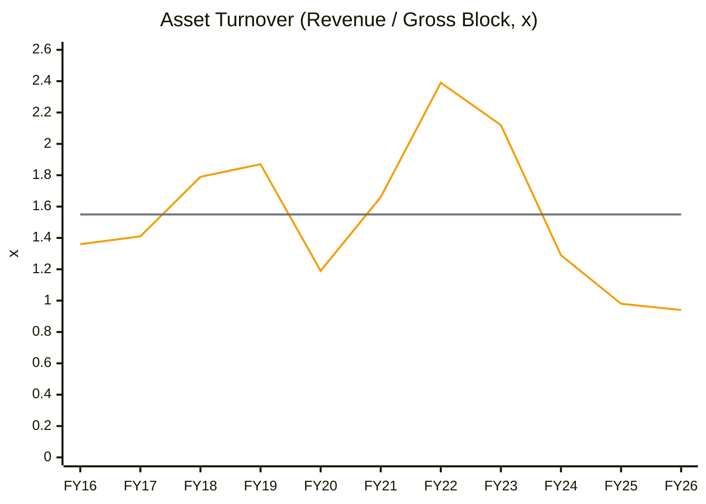
🟧 Asset turnover · ⬜ 10-yr average 1.55×
**Read:** AT has fallen **four years running to a decade low of 0.94×**, with another ₹512 Cr of CWIP still to be capitalised. TTM revenue of ₹1,523 Cr gives ~1.0×. **Base-case forward AT: 1.2–1.3× (below the 1.55× average)**, because new capacity (DME, BSCL) ramps slowly and earns lower turns.

**Business inference:** Capital has gone in faster than the market can absorb the output, which structurally lowers returns per rupee. This is the main drag on ROCE. Idle capacity is an option on future demand, not a guaranteed earnings engine, so the base case assumes only a slow recovery.

### DuPont (5-factor, approx.)

| Year | EBIT margin | AT (Rev/TA) | Equity mult. | Int. burden | Tax burden | ROE (year-end equity) |
|---|---|---|---|---|---|---|
| FY22 | 25.1% | 1.33 | 1.39 | 0.97 | 0.72 | 33.6% |
| FY23 | 24.0% | 1.20 | 1.26 | 0.98 | 0.72 | 26.3% |
| FY24 | 18.1% | 0.76 | 1.25 | 0.98 | 0.77 | 13.0% |
| FY25 | 14.6% | 0.62 | 1.22 | 0.98 | 0.74 | 8.8% |
| FY26 | 14.9% | 0.52 | 1.39 | 0.98 | 0.73 | 8.7% |

**Verdict:** The ROE decline is entirely operational (margin and AT both fell). Leverage is not masking it; the FY26 multiplier rose only on BSCL payables/debt. **AT trend: declining → base case uses 1.2–1.3×.**

**O'Glove flags:** 2/15 (debtor days rising; capex/dep > 2.5× in a non-growth revenue period). Neither is disqualifying.

---

## Module 7 — Industry KPIs & Peer Analysis

| Metric | Balaji Amines | Alkyl Amines | Vinati Organics | Deepak Nitrite | Aarti Inds | GNFC |
|---|---|---|---|---|---|---|
| Market cap (₹ Cr) | 6,757 | 9,346 | 11,619 | 21,606 | 17,341 | 8,805 |
| P/E (TTM) | 33.1 | 41.5 | 25.9 | 27.3 | 33.2 | 8.5 |
| ROCE % | 11.0 | 16.6 | 19.8 | 11.4 | 6.9 | 12.0 |
| TTM OPM % | 21 | 21 | 28 | 16 | 15 | 15 |
| Net debt | ~nil | ~nil | nil | moderate | high | nil |

*Source: Screener.in top ratios, 9 Oct 2026 (Alkyl Amines standalone; its consolidated page is stale).*

### C12 — ROCE vs Peers

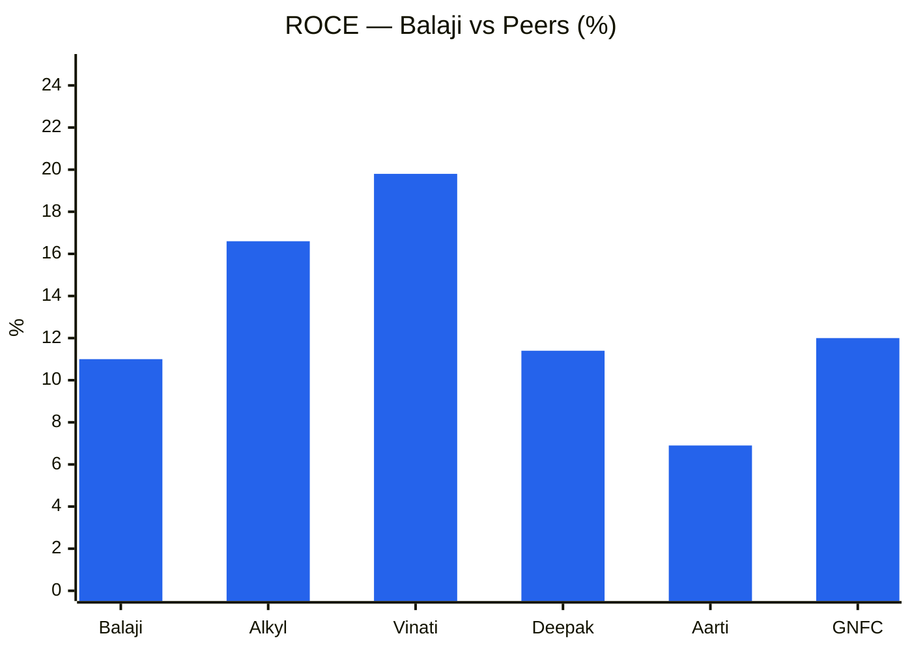
**Read:** Balaji earns the **second-lowest ROCE in the group yet trades at a P/E in line with or above Vinati and Deepak**. The market is paying for the recovery, not current returns. Against its direct peer Alkyl Amines (41.5× P/E, 16.6% ROCE), Balaji is ~20% cheaper on P/E but lags on returns. That relative gap is fair, not a mispricing.

**Business inference:** The market is valuing Balaji on recovery earnings rather than current returns, paying a quality-company multiple for a business earning trough-cycle returns. Until ROCE is above 15%, the multiple is borrowing from the upcycle.

**Sector KPIs:** EBITDA margin 21% TTM (sector band 18–28%, in-line) · ROCE 11% (band 15–20%, below) · export share ~10–12% (leaders 20–30%, below) · working-capital days 69 (OK). **Peer positioning:** in line to slight premium versus quality; not justified on returns until ROCE > 15%.

---

## Module 8 — Market Size & Market Share

Unchanged from June: India alkyl-amines market ~₹4,000–5,000 Cr growing ~3–4% in volume (ChemAnalyst). Balaji holds ~48% of the Balaji + Alkyl duopoly revenue. BSCL's new chemistries (NaCN, EDTA, EDA derivatives) open import-substitution TAMs that are currently import-dependent, which is where the ADD matters. **Verdict: growing with market in core amines; share gains possible only in new chemistries from FY28.**

---

## Module 9 — Valuation: PIE First, Then DCF

**Price ₹2,086 (8 Oct 2026 close) · Mcap ₹6,757 Cr · EV ~₹6,816 Cr · TTM EPS ₹63.0 · P/E 33.1× · P/B 3.4× (BV ₹610) · EV/TTM EBITDA 20.8×.** *(Screener.in)*

### PIE (reverse DCF)
Quick form: g = (EV × WACC − NOPAT₀)/(EV + NOPAT₀) = (6,816 × 12.5% − 202)/(6,816 + 202) = **9.3% perpetual NOPAT growth** off the TTM base (NOPAT₀ = (327 − 56) × 0.745 = ₹202 Cr).

| PIE driver | Market-implied | My base case | Gap |
|---|---|---|---|
| Revenue CAGR FY26–31 | ~17–18% (to ~₹3,100–3,300 Cr) | 17% front-loaded (₹1,900 FY27 → ₹3,100 FY31) | ≈ in line |
| Steady-state EBITDA margin | ~24–25% (current quarter held) | **21%** (10-yr median) | **−3 to −4pp: market optimistic** |
| Through-cycle ROCE | ~22–24% | 17–20% (bigger asset base) | Market optimistic |

**Expectations treadmill:** To beat the price, Balaji must hold **>24% EBITDA margin through FY28** while volumes recover +15%/yr, i.e. Q1 FY27 profitability must become the new normal. History says a 25% margin has lasted ~3 years once (FY21–23) and was followed by a 40% earnings collapse.
**Positive triggers:** ADD on EDA notified · Q2 FY27 volume growth positive · BSCL Unit-I commissioned. **Negative triggers:** volume keeps falling · Chinese amine price cuts · ADD not notified · BSCL Unit-II slips to FY28.
**SVAR:** Bear-case price ₹830 → **SVAR 60%** (> 40% = unfavourable asymmetry).

### Own DCF (3-stage, normalised margins; WACC / terminal g / RONIC sensitivity)

| Scenario (Rs/share) | WACC 12.5%, g 6%, RONIC 15% | 12%, 6%, 20% | 11.5%, 6.5%, 25% |
|---|---|---|---|
| Bear (rev ₹2,100 Cr FY31, margin 18%) | 357 | 450 | 576 |
| **Base (rev ₹3,100 Cr FY31, margin 21%)** | **821** | **1,016** | **1,277** |
| Bull (rev ₹4,000 Cr FY31, margin 23%) | 1,259 | 1,555 | 1,949 |

*FCFF = NOPAT + D&A − capex (₹290/200/140/130/130 Cr) − 20% of Δrevenue as working capital; terminal reinvestment = g/RONIC. Model in this session's scratchpad.*
**Read:** Even the bull-case DCF (₹1,260–1,950) sits **below** the price. The market is capitalising today's spread, not a normalised one. The DCF is this framework's conservative anchor, and it says the stock is expensive.

### Relative valuation (2-year, on FY28E EPS)
FY27E: revenue ~₹1,900 Cr, EBITDA 23%, PAT ~₹283 Cr, **EPS ~₹87** → forward P/E **24× (≈ 10-yr median 23.5×)**. FY28E base EPS ~₹96 × 25× = **₹2,400**.

### CY1 — P/E Band

| | FY16 | FY17 | FY18 | FY19 | FY20 | FY21 | FY22 | FY23 | FY24 | FY25 | FY26 | Oct-26 |
|---|---|---|---|---|---|---|---|---|---|---|---|---|
| P/E (×, fiscal year-end) | 17.3 | 21.3 | 22.6 | 14.2 | 8.0 | 31.4 | 28.1 | 16.3 | 36.0 | 21.1 | 24.0 | 33.1 |

Stats on 572 weekly observations since Oct 2015: **median 23.5×, SD 9.4 → band 14.1–32.9×; current 33.1× = 80th percentile.** *Source: Screener.in P/E chart data.*

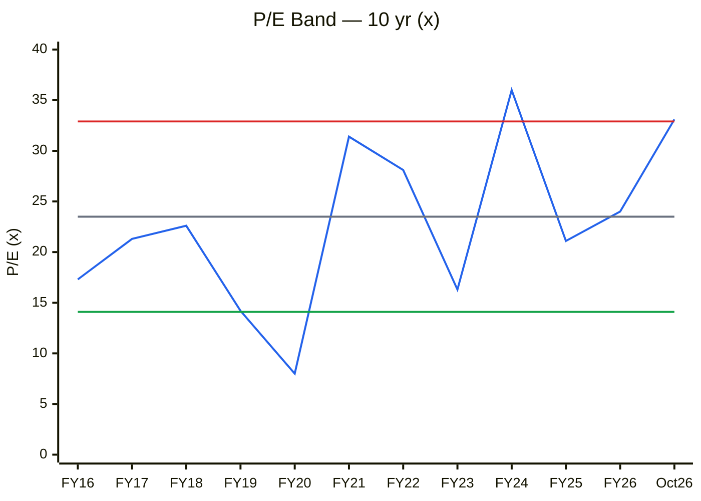
🟦 P/E · ⬜ Median 23.5× · 🟥 +1SD 32.9× · 🟩 −1SD 14.1×
**Read:** P/E is at the **+1SD line (80th percentile)**. The cyclical rule cuts both ways here. In FY22 (peak EPS) the P/E was a "reasonable" 28× and the stock then halved. In FY20 (trough EPS) it was 8× and the stock rose 7×. Today's 33× is a *high* multiple on *recovering* earnings, which is fair only if FY27–28 EPS really doubles. It is not the cheap-at-trough setup of FY20.

**Business inference:** The price assumes a sustained earnings recovery, which is a bet on both spreads and volumes holding, not a margin-of-safety entry. The time to own a cyclical like this is a high P/E on trough earnings, as in FY20 or early FY26, not now.

### CY2 — P/B Band (with ROE)

| | FY16 | FY17 | FY18 | FY19 | FY20 | FY21 | FY22 | FY23 | FY24 | FY25 | FY26 | Oct-26 |
|---|---|---|---|---|---|---|---|---|---|---|---|---|
| P/B (×) | 2.5 | 4.4 | 5.0 | 3.4 | 1.4 | 8.8 | 10.8 | 5.0 | 4.1 | 2.2 | 1.9 | 3.4 |
| ROE (%) | 22.9 | 25.5 | 27.3 | 22.5 | 15.7 | 31.3 | 39.0 | 29.0 | 14.2 | 8.9 | 8.8 | ~11 TTM |

P/B: **median 3.9×, SD 2.9 → band 1.0–6.8×; current 3.4× = 38th percentile.** ROE derived from Screener PAT / average equity.

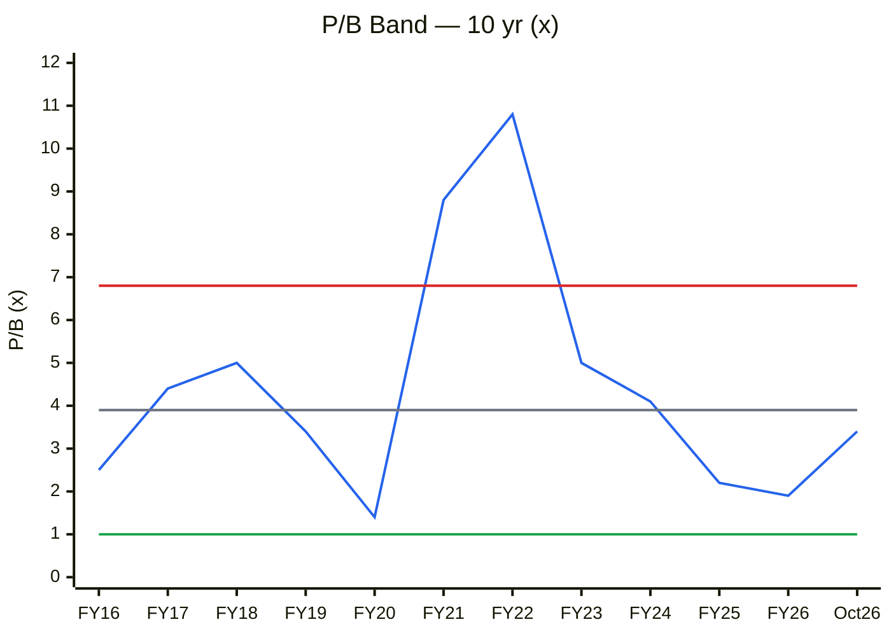
🟦 P/B · ⬜ Median 3.9× · 🟥 +1SD 6.8× · 🟩 −1SD 1.0×
**Read:** On book value the stock is **below its median (38th percentile)**, which is the bull's best argument. But P/B is only cheap relative to the ROE it earns. Justified P/B = (ROE − g)/(Ke − g). At through-cycle ROE ~18–22% (10-yr median ROE 22.9%) (Ke 12.5%, g 7%) that gives **2.0×**. At today's ~11% it gives <1×. 3.4× already prices ROE of ~26%, i.e. a return to the FY21–23 peak.

**Business inference:** Book value looks cheap only if Balaji gets back to peak-cycle returns. On through-cycle profitability the business is worth about 2× book, so the P/B confirms the market is pricing the best years of the upcycle, not the average.

### CY4 — Price vs EPS Index (FY16 = 100)

| | FY16 | FY17 | FY18 | FY19 | FY20 | FY21 | FY22 | FY23 | FY24 | FY25 | FY26 | Oct-26 |
|---|---|---|---|---|---|---|---|---|---|---|---|---|
| Price (₹) | 177 | 379 | 561 | 496 | 247 | 1,787 | 2,990 | 1,943 | 2,045 | 1,207 | 1,065 | 2,086 |
| EPS (₹; TTM for Oct-26) | 17.8 | 25.4 | 34.9 | 36.3 | 32.3 | 73.5 | 113.7 | 100.5 | 63.2 | 48.6 | 51.6 | 63.0 |

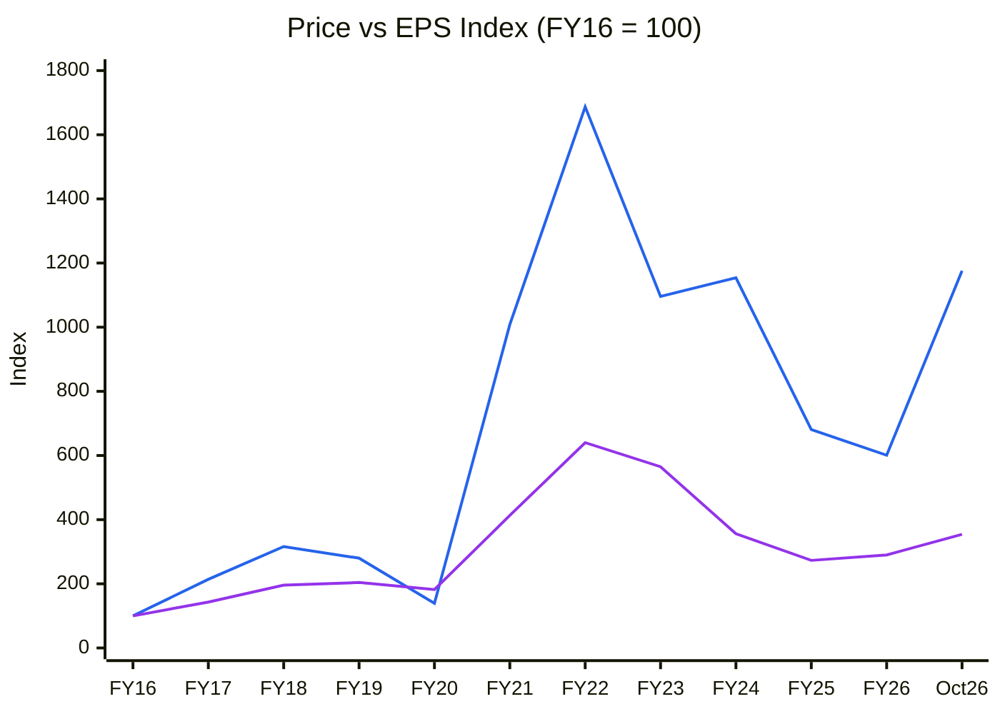
🟦 Price index (10.5-yr CAGR 26.5%) · 🟪 EPS index (12.8%)
**Read:** Price has compounded at **twice the rate of EPS**. Since FY16 the stock has re-rated ~3.3×, and the April–October 2026 move (601 → 1,176) nearly doubled the price on a 22% EPS gain. **Past returns were mostly multiple expansion**, which leaves future returns dependent on EPS catching up, not on further re-rating.

**Business inference:** Most past shareholder returns came from re-rating. The business itself compounded at a respectable but unexceptional rate. Future returns have to come from earnings delivery, which leaves little room for disappointment.

### C13 — Scenario Target Prices vs CMP (2-year, FY28E EPS × multiple)

| Scenario | Driver | FY28E revenue | EBITDA margin | FY28E EPS | Multiple | Target | Prob. |
|---|---|---|---|---|---|---|---|
| Bear | Spread normalises, ADD not notified, volume flat | ₹1,600 Cr | 17% | ₹46 | 18× | **₹830** | 30% |
| Base | Volume +12%/yr, BSCL ramp FY28, margin to median+ | ₹2,300 Cr | 22% | ₹96 | 25× | **₹2,400** | 50% |
| Bull | ₹3,000 Cr target hit, 24% margin holds | ₹3,000 Cr | 24% | ₹145 | 30× | **₹4,350** | 20% |
| **Expected value** | | | | | | **₹2,319** | |

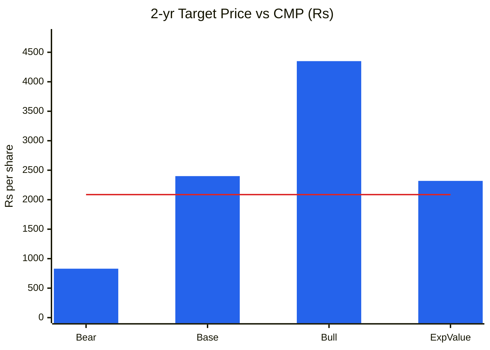
🟦 Scenario price · 🟥 CMP ₹2,086
**Read:** Expected value is **+11% over 2 years** (≈ 5%/yr, below cost of equity). Base-case upside is +15% against bear-case downside of −60% → **U/D = 0.25:1**, which triggers the hard stop. The return comes almost entirely from the 20%-probability bull case.

**Business inference:** The market has already priced in most of the recovery, so the payoff is skewed to the downside if the price cycle turns. The business may do fine, but at this price the investor is not being paid for the cyclical risk.

### Cycle Position Dashboard

| Dimension | Current | 10-yr Median | Percentile | Signal |
|---|---|---|---|---|
| P/E | 33.1× | 23.5× | 80% | **Expensive** |
| P/B | 3.4× | 3.9× | 38% | Fair (but ROE-adjusted: expensive) |
| EBITDA margin | 25.4% (Q1 FY27) / 21% TTM | 21% | ~95% (qtr) | **Peak-type (qtr)** / Mid (TTM) |
| ROCE | 11% (FY26), rising | 24% | 0% | Trough, recovering |
| Asset turnover | 0.94× | 1.55× | 0% | Trough |
| Gross spread % | 44% | 45% | 0% (within 1SD) | Neutral (pass-through) |
| Industry utilisation | n/a (unsourced); Balaji ~35–40% | — | — | Oversupplied domestically |
| Capex / depreciation | 6.1× | 3.8× | 82% | Supply-heavy |
| **Overall cycle position** | | | | **EARLY-TO-MID UPCYCLE, priced as MID-TO-LATE** |

**Consistency check:** Module 1b (cyclical tailwind) and Module 1c (early-to-mid upcycle) agree with the operating data. The *valuation* rows sit a phase ahead of the *earnings* rows. The market has priced the upswing in advance, which is the core of the verdict.

**Graham number:** √(22.5 × 5-yr avg EPS 75.5 × BV 610) = **₹1,017**. Graham screen: fails (P/E > 20).
**Margin of safety (base, relative ₹2,400):** 13% versus the 30–40% required for a mid-cap cyclical → **Inadequate.**
**Misprice reason:** None for a buyer. The stock has been *re-priced* by momentum (ADD news, Q1 beat). **Catalyst:** Q2 FY27 volume print (Nov 2026); ADD notification.

---

## Module 10 — Technical Stage (Weinstein + CANSLIM)

| Item | Reading (Screener price data, 8 Oct 2026) |
|---|---|
| Price path | ₹1,034 (27 Mar) → ₹2,525 (4 Sep weekly high; ₹2,630 intraday) → ₹2,086 |
| 50-DMA | ₹2,183, price **below** and the 50-DMA is rolling over |
| 200-DMA (≈ 40-wk) | ₹1,848, rising; price 13% above |
| Weekly pattern | Lower highs since 4 Sep (2,525 → 2,390 → 2,190 → 2,086). Two-month range ₹2,030–2,525 |
| Volume | Delivery % on recent sessions ~20% (speculative turnover) |
| RS vs Nifty | Strongly positive over 6 months (stock +96% vs Nifty −6%) |
| Nifty stage | Stage 3/4 (index below June levels, FII selling) |

**Stage: late Stage 2 → possible Stage 3 (topping range).** The 30-week MA (~₹1,950–2,000 est.) is still rising, so not Stage 4. A weekly close below ~₹2,000 would confirm Stage 3. **Stop-loss for any existing holding:** ₹1,950 weekly close.

**CANSLIM:** C ✓ (Q1 EPS +97%) · A ✗ (3-yr EPS falling) · N ✓ (DME, BSCL) · S ✓ (small float) · L ~ (leader in Indian amines, RS high) · I ✗ (FII 5.3% → 3.2%) · M ✗ (Nifty weak) → **3.5 / 7.**

---

## Module 11 — Forward View: 2–3 Year Thesis

### Capex classification (FY27 guidance: ₹275–290 Cr consolidated)

| Capex type | FY27E | FY28E | FY29E | In AT model? |
|---|---|---|---|---|
| Tangible growth (BSCL Unit-I/II, NMM, ACN) | ~220 | ~140 | ~70 | ✅ |
| Maintenance (≈ depreciation) | ~60 | ~65 | ~70 | ❌ |
| CWIP to be capitalised (opening FY27) | 512 | — | — | ❌ until commissioned |
| **Total** | **~285** | **~205** | **~140** | |

**CWIP pipeline:** ₹512 Cr at Mar 2026 (DME capitalised from May 2026; BSCL Unit-I ~Sep 2026, still unconfirmed; Unit-II Q4 FY27).

### C14 — Gross Block → Revenue bridge (history + base-case forecast)

| ₹ Cr | FY22 | FY23 | FY24 | FY25 | FY26 | FY27E | FY28E | FY29E |
|---|---|---|---|---|---|---|---|---|
| Gross Block | 969 | 1,104 | 1,264 | 1,417 | 1,511 | 2,000 | 2,250 | 2,350 |
| Revenue | 2,314 | 2,346 | 1,631 | 1,389 | 1,419 | 1,900 | 2,300 | 2,550 |
| AT (×) | 2.39 | 2.12 | 1.29 | 0.98 | 0.94 | 0.95 | 1.02 | 1.09 |

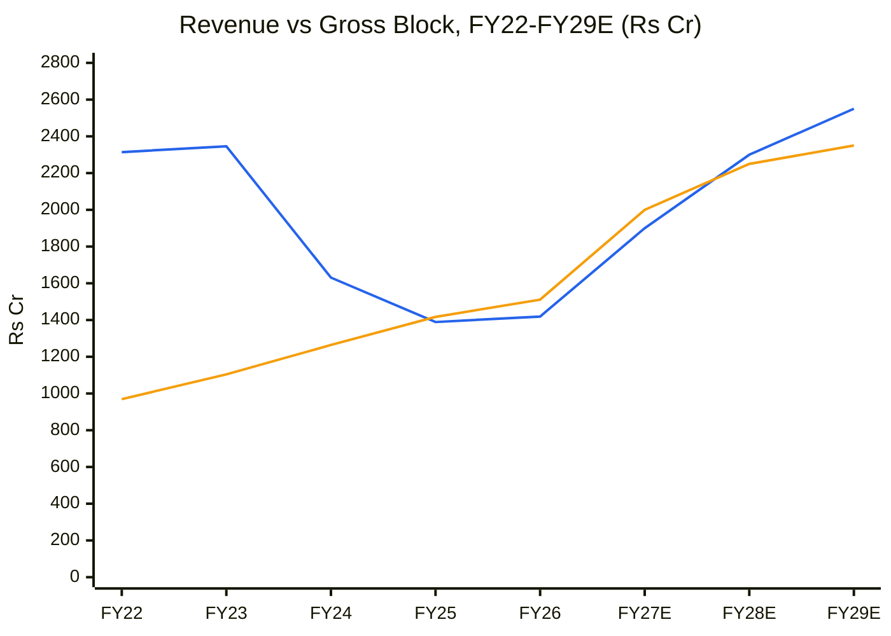
🟦 Revenue · 🟧 Tangible gross block
**Read:** Even the base case keeps AT near **1.0×** through FY29, far below the 1.55× decade average, because ~₹850 Cr of new assets (CWIP + BSCL) arrive at greenfield ramp rates. **Incremental ROIC** on ~₹840 Cr of growth capex: ΔRevenue ~₹1,100 Cr × 13% EBIT margin × 0.745 / 840 ≈ **12.7%, roughly equal to WACC 12.5%. Value-neutral growth.** Capex-implied FY26–29 revenue CAGR ~21%, close to the PIE (~17–18%), so the market prices the full capex plan on time at peak-type margins.

**Business inference:** Balaji is investing heavily for growth that only earns its cost of capital, so expansion makes the company bigger without adding value per share, unless BSCL's new chemistries (protected by the anti-dumping duty) earn better than modelled. Capital allocation at BSCL is the swing factor for the long-term thesis.

### Capex-to-earnings model (base)

| ₹ Cr | FY27E | FY28E | FY29E |
|---|---|---|---|
| Revenue | 1,900 | 2,300 | 2,550 |
| EBITDA margin | 23% | 22% | 21% |
| EBITDA | 437 | 506 | 536 |
| D&A | 65 | 90 | 105 |
| Interest | 10 | 20 | 18 |
| PAT | 283 | 310 | 323 |
| EPS (₹) | 87 | 96 | 100 |
| FCF | ~−40 | ~+120 | ~+230 |
| ICR | 37× | 21× | 24× |

**FCF inflection:** FY28. **Debt ceiling:** peak debt ~₹350 Cr (FY27–28) / normalised EBITDA ~₹450 Cr = 0.8× → **safe.**

### Key catalysts
1. **Q2 FY27 results (early Nov 2026)**: volume growth turning positive would validate guidance and the base case.
2. **ADD on ethylene diamine notified by the Finance Ministry** (pending since the Jul 2026 recommendation): lifts BSCL Unit-I economics.
3. **BSCL Unit-I commissioning** (guided Sep 2026; confirm in Q2 commentary).
4. **DME ramp to 50–60%** by Q4 FY27 (₹100/kg pricing guided), worth ~₹500–600 Cr annual revenue at full run-rate.
5. **BSCL Unit-II (HCN/NaCN/EDTA)**: Q4 FY27; this is the step-change in addressable market.

### Key risks
1. **Realisation reversal** (Chinese amine price cuts, feedstock deflation): **High**. This is the bear case. Q1 FY27 realisation is 60% above a year ago.
2. **Volume does not recover** (FY27 guidance +10–15% vs Q1 −22%): **Medium-High**.
3. **Execution slippage** on BSCL Unit-I/II (WTT pattern: 1–2 quarters): **Medium-High**.
4. **De-rating from +1SD P/E** if margins revert to median: **Medium**. 25× on ₹70 EPS = ₹1,750 (−16%).
5. **ADD not notified / diluted**: **Medium**.

**Investment thesis:** Balaji is a well-run, debt-light amine producer whose earnings have genuinely turned, but the turn is price-led and capital-heavy. At ₹2,086 the market already capitalises Q1 FY27's peak-type margin into the FY28 base case. The asymmetry only works below ~₹1,350–1,450, where the bear case is −40% and the base case +65–75%.

---

## Checklist Summary
**Section A (Business Quality):** 17 / 18 (scuttlebutt beyond filings not done)
**Section B (Forensics):** 9 / 9
**Section C (Financial Statements):** 10 / 12 (Ind AS 116 immaterial; peer DuPont only vs Alkyl qualitatively)
**Section D (KPIs & Peers):** 7 / 7
**Section E (Market Size & Share):** 5 / 7 (TAM and share carried from June; no new data)
**Section F (Valuation):** 10 / 10
**Section G (Technical Stage):** 7 / 8 (volume at breakout not quantified)
**Section H (Forward View):** 24 / 28 (segment-level BSCL vs standalone AT not separated)
**Section I (Charts):** 4 / 4 (CY5 and CY8 omitted by rule: no sourced industry series; disclosed above)
**Hard Stops Triggered:** **Upside/downside ratio < 1.5:1** (0.25:1 base-vs-bear). No other hard stops.

---

## Investment Decision
**Recommendation:** **AVOID at ₹2,086 (hard stop: U/D < 1.5:1) → keep on WATCHLIST**
**Conviction Score:** 4 / 10 (Cycle 0.5 · Industry 0.7 · Moat 1.0 · Management 0.5 · Financial quality 1.5 · Valuation/PIE 0.2 · Technical 0.3; rounded down for price-led recovery)
**Suggested Position Size:** 0% now; 2–3% in the buy zone (half-size per late-cycle modifier until volume recovery is confirmed)
**Entry Price Range:** **₹1,350 – ₹1,450** (U/D ≥ 2:1 against ₹2,400 base / ₹830 bear; ≈ 15× FY28E EPS; near the 200-DMA if the topping range breaks)
**Stop-Loss (existing holders):** weekly close < ₹1,950 (30-week MA)
**Target Price (Base, 2-yr):** ₹2,400
**Review Triggers:**
- *Upgrade:* Q2/Q3 FY27 volume growth > +10% YoY **with** EBITDA margin ≥ 22% (proves the recovery is not just price); ADD notified; BSCL Unit-I commissioned.
- *Downgrade further:* realisation per tonne falls > 15% QoQ; EBITDA margin < 19%; Unit-II slips to FY28; pledge rises above 25% of promoter holding.

---

## Data Sources & Citations
- [Screener.in — BALAMINES consolidated](https://www.screener.in/company/BALAMINES/consolidated/): P&L, balance sheet, cash flow, ratios, shareholding, fixed-asset & expense schedules, P/E, P/B and price chart data (accessed 9 Oct 2026)
- [IndianChemicalNews — Q1 FY27](https://www.indianchemicalnews.com/chemical/balaji-amines-starts-fy27-on-a-strong-note-as-q1-revenue-touches-rs-461-crore-31267)
- [Multibagg — Q1 FY27 results](https://www.multibagg.ai/market-pulse/articles/balaji-amines-q1-fy27-results-cms624j217el30yqv3frpsq8o)
- [Sahi — Q1 FY27 PAT](https://www.sahi.com/news/balaji-amines-reports-q1-net-profit-of-74-9-crore-up-from-38-crore-yoy-2149-PE1_COR)
- [StocksSena — Q4 FY26 concall summary](https://www.stockssena.com/stocks/BALAMINES/concall/q4-fy2026)
- [ScanX — analyst meet / plant visit Aug 2026](https://scanx.trade/stock-market-news/companies/balaji-amines-hosts-analyst-meet-plant-visit-solapur-aug-25/48515699)
- [Bajaj Broking — EDA anti-dumping rally, 8 Jul 2026](https://www.bajajbroking.in/share-market-news/balaji-amines-alkyl-amines-rally-heres-why)
- [DSIJ — amine stocks rally](https://insights.dsij.in/dsijarticledetail/balaji-amines-soars-12-alkyl-amines-gains-8-whats-fueling-the-rally)
- [ScanX — promoter pledge to HDFC Bank, Dec 2025](https://scanx.trade/stock-market-news/stocks/balaji-amines-promoter-pledges-8-75-lakh-shares-to-hdfc-bank-for-credit-facilities/28892808)
- [Trendlyne — shareholding](https://trendlyne.com/equity/share-holding/152/BALAMINES/latest/balaji-amines-ltd/)
- [StockPil — markets 5 Oct 2026](https://stockpil.com/india-markets-today-2026-10-05/) · [HDFC Sky — VIX 1 Oct 2026](https://hdfcsky.com/news/india-vix-rises-1-41percent-as-global-yields-fii-selling-lift-early-session-volatility-october-1-2026)
- Peer ratios: Screener.in pages for ALKYLAMINE (standalone), VINATIORGA, DEEPAKNTR, AARTIIND, GNFC (9 Oct 2026)
- Prior report: BALAMINES_BalajiAmines_2026-06-11.md (Five Forces, TAM, Fisher score carried forward where unchanged)

---
*Report generated by Stock Fundamental Analysis Skill v3.1 | Indian Markets Context*
*Save path: C:\Users\anubh\Documents\Anubhav\Stock Analysis\Stock Analysis\*
*DISCLAIMER: For informational purposes only; not investment advice. Estimates (FY27E–FY29E, DCF, scenario prices) are the analyst model's, not company guidance.*
