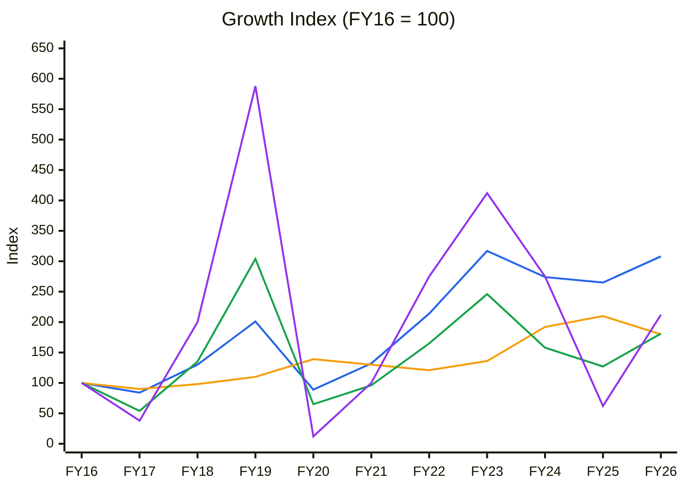
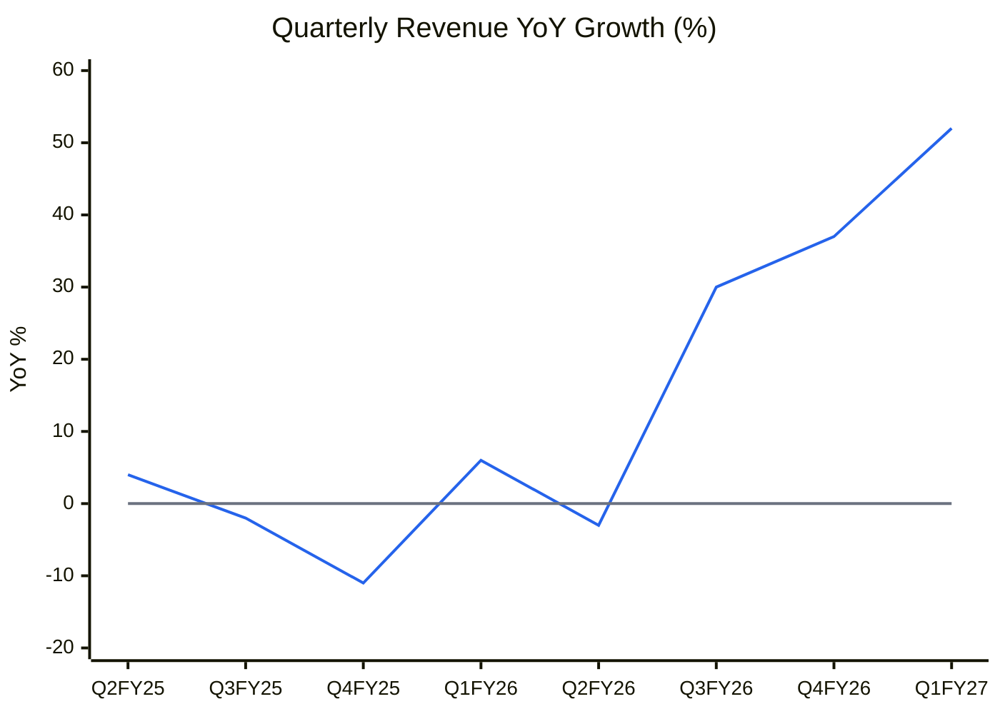
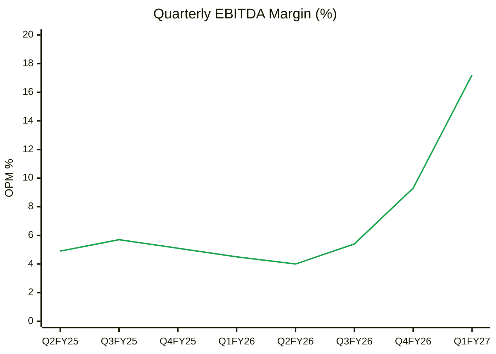
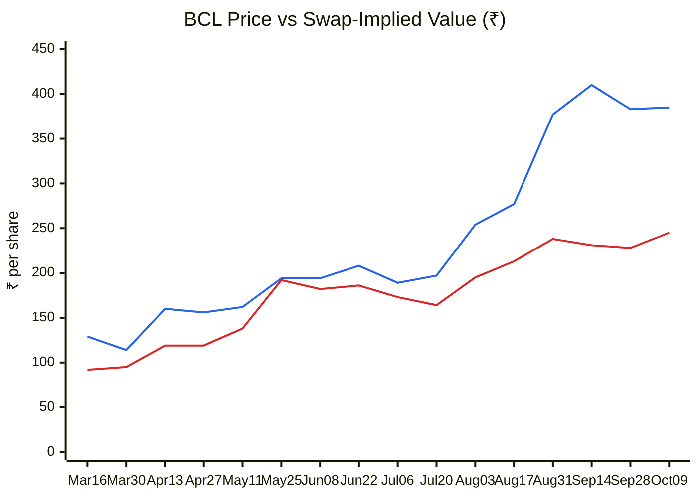
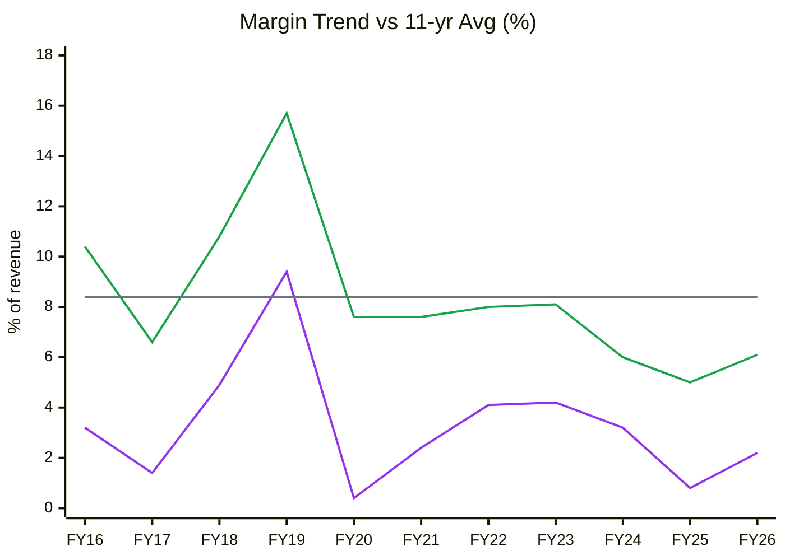
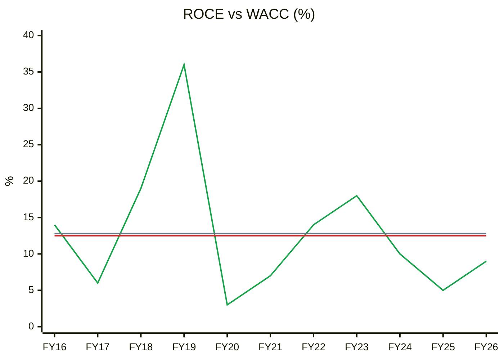
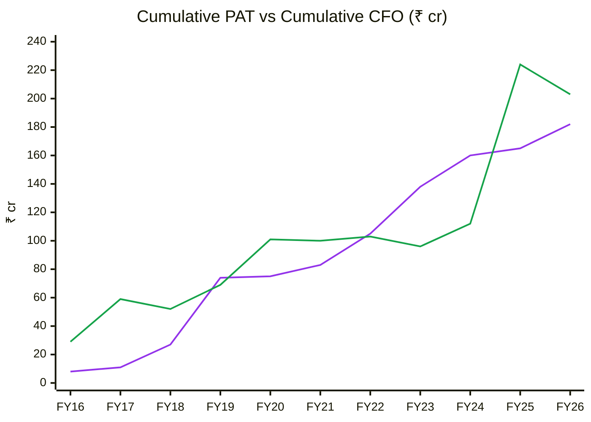
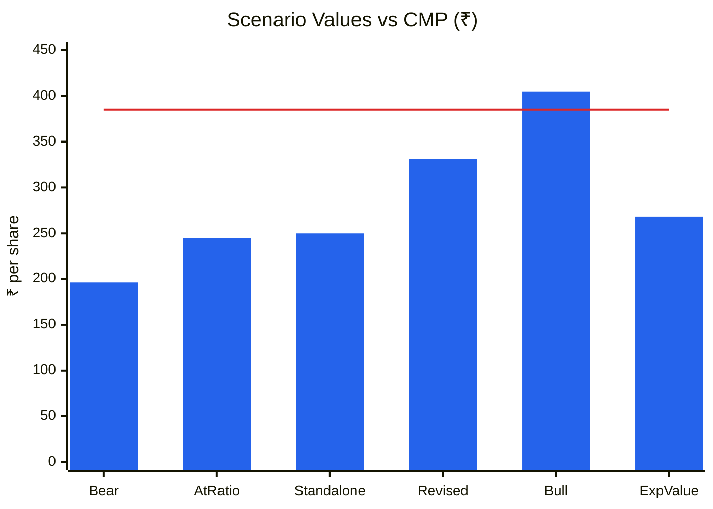
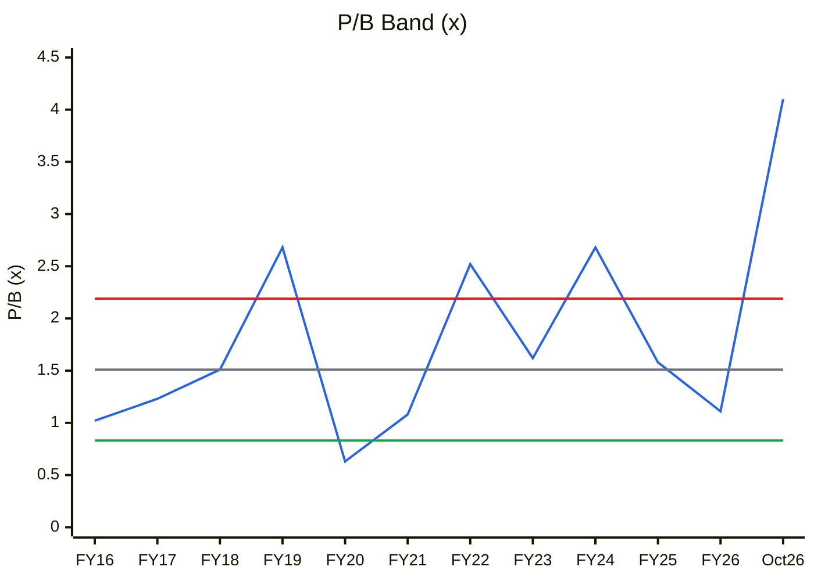
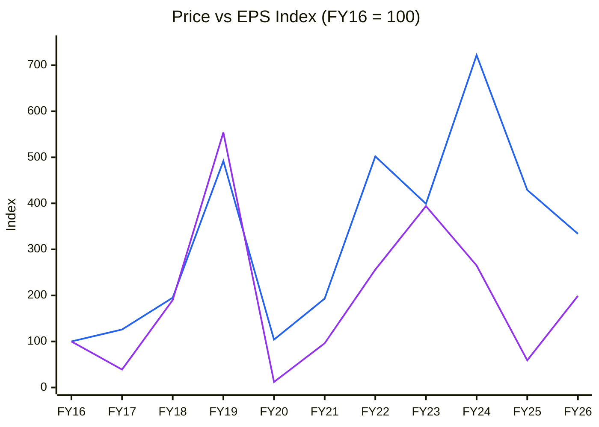

# Stock Analysis Report — Birla Cable Limited (NSE: BIRLACABLE | BSE: 500060)
**Date:** 2026-10-10
**Analyst:** Claude (Stock Fundamental Analysis Skill v3.3)
**Investment Horizon:** 2–3 Years
**CMP:** ₹385 (9-Oct-2026) | **Market Cap:** ₹1,156 Cr (3.00 Cr shares) | **P/E (TTM):** 25.0× | **P/B:** 4.1× | **Swap-implied value:** ₹245 (VTL ₹2,814 × 10/115)
**Recommendation:** AVOID (at ₹385)
**Conviction Score:** 2.8 / 10

## Revision Log
| Version | Date | Recommendation | Conviction | Price | Key change |
|---|---|---|---|---|---|
| Current | 2026-10-10 | AVOID | 2.8/10 | ₹385 | Price +72% in four months. Q1FY27 PAT ₹31 Cr (FY26 full year ₹17 Cr) on an OFC price upcycle. Exchanges cleared the VTL scheme (14-Aug-26), but the stock now trades **57% above swap parity**. The market is betting on a ratio revision or a failed scheme. |
| Previous | 2026-06-11 | AVOID | 3.4/10 | ₹224 | Initial report (full text in git history) |

**What changed in the thesis:** In June the question was "is Birla Cable worth ₹224 standalone?" (no: ~₹75–95). Two things have changed. **(1)** The standalone business has inflected with the AI-driven optical-fibre price cycle: Q1FY27 revenue +51%, OPM 17.2% vs 4–6% in FY25–26, and the industry context from the HFCL and STL reports shows the same upcycle. Standalone value roughly triples to ~₹250 on mid-cycle earnings. **(2)** The scheme is moving forward. SEBI/NSE/BSE observation letters (14-Aug-26) carry two conditions that matter: the valuation must use financials no older than 6 months (the scheme used Dec-2025 figures), and the scheme passes only if public shareholders vote in favour. At ₹385, the stock prices well above both the swap value (₹245) and the revised standalone value (₹250). It is effectively pricing a generous ratio revision as the base case.

**Validation of the previous report**
| Item | Previous (2026-06-11) | Now (2026-10-10) | Status |
|---|---|---|---|
| Price / market cap | ₹224 / ₹672 Cr | ₹385 / ₹1,156 Cr; 52-wk ₹104–419 | 🔄 Updated |
| BSE scrip code | not stated | 500060 | 🔄 Added |
| Scheme terms | 10 VTL for 115 BCL; appointed date 1-Apr-26 | Same; exchange observation letters received 14-Aug-26 (NSE "no objection", BSE "no adverse observations"); NCLT petition/meeting not yet filed | ✅ Validated + 🔄 progress |
| Swap-implied value | "requires VTL share count" (gap) | VTL 1,18,50,863 shares pre-scheme; issues ~21.0 lakh new shares; implied ₹2,814 / 11.5 = **₹245** | 🔄 Gap closed |
| Promoter holding | 66.35–66.4% | 66.35% (Jun-26), unchanged for 13 quarters | ✅ Validated |
| Pledge | Zero | Zero (VTL confirmed no encumbrance) | ✅ Validated |
| FY26 PAT | ₹16.90 Cr (+245%) | ₹17 Cr (Screener) | ✅ Validated |
| FY26 EBITDA margin | 9.46% | **6.1%** (₹47 Cr / ₹771 Cr, Screener); 9.46% unsourced | ❌ Corrected |
| Exports | "Nearly 100% domestic / <5%" | **FY26 exports ₹78.5 Cr (~10% of revenue)**; Dubai subsidiary (Birla Cable Infrasolutions DMCC) | ❌ Corrected |
| Credit rating | "CARE BBB (Nov 2024)" | CARE **BBB+/A2 unsupported (Rating Watch Positive)**; VTL-guaranteed facilities **A(CE)/A1(CE)**, downgraded from A+(CE), Rating Watch Developing (1-Apr-26) | ❌ Corrected |
| Debtor days | "~60–90 estimated" | **96 days** (FY26), 92 (FY25) | ❌ Corrected |
| OCF / net income | "~0.9–1.0 estimated" | FY26 CFO **−₹21 Cr** vs PAT ₹17 Cr; 5-yr cumulative CFO/PAT 1.04; 11-yr 1.12 (volatile, positive over the cycle) | 🔄 Updated |
| Piotroski F | ~6–7 | **~5/9** (fails CFO>0, CFO>NI, leverage) | ❌ Corrected |
| Altman Z'' | "Grey zone" | **5.6, Safe** (FY26) | ❌ Corrected |
| Sloan | "likely <10%" | 5.9% (FY26) | ✅ Validated |
| ROCE 3-yr average | 7.86% | FY24 10% / FY25 5% / FY26 9% → 8.0% | ✅ Validated |
| Net D/E | "likely <0.5" | 0.47× (borrowings ₹133 Cr / net worth ₹282 Cr) | ✅ Validated |
| Investments | not covered | 7.86 lakh Universal Cables shares (FVOCI): ₹51 Cr at Mar-26 → **~₹119 Cr at ₹1,519** (9-Oct); drove the Q1 OCI gain of ₹40.7 Cr | 🔄 Added |
| Auditor / KAM | not covered | V. Sankar Aiyar & Co. (term to FY27 AGM); KAM on recoverability of trade receivables; no EoM found | 🔄 Added |
| Management | not covered | Shri Somesh Laddha appointed Manager (22-May-26; AGM approved 3-Aug-26) | 🔄 Added |
| Nifty stage | "Stage 2" | **Stage 4** (22,520; below a declining 30-wk MA) | 🔄 Updated |
| VTL market cap / P/E | ₹2,409 Cr / ~15× | ₹3,335 Cr / 14.1× | 🔄 Updated |
| KPI segment | "Proposed KPIs, pending approval" | Near-match: **Telecom Equipment OEM block** (line 415), same block used in the HFCL/STL reports | 🔄 Updated |
| Concall transcripts | gap | None exist (the company does not hold calls) | ✅ Gap confirmed |
| Order book | "<1× estimated" | Not disclosed; no Reg 30 order filings Jan-2024 → Oct-2026 (BSE harvest). Tracker not applicable | ⚠️ Unverifiable |

---

## Executive Summary
Birla Cable is a ₹860 Cr (TTM) optical-fibre-cable (OFC) and copper structured-cable maker in the M.P. Birla group. It is in the middle of being absorbed into its parent, Vindhya Telelinks (VTL), at 10 VTL shares for every 115 Birla Cable shares. The business has just inflected with the global OFC price upcycle (Q1FY27 OPM 17% vs a 10-yr average of 8%), but its long-run economics are poor: ROCE has averaged ~13% over 11 years with huge swings, it has no moat, and it has high customer concentration. At ₹385 the stock trades 57% above what the scheme would deliver (₹245) and above even a mid-cycle standalone value (~₹250). It only works if the board revises the swap ratio sharply in Birla Cable's favour or the scheme fails and peak-cycle OFC earnings persist. That is a speculative bet, not an investment. Avoid.

🟦 Revenue (10-yr CAGR 11.9%) · 🟧 Net fixed assets (6.1%) · 🟩 EBITDA (6.1%) · 🟪 PAT (7.8%). Standalone, Screener.
**Read:** Revenue tripled over the decade, but EBITDA and PAT grew at half that rate and swung violently: PAT index 588 in FY19, 12 in FY20, 412 in FY23, 62 in FY25. Fixed assets grew slower than revenue, so the business has not been capital-constrained.

**Business inference:** This is a price-taker in a boom-bust commodity (optical fibre). Profit is set by the fibre price cycle, not by Birla Cable's own execution, which is why a decade of 12% revenue growth produced no lasting margin improvement. The Q1FY27 profit spike should be treated as the next peak in the same cycle (FY19 was the last one), not as a new earnings base.

**Order book tracking:** not run. No order book is disclosed and there were no Reg 30 order filings (BSE, Jan-2024 to Oct-2026), although CARE's sensitivities reference one.

---

## BUSINESS PRIMER

Birla Cable (Rewa, Madhya Pradesh; M.P. Birla group, chaired by Harsh V. Lodha) makes optical fibre cables, copper telecom and structured LAN cables, fibre accessories and specialty cables. It sells to telecom operators, BharatNet and other government network projects, system integrators and, increasingly, export customers: FY26 exports were ₹78.5 Cr, ~10% of revenue (FY26 annual report), with a Dubai trading subsidiary. Revenue is volume (fibre-km, copper cable km) × realisation. Realisation follows the global optical-fibre price cycle (oversupplied 2019–24, now tightening on AI-data-centre demand), so margins swing from ~4% to ~16%. It buys fibre and preform rather than making them, so it captures only the cabling spread. The economics depend on (1) OFC prices and telco/government capex timing, and (2) group support: VTL guarantees its bank lines (CARE, Apr-2026).

This is a **sub-scale commodity converter inside a promoter group that is consolidating it away.** The key value driver is the OFC price cycle (margin, not volume). The key risks are the cycle turning, high client concentration (CARE) and the terms of the merger. One structural feature dominates everything: the **scheme of amalgamation into VTL** (board-approved 21-Mar-2026; exchange observation letters 14-Aug-2026; NCLT, creditor and shareholder approvals pending). Each Birla Cable share is mechanically worth 1/11.5 of a VTL share if the scheme completes on current terms. The secondary feature is a ~₹119 Cr stake in group company Universal Cables (~₹40/share pre-tax), carried at fair value.

**Segment check:** near-match **Telecom Equipment OEM** block ✓ (KPI reference line 415; also used for HFCL/STL). *Module SS (special situations) is not formally invoked, since the user did not request it, but the scheme is analysed as a valuation input, as in the previous report.*

---

## MODULE 1 — Broad Market Cycle
Nifty 50 at 22,520 (9-Oct-26): −12.4% YoY, near its 52-wk low, below a declining 30-wk MA (23,718). India VIX up sharply over the past month. **Assessment: Cautious → Fearful.** Small-cap speculation is still visible in names like this one: the exchanges sought a price-movement clarification on 7-Sep-26, and the company replied that the move was "purely market driven". **Sizing:** defensive.

## MODULE 1b — Sector Cycle (OFC / telecom cables)
- **Secular (~10–12%):** BharatNet Phase III, FTTH, 5G backhaul, data-centre interconnect, China+1 sourcing by Western telcos.
- **Cyclical (now the dominant driver):** global optical-fibre prices bottomed in 2024–25 after a 2019–24 glut and are rising in 2026 on AI-data-centre demand. HFCL's Q1FY27 margin hit 23% and its exports 56% of revenue (HFCL report, 9-Oct-26). Birla Cable's Q1 margin jump to 17% is the same cycle reaching a price-taker.
- **Supply response:** HFCL is expanding fibre 28 → 34 mn fkm and OFC 34 → 43 mn fkm, and Corning, Prysmian and YOFC are adding AI-fibre capacity (HFCL report). The classic capital cycle says peak margins will be competed away in 2–3 years.
- **Input:** fibre/preform is bought in, so input prices rise with the cycle and compress the converter's spread later in the upcycle. Copper is volatile.
- **Verdict: TAILWIND (cyclical, near-term) on a NEUTRAL structural base.** Do not capitalise Q1FY27 margins. Widen MoS for a late-stage cyclical bounce.
*CY5/CY6 (industry capacity vs demand; fibre price series) not built: no sourced 10-yr series.*

## MODULE 1c — Stock Cycle

| Quarter | Revenue ₹Cr | YoY | EBITDA ₹Cr | OPM | PAT ₹Cr |
|---|---|---|---|---|---|
| Q2FY25 | 182 | +4% | 9 | 4.9% | 2 |
| Q3FY25 | 158 | −2% | 9 | 5.7% | 2 |
| Q4FY25 | 156 | −11% | 8 | 5.1% | 1 |
| Q1FY26 | 176 | +6% | 8 | 4.5% | 1 |
| Q2FY26 | 176 | −3% | 7 | 4.0% | 1 |
| Q3FY26 | 205 | +30% | 11 | 5.4% | 4 |
| Q4FY26 | 214 | +37% | 20 | 9.3% | 11 |
| Q1FY27 | 267 | +52% | 46 | 17.2% | 31 |
*(Standalone, Screener. Q1FY27 consolidated PAT ₹30.70 Cr; DMCC subsidiary revenue ₹3.87 Cr.)*

🟦 Revenue YoY % · ⬜ zero line
**Read:** After five quarters of −11% to +6%, revenue growth accelerated three quarters in a row: +30%, +37%, +52%.

**Business inference:** The demand turn is real and broad (OFC plus structured copper LAN cable, with exports rising). Because Birla Cable has little pricing power, the acceleration is mostly market-driven volume and realisation recovery. It will fade as industry capacity catches up, so it is a cyclical tailwind, not a share-gain story (Module 1c: early-to-mid upcycle).

🟩 EBITDA margin (standalone)
**Read:** OPM was stuck at 4–6% for six quarters, then rose to 9.3% (Q4FY26) and 17.2% (Q1FY27), above even the FY19 cycle peak of 15.7%.

**Business inference:** With raw-material costs up 31.5% against revenue up 51% (Q1 filing), the spread between bought-in fibre and cable prices has widened sharply. That is the most volatile margin in the value chain. A converter earning 17% is at or above its historical ceiling, so the market should value this as a peak quarter. A FY27 average of ~13% and a mid-cycle of ~8% are the realistic anchors.

**Volume/price/mix:** not disclosed (single "Cables" segment). CARE notes "steep price corrections in the OFC segment" in FY25–9MFY26 and a rising share of lower-margin structured cables. Q1's jump therefore looks **price/spread-led**, the least durable driver.
**Operating leverage:** very high DOL. A 51% revenue rise turned into a 23× PAT rise. DFL is falling (interest ₹2 Cr/quarter). The same leverage works in reverse.
**Guidance accuracy:** no concalls or guidance, so not computable.
**Stock cycle classification: EARLY-to-MID UPCYCLE on the business, LATE on the stock** (P/B at a decade high; see the Cycle Position Dashboard).

---

## MODULE 2 — Industry Structure & Capital Cycle
| Force | Assessment | Signal |
|---|---|---|
| New entrants | Moderate capital needs for cabling; fibre/preform is the scale barrier (Birla Cable lacks it) | Unfavourable for sub-scale converters |
| Supplier power | Fibre/preform from integrated majors (often competitors) | High ✗ |
| Buyer power | Telcos and government tenders; CARE flags high client concentration | High ✗ |
| Substitutes | None near-term | Low |
| Rivalry | HFCL, STL, Aksh, VTL itself, plus Chinese imports; tender price-driven | Very high ✗ |

**Verdict: UNATTRACTIVE for a sub-scale converter.** **Capital cycle:** turning from trough to upcycle (prices rising), with supply responses already announced (HFCL, global majors). That puts it in the window where margins peak within 2–3 years.

---

## MODULE 3 — Business Quality, Moat & Management
- **Moat: NONE** (validated ✅). No cost edge (no fibre integration), no customer captivity (tender-based) and no local scale.
- **Buffett 10% price test:** FAIL (margins collapsed to 4% when industry prices fell in FY25).
- **Fisher 15-point:** 26/45 (was 27). Integrity **PASS**: no SEBI action, zero pledge, prompt Reg 30 disclosures, and a transparent clarification on the price move. Candor on the merger is fine, but there are no investor calls at all.
- **Promoter:** 66.35% (VTL plus M.P. Birla group), flat for 13 quarters; **pledge 0%** ✅. FII/DII ~0% (no institutional following).
- **Capital allocation: POOR on the standalone record.** 11-yr average ROE ~9%, below cost of equity. The dividend of ₹1.25/share (payout 22%) is fine. The merger itself is the group's capital-allocation decision.
- **RPT / group links:** VTL corporate guarantee on ₹296 Cr of BCL facilities (CARE); ₹119 Cr stake in Universal Cables (group company), FVOCI. No ICDs to group identified (FY26 AR not fully parsed).
- **Walk the Talk:** not computable (no guidance, no concalls). Previous-report items: Q2FY26 margin miss ❌, Q4FY26 recovery ✅, merger progressing ✅ (observation letters received). **Credibility: MODERATE** (honest disclosure, no guidance).
- **Insider action:** no promoter trades. VTL holds BCL shares that are cancelled under the scheme. **NEUTRAL.**

### The scheme: what the shareholder actually owns
| Item | Detail | Source |
|---|---|---|
| Ratio | 10 VTL shares (₹10 FV) for every 115 BCL shares held by shareholders other than VTL; VTL's own BCL holding is cancelled | Scheme summary (BSE, 21-Mar-26) |
| Valuers | RBSA Valuation Advisors and GT Valuation Advisors; fairness opinion by a SEBI merchant banker | Scheme summary |
| Financial basis | Dec-31-2025 limited-review numbers (BCL net worth ₹229 Cr; 9M turnover ₹557 Cr) | Scheme summary |
| VTL shares | 1,18,50,863 pre-scheme → 1,39,55,102 post-scheme (promoters 43.54% → 41.26%) | Scheme summary |
| Exchange letters | 14-Aug-2026: NSE "no objection", BSE "no adverse observations" | BSE filing |
| Key SEBI conditions | Valuation financials **not older than 6 months**; the scheme is acted upon **only if public shareholders' votes in favour exceed votes against**; NOC from ≥ 75% of secured creditors | SEBI comments in the NSE letter |
| Pending | NCLT petition, creditor/shareholder meetings, NCLT order | — |

🟦 Birla Cable price (weekly close) · 🟥 Swap-implied value = VTL price ÷ 11.5 (Yahoo Finance, fortnightly points)
**Read:** From May to July the premium to swap parity was a normal 1–20%. After the Q1 results (2-Aug) and the exchange observation letters (14-Aug), it widened to 58–77% and is now 57% (₹385 vs ₹245).

**Business inference:** The market no longer believes the 10:115 ratio will stand. Birla Cable's Q1 profit made the Dec-2025-based valuation look stale, and SEBI's 6-month-financials rule and public-shareholder vote give BCL's minority a lever. But the company has announced no revision. If the ratio holds, holders lose ~36% at today's VTL price. A shareholder who wants the merged-entity exposure gets ~57% more VTL through VTL directly than through the scheme.

---

## MODULE 4 — Financial Forensics
| Model | FY26 | Read |
|---|---|---|
| Beneish M (proxy) | **−2.02** | Grey zone; TATA 0.082 (PAT ₹17 Cr vs CFO −₹21 Cr) |
| Altman Z'' | 5.6 | Safe |
| Piotroski F | ~5 / 9 | Average |
| Sloan | 5.9% | Acceptable |
| Cumulative CFO/PAT | 5-yr 1.04 · 11-yr 1.12 | Cash-backed over the cycle, volatile year to year (FY25 +₹112 Cr, FY26 −₹21 Cr) |

**Indian flags:** zero pledge ✅. KAM on recoverability of trade receivables (debtor days 96) ⚠️. Customer concentration (CARE) ⚠️. Rating downgrade of VTL-guaranteed lines (A+(CE) → A(CE), RWD) reflects VTL's own stretch (VTL TD/PBILDT 3.9×, interest cover ~1.4× in 9MFY26, CARE), i.e. **the acquirer's balance sheet is weaker than the target's** ⚠️. Q1 OCI gain (₹40.7 Cr) is mark-to-market on Universal Cables shares, not operating.
**Forensic red flags: 3 / 15** (CFO<0 in FY26, receivables KAM/DSO, Beneish grey). **Verdict: MINOR CONCERNS.** The earnings are real and cyclical.

---

## MODULE 5 — Earnings Quality & Financial Statements
| FY | Sales | EBITDA | OPM % | PAT | PAT % | ROCE % | CFO | EPS ₹ |
|---|---|---|---|---|---|---|---|---|
| FY16 | 250 | 26 | 10.4 | 8 | 3.2 | 14 | 29 | 2.83 |
| FY17 | 211 | 14 | 6.6 | 3 | 1.4 | 6 | 30 | 1.11 |
| FY18 | 325 | 35 | 10.8 | 16 | 4.9 | 19 | −7 | 5.38 |
| FY19 | 502 | 79 | 15.7 | 47 | 9.4 | 36 | 17 | 15.68 |
| FY20 | 223 | 17 | 7.6 | 1 | 0.4 | 3 | 32 | 0.34 |
| FY21 | 329 | 25 | 7.6 | 8 | 2.4 | 7 | −1 | 2.73 |
| FY22 | 535 | 43 | 8.0 | 22 | 4.1 | 14 | 3 | 7.25 |
| FY23 | 792 | 64 | 8.1 | 33 | 4.2 | 18 | −7 | 11.16 |
| FY24 | 686 | 41 | 6.0 | 22 | 3.2 | 10 | 16 | 7.50 |
| FY25 | 662 | 33 | 5.0 | 5 | 0.8 | 5 | 112 | 1.68 |
| FY26 | 771 | 47 | 6.1 | 17 | 2.2 | 9 | −21 | 5.62 |
| TTM | 861 | 84 | 9.8 | 46 | 5.3 | — | — | 15.40 |
*(₹Cr, standalone, Screener 10-Oct-2026)*

🟩 EBITDA margin · 🟪 PAT margin · ⬜ 11-yr average OPM 8.4% (SD 2.9; +1SD 11.3%)
**Read:** OPM above 11% happened only in the FY16/FY18/FY19 fibre upcycle. FY24–26 sat below average at 5–6%, and Q1FY27's 17.2% is +3SD.

**Business inference:** The decade shows a mean-reverting spread business, so through-cycle earnings power is ~8% OPM, roughly ₹45–50 Cr PAT on ₹1,000 Cr of revenue. Valuing the company on Q1-annualised profit (~₹120 Cr) would treat a +3SD spike as permanent, the same mistake that would have bought the stock at the FY19 peak (₹154) before it fell to ₹33.

🟩 ROCE (Screener) · 🟥 WACC 12.5% · ⬜ 11-yr average 12.8% (SD 8.9)
**Read:** ROCE beat WACC in 5 of 11 years (only in upcycles). The average equals WACC, and the last three years were 5–10%.

**Business inference:** Across the cycle the business earns its cost of capital and no more, so it creates no value through a cycle. It deserves roughly book-value multiples on normalised earnings (justified P/B ≈ 1×), not the 4.1× it trades at. Any premium is paying for the upcycle and the merger optionality.

🟪 Cumulative PAT · 🟩 Cumulative CFO
**Read:** Cumulative CFO (₹203 Cr) exceeds cumulative PAT (₹182 Cr): a ratio of 1.12. The path is lumpy: FY25 alone released ₹112 Cr, and FY26 reabsorbed ₹21 Cr.

**Business inference:** Earnings are genuinely cash-backed over a cycle. Working capital (receivables at ~96 days) swells in upturns and releases in downturns. This is the one clean feature of the business. Expect FY27 CFO to lag PAT as the revenue surge builds receivables.

**DuPont (5-factor, standalone, average balances)**
| Year | EBIT margin | Asset turnover | Equity multiplier | Interest burden | Tax burden | ROE |
|---|---|---|---|---|---|---|
| FY22 | 6.5% | 1.61 | 1.87 | 0.83 | 0.76 | 12.4% |
| FY23 | 7.3% | 1.96 | 1.94 | 0.78 | 0.73 | 15.8% |
| FY24 | 6.6% | 1.49 | 1.91 | 0.67 | 0.73 | 9.1% |
| FY25 | 3.2% | 1.51 | 1.73 | 0.33 | 0.71 | 2.0% |
| FY26 | 4.5% | 1.75 | 1.65 | 0.66 | 0.74 | 6.3% |

**DuPont verdict:** ROE swings are entirely margin-driven. AT is stable (1.5–2.0×) and leverage is falling. There is no financial engineering; it is a pure spread cycle. **O'Glove flags: 3 / 15.**

---

## MODULE 6 — Industry KPIs & Peer Analysis
**Sector:** Telecom Equipment OEM (near-match; line 415)
| KPI | Birla Cable | Healthy | Assessment |
|---|---|---|---|
| Order book / TTM revenue | Not disclosed | > 1.5× | ⚠️ Unknown |
| Customer concentration | "High" (CARE); top-client % not disclosed | < 30% | ✗ |
| Gross / EBITDA margin | EBITDA 17.2% (Q1) / 6.1% (FY26) | GM 35–50% for an IP-led OEM | ✗ commodity converter |
| CCC | 124 days (FY26) | < 120 | ⚠️ borderline |

**Peers (Screener / earlier reports, Oct-2026)**
| Metric | Birla Cable | HFCL | Vindhya Telelinks |
|---|---|---|---|
| TTM revenue | ₹861 Cr | ~₹6,500 Cr+ (Q1FY27 ₹1,915 Cr) | ₹3,405 Cr |
| Latest-quarter EBITDA margin | 17.2% | 23% | 12% |
| ROCE (latest) | 8.9% | ~11% | 8.2% |
| P/E (TTM) | 25.0× | high (see HFCL report) | 14.1× |
| P/B | 4.1× | — | 0.79× |
| Pledge | 0% | — | — |

**Positioning:** Birla Cable trades at **5× VTL's P/B** although VTL is the entity it is merging into. The relative-value gap is the single most important valuation fact (Module 3 chart).

---

## MODULE 7 — Market Size & Market Share
India OFC/telecom-cable market ~₹8,000–10,000 Cr (previous report, not re-sourced ⚠️). Birla Cable ~₹860 Cr TTM ≈ ~9–10%. Exports are ~10% of revenue and rising. Share is **growing with the market**; the FY27 surge is industry-wide (HFCL +120%). No structural share gain is evident.

---

## MODULE 8 — Valuation & Margin of Safety

### 8A. PIE
EV ≈ ₹1,156 + ₹133 debt − ₹2 cash = **₹1,287 Cr** (the UCL stake, ~₹119 Cr, is treated separately below). TTM NOPAT ≈ EBIT ₹72 Cr × 0.75 = ₹54 Cr → **EV/NOPAT 24×**. At a 13% WACC and ROCE ≈ WACC, growth adds no value. The price implies either (a) ~15%+ OPM sustained indefinitely (vs an 8.4% average), or (b) a swap revision worth ~₹140 per share. **Optimistic gap.** The expectations treadmill requires Q1-level margins for 3+ years, which has never happened.
**SVAR:** downside to ₹196 (scheme completes at current terms and VTL falls 20%) → **49%**.

### 8B. Intrinsic value: standalone (if the scheme fails or as a reference for any revaluation)
| Method | Bear | Base | Bull |
|---|---|---|---|
| Normalised P/E (EPS ₹15.5 = 8.4% OPM on ₹1,000 Cr) × 12 / 16 / 20 | ₹186 | ₹248 | ₹310 |
| EPV (mid-cycle NOPAT ₹51 Cr / 13% − net debt ₹80 Cr + UCL after-tax ~₹100 Cr) | ₹137 | ₹137 | ₹137 |
| Peak-cycle P/E (FY27E EPS ₹28.9 × 10–14) | — | ₹289 | ₹405 |
| **Standalone consensus** | **₹160** | **₹250** | **₹330** |

**Graham Number:** √(22.5 × 5-yr avg EPS ₹6.64 × BVPS ₹94) = **₹118**.

### 8C. Scheme-weighted scenarios (12–18-month horizon to the NCLT outcome)
| Scenario | Outcome | Value/share | Prob. |
|---|---|---|---|
| Bear | Scheme completes at 10:115 and VTL −20% | ₹196 | — (stress) |
| A | Scheme completes at 10:115, VTL flat | ₹245 | 40% |
| B | Ratio revised (fresh valuation on FY27 earnings), e.g. ~10:85 | ₹331 | 25% |
| C | Scheme withdrawn or rejected by the public-shareholder vote → standalone base | ₹250 | 35% |
| Bull | Standalone, peak-cycle earnings re-rated (₹28.9 × 14) | ₹405 | — (stress) |
| **Expected value** | | **₹268** | |

🟦 Scenario value · 🟥 CMP ₹385
**Read:** Every scenario except the stress bull case sits below CMP. Expected value is ₹268 (−30%), and **U/D is (405 − 385) / (385 − 196) = 0.11:1**.

**Business inference:** Even a generous revision (₹331) or a peak-cycle standalone re-rating barely gets back to today's price. The market has already priced the best outcome of the scheme negotiation plus a durable fibre boom. There is no margin of safety. The asymmetry favours selling or holding VTL instead.

**P/E and P/B bands (March year-ends; standalone)**
| | FY16 | FY17 | FY18 | FY19 | FY20 | FY21 | FY22 | FY23 | FY24 | FY25 | FY26 | Oct-26 |
|---|---|---|---|---|---|---|---|---|---|---|---|---|
| Price ₹ | 31.2 | 39.2 | 60.9 | 153.6 | 32.5 | 60.3 | 156.7 | 124.6 | 225.4 | 133.9 | 104.3 | 385 |
| P/E | 11.0 | 35.3 | 11.3 | 9.8 | 95.6 | 22.1 | 21.6 | 11.2 | 30.1 | 79.7 | 18.6 | 25.0 |
| BVPS ₹ | 30.7 | 32.0 | 40.3 | 57.3 | 52.0 | 56.0 | 62.3 | 76.7 | 84.0 | 84.7 | 94.0 | 94.0 |
| P/B | 1.02 | 1.23 | 1.51 | 2.68 | 0.63 | 1.08 | 2.52 | 1.62 | 2.68 | 1.58 | 1.11 | 4.10 |

🟦 P/B · ⬜ Median 1.51× · 🟥 +1SD 2.19× · 🟩 −1SD 0.83×
**Read:** P/B of 4.1× is at the **100th percentile**, 53% above the previous cycle peaks (2.68× in FY19 and FY24) and 2.7× the decade median.

**Business inference:** P/B is the right gauge for a cyclical with volatile EPS, and it says the stock is priced well beyond any past fibre upcycle. Both previous 2.7× peaks were followed by 50–80% drawdowns (FY20, FY25). Book value grows only ~₹5–10 a year at mid-cycle ROE, so there is no fundamental catch-up coming.

*CY1 (P/E band) shown in the table only: thin EPS makes P/E erratic (9.8×–95.6×); median 21.6×, current 25× ≈ 60th percentile. That looks "fair" only because TTM EPS is already inflated by peak quarters, which is the cyclical P/E trap.*

🟦 Price index (March close) · 🟪 EPS index
**Read:** Through FY23 price and EPS moved together. Since FY24 the price has run far ahead of EPS (index 722 vs 265 in FY24), and at ₹385 the price index is now ~1,234 vs a TTM EPS index of ~544.

**Business inference:** Since the merger talk began (FY24 group restructuring, then the formal scheme in 2026), the share price has been driven by corporate-action speculation rather than earnings. Corporate-action premiums vanish once terms are fixed. If the NCLT process keeps the 10:115 ratio, the price will converge to VTL ÷ 11.5 regardless of Birla Cable's own profits.

### Cycle Position Dashboard
| Dimension | Current | 10-yr median | Percentile | Signal |
|---|---|---|---|---|
| P/E (TTM) | 25.0× | 21.6× | ~60% | Fair-looking on inflated EPS (trap) |
| P/B | 4.10× | 1.51× | 100% | **Very expensive** |
| EBITDA margin | 17.2% (Q1) / 9.8% (TTM) | 8.4% avg | 100% (Q1) | **Peak** |
| ROCE | 8.9% (FY26) → rising | 12.8% avg | ~45% | Mid (lagging the margin spike) |
| Industry fibre price cycle | Rising (AI demand) | — | — | Upcycle; supply response announced |
| **Overall** | | | | **Late on valuation / early-mid on the business cycle** |

---

## MODULE 9 — Technical Stage
| Item | Reading |
|---|---|
| Nifty | **Stage 4** |
| Stock | **Late Stage 2, extended.** ₹385 vs 30-wk SMA ₹238 (**+62% above**, MA rising 165 → 197 → 238); peak ₹419 (Sep), now −8% |
| Volume | 4-wk average 1.55m vs 20-wk 0.84m (1.85×), with an exchange price-movement query (7-Sep) |
| RS vs Nifty | Extremely positive (26-wk +140% vs −7.5%) |
| Pattern | Climactic, news-driven run; first lower high (₹410 → ₹383–385) |
| Stop (if held) | ₹350 weekly close (below the September pullback low ~₹362) |

**CANSLIM:** C 1 (Q1 EPS +2,170%) · A 0 (3-yr EPS CAGR negative; ROE 6%) · N 1 (scheme, 52-wk high) · S 0 · L 1 · I 0 (FII/DII ~0%) · M 0 → **3/7**. **Late entry; not a buyable base.**

---

## MODULE 10 — Forward View
**Asset-light cabling converter.** The PPE-AT model is of limited use (revenue/net block 7.0× in FY26; capex ~₹5–20 Cr/yr, no announced expansion). The forward view runs on revenue × margin cycle.

| Metric | FY26A | FY27E | FY28E | Mid-cycle |
|---|---|---|---|---|
| Revenue (₹Cr) | 771 | 1,050 | 1,150 | 1,000 |
| EBITDA margin | 6.1% | 13% | 11% | 8.4% |
| EBITDA | 47 | 137 | 127 | 84 |
| D&A / interest / other income | 16 / 12 / 4 | 15 / 10 / 4 | 16 / 10 / 4 | 16 / 10 / 4 |
| PBT | 23 | 116 | 105 | 62 |
| PAT (25%) | 17 | 87 | 78 | 47 |
| EPS (₹) | 5.62 | **28.9** | **26.0** | **15.5** |
| ΔWC (~25% of Δrevenue) | — | −70 | −25 | — |
| FCF (PAT + D&A − capex ~15 − ΔWC) | −23 | ~+17 | ~+54 | ~+45 |

**Catalysts:** NCLT petition filing and the revised valuation report (H2FY27); Q2FY27 results (Nov-26), showing whether 17% OPM holds; the shareholder/creditor meeting vote; OFC export orders.
**Risks:** (1) the scheme completes at 10:115, converging the price to ₹245 (**High**); (2) the fibre spread mean-reverts as HFCL/global capacity lands (**Medium-High**, 2027–28); (3) customer concentration and receivables (**Medium**); (4) VTL's stretched balance sheet (TD/PBILDT ~3.9×, CARE) weighs on VTL's price and so on the swap value (**Medium**).

---

## Checklist Summary
**Section 0:** 3/3 (base read, validated, `git mv`). **A:** 14/18 (no concalls, so no WTT; Form C n/a) · **B:** 8/9 · **C:** 10/12 · **D:** 5/7 (no order book or concentration data) · **E:** 3/7 · **F:** 10/10 · **G:** 7/8 · **H:** 18/30 (capex-AT model not applicable) · **I:** 5/5. Includes C1, the scheme chart, C2, quarterly OPM, C4/CY7, C5/CY7, C7, CY2, CY4 and C13, each with Read plus Business inference. CY1 is table-only (erratic EPS). CY5/CY6 not sourced.
**Order Book Tracker:** not applicable (no disclosed order book; no Reg 30 order filings).
**Hard stops triggered:** ❌ U/D < 1.5:1 (0.11:1) · ❌ ROIC ≈/< WACC through the cycle for 5+ years (5 of the last 7 years below WACC) with only a cyclical, not structural, turnaround thesis · SVAR 49% (> 40%).

---

## Investment Decision
**Recommendation: AVOID at ₹385**
**Conviction score:** 2.8 / 10 (cycle 0.4 · industry 0.2 · moat 0.2 · management 0.5 · financial quality 1.0 · valuation 0.1 · technical 0.4)
**Position size:** 0%
**Relative-value note:** For exposure to the merged entity, VTL itself (₹2,814; 0.79× book, 14× P/E) is the cheaper vehicle on the scheme's own terms: 11.5 BCL shares cost ₹4,428 today but convert into one VTL share worth ₹2,814. *VTL has its own leverage issues (see VINDHYATEL report, 2026-06-11, which needs its own update).*
**Re-look levels:** ₹200–250 (≈ swap parity and mid-cycle standalone value), or if the board announces a revised ratio. Re-run the analysis immediately on any scheme modification.
**If held:** ₹350 weekly-close stop. The premium can collapse on any NCLT filing that confirms the 10:115 ratio.
**Review triggers:** NCLT petition and the updated valuation report; Q2FY27 OPM; public-shareholder vote date; VTL price moves (they mechanically move the floor value).

---
*Report generated by Stock Fundamental Analysis Skill v3.3 | Indian Markets Context*
*Primary sources: Screener.in (standalone, 10-Oct-2026); BSE announcements for scrip 500060 (harvested Jan-2024 to Oct-2026): scheme summary (21-Mar-26), exchange/SEBI observation letters (14-Aug-26), Q1FY27 results (2-Aug-26), price-movement clarification (7-Sep-26), CARE rating press release (1-Apr-26), FY2025-26 Annual Report (KAM, investments, exports, auditor); Trade Brains Q1FY27 summary; Yahoo Finance weekly/monthly prices (BIRLACABLE.NS, VINDHYATEL.NS, UNIVCABLES.NS); Screener for VTL; HFCL/STL reports (9-Oct-2026) for OFC cycle context.*
*Save path: C:\Users\anubh\Documents\Anubhav\Stock Analysis\Stock Analysis\BIRLACABLE_BirlaCable_2026-10-10.md*
