# Stock Analysis Report — HFCL Limited (NSE: HFCL)
**Date:** 2026-10-09
**Analyst:** Claude (Stock Fundamental Analysis Skill v3.1)
**Investment Horizon:** 2–3 Years
**Recommendation:** AVOID at current price → WATCHLIST (buy-below ~₹90–110)
**Conviction Score:** 3.5 / 10

## Revision Log
| Version | Date | Recommendation | Conviction | Price | Key change |
|---|---|---|---|---|---|
| Current | 2026-10-09 | Avoid at CMP → Watchlist (buy ₹90–110) | 3.5/10 | ₹258 | Record Q1 FY27, but valuation at 97–99th pct; CFO/PAT 0.42; 47% of order book is framework value |
| Previous | 2026-06-11 | Quality at Wrong Price | 4.4/10 | ₹169 | Earlier file `HFCL_HimachalFuturistic_2026-06-11.md` merged into this report (full text in git history) |

**Validation of previous report:**
| Item | Previous (Jun 2026) | Now | Status |
|---|---|---|---|
| FY26 revenue / PAT | ₹4,949 Cr / ₹329 Cr | ₹4,949 Cr / ₹329 Cr | ✅ Validated |
| FY26 order book | ₹21,206 Cr, treated as firm backlog | ₹21,206 Cr, of which ₹10,159 Cr is a 5-yr framework agreement at "potential" value | ❌ Corrected (firm cover ~2.8×, not 4.3–4.4×) |
| OCF vs PAT | "Estimated below 1.0" | FY26 CFO −₹378 Cr; 11-yr cumulative CFO/PAT 0.42 | ❌ Corrected (far worse than estimated) |
| Net D/E | "~1.5–2.0× (estimated)" | Debt ₹1,896 Cr / equity ₹4,891 Cr ≈ 0.39× | ❌ Corrected |
| Promoter holding | "Not confirmed" | 28.29% (Jun 2026), down from 37.84% (Sep 2023) | 🔄 Updated (gap closed) |
| Promoter pledge | "Increased 1.41%" | Current level not re-sourced | ⚠️ Unverifiable |
| Debtor days | 163 | 163 (FY26); CCC 218 days | ✅ Validated |
| Export share | 41% (FY26) | 56% (Q1 FY27) | 🔄 Updated |
| Defence FY27 target | ₹500–600 Cr | Guided ₹400 Cr | 🔄 Updated (cut) |
| 10-yr ROCE trend | Data gap | 24% → 8% → 11% (FY16–26) | 🔄 Updated (gap closed) |
| Nifty stage | Stage 2 advancing | Cautious; Nifty −6% since June | 🔄 Updated |
| Valuation | 83× FY26 P/E | 68.5× TTM (97th pct), P/B 8.1× (99th pct) | 🔄 Updated |

---

## Executive Summary

HFCL (optical fibre, OFC cables, telecom/defence electronics, telecom EPC) is in the strongest operating phase of its history. Q1 FY27 revenue **doubled to ₹1,915 Cr (+120% YoY)**, EBITDA margin reached **23%**, PAT was ₹246 Cr, exports were **56% of revenue** (AI-data-centre fibre demand), the order book hit **₹26,665 Cr (4.4× TTM revenue)**, and FY27 growth guidance was raised from 20% to 40%. The stock has gone **₹169 → ₹258 since June**, and FII holding doubled to 15.7%. **The charts point the other way.** P/E (68.5×) and P/B (8.1×) are at the **97th and 99th percentiles** of their 10-year ranges. The whole optical-fibre group is re-rating at once (STL ₹85 → ₹1,012 in a year at 220× P/E). Over 11 years HFCL has turned only **₹0.42 of every ₹1 of profit into operating cash**, and FY26 CFO was **−₹378 Cr**. Promoter holding has fallen from 37.8% to 28.3% in three years. This is a genuine demand upcycle, priced as if it were permanent, financed by working capital and debt. The 2-year expected value is **₹174 (−33%)**.

**Order-book reality check (new tracker, 27 BSE filings):** 47% of the ₹26,665 Cr order book is two long-term supply agreements valued at *potential* prices (₹10,159 Cr 5-yr + ₹2,329 Cr 3-yr). Firm cover is ~2.8× TTM revenue, not 4.4×. Since Apr 2025, 78% of announced orders by value have been exports, i.e. the AI-fibre cycle.

**What changed since June:** Q4 FY26 and Q1 FY27 delivered the turnaround (+) · Order book ₹21,206 → ₹26,665 Cr (+) · Export share 24% → 56% (+) · Guidance raised to +40% (+) · FY26 CFO −₹378 Cr and FCF −₹723 Cr (−) · CCC 218 days (−) · Valuation from 83× FY26 P/E to 68.5× TTM, but now 97th percentile (−) · Data gaps from June filled (10-yr ROCE, CFO, debt, promoter trend).

### C1 — Growth Index: Revenue vs Fixed Assets vs Profit (FY16 = 100)

| ₹ Cr | FY16 | FY17 | FY18 | FY19 | FY20 | FY21 | FY22 | FY23 | FY24 | FY25 | FY26 | 10-yr CAGR |
|---|---|---|---|---|---|---|---|---|---|---|---|---|
| Revenue | 2,872 | 2,131 | 3,227 | 4,738 | 3,839 | 4,423 | 4,727 | 4,743 | 4,465 | 4,065 | 4,949 | 5.6% |
| Gross Block | 464 | 465 | 492 | 557 | 821 | 886 | 955 | 1,050 | 1,216 | 1,495 | 1,989 | 15.7% |
| EBITDA | 273 | 187 | 283 | 418 | 493 | 550 | 650 | 619 | 582 | 449 | 764 | 10.8% |
| PAT | 156 | 124 | 172 | 232 | 237 | 246 | 326 | 318 | 338 | 173 | 329 | 7.7% |

*Source: Screener.in consolidated; Gross Block from the fixed-asset schedule. TTM (Jun 2026): revenue ₹5,993 Cr, EBITDA ₹1,146 Cr, PAT ₹604 Cr.*

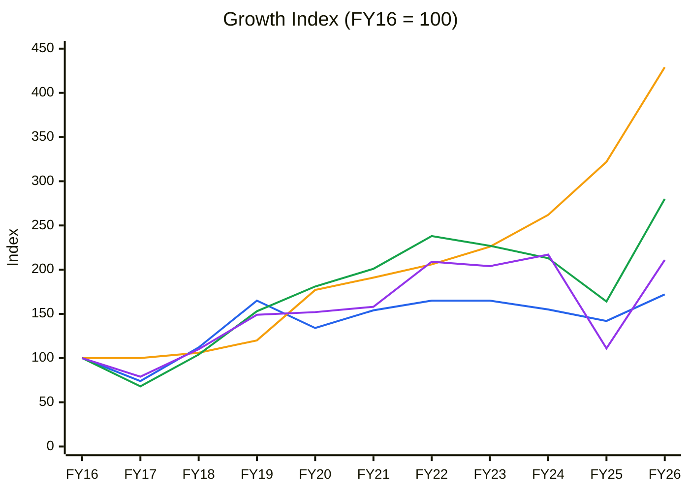
```mermaid
%%{init: {"themeVariables": {"xyChart": {"plotColorPalette": "#2563eb, #f59e0b, #16a34a, #9333ea"}}}}%%
xychart-beta
    title "Growth Index (FY16 = 100)"
    x-axis [FY16, FY17, FY18, FY19, FY20, FY21, FY22, FY23, FY24, FY25, FY26]
    y-axis "Index" 0 --> 450
    line [100, 74, 112, 165, 134, 154, 165, 165, 155, 142, 172]
    line [100, 100, 106, 120, 177, 191, 206, 226, 262, 322, 429]
    line [100, 68, 104, 153, 181, 201, 238, 227, 213, 164, 280]
    line [100, 79, 110, 149, 152, 158, 209, 204, 217, 111, 211]
```
🟦 Revenue (CAGR 5.6%) · 🟧 Gross Block (15.7%) · 🟩 EBITDA (10.8%) · 🟪 PAT (7.7%)
**Read:** For a decade, HFCL's revenue went **sideways (FY19–FY25 all ₹3,800–4,750 Cr)** while fixed assets grew 4.3×. The business shifted from asset-light EPC to fibre/cable manufacturing. Margin mix (🟩 above 🟦) did the work, not volume. The FY26–27 surge (TTM revenue ₹5,993 Cr = index 209) is the **first time in seven years** that revenue has broken out of its range. PAT (🟪) only doubled in a decade (interest and depreciation absorbed the EBITDA gains), and the FY25 dip to 111 shows how fast it falls. The test is whether new capacity keeps 🟦 rising toward 🟧.
**Business inference:** HFCL spent a decade turning itself from a contractor into a manufacturer, and volume did not pay for it: capital quadrupled while sales stood still, so shareholders funded a change in business model whose returns are only now arriving. FY27 is the first evidence that the new asset base can earn. Until revenue keeps pace with gross block, HFCL's record is that of a capital consumer, not a compounder.

---

## Business Primer

HFCL makes optical fibre (preform to fibre to cable), optical-fibre cables, and telecom and defence electronics (radios, fuzes, radars, 5G/Wi-Fi equipment), and runs a telecom-network EPC business. Its customers are Indian telcos and the government (BharatNet, BSNL, defence) and, increasingly, global telcos and hyperscale data-centre operators. Exports were 56% of Q1 FY27 revenue. Revenue is a mix of product volume × price (fibre-km, priced globally) and project execution against an order book (EPC, defence). Returns depend on two things: global optical-fibre pricing (a historically violent cycle; HFCL's ROCE fell from 24% in FY19 to 8% in FY25) and collecting cash from government-heavy customers.

This is an **asset-heavy manufacturer plus working-capital-heavy EPC contractor riding a demand upcycle**. The key value driver is volume × fibre price, now boosted by AI-data-centre demand. The key risks are the fibre price cycle and cash conversion. The feature that colours everything is that HFCL's profits have historically been booked well before they are collected: 11-year cumulative CFO is 42% of PAT, so growth consumes cash and is funded by debt (₹398 Cr FY15 → ₹1,896 Cr FY26) and equity (warrants, promoter dilution).

**New Segment Protocol:** Telecom Equipment OEM block (line 415) covers HFCL ✓. Top KPIs: order book/revenue, customer concentration, gross margin, CCC (red flag > 200 days).

---

## Module 1 — Broad Market Cycle

Nifty 50 at 22,556 (5 Oct 2026, −6% vs June), India VIX 14.7, persistent FII selling with DII support ([StockPil](https://stockpil.com/india-markets-today-2026-10-05/)). **Verdict: CAUTIOUS.** Notably, FIIs have *bought* HFCL (7.1% → 15.7%) while selling India broadly. The stock is a crowded thematic (AI-connectivity) trade.

---

## Module 1b — Sector Cycle: Tailwinds & Headwinds

**Secular:** BharatNet Phase III, FTTH and 5G backhaul, China+1 sourcing by Western telcos, defence indigenisation, and AI-data-centre interconnect fibre (high-fibre-count cables). These are real and multi-year.
**Cyclical:** Optical fibre is a classic capital-cycle industry. Global fibre prices spiked in 2017–18 (China shortage), collapsed 2019–21 (oversupply), and are rising again in 2025–26 on AI demand. HFCL's own **ROCE swing (24% → 8% → 11%)** and **EBITDA swing (−4.6% margin in Q4 FY25 → 23% in Q1 FY27)** show this. The +120% Q1 growth is **part secular (exports, AI) and part cyclical (price, plus a weak Q1 FY26 base)**.

**Supply response is already under way.** HFCL is expanding fibre 28 → 34 mn fkm and OFC 34 → 43 mn fkm, plus a ₹215 Cr AI-connectivity unit ([Voice&Data](https://www.voicendata.com/artificialintelligence/hfcl-posts-record-q1-fy27-results-approves-rs-215-cr-ai-investment-12187806)). Global majors (Corning, Prysmian, YOFC) are also adding AI-fibre capacity. **CY5 (industry capacity vs demand) and CY6 (fibre price cycle) are not charted:** no sourced public time series of global/Indian fibre-km capacity vs demand, or of fibre price per km, was found. Per chart rules, nothing is charted from estimates. Peer valuations stand in for the capital-cycle read below.

**Sector-wide valuation signal (capital cycle):**

| Company | CMP | 52-wk low | Multiple of low | P/E | ROCE |
|---|---|---|---|---|---|
| STL (Sterlite Tech) | ₹1,012 | ₹84.6 | **12.0×** | 220× | 7.7% |
| HFCL | ₹258 | ₹59.8 | 4.3× | 68.5× | 10.8% |
| Vindhya Telelinks | ₹2,777 | ₹960 | 2.9× | 14.0× | 8.2% |
| Birla Cable | ₹367 | ₹104 | 3.5× | 23.8× | 9.0% |

*Source: Screener.in, 9 Oct 2026.* When every listed player in a capital-intensive sector triples or more within a year **while sector ROCE is still single-digit**, the market is capitalising peak conditions. This is the Chancellor capital-cycle "capital floods in" phase.

**Sector cycle verdict: STRONG TAILWIND (12–24 months), late-stage in valuation terms.** Module 9: do not embed FY27's +40% as durable. Durable baseline growth is **12–15%**.

---

## Module 1c — Stock Cycle: Company Positioning

### C2 — Quarterly YoY Revenue Growth

| Quarter | Q2FY25 | Q3FY25 | Q4FY25 | Q1FY26 | Q2FY26 | Q3FY26 | Q4FY26 | Q1FY27 |
|---|---|---|---|---|---|---|---|---|
| Revenue (₹ Cr) | 1,094 | 1,012 | 801 | 871 | 1,043 | 1,211 | 1,824 | 1,915 |
| YoY % | −1.5 | −1.9 | −39.6 | −24.8 | −4.7 | +19.7 | +127.7 | +119.9 |
| EBITDA (₹ Cr) | 158 | 152 | −37 | 28 | 190 | 228 | 314 | 414 |
| OPM % | 14 | 15 | −4.6 | 3.3 | 18 | 19 | 17 | 22 |

*Source: Screener.in quarterly (consolidated). EBITDA YoY not shown: the base quarters are negative or near zero, so the ratio is meaningless.*

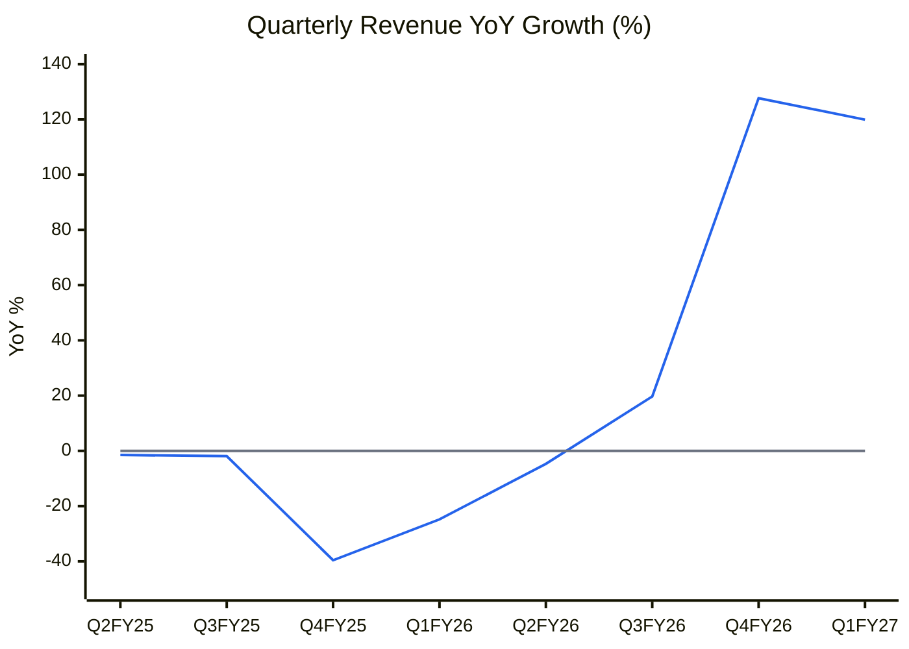
```mermaid
%%{init: {"themeVariables": {"xyChart": {"plotColorPalette": "#2563eb, #6b7280"}}}}%%
xychart-beta
    title "Quarterly Revenue YoY Growth (%)"
    x-axis [Q2FY25, Q3FY25, Q4FY25, Q1FY26, Q2FY26, Q3FY26, Q4FY26, Q1FY27]
    y-axis "YoY %" -50 --> 140
    line [-1.5, -1.9, -39.6, -24.8, -4.7, 19.7, 127.7, 119.9]
    line [0, 0, 0, 0, 0, 0, 0, 0]
```
🟦 Revenue YoY % · ⬜ zero line
**Read:** This is a V-shaped turn. Q4 FY25 and Q1 FY26 were crisis quarters (negative EBITDA, losses), so the triple-digit growth is **partly base effect**. Revenue fell 40% in Q4 FY25 and rose 128% a year later, which is cyclical amplitude, not a steady compounder. Q2 FY27 (vs ₹1,043 Cr) is the first quarter against a normal base. +40% FY guidance implies ~₹1,700 Cr/qtr for the rest of the year, so deceleration from 120% to ~60% YoY in Q2 is likely and already guided.
**Business inference:** Revenue is driven by the fibre price/demand cycle and lumpy project awards, not by steady share gains, so there is no smooth earnings base. Valuation should use mid-cycle earnings, not the record quarter. Headline growth will roughly halve over the next few quarters even if the business is healthy, and the market may read that as a slowdown.

### Capacity
Fibre 28 → 34 mn fkm; OFC 34 → 43 mn fkm (in progress); defence electronics plant; ₹215 Cr AI-connectivity unit. Single-point disclosures, so no C10 chart. **Capex is again 2–3× depreciation.**

### CY7 — EBITDA Margin & ROCE vs Their Own Cycle

| | FY16 | FY17 | FY18 | FY19 | FY20 | FY21 | FY22 | FY23 | FY24 | FY25 | FY26 | Q1FY27 |
|---|---|---|---|---|---|---|---|---|---|---|---|---|
| EBITDA margin % | 10 | 9 | 9 | 9 | 13 | 12 | 14 | 13 | 13 | 11 | 15 | 22 |
| ROCE % | 24 | 13 | 18 | 24 | 21 | 20 | 19 | 15 | 13 | 8 | 11 | — |

EBITDA margin: median 12%, SD 2.1 → band 9.9–14.1%. ROCE: median 18%, SD 5.1 → band 12.9–23.1%.

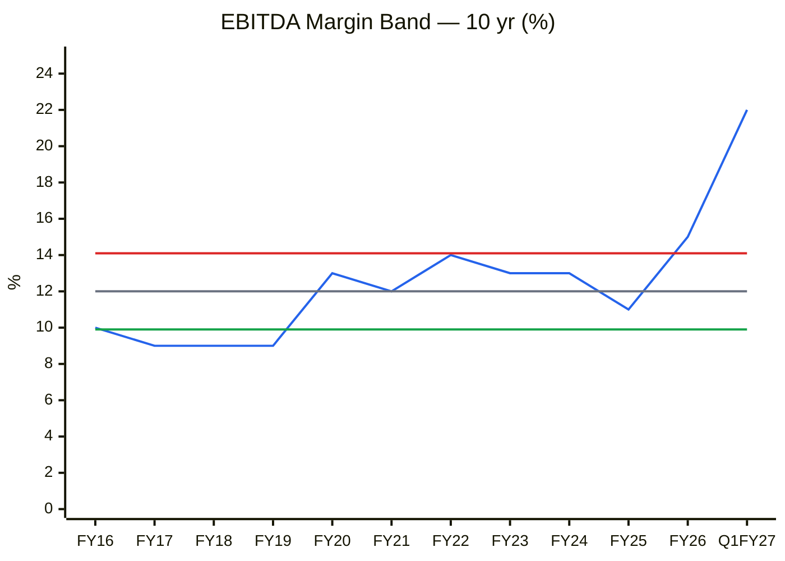
```mermaid
%%{init: {"themeVariables": {"xyChart": {"plotColorPalette": "#2563eb, #6b7280, #dc2626, #16a34a"}}}}%%
xychart-beta
    title "EBITDA Margin Band — 10 yr (%)"
    x-axis [FY16, FY17, FY18, FY19, FY20, FY21, FY22, FY23, FY24, FY25, FY26, Q1FY27]
    y-axis "%" 0 --> 25
    line [10, 9, 9, 9, 13, 12, 14, 13, 13, 11, 15, 22]
    line [12, 12, 12, 12, 12, 12, 12, 12, 12, 12, 12, 12]
    line [14.1, 14.1, 14.1, 14.1, 14.1, 14.1, 14.1, 14.1, 14.1, 14.1, 14.1, 14.1]
    line [9.9, 9.9, 9.9, 9.9, 9.9, 9.9, 9.9, 9.9, 9.9, 9.9, 9.9, 9.9]
```
🟦 EBITDA margin · ⬜ Median 12% · 🟥 +1SD 14.1% · 🟩 −1SD 9.9%
**Read:** Q1 FY27's 22–23% margin is **~4 standard deviations above** HFCL's 10-year median and higher than any year in the decade. Part is structural (product mix 85%, exports, specialty AI cables). Part is a cyclical price peak. Mean reversion even halfway (to ~17–18%) would cut EBITDA by 20–25% at the same revenue. **Late-cycle/peak margin.**
**Business inference:** HFCL is earning a scarcity premium from the AI-fibre shortage, not an edge it has shown through a full cycle. Treat ~17% as durable earnings power (the mix upgrade) and the rest as cyclical rent that new global capacity will compete away within 2–3 years.

**Stock cycle classification: LATE CYCLE / PEAK-MARGIN UPSWING.** Revenue is accelerating, margins are at a decade high, the sector is re-rating as a group, and capacity is being added. Per the framework: +5–10pp wider MoS and smaller position size.

**Guidance accuracy:** FY26 delivered on order book and exports (✅). The ₹500 Cr defence target for FY27 was cut to ₹400 Cr ([Sahi](https://www.sahi.com/news/hfcl-aims-for-500-crore-defense-revenue-and-700-crore-data-center-connectivity-sales-522-PE1_CORP)) (⚠️). FY25's Q4 collapse was not flagged in advance (❌). FY27 growth raised to 40% (track). **Score ~0.65.**

---

## Module 2 — Industry Structure & Capital Cycle

Five Forces (unchanged from June): moderate entry barriers, moderate supplier power (preform partly integrated), **high buyer power** (governments, telcos, hyperscalers tender competitively), low substitutes, high rivalry (STL, Chinese majors, Corning/Prysmian globally). **Verdict: Neutral.** Demand is excellent, but structure caps through-cycle returns. 10-yr median ROCE is 18% (pre-tax), barely above a ~12% WACC.

**Capital cycle:** HFCL capex/depreciation ≈ 2–4× through FY24–26 (gross block 1,216 → 1,989 in two years), and announced expansions continue. Peers are re-rating 3–12×, which reopens equity windows for sector capacity. **Signal: capital flooding in (deteriorating-returns phase ahead in 2–3 years).** *(CY8 industry chart not built: peer capex series not compiled.)*

---

## Module 3 — Business Quality & Moat

**Greenwald:** (1) cost advantage **partial** (preform-to-cable integration; not cost leader vs Chinese majors); (2) customer captivity **weak** (tendered; switching on price), though defence and hyperscaler qualification adds some stickiness; (3) local scale **moderate** (top-2 Indian OFC). **Buffett 10% price test: Fail** (historically). **Moat: NARROW** (product/defence qualification building; core OFC commodity-like).

### C4 — Margin trend

| % | FY16 | FY17 | FY18 | FY19 | FY20 | FY21 | FY22 | FY23 | FY24 | FY25 | FY26 |
|---|---|---|---|---|---|---|---|---|---|---|---|
| EBITDA margin | 10 | 9 | 9 | 9 | 13 | 12 | 14 | 13 | 13 | 11 | 15 |
| PAT margin | 5.4 | 5.8 | 5.3 | 4.9 | 6.2 | 5.6 | 6.9 | 6.7 | 7.6 | 4.3 | 6.6 |

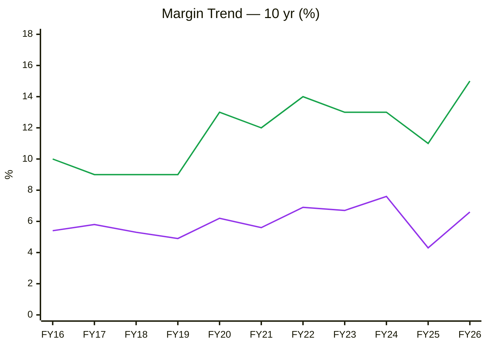
```mermaid
%%{init: {"themeVariables": {"xyChart": {"plotColorPalette": "#16a34a, #9333ea"}}}}%%
xychart-beta
    title "Margin Trend — 10 yr (%)"
    x-axis [FY16, FY17, FY18, FY19, FY20, FY21, FY22, FY23, FY24, FY25, FY26]
    y-axis "%" 0 --> 18
    line [10, 9, 9, 9, 13, 12, 14, 13, 13, 11, 15]
    line [5.4, 5.8, 5.3, 4.9, 6.2, 5.6, 6.9, 6.7, 7.6, 4.3, 6.6]
```
🟩 EBITDA margin · 🟪 PAT margin
**Read:** The gap between EBITDA (15%) and PAT (6.6%) margins is 8+ points. That is interest (₹242 Cr) plus depreciation (₹157 Cr) on a debt-funded asset base, so operating gains reach shareholders only partly. (Gross-margin proxy not used: the material-cost share swings 15–56% with the EPC/product mix, so it is not a spread series.)
**Business inference:** The balance sheet, not operations, is the bottleneck to shareholder returns: interest and depreciation on debt-funded capex and working capital absorb more than half of operating profit. Margin gains will reach EPS in full only once growth funds itself and debt starts falling.

**Fisher 15-point:** 31/45 (unchanged; integrity Pass).

---

## Module 4 — Management & Capital Allocation

### C9 — Promoter & institutional holding (12 quarters)

| % | Sep23 | Dec23 | Mar24 | Jun24 | Sep24 | Dec24 | Mar25 | Jun25 | Sep25 | Dec25 | Mar26 | Jun26 |
|---|---|---|---|---|---|---|---|---|---|---|---|---|
| Promoters | 37.84 | 37.84 | 37.69 | 37.63 | 36.24 | 35.90 | 34.37 | 31.58 | 30.02 | 28.29 | 28.29 | 28.29 |
| FIIs | 8.35 | 8.18 | 7.66 | 7.02 | 6.68 | 6.70 | 6.97 | 7.75 | 7.48 | 7.48 | 7.08 | 15.74 |
| DIIs | 4.64 | 4.55 | 5.68 | 7.39 | 8.69 | 10.96 | 13.26 | 14.04 | 13.57 | 9.07 | 8.57 | 10.92 |

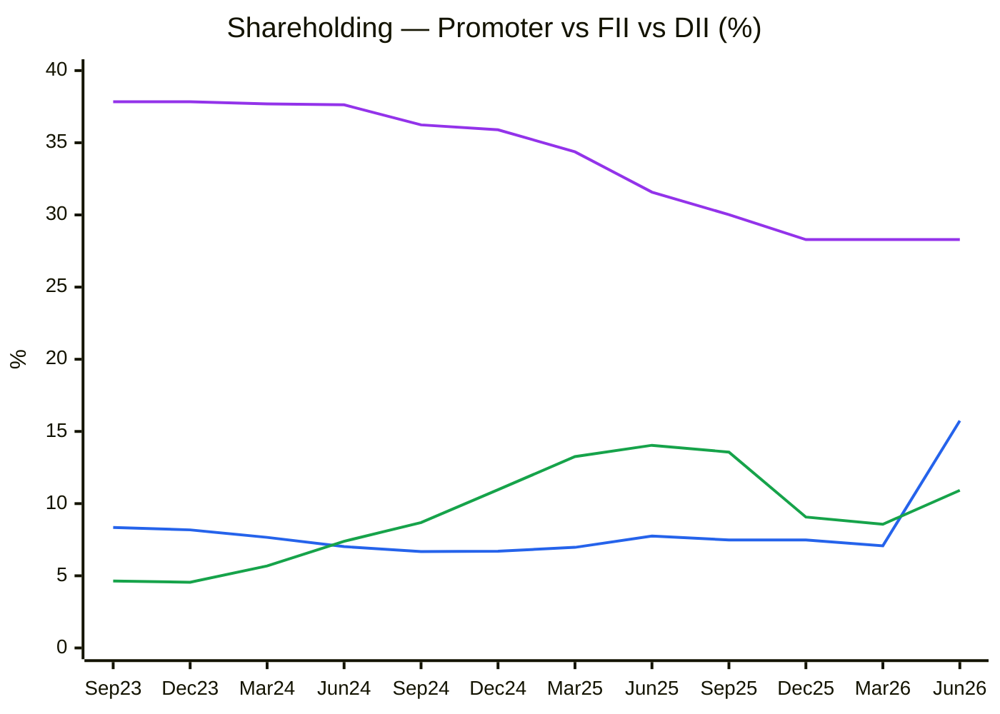
```mermaid
%%{init: {"themeVariables": {"xyChart": {"plotColorPalette": "#9333ea, #2563eb, #16a34a"}}}}%%
xychart-beta
    title "Shareholding — Promoter vs FII vs DII (%)"
    x-axis [Sep23, Dec23, Mar24, Jun24, Sep24, Dec24, Mar25, Jun25, Sep25, Dec25, Mar26, Jun26]
    y-axis "%" 0 --> 40
    line [37.84, 37.84, 37.69, 37.63, 36.24, 35.90, 34.37, 31.58, 30.02, 28.29, 28.29, 28.29]
    line [8.35, 8.18, 7.66, 7.02, 6.68, 6.70, 6.97, 7.75, 7.48, 7.48, 7.08, 15.74]
    line [4.64, 4.55, 5.68, 7.39, 8.69, 10.96, 13.26, 14.04, 13.57, 9.07, 8.57, 10.92]
```
🟪 Promoters · 🟦 FIIs · 🟩 DIIs
**Read:** Promoters have reduced their stake by **9.6pp in 3 years** (open-market sales by MN Ventures, e.g. 1.18% in Mar 2025 ([Angel One](https://www.angelone.in/news/stocks-share-market/hfcl-share-price-gain-over-2-percent-despite-promoter-reducing-stake)), plus dilution from QIP and warrants). Institutions doubled in Jun 2026 (FII 7.1 → 15.7%, 186 → 241 FPIs). **Smart-money rotation runs promoter → institutions at a record price.** The May 2026 warrant allotment (7.5 Cr warrants at ₹74, ₹138.75 Cr upfront; [FilingReader](https://filingreader.com/news-wire/mumbai/2026-05-25/hfcl-raises-inr-13875-crore-through-promoter-warrant-allotment)) is the bullish counterpoint. Promoters will buy at ₹74 against a ₹258 market price (a 71% discount, which also means dilution for minorities).
**Business inference:** The best-informed holders are selling into strength while institutions buy the AI-fibre story, so promoter alignment is weakening. The ₹74 warrants are the one sign of insider conviction, and they are priced far below the market. Minority holders are effectively funding the promoters' discount.

| Item | Reading |
|---|---|
| Pledge | June report: "increased 1.41%". **Current level not verified** (data gap) |
| Dilution | Equity capital ₹124 Cr (FY15) → ₹153 Cr (FY26); warrants add ~7.5 Cr shares (~4.9%) |
| Dividend payout | 8–10% |
| Capital allocation | Growth funded by debt (₹1,896 Cr) and equity; FCF negative in 4 of the last 5 years. **Rating: Poor-to-Average** |

**WTT ≈ 0.65 (MODERATE).** Delivers on order intake and exports; misses on defence quantum and cash conversion; FY25 Q4 surprise.

---

## Module 5 — Financial Forensics

| Test | Result |
|---|---|
| CFO vs PAT | **FY26 CFO −₹378 Cr vs PAT +₹329 Cr**; FY24 CFO −₹45 Cr vs PAT ₹338 Cr |
| Sloan accrual (CF) | (329 − (−378) − (−324)) / avg TA 8,207 = **+12.6% → red flag (> 10%)** |
| Debtor days | 163 (FY26); 10-yr range 113–215 |
| CCC | **218 days** (sector red flag > 200) |
| Beneish M | DSRI ~0.96, TATA high (accruals ₹707 Cr / TA 8,868 = 0.08) → estimated **~−1.9 (grey zone)** |
| Altman Z'' | ~3.0 (safe-grey boundary) |
| Piotroski F | ~4/9 (CFO < 0, accruals > ROA, leverage up, dilution) |
| Auditor | No qualification surfaced in public summaries (annual report not reviewed: data gap) |

### C7 — Cumulative PAT vs Cumulative CFO (₹ Cr)

| | FY16 | FY17 | FY18 | FY19 | FY20 | FY21 | FY22 | FY23 | FY24 | FY25 | FY26 |
|---|---|---|---|---|---|---|---|---|---|---|---|
| Cum. PAT | 156 | 280 | 452 | 684 | 921 | 1,167 | 1,493 | 1,811 | 2,149 | 2,322 | 2,651 |
| Cum. CFO | 0 | 136 | 343 | 377 | 549 | 694 | 899 | 1,134 | 1,089 | 1,485 | 1,107 |

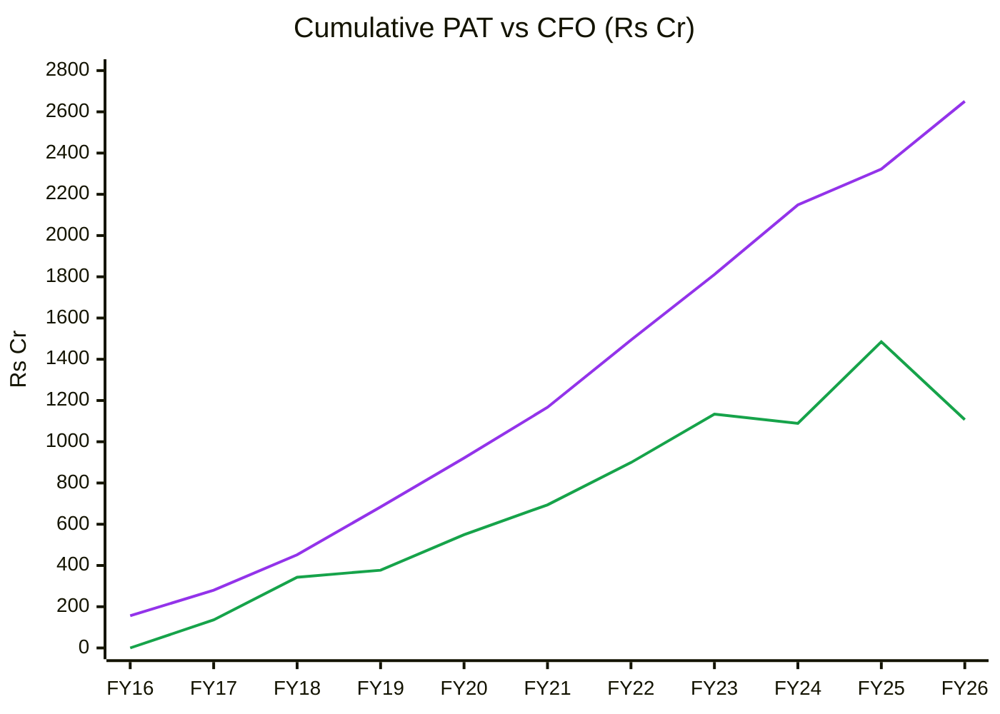
```mermaid
%%{init: {"themeVariables": {"xyChart": {"plotColorPalette": "#9333ea, #16a34a"}}}}%%
xychart-beta
    title "Cumulative PAT vs CFO (Rs Cr)"
    x-axis [FY16, FY17, FY18, FY19, FY20, FY21, FY22, FY23, FY24, FY25, FY26]
    y-axis "Rs Cr" 0 --> 2800
    line [156, 280, 452, 684, 921, 1167, 1493, 1811, 2149, 2322, 2651]
    line [0, 136, 343, 377, 549, 694, 899, 1134, 1089, 1485, 1107]
```
🟪 Cumulative PAT · 🟩 Cumulative CFO
**Read:** The lines **diverge for the entire decade**: cumulative CFO/PAT = **0.42**, against ≥ 0.9 for healthy businesses. About **₹1,550 Cr of reported profit has never turned into cash**. It sits in receivables, inventory and contract assets. This is O'Glove flag #1, and it is the single most important chart in this report.
**Business inference:** HFCL's profits largely finance its customers (BharatNet, telcos) and its inventory, not its shareholders, so reported EPS overstates distributable earnings by more than half. The business needs outside capital to grow, which makes dilution and debt structural. Any multiple should be applied to cash earnings, not reported PAT.

### C8 — Working-capital days

| Days | FY16 | FY17 | FY18 | FY19 | FY20 | FY21 | FY22 | FY23 | FY24 | FY25 | FY26 |
|---|---|---|---|---|---|---|---|---|---|---|---|
| Debtor | 141 | 202 | 134 | 113 | 153 | 215 | 146 | 145 | 181 | 170 | 163 |
| Inventory | 192 | 140 | 56 | 41 | 96 | 65 | 98 | 113 | 135 | 145 | 191 |
| Payable | 307 | 260 | 148 | 134 | 227 | 262 | 173 | 131 | 141 | 174 | 136 |
| CCC | 26 | 81 | 42 | 20 | 22 | 18 | 72 | 127 | 175 | 141 | 218 |

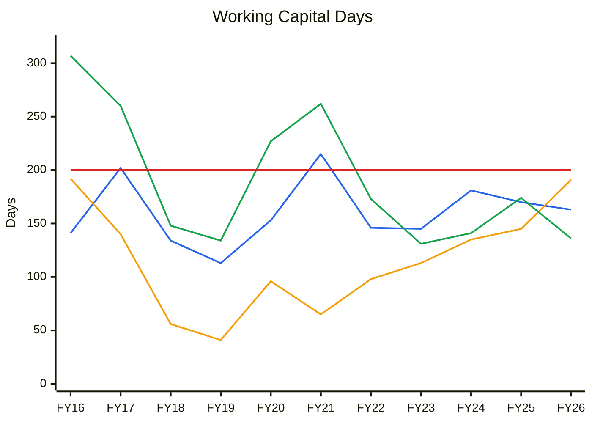
```mermaid
%%{init: {"themeVariables": {"xyChart": {"plotColorPalette": "#2563eb, #f59e0b, #16a34a, #dc2626"}}}}%%
xychart-beta
    title "Working Capital Days"
    x-axis [FY16, FY17, FY18, FY19, FY20, FY21, FY22, FY23, FY24, FY25, FY26]
    y-axis "Days" 0 --> 320
    line [141, 202, 134, 113, 153, 215, 146, 145, 181, 170, 163]
    line [192, 140, 56, 41, 96, 65, 98, 113, 135, 145, 191]
    line [307, 260, 148, 134, 227, 262, 173, 131, 141, 174, 136]
    line [200, 200, 200, 200, 200, 200, 200, 200, 200, 200, 200]
```
🟦 Debtor days · 🟧 Inventory days · 🟩 Payable days · 🟥 200-day CCC red-flag line *(CCC itself: 26 → 218, in the table)*
**Read:** The structural break is **payables**. Until FY21, suppliers financed HFCL (payables 230–300 days kept CCC near 20). Since FY22, payables have collapsed to ~135 days while inventory rose to 191, so **CCC went 18 → 218 days**. The export/product pivot needs inventory, and suppliers no longer fund it. Growth at +40% will absorb roughly ₹1,000+ Cr of fresh working capital in FY27.
**Business inference:** HFCL lost its supplier financing just as it moved into export fibre manufacturing, which needs more inventory, so the model became structurally more cash-hungry. Faster growth makes the cash problem worse, not better. This is the main reason the DCF sits far below the market price.

**Forensic verdict: SIGNIFICANT CONCERNS.** Red flags: CFO < 0 in 2 of 3 years; Sloan > 10%; CCC > 200; promoter selling. **Count 4/15 → hard stop "forensic red flags ≥ 3 unresolved" is triggered.** These look like EPC/inventory-cycle accruals rather than fabrication, but they are unresolved until FY27 CFO turns positive.

---

## Module 6 — Earnings Quality & Financial Statements

**ROIC (FY26):** EBIT ₹607 Cr × 0.77 = NOPAT ₹467 Cr ÷ invested capital (equity 4,891 + debt 1,896 − investments 135) ₹6,652 Cr = **~7.0%**. TTM: EBIT ₹970 Cr → NOPAT ~₹730 Cr ÷ ~₹7,200 Cr = **~10%**. **WACC ~12%.** ROIC is still below WACC even on TTM peak margins.

### C5 — ROCE vs WACC

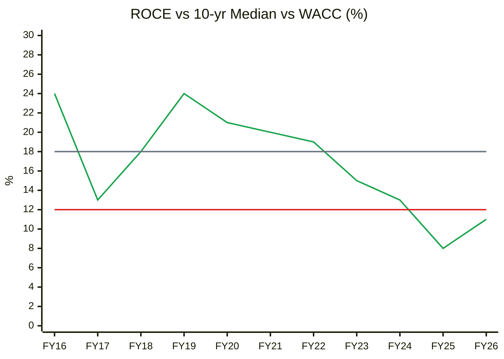
```mermaid
%%{init: {"themeVariables": {"xyChart": {"plotColorPalette": "#16a34a, #6b7280, #dc2626"}}}}%%
xychart-beta
    title "ROCE vs 10-yr Median vs WACC (%)"
    x-axis [FY16, FY17, FY18, FY19, FY20, FY21, FY22, FY23, FY24, FY25, FY26]
    y-axis "%" 0 --> 30
    line [24, 13, 18, 24, 21, 20, 19, 15, 13, 8, 11]
    line [18, 18, 18, 18, 18, 18, 18, 18, 18, 18, 18]
    line [12, 12, 12, 12, 12, 12, 12, 12, 12, 12, 12]
```
🟩 ROCE (pre-tax, Screener) · ⬜ 10-yr median 18% · 🟥 WACC 12%
**Read:** ROCE has **declined for six years (24% → 8%)** as the asset base grew 2.4× and working capital ballooned. It sat **at or below WACC in FY24–26**. Q1 FY27 earnings will lift FY27 ROCE (est. 15–17%), but only back to the decade median, not above it.
**Business inference:** Capital invested over the last six years has earned less than it costs: HFCL grew its assets but destroyed value per rupee invested. The upcycle brings returns back only to average, which is not proof of a moat, so a multiple above the stock's own history is not earned on fundamentals.

### C6 — Asset Turnover (Revenue / Gross Block)

| | FY16 | FY17 | FY18 | FY19 | FY20 | FY21 | FY22 | FY23 | FY24 | FY25 | FY26 |
|---|---|---|---|---|---|---|---|---|---|---|---|
| AT (×) | 6.19 | 4.58 | 6.56 | 8.51 | 4.68 | 4.99 | 4.95 | 4.52 | 3.67 | 2.72 | 2.49 |

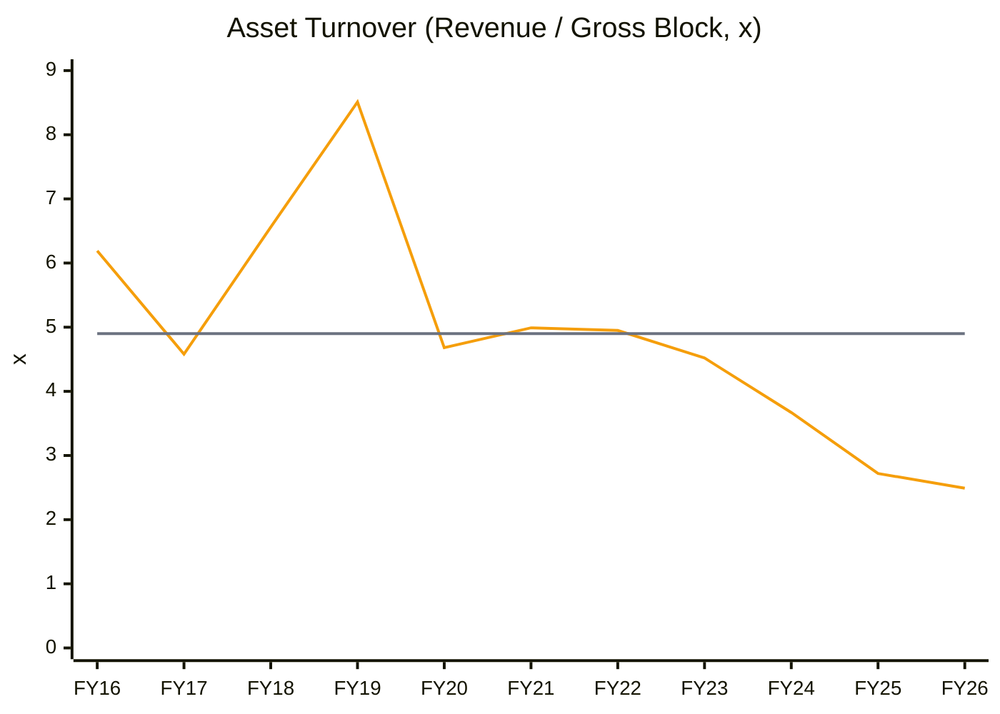
```mermaid
%%{init: {"themeVariables": {"xyChart": {"plotColorPalette": "#f59e0b, #6b7280"}}}}%%
xychart-beta
    title "Asset Turnover (Revenue / Gross Block, x)"
    x-axis [FY16, FY17, FY18, FY19, FY20, FY21, FY22, FY23, FY24, FY25, FY26]
    y-axis "x" 0 --> 9
    line [6.19, 4.58, 6.56, 8.51, 4.68, 4.99, 4.95, 4.52, 3.67, 2.72, 2.49]
    line [4.9, 4.9, 4.9, 4.9, 4.9, 4.9, 4.9, 4.9, 4.9, 4.9, 4.9]
```
🟧 AT · ⬜ 10-yr average 4.9×
**Read:** AT has fallen for **five straight years to 2.5×**, half the decade average. This reflects the shift from asset-light EPC to fibre manufacturing. TTM revenue gives ~3.0×. Forward AT of ~3× is realistic, not a return to 5×.
**Business inference:** The move into manufacturing has permanently made HFCL more capital-intensive: each rupee of revenue now needs about twice the plant it did in FY19. That caps through-cycle ROCE unless margins rise structurally. Module 10A should anchor on ~3× AT, not a reversion to 5×.

### DuPont (summary)
FY22 → FY26: EBIT margin 12.1% → 12.3% (flat); asset turnover (Rev/TA) 0.91 → 0.56 (down); equity multiplier 1.84 → 1.81; interest burden 0.73 → 0.64 (worse); ROE 11.6% → 7.0%. **Verdict: The ROE decline is operational (asset turnover) plus financing cost.** Leverage is not masking it.

**O'Glove flags: 4/15** (NI vs OCF, Sloan, inventory days, payables collapse).

---

## Module 7 — Industry KPIs & Peer Analysis

| KPI (Telecom Equipment OEM block) | HFCL | Healthy | Red flag | Status |
|---|---|---|---|---|
| Order book / TTM revenue | 4.4× headline / ~2.8× firm (ex-framework) | > 1.5× | < 0.7× | ✅ Strong, but 47% framework |
| Book-to-bill (FY26) | ~3.2× (inflow ~₹16,000 Cr / ₹4,949 Cr) | > 1.0× | < 0.7× | ✅ |
| Cash conversion cycle | 218 days | < 120 | > 200 | ❌ Red flag |
| Export share | 56% (Q1 FY27) | — | — | ✅ diversifying |
| Customer concentration | Not disclosed (BharatNet/BSNL + hyperscalers) | < 30% | > 50% | ⚠️ Data gap |

### Order Book Tracker (27 BSE Reg 30 filings since Apr 2024; ledger and snapshots in sections 5–6 below)
*Generated 2026-10-09 by scripts/order_book_tracker.py from 27 order announcements (1 follow-ups excluded) and 12 period snapshots. Ledger coverage starts 2024-04-01; earlier periods show '—' for announced inflow (unknown, not zero). (est.) = tracked estimate: previous disclosed order book + announced orders − order-linked revenue.*

#### 1. Disclosed vs tracked order book (reconciliation)

| Period | Revenue (₹ Cr) | Order book (₹ Cr) | Announced inflow | of which Framework | Implied inflow | Announced coverage | OB cover (× TTM rev) | Source |
|---|---|---|---|---|---|---|---|---|
| FY22 | 4,727 | 5,300 | — | — | — | — | 1.1 | CARE Ratings Jul-2022 |
| FY23 | 4,743 | 7,010 | — | — | 6,453 | — | 1.5 | Company disclosure (The Machine Maker) |
| FY24 | 4,465 | 7,685 | — | — | 5,140 | — | 1.7 | Company disclosure (DSIJ) |
| Q1FY25 | 1,158 | 6,592 (est.) | 65 | — | — | — | 1.4 | Screener revenue |
| Q2FY25 | 1,094 | 5,498 (est.) | 0 | — | — | — | 1.2 | Screener revenue |
| Q3FY25 | 1,012 | 10,410 | 0 | — | 5,924 | 0% | 2.3 | Q3FY25 results (Muthoot Securities) |
| Q4FY25 | 801 | 9,967 | 4,713 | — | 358 | 1,317% | 2.5 | FY25 results (prior report) |
| Q1FY26 | 871 | 9,503 (est.) | 407 | — | — | — | 2.5 | Screener revenue |
| Q2FY26 | 1,043 | 9,981 | 460 | — | 1,521 | 30% | 2.7 | Q2FY26 results (Muthoot Securities) |
| Q3FY26 | 1,211 | 11,125 | 1,241 | — | 2,355 | 53% | 2.8 | Q3FY26 results (Muthoot Securities) |
| Q4FY26 | 1,824 | 21,206 | 10,262 | 10,159 | 11,905 | 86% | 4.3 | Q4FY26 results |
| Q1FY27 | 1,915 | 26,665 | 4,542 | — | 7,374 | 62% | 4.4 | Q1FY27 results (Business Standard) |

*Implied inflow = OB(t) − OB(t−1) + order-linked revenue(t). Announced coverage = announced ÷ implied: < 50% means most orders are below the disclosure threshold (or the OB is restated); > 120% means cancellations, de-scoping or slow-burn framework value not yet in the reported book.*

#### 2. Announced orders aggregated by quarter

| Quarter | # orders | Total (₹ Cr) | Firm | Framework | Largest single | Export | Govt/PSU/Defence | Private domestic |
|---|---|---|---|---|---|---|---|---|
| Q1FY25 | 1 | 65 | 65 | 0 | 65 | 0 | 0 | 65 |
| Q4FY25 | 3 | 4,713 | 4,713 | 0 | 2,501 | 0 | 4,713 | 0 |
| Q1FY26 | 4 | 407 | 407 | 0 | 174 | 59 | 174 | 174 |
| Q2FY26 | 2 | 460 | 460 | 0 | 358 | 358 | 102 | 0 |
| Q3FY26 | 3 | 1,241 | 1,241 | 0 | 656 | 1,241 | 0 | 0 |
| Q4FY26 | 3 | 10,262 | 103 | 10,159 | 10,159 | 10,201 | 0 | 61 |
| Q1FY27 | 6 | 4,542 | 4,542 | 0 | 2,666 | 290 | 2,801 | 1,450 |
| Q2FY27 | 4 | 3,789 | 1,460 | 2,329 | 2,329 | 3,789 | 0 | 0 |

#### 3. Macro picture

| Metric | Value |
|---|---|
| Latest disclosed order book | ₹26,665 Cr (Q1FY27) |
| Orders announced since that disclosure | ₹3,789 Cr (4 orders) |
| Tracked order book today (before execution since Q1FY27) | ₹30,454 Cr |
| Order book cover (latest) | 4.4 × TTM revenue |
| Framework / 'potential value' agreements in ledger | ₹12,488 Cr (47% of latest disclosed OB) |
| Orders announced, last 12 months | ₹20,294 Cr (18 orders; avg ₹1,127 Cr) |
| Top-3 orders (last 12 m) as % of disclosed OB | 57% |

**Geography mix, last 12 months:** Export 78% · Domestic 15% · Unspecified 7%
**Customer type mix, last 12 months:** Export 78% · PSU 14% · Unspecified 7% · Private 1% · Defence 1%
**Segment mix, last 12 months:** OFC (high fibre count) 62% · OFC 22% · EPC/Network 13% · Data-centre connectivity 2% · Services/AMC 1% · Defence 1%
**Firmness mix, last 12 months:** Framework 62% · Firm 38%

#### 4. Charts

**OB-1 — Order book vs revenue (TTM), index = 100 at FY22**

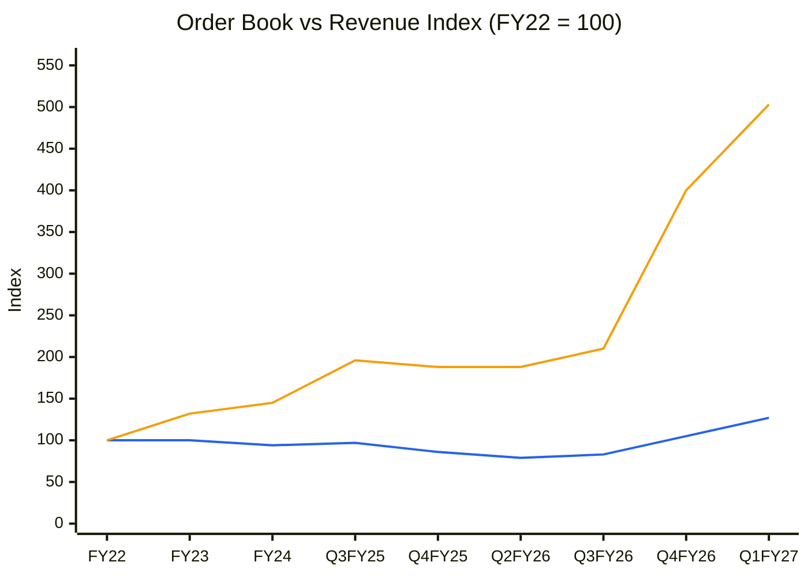
```mermaid
%%{init: {"themeVariables": {"xyChart": {"plotColorPalette": "#2563eb, #f59e0b"}}}}%%
xychart-beta
    title "Order Book vs Revenue Index (FY22 = 100)"
    x-axis [FY22, FY23, FY24, Q3FY25, Q4FY25, Q2FY26, Q3FY26, Q4FY26, Q1FY27]
    y-axis "Index" 0 --> 560
    line [100, 100, 94, 97, 86, 79, 83, 105, 127]
    line [100, 132, 145, 196, 188, 188, 210, 400, 503]
```
🟦 Revenue (TTM) · 🟧 Order book (disclosed points only; x-axis mixes FY and quarter-ends where history is annual)
**Read:** Since FY22 the disclosed order book is up **5.0×** while TTM revenue is up only **1.27×**. The gap opened in two steps: BharatNet III EPC awards (Q3–Q4 FY25, ~₹4,700 Cr, 10-year O&M tails) and the ₹10,159 Cr five-year export supply agreement (Q4 FY26). Both are **slow-burn** by design. The book is outrunning revenue because of tenor, not only demand.
**Business inference:** Much of the backlog is long-tenor work (10-year O&M, 5-year supply) that turns into revenue slowly, so the order book overstates near-term growth visibility. For the next two years, execution speed and fibre pricing matter more than new order wins.

**OB-2 — Order book cover (years of TTM revenue)**

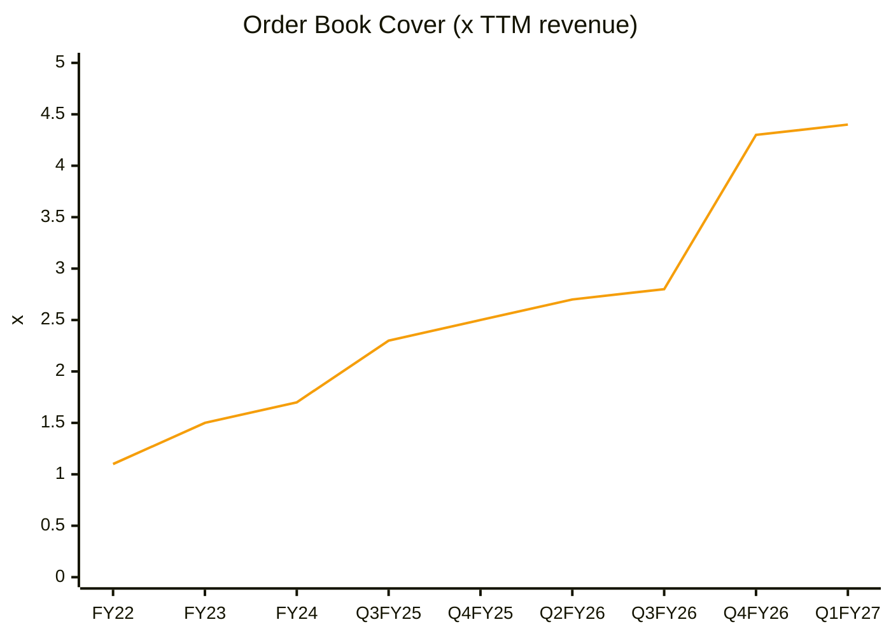
```mermaid
%%{init: {"themeVariables": {"xyChart": {"plotColorPalette": "#f59e0b"}}}}%%
xychart-beta
    title "Order Book Cover (x TTM revenue)"
    x-axis [FY22, FY23, FY24, Q3FY25, Q4FY25, Q2FY26, Q3FY26, Q4FY26, Q1FY27]
    y-axis "x" 0 --> 5
    line [1.1, 1.5, 1.7, 2.3, 2.5, 2.7, 2.8, 4.3, 4.4]
```
🟧 Order book / TTM revenue
**Read:** Cover went from 1.1× to 4.4×. But **firm cover (excluding the ₹10,159 Cr framework agreement in the Q1 FY27 book) is ~2.8×** (₹16,506 Cr ÷ ₹5,993 Cr), similar to the Q2–Q3 FY26 level. The jump to 4.3–4.4× is almost entirely one 'potential value' contract.
**Business inference:** Firm visibility has not really changed. What changed is one long-term supply agreement whose value depends on future fibre prices. The bull case is therefore a bet that AI-fibre pricing holds for five years, not contracted revenue.

**OB-3 — Aggregated announced orders vs revenue, by quarter (₹ Cr)**

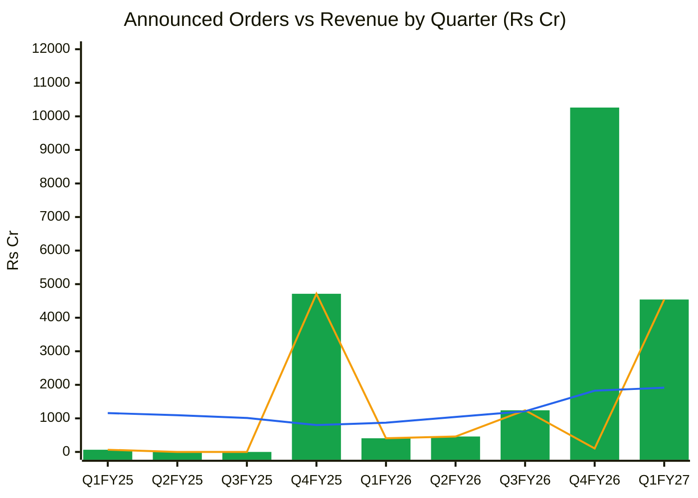
```mermaid
%%{init: {"themeVariables": {"xyChart": {"plotColorPalette": "#16a34a, #f59e0b, #2563eb"}}}}%%
xychart-beta
    title "Announced Orders vs Revenue by Quarter (Rs Cr)"
    x-axis [Q1FY25, Q2FY25, Q3FY25, Q4FY25, Q1FY26, Q2FY26, Q3FY26, Q4FY26, Q1FY27]
    y-axis "Rs Cr" 0 --> 12000
    bar [65, 0, 0, 4713, 407, 460, 1241, 10262, 4542]
    line [65, 0, 0, 4713, 407, 460, 1241, 103, 4542]
    line [1158, 1094, 1012, 801, 871, 1043, 1211, 1824, 1915]
```
🟩 All announced orders (bars) · 🟧 Firm orders only (excl. framework / potential-value agreements) · 🟦 Revenue
**Read:** Announced *firm* orders (🟧) have run at roughly **0.3–2.4× quarterly revenue**, lumpy and dominated by a few large awards (BharatNet ₹2,501 / ₹2,168 / ₹2,666 Cr). The Q4 FY26 bar (₹10,262 Cr) is 99% framework value: firm announcements that quarter were only ₹103 Cr. Since Apr 2025 the ledger has been 78% export, the AI/data-centre fibre wave.
**Business inference:** Demand is genuine but concentrated: a few large BharatNet awards and a single export AI-fibre customer group now drive the business. That customer concentration, and the cyclicality of hyperscaler capex, are the main risks to order momentum.

**OB-4 — Implied order inflow (from disclosed order book) vs revenue (₹ Cr)**

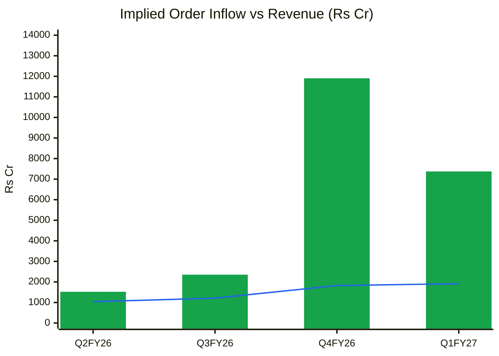
```mermaid
%%{init: {"themeVariables": {"xyChart": {"plotColorPalette": "#16a34a, #2563eb"}}}}%%
xychart-beta
    title "Implied Order Inflow vs Revenue (Rs Cr)"
    x-axis [Q2FY26, Q3FY26, Q4FY26, Q1FY27]
    y-axis "Rs Cr" 0 --> 14000
    bar [1521, 2355, 11905, 7374]
    line [1043, 1211, 1824, 1915]
```
🟩 Implied inflow = ΔOB + order-linked revenue · 🟦 Revenue
**Read:** Implied quarterly inflow (all orders, including undisclosed small ones) has exceeded revenue in every quarter since Q2 FY26 (book-to-bill 1.5–6.5×). Announced coverage of 30–86% shows that many smaller orders never reach a Reg 30 filing. The book is genuinely growing, but its headline growth is framework-led.
**Business inference:** Orders are coming in faster than HFCL can execute them, which supports 1–2 years of revenue growth. But because growth here eats working capital, a bigger book also means bigger funding needs: each order win helps revenue and strains the balance sheet.

#### 5. Order Ledger — every announced order (source of truth; the next run appends here)

| order_id | date | customer | customer_type | segment | geography | value_cr | currency | value_fc | firmness | tenor_months | linked_to | source | notes |
|---|---|---|---|---|---|---|---|---|---|---|---|---|---|
| HF-2404-01 | 2024-04-12 | Leading private telecom operator | Private | OFC | Domestic | 64.93 | INR |  | Firm |  |  | [BSE](https://www.bseindia.com/xml-data/corpfiling/AttachHis/8955b3d2-b649-496e-980f-8e99ab2b6637.pdf) | HFCL + HTL POs |
| HF-2501-01 | 2025-01-16 | BSNL (BharatNet III Punjab) | Govt | EPC/Network | Domestic | 2501.30 | INR |  | AWO | 120 |  | [BSE](https://www.bseindia.com/xml-data/corpfiling/AttachHis/fe85112b-28d2-4a23-aa0a-3b67845a2961.pdf) | Advance Work Order; middle-mile design-build-operate |
| HF-2501-02 | 2025-01-23 | RVNL (BharatNet III UP East & West) | PSU | EPC/Network | Domestic | 2167.65 | INR |  | AWO | 120 |  | [BSE](https://www.bseindia.com/xml-data/corpfiling/AttachHis/ddcdaf3c-3a7f-4951-8dce-db8f381d4ebb.pdf) | APOs: OFC + equipment + 10-yr O&M |
| HF-2502-01 | 2025-02-19 | BSNL (BharatNet III Punjab) | Govt | EPC/Network | Domestic | 2501.30 | INR |  | Firm | 120 | HF-2501-01 | [BSE](https://www.bseindia.com/xml-data/corpfiling/AttachHis/1622e88f-4b68-4170-ba40-d53115c70f3c.pdf) | Agreement signed for AWO of 16-Jan-2025 (follow-up; not new inflow) |
| HF-2503-01 | 2025-03-07 | Indian Army | Defence | Defence | Domestic | 44.36 | INR |  | Firm |  |  | [BSE](https://www.bseindia.com/xml-data/corpfiling/AttachHis/348f6ea0-51a4-4105-9dff-508a9004ae31.pdf) | HTL; tactical OFC assemblies |
| HF-2505-01 | 2025-05-12 | Tera Software (ITI consortium; BharatNet WB) | PSU | OFC | Domestic | 157.00 | INR |  | Firm |  |  | [BSE](https://www.bseindia.com/xml-data/corpfiling/AttachHis/490cebee-5463-445f-b221-07dc99479fe3.pdf) |  |
| HF-2505-02 | 2025-05-18 | Overseas telecom company | Export | OFC | Export | 59.19 | USD | 6.91 | Firm |  |  | [BSE](https://www.bseindia.com/xml-data/corpfiling/AttachHis/732ebf6e-521b-404d-a2f8-c28aec5ff74a.pdf) |  |
| HF-2505-03 | 2025-05-18 | ITI Limited | PSU | OFC | Domestic | 17.02 | INR |  | Firm |  |  | [BSE](https://www.bseindia.com/xml-data/corpfiling/AttachHis/732ebf6e-521b-404d-a2f8-c28aec5ff74a.pdf) |  |
| HF-2505-04 | 2025-05-19 | Leading domestic telco (5G) | Private | Telecom equipment | Domestic | 173.72 | INR |  | Firm |  |  | [BSE](https://www.bseindia.com/xml-data/corpfiling/AttachHis/1bb179de-09f5-4b8a-9798-95d555e9bc9c.pdf) |  |
| HF-2508-01 | 2025-08-27 | Indian Army | Defence | Defence | Domestic | 101.82 | INR |  | Firm |  |  | [BSE](https://www.bseindia.com/xml-data/corpfiling/AttachHis/33a642b9-1445-4917-a4d2-c4cb38cf5802.pdf) | HTL; tactical OFC |
| HF-2509-01 | 2025-09-07 | International customers | Export | OFC | Export | 358.38 | USD | 40.65 | Firm |  |  | [BSE](https://www.bseindia.com/xml-data/corpfiling/AttachHis/7c7a043c-1895-40fa-8a05-61142d769268.pdf) | via overseas WOS |
| HF-2510-01 | 2025-10-08 | International customer | Export | OFC | Export | 303.35 | USD | 34.19 | Firm |  |  | [BSE](https://www.bseindia.com/xml-data/corpfiling/AttachHis/28b74f04-50d4-4491-9e20-ee475e39ff04.pdf) | via overseas WOS |
| HF-2510-02 | 2025-10-17 | International customer | Export | OFC | Export | 281.20 | USD | 32.02 | Firm |  |  | [BSE](https://www.bseindia.com/xml-data/corpfiling/AttachHis/f8438e57-4973-4acc-a20d-30ee836d050f.pdf) | via overseas WOS |
| HF-2512-01 | 2025-12-06 | International customer | Export | OFC | Export | 656.10 | USD | 72.96 | Firm |  |  | [BSE](https://www.bseindia.com/xml-data/corpfiling/AttachHis/26de2dbb-b0ac-404a-b3df-78e5460f314d.pdf) | via overseas WOS |
| HF-2602-01 | 2026-02-15 | International customer | Export | OFC | Export | 42.34 | USD | 4.67 | Firm |  |  | [BSE](https://www.bseindia.com/xml-data/corpfiling/AttachHis/4eb5afb4-afaa-4a2b-b317-b4590ceb555f.pdf) |  |
| HF-2602-02 | 2026-02-16 | Leading private telecom operator | Private | OFC | Domestic | 60.95 | INR |  | Firm |  |  | [BSE](https://www.bseindia.com/xml-data/corpfiling/AttachHis/6fccd502-bebc-4526-a6b7-e180b18550ef.pdf) | HFCL + HTL |
| HF-2603-01 | 2026-03-13 | Overseas customer (5-yr supply agreement) | Export | OFC (high fibre count) | Export | 10159.00 | USD | 1100 | Framework | 60 |  | [BSE](https://www.bseindia.com/xml-data/corpfiling/AttachHis/bb5ea9df-a555-4a76-b881-d90281d03ee1.pdf) | Potential value at prevailing prices; first multi-year LTA |
| HF-2604-01 | 2026-04-08 | Tier-1 customer | Unspecified | OFC | Unspecified | 1366.00 | INR |  | Firm |  |  | [BSE](https://www.bseindia.com/xml-data/corpfiling/AttachHis/b0d19019-de62-46b9-862a-10b836eabf0d.pdf) | HTL; customer geography not disclosed |
| HF-2605-01 | 2026-05-04 | Leading private telecom operator | Private | OFC | Domestic | 84.23 | INR |  | Firm |  |  | [BSE](https://www.bseindia.com/xml-data/corpfiling/AttachHis/4eaa2a27-59f6-4504-9a9f-0489442b6f90.pdf) | HFCL + HTL |
| HF-2605-02 | 2026-05-11 | International customers | Export | OFC | Export | 183.95 | USD | 19.32 | Firm |  |  | [BSE](https://www.bseindia.com/xml-data/corpfiling/AttachHis/6a68c1b6-cbf0-4a05-a253-1008bc05f3f0.pdf) |  |
| HF-2605-03 | 2026-05-16 | International customer | Export | OFC | Export | 106.19 | USD | 11.07 | Firm |  |  | [BSE](https://www.bseindia.com/xml-data/corpfiling/AttachHis/64cedede-fca3-4b30-9fa6-b0c0fcc675c3.pdf) | via overseas WOS |
| HF-2605-04 | 2026-05-27 | RailTel (defence data-centre network AMC) | PSU | Services/AMC | Domestic | 135.09 | INR |  | Firm |  |  | [BSE](https://www.bseindia.com/xml-data/corpfiling/AttachHis/e9159735-2f47-4b17-b39d-9f86e4750782.pdf) |  |
| HF-2606-01 | 2026-06-17 | RVNL (BharatNet III UP West) | PSU | EPC/Network | Domestic | 2666.09 | INR |  | Firm | 120 |  | [BSE](https://www.bseindia.com/xml-data/corpfiling/AttachHis/f34b1e18-f4b4-4489-81c1-67788b734131.pdf) | Stated as in addition to Jan-2025 RVNL ₹2,167.65 Cr; incl. 10-yr O&M |
| HF-2607-01 | 2026-07-10 | International customer (DC connectivity) | Export | Data-centre connectivity | Export | 495.80 | USD | 51.98 | Firm |  |  | [BSE](https://www.bseindia.com/xml-data/corpfiling/AttachHis/8d217589-04c2-4237-ab71-f435b687f54b.pdf) | via overseas WOS |
| HF-2607-02 | 2026-07-30 | International customer | Export | OFC | Export | 441.53 | USD | 46.13 | Firm |  |  | [BSE](https://www.bseindia.com/xml-data/corpfiling/AttachHis/47768e2b-ff17-4452-819a-02e86be2ca3b.pdf) | via overseas WOS |
| HF-2608-01 | 2026-08-02 | International customers | Export | OFC | Export | 522.73 | USD | 54.81 | Firm |  |  | [BSE](https://www.bseindia.com/xml-data/corpfiling/AttachHis/91868cf9-d269-4e4f-bd12-37b0b8ed8c8a.pdf) |  |
| HF-2609-01 | 2026-09-01 | Overseas customer (3-yr supply agreement) | Export | OFC (high fibre count) | Export | 2329.00 | USD | 244 | Framework | 36 |  | [BSE](https://www.bseindia.com/xml-data/corpfiling/AttachHis/3d3249f1-1d6c-491b-8a40-200e0c3c441d.pdf) | Estimated contract value over tenure |

#### 6. Order Book Snapshots — revenue and disclosed order book per period

| period | revenue_cr | revenue_ttm_cr | order_book_cr | order_linked_share | as_of_date | source |
|---|---|---|---|---|---|---|
| FY22 | 4727 | 4727 | 5300 | 1 |  | CARE Ratings Jul-2022 |
| FY23 | 4743 | 4743 | 7010 | 1 |  | Company disclosure (The Machine Maker) |
| FY24 | 4465 | 4465 | 7685 | 1 |  | Company disclosure (DSIJ) |
| Q1FY25 | 1158 | 4628 |  | 1 |  | Screener revenue |
| Q2FY25 | 1094 | 4611 |  | 1 |  | Screener revenue |
| Q3FY25 | 1012 | 4591 | 10410 | 1 |  | Q3FY25 results (Muthoot Securities) |
| Q4FY25 | 801 | 4065 | 9967 | 1 |  | FY25 results (prior report) |
| Q1FY26 | 871 | 3778 |  | 1 |  | Screener revenue |
| Q2FY26 | 1043 | 3727 | 9981 | 1 |  | Q2FY26 results (Muthoot Securities) |
| Q3FY26 | 1211 | 3926 | 11125 | 1 |  | Q3FY26 results (Muthoot Securities) |
| Q4FY26 | 1824 | 4949 | 21206 | 1 |  | Q4FY26 results |
| Q1FY27 | 1915 | 5993 | 26665 | 1 |  | Q1FY27 results (Business Standard) |

*Every number above traces to the ledger / snapshot rows (source column).*

**Reconciliation anomaly (Q4 FY25):** ₹4,713 Cr of BharatNet awards announced in Jan–Feb 2025, yet the order book moved 10,410 → 9,967. The most likely cause is that the Q3 FY25 order book (₹10,410 Cr) was quoted *as on the results date* (late Jan 2025) and already included these awards. Set `as_of_date` once confirmed from the Q3 FY25 presentation.

**Order-book verdict:** Headline cover 4.4× · **firm cover (ex-framework) ~2.8×** · framework / potential-value agreements **₹12,488 Cr = 47% of the disclosed book** (₹10,159 Cr 5-yr LTA in book + ₹2,329 Cr 3-yr LTA announced Sep 2026, after Q1) · top-3 orders 57% of book · implied book-to-bill > 1.5× every quarter since Q2 FY26 · **tracked order book today ~₹30,450 Cr** before Q2 execution · mix 78% export, 14% PSU (BharatNet), 1% defence over the last 12 months.
**Forward link (Module 11):** FY27 revenue ≈ firm opening OB ₹11,047 Cr (FY26 ₹21,206 Cr less ₹10,159 Cr framework) × ~45% execution + in-year inflow × ~25% burn + ~₹2,000 Cr/yr framework run-rate. That gives ≈ ₹6,700–7,200 Cr, consistent with the +40% guidance (₹6,900 Cr). **The guidance is order-backed. The bull case needs the framework agreements to deliver at "prevailing prices" for 3–5 years, which is a direct bet on fibre prices staying high.**

### Peer comparison

| Metric | HFCL | STL | Vindhya Telelinks | Birla Cable | Tejas Networks |
|---|---|---|---|---|---|
| Mcap (₹ Cr) | 39,537 | 51,999 | 3,290 | 1,101 | 8,037 |
| P/E (TTM) | 68.5 | 220 | 14.0 | 23.8 | loss |
| ROCE % | 10.8 | 7.7 | 8.2 | 9.0 | −14.6 |
| TTM OPM % | 19 | 15 | 7 | 10 | −50 |
| CCC (days) | 218 | 16 | 283 | 124 | n/m |

### C12 — P/E vs Peers

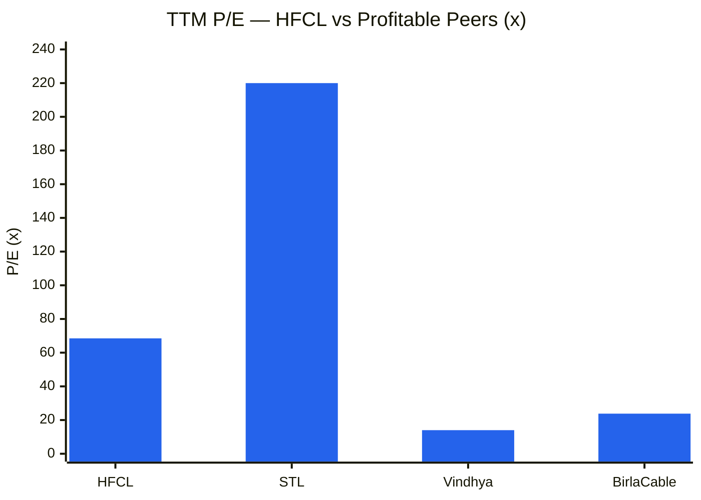
```mermaid
%%{init: {"themeVariables": {"xyChart": {"plotColorPalette": "#2563eb"}}}}%%
xychart-beta
    title "TTM P/E — HFCL vs Profitable Peers (x)"
    x-axis [HFCL, STL, Vindhya, BirlaCable]
    y-axis "P/E (x)" 0 --> 240
    bar [68.5, 220, 14.0, 23.8]
```
**Read:** HFCL has the **best margins and ROCE in the group** and trades at a fraction of STL's multiple. Relative to its peers it looks reasonable. Relative to its own history and to absolute returns (ROCE 10.8% against a 1.5% earnings yield), the whole group is expensive. **Peer positioning: in line within an overvalued sector.**
**Business inference:** The whole Indian fibre group is being priced as an AI-infrastructure growth story rather than as cyclical manufacturers. HFCL looks cheap only next to a peer at 220×. On absolute returns, the anchor that matters, the group is pricing peak conditions.

---

## Module 8 — Market Size & Market Share

India OFC market ~₹8,000–10,000 Cr (+12–15%); global optical fibre/cable ~$12–15 bn with AI-DC interconnect the fastest-growing slice; India defence electronics ~₹15,000–20,000 Cr (+20%) (June report sources). HFCL holds ~15–20% of domestic OFC. Exports went from ₹210 Cr (Q1 FY26) to ₹1,063 Cr (Q1 FY27), so **global share gains are structural (China+1 + AI)**. Revenue growth (TTM +47%) far exceeds market growth, so share is being gained, but some of it is price.

---

## Module 9 — Valuation: PIE First, Then DCF

**CMP ₹258 (8 Oct 2026) · Mcap ₹39,537 Cr · Debt ₹1,896 Cr · EV ~₹41,200 Cr · TTM EPS ₹3.77 · P/E 68.5× · P/B 8.1× · EV/TTM EBITDA 36×.**

### PIE
g = (EV × 12% − NOPAT₀) / (EV + NOPAT₀) = (41,233 × 0.12 − 728) / (41,233 + 728) = **10.1% perpetual NOPAT growth** from a **peak-margin TTM base**. On a normalised-margin NOPAT (~₹450 Cr at 13% EBITDA), the implied growth rises to ~10.7%.

| PIE driver | Market-implied | My base case | Gap |
|---|---|---|---|
| Revenue CAGR FY26–31 | ~20–22% (to ~₹12,500–13,500 Cr) | 18.6% (to ₹11,600 Cr) | Market slightly optimistic |
| Steady-state EBITDA margin | ~19–20% (Q1 run-rate sustained) | 17% (between median 12% and peak 23%) | **Market optimistic** |
| Working capital / Δrevenue | ~25–30% implied | **45%** (FY24–26 actual > 60%) | **Market very optimistic** |

**Expectations treadmill:** HFCL must (a) grow at 20%+ for 5 years, (b) hold peak-cycle 19–20% margins, *and* (c) cut CCC from 218 to < 120 days, all at once. (c) is the condition it has never met since its product pivot.
**Triggers:** + Q2/Q3 FY27 CFO positive; defence ≥ ₹400 Cr; order inflow > ₹5,000 Cr/qtr. − Fibre price softening (Chinese/YOFC capacity); hyperscaler capex pause; BharatNet payment delays; warrant/QIP dilution.
**SVAR:** Bear ₹47 → **82%** (unchanged from June; > 40% = unfavourable).

### Own DCF (5-yr explicit, normalised margins, WC 45% of Δrevenue)

| ₹/share | WACC 12%, g 6%, RONIC 15% | 11.5%, 6%, 20% | 11%, 6.5%, 25% |
|---|---|---|---|
| Bear (rev ₹7,800 Cr FY31, 14%) | 14 | 20 | 29 |
| **Base (₹11,600 Cr, 17%)** | **42** | **56** | **75** |
| Bull (₹14,200 Cr, 19%) | 65 | 85 | 113 |

*160.5 Cr diluted shares (incl. 7.5 Cr warrants); net debt ₹1,700 Cr; capex ₹600/450/400/400/400 Cr.*
**Read:** The DCF is crushed by working capital. Every ₹100 of new revenue has needed ₹45–60 of WC. Even the bull DCF is < ₹115. **The market price assumes the cash cycle normalises. History says it does not.**

### Relative (2-year, FY28E EPS × multiple)
FY27E: revenue ₹6,900 Cr (+40% guidance), EBITDA 19%, PAT ~₹700 Cr, EPS ~₹4.35 → forward P/E **59×**. FY28E base EPS ~₹4.92.

### CY1 — P/E Band

| | FY16 | FY17 | FY18 | FY19 | FY20 | FY21 | FY22 | FY23 | FY24 | FY25 | FY26 | Oct-26 |
|---|---|---|---|---|---|---|---|---|---|---|---|---|
| P/E (×) | 5.7 | 12.8 | 26.6 | 16.5 | 3.9 | 20.8 | 31.4 | 28.5 | 44.1 | 30.9 | 56.6 | 68.5 |

532 weekly observations: **median 27.2×, SD 18.2 → band 9.0–45.4×; current 68.5× = 97th percentile.** *(Screener.in)*

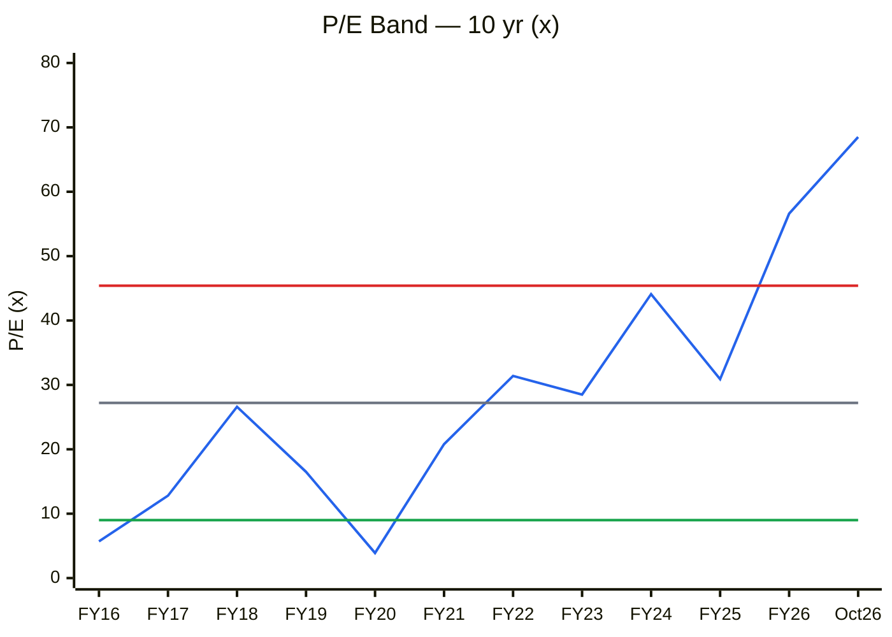
```mermaid
%%{init: {"themeVariables": {"xyChart": {"plotColorPalette": "#2563eb, #6b7280, #dc2626, #16a34a"}}}}%%
xychart-beta
    title "P/E Band — 10 yr (x)"
    x-axis [FY16, FY17, FY18, FY19, FY20, FY21, FY22, FY23, FY24, FY25, FY26, Oct26]
    y-axis "P/E (x)" 0 --> 80
    line [5.7, 12.8, 26.6, 16.5, 3.9, 20.8, 31.4, 28.5, 44.1, 30.9, 56.6, 68.5]
    line [27.2, 27.2, 27.2, 27.2, 27.2, 27.2, 27.2, 27.2, 27.2, 27.2, 27.2, 27.2]
    line [45.4, 45.4, 45.4, 45.4, 45.4, 45.4, 45.4, 45.4, 45.4, 45.4, 45.4, 45.4]
    line [9.0, 9.0, 9.0, 9.0, 9.0, 9.0, 9.0, 9.0, 9.0, 9.0, 9.0, 9.0]
```
🟦 P/E · ⬜ Median 27.2× · 🟥 +1SD 45.4× · 🟩 −1SD 9.0×
**Read:** P/E has been **above +1SD for three straight readings** and is now at its 10-year high **on peak-cycle margins**. This is the "double peak" (peak multiple × peak earnings) that the cyclical rule warns about. The last time HFCL traded at the opposite extreme (FY20, 3.9×) the stock rose 9× in two years.
**Business inference:** The market is treating peak-cycle earnings as the new base and paying the decade's highest multiple for them. When margins normalise, EPS and the multiple will fall together, so the main risk to capital here is valuation, not the business.

### CY2 — P/B Band

| | FY16 | FY17 | FY18 | FY19 | FY20 | FY21 | FY22 | FY23 | FY24 | FY25 | FY26 | Oct-26 |
|---|---|---|---|---|---|---|---|---|---|---|---|---|
| P/B (×) | 2.4 | 1.9 | 3.3 | 2.4 | 0.8 | 2.0 | 5.4 | 3.0 | 3.7 | 2.7 | 2.5 | 8.1 |
| ROE (%, PAT / avg equity) | 18.2 | 13.7 | 16.1 | 17.7 | 15.2 | 13.7 | 13.8 | 10.8 | 9.6 | 4.3 | 7.3 | ~12 TTM |

**Median 2.9×, SD 1.5 → band 1.4–4.4×; current 8.1× = 99th percentile.**

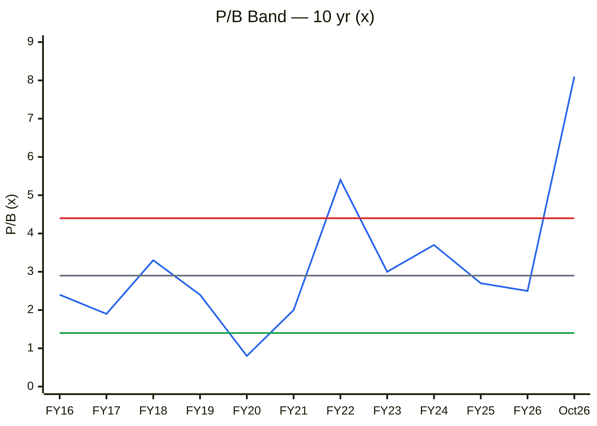
```mermaid
%%{init: {"themeVariables": {"xyChart": {"plotColorPalette": "#2563eb, #6b7280, #dc2626, #16a34a"}}}}%%
xychart-beta
    title "P/B Band — 10 yr (x)"
    x-axis [FY16, FY17, FY18, FY19, FY20, FY21, FY22, FY23, FY24, FY25, FY26, Oct26]
    y-axis "P/B (x)" 0 --> 9
    line [2.4, 1.9, 3.3, 2.4, 0.8, 2.0, 5.4, 3.0, 3.7, 2.7, 2.5, 8.1]
    line [2.9, 2.9, 2.9, 2.9, 2.9, 2.9, 2.9, 2.9, 2.9, 2.9, 2.9, 2.9]
    line [4.4, 4.4, 4.4, 4.4, 4.4, 4.4, 4.4, 4.4, 4.4, 4.4, 4.4, 4.4]
    line [1.4, 1.4, 1.4, 1.4, 1.4, 1.4, 1.4, 1.4, 1.4, 1.4, 1.4, 1.4]
```
🟦 P/B · ⬜ Median 2.9× · 🟥 +1SD 4.4× · 🟩 −1SD 1.4×
**Read:** P/B tripled in six months (2.5× → 8.1×), nearly double +1SD and **50% above the FY22 bubble high (5.4×)**. Justified P/B at a through-cycle ROE of ~14% (Ke 12.5%, g 7%) is **~1.3×**. Even at an optimistic 20% sustained ROE it is 2.4×. **8.1× prices ROE of ~50%.**
**Business inference:** The equity is priced as if HFCL were a high-return franchise, but its actual returns are those of a cyclical manufacturer. Book value is the cleanest gauge for this business, and it says the price assumes returns HFCL has never achieved.

### CY4 — Price vs EPS Index (FY16 = 100)

| | FY16 | FY17 | FY18 | FY19 | FY20 | FY21 | FY22 | FY23 | FY24 | FY25 | FY26 | Oct-26 |
|---|---|---|---|---|---|---|---|---|---|---|---|---|
| Price (₹) | 16.9 | 12.8 | 25.9 | 22.6 | 8.8 | 26.4 | 81.0 | 61.0 | 91.8 | 79.1 | 71.7 | 258.3 |
| EPS (₹; TTM for Oct-26) | 1.26 | 0.99 | 1.35 | 1.73 | 1.77 | 1.86 | 2.27 | 2.18 | 2.29 | 1.23 | 2.04 | 3.77 |

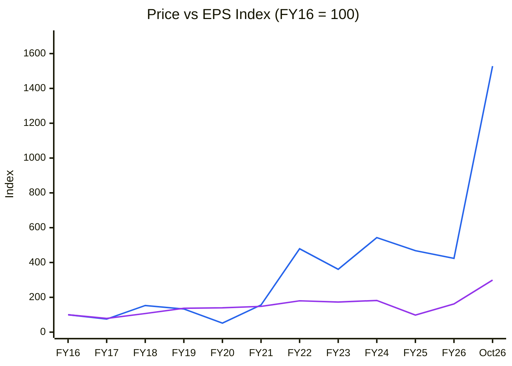
```mermaid
%%{init: {"themeVariables": {"xyChart": {"plotColorPalette": "#2563eb, #9333ea"}}}}%%
xychart-beta
    title "Price vs EPS Index (FY16 = 100)"
    x-axis [FY16, FY17, FY18, FY19, FY20, FY21, FY22, FY23, FY24, FY25, FY26, Oct26]
    y-axis "Index" 0 --> 1700
    line [100, 75, 153, 133, 52, 156, 479, 361, 543, 468, 424, 1528]
    line [100, 79, 107, 137, 140, 148, 180, 173, 182, 98, 162, 299]
```
🟦 Price index · 🟪 EPS index
**Read:** EPS has tripled since FY16, but **the price has risen 15×**. Five-sixths of the return is re-rating. The FY26 → Oct-26 jump alone (424 → 1,528) came on EPS rising 85%. The price has run 3.6× ahead of earnings, as it did before the FY22 → FY23 correction (−25%).
**Business inference:** Shareholder returns have come from sentiment, not from compounding earnings: the price has borrowed several years of future EPS growth. Future returns depend on earnings catching up, and history (FY22 → FY23) shows the multiple tends to give back first.

### C13 — 2-year Scenario Targets (FY28E EPS × multiple; 160.5 Cr shares)

| Scenario | Driver | FY28E revenue | EBITDA margin | FY28E EPS | P/E | Target | Prob. |
|---|---|---|---|---|---|---|---|
| Bear | Fibre price cycle turns, AI capex pause, WC squeeze | ₹6,000 Cr | 14% | ₹1.87 | 25× | **₹47** | 25% |
| Base | +40% FY27, +20% FY28; margin mean-reverts to 18% | ₹8,300 Cr | 18% | ₹4.92 | 35× | **₹172** | 50% |
| Bull | Order book converts fast; 20% margin holds; defence scales | ₹9,500 Cr | 20% | ₹6.80 | 45× | **₹306** | 25% |
| **Expected value** | | | | | | **₹174** | |

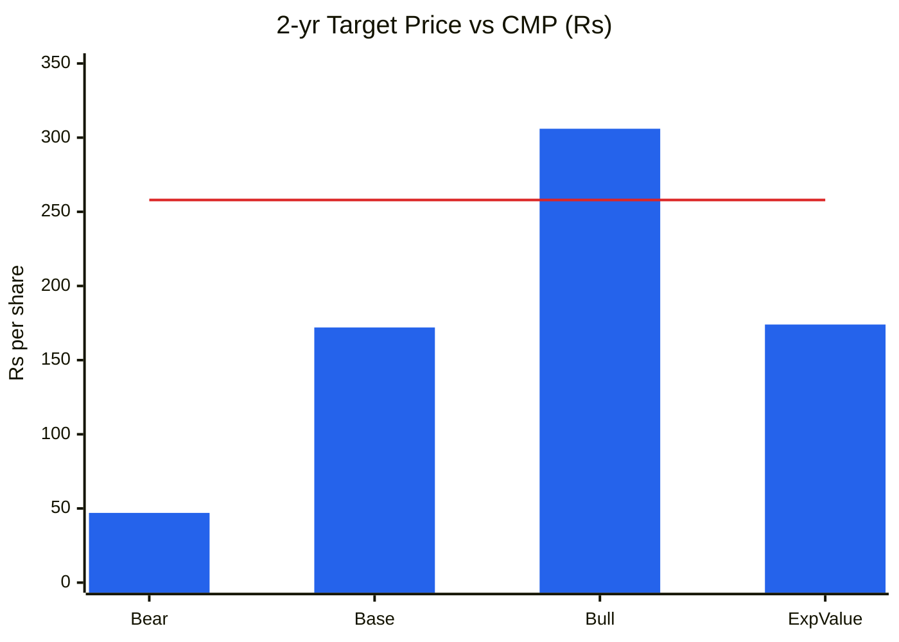
```mermaid
%%{init: {"themeVariables": {"xyChart": {"plotColorPalette": "#2563eb, #dc2626"}}}}%%
xychart-beta
    title "2-yr Target Price vs CMP (Rs)"
    x-axis [Bear, Base, Bull, ExpValue]
    y-axis "Rs per share" 0 --> 350
    bar [47, 172, 306, 174]
    line [258, 258, 258, 258]
```
🟦 Scenario price · 🟥 CMP ₹258
**Read:** **Only the bull case is above the current price (+19%).** The base case (−33%) and bear case (−82%) are both well below. U/D = 0.23:1. The base multiple of 35× is already generous (+0.4SD above the median).
**Business inference:** The market is pricing the best case as the base case: sustained AI demand, peak margins held, and a cash cycle that normalises. A normal outcome has no margin of safety, so the business has to be bought much lower for the thesis to work.

### Cycle Position Dashboard

| Dimension | Current | 10-yr median | Percentile | Signal |
|---|---|---|---|---|
| P/E | 68.5× | 27.2× | 97% | **Extreme** |
| P/B | 8.1× | 2.9× | 99% | **Extreme** |
| EBITDA margin | 22–23% (Q1) / 19% (TTM) | 12% | 100% | **Peak** |
| ROCE | 11% (FY26) → ~16% (FY27E) | 18% | 10% → ~45% | Recovering to median |
| Asset turnover | 2.5× | 4.9× | 0% | Structurally lower (business mix) |
| Cash conversion cycle | 218 days | 72 | 100% | **Worst in decade** |
| Sector valuations | STL 12× off low, peers 3–4× | — | — | **Euphoric (capital flooding in)** |
| Order book cover | 4.4× | 1.7× (FY22–25) | 100% | Strongest ever |
| **Overall cycle position** | | | | **LATE CYCLE: peak margins, peak multiples, peak order book** |

Consistent with Module 1b (strong tailwind, late valuation stage) and Module 1c (late cycle / peak margin).

**Graham number:** √(22.5 × 5-yr avg EPS 2.0 × BV 32) = **₹38**. **MoS: negative** (−50% vs relative base, −80% vs DCF).

---

## Module 10 — Technical Stage

| Item | Reading (Screener, 8 Oct 2026) |
|---|---|
| Price | ₹258.3; 52-wk ₹59.8–276 |
| 50-DMA / 200-DMA | ₹224.6 / ₹166.9, both rising; price 15% / 55% above |
| Weekly path | 172 (12 Jun) → 251 (28 Aug) → 211 (25 Sep) → 258 (8 Oct): higher lows, new closing high |
| RS vs Nifty | Very strong (+53% vs −6% since June) |
| Institutions | FII 7.1 → 15.7%, MF 6.9 → 8.4% (Jun qtr) |

**Stage 2 (advancing), extended** (55% above the 200-DMA). There is no topping evidence yet: the trend is intact, which is why valuation rather than technicals drives the verdict. **Stop for holders:** weekly close < ₹210 (Sep swing low / 30-week MA zone).
**CANSLIM:** C ✓ · A ✗ (3-yr EPS flat) · N ✓ (AI fibre, defence) · S ✗ (dilution, warrants) · L ✓ · I ✓ · M ✗ → **4 / 7.**

---

## Module 11 — Forward View

### Capex & gross block (C14)

| ₹ Cr | FY22 | FY23 | FY24 | FY25 | FY26 | FY27E | FY28E | FY29E |
|---|---|---|---|---|---|---|---|---|
| Gross Block | 955 | 1,050 | 1,216 | 1,495 | 1,989 | 2,600 | 3,000 | 3,350 |
| Revenue | 4,727 | 4,743 | 4,465 | 4,065 | 4,949 | 6,900 | 8,300 | 9,500 |
| AT (×) | 4.95 | 4.52 | 3.67 | 2.72 | 2.49 | 2.65 | 2.77 | 2.84 |

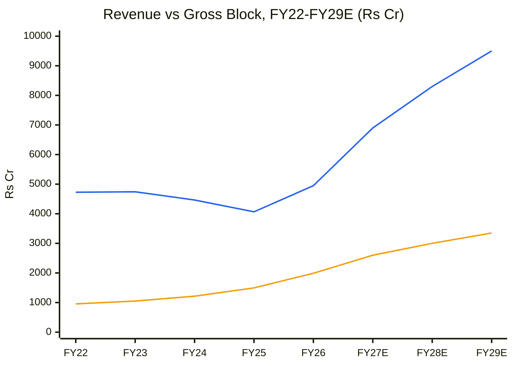
```mermaid
%%{init: {"themeVariables": {"xyChart": {"plotColorPalette": "#2563eb, #f59e0b"}}}}%%
xychart-beta
    title "Revenue vs Gross Block, FY22-FY29E (Rs Cr)"
    x-axis [FY22, FY23, FY24, FY25, FY26, FY27E, FY28E, FY29E]
    y-axis "Rs Cr" 0 --> 10000
    line [4727, 4743, 4465, 4065, 4949, 6900, 8300, 9500]
    line [955, 1050, 1216, 1495, 1989, 2600, 3000, 3350]
```
🟦 Revenue · 🟧 Gross block
**Read:** The base case needs revenue to nearly double by FY29 on a ~70% larger asset base. That is physically plausible (CWIP ₹486 Cr plus announced fibre/OFC expansions), so **capacity is not the constraint. Working capital and fibre pricing are.** Incremental ROIC on ~₹1,360 Cr of growth capex plus ~₹2,000 Cr of incremental WC: ΔEBIT ~₹750 Cr × 0.75 / ₹3,360 Cr ≈ **17% vs WACC 12%. Value-creating only if the margin holds at 18%+.**
**Business inference:** HFCL already has or is building the capacity to grow. What is unproven is whether it can grow without consuming more cash than it earns. Capital-allocation discipline, not demand, will decide whether the next phase creates value.

### Base-case earnings

| ₹ Cr | FY27E | FY28E | FY29E |
|---|---|---|---|
| Revenue | 6,900 | 8,300 | 9,500 |
| EBITDA (margin) | 1,311 (19%) | 1,494 (18%) | 1,663 (17.5%) |
| D&A / Interest | 210 / 250 | 260 / 260 | 300 / 270 |
| PAT | ~700 | ~790 | ~875 |
| EPS (₹, 160.5 Cr sh) | 4.35 | 4.92 | 5.45 |
| ΔWC (45%) | ~880 | ~630 | ~540 |
| FCF | **≈ −560** | ≈ −30 | ≈ +250 |
| Debt / EBITDA | ~1.8× | ~1.6× | ~1.3× |

**FCF inflection: FY29** (if WC intensity stays at 45%). **Debt ceiling:** safe (< 3×), but growth will need further equity or debt in FY27.

### Catalysts
1. **Q2 FY27 results (~late Oct 2026):** revenue ≥ ₹1,700 Cr *and* positive quarterly CFO.
2. **Defence revenue ≥ ₹400 Cr in FY27** (defence order book ~₹2,300 Cr).
3. **AI-DC / hyperscaler orders** (e.g. the ₹522 Cr export order, [Sahi](https://www.sahi.com/blogs/hfcl-share-price-522-crore-export-order-order-book)); FY27 data-centre connectivity target ₹700 Cr.
4. **BharatNet III execution and collections.**
5. **Fibre/OFC capacity expansion (34 → 43 mn fkm) commissioning.**

### Risks
1. **Fibre price cycle turns** (global AI capacity additions; Chinese oversupply): **High** over 2–3 years.
2. **Working-capital spiral / equity dilution** (CCC 218 days, FCF −₹723 Cr): **High**.
3. **Margin mean-reversion** from 23% toward 15–18%: **High**.
4. **Promoter selling continues / warrant dilution:** **Medium**.
5. **Government payment delays (BSNL/BharatNet):** **Medium**.

**Thesis:** HFCL is a real beneficiary of AI-fibre and China+1 demand, with a record order book. But today's price capitalises peak margins at a peak multiple for a business that has historically converted under half its profit into cash. Upside requires everything to go right. Normal mean reversion in margin or multiple produces 30–50% downside.

---

## Checklist Summary
**Section A (Business Quality):** 15 / 18 (scuttlebutt, pledge level, customer concentration not verified)
**Section B (Forensics):** 8 / 9 (annual-report KAMs not reviewed)
**Section C (Financial Statements):** 10 / 12
**Section D (KPIs & Peers):** 6 / 7 (customer concentration gap)
**Section E (Market Size & Share):** 5 / 7 (carried from June)
**Section F (Valuation):** 10 / 10
**Section G (Technical Stage):** 8 / 8
**Section H (Forward View):** 20 / 28 (segment-level AT for EPC vs products not separated)
**Section I (Charts):** 4 / 4 (CY5, CY6, CY8 omitted by rule: no sourced industry series)
**Hard Stops Triggered:** (1) **Forensic red flags ≥ 3 unresolved** (CFO < 0, Sloan > 10%, CCC > 200, promoter selling); (2) **Upside/downside < 1.5:1** (0.23:1).

---

## Investment Decision
**Recommendation:** **AVOID at ₹258 → WATCHLIST**
**Conviction Score:** 3.5 / 10 (Cycle 0.3 · Industry 0.5 · Moat 0.8 · Management 0.4 · Financial quality 0.6 · Valuation 0.1 · Technical 0.8)
**Suggested Position Size:** 0%. If buying in the zone: max 2% (late-cycle × 0.5 modifier).
**Entry Price Range:** **₹90–110** (U/D ≥ 2:1 against ₹172 base / ₹47 bear needs ≤ ₹89; ≈ 20× FY28E EPS; ≈ 3× book)
**Stop-Loss (existing holders):** weekly close < ₹210
**Target Price (Base, 2-yr):** ₹172
**Review Triggers:**
- *Upgrade:* two consecutive quarters of positive CFO with CCC < 150 days; FY27 revenue on track for +40% at ≥ 18% margin; promoter selling stops / warrants converted.
- *Further caution:* quarterly EBITDA margin < 15%; CCC > 240 days; another equity raise; fibre-price softening commentary from Corning / YOFC / STL.

---

## Data Sources & Citations
- [Screener.in — HFCL consolidated](https://www.screener.in/company/HFCL/consolidated/): 12-yr financials, quarterly, ratios, shareholding, fixed-asset schedule, P/E, P/B and price chart data (accessed 9 Oct 2026)
- [Business Standard — Q1 FY27 results](https://www.business-standard.com/companies/quarterly-results/hfcl-q1-results-consolidated-profit-at-245-64-crore-revenue-doubles-126072200846_1.html)
- [Voice&Data — Q1 FY27, ₹215 Cr AI capex, capacity](https://www.voicendata.com/artificialintelligence/hfcl-posts-record-q1-fy27-results-approves-rs-215-cr-ai-investment-12187806)
- [Sahi — Q1 FY27](https://www.sahi.com/blogs/hfcl-q1-fy27-results-loss-to-rs-245-crore-profit) · [Sahi — defence / DC targets](https://www.sahi.com/news/hfcl-aims-for-500-crore-defense-revenue-and-700-crore-data-center-connectivity-sales-522-PE1_CORP) · [Sahi — ₹522 Cr export order](https://www.sahi.com/blogs/hfcl-share-price-522-crore-export-order-order-book)
- [Upstox — Q1 FY27 / capacity](https://upstox.com/news/market-news/stocks/hfcl-shares-rise-5-as-firm-to-expand-capacity-with-manufacturing-unit-for-215-crore-posts-q1-fy-27-net-profit-at-246-crore/article-197381/)
- [FilingReader — promoter warrant allotment May 2026](https://filingreader.com/news-wire/mumbai/2026-05-25/hfcl-raises-inr-13875-crore-through-promoter-warrant-allotment)
- [Angel One — MN Ventures stake sale](https://www.angelone.in/news/stocks-share-market/hfcl-share-price-gain-over-2-percent-despite-promoter-reducing-stake)
- [CARE Ratings — HFCL Jul 2022 (FY22 order book)](https://www.careratings.com/upload/CompanyFiles/PR/06072022070116_HFCL_Limited.pdf) · [DSIJ — order book](https://insights.dsij.in/dsijarticledetail/rs-7678-crore-order-book-this-multibagger-telecom-infrastructure-company-bags-new-orders-worth-rs-6493-crore-37599) · [The Machine Maker](https://themachinemaker.com/news/hfcl-aims-for-%e2%82%b910000-crore-revenue-with-global-expansion-and-defence-growth/)
- [Trendlyne — shareholding](https://trendlyne.com/equity/share-holding/543/HFCL/30-06-2016/hfcl-ltd/)
- [StockPil — markets 5 Oct 2026](https://stockpil.com/india-markets-today-2026-10-05/)
- Peer ratios: Screener.in STLTECH, TEJASNET, VINDHYATEL, BIRLACABLE (9 Oct 2026)

**Remaining data gaps:** current promoter pledge %, customer concentration, FY26 annual-report KAMs and contingent liabilities, order-book split by segment and tenor.

---
*Report generated by Stock Fundamental Analysis Skill v3.1 | Indian Markets Context*
*Save path: C:\Users\anubh\Documents\Anubhav\Stock Analysis\Stock Analysis\*
*DISCLAIMER: For informational purposes only; not investment advice. FY27E–FY29E, DCF and scenario values are the analyst model's estimates.*
