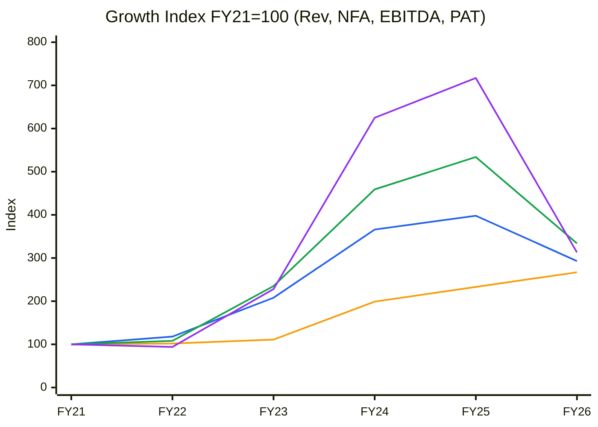
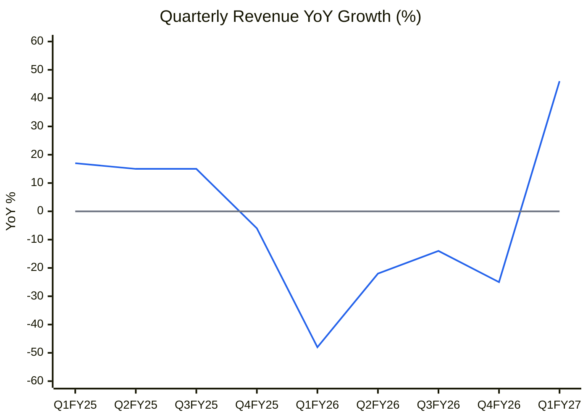
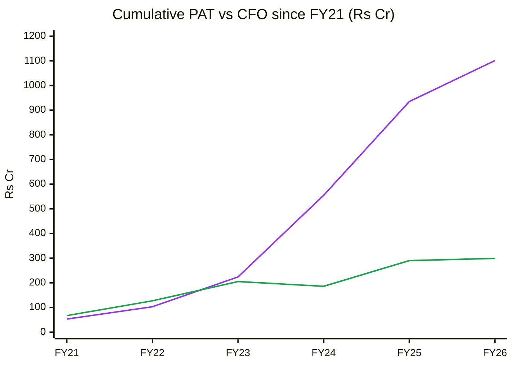
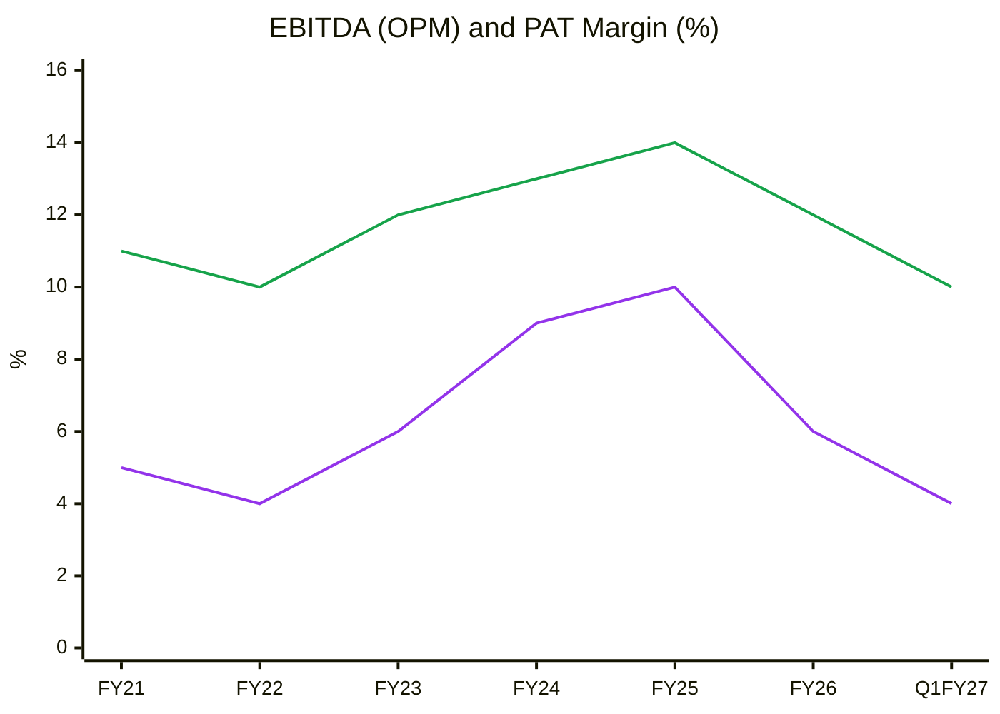
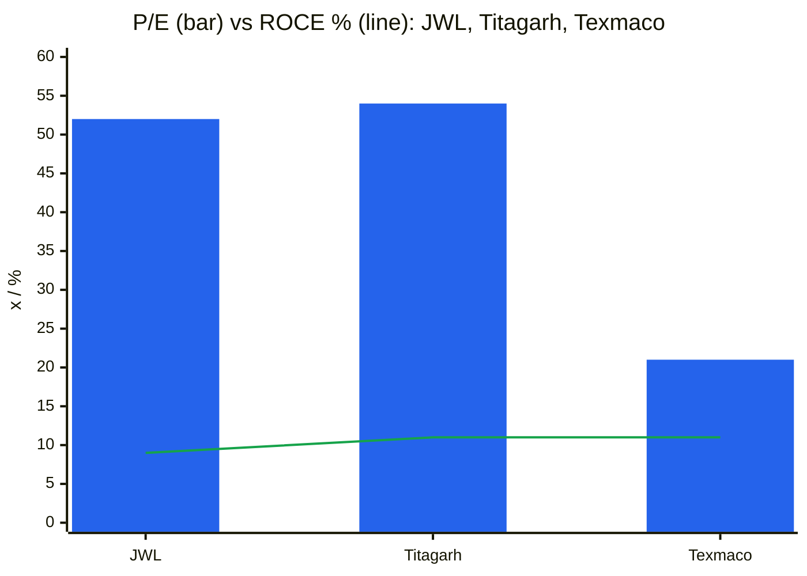
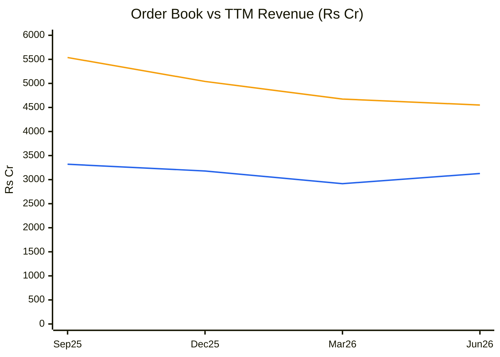
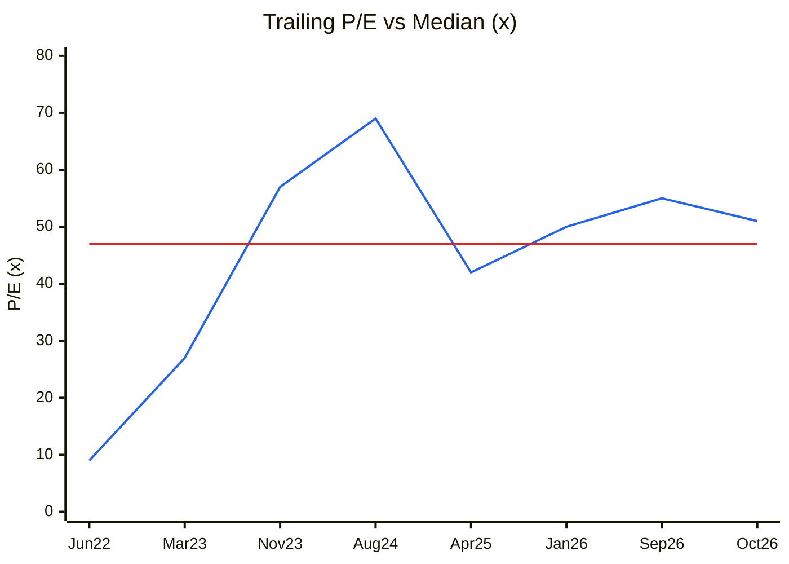
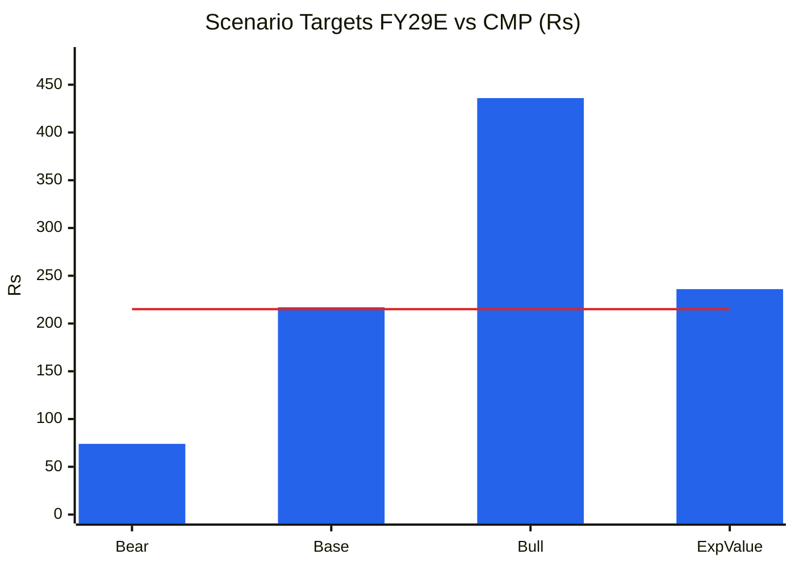

# Stock Analysis Report — Jupiter Wagons Ltd (NSE: JWL | BSE: 533272)
**Date:** 2026-10-09
**Analyst:** Claude (Stock Fundamental Analysis Skill v3.3)
**Investment Horizon:** 2–3 Years
**CMP:** ₹215 (9 Oct 2026) · **M-cap:** ₹9,176 Cr · **EV:** ~₹9,820 Cr (borrowings ₹996 Cr less ~₹350 Cr cash/investments, est.)
**Recommendation:** AVOID (for now) → re-check on IR tender award and Stage-1 base
**Conviction Score:** 3.5 / 10

## Revision Log
| Version | Date | Recommendation | Conviction | Price | Key change |
|---|---|---|---|---|---|
| Current | 2026-10-09 | AVOID | 3.5/10 | ₹215 | Initial report |

**Validation of previous report:** Initial report. No earlier JWL file in the library.

---

## Business Primer

Jupiter Wagons (JWL), Kolkata-based and part of the Lohia family's Jupiter group, makes **railway freight wagons** for Indian Railways (IR) and, increasingly, for private logistics, steel, port and cement companies. It also makes **commercial-vehicle load bodies, containers, cast bogies and couplers, and wheelsets**. Its plants are in Jabalpur, Indore and Kolkata. Revenue is **volume × realisation**: wagons delivered (5,498 in FY26, 8,718 in FY25) × about ₹41.5 lakh per wagon (Q1 FY27). Strategic partner and co-promoter **Tatravagonka a.s.** (Slovakia) brings designs and a wheelset offtake agreement. The company is building a ₹2,600 Cr greenfield **forged wheel and axle plant in Odisha** (100,000 wheelsets/yr; axle line FY27, wheel line FY28). Lucchini RS and SIMEST are taking 25% of that subsidiary for ~₹290 Cr. It is also diversifying into brakes (Stone India; production from Jul-26), electric LCVs (Jupiter Electric Mobility) and **battery energy-storage projects (BESS)** on a 15-year build-own-operate basis. Returns depend on two things: **wagon order flow (IR mega-tenders plus private demand)** and the **supply of wheelsets**, the industry's chokepoint in FY26.

This is a **cyclical, order-driven heavy-engineering manufacturer**, now mid-way through a **capital-intensive diversification**. The value driver is volume: utilisation of wagon capacity and the absorption of fixed costs. Margin is secondary (12–14% EBITDA at best). The key risks are **IR tender timing**, **execution and supply bottlenecks**, and **capital allocation into unproven adjacencies** (BESS, EV, wheels) while core earnings are falling. Three features shape the whole analysis. First, earnings have more than halved (PAT ₹380 Cr → ₹166 Cr) while the balance sheet is expanding (debt ₹502 Cr → ₹996 Cr, CWIP ₹270 Cr). Second, cash conversion is very weak: cumulative CFO is ~27% of PAT over six years. Third, the order book is 80% private, so price-variation protection is weaker than on IR orders.

*Segment: Railway Rolling Stock (Wagons, Coaches & Components). **New segment block added to references/05-industry-kpis-india.md (line 2579) on 2026-10-09 with user approval.***

---

## Executive Summary

Jupiter is a credible No. 2–3 private wagon maker with a strong private-customer franchise (JSW, Adani-linked logistics, steel and port groups) and a strategically sensible push into wheels. **The near-term numbers are poor, and the stock still prices a recovery.** FY26 revenue fell 26% and PAT 56%, and wagon output fell 37%. The order book has shrunk for four straight quarters (₹5,538 Cr → ₹4,550 Cr) with book-to-bill ~0.6. Debt doubled and FCF was −₹1,000 Cr over three years. Yet the stock trades at **52× trailing earnings and ~27× EV/EBITDA**, and a reverse DCF implies **~45–50% revenue CAGR**, which is the "₹8–10k Cr by FY28" vision. The stock is in a clean **Weinstein Stage 4** (price < falling 50- and 200-DMA, at its 52-week low). **AVOID for now.** Revisit when (a) the IR wagon mega-tender is awarded with a JWL allocation, (b) quarterly output exceeds 2,000 wagons, and (c) the price builds a Stage-1 base.

**Order book ₹4,550 Cr at 30-Jun-26 (1.46× TTM revenue) · wagons ~₹3,000 Cr (~7,000 units, 80% private) · book-to-bill (last 3 qtrs) 0.58 · ~60–70% to execute in FY27 (management)**

### C1 — Growth Index (FY21 = 100)
| FY | Revenue | Net Fixed Assets | EBITDA | PAT | Rev idx | NFA idx | EBITDA idx | PAT idx |
|---|---|---|---|---|---|---|---|---|
| FY21 | 996 | 418 | 106 | 53 | 100 | 100 | 100 | 100 |
| FY22 | 1,178 | 428 | 114 | 50 | 118 | 102 | 108 | 94 |
| FY23 | 2,068 | 464 | 249 | 121 | 208 | 111 | 235 | 228 |
| FY24 | 3,644 | 831 | 487 | 331 | 366 | 199 | 459 | 625 |
| FY25 | 3,963 | 972 | 566 | 380 | 398 | 233 | 534 | 717 |
| FY26 | 2,916 | 1,115 | 354 | 166 | 293 | 267 | 334 | 313 |

*Source: [Screener.in consolidated](https://www.screener.in/company/JWL/consolidated/). Net fixed assets exclude CWIP (FY26 CWIP ₹270 Cr, mostly the Odisha wheel plant).*

🟦 Revenue · 🟧 Net fixed assets · 🟩 EBITDA · 🟪 PAT. CAGR FY21–26: Revenue 24%, NFA 22%, EBITDA 27%, PAT 26%.

**Read:** Fixed assets kept compounding through FY26 (index 267, still rising) while revenue, EBITDA and PAT fell 26–56% from their FY25 peak.

**Business inference:** The FY23–25 boom came from the 2022 IR mega-tender. That tender is now largely executed and the next one has not been floated, while JWL is spending heavily on wheels, BESS and EV ahead of demand. Capital is outrunning earnings, so ROCE falls until the new assets produce, which will not be before FY28. This is the classic late-cycle capex pattern, not a compounding moat.

---

## Module 1 — Broad Market Cycle (Marks)
Nifty 50 ~22,556 (5-Oct-26, ~6% off June), VIX ~14.7, FII selling absorbed by DIIs ([StockPil](https://stockpil.com/india-markets-today-2026-10-05/)). **Verdict: CAUTIOUS.** Small-cap capital goods have de-rated through 2026.

## Module 1b — Sector Cycle: Rolling Stock
- **Secular (durable):** The National Rail Plan targets lifting rail's freight share from ~27% to 45% by 2030. DFCs, coal, cement and port logistics add demand, and IR's FY27 budget is ~₹2.93 lakh Cr ([Texmaco Q3FY26 presentation](https://www.texmaco.in/wp-content/uploads/2026/02/Q3-FY26-Texmaco-Earnings-Presentation.pdf)). Private wagon ownership schemes (GPWIS and others) are structurally growing. **Durable baseline: ~8–12% volume growth over a cycle.**
- **Cyclical (lumpy):** IR wagon tenders come in multi-year bursts. The 2022 tender (~₹32,000 Cr) drove FY23–25. The successor (~₹40,000 Cr, ~1 lakh wagons over 3–4 years) was reported as imminent in May-2026 ([Goodreturns](https://www.goodreturns.in/news/irfc-titagarh-rail-jupiter-wagons-rally-up-to-9-as-indian-railways-plans-mega-rs-40-000-crore-tender-1510729.html)), but **no tender floated as of Oct-2026**. JWL management: "We are just waiting for railways to firm up their requirements" ([Q1FY27 call, Investing.com](https://www.investing.com/news/transcripts/earnings-call-transcript-jupiter-wagons-posts-strong-q1-2026-revenue-growth-93CH-4864436)).
- **Input/supply cycle:** The FY26 industry-wide **wheelset shortage** (RWF and imports) cut output across makers (Texmaco −21% deliveries, JWL −37% production). In Q4 FY26, LPG availability and global supply-chain disruption hit again. Steel cost is a pass-through on IR orders (PVC), less so on private orders.
- **Capacity pipeline:** Capacity is being added just as IR orders pause. Titagarh, Texmaco (incl. 2,400-wagon Nymwag from Apr-26; total 15,400/yr per [CARE](https://www.careratings.com/upload/CompanyFiles/PR/202607150702_Texmaco_Rail_&_Engineering_Limited.pdf)) and JWL are all expanding. Wheel capacity is also crowding (a competitor is building ~2.28 lakh units, per an analyst on the JWL call).
**Sector verdict: HEADWIND near-term (tender gap + supply) on a structural TAILWIND.** Do not embed FY24–25 volumes as run-rate until the tender is awarded.

## Module 1c — Stock Cycle

### C2 — Quarterly revenue YoY growth
| Qtr | Q1FY25 | Q2FY25 | Q3FY25 | Q4FY25 | Q1FY26 | Q2FY26 | Q3FY26 | Q4FY26 | Q1FY27 |
|---|---|---|---|---|---|---|---|---|---|
| Revenue ₹Cr | 880 | 1,009 | 1,030 | 1,045 | 459 | 786 | 890 | 780 | 671 |
| YoY % | +17 | +15 | +15 | −6 | −48 | −22 | −14 | −25 | +46 |
| Wagons produced | — | — | — | 2,375 | 826 | 1,628* | 1,697 | 1,347 | 1,141 |

*Q2FY26 derived = FY26 5,498 − (826 + 1,697 + 1,347). Source: [Multibagg FY26 update](https://www.multibagg.ai/market-pulse/articles/jupiter-fy26-update-95495), [Investing.com Q1FY27](https://www.investing.com/news/transcripts/earnings-call-transcript-jupiter-wagons-posts-strong-q1-2026-revenue-growth-93CH-4864436).*

🟦 YoY revenue growth · ⬜ zero line

**Read:** Q1FY27's +46% is a base effect off the disastrous Q1FY26 (₹459 Cr). Sequentially revenue fell for a second straight quarter (₹890 Cr → ₹780 Cr → ₹671 Cr), and output fell to 1,141 wagons.

**Business inference:** The run-rate is still **~₹2,700–2,800 Cr a year**, below FY24. Management's explanation (prototype approvals for new private-wagon designs) is plausible but self-inflicted: the mix shift toward private designs trades volume for realisation. **Decelerating sequentially. No turn yet.**

**Revenue decomposition:** Realisation rose from ₹38 lakh to ₹41.5 lakh per wagon (+9%) on private mix ([Q1FY27 call](https://www.investing.com/news/transcripts/earnings-call-transcript-jupiter-wagons-posts-strong-q1-2026-revenue-growth-93CH-4864436)) while volume fell 37% in FY26. **Mix is the only positive driver.** Volume, the main one, is broken until supply and tenders normalise.

**Capacity model:** Installed wagon capacity is not disclosed in sources reviewed (⚠️). Peak output of 8,718 (FY25) implies ≥ ~9,000/yr effective. FY26 output of 5,498 is **~60% utilisation**, and Q1FY27 annualised (4,564) is ~50%. Management's earlier FY26 guidance of ~10,000 wagons implies capacity ≥ 10,000/yr, so **utilisation is roughly 45–55%**.

**Operating leverage:** EBITDA margin was 14.6% at ₹1,045 Cr a quarter (Q4FY25) and 9.7% at ₹671 Cr (Q1FY27), so DOL ≈ 2×. DFL is rising: interest ₹17 Cr a quarter against EBIT ~₹46 Cr. **Q1FY27 ICR ≈ 2.7×** and Q4FY26 ≈ 2.7×, close to the 2.5× flag. FY26 ICR (EBIT/interest) = 315/70 = 4.5×.

**FCF inflection:** Not before FY29. Odisha wheel capex (JWL share ~₹600 Cr after the Lucchini infusion), BESS projects (₹400–500 Cr+, funding "undecided") and the WC build (inventory days 94 → 188) all come first.

**Stock cycle classification: TROUGH-ish operations with LATE-CYCLE capital deployment.** Revenue and margins are depressed for an identifiable reason (tender gap, wheels), but the capex wave is still building. That mix calls for the widest MoS.

---

## Module 2 — Industry Structure & Capital Cycle

| Force | Assessment | Signal |
|---|---|---|
| New entrants | Moderate: RDSO approvals and IR vendor registration are barriers, but capacity is cheap to add and private customers are price-led | Neutral |
| Supplier power | **High.** Wheelsets (~30% of wagon cost) come from RWF and imports; steel majors | Unfavourable |
| Buyer power | **High.** IR is a monopsony with L1 tenders; private buyers are large groups (JSW, Adani, SAIL, Tata) with bargaining power | Unfavourable |
| Substitutes | Low (road freight is a competing mode, but policy pushes rail) | Favourable |
| Rivalry | High in commodity wagons (Titagarh, Texmaco, JWL, Hindustan Engg, Besco, PSU Braithwaite), moderate in special-purpose wagons | Unfavourable |

**Industry verdict: NEUTRAL-to-UNATTRACTIVE structurally** (two powerful sides, cyclical buyer). Attractive only during tender upcycles.
**Capital cycle:** **Late.** Capex runs far ahead of depreciation across makers: JWL capex ~₹680 Cr vs D&A ₹67 Cr. Wheel plants are being announced by several players. JWL (₹800 Cr), Texmaco and Titagarh raised QIPs in 2023–24. Returns (ROCE 9% at JWL) are now **below** their 3-year average and capital is still flowing in. **Chancellor's signal reads "returns fall further before they recover".**

---

## Module 3 — Business Quality & Moat
1. *Supply/cost advantage:* partial. Casting and bogie integration, plus wheels in future, should lower the cost per wagon. Not proven yet: EBITDA margin of 10–14% is in line with peers, not above them.
2. *Customer captivity:* weak. Wagons are tendered or competitively bought. Repeat private customers (JSW orders in Q1FY27) show relationships, not switching costs.
3. *Local scale:* no.

**Buffett 10% price test:** Fail. Margins compressed as soon as input costs rose (Q1FY27 PAT −16% on revenue +46%, blamed on raw material).
**Market share:** JWL's share of national wagon output rose in FY23–25 (≈ 8,718 of ~40,000/yr ≈ 20%; ⚠️ industry total approximate) and fell in FY26.
**Moat verdict: NONE-to-NARROW** (narrow only if the Odisha wheel plant delivers a genuine wheelset cost and supply advantage after FY28).

### Fisher 15-Point
| # | Point | Score | Note |
|---|---|---|---|
| 1 | Market potential | 3 | Rail freight share push, private wagons, exports |
| 2 | New products | 3 | Wheels, brakes, BESS, EV LCVs, containers |
| 3 | R&D effectiveness | 2 | Tatravagonka/Lucchini designs, RDSO approvals |
| 4 | Sales organisation | 2 | Strong private-customer wins |
| 5 | Profit margin | 1 | 10–14% EBITDA, falling |
| 6 | Margin management | 1 | No pass-through in Q1FY27 |
| 7 | Labour relations | 2 | No data |
| 8 | Executive relations | 2 | Family-led (Lohia) with a foreign co-promoter |
| 9 | Management depth | 2 | |
| 10 | Cost/accounting controls | 2 | Subsidiary losses opaque ("I do not have the numbers") |
| 11 | Industry advantages | 2 | Tatravagonka/Lucchini tie-ups |
| 12 | Long-range orientation | 3 | Backward integration is strategic |
| 13 | Dilution | 1 | QIP ₹800 Cr @ ₹655.5 (Jul-24), warrants to Tatravagonka @ ₹470, ESOPs |
| 14 | Candor in adversity | 2 | Admitted FY26 guidance miss (Nov-25); "not meaningful" deflection on Stone India |
| 15 | Integrity | 2 | No enforcement found. **Pass** |
| **Total** | | **30 / 45** | |

---

## Module 4 — Management & Capital Allocation
**Promoters:** 68.31% (Sep-26), down from 70.12% (Dec-23) via QIP dilution and up slightly in Dec-25 on Tatravagonka's warrant conversion at ₹470 ([FilingReader](https://filingreader.com/news-wire/mumbai/2025-12-19/jupiter-wagons-allots-new-equity-shares-to-promoter-tatravagonka)). **Pledge: not verified** ⚠️ (not on Screener). **Institutions are exiting:** FII 4.48% (Dec-25) → 3.02%, DII 2.05% (Dec-23) → 0.80%. Retail now holds 27.9% across 3.75 lakh holders.
**Capital raised:** QIP ₹800 Cr (Jul-24 @ ₹655.50, now 67% underwater at ₹215) and warrants ₹135 Cr, plus debt up ₹494 Cr in FY26. **Deployed into:** the Odisha wheel plant (JWL share ~₹600 Cr of ₹2,600 Cr), Stone India and JEM, BESS, and WC.
**FCF/share vs EPS:** Cumulative FY21–26 FCF is **−₹1,001 Cr** against PAT of ₹1,101 Cr. EPS has fallen from ₹9.0 (FY25) to ₹4.0 (FY26), and share count rose ~10%.
**Capital allocation rating: POOR-to-AVERAGE for now.** The strategy is coherent, but sequencing (diversifying while the core is in a downturn), unclear BESS funding and the value-destroying QIP price for incoming shareholders weigh on it.
**RPT:** Tatravagonka is both co-promoter and wheelset offtaker (20–30k wheelsets/yr). Arm's-length pricing is ⚠️ unverified (AR RPT note not read).
**Three C's:** Candor Moderate · Competence Moderate · Caring Low-Moderate.

### Walk the Talk Scorecard
| Guided | Statement | Guided | Actual | Verdict |
|---|---|---|---|---|
| FY25 calls | FY26 revenue ~₹5,000 Cr | ₹5,000 Cr | ₹2,916 Cr (−42% vs guide) | ❌ Miss (withdrawn Nov-25) |
| Q1FY26 call | FY26 production ~10,000 wagons | 10,000 | 5,498 | ❌ Miss |
| FY25 calls | Odisha wheel plant commissioning (part production by FY26-end) | FY26–27 | Axle FY27, wheel FY28 | ❌ Delayed ~1 yr+ |
| FY26 calls | Stone India RDSO approval, production by Jul-26 | Jul-26 | Production started Jul-26 | ✅ Hit |
| Q3/Q4 FY26 | Operational stability from Q2FY27; output recovery | Q1FY27 rising | Q1FY27 output fell to 1,141 | ❌ Miss (so far) |
| Q1FY27 | JEM EBITDA-positive by Q3FY27 | — | Same call also says FY28 | 🔴 Inconsistent |
| Q1FY27 | 60–70% of OB executed in FY27; BESS order book ₹1,000 Cr in FY27; ₹8–10k Cr revenue by FY28 | | | ⏳ Pending |

**WTT Score: 0.20 / 1.00 — UNRELIABLE** (5 scored: 1 hit, 4 misses; plus 1 inconsistency).
**Key pattern:** **Optimism bias on volumes and timelines.** Some of it is exogenous (an industry-wide wheel shortage hurt everyone), but the scale of the misses (−42% revenue vs guidance) is far larger than Texmaco's (−14% YoY), so execution is weaker than peers'.
**Insider action:** The promoter (Tatravagonka) converted warrants at ₹470 (Dec-25), when the stock traded at ~₹300. This was a commitment made in 2024 and is not a fresh signal. No open-market buying found ⚠️.
**DCF impact:** Management targets are ignored. Revenue is built bottom-up from wagons × realisation with a 1–2 quarter delay haircut.
**Overall credibility: LOW.**

---

## Module 5 — Financial Forensics
| Test | Value | Read |
|---|---|---|
| Beneish M (FY26 vs FY25, approx.) | **≈ −2.3** (DSRI 1.27, GMI ~1.1, AQI ~1.1, SGI 0.74, LVGI 1.18, TATA +0.033) | **Borderline grey zone** (driven by debtor-day rise and accruals) |
| Altman Z'' (FY26) | ≈ 6.7 (reserves include ~₹1,700 Cr share premium, so RE/TA is overstated) | Safe |
| Piotroski F (FY26) | **2 / 9** | **Weak** |
| Sloan CF accrual (FY26) | (166 − 9 + 688) / 4,356 = **19%** | ⚠️ > 10% (capex-heavy) |
| 6-yr CFO / PAT (FY21–26) | 299 / 1,101 = **0.27** | 🔴 Very weak |
| Debtor days | 49 → 75 → **95** (FY24 → FY26) | ⚠️ Rising 2 years |
| Inventory days | 94 → **188** (FY25 → FY26) | ⚠️ Doubled (₹769 Cr → ₹1,079 Cr) |
| Other income / EBIT | 28 / 315 = 9% | OK |
| Tax rate FY26 | 32% (Q4: 41%) | Elevated: subsidiary losses not tax-shielded |
| Pledge | Not verified | ⚠️ |

**Schilit screen:** EMS#1 (revenue too soon): DSO up 46 days in two years, so watch it. CFS#3 (WC): inventory build, described as a "short-term mismatch". Subsidiary losses are not quantified on the call.
**Forensic red-flag count: 4 / 15** (CFO/PAT, DSO trend, inventory, Piotroski). **Verdict: MINOR-to-SIGNIFICANT concerns.** These are cash-quality issues, not evidence of manipulation. They need a clean FY27 CFO to clear.

---

## Module 6 — Earnings Quality & Financial Statements
**ROIC:** FY26 EBIT ex-OI ≈ 287 × (1 − 0.30) = NOPAT ~₹200 Cr on invested capital ~₹3,700 Cr (equity 2,978 + debt 996 − cash ~350 + ...) ≈ **5.5% vs WACC 13%** → **value-destroying in FY26**. FY24 ROIC was ~20%.

### DuPont (5-factor)
| Year | EBIT Margin | Asset Turnover | Equity Multiplier | Interest Burden | Tax Burden | ROE |
|---|---|---|---|---|---|---|
| FY22 | 8.0% | 1.10 | 1.57 | 0.81 | 0.66 | 7.3% |
| FY23 | 11.1% | 1.27 | 2.03 | 0.87 | 0.61 | 15.1% |
| FY24 | 13.3% | 1.24 | 1.82 | 0.92 | 0.75 | 20.5% |
| FY25 | 14.0% | 0.99 | 1.45 | 0.89 | 0.77 | 13.8% |
| FY26 | 10.8% | 0.62 | 1.58 | 0.78 | 0.68 | 5.6% |

**Operating contribution:** Falling sharply (both margin and AT). **Financing contribution:** Equity multiplier rising again (1.45 → 1.58) and interest burden worsening. **DuPont verdict:** The ROE collapse is operational, and leverage is starting to rise into it, the pattern the skill flags. **AT trend: DECLINING** (1.27 → 0.62) as CWIP and the new plant arrive before revenue.

### C7 — Cumulative PAT vs CFO (₹ Cr)
| FY | FY21 | FY22 | FY23 | FY24 | FY25 | FY26 |
|---|---|---|---|---|---|---|
| Cum. PAT | 53 | 103 | 224 | 555 | 935 | 1,101 |
| Cum. CFO | 67 | 127 | 205 | 186 | 290 | 299 |

🟪 Cumulative PAT · 🟩 Cumulative CFO

**Read:** CFO tracked PAT until FY23, then flat-lined. Six-year cumulative CFO is ₹299 Cr against ₹1,101 Cr of PAT.

**Business inference:** The boom years' profits never became cash. They are tied up in receivables (95 days) and inventory (188 days). Combined with ₹1,700 Cr+ of capex, the business has been funded by QIP, warrants and debt, so **equity holders have been financing growth that has not yet earned its cost of capital**.

### C4 — Margin trend
| FY | FY21 | FY22 | FY23 | FY24 | FY25 | FY26 | Q1FY27 |
|---|---|---|---|---|---|---|---|
| OPM % | 11 | 10 | 12 | 13 | 14 | 12 | 10 |
| PAT % | 5 | 4 | 6 | 9 | 10 | 6 | 4 |

🟩 OPM · 🟪 PAT margin

**Read:** OPM peaked at 14% in FY25 and is back to FY21–22 levels (10%). PAT margin has halved because interest and depreciation from the new assets keep rising.

**Business inference:** Below-the-line costs of the diversification (D&A ₹28 Cr → ₹70 Cr, interest ₹41 Cr → ₹71 Cr TTM) are arriving before its revenue. Even if wagon OPM recovers to 13%, PAT margin will stay ≤ 7% until wheels and BESS contribute.

**OCF/NI (5-yr):** 0.27 → **LOW quality. O'Glove flags: 5/15** (NI vs OCF, DSO, AR/revenue, inventory, capex/depreciation ≈ 10×).

---

## Module 7 — Industry KPIs & Peer Analysis
**Sector:** Railway Rolling Stock (new reference block)

| KPI | JWL | Peer avg (Texmaco/Titagarh) | Assessment |
|---|---|---|---|
| Utilisation (FY26) | ~50–60% | Texmaco ~55–65%, Titagarh n/a | In-line (industry-wide wheel shortage) |
| Order book / TTM revenue | 1.46× | Texmaco 2.35×, Titagarh ~3×+ ⚠️ | **Below** |
| EBITDA margin (TTM) | 11.5% | Texmaco 8.9%, Titagarh 10–12% | In-line / above |
| IR share of wagon OB | ~20% | Texmaco 3.6% (Q1FY27) | Diversified |
| WC days (FY26) | 88 | Texmaco 84, Titagarh 76 | In-line |
| Inventory days | 188 | Texmaco 95, Titagarh 92 | **Worst** |

### Peer comparison (Screener, 9-Oct-26)
| Metric | **JWL** | Titagarh | Texmaco |
|---|---|---|---|
| M-cap ₹Cr | 9,176 | 10,478 | 4,512 |
| Revenue FY26 ₹Cr | 2,916 | 3,186 | 4,377 |
| FY24→26 revenue CAGR | −11% | −9% | +12% |
| OPM FY26 | 12% | 10% | 9% |
| PAT FY26 ₹Cr | 166 | 123 | 194 |
| ROCE | 9.1% | 10.9% | 11.2% |
| ROE | 6.4% | 6.8% | 7.3% |
| P/E (TTM) | **51.6** | 53.9 | **20.8** |
| P/B | 3.1 | 4.3 | 1.9 |
| EV/Sales (approx.) | 3.1× | 3.3× | 1.1× |
| Borrowings ₹Cr | 996 | 623 | 895 |

**Peer positioning:** JWL trades at **2.5× Texmaco's P/E and 2.8× its EV/Sales** on lower revenue and comparable ROCE. The premium rests on the wheel/BESS optionality and the private-wagon franchise. **Not justified by current returns.** Titagarh carries a similar "transformation premium" (Vande Bharat/metro).

### C12 — Peer valuation vs returns

🟦 P/E (×) · 🟩 ROCE (%)

**Read:** All three earn ~9–11% ROCE, yet JWL and Titagarh trade at ~52–54× and Texmaco at ~21×.

**Business inference:** At similar returns, the multiple gap is narrative (wheels, BESS, Vande Bharat) versus governance discount (Texmaco's ₹700 Cr reserve provision; see the Texmaco report). On fundamentals alone JWL's multiple has the most room to compress if the IR tender slips further.

### Order Book Tracker
**Order Ledger (announced, incomplete; Reg-30 harvest not exhaustive ⚠️)**
| # | Date | Customer | Item | ₹ Cr | Firmness | Qtr |
|---|---|---|---|---|---|---|
| 1 | Q1FY27 | JSW (South) Rail Logistics + Central Warehousing Corp | Wagons | 264.3 | Firm | Q1FY27 |
| 2 | Q1FY27 | JSW Port Logistics + Orissa Alloy Steel | Wagons | 211 | Firm | Q1FY27 |
| 3 | Q2FY27 | West Bengal (JEM) | BESS 100 MW + 400 MW, 15-yr BOO | ~400 | Firm (project; annuity revenue) | Q2FY27 |
*Sources: [ScanX](https://scanx.trade/stock-market-news/companies/jupiter-wagons-secures-orders-exceeding-264-crores-from-jsw-south-rail-logistics-and-central-warehousing-corporation/43924761), [Investing.com Q1FY27](https://www.investing.com/news/transcripts/earnings-call-transcript-jupiter-wagons-posts-strong-q1-2026-revenue-growth-93CH-4864436). BESS BOO value is a 15-year revenue stream and is **not** comparable to wagon orders. Treat it as framework-like for visibility purposes.*

**Order Book Snapshots**
| Date | OB ₹Cr | Note / source |
|---|---|---|
| ~Mar-24 | 7,102 | ⚠️ DSIJ headline, May-2024 |
| 30-Sep-25 | 5,538 | Q2FY26 |
| 31-Dec-25 | 5,041 | Q3FY26 |
| 31-Mar-26 | 4,675 | Q4FY26 (~2,000 IR + ~5,400 non-IR wagons ≈ ₹3,100 Cr) |
| 30-Jun-26 | 4,550 | Q1FY27 (wagons ~3,000, wheels ~700, CV bodies ~500, BESS ~500; ~7,000 wagons) |

**Reconciliation**
| Qtr | Opening OB | Revenue | Closing OB | Implied inflow | Announced | Coverage |
|---|---|---|---|---|---|---|
| Q3FY26 | 5,538 | 890 | 5,041 | 393 | n/a | — |
| Q4FY26 | 5,041 | 780 | 4,675 | 414 | n/a | — |
| Q1FY27 | 4,675 | 671 | 4,550 | 546 | 475 | 87% ✅ |

**Macro metrics:** Book-to-bill (3 qtrs) **0.58** 🔴 (< 0.8 for 3 quarters) · cover 1.46× · execution guidance 60–70% in FY27 (₹2,700–3,200 Cr from the book) · private share ~80% of wagons.

### OB-1 — Order book vs TTM revenue (₹ Cr)
| Date | Sep-25 | Dec-25 | Mar-26 | Jun-26 |
|---|---|---|---|---|
| Order book | 5,538 | 5,041 | 4,675 | 4,550 |
| TTM revenue | 3,320 | 3,180 | 2,916 | 3,127 |
| Cover (×) | 1.67 | 1.59 | 1.60 | 1.46 |

🟦 TTM revenue · 🟧 Order book

**Read:** The order book shrank 18% in three quarters while TTM revenue held near ₹3,000–3,300 Cr. Cover is drifting from 1.67× to 1.46×.

**Business inference:** JWL is consuming its backlog faster than it refills it, even at a depressed run-rate. Without the IR mega-tender, FY28 revenue would fall below FY27's. **The thesis is binary on the tender**, and management can give no update on it.

**Order-book verdict:** Firm visibility ~1.0–1.2 yrs (wagons) · book-to-bill 0.58 (shrinking) · BESS is long-dated annuity · concentration: JSW-linked orders recurrent.

---

## Module 8 — Market Size & Share
- **TAM (domestic wagons):** IR plans 1–1.3 lakh wagons over 3–4 years (Texmaco presentation), i.e. ~30,000–40,000/yr plus private ~5,000–8,000/yr. At ~₹40 lakh/wagon that is **~₹12,000–18,000 Cr/yr**. JWL's wagon revenue of ~₹2,300 Cr (FY26 est.) is **~15% share** ⚠️ (approximate).
- **Wheelsets:** Domestic demand of 3–4 lakh/yr plus export (management). JWL's 1 lakh/yr plant would be ~25–30% of domestic demand **if** it is commissioned and certified. Competing capacity (~2.28 lakh) is also coming.
- **Share trend:** Gained in FY23–25, lost in FY26 (JWL output −37% vs Texmaco −21%). **Verdict: losing share in FY26. Unproven in new segments.**

---

## Module 9 — Valuation: PIE First

### 9A. PIE
Inputs: EV ~₹9,820 Cr; WACC 13% (small-cap, cyclical, β ~1.2); terminal g 6%; EBIT margin 9% (12% EBITDA − 3% D&A); WC 25% of Δrevenue; net capex 2% of revenue.

| PIE driver | Market-implied | My base | Gap |
|---|---|---|---|
| Revenue CAGR (5-yr from ₹2,916 Cr) | **~49%** (→ ~₹21,000 Cr) | ~13% (→ ~₹4,800 Cr by FY29) | **Strongly optimistic** |
| EBIT margin | 9% | 9–10% | ≈ |
| Even at 12% EBIT margin, implied CAGR | ~35–40% | | |

**Classification: OPTIMISTIC GAP.** The price embeds management's ₹8–10k Cr FY28 vision *and then some*, against a WTT score of 0.20.
**What must happen to outperform:** IR tender award with a 20%+ JWL allocation in FY27, wagon output back above 10,000/yr by FY28, the wheel line running by FY28 at 40%+ EBITDA, and BESS funded without equity.
**Triggers (+):** IR tender LoA; Lucchini infusion closing and axle line start; Q2/Q3 output above 1,800 wagons a quarter.
**Triggers (−):** Tender slips into FY28; further OB decline below ₹4,000 Cr; a fresh equity raise to fund BESS or wheels.
**SVAR:** Bear-case ₹74 → **SVAR ≈ 66%**. Asymmetry very unfavourable.

### 9B. Intrinsic value
| Method | Bear | Base | Bull |
|---|---|---|---|
| DCF (13% WACC; 10% / 15% / 20% 5-yr CAGR, 9% EBIT) | ~₹29 | ~₹38 | ~₹50 |
| Relative (FY29E EPS × 30× / 35× / 40×) | ₹74 | ₹217 | ₹436 |
| Book value (₹69.7/share) × P/B 1.5–2.5 (cyclical mid-cycle) | ₹105 | ₹140 | ₹175 |
| **Consensus range** | ₹75–105 | ₹140–215 | ₹300–440 |

- **Graham Number:** √(22.5 × 5-yr avg EPS ₹6.0 × BVPS ₹69.7) = **₹97**.
- **Margin of safety (base ~₹170):** −26% (price above value). **Inadequate.**
- **Upside/downside (base ₹217 vs bear ₹74):** ~0 : 141 → **Unacceptable (< 1.5:1)**.
- **Misprice reason:** none in the buyer's favour. Retail ownership (3.75 lakh holders) is sustaining a theme multiple while institutions exit.

### CY1 — P/E band (Screener; 10-yr median 47×)
| Date | Jun-22 | Mar-23 | Nov-23 | Aug-24 | Apr-25 | Jan-26 | Sep-26 | Oct-26 |
|---|---|---|---|---|---|---|---|---|
| P/E | 9 | 27 | 57 | 69 | 42 | 50 | 55 | 51 |
| Median | 47 | 47 | 47 | 47 | 47 | 47 | 47 | 47 |

🟦 Trailing P/E · 🟥 Median (47×)

**Read:** The price has fallen 67% from the QIP level, yet trailing P/E (51×) is *above* the median because EPS fell faster (₹9.2 → ₹3.9).

**Business inference:** This is the cyclical trap the skill warns about: the stock looks "down a lot", but on trough earnings it is still expensive. A re-rating needs EPS recovery, not just sentiment. Earlier in the cycle (2022) the same business traded at 9–27×.

### C13 — Scenario targets vs CMP (FY29E)

🟦 Scenario target · 🟥 CMP ₹215

**Read:** The base case equals today's price two and a half years out. Only the bull case (IR tender + wheels + BESS all working) pays.

**Business inference:** The investor is not paid for waiting. Expected value of ~₹236 (+10%) over 2.5 years is ~4% a year, far below the 13% cost of equity.

### Cycle Position Dashboard
| Dimension | Current | Median | Percentile | Signal |
|---|---|---|---|---|
| P/E | 51× | 47× | ~60th | Expensive (on depressed EPS) |
| P/B | 3.1× | ~4× ⚠️ | ~35th | Fair |
| EBITDA margin | 10–11% | 12% | ~25th | Trough-ish |
| ROCE | 9% | ~20% (FY23–25) | ~15th | Trough |
| Utilisation | ~50% | ~75–85% (FY25) | Low | Oversupplied/bottlenecked |
| **Overall** | | | | **Operations trough · capex late-cycle · valuation not trough** |

---

## Module 10 — Technical Stage
Data: Screener price/DMA series (9-Oct-26).
| Item | Reading |
|---|---|
| Nifty 50 | Stage 3/4 (cautious) |
| Sector (rail basket) | Stage 4: JWL, Titagarh and Texmaco all well below 2025 highs |
| **Stock** | **Stage 4.** ₹214 < 50-DMA ₹238 < 200-DMA ₹271. Both MAs declining for 12+ months (200-DMA ₹386 → ₹271). Lower highs: ₹336 (Oct-25), ₹325 (Jan-26), ₹282 (May-26), ₹260 (Aug-26) |
| 52-wk | At the low (₹213) vs high ₹358 |
| RS vs Nifty (1-yr) | **−36%** vs Nifty ~flat: deeply negative |
| Volume | 50-day avg 13.5 lakh shares; 17 lakh on a recent down day |
| Support | None proven below ₹213. Psychological ₹200, then ₹170–180 (2023 base area ⚠️) |
| Resistance | ₹238 (50-DMA), ₹260–282 |

**CANSLIM:** C ✗ (Q1 EPS −14%) · A ✗ (FY26 EPS −56%) · N ✓ (wheels/BESS) · S ✗ (dilution) · L ✗ · I ✗ (FII/DII falling) · M ✗ → **1 / 7**.
**Hard stop triggered: Weinstein Stage 4 with declining 30-week MA.**

---

## Module 11 — Forward View

### Capex classification
| Capex type | FY27E | FY28E | FY29E | In model? |
|---|---|---|---|---|
| Odisha wheel/axle plant (JWL share after ₹290 Cr Lucchini/SIMEST infusion) | ~₹350 Cr | ~₹250 Cr | ~₹50 Cr | ✅ Growth (greenfield) |
| BESS BOO projects (500 MW won) | ₹250–400 Cr | ₹200 Cr+ | ? | ⚠️ Project assets (annuity) |
| Wagon/brakes/containers brownfield | ~₹60 Cr | ~₹50 Cr | ~₹50 Cr | Growth (small) |
| Maintenance (≈ D&A) | ~₹80 Cr | ~₹100 Cr | ~₹130 Cr | Sustains |
| CWIP (Mar-26) | ₹270 Cr | | | Transfers FY27–28 |

### Gross block → revenue (asset turnover)
| FY | Revenue | Net FA (excl. CWIP) | AT (×) |
|---|---|---|---|
| FY22 | 1,178 | 428 | 2.75 |
| FY23 | 2,068 | 464 | 4.46 |
| FY24 | 3,644 | 831 | 4.39 |
| FY25 | 3,963 | 972 | 4.08 |
| FY26 | 2,916 | 1,115 | 2.62 |
| **4-yr avg (FY23–26)** | | | **3.9** |

The wagon business runs at ~4× net-FA turnover at decent utilisation. The **wheel plant will run at far lower AT** (₹2,600 Cr capex for revenue of maybe ₹2,500–3,000 Cr at full capacity ≈ 1×). The blended AT will structurally decline. Bear anchor: 2.6×.

**Incremental ROIC (wheel plant, management case):** at full capacity ~₹2,500 Cr revenue × 40% EBITDA (management claims 50%+) − D&A ₹130 Cr → EBIT ~₹870 Cr × 0.75 = ₹650 Cr NOPAT / ₹2,600 Cr = **25% at maturity (FY30+)**. Ramp years FY28–29 run well below WACC. **Value-creating only if certification, pricing and offtake all hold**, against rising competing wheel capacity.
**Capex-model CAGR vs PIE:** ~13% (FY26→29) vs PIE ~49%. **The market is pricing an unannounced step-change** (IR mega-tender won at scale plus wheels and BESS at maturity).

### Earnings model (base)
| ₹ Cr | FY26A | FY27E | FY28E | FY29E |
|---|---|---|---|---|
| Wagons delivered | 5,498 | 6,800 | 8,500 | 9,500 |
| Revenue | 2,916 | 3,300 | 4,100 | 4,800 |
| EBITDA margin | 12.1% | 11% | 11.5% | 12% |
| EBITDA | 354 | 363 | 472 | 576 |
| D&A | 67 | 85 | 110 | 130 |
| Interest | 70 | 85 | 105 | 110 |
| Other income | 28 | 25 | 25 | 30 |
| PBT | 245 | 218 | 282 | 366 |
| PAT after tax and minority | 166 | 155 | 200 | 265 |
| EPS (42.7 Cr sh) | 4.0 | 3.6 | 4.7 | 6.2 |
| ICR (EBIT/interest) | 4.5× | 3.6× | 3.5× | 4.2× |
| Debt / EBITDA | 2.8× | ~3.3× ⚠️ | ~2.9× | ~2.4× |

**Debt ceiling:** Peak ~3.3× EBITDA in FY27 is above the 3.0× flag. Equity-raise risk is real if BESS is funded on-balance-sheet.

### Catalysts
1. IR wagon mega-tender (~₹40,000 Cr) award: H2FY27 (uncertain).
2. Odisha axle line start (FY27) and Lucchini/SIMEST ₹290 Cr closing (expected ~Oct-26).
3. Wagon output > 2,000 a quarter (Q3/Q4 FY27).
4. Stone India and JV EBITDA turnaround (Q3FY27).

### Risks
1. Tender slips to FY28 → FY28 revenue falls (High).
2. Equity dilution to fund wheels/BESS (Medium-High).
3. Margin squeeze on fixed-price private orders if steel rises (Medium).
4. Wheel overcapacity and certification delays (Medium).
5. Working-capital blow-out (inventory 188 days) (Medium).

### Scenarios (FY29E)
| Scenario | Assumption | Revenue FY29 | EBITDA % | EPS | P/E | Target | Prob. |
|---|---|---|---|---|---|---|---|
| Bull | IR tender won, 11k+ wagons, wheels and BESS contributing | ₹6,500 Cr | 14% | ₹10.9 | 40× | ₹436 | 25% |
| Base | Tender won late FY27, wheels ramping | ₹4,800 Cr | 12% | ₹6.2 | 35× | ₹217 | 50% |
| Bear | Tender slips, private-only, dilution | ₹3,500 Cr | 10% | ₹2.5 | 30× | ₹74 | 25% |
| **Expected value** | | | | | | **₹236** | |

**Return from CMP:** +10% over ~2.5 years (≈ 4% a year). **Fails the hurdle.**

---

## Checklist Summary
| Section | Complete | Notes |
|---|---|---|
| 0 Existing report protocol | 3/3 | Initial |
| A Business quality | 14/18 | Pledge, Form C and AR RPT not verified |
| B Forensics | 8/9 | Auditor KAMs not read |
| C Financial statements | 11/12 | Gross block (vs net) unavailable |
| D KPIs & peers | 7/7 | New segment block added |
| E Market size | 5/7 | Industry wagon totals approximate |
| F Valuation | 10/10 | |
| G Technical | 8/8 | |
| H Forward view | 26/31 | Segment-level PPE not available |
| I Charts | 5/5 | C1, C2, C4, C7, C12, OB-1, CY1, C13 |
| **Order Book Tracker** | **Run** (ledger incomplete) | |

**Hard stops triggered:** (1) **Weinstein Stage 4 with declining 30-week MA.** (2) **Upside/downside < 1.5:1.** No integrity or pledge stops identified (pledge unverified).

---

## Investment Decision
**Recommendation:** **AVOID** (fundamental downturn + Stage 4 + valuation still pricing the recovery)
**Conviction Score:** **3.5 / 10** (Cycle 0.25 · Industry 0.25 · Moat 0.5 · Management 0.25 · Financial quality 0.75 · Valuation 0.5 · Technical 0 → ~2.5–3.5; rounded 3.5 for the strategic optionality of wheels)
**Position size:** 0%.
**Re-entry conditions (all three):** (1) IR tender LoA with a JWL allocation ≥ 15,000 wagons; (2) two quarters of output ≥ 2,000 wagons with CFO positive; (3) a Stage-1 base and breakout above the 30-week MA. **Value zone without catalysts: ₹120–150** (~1.8–2.2× book, ~20–25× FY29E base EPS).
**Stop-loss (if held):** Weekly close below ₹200.
**Base target (2.5-yr):** ₹217.
**Review trigger:** Q2FY27 results (Nov-26): output < 1,500 wagons or OB < ₹4,200 Cr → thesis worsens. IR tender award → full re-run.

### Data gaps
Installed wagon capacity; pledge status; FY26 AR (RPTs with Tatravagonka, subsidiary losses, KAMs); full Reg-30 order ledger FY25–26; Mar-24/Mar-25 order book from primary filings.

### Sources
[Screener.in JWL](https://www.screener.in/company/JWL/consolidated/) · [Q1FY27 call (Investing.com)](https://www.investing.com/news/transcripts/earnings-call-transcript-jupiter-wagons-posts-strong-q1-2026-revenue-growth-93CH-4864436) · [Q1FY27 slides (Investing.com)](https://www.investing.com/news/company-news/jupiter-wagons-q1-fy27-slides-46-revenue-jump-margin-pressure-93CH-4864446) · [Multibagg FY26 update](https://www.multibagg.ai/market-pulse/articles/jupiter-fy26-update-95495) · [Sahi: BESS target](https://www.sahi.com/news/jupiter-wagons-targets-1-000-crore-bess-order-book-by-fy27) · [DSIJ: QIP ₹800 Cr](https://insights.dsij.in/dsijarticledetail/morgan-stanley-gets-1179254-equity-shares-allotment-this-multibagger-railway-stock-successfully-concludes-qip-of-rs-80000-lakhs-gains-over-1700-per-cent-39756) · [FilingReader: warrant conversion](https://filingreader.com/news-wire/mumbai/2025-12-19/jupiter-wagons-allots-new-equity-shares-to-promoter-tatravagonka) · [Goodreturns: ₹40,000 Cr tender](https://www.goodreturns.in/news/irfc-titagarh-rail-jupiter-wagons-rally-up-to-9-as-indian-railways-plans-mega-rs-40-000-crore-tender-1510729.html) · [Screener Titagarh](https://www.screener.in/company/TITAGARH/consolidated/)

---
*Report generated by Stock Fundamental Analysis Skill v3.3 | Indian Markets Context*
*Save path: C:\Users\anubh\Documents\Anubhav\Stock Analysis\Stock Analysis\JWL_JupiterWagons_2026-10-09.md*
