# Stock Analysis Report — Jyoti CNC Automation Ltd (NSE: JYOTICNC | BSE: 544081)
**Date:** 2026-10-09
**Analyst:** Claude (Stock Fundamental Analysis Skill v3.3)
**Investment Horizon:** 2–3 Years
**CMP:** ₹1,000 (NSE, 9-Oct-2026) | **Market Cap:** ₹22,742 Cr | **P/E (TTM):** 70.7× consolidated / 55.9× standalone | **P/B:** 11.4× | **EV/TTM EBITDA:** 43.8×
**Recommendation:** AVOID at ₹1,000 (hard stop: U/D < 1.5:1). Quality franchise: WATCHLIST for re-entry at ₹550–620
**Conviction Score:** 4.5 / 10

## Revision Log
| Version | Date | Recommendation | Conviction | Price | Key change |
|---|---|---|---|---|---|
| Current | 2026-10-09 | AVOID at CMP / Watchlist ₹550–620 | 4.5/10 | ₹1,000 | Price +26% on flat EPS (TTM PAT −4%). Valuation is worse, so the upside/downside hard stop is now applied as the rule requires. The chart turned to Stage 2, but Nifty is Stage 4. The Huron (France) issue is a formal judicial investigation. New ₹1,021 Cr ECMS capex programme. Order Book Tracker added. |
| Previous | 2026-07-30 | WATCHLIST (Quality at Wrong Price) | 4.6/10 | ₹795 | Initial report (full text in git history) |

**What changed in the thesis:** The business is unchanged: a strong domestic franchise with weak cash conversion. The price is not. At ₹795 the stock was roughly fair; at ₹1,000 it sits ~60% above the blended intrinsic base value (₹621) and above even the exit-multiple base case (₹915). Q1FY27 consolidated PAT fell 20% YoY, as Huron deferred another ₹35 Cr of revenue and interest cost doubled. Two new facts matter. **(1)** The Huron matter is a French judicial investigation into dual-use export controls: the director general is restricted, and ~€4m of bank accounts plus two properties are seized (BSE filing, 12-Apr-2026). That is more serious than "export-licence deferral". **(2)** MeitY approved a ₹1,020.65 Cr, 5-year capex plan for in-house CNC electronics (controllers/drives), with up to a 25% capex incentive. This is strategically positive (it reduces Fanuc/Siemens dependence) but adds capital intensity.

**Validation of the previous report**
| Item | Previous (2026-07-30) | Now (2026-10-09) | Status |
|---|---|---|---|
| BSE scrip code | 544031 | **544081** (BSE search, listing notice 16-Jan-2024) | ❌ Corrected |
| Price / 52-wk range | ₹795; high ₹1,056, low ₹580 | ₹1,000; high **₹1,135** (Sep-26), low ₹580 | 🔄 Updated |
| Promoter holding | 62.55%, stable | 62.55% (Sep-26), stable for 11 quarters | ✅ Validated |
| Pledge (co-promoter A.B. Virani) | ~13.1% of capital (≈21% of promoter holding), *increasing* | **~6.7% of capital** (≈10.7% of promoter holding; ≈46% of Virani's own 14.45% stake) after the Jul-26 release of 5.0% and active churn across HDFC Bank, Aditya Birla Capital, Tata Capital, Jio Credit and Bajaj Finance (Reg 31 filings Jul–Sep 2026, via FilingReader/ScanX summaries; scanned PDFs not text-readable) | 🔄 Updated (now decreasing; churn remains a yellow flag) |
| Huron issue | "Export-licence investigation; deferred ₹67 Cr revenue" | Formal **judicial investigation** by French customs-intelligence authorities into dual-use export controls (DG restricted; ~€4m bank accounts and two Jyoti SAS properties seized; BSE 12-Apr-2026). Revenue recognition switched from % completion to dispatch; a further ~₹35 Cr deferred in Q1FY27 | ❌ Corrected (materially understated) |
| Order book | ₹4,732 Cr (Mar-26), 2.3× sales | ₹4,848 Cr (Jun-26), 2.2× TTM revenue; Q1 inflow ₹601 Cr | 🔄 Updated |
| ICR | "~12× FY26"; "26.4× post-IPO" | FY26 = EBIT 537 / interest 70 = **7.7×**; Q1FY27 = 97/24 = **4.0×** | ❌ Corrected |
| Net debt | ~₹600 Cr | ~₹700 Cr (Q1FY27 call; guided flat) | 🔄 Updated |
| Growth driver | "Mix-led: realisation ₹0.33 → 0.46 Cr; units dipped 3,600 → 3,517" | FY25 executed 4,072 machines, FY26 5,550 (Screener/company); realisation ~₹35.6 lakh FY26 and **₹34.56 lakh Q1FY27, flat**; Q1 mix 1,349 entry-level of 1,406 units. Growth is now **volume-led at the entry level**, not mix-led | ❌ Corrected |
| Capacity 16,000 machines | COD ~Oct-26 (H2 FY27) | Mgmt (Q1FY27 call): new 10,000-unit plant by end-Sep 2026, "99% on schedule"; foundry ~1 month later. **Commissioning not yet confirmed by any BSE filing** | ⚠️ Unverifiable (pending) |
| Piotroski F | ~5–6 | **3–4 / 9** (fails ΔROA, CFO>NI, leverage, margin, asset turnover) | ❌ Corrected |
| Beneish M | "grey / elevated" | −1.91 (grey zone: TATA 0.078, SGI 1.15) | ✅ Validated |
| Altman Z'' | Safe | 7.7 (FY26), Safe | ✅ Validated |
| CFO vs PAT | FY26 CFO ₹54 Cr vs PAT ₹336 Cr; FCF −₹269 Cr | Same (Screener) | ✅ Validated |
| DuPont | FY24–26 ROE ~11/19/17% (year-end basis) | ROE 20.9/20.7/18.2% on average balances; AT 0.72 → 0.65 | 🔄 Updated (method: average balances) |
| Bear-case target | "EPS ~₹14 × 22× = ₹500" | 14 × 22 = **₹308**. The arithmetic was wrong. New bear ₹320 | ❌ Corrected |
| Graham Number | ₹172 (single-year EPS) | **₹83**, on the normalised 5-yr average EPS of ₹3.45 per skill rules | ❌ Corrected (method) |
| Verdict logic | "No hard stop outright" despite U/D 0.37:1 | U/D < 1.5:1 **is** a listed hard stop → AVOID at CMP | ❌ Corrected |
| Nifty stage | Stage 2/3 transition | **Stage 4** (22,520; below a declining 30-wk MA) | 🔄 Updated |
| Stock stage | Stage 4 / late Stage 3 at ₹795 | **Stage 2**: breakout week of 17-Aug-26 (+20%, 1.75× volume); 30-wk MA rising (₹764 → ₹828) | 🔄 Updated |
| Peers | LMW ~100×, Azad ~116×, Kennametal ~40×, Elecon ~40×, Esab ~42× | Azad 136×, Kennametal 46.7×, Elecon 30.8× (Screener, 9-Oct). LMW/Esab not re-sourced and dropped | 🔄 Updated / ⚠️ |
| Brickwork "Issuer Not Cooperating" (May-2025) | Flagged | Rating list shows Brickwork 20-May-2025 then Infomerics; IVR A+/Stable reaffirmed (₹449 Cr LT/ST + ₹810 Cr LT, 10-Feb-2026; update 21-Apr-2026) | ✅ Validated |
| KPI segment block | Proposed, "awaiting approval" | **Added** to `05-industry-kpis-india.md` (user-approved 9-Oct-2026) | 🔄 Updated |
| RM 228 / WIP 112 inventory days (FY25) | Stated | Not re-sourced (FY26 AR not parsed); consolidated inventory days 453 (Screener) | ⚠️ Unverifiable |
| Old data gaps | Quarterly extract artefacts; no order-book series | Closed: clean 13-quarter Screener series; 10-point order-book history built (Module 6) | 🔄 Updated |

---

## Executive Summary
Jyoti CNC is India's largest listed pure-play CNC machine-tool maker and the domestic leader in simultaneous 5-axis machines (~10% share). It has a ₹4,848 Cr order book (2.2× TTM revenue) and capacity going from 6,000 to 16,000 machines a year. The franchise is real: 37–38% of orders come from aerospace and defence, standalone EBITDA is ~28%, the new ECMS-backed move into in-house controllers attacks its biggest dependency, and ROCE is ~21%. The problems are three. First, the business is cyclical and cash-hungry: it lost money in FY20–22, and cumulative FY24–26 CFO is −₹99 Cr against ₹803 Cr of PAT. Second, the French subsidiary Huron is under judicial investigation and keeps dragging consolidated profit (−₹31 Cr in Q1FY27 alone). Third, at ₹1,000 (71× TTM EPS, 11× book) the price discounts ~45–55% 5-yr revenue CAGR, more than double what even the tripled capacity can deliver. The chart has turned up (Stage 2), but the fundamentals do not support the price: avoid at ₹1,000; re-look at ₹550–620.

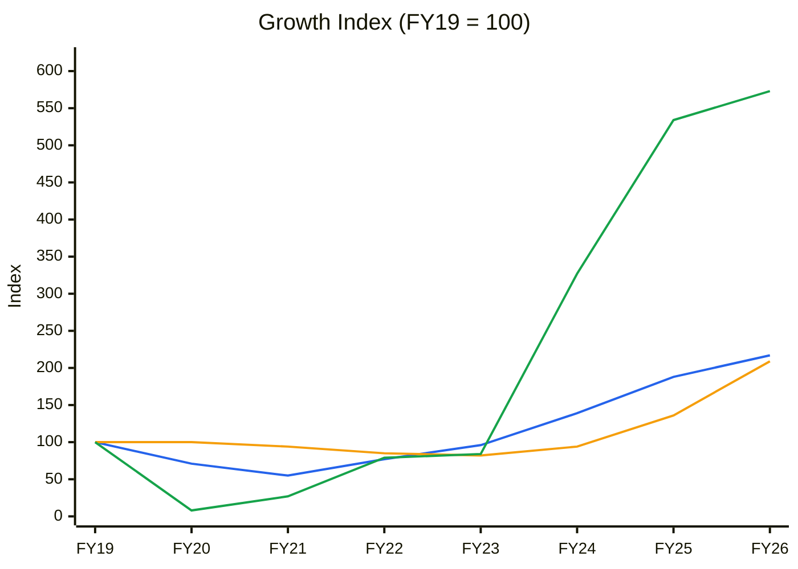
🟦 Revenue (7-yr CAGR 11.7%) · 🟧 Net fixed assets* (11.1%) · 🟩 EBITDA (28.3%). 🟪 PAT is omitted because FY20–23 losses make the index meaningless (FY19 ₹18 Cr → FY26 ₹336 Cr).
*Screener net block (consolidated); the tangible gross-block PPE note was not re-extracted.
**Read:** Revenue fell 45% from FY19 to FY21 and EBITDA almost vanished (index 8). The FY24–26 recovery lifted EBITDA 5.7× vs revenue 2.2×. Fixed assets doubled in FY25–26 alone (index 94 → 209) as the new plant came in ahead of revenue.

**Business inference:** This is a high-operating-leverage cyclical. Small revenue swings move profit by multiples in both directions, so FY26 earnings sit near the top of the cycle rather than at a normalised level. The FY25–26 capex wave means the next two years' returns depend on filling the new plant with orders; until revenue catches up with the asset base, ROCE drifts down (→ Module 11 base case).

**Order book:** ₹4,848 Cr (2.2× TTM revenue) · firm (no framework value disclosed) 2.2× · book-to-bill (TTM, implied) 1.20 · tracked today ₹4,848 Cr (no Reg 30 order filings since; the company does not announce individual orders).

---

## BUSINESS PRIMER

Jyoti CNC Automation makes computer-numerically-controlled (CNC) machine tools, the "mother machines" that cut, turn, mill and shape metal into precision parts: CNC lathes and turning centres, 3-axis and simultaneous 5-axis machining centres, and special-purpose and gear machines. It sells them B2B to manufacturers in aerospace and defence (37% of Q1FY27 revenue), auto and auto components (35%), general engineering (17%), electronics manufacturing (6%), dies and moulds, and medical. Revenue is volume × realisation. It executed 5,550 machines in FY26 at ~₹35.6 lakh each (standalone), and 1,406 in Q1FY27 at ₹34.56 lakh, with 96% entry-level units (Q1FY27 call). Manufacturing is at Rajkot, Gujarat, with a captive foundry and a new 10,000-machine/year plant due on stream around Sep-Oct 2026 (Q1FY27 call), plus land at Tumakuru, Karnataka. The French subsidiary **Huron Graffenstaden** provides high-end European technology and exports (~₹150 Cr revenue in FY26; FY27 guidance ₹300–325 Cr). Two things matter most: a live customer capex cycle, since its orders are its customers' capital spending, and access to imported controllers (Fanuc/Siemens), which the newly approved ₹1,020.65 Cr ECMS programme aims to replace with in-house electronics over five years (BSE, 17-Aug-2026).

This is a **cyclical, working-capital-heavy capital-goods manufacturer**, not a capital-light compounder. Its earnings are a geared bet on India's manufacturing-investment cycle, as the FY20–22 losses showed. The key value drivers are order inflow and capacity utilisation (volume), with realisation and mix as the margin lever. The key risks are a capex-cycle turn, a ~360-day cash-conversion cycle (Screener FY26) that consumes cash during growth, controller dependence, and **export-control exposure at Huron**, where French authorities are investigating dual-use machinery exports. The structural features that colour the analysis: the company listed only in January 2024 (₹1,000 Cr IPO, ₹475 Cr used to repay debt), so its public track record is short; the profit boom of FY24–26 follows a near-death downcycle; and the market now values it at ~71× trailing earnings, so the analysis turns on valuation discipline more than on business quality.

**Segment check:** Machine Tools / CNC Capital Equipment. **KPI block added today** with user approval ✓ (`05-industry-kpis-india.md`, final block). Order-driven → **Order Book Tracker run** (Module 6).

---

## MODULE 1 — Broad Market Cycle (Marks)
| Indicator | Reading (9-Oct-2026) | Source |
|---|---|---|
| Nifty 50 | 22,520. −12.4% YoY, −14.6% from the 52-wk high (26,373), near the 52-wk low (22,180) | Yahoo Finance weekly |
| Nifty vs 30-wk MA | Below a **declining** 30-wk MA (23,709; 24,190 ten weeks ago) | Computed |
| India VIX | ~15, up sharply over the past month (from ~11) | Yahoo Finance |
| Small/mid-cap breadth | Retail participation still high (Jyoti shareholder count 73k → 90k in 2 quarters) | Screener |

**Assessment: Cautious → Fearful.** The index is in a weekly downtrend near its 52-wk low, but retail froth in individual mid-cap themes persists. **Sizing:** defensive/small until Nifty reclaims its 30-wk MA.

---

## MODULE 1b — Sector Cycle: Tailwinds & Headwinds

**Secular vs cyclical decomposition:** Jyoti's revenue went from ₹532 Cr (FY21) to ₹2,191 Cr (TTM), a ~4× rebound.
- **Secular (~10–14% baseline):** defence indigenisation (positive-indigenisation lists, aerospace offsets), China+1 tool-room reshoring, PLI/ECMS electronics capacity, and rising 5-axis penetration from a low base in an import-heavy market. A&D is a steady 37–41% of orders.
- **Cyclical (~10–15pp of recent growth):** the FY24–26 private and PSU capex upcycle and post-COVID restocking. EMS customers are "waiting for clearances" under the electronics component scheme (Q1FY27 call), which shows how much of the demand is policy-timed.
- **Conclusion:** anchor DCF mid-period growth at ~12%. FY27 guidance of 25–30% is mostly capacity catch-up on an existing backlog, not a new secular rate.

**Other inputs:**
- **Input cost:** steel and castings are stable. Controllers are the bottleneck (~12-month lead); the ECMS programme is a 2–5-year fix, not a near-term one.
- **Inventory cycle:** raw materials were built over ~9 months ahead of the ramp (Q1FY27 call). Inventory days are 453 (FY26 consolidated).
- **Competitive capacity:** Jyoti +10,000 units/yr; global majors (DMG Mori, Mazak, Doosan) localising; Chinese/Taiwanese imports in the mid-range. Simultaneous additions are a mid-range pricing risk.
- **Geopolitics:** **structural.** Huron's dual-use export licences, including end-user certificates for Chinese and Turkish customers, are stuck. Controllers come from Japan and Germany. The US tariff overhang remains.
- **FX:** Huron and exports are partly offset by imported controllers. Q1FY27 had ~₹10 Cr of unrealised forex loss, so FX is now visible in quarterly P&L.

**Sector verdict: TAILWIND (structural in A&D/import substitution), overlaid on a mid-to-late cyclical upcycle.** Downstream: no permanent capitalisation of 25–30% growth; widen MoS by 5pp for the Huron geopolitical risk.
*CY5/CY6 (industry capacity vs demand; spread cycle): no sourced 7–10-yr industry series exists (India machine-tool consumption data from IMTMA was not retrieved), so these charts are omitted rather than invented.*

---

## MODULE 1c — Stock Cycle: Company-Specific Positioning

### Quarterly growth trajectory (consolidated, Screener)
| Quarter | Revenue ₹Cr | YoY | EBITDA ₹Cr | YoY | OPM |
|---|---|---|---|---|---|
| Q2FY25 | 431 | +43% | 107 | +95% | 24.8% |
| Q3FY25 | 450 | +19% | 113 | +18% | 25.1% |
| Q4FY25 | 576 | +28% | 178 | +33% | 30.9% |
| Q1FY26 | 410 | +13% | 100 | +18% | 24.4% |
| Q2FY26 | 508 | +18% | 125 | +17% | 24.6% |
| Q3FY26 | 576 | +28% | 155 | +37% | 26.9% |
| Q4FY26 | 599 | +4% | 147 | −17% | 24.5% |
| Q1FY27 | 508 | +24% | 109 | +9% | 21.5% |

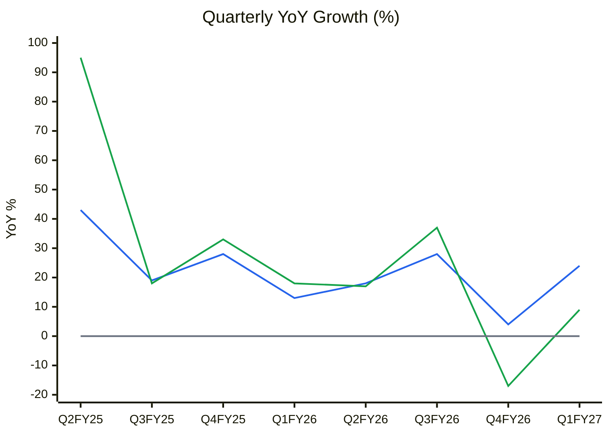
🟦 Revenue YoY % · 🟩 EBITDA YoY % · ⬜ zero line (lines, not bars, because EBITDA growth turns negative)
**Read:** Revenue growth has stayed in a 13–28% band with no clear acceleration. EBITDA growth fell from +37% (Q3FY26) to −17% and +9% in the last two quarters, as OPM dropped from 26.9% to 21.5%.

**Business inference:** Margins are compressing even as volumes rise. Entry-level-heavy mix, Huron's deferred recognition and forex losses, and fixed costs absorbed ahead of the new plant are diluting profitability. The market has priced an earnings-upgrade cycle that has not started. The H2FY27 "robust" second half that management promises is the test.

### Volume / price / mix
| Driver | Evidence | Durability |
|---|---|---|
| Volume | 4,072 (FY25) → 5,550 (FY26) machines; Q1FY27 1,406 (+26%); utilisation 86% | Capacity-bound until the new plant ramps |
| Price | Realisation ₹35.6 lakh (FY26) → ₹34.56 lakh (Q1FY27), flat | Not a lever |
| Mix | Q1FY27: entry 1,349 / mid 33 / high-end 24 units (vs 994/104/19). Mid-range units collapsed | **Mix moving down, not up**; A&D share of revenue steady at 37% |

The FY24–26 CAGR was volume-led at the entry level. The "mix-up" story in the previous report is not visible in the latest unit data.

### Physical capacity model
| Year | Capacity (machines/yr) | Volume (machines) | Utilisation | Source |
|---|---|---|---|---|
| FY25 | 6,000 | 4,072 | ~68% | Company / Screener |
| FY26 | 6,000 | 5,550 | ~93% (>100% in peak months) | Company |
| FY27E | 16,000 (new plant from ~Q3FY27) | 7,000 (base; mgmt guides >8,000 produced) | ~70% of average available | Model |
| FY28E | 16,000 | 9,500 | 59% | Model |
| FY29E | 16,000 | 11,500 | 72% | Model |

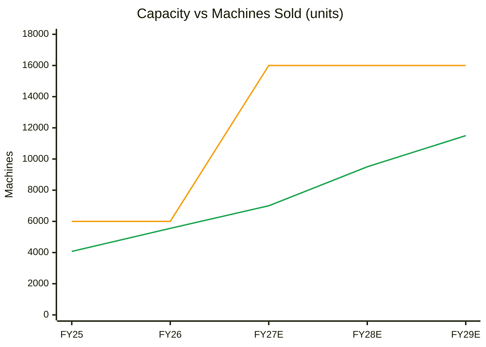
🟧 Installed capacity · 🟩 Machines executed (FY27E–FY29E = base-case estimates)
**Read:** Capacity jumps 2.7× in FY27 while base-case volume rises only 1.26×. Utilisation falls from ~93% to ~60% in FY28 before recovering toward ~72% by FY29.

**Business inference:** For two years the binding constraint shifts from plant capacity to order intake. Fixed costs of the new plant (depreciation, people, the interest that is being expensed) will hit margins before volumes arrive. That is a margin headwind the ~25% EBITDA guidance does not fully reflect. The capacity ceiling (~85% of 16,000 = ~13,600 units) sits at ~FY30, so the PIE-implied 45–55% CAGR cannot be met from this plant.

### Operating leverage & guidance accuracy
- **DOL high** (fixed foundry, long builds; FY20–22 losses on a 45% revenue fall). **DFL rising:** FY26 EBIT 537 / (537 − 70) = 1.15×; Q1FY27 97 / (97 − 24) = 1.33×. Interest of ₹24 Cr/quarter is now expensed, not capitalised (management: "capacity partly in use").
- **ICR:** 7.7× (FY26) → **4.0× (Q1FY27)**. It stays above the 2.5× flag in forecasts, but the trend is falling.
- **Guidance accuracy:** see Module 3 WTT (0.61, MODERATE → 15% haircut to growth guidance).

**FCF inflection year:** FY29E in the base case. Management's "OCF ≈ 50% of EBITDA in FY27" would bring it forward to FY27 if delivered.
**Stock cycle classification: EARLY-CYCLE on the business** (capex-heavy ramp, utilisation about to drop), **LATE-CYCLE on margins and returns** (CY7: OPM +1.3SD and ROCE +1.0SD above their 8-yr averages), **expensive on the share price.** MoS adjustment: +5–10pp (late-cycle margins).

---

## MODULE 2 — Industry Structure & Capital Cycle

### 2A. Porter Five Forces
| Force | Assessment | Signal |
|---|---|---|
| New entrants | High barriers in 5-axis/aerospace (precision engineering, controller integration, multi-year customer qualification, foundry, service network); modest in commodity CNC | Mixed: high in high-end |
| Supplier power | **High** for controllers (Fanuc/Siemens); ECMS backward integration is the 2–5-yr answer | Structural risk, improving |
| Buyer power | Diversified (A&D 38% / GE 20% / auto 19% / EMS 13% / dies 4% of order book); PSUs lengthen payment cycles | Moderate |
| Substitutes | Additive manufacturing at the margin | Low |
| Rivalry | Global majors localising; Chinese/Taiwanese mid-range imports | Moderate-high |

**Industry verdict: NEUTRAL-to-moderately attractive.** It is attractive where Jyoti is strongest (5-axis, A&D) and tough where its volume is now growing (entry-level).

### 2B. Capital cycle
- Industry capex is far above depreciation. Jyoti's capex/depreciation was 6× in FY26 (₹302 Cr CFI vs ₹50 Cr depreciation), and it plans another ₹1,021 Cr over 5 years under ECMS.
- A precision-manufacturing IPO cluster (Jyoti 2024, Azad, Unimech) and peer P/Es of 31–136× show capital flooding into the theme.
- ROCE (21%) is well above Jyoti's 8-yr average (12%).
**Capital-cycle read: mid-to-late.** Entry-price discipline matters more than the growth story. *(CY8 not built: peer 10-yr capex series not retrieved.)*

---

## MODULE 3 — Business Quality & Moat (incl. Management & Capital Allocation)

### 3A. Greenwald's three barriers
1. **Supply/cost — partial, improving.** Captive foundry, Rajkot cluster economics and domestic scale. Proprietary controllers (HMI ready; commercialisation in ~2 years, Q1FY27 call) would be a genuine cost and IP edge if delivered.
2. **Customer captivity — moderate.** A&D qualification and switching costs, plus repeat marquee orders. Diluted by the entry-level volume push.
3. **Local scale — yes.** #1 listed Indian pure-play, ~10% of India 5-axis.
**Moat verdict: NARROW-to-MODERATE** (validated ✅). The moat is real in A&D and capped by controller dependence and cyclicality.
**Buffett 10% price test:** *Partial.* Realisation is flat while volumes grow, which suggests no headroom to raise prices in the entry segment.

### 3B. Fisher 15-point
Market potential 3 · New products 3 (NX double-column for rail and heavy engineering, where India imported 300+ such machines at ₹3–5 Cr each; in-house controllers) · R&D 2 · Sales 2 · Margin 3 · Margin focus 2 (down from 3: Q1 compression) · Labour 2 · Exec relations 2 · Depth 2 (founder-led; Huron DG restricted) · Cost/accounting controls 1 (down from 2: an analyst on the Q1 call publicly suggested changing the auditor, and Huron changed its revenue-recognition basis mid-stream) · Industry advantage 2 · Long-range 3 · Dilution 2 · Candor 2 · **Integrity 2 (PASS: no SEBI or enforcement action against the Indian promoters found; the Huron investigation concerns the subsidiary and its employees, refuted by the company)** → **33 / 45** (was 35).

### 3C. Promoter & capital allocation
| Check | Reading |
|---|---|
| Promoter holding | 62.55%, flat for 11 quarters ✅ |
| Pledge | Founder P. Jadeja (26.9%) and Jyoti International LLP (16.2%) unpledged. Co-promoter **A.B. Virani: ~6.7% of total capital encumbered** (≈46% of his 14.45% stake; ≈10.7% of the promoter group), down from ~13.1% (Jun-26). There is frequent pledge churn across five NBFCs/banks for "business loans". **Classification: Normal at group level (< 20%), elevated at the individual level; watch** |
| Institutional flow | FIIs 9.91% (Sep-25) → **5.26%** (Sep-26); DIIs 12.9% → 12.9%; public 14.6% → 19.3%; holders 72k → 90k. **Institutions exited into the rally; retail is absorbing supply** |
| Share count | Flat (22.74 Cr) since the IPO ✅ |
| FCF/share vs EPS | FY24–26 cumulative FCF −₹847 Cr vs EPS rising from ₹6.6 to ₹14.8. **Divergence flag** (explained by growth capex plus working capital, not dilution) |
| RPT / ICD | None material found ✅ (not re-checked in the FY26 AR) |
| Capital allocation | **Good-to-average.** IPO deleveraging was textbook. Now re-levering (borrowings ₹304 → ₹853 Cr), plus ₹1,021 Cr ECMS capex over 5 yrs (25% incentive) and Huron capacity doubling (Nov-25) |
| Dividend | Nil |

**Three C's:** Candor **Moderate** (disclosed the Huron investigation promptly under Reg 30 ✓, but the "deferred revenue will be recognised later" narrative has slipped two quarters running) · Competence **Strong** in engineering, unproven through a downcycle as a listed company · Caring **Moderate** (founder unpledged; no payout).

### 3D. Walk the Talk Scorecard (carried forward + new)
| Quarter guided | Statement | Guided | Actual | Verdict |
|---|---|---|---|---|
| FY25 calls | EBITDA margin ~25%+ | ≥25% | FY25 27% consolidated | ✅ |
| FY25 calls | Capacity 6,000 by end-FY25 | 6,000 | Achieved | ✅ |
| FY25/H1FY26 | 16,000 capacity | ~Oct-26 | End-Sep-26 per Q1FY27 call; not yet confirmed | ⚠️ (pending) |
| FY26 calls | FY26 growth acceleration | 25%+ | Consolidated revenue +15%, PAT +6% | ❌ |
| FY26 calls | Order book growth | Grow | ₹4,546 Cr → ₹4,732 Cr → ₹4,848 Cr | ✅ |
| Q4FY26 call | Q4 order inflow > ₹700 Cr | >700 | Implied ₹746 Cr | ✅ |
| Q4FY26 call | Huron's ₹67 Cr deferred revenue "recognised in later quarters" | Recover | Q1FY27: a further ₹35 Cr deferred; recognition basis changed | ❌ (post-event reframing) |
| Q4FY26 call | EBITDA margin ~25% | ~25% | Q1FY27 21.5% reported / 23.4% adjusted | ❌ |
| Q4FY26 call | Net debt flat | ~flat | ~₹700 Cr | ✅ |
| Q3/Q4FY26, Q1FY27 calls | FY27 revenue +25–30% | 25–30% | Q1 +24% | ⏳ pending (H2-loaded) |

**WTT score:** (5 hits + 0.5 near-miss) / 9 assessed = **0.61 → MODERATE (borderline LOW)** (was 0.70).
**Key pattern:** Capacity and order-book milestones are delivered. **Margin and Huron guidance are not**, and the Huron revenue-recognition change is a post-event reframing (adds 1 O'Glove flag).
**Insider action:** No promoter open-market buying (Form C not re-checked). Co-promoter pledge churn; FII selling → **NEUTRAL-to-BEARISH**.
**DCF impact:** 15% haircut to FY27 growth guidance (base +22% vs 25–30% guided).
**Management credibility: MODERATE.**

---

## MODULE 4 — Financial Forensics

### Indian-specific red flags
- **Pledge:** co-promoter churn (see 3C). Elevated at the individual level, not a hard stop.
- **Huron (material subsidiary):** French judicial investigation into dual-use export controls; DG restricted; ~€4m of accounts and 2 properties seized (12-Apr-26); revenue recognition switched to dispatch basis; FY26 consolidated − standalone PAT = **−₹55 Cr**; Q1FY27 = **−₹31 Cr** (incl. ~₹10 Cr forex). 🔴 Significant.
- **Audit:** an analyst asked on the Q1FY27 call for an auditor change; management "will take into consideration". No resignation or qualification found. ⚠️ (FY26 auditor report not parsed.)
- **Litigation:** GST demand of ₹4.46 Cr set aside on appeal (29-May-26) ✓.
- **Revenue quality:** debtor days 68 → 98 → 104 (FY24–26), rising. Watch.
- **RPT/ICD:** none material found.

### Quantitative models (consolidated, Screener)
| Model | FY26 | Interpretation |
|---|---|---|
| Beneish M (proxy) | **−1.91** | Grey zone (−2.22 to −1.78); driven by TATA 0.078 (PAT ₹336 Cr vs CFO ₹54 Cr) and SGI 1.15 |
| Altman Z'' | 7.7 (FY24 8.5, FY25 8.2) | Safe, gently declining |
| Piotroski F | **3–4 / 9** | Weak-average: fails ΔROA, CFO>NI, leverage, gross margin, asset turnover |
| Sloan accrual | +18.2% (FY25 +30.2%, FY24 +20.0%) | **Warning** for 3 consecutive years |
| Cumulative CFO / PAT | FY24–26: −₹99 Cr / ₹803 Cr = **−0.12**; FY19–26: 0.28 | 🔴 |

**Schilit screen:** DSO rising (watch) · cash collections/revenue < 0.9 (flag) · other income/EBIT 11% (OK) · capex/depreciation 6× (explained growth capex) · Huron recognition change (EMS #1/#2 watch: recognition basis changed after a miss).
**Forensic red-flag count: 5 / 15** (NI vs OCF, Sloan ×3 years, Beneish grey, DSO rising, Huron recognition change) → **≥ 3: deep investigation required.** These are mostly explained by the long-cycle working-capital model; the Huron accounting change is not.
**Overall forensic verdict: SIGNIFICANT CONCERNS** (no manipulation evidence; cash conversion and Huron opacity are material). This was "minor-to-moderate" before.

---

## MODULE 5 — Earnings Quality & Financial Statements

| FY | Sales | EBITDA | OPM % | PAT % | PBT | PAT | EPS ₹ | ROCE % | CFO | Net block |
|---|---|---|---|---|---|---|---|---|---|---|
| FY19 | 965 | 92 | 9.5 | 1.9 | 38 | 18 | 6.27 | 13.5 | 144 | 344 |
| FY20 | 687 | 7 | 1.0 | −7.3 | −58 | −50 | −17.07 | 1.6 | 25 | 344 |
| FY21 | 532 | 25 | 4.7 | −14.5 | −79 | −77 | −26.19 | −0.4 | 28 | 322 |
| FY22 | 746 | 73 | 9.8 | −6.4 | −42 | −48 | −16.38 | 4.8 | 39 | 292 |
| FY23 | 929 | 77 | 8.3 | −0.5 | 7 | −5 | −1.66 | 11.1 | 42 | 283 |
| FY24 | 1,338 | 301 | 22.5 | 11.3 | 185 | 151 | 6.63 | 21.3 | −48 | 322 |
| FY25 | 1,818 | 491 | 27.0 | 17.4 | 418 | 316 | 13.90 | 23.9 | −105 | 469 |
| FY26 | 2,093 | 527 | 25.2 | 16.1 | 467 | 336 | 14.77 | 21.3 | 54 | 720 |
| TTM | 2,191 | 535 | 24.4 | 14.7 | 444 | 322 | 14.14 | — | — | — |
*(₹Cr, consolidated, Screener 9-Oct-2026; ROCE = (PBT + interest) / average (equity + borrowings), computed)*

**ROIC/ROCE:** FY26 21.3% vs **WACC 13.5%** → +7.8pp. It has been above WACC only since FY24; the 8-yr average is 12.1% (below WACC). **Economic profit:** positive now, negative across the cycle.

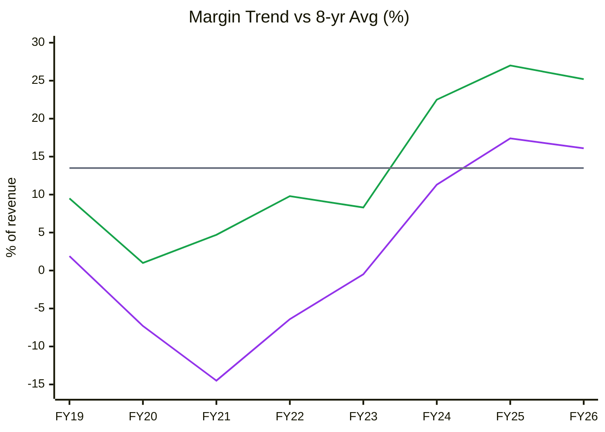
🟩 EBITDA margin · 🟪 PAT margin · ⬜ 8-yr average EBITDA margin 13.5% (SD 9.3; +1SD = 22.8%)
**Read:** FY26 EBITDA margin of 25.2% is **+1.3SD above its 8-yr average** (88th percentile). FY25's 27% was the series high, and Q1FY27 has slipped to 21.5%.

**Business inference:** Current margins come from a full plant, strong A&D demand and post-IPO cost absorption. They are a cycle-high outcome, not a structural floor. Valuing the company on 25% margins in perpetuity (as the market does) ignores that the same business earned 1–10% for five years. Normalised mid-cycle margins are nearer 18–20% (→ bear/base split in Module 11).

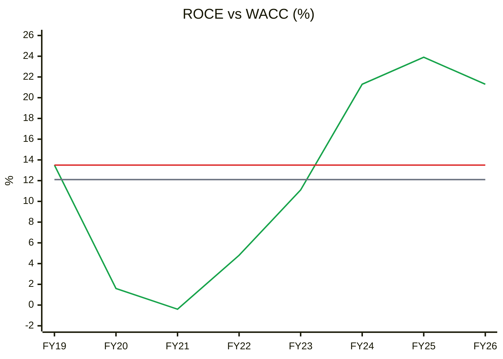
🟩 ROCE (pre-tax) · 🟥 WACC 13.5% · ⬜ 8-yr average 12.1% (SD 8.9)
**Read:** ROCE was below WACC in 5 of 8 years (FY20–23 and break-even FY19). Since FY24 it has been 21–24%. FY26 sits +1.0SD above its own average (~85th percentile) and is already off the FY25 peak.

**Business inference:** The spread over WACC exists only in the current upcycle. The moat has not yet been tested through a downturn as a listed company. With the asset base doubling ahead of demand, the next two years will show whether 20%+ ROCE is structural (A&D-led) or cyclical (full-plant-led). Pay for the through-cycle average, not the peak.

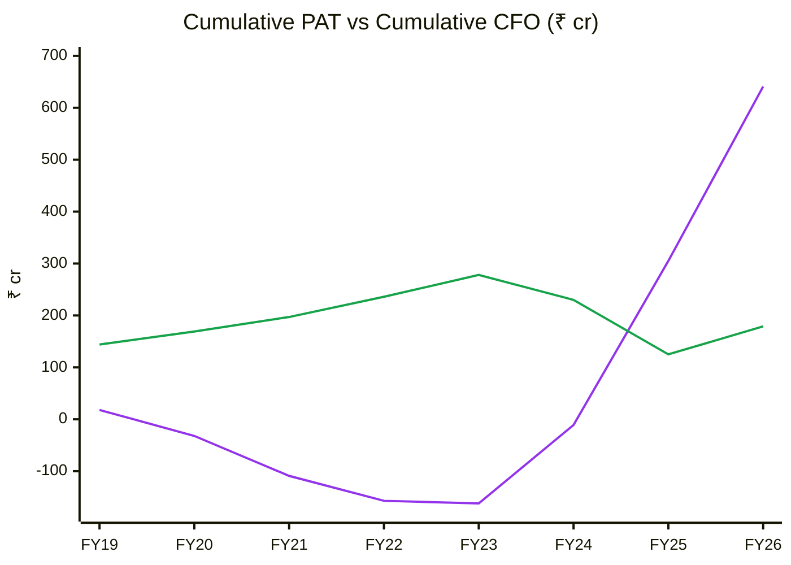
🟪 Cumulative PAT · 🟩 Cumulative CFO
**Read:** Since FY24, cumulative PAT has risen by ₹803 Cr while cumulative CFO *fell* by ₹99 Cr. The FY19–26 CFO/PAT ratio is 0.28 and the FY24–26 ratio is −0.12 (red flag < 0.7).

**Business inference:** Every rupee of boom-era profit, and more, has been reinvested in inventory (raw material stocked for 9 months ahead of the ramp) and receivables from A&D/PSU customers. The business cannot fund its own growth, which is why borrowings have returned (₹304 → ₹853 Cr). This deserves a below-peer multiple until CFO turns, and the FY27 "OCF ≈ 50% of EBITDA" promise is the most important number to track.

| Year | Debtor days | Inventory days | Payable days | CCC |
|---|---|---|---|---|
| FY19 | 66 | 393 | 168 | 291 |
| FY20 | 105 | 587 | 255 | 437 |
| FY21 | 149 | 888 | 406 | 631 |
| FY22 | 98 | 551 | 257 | 392 |
| FY23 | 57 | 543 | 273 | 327 |
| FY24 | 68 | 469 | 201 | 336 |
| FY25 | 98 | 378 | 172 | 304 |
| FY26 | 104 | 453 | 198 | 359 |

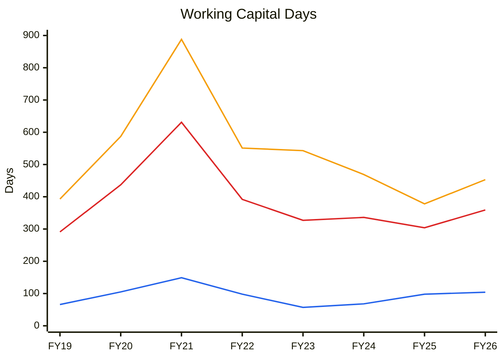
🟦 Debtor days · 🟧 Inventory days · 🟥 Cash conversion cycle
**Read:** The CCC improved from 631 days (FY21 trough) to 304 (FY25), then rose again to 359 in FY26 as inventory jumped by 75 days and debtors extended to 104 days.

**Business inference:** The FY25 improvement was a by-product of strong demand (fast turns), not a structural fix. The FY26 reversal shows working capital expands again the moment growth or a capacity ramp needs stocking. Until the new plant runs at volume, assume a ~350-day cycle in the forward model (Module 11 ΔWC = ~55% of incremental revenue).

### DuPont (5-factor, consolidated, average balances)
| Year | EBIT margin | Asset turnover | Equity multiplier | Interest burden | Tax burden | ROE |
|---|---|---|---|---|---|---|
| FY22 | 5.4% | 0.56 | 18.1× | n.m. | n.m. | −65% |
| FY23 | 10.4% | 0.66 | 22.8× | 0.07 | n.m. | −8% |
| FY24 | 20.6% | 0.72 | 2.55× | 0.67 | 0.82 | 20.9% |
| FY25 | 25.3% | 0.73 | 1.63× | 0.91 | 0.76 | 20.7% |
| FY26 | 25.7% | **0.65** | **1.74×** | 0.87 | 0.72 | 18.2% |

**Operating contribution** (EBIT margin × AT): 14.8% (FY24) → 18.5% (FY25) → 16.7% (FY26), **turning down**. **Financing contribution:** the equity multiplier is rising again (1.63 → 1.74×) and the interest burden is worsening.
**DuPont verdict:** FY26's ROE dip is operational (AT falling as capex and inventory run ahead of revenue), partly cushioned by re-levering. This is not yet the "leverage masking decline" hard-stop pattern, but it is the direction to watch in FY27. **AT for Module 11:** ~0.62–0.65 base (not the 0.73 peak).
**O'Glove flags: 5 / 15** (NI vs OCF, DSO, Sloan, Beneish grey, post-event reframing). **Ind AS 116:** immaterial. **Other income** ₹60 Cr (11% of EBIT, FY26) includes forex and treasury gains, down to ₹4 Cr in Q1FY27.

---

## MODULE 6 — Industry KPIs & Peer Analysis

### KPI scorecard (new Machine Tools / CNC block)
| KPI | Jyoti | Healthy | Assessment |
|---|---|---|---|
| Order book cover | 2.2× (₹4,848 Cr / TTM ₹2,191 Cr) | 1.5–2.5× | In range, but falling (2.6× in FY24) |
| Book-to-bill (TTM, implied) | 1.20 | > 1.1 | ✅ |
| Order inflow growth | Q1FY27 ₹601 Cr (company) vs Q1FY26 implied ₹476 Cr → +26–31% | > 15% | ✅ |
| Realisation / machine | ₹34.56 lakh (Q1FY27) vs ₹34.41 lakh | Rising | ✗ flat; mix moving to entry-level |
| EBITDA margin | 21.5% (Q1) / 25.2% (FY26) | 20–28%; not > +1SD | ⚠️ FY26 +1.3SD (peak); Q1 falling |
| Capacity utilisation | 86% (Q1FY27) → ~60% after the new plant | 75–95% | Will fall below 60% in FY28 (base) ⚠️ |
| Cash conversion cycle | 359 days | < 250 days | ✗ red flag (> 350) |
| Net debt/EBITDA; ICR | 1.3×; 7.7× (FY26) → 4.0× (Q1) | < 1.5×; > 5× | ⚠️ ICR below 5× in Q1 |
| A&D + export mix | A&D 38% of the order book | Rising | Stable; Huron export-control exposure 🔴 |

### Peer comparison (Screener, 9-Oct-2026; FY26 figures)
| Metric | Jyoti CNC | Kennametal India | Elecon Engineering | Azad Engineering |
|---|---|---|---|---|
| Business | CNC machine tools | Cutting tools / consumables | Gears / industrial transmission | Aerospace components |
| Revenue 3-yr CAGR | 31% | 12% | 16% | 34% |
| EBITDA margin (latest FY) | 25% | 20% (Jun-26 FY) | 22% | 37% |
| ROCE | 21.3% | 33.2% | 20.9% | 11.9% |
| P/E (TTM) | **70.7×** | 46.7× | 30.8× | 136× |
| P/B | 11.4× | 10.7× | 4.0× | 12.3× |

**Peer positioning:** Jyoti's P/E is ~1.5× Kennametal's (which has higher ROCE and positive FCF) and 2.3× Elecon's (similar ROCE). It trades below only Azad, a scarce aerospace pure play with lower returns. **Premium not justified** by returns or cash conversion; it is justified only by growth expectations (see PIE). *(C12 chart omitted for budget; the table carries the comparison.)*

### Order Book Tracker *(order-driven company — references/13-order-book-tracking.md)*
*Harvest (9-Oct-2026): BSE corporate announcements for scrip 544081, Jan-2024 to Oct-2026 (232 filings). **No "Award of Order / Receipt of Order" filings.** Jyoti discloses its order book only in results, presentations and concalls, so the ledger is empty and the tracker runs on disclosed snapshots (implied inflow = ΔOB + revenue). Two snapshots are reconstructed from chart values (FY24, Q1FY25) and one is from an aggregator (Q1FY26). They are flagged in the source column.*

## Order Book Tracker — JYOTICNC
*Generated 2026-10-09 by scripts/order_book_tracker.py from 0 order announcements (0 follow-ups excluded) and 10 period snapshots. No order ledger exists (no Reg 30 order filings), so announced inflow shows '—' (not applicable).*

### 1. Disclosed vs tracked order book (reconciliation)

| Period | Revenue (₹ Cr) | Order book (₹ Cr) | Announced inflow | of which Framework | Implied inflow | Announced coverage | OB cover (× TTM rev) | Source |
|---|---|---|---|---|---|---|---|---|
| FY24 | 1,338 | 3,438 | — | — | — | — | 2.6 | Q1FY25 investor deck (opening OB at 31-Mar-24; reconstructed from chart values) |
| Q1FY25 | 362 | 3,404 | — | — | 328 | — | 2.3 | Q1FY25 investor deck (OB at 30-Jun-24; reconstructed) |
| Q2FY25 | 431 | 4,289 | — | — | 1,316 | — | 2.6 | Q2FY25 investor deck (INR 42893 mn) |
| Q3FY25 | 450 | 4,360 | — | — | 521 | — | 2.6 | Q4FY25 deck (opening OB 31-Dec-24; approx.) |
| Q4FY25 | 576 | 4,346 | — | — | 562 | — | 2.4 | Q4FY25 investor presentation |
| Q1FY26 | 410 | 4,412 | — | — | 476 | — | 2.4 | Aggregator summary of Q1FY26 results (unverified vs filing) |
| Q2FY26 | 508 | 4,546 | — | — | 642 | — | 2.3 | Q2FY26 concall |
| Q3FY26 | 576 | 4,585 | — | — | 615 | — | 2.2 | Q3FY26 presentation (INR 45.85 bn - Machinist) |
| Q4FY26 | 599 | 4,732 | — | — | 746 | — | 2.3 | Q4FY26 results / Sahi |
| Q1FY27 | 508 | 4,848 | — | — | 624 | — | 2.2 | Q1FY27 investor presentation (inflow 601 - executed 485) |

*Implied inflow = OB(t) − OB(t−1) + order-linked revenue(t). Consolidated revenue is used as order-linked revenue (share 1.0). Company-disclosed Q1FY27 inflow (₹601 Cr) and execution (₹485 Cr) reconcile to the implied ₹624 Cr within 4%, as revenue includes spares and services. 9M FY26 implied inflow ₹1,733 Cr vs company-stated ₹1,661 Cr (+4%).*

### 2. Announced orders aggregated by quarter
No Reg 30 order announcements exist, so no quarterly aggregation is possible. Inflow mix comes from the order-book composition in presentations (Jun-26): A&D 38% · general engineering 20% · auto & components 19% · EMS 13% · dies & moulds 4% · others 6%.

### 3. Macro picture

| Metric | Value |
|---|---|
| Latest disclosed order book | ₹4,848 Cr (Q1FY27); management said "close to ₹5,000 Cr" on the call |
| Orders announced since that disclosure | ₹0 Cr (company does not announce individual orders) |
| Tracked order book today | ₹4,848 Cr (before execution since 30-Jun-26) |
| Order book cover (latest) | 2.2 × TTM revenue (2.6× at FY24) |
| Book-to-bill (TTM, implied inflow ₹2,627 Cr / revenue ₹2,191 Cr) | 1.20 |
| Execution rate (revenue ÷ opening OB) | Q1FY27 10.7% vs Q1FY26 9.4%, rising |
| Framework / 'potential value' share | None disclosed |
| Concentration | Not disclosed (machine orders are many and small; A&D is the largest segment) |

### 4. Charts

**OB-1 — Order book vs revenue (TTM), index = 100 at FY24**

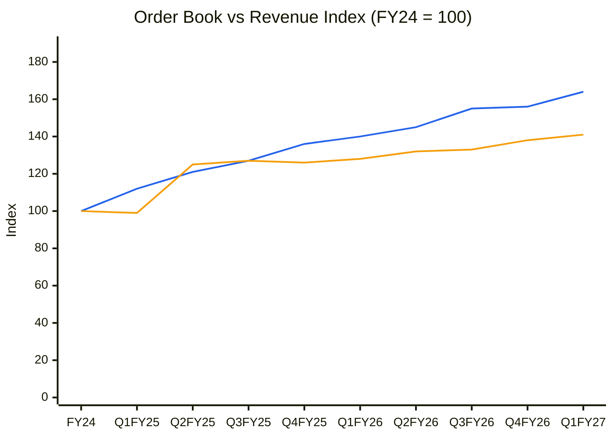
🟦 Revenue (TTM) · 🟧 Order book (disclosed points only; the x-axis mixes the FY24 year-end with quarter-ends)
**Read:** Since FY24, TTM revenue is up 64% (index 164) while the order book is up only 41% (index 141). After the jumbo Q2FY25 intake, the book has grown ~3% a year.

**Business inference:** Jyoti is consuming its backlog faster than it refills it. Execution, not demand, has been the bottleneck so far, but that is about to flip. With capacity going to 16,000 machines, order intake has to rise by roughly 30%+ a year to keep the plant busy and support FY28's >30% growth guidance. Without that, the new capacity fills slowly and margins suffer from under-absorption.

**OB-2 — Order book cover (years of TTM revenue)**

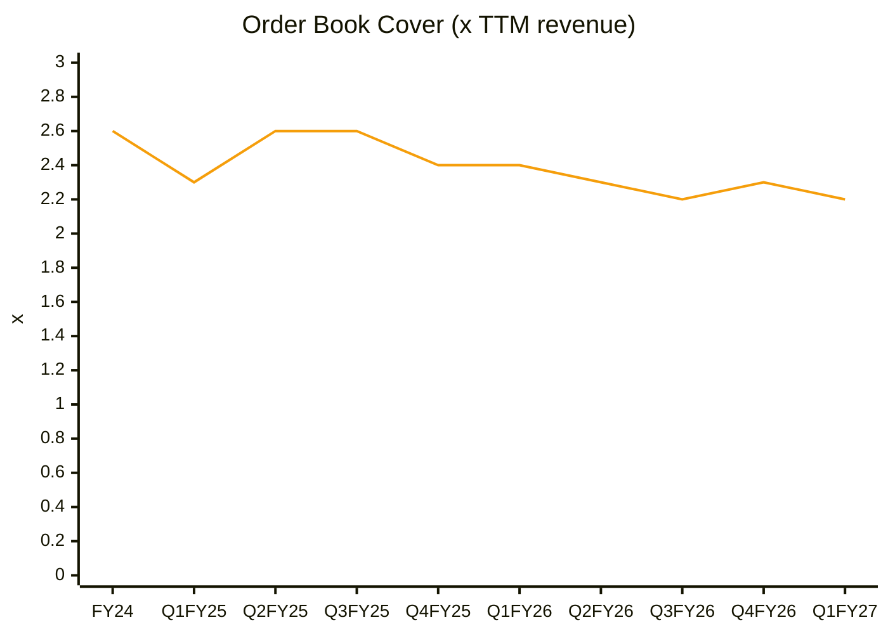
🟧 Order book / TTM revenue
**Read:** Cover has drifted from 2.6× to 2.2× over nine quarters, still within the 1.5–2.5× healthy band.

**Business inference:** Revenue visibility is comfortable for FY27 (~2 years of backlog at today's run-rate), but it shrinks fast once the new plant lifts execution. At FY28's guided revenue (~₹3,400 Cr+) the same book would cover only ~1.4×. The investment case therefore rests on future order wins, not on the backlog already in hand.

**OB-4 — Implied order inflow (from disclosed order book) vs revenue (₹ Cr)**

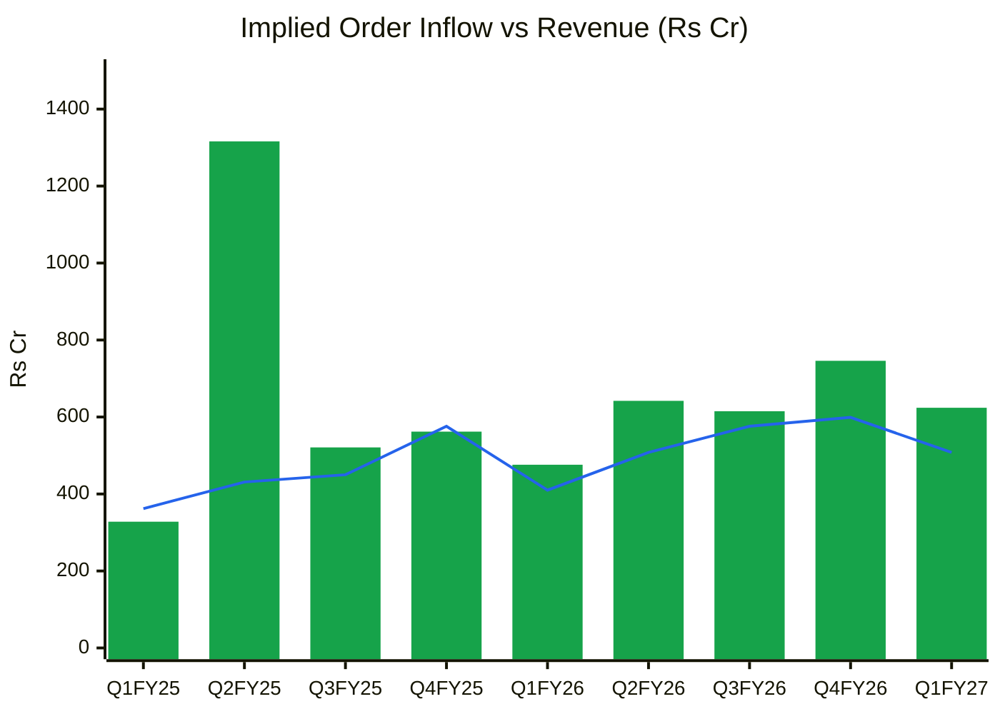
🟩 Implied inflow = ΔOB + order-linked revenue · 🟦 Revenue
**Read:** Apart from the one-off ₹1,316 Cr Q2FY25 quarter, implied inflow has run at ₹475–750 Cr a quarter, rising gently (+31% YoY in Q1FY27). Quarterly book-to-bill sits at 1.0–1.3.

**Business inference:** Order momentum is healthy but not accelerating enough for a 2.7× capacity step-up. Steady ~1.2× book-to-bill supports ~20% growth, consistent with the base case here, not the 30%+ implied by FY28 guidance or the 45%+ implied by the share price. Watch for a sustained ₹900 Cr+/quarter intake in H2FY27 as the key upgrade trigger.

#### 5. Order Ledger — every announced order (source of truth; the next run appends here)

| order_id | date | customer | customer_type | segment | geography | value_cr | currency | value_fc | firmness | tenor_months | linked_to | source | notes |
|---|---|---|---|---|---|---|---|---|---|---|---|---|---|

#### 6. Order Book Snapshots — revenue and disclosed order book per period

| period | revenue_cr | revenue_ttm_cr | order_book_cr | order_linked_share | as_of_date | source |
|---|---|---|---|---|---|---|
| FY24 | 1338 | 1338 | 3438 | 1.0 |  | Q1FY25 investor deck (opening OB at 31-Mar-24; reconstructed from chart values) |
| Q1FY25 | 362 | 1492 | 3404 | 1.0 |  | Q1FY25 investor deck (OB at 30-Jun-24; reconstructed) |
| Q2FY25 | 431 | 1621 | 4289 | 1.0 |  | Q2FY25 investor deck (INR 42893 mn) |
| Q3FY25 | 450 | 1693 | 4360 | 1.0 |  | Q4FY25 deck (opening OB 31-Dec-24; approx.) |
| Q4FY25 | 576 | 1819 | 4346 | 1.0 |  | Q4FY25 investor presentation |
| Q1FY26 | 410 | 1867 | 4412 | 1.0 |  | Aggregator summary of Q1FY26 results (unverified vs filing) |
| Q2FY26 | 508 | 1944 | 4546 | 1.0 |  | Q2FY26 concall |
| Q3FY26 | 576 | 2070 | 4585 | 1.0 |  | Q3FY26 presentation (INR 45.85 bn - Machinist) |
| Q4FY26 | 599 | 2093 | 4732 | 1.0 |  | Q4FY26 results / Sahi |
| Q1FY27 | 508 | 2191 | 4848 | 1.0 |  | Q1FY27 investor presentation (inflow 601 - executed 485) |

*Every number above traces to the snapshot rows (source column).*

**Order-book verdict:** Firm visibility ~2.2 years (no framework value) · Book-to-bill (TTM) 1.20 · Framework share 0% · Concentration n/a (many small orders) · Execution rate trend: **Rising**
**Forward link (Module 11):** Revenue FY27 ≈ opening OB ₹4,732 Cr × ~42% annual execution (FY26: ₹2,093 Cr / ₹4,346 Cr = 48%, lifted by the new plant in H2) + in-year inflow ~₹2,900 Cr × ~20% in-year burn → **₹2,500–2,600 Cr**. This supports the base case of ₹2,550 Cr (+22%), below the 25–30% guidance.

---

## MODULE 7 — Market Size & Market Share
- **TAM:** India machine-tool consumption ~₹25,000–30,000 Cr; India is a large net importer, so import substitution plus China+1 is the core driver (✅ validated from the previous report; no fresh IMTMA data retrieved).
- **Penetration:** standalone ₹1,949 Cr (FY26) / ~₹28,000 Cr ≈ **~7%**; ~10% of 5-axis.
- **Share trend:** gaining. Revenue CAGR of 31% (3-yr) is far ahead of a TAM growing ~10–12%. The FY27 volume gains are in the entry segment, where imports and local competitors are most price-aggressive.
- **New TAM:** NX double-column machines (India imported 300+ at ₹3–5 Cr each, so ~₹900–1,500 Cr/yr) and in-house controllers/drives (ECMS).
**Verdict: Taking share in a growing, import-heavy market** (strongest part of the thesis, unchanged).

---

## MODULE 8 — Valuation: PIE First, Then Intrinsic Value

**Inputs:** CMP ₹1,000 · 22.74 Cr shares · market cap ₹22,742 Cr · net debt ~₹700 Cr → **EV ₹23,442 Cr** · TTM revenue ₹2,191 Cr · TTM EBIT ₹482 Cr → NOPAT ₹357 Cr (16.3% of revenue; 26% tax) · WACC 13.5% · terminal growth 6–8%.

### 8A. Price-Implied Expectations (two-stage reverse DCF: 5 years at g, fading to terminal by year 10; reinvestment = Δrevenue ÷ sales-to-capital)
| PIE driver | Market-implied | My base | Gap |
|---|---|---|---|
| Revenue CAGR (5-yr) | **~46%** at sales-to-capital 1.8× (54% at 1.2×; 42% at 2.5×) | ~21% (FY26–29E) fading to ~12% | **−25pp: optimistic gap** |
| NOPAT margin | 16.3% held | ~15–16% (EBITDA 24–25.5%) | ≈ |
| Investment rate | 55% of Δrevenue | ~55–60% (CCC ~350 days + ECMS capex) | Market under-prices reinvestment |

**Physical plausibility:** a 46% 5-yr CAGR means ~₹14,600 Cr of revenue by FY31. At ~₹36 lakh/machine that is ~40,000 machines, **2.5× even the expanded 16,000 capacity**. The capacity-model CAGR is ~21% (FY26 → FY29E ₹3,800 Cr). The market is pricing **(b)+(c): further unannounced capacity plus a step-up in realisation** from controllers, NX double-column and A&D. The ECMS programme is backward integration, not machine capacity, so it does not close this gap.
**Expectations treadmill:** to outperform, Jyoti must (1) fill the new plant to > 70% by FY28, (2) hold ≥ 25% EBITDA through the ramp, (3) cut the CCC toward 250 days so FCF turns positive, *and* (4) announce the next capacity phase. All four are needed; today's evidence supports none of them clearly.
**Positive triggers:** H2FY27 order intake of ₹900 Cr+/quarter; Huron licences cleared and the investigation closed; FY27 OCF ≥ 50% of EBITDA; in-house controller commercialisation.
**Negative triggers:** another quarter of OPM < 23%; Huron charges or penalties; new-plant commissioning slip; a capex-cycle wobble in auto/EMS; FII selling continuing.
**SVAR** (growth at 70% of PIE, margin −25%; sales-to-capital 1.2–1.8): downside value ₹200–300 → **SVAR 70–80%**. Highly unfavourable.

### 8B. Intrinsic value
| Method | Bear | Base | Bull |
|---|---|---|---|
| DCF (NOPAT margin 16%, S/C 1.8×; 20% / 25% / 30% 5-yr growth; terminal 6% / 7% / 8%) | ₹285 | ₹410 | ₹590 |
| Relative (FY28E EPS ₹20.8 × 30 / 40 / 50×; peer P/E 31–47× ex-Azad) | ₹624 | ₹832 | ₹1,040 |
| EPV (NOPAT / WACC − net debt) | ₹126 | ₹126 | ₹126 |
| **Consensus (DCF and relative weighted equally)** | **₹455** | **₹621** | **₹815** |

**CMP ₹1,000 vs base ₹621 → 61% premium. MoS gate FAILS** (mid-cap needs a 30–40% discount, so buy below ~₹375–435 on a strict reading).
**Upside/downside (scenario, Module 11):** (₹1,310 − ₹1,000) / (₹1,000 − ₹320) = **0.46:1 → fails the 1.5:1 hard stop.**
**Graham Number:** √(22.5 × 5-yr average EPS ₹3.45 × BVPS ₹88) = **₹83** (❌ corrected from ₹172).
**Misprice reason:** none. It is momentum-priced (Stage 2 breakout on the ECMS news; FIIs selling to retail).

**Valuation bands (listed Jan-2024: only three March year-ends + current)**
| | Mar-24 | Mar-25 | Mar-26 | Oct-26 |
|---|---|---|---|---|
| Price ₹ | 821 | 1,023 | 774 | 1,000 |
| EPS (consol) ₹ | 6.63 | 13.90 | 14.77 | 14.14 (TTM) |
| P/E | 123.8 | 73.6 | 52.4 | 70.7 |
| BVPS ₹ | 60.0 | 74.1 | 88.0 | 88.0 |
| P/B | 13.7 | 13.8 | 8.8 | 11.4 |
| ROE (year-end equity) | 11.1% | 18.7% | 16.8% | 16.1% (TTM) |

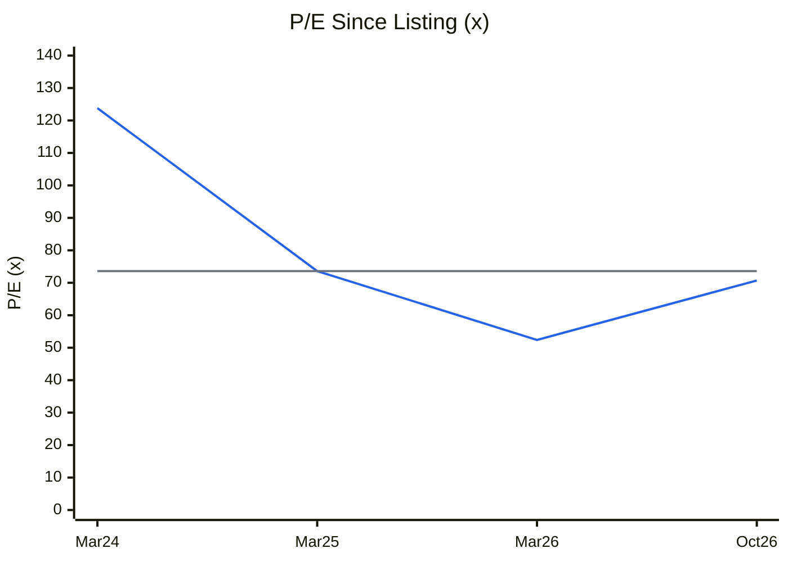
🟦 P/E (consolidated, trailing) · ⬜ Median of March year-ends 73.6×. ±1SD is not meaningful on 3 points, and no 10-yr band exists (listed Jan-2024).
**Read:** P/E de-rated from 124× to 52× as earnings doubled, then re-rated to 71× on flat TTM EPS (−4%). That is the 67th percentile of its short listed history.

**Business inference:** The latest re-rating is pure multiple expansion: it came with the ECMS approval and the Stage 2 breakout, not with earnings. A cyclical whose margins are at +1.3SD should trade *below* its average multiple, not above it. The likely path is either EPS catching up through H2FY27 delivery or the multiple compressing back toward ~50×.

*P/B band (CY2): 13.7× / 13.8× / 8.8× / 11.4× (table above), with ROE of 11–19% far below the ~60%+ that justified P/B = (ROE − g)/(Ke − g) would need. Not charted (duplicates CY1 with 3 points).*

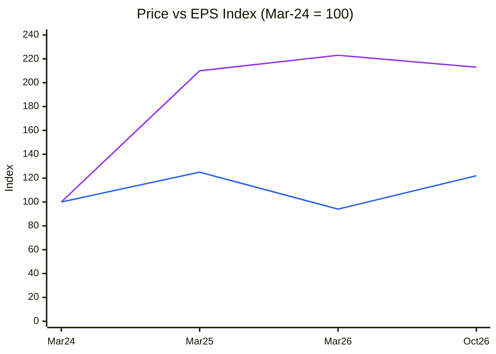
🟦 Price index · 🟪 EPS index (consolidated; Oct-26 = TTM)
**Read:** EPS is up 2.1× since the first post-listing March. The price is up only 1.22×, so the multiple has more than halved from its listing froth even after the latest rally.

**Business inference:** Shareholders since listing have earned less than earnings growth, because the stock IPO'd at an extreme multiple. Today's 71× is still high in absolute terms for a cyclical capital-goods maker. The past "de-rating" is not evidence of cheapness; it is the listing premium normalising.

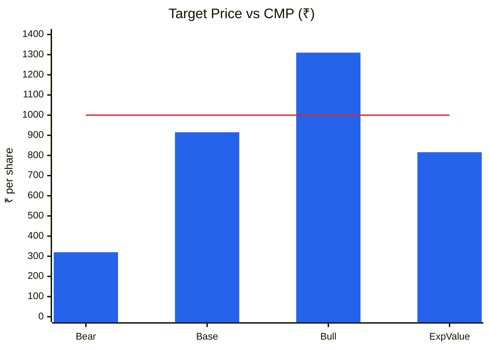
🟦 Scenario price (exit multiple on FY29E EPS, ~2-yr view; Module 11) · 🟥 CMP ₹1,000
**Read:** Even the base case (₹915) is below CMP. Expected value is ₹816 (−18%), with bull +31% vs bear −68%, so **U/D is 0.46:1**.

**Business inference:** The market is pricing something better than the bull case on today's evidence: a smooth plant ramp, peak margins and an unannounced next phase. Successful execution is consensus, while a margin or Huron disappointment is not priced. The payoff is negatively asymmetric until the price comes back toward ₹550–620, where U/D clears 2:1.

### Cycle Position Dashboard
| Dimension | Current | Reference | Percentile | Signal |
|---|---|---|---|---|
| P/E | 70.7× | 73.6× median (since listing) | ~67% | Expensive (cyclical at peak margins) |
| P/B | 11.4× | 13.7× median | ~33% | Expensive vs ROE (justified ~1–2×) |
| EBITDA margin | 25.2% (FY26) / 21.5% (Q1) | 13.5% 8-yr avg (SD 9.3) | 88% | **Late / peak, rolling over** |
| ROCE | 21.3% | 12.1% 8-yr avg (SD 8.9) | ~85% | **Late** |
| Utilisation | 86% → ~60% (FY28E) | — | — | Tight now; oversupplied (own plant) next |
| Order-book cover | 2.2× | 2.6× (FY24) | low | Visibility shrinking |
| **Overall cycle position** | | | | **Late** (margins and returns near peak; capacity step-up ahead of demand) |
Consistent with Module 1c (late on margins and returns) and Module 1b (mid-to-late cyclical overlay) ✓

---

## MODULE 9 — Technical Stage (Weinstein + CANSLIM)
| Item | Reading (weekly, to 9-Oct-2026) |
|---|---|
| Nifty 50 | **Stage 4.** 22,520 below a declining 30-wk MA (23,709) |
| Sector (Nifty Infra / capital goods) | Not retrieved; defaulting to market risk |
| Stock stage | **Stage 2.** Stage 1 base ₹580–840 (Mar–Aug 2026); breakout week of 17-Aug-26 (₹827 → ₹989, **1.75× average volume**) on the ECMS approval; high of ₹1,135 (week of 21-Sep, 1.4× volume) |
| 30-wk MA | **Rising** (₹764 → ₹786 → ₹828 over 10 weeks); price 21% above it |
| RS vs Nifty | Strongly positive (26-wk +41.3% vs −7.5%; 13-wk +27.9% vs −7.5%) |
| Pullback | ₹1,135 → ₹1,000 (−12%) on below-average volume (4-wk average 0.6× the 20-wk). Orderly so far |
| Entry timing | 14–19% above the ₹840–875 pivot → **late entry** (> 10–15% above the base) |
| Stop | ₹850 weekly close (below the pivot and the rising 30-wk MA ~₹830) |

**CANSLIM:** C 0 (Q1FY27 consolidated EPS −20% YoY) · A 1 (3-yr EPS CAGR > 25%, ROE 18%) · N 1 (new products, ECMS, 52-wk high in Sep) · S 0 (FII distribution; retail float expanding) · L 1 (RS leader) · I 0 (FIIs 9.9% → 5.3% over 4 quarters) · M 0 (Nifty Stage 4) → **3 / 7**
**Combined:** Stage 2 but 20%+ above the base with weak C/I/M → **late entry; wait for the next base.** The fundamentals (valuation) and the technicals are misaligned in the opposite direction to July: the chart is now better than the price justifies.

---

## MODULE 10 — Forward View: 2–3 Year Thesis

### Capex classification (₹Cr)
| Type | FY27E | FY28E | FY29E | In model? |
|---|---|---|---|---|
| Tangible growth: new 10,000-unit plant (₹~450 Cr project, mostly spent) | ~120 | — | — | ✅ |
| Tangible growth: ECMS electronics / backward integration (₹1,020.65 Cr over 5 yrs; ≤25% incentive) | ~40 | ~180 | ~180 | ✅ (incentive excluded from base) |
| Maintenance (≈ depreciation) | ~55 | ~70 | ~80 | ❌ sustains |
| CWIP at Mar-26: ₹115 Cr → transfers to PPE in Q3FY27 | — | — | — | Highest certainty |
| **Total capex** | **~215** (guided ₹200–225 Cr) | **~250** | **~260** | |

| Year | Net fixed assets (₹Cr) | Revenue (₹Cr) | Revenue / NFA (×) |
|---|---|---|---|
| FY22 | 292 | 746 | 2.6 |
| FY23 | 283 | 929 | 3.3 |
| FY24 | 322 | 1,338 | 4.2 |
| FY25 | 469 | 1,818 | 3.9 |
| FY26 | 720 (+115 CWIP) | 2,093 | 2.9 |
| **5-yr avg** | | | **3.4×** |
*(C6 not charted: budget. The trend reads from the table: peak 4.2× in FY24, now 2.9× as capacity runs ahead of revenue.)*

**Incremental ROIC (new plant):** ~4,500 extra machines by FY29E × ₹36 lakh = ₹1,620 Cr revenue × ~19% EBIT × 0.74 = ₹228 Cr NOPAT, ÷ (₹450 Cr capex + working capital ~₹890 Cr at 55% of Δrevenue) = **~17% vs WACC 13.5% → modestly value-creating.** The working-capital intensity is why it creates value but not cash.
**Capex-model implied revenue CAGR (FY26–29E):** **~22%** vs PIE ~46% → **the market is pricing unannounced expansion** (or a step-change in realisation).

### Earnings model (base case; WTT-haircut guidance)
| Metric | FY26A | FY27E | FY28E | FY29E |
|---|---|---|---|---|
| Machines executed | 5,550 | 7,000 | 9,500 | 11,500 |
| **Revenue (₹Cr, consolidated incl. Huron)** | 2,093 | **2,550** (+22%) | **3,150** (+24%) | **3,800** (+21%) |
| EBITDA margin | 25.2% | 24.0% | 25.0% | 25.5% |
| EBITDA | 527 | 612 | 788 | 969 |
| D&A | 50 | 60 | 80 | 95 |
| Interest | 70 | 95 | 100 | 100 |
| Other income | 60 | 30 | 30 | 30 |
| ICR (×) | 7.7 | 6.1 | 7.4 | 9.0 |
| PBT | 467 | 487 | 638 | 804 |
| PAT (26% tax) | 336 | 360 | 472 | 595 |
| **EPS (₹, 22.74 Cr shares)** | 14.77 | **15.8** | **20.8** | **26.2** |
| ΔWorking capital (~55% of Δrevenue) | — | −251 | −330 | −325 |
| Capex | −302 | −215 | −250 | −260 |
| **FCF (₹Cr)** | −269 | **−46** | **−28** | **+105** |
| Net debt / EBITDA | 1.3× | ~1.2× | ~1.0× | ~0.7× |

**FCF inflection:** FY29E (base). It would be FY27 if management's "OCF ≈ 50% of EBITDA" holds (implying FCF ~+₹90 Cr in FY27). **Debt ceiling:** safe (< 1.5× net debt/EBITDA). The risk is cash conversion and demand, not solvency.

### Key catalysts (2–3 yr)
1. New plant commissioning confirmed and H2FY27 dispatch ramp (guided ">8,000 machines produced"): Q3–Q4FY27
2. Order intake stepping up to ₹900 Cr+/quarter: H2FY27
3. Huron: licences cleared and the investigation closed or settled; FY27 revenue ₹300–325 Cr: FY27–28
4. FY27 OCF ≥ 50% of EBITDA (first positive FCF year): May-2027 results
5. In-house controllers commercialised and ECMS incentive accrual: FY28–29

### Key risks
1. **Huron judicial/export-control outcome** (penalties, licence loss, reputational spill-over to defence customers): **Medium-High**
2. **Margin compression through the ramp** (entry-level mix, under-absorption, interest now expensed): **High** (Q1 OPM 21.5%)
3. **Capex-cycle wobble** in auto/EMS (EMS customers already waiting on scheme clearances): **Medium**
4. **Working-capital blow-out / negative FCF persists:** **Medium-High**
5. **Valuation de-rating** from 71× in a Stage 4 market as FIIs keep selling: **High**

### Scenario analysis (utilisation/AT-driven; ~2-yr view on FY29E EPS)
| Scenario | Utilisation (FY29) | Revenue FY29E | EBITDA % | EPS FY29E | Exit P/E | Target | Prob. |
|---|---|---|---|---|---|---|---|
| Bull | ~85%, A&D/NX mix-up, Huron fixed | ₹4,300 Cr | 27% | ₹32.8 | 40× | **₹1,310** | 20% |
| Base | ~72%, flat realisation | ₹3,800 Cr | 25.5% | ₹26.2 | 35× | **₹915** | 50% |
| Bear | ~50%, capex-cycle wobble, Huron penalty | ₹2,800 Cr | 19% | ₹11.3 | 28× | **₹320** | 30% |
| **Expected value** | | | | | | **₹816** | |

**Return from CMP (expected value):** **−18%** over ~2 years. *(The previous report's bear target of ₹500 was an arithmetic error: ₹14 × 22 = ₹308.)*

---

## Checklist Summary
**Section 0 (Existing Report Protocol):** 3 / 3. Base report read, every item re-validated (validation table above), file renamed with `git mv` (one file).
**Section A (Business quality):** 16 / 18. Form C and auditor report not re-checked.
**Section B (Forensics):** 8 / 9. FY26 auditor report and KAMs not parsed.
**Section C (Financial statements):** 10 / 12. Tangible gross-block PPE note not extracted; ROIC on a pre-tax proxy.
**Section D (KPIs & peers):** 7 / 7
**Section E (Market size & share):** 5 / 7. No fresh IMTMA data.
**Section F (Valuation):** 10 / 10
**Section G (Technical):** 7 / 8. Sector index stage not retrieved.
**Section H (Forward view):** 25 / 30. Volume-based revenue model (KPI-native); order-book revenue anchor cross-checked.
**Section I (Charts):** 5 / 5. Includes C1, C2, C4/CY7, C5/CY7, C7, C8, C10, OB-1, OB-2, OB-4, CY1, CY4 and C13, each with Read plus Business inference. CY2/C6/C12 are tables (budget). CY5/CY6 are not sourced (stated). OB-3 is not applicable (no order ledger).
**Order Book Tracker:** Run (snapshots only; no Reg 30 order filings).
**Hard stops triggered:**
1. ❌ **Upside/downside < 1.5:1** (0.46:1)
2. ⚠️ Forensic red flags ≥ 3 (5/15): cash conversion and the Huron recognition change. Explained in part, so not treated as "unresolved", but deep diligence is required.
3. ⚠️ Beneish −1.91 (grey zone, not above −1.78)

---

## Investment Decision
**Recommendation: AVOID at ₹1,000.** The U/D hard stop is triggered. This is a quality franchise at the wrong price, so it stays on the **watchlist for re-entry**.
**Verdict category:** AVOID by rule (hard stop). On business quality alone it would be "Quality at Wrong Price"; the previous report's label was a misapplication of the hard-stop rule.

| Component | Max | Score |
|---|---|---|
| Cycle (market / sector / stock) | 1 | 0.4 |
| Industry structure | 1 | 0.6 |
| Business quality & moat | 2 | 1.2 |
| Management | 1 | 0.6 |
| Financial + earnings quality | 2 | 0.9 |
| Valuation & PIE asymmetry | 2 | 0.3 |
| Technical + CANSLIM | 1 | 0.5 |
| **Total** | 10 | **4.5** |

**Suggested position size:** 0% now. Up to 1–2% (halved for late-cycle margins) only in the re-entry zone.
**Re-entry zone:** **₹550–620** (≈ 26–30× FY28E EPS; U/D vs bull ₹1,310 and bear ₹320 ≈ 2.5:1). It needs either evidence of FCF turning or a fresh Stage 1 base. A strict MoS reading (30–40% below the ₹621 blended base) would demand ₹375–435.
**For existing holders:** the trend is up (Stage 2), so a trailing stop at a **₹850 weekly close** (below the pivot and the 30-wk MA) is the risk line. Trimming into strength is consistent with the valuation.
**Target price (base, 2-yr):** ₹915 (exit multiple) / ₹621 (blended intrinsic)
**Upgrade triggers:** (1) Q3/Q4FY27 order intake ≥ ₹900 Cr/quarter; (2) FY27 OCF ≥ 50% of EBITDA; (3) consolidated OPM back ≥ 25% after the plant start; (4) Huron investigation closed without material penalty; (5) price ≤ ₹620.
**Downgrade triggers (thesis break):** order intake falling 2 quarters in a row; OPM < 20%; net debt/EBITDA > 2.5×; Huron charges filed or licences revoked; co-promoter pledge rising back above 13% of capital.

---
*Report generated by Stock Fundamental Analysis Skill v3.3 | Indian Markets Context*
*Primary sources: Screener.in (consolidated and standalone, 9-Oct-2026); BSE corporate announcements for scrip 544081 (harvested via bseindia.com API, Jan-2024 to Oct-2026), incl. Reg 30 filings of 12-Apr-2026 (Huron investigation), 31-May-2026 (GST appeal), 17-Aug-2026 (MeitY ECMS approval), director changes (Oct-25, Jan/Apr-26) and the Infomerics rating (10-Feb-2026, IVR A+/Stable); Q1FY27 earnings call transcript (Investing.com, 7-Aug-2026) and slides; Q3/Q4FY26 call summaries (Arthneeti); Reg 31 pledge disclosures (FilingReader/ScanX summaries); investor-deck order-book history (Q1/Q2FY25, Q4FY25); Yahoo Finance weekly prices; peer data from Screener (Kennametal, Elecon, Azad).*
*Save path: C:\Users\anubh\Documents\Anubhav\Stock Analysis\Stock Analysis\JYOTICNC_JyotiCNCAutomation_2026-10-09.md*
