# Stock Analysis Report — Paushak Ltd (PAUSHAKLTD / BSE 532742)
**Date:** 2026-10-09
**Analyst:** Claude (Stock Fundamental Analysis Skill v3.3)
**Investment Horizon:** 2–3 Years
**Recommendation:** WATCHLIST (Quality at Wrong Price), buy-below ₹420–470
**Conviction Score:** 5 / 10

## Revision Log
| Version | Date | Recommendation | Conviction | Price | Key change |
|---|---|---|---|---|---|
| Current | 2026-10-09 | Watchlist, buy-below ₹420–470 | 5/10 | ₹691 | Q1 FY27 shows the new plant ramping (revenue +50% YoY), but at a much lower gross margin; WC-heavy DCF cut to ₹286–411; stock re-rated 37% after results; full chart set added |
| Previous | 2026-07-30 | Watchlist (Quality at Wrong Price), buy-below ₹400–460 | 5/10 | ₹611 | Written on Q3/Q4 FY26 data; Q1 FY27 results came out the same day and were not included (full text in git history) |

**What changed in the thesis:** The June report's central question was "will the new plant fill?" Q1 FY27 gives the first answer: **yes, volumes are arriving** (₹84 Cr quarter vs a ₹49–59 Cr run-rate for 12 quarters). A new question replaces it: **at what margin?** Material cost jumped from ~21% to ~35% of sales and PAT margin fell to 18%. The new capacity is selling lower-value-add molecules than the legacy phosgene franchise. The stock ran ₹572 → ₹785 after results and now sits at ₹691. Verdict unchanged (Watchlist); buy-below raised slightly to ₹420–470 on higher earnings, offset by a lower margin structure.

**Validation of previous report:**
| Item | Previous (30 Jul 2026) | Now | Status |
|---|---|---|---|
| FY26 revenue / PAT / EPS | ₹219 Cr / ₹39 Cr / ₹15.95 | Same (Screener) | ✅ Validated |
| Q3 FY26 revenue YoY / 9M FY26 PAT YoY | −0.9% / −32.6% | ₹49 Cr flat YoY / −31% | ✅ Validated |
| Net fixed assets FY24 → FY26 | ₹152 → ₹377 Cr | Same; **gross block ₹206 → ₹466 Cr** (fixed-asset schedule) | 🔄 Updated (AT now on gross block, not net block) |
| CWIP FY25 → FY26 | ₹190 → ₹26 Cr | Same | ✅ Validated |
| Investment book | ~₹150 Cr | ₹150 Cr (FY26) | ✅ Validated |
| Other income share of Q4 FY26 PBT | ~51% | ₹8 Cr / ₹16 Cr = 50% | ✅ Validated |
| Inventory days FY26 | 292 | 292 | ✅ Validated |
| FCF FY25 / FY26 | −₹122 / −₹34 Cr | Same | ✅ Validated |
| Promoter holding | 67.28% | 67.28% (Jun 2026) | ✅ Validated |
| Promoter pledge | Nil | Not re-sourced this run | ⚠️ Unverifiable (carried forward, unflagged in filings seen) |
| Revenue trajectory | "Decelerating-to-negative" | **Q1 FY27 +49.5% YoY to ₹83.6 Cr** | 🔄 Updated (thesis-relevant) |
| Margin assumption (base 30%) | EBITDA ~30% | Q1 30.7%, but **gross margin ~65% vs ~79%** | 🔄 Updated (mix is lower-value) |
| DCF base value | ₹520–620 | **₹286–411** (WC at 35% of Δrevenue on a 139-day CCC) | ❌ Corrected (old DCF understated working-capital drag) |
| Incremental ROIC | 13–14% | **~9–12%** (incl. working capital; lower gross margin) | ❌ Corrected |
| Technical stage | "Stage 3 topping / early Stage 4" | Rallied 37% post-results; price above rising 200-DMA | ❌ Corrected (call invalidated by the Q1 print) |
| Price range | NSE ₹342.5–633; "₹991 BSE high stale" | 52-wk ₹342–827 | 🔄 Updated |
| Peer P/Es | Indicative ranges | Screener 9 Oct 2026 (Navin 54×, Aarti 33×, Deepak 28×, Atul 22×, Vinati 26×) | 🔄 Updated |
| Nifty context | "Stage 2, upper multiple band" | Nifty 22,556, −6% since June, FII selling | 🔄 Updated |

---

## Executive Summary
Paushak is India's largest phosgene-derivatives producer and part of the Alembic group, operating a high-barrier, permit-protected niche. After a ₹250 Cr+ capex cycle (gross block ₹210 → ₹466 Cr in FY26), **Q1 FY27 delivered the first proof that the new plant is selling: revenue ₹83.6 Cr (+49.5% YoY), EBITDA ₹25.7 Cr (30.7% margin), PAT ₹15.1 Cr** ([ScanX](https://scanx.trade/stock-market-news/companies/paushak-ltd-q1-results-net-profit-rises-26-yoy-to-151-0-million/46959139); [MarketsMojo](https://www.marketsmojo.com/news/result-analysis/paushak-q1-fy27-stellar-revenue-surge-masks-margin-pressure-and-valuation-concerns-4129289)). But materials jumped to ~35% of sales (from ~21%), depreciation doubled, and other income fell, so PAT grew only 25%. The stock re-rated from ₹572 to ₹785 and now trades at **₹691: 40× TTM EPS, 3.5× book, ~33× FY27E EPS**. Our base case (FY28E EPS ~₹24 × 30×) gives **₹720, +4%**. Upside/downside is **1.15:1**, so the hard stop applies. Quality is real and the ramp has started; the price already assumes it continues at legacy-like returns, which Q1's margin mix does not yet support.

### C1 — Growth Index: Revenue vs Fixed Assets vs Profit (FY18 = 100)

| ₹ Cr | FY18 | FY19 | FY20 | FY21 | FY22 | FY23 | FY24 | FY25 | FY26 | 8-yr CAGR |
|---|---|---|---|---|---|---|---|---|---|---|
| Revenue | 105 | 140 | 138 | 141 | 150 | 212 | 206 | 211 | 219 | 9.6% |
| Gross Block | 43 | 48 | 55 | 71 | 175 | 190 | 206 | 210 | 466 | 34.7% |
| EBITDA | 29 | 40 | 43 | 50 | 54 | 75 | 65 | 60 | 61 | 9.7% |
| PAT | 21 | 39 | 35 | 37 | 38 | 54 | 54 | 49 | 39 | 8.1% |

*Source: Screener.in (standalone); gross block from the fixed-asset schedule. FY18 base, because the FY17 Ind AS deemed-cost reset breaks the gross-block series. TTM: revenue ₹246 Cr, EBITDA ₹69 Cr, PAT ₹42 Cr.*

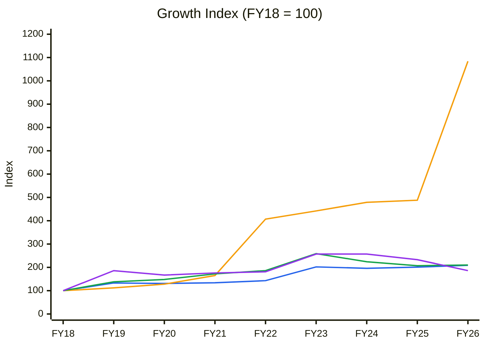
🟦 Revenue (CAGR 9.6%) · 🟧 Gross Block (34.7%) · 🟩 EBITDA (9.7%) · 🟪 PAT (8.1%)

**Read:** Gross block grew **10.8×** since FY18 while revenue and EBITDA only doubled. The divergence came in two steps, FY22 (407) and FY26 (1,084). Between them revenue was flat at ~₹206–219 Cr for four years. Q1 FY27's annualised revenue (~₹334 Cr, index ~318) is the first move of 🟦 toward 🟧.

**Business inference:** Until FY21, Paushak was a capital-light phosgene franchise that earned 25–30% ROCE on a tiny asset base. It has since become a capital-heavy multi-product chemical maker, and each rupee of plant now produces less than a quarter of the revenue it used to. Even when the new plant is full, returns will settle well below the old franchise's. Paying the old franchise's multiple for the new business model is the core valuation error to avoid.

---

## BUSINESS PRIMER

**What the business does and how it makes money.** Paushak makes specialty and custom phosgene derivatives (chloroformates, isocyanates, carbamoyl chlorides, carbamates, carbonates) at its Panelav, Gujarat complex. The complex houses a 14,400 MTPA phosgene plant, the largest merchant capacity in India. Phosgene is lethally toxic and practically untransportable, so downstream users buy the finished derivative from a permitted, safety-compliant producer rather than handle it themselves. Revenue is B2B volume × realisation across agrochemical, pharmaceutical, polymer and personal-care intermediates, split between domestic and export customers, plus a growing custom-synthesis/CDMO line. Economics depend on (1) the regulatory and safety moat around phosgene handling and (2) demand from the cyclical agrochemical and pharma intermediate chains.

**What kind of business this is and what to watch.** This is a niche specialty-chemical franchise that has turned from capital-light to capital-heavy. It was historically a high-ROCE, cash-generative compounder (ROCE 25–32%) and is now ramping a ~₹250 Cr multi-purpose expansion. The key value drivers are volume (filling the new plant) and mix (higher-value custom molecules). Q1 FY27 says volume is arriving but mix is diluting. The key risks are a slow or low-margin ramp, agrochemical-cycle weakness and Chinese pricing in commodity derivatives, and a ~₹150 Cr treasury book whose gains flatter reported profit (other income was 50% of Q4 FY26 PBT). It is promoter-controlled (67.3%), thinly traded, with no meaningful institutional ownership, and sits inside the Alembic group, so related-party and governance lenses matter more than usual.

**New Segment Protocol:** Segment = **Specialty Chemicals**, covered in `references/05-industry-kpis-india.md` ✓.

---

## MODULE 1 — Broad Market Cycle (Marks)
Nifty 50 at 22,556 (5 Oct 2026, ~−6% since June), India VIX 14.7, persistent FII selling absorbed by DIIs ([StockPil](https://stockpil.com/india-markets-today-2026-10-05/)). Small-cap specialty chemicals have re-rated on a sector-wide Q1 FY27 earnings rebound (peers' quarterly sales +25–45% YoY on Screener). **Assessment: CAUTIOUS.** **Sizing:** small, wide margin of safety for an illiquid micro-cap.

## MODULE 1b — Sector Cycle: Tailwinds & Headwinds
**Secular vs cyclical decomposition.** The Q1 FY27 jump (+49.5%) is mostly **capacity-led** (new plant volume) plus a sector-wide agrochemical restocking. Screener's peer table shows Q1 sales growth of +25% to +44% across Navin, Deepak, Aarti, Atul and Gujarat Fluoro, so part of Paushak's growth is the cycle turning, not company-specific share gain. The durable secular baseline for Indian phosgene chemistry is ~8–12% (agro and pharma intermediates, import substitution, custom synthesis).
- **Input costs:** Q1 FY27 material cost rose to ~35% of sales (from ~21% in FY26) ([ScanX](https://scanx.trade/stock-market-news/companies/paushak-ltd-q1-results-net-profit-rises-26-yoy-to-151-0-million/46959139)), reflecting mix (new molecules) and some input inflation.
- **Inventory cycle:** agrochemical destocking (2023–25) has turned to restocking across the sector. Paushak's own inventory (292 days in FY26) was built for the ramp.
- **Capacity pipeline:** multiple Indian specialty-chemical players commissioned capacity in FY24–26. Phosgene permits protect the core, not the custom/multi-purpose overlap.
- **China:** still the main pricing risk in commodity derivatives.
**CY5/CY6 not charted:** no sourced industry capacity/demand or phosgene-derivative price series. The gross-margin proxy is in C4.

**Sector cycle verdict: NEUTRAL → mild TAILWIND** (restocking under way; Chinese pricing a cap). Do not embed Q1's +50% as durable. Base case uses ~15–20% FY27–28 growth tapering to ~9%.

## MODULE 1c — Stock Cycle: Company-Specific Positioning

### C2 — Quarterly YoY Growth (last 8 quarters)

| Quarter | Sep24 | Dec24 | Mar25 | Jun25 | Sep25 | Dec25 | Mar26 | Jun26 |
|---|---|---|---|---|---|---|---|---|
| Revenue (₹ Cr) | 57 | 49 | 52 | 56 | 59 | 49 | 55 | 84 |
| Revenue YoY % | +9.6 | −5.8 | −3.7 | +7.7 | +3.5 | 0.0 | +5.8 | +49.5 |
| EBITDA (₹ Cr) | 17 | 15 | 16 | 18 | 15 | 11 | 17 | 26 |
| EBITDA YoY % | +21 | −21 | −16 | +50 | −12 | −27 | +6 | +44 |
| OPM % | 30 | 30 | 30 | 32 | 25 | 23 | 30 | 31 |

*Source: Screener.in quarterly (rounded ₹ Cr; Q1 FY27 YoY from company figures).*

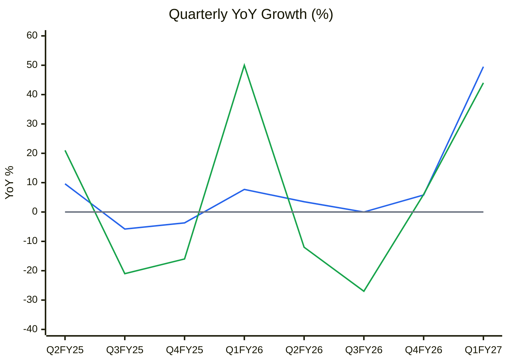
🟦 Revenue YoY % · 🟩 EBITDA YoY % · ⬜ zero line

**Read:** For seven quarters revenue growth oscillated between −6% and +10% around a flat ₹49–59 Cr run-rate, and EBITDA swung ±20–50% on small bases. Q1 FY27 breaks the pattern at **+49.5% revenue / +44% EBITDA**. EBITDA grew *slower* than revenue, which is unusual for a ramp with operating leverage.

**Business inference:** The new plant is adding volume, but the incremental volume carries lower margins than the legacy book. The volume is real and the operating leverage is muted. One quarter is not a trend: the test is whether Q2 FY27 (results 16 Oct 2026) holds above ~₹75 Cr. If it does, Paushak has stepped up to a ~₹300+ Cr revenue base. If it slips back to ~₹55–60 Cr, Q1 was a lumpy campaign or restocking order.

**Physical capacity model:** Phosgene 14,400 MTPA (the gating input). The new multi-purpose block (~₹175–250 Cr) was commissioned in FY26 on a phased rollout. On the post-FY22 gross-block AT of ~1.0×, ₹466 Cr of gross block supports **~₹420–470 Cr of revenue at maturity**. The Q1 annualised ₹334 Cr implies the new block is ~50–60% ramped. **Capacity ceiling year: ~FY29**, after which growth needs new capex.

**Operating leverage:** High in principle (fixed-cost plant), diluted in practice by the lower-margin mix. Q1: revenue +49.5%, EBITDA +44% → DOL < 1 at the EBITDA line this quarter.

**FCF inflection:** FY25/FY26 FCF −₹122/−₹34 Cr. With growth capex done, FY27 FCF should turn positive (~₹15–25 Cr after ~₹35 Cr of WC build). **Inflection FY27–FY28.**

### CY7 — EBITDA Margin & ROCE vs their own cycle

| | FY16 | FY17 | FY18 | FY19 | FY20 | FY21 | FY22 | FY23 | FY24 | FY25 | FY26 | Q1FY27 |
|---|---|---|---|---|---|---|---|---|---|---|---|---|
| EBITDA margin % | 22 | 17 | 28 | 29 | 31 | 36 | 36 | 35 | 31 | 28 | 28 | 31 |
| ROCE % | 25 | 12 | 29 | 27 | 21 | 20 | 17 | 21 | 17 | 11 | 8 | — |

EBITDA margin: 10-yr median 29%, SD 5.5 → band 23.5–34.5%. ROCE: median 20%, SD 6.4 → band 13.6–26.4%.

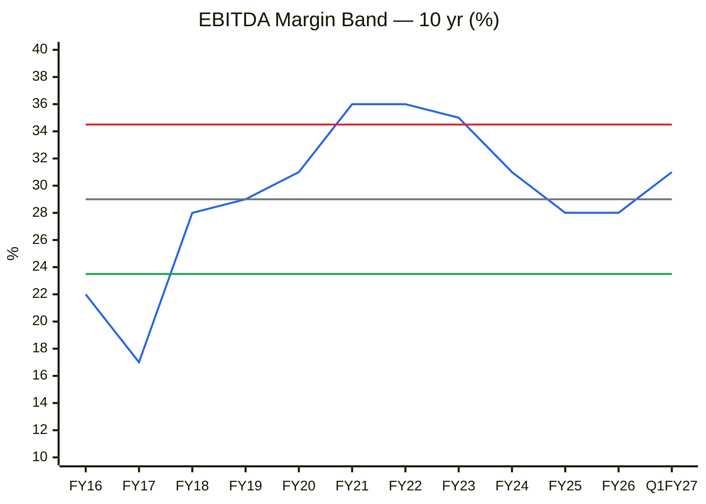
🟦 EBITDA margin · ⬜ Median 29% · 🟥 +1SD 34.5% · 🟩 −1SD 23.5%

**Read:** EBITDA margin is **mid-band** (28–31%, ~50th percentile). The FY21–FY23 peak (35–36%) is above +1SD. ROCE (8% in FY26) is **below −1SD**, at the 10-year low.

**Business inference:** Paushak's problem is not margin but capital intensity. It still earns a healthy ~30% EBITDA on every sale, yet ROCE has collapsed because the asset base more than doubled ahead of revenue. Recovery therefore comes from volume (asset turnover), not price. With the new volume carrying ~14 points lower gross margin, the margin has little room to expand as the plant fills.

**Stock cycle classification: EARLY-CYCLE / RAMP-UP (volume visible, returns still at trough).** Standard-to-wider MoS. Position small until two quarters confirm the new revenue base.

---

## MODULE 2 — Industry Structure & Capital Cycle

| Force | Assessment | Signal |
|---|---|---|
| New Entrants | **Very high barriers.** Phosgene permits, safety record and handling know-how cannot be bought quickly | Strong advantage |
| Supplier Power | Chlorine, CO, aromatics broadly available; Q1 shows input-cost/mix pressure | Moderate |
| Buyer Power | Agro/pharma innovators; custom molecules sticky, commodity derivatives price-driven | Moderate |
| Substitutes | Non-phosgene routes for some molecules (slow, long-term) | Low-Moderate |
| Rivalry | Limited domestic merchant phosgene (Atul, captive players); China in commodity exports | Low domestic / High export |

**Industry verdict: ATTRACTIVE in the protected phosgene niche; NEUTRAL in the multi-purpose/custom overlap**, where the new capacity mostly competes.

**Capital cycle:** Sector capex ≫ depreciation in FY22–26 (Paushak: capex/depreciation 6–10× in FY21–26). Returns are depressed sector-wide and now turning as restocking lifts utilisation (peer Q1 profits +20% to +250% YoY). **Position: capex flood digesting → early recovery in returns.**

---

## MODULE 3 — Business Quality & Moat
**Moat: NARROW-to-WIDE in phosgene derivatives; NARROW in custom/multi-purpose.** Source (Greenwald): regulatory/supply barrier (permitted phosgene complex) plus niche scale (dominant Indian merchant producer). Customer captivity exists for validated custom molecules.
**Pricing-power test:** Historical gross margin rose from ~63% (FY16–19) to ~79% (FY21–26), evidence of real pricing power in the core. Q1 FY27's ~65% is mix, not lost pricing, but it shows the new capacity does not share the core's economics.

### C4 — Margin trend

| % | FY16 | FY17 | FY18 | FY19 | FY20 | FY21 | FY22 | FY23 | FY24 | FY25 | FY26 |
|---|---|---|---|---|---|---|---|---|---|---|---|
| Gross margin (1 − material %) | 63.4 | 65.4 | 64.4 | 61.5 | 67.1 | 75.8 | 80.2 | 78.3 | 78.3 | 79.1 | 79.1 |
| EBITDA margin | 22 | 17 | 28 | 29 | 31 | 36 | 36 | 35 | 31 | 28 | 28 |
| PAT margin | 15.4 | 15.3 | 20.0 | 27.9 | 25.4 | 26.2 | 25.3 | 25.5 | 26.2 | 23.2 | 17.8 |

*Source: Screener.in expense schedule. Q1 FY27: material cost ~34.7% of sales → gross margin ~65%; EBITDA 30.7%; PAT margin 18.1%.*

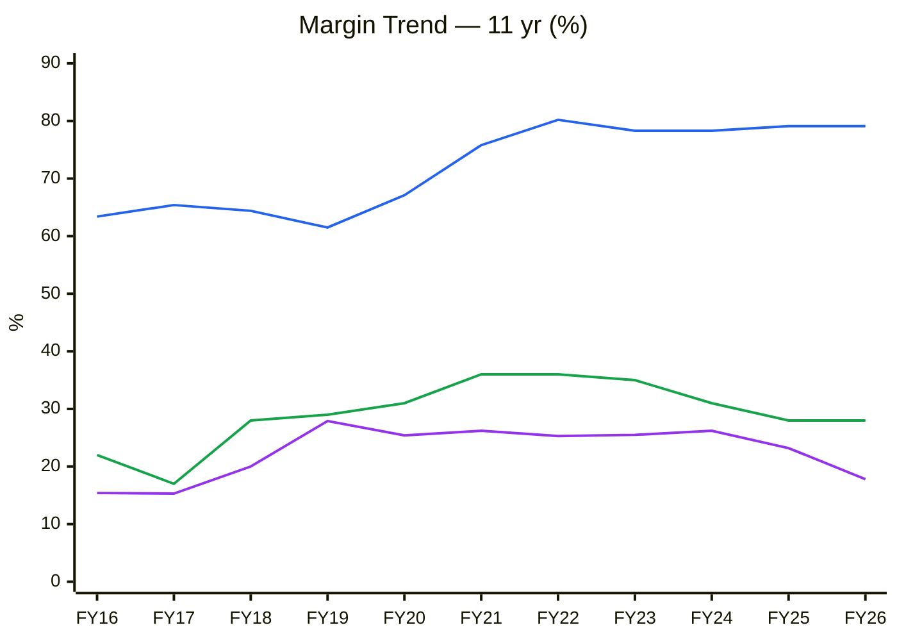
🟦 Gross margin · 🟩 EBITDA margin · 🟪 PAT margin

**Read:** Gross margin stepped up ~15 points in FY20–FY22 and held near 79% for five years, yet EBITDA margin drifted from 36% to 28%. The gap is fixed costs (employees, power, plant overhead) on a bigger plant that is not yet full. PAT margin fell further (26% → 18%) as depreciation doubled. Q1 FY27 then shows gross margin dropping to ~65% while EBITDA held ~31%.

**Business inference:** The legacy franchise sells high-value-add molecules (only ~21% of revenue is raw material), which is why it was so profitable. The new plant fills capacity with materials-heavy products, so EBITDA margin can hold around 28–31% through absorption but will not return to 35%+. Investors should model the combined business at ~28–30% EBITDA and ~10% D&A intensity, not the FY21–23 peak.

**Fisher 15-point:** ~34/45 (unchanged). Point 15 integrity: **Pass**.

---

## MODULE 4 — Management & Capital Allocation
**Promoter holding:** 67.28% (Jun 2026; flat for 12 quarters, 66.97% → 67.28%). **No C9 chart** (no movement > 1pp). **Pledge:** Nil per the prior report (not re-sourced). **FII 0.0% / DII 0.06%:** no institutional ownership. Shares 2.46 Cr after the 2025 3:1 bonus + FV split (non-dilutive). Dividend payout 10–16%.
**Capital allocation: GOOD history, ON TRIAL now.** The FY25–26 expansion is the first debt-funded capex in a decade (borrowings ₹0 → ₹77 Cr). The first evidence (Q1) shows volume but lower-margin mix. Incremental ROIC including working capital is **~9–12%, about equal to WACC** (Module 11).
**Treasury/RPT:** ₹150 Cr investment book. Other income (₹12 Cr FY26, of which ₹7.6 Cr "exceptional" gains) is ~25% of PBT. Strip it out to judge operations.
**Three C's:** Candor Moderate (no concalls, sparse disclosure) · Competence High over the cycle · Caring Moderate (low payout).

### Walk the Talk Scorecard
| Period guided | Statement | Guided | Actual | Verdict |
|---|---|---|---|---|
| FY25 | New multi-purpose plant commissioning within FY26 | FY26 | Commissioned FY26 (phased) | ✅ |
| FY26 (H1) | Phased ramp / incremental revenue | "ramping" | Flat through Q4 FY26; +49.5% in Q1 FY27 | ⚠️ Late but delivered |
| FY26 | Margin stability ~30% | ~30% | FY26 28%; Q1 FY27 30.7% | ✅ |

**WTT Score: 0.83 → HIGH on a thin, qualitative base** (2 hits, 1 near-miss). **Pattern:** delivers projects and margins, while the revenue payoff lags by 2–3 quarters. **Insider action:** none (holding flat). **DCF impact:** no haircut on margins; ramp timing per base case.

---

## MODULE 5 — Financial Forensics
**Red-flag count: 2/15** (inventory days 292; other income/EBIT > 15%). Both are growth-phase or structural, not manipulation.
**Beneish M:** well below −1.78 (CFO ≈ NI; TATA ≈ 0) → **unlikely manipulator.** **Altman Z'' ≈ 7 → Safe** (equity ₹491 Cr vs liabilities ₹169 Cr). **Piotroski FY26 ≈ 4/9** (falling ROA and AT, rising leverage: down-cycle symptoms). **Sloan (CF):** (39 − 54 + 95) / avg TA 616 = **+13%** (growth capex; operating accruals negative) → acceptable. **Indian flags:** pledge nil, group treasury holdings (no extraction evident), no auditor issues seen. **Verdict: CLEAN (minor cyclical concerns).**

### C7 — Cumulative PAT vs CFO vs FCF (₹ Cr)

| | FY16 | FY17 | FY18 | FY19 | FY20 | FY21 | FY22 | FY23 | FY24 | FY25 | FY26 |
|---|---|---|---|---|---|---|---|---|---|---|---|
| Cum. PAT | 12 | 23 | 44 | 83 | 118 | 155 | 193 | 247 | 301 | 350 | 389 |
| Cum. CFO | 14 | 26 | 36 | 60 | 101 | 131 | 175 | 218 | 274 | 312 | 366 |
| Cum. FCF | −3 | 4 | 9 | 22 | 49 | 23 | 19 | 47 | 64 | −58 | −92 |

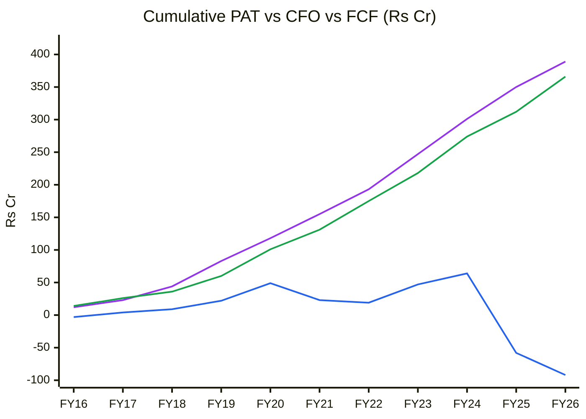
🟪 Cumulative PAT · 🟩 Cumulative CFO · 🟦 Cumulative FCF (CFO − capex)

**Read:** Cumulative CFO/PAT is **0.94**, and higher than that on operating profit, since PAT includes ~₹80 Cr of cumulative treasury other income that does not pass through CFO. But cumulative **FCF swung from +₹64 Cr (FY24) to −₹92 Cr (FY26)**: the expansion consumed ~10 years of free cash in two years.

**Business inference:** Reported profits are genuine and convert to operating cash, so accounting quality is not the issue. The capex cycle has used up a decade of free cash flow and pushed the company into modest debt. Shareholders will see real cash returns only once the new plant earns back its cost (FY28 onward), which is why near-term EPS growth does not equal near-term value creation.

### C8 — Working-capital days

| Days | FY16 | FY17 | FY18 | FY19 | FY20 | FY21 | FY22 | FY23 | FY24 | FY25 | FY26 |
|---|---|---|---|---|---|---|---|---|---|---|---|
| Debtor | 97 | 83 | 135 | 85 | 69 | 85 | 97 | 90 | 90 | 94 | 92 |
| Inventory | 117 | 125 | 118 | 122 | 131 | 148 | 233 | 180 | 177 | 179 | 292 |
| Payable | 104 | 70 | 170 | 73 | 110 | 118 | 227 | 122 | 130 | 167 | 245 |
| CCC | 110 | 138 | 83 | 133 | 89 | 115 | 103 | 149 | 137 | 107 | 139 |

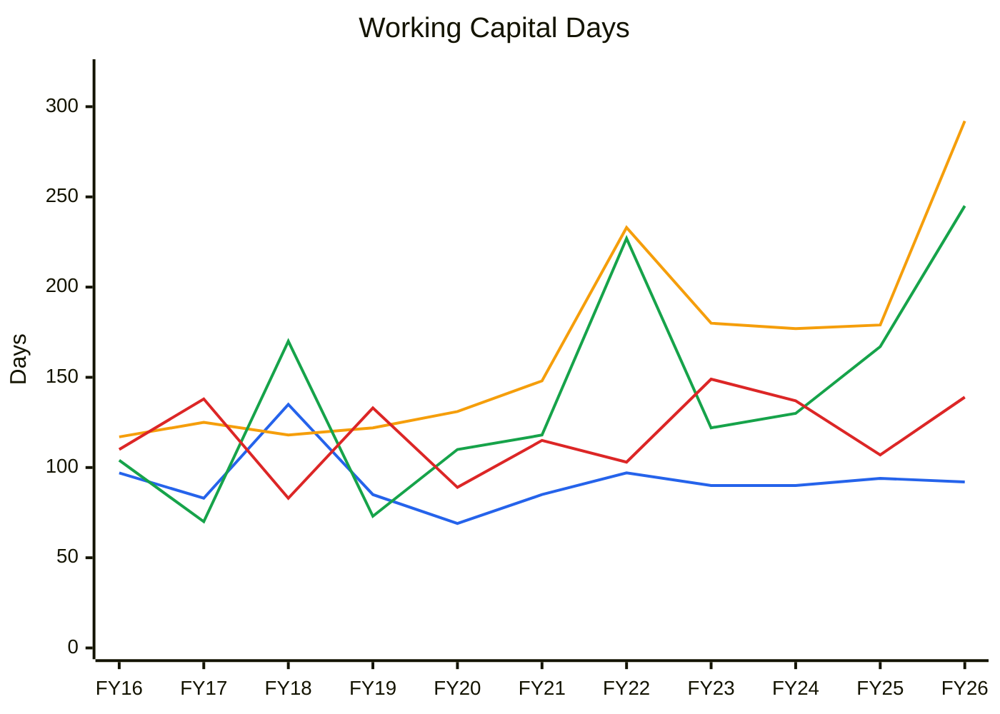
🟦 Debtor days · 🟧 Inventory days · 🟩 Payable days · 🟥 Cash conversion cycle

**Read:** Debtors are steady at ~90 days. Inventory spiked to **292 days** in FY26 (from ~180), but payables rose in step (245 days), so the CCC stayed at ~139 days, within its 10-year 83–149 range. The FY22 pattern (inventory and payables both jumping) also coincided with a commissioning year.

**Business inference:** Paushak is a 4–5-month cash-cycle business: every ₹100 of extra revenue ties up ~₹35–40 of working capital. That, more than the plant itself, is why the DCF is modest. The FY26 inventory spike is ramp stocking funded by suppliers. If Q1's higher revenue does not pull inventory days back toward ~180 in FY27, it would signal slow-moving stock in the new molecules.

---

## MODULE 6 — Earnings Quality & Financial Statements
**ROIC (FY26):** EBIT (61 − 21) = ₹40 Cr × 0.78 = NOPAT ₹31 Cr ÷ operating invested capital (equity 491 + debt 77 − investments 150) ₹418 Cr = **~7.5%**. TTM (EBIT ₹43 Cr): ~8%. **Q1 FY27 annualised (EBIT ~₹69 Cr): ~13%.** **WACC ~11.5%.** **Economic profit:** negative in FY26; turning positive at the Q1 run-rate.

### C5 — ROCE vs WACC

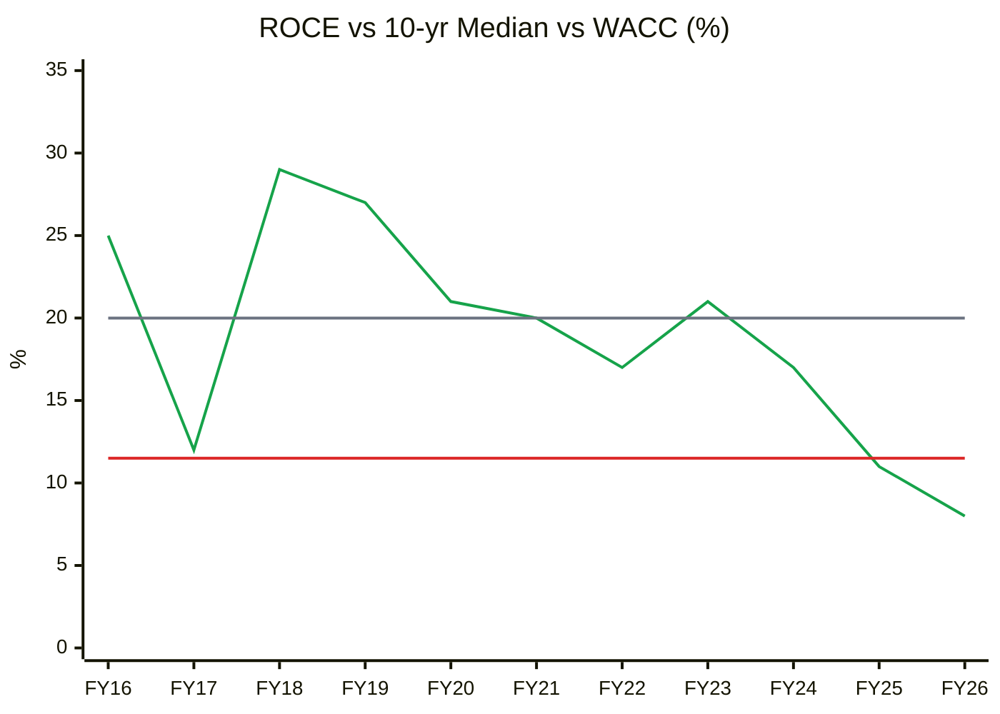
🟩 ROCE (pre-tax, Screener) · ⬜ 10-yr median 20% · 🟥 WACC 11.5%

**Read:** ROCE was above WACC in 9 of 11 years (median 20%) and fell below it for the first time in FY25–26 (11% → 8%), as ₹250 Cr of new assets sat idle. The Q1 FY27 run-rate points to ROCE recovering to ~13–15% in FY27, above WACC but well below the old 20–29%.

**Business inference:** The legacy franchise created value through the cycle, which is real evidence of a moat. The expanded company has a structurally lower return ceiling because most of its capital now sits in less-protected multi-purpose capacity. The trough is temporary, but so are the 25%+ ROCE years. A fair long-run expectation is mid-teens ROCE, which supports a mid-20s P/E, not 40×.

### C6 — Asset Turnover (Revenue / Gross Block)

| | FY17 | FY18 | FY19 | FY20 | FY21 | FY22 | FY23 | FY24 | FY25 | FY26 |
|---|---|---|---|---|---|---|---|---|---|---|
| AT (×) | 1.89 | 2.44 | 2.92 | 2.51 | 1.99 | 0.86 | 1.12 | 1.00 | 1.00 | 0.47 |

*TTM 0.53×; Q1 FY27 annualised 0.72×. FY16 excluded (pre-Ind AS gross block).*

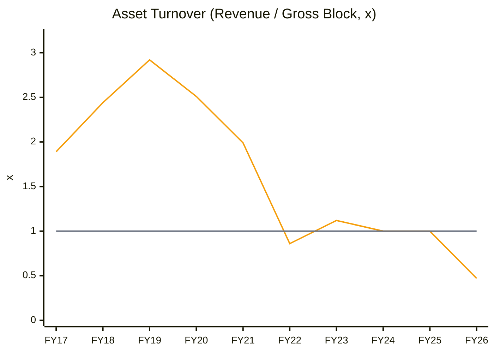
🟧 AT · ⬜ FY22–FY25 post-expansion average 1.0×

**Read:** AT fell in two structural steps: from ~2.5–2.9× (FY18–20) to ~1.0× after the FY22 plant, then to **0.47×** in FY26. FY23–25 settled at ~1.0× once the FY22 block filled. Q1 FY27's annualised 0.72× shows the FY26 block filling on a similar path.

**Business inference:** The FY22 expansion offers a template: it took about a year to restore AT to ~1.0×, and it never got back to the 2–3× of the capital-light era. Base-case AT for the enlarged plant is ~0.9–1.0× by FY29, i.e. ~₹420–470 Cr of revenue. Anything above that needs new capex, which caps how much the current asset base can earn.

### DuPont (5-factor, FY22–FY26)
| Year | EBIT margin | AT (Rev/TA) | Equity mult. | Interest burden | Tax burden | ROE |
|---|---|---|---|---|---|---|
| FY22 | 30% | 0.41 | 1.20 | 1.00 | 0.75 | 12% |
| FY23 | 29% | 0.51 | 1.17 | 1.00 | 0.75 | 15% |
| FY24 | 25% | 0.43 | 1.18 | 1.00 | 0.77 | 13% |
| FY25 | 21% | 0.37 | 1.23 | 0.99 | 0.84 | 11% |
| FY26 | 18% | 0.33 | 1.34 | 0.98 | 0.78 | 8% |

*EBIT margin here excludes other income. ROE on year-end equity.* **Verdict:** The ROE decline is **operational** (EBIT margin −12pp from depreciation and under-absorption; AT down on idle assets). Leverage rose slightly and is not masking anything. The large treasury book (~23% of assets) structurally depresses AT and ROE.

---

## MODULE 7 — Industry KPIs & Peer Analysis
**Sector: Specialty Chemicals. Top KPIs: EBITDA margin · ROCE / asset turn · export share.**

| Metric | Paushak | Navin Fluorine | Deepak Nitrite | Aarti Inds | Atul | Vinati Organics |
|---|---|---|---|---|---|---|
| Mcap (₹ Cr) | 1,703 | 43,219 | 22,211 | 17,368 | 17,306 | 11,619 |
| P/E (TTM) | 40.2 | 54.4 | 28.0 | 33.3 | 21.8 | 25.9 |
| ROCE % | 8.3 | 21.0 | 11.4 | 6.9 | 14.9 | 19.8 |
| Latest-qtr sales YoY | +49.5% | +44% | +36% | +43% | +25% | — |
| Net debt | Net cash (treasury) | Mild | Moderate | High | Net cash | Net cash |

*Source: Screener.in peer table, 9 Oct 2026 (Vinati from the Balaji Amines report of the same date).*

### C12 — ROCE vs Peers

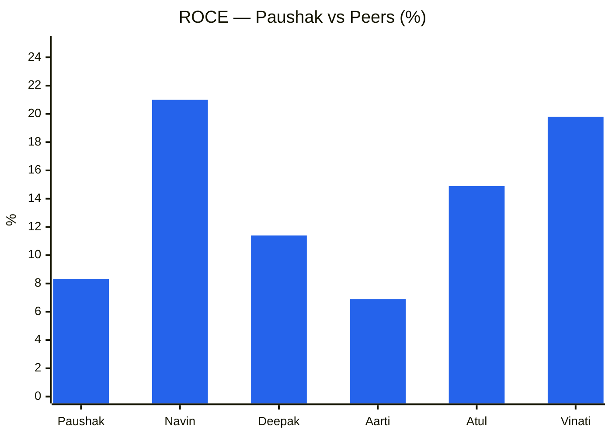

**Read:** Paushak's ROCE (8.3%) is second-lowest in the group, ahead only of Aarti (6.9%), while its P/E (40×) is second-highest after Navin (54×, with 21% ROCE). Atul (14.9% ROCE) trades at 22× and Vinati (19.8%) at 26×.

**Business inference:** The market prices Paushak like a high-return niche compounder (its FY19–23 identity) while it currently earns returns closer to Aarti's. Part of that premium rests on the phosgene moat, which is legitimate. The rest assumes the new plant restores 20%+ ROCE, which Q1's lower-margin mix makes unlikely. Atul and Vinati offer better returns at lower multiples today.

**Peer positioning:** Premium. Partly justified (moat, net cash, under-ownership); not justified on current returns.

---

## MODULE 8 — Market Size & Market Share
Paushak's serviceable market (Indian merchant + custom phosgene derivatives for agro and pharma) is a few thousand crore; the global phosgene-derivative and isocyanate-intermediate market is multi-billion-dollar. Penetration is low single-digit. Market share is dominant and stable in Indian merchant phosgene derivatives, and nascent in custom/CDMO. Q1 FY27 revenue growth (+49.5%) outpaced peers (+25% to +44%), so **share is being gained at the margin, though partly in lower-value molecules**. **Verdict: growing faster than the market for now, capacity-led.**

---

## MODULE 9 — Valuation: PIE First, Then DCF
**CMP ₹691 (9 Oct 2026) · Mcap ₹1,703 Cr · debt ₹77 Cr · investments ₹150 Cr · treasury-adjusted EV ~₹1,630 Cr · TTM EPS ₹17.19 · P/E 40.2× · P/B 3.5× (BV ₹199) · 2.464 Cr shares.**

### PIE
TTM NOPAT (EBIT ₹43 Cr × 0.78) ≈ ₹33.5 Cr → EV/NOPAT 49× → implied perpetual g = (1,630 × 11.5% − 33.5)/(1,630 + 33.5) = **9.3%**. On the Q1 run-rate (NOPAT ~₹55 Cr): **7.9%**.

| PIE driver | Market-implied | My base case | Gap |
|---|---|---|---|
| Revenue CAGR FY26–31 | ~18–20% (to ~₹520–550 Cr) | 18% to FY29 then ~9% (₹500 Cr FY31) | Small, optimistic |
| Steady-state EBITDA margin | ~30–31% | 27–28% | Market optimistic |
| WC intensity | ~20–25% of Δrevenue | **35%** (CCC 139 days) | **Market optimistic** |

**Physical plausibility:** The current gross block supports ~₹420–470 Cr at ~1.0× AT. PIE-implied ₹520–550 Cr needs **another expansion** or a return to pre-FY22 asset turns. Neither is announced.
**Expectations treadmill:** To beat the price, Paushak must hold ≥ ₹80 Cr per quarter *and* lift margins back toward 32–35% despite the materials-heavy mix *and* release working capital.
**Triggers:** + Q2 FY27 revenue ≥ ₹80 Cr at ≥ 30% margin; inventory days falling; new CDMO contracts. − Q2 revenue < ₹65 Cr (Q1 was lumpy); gross margin < 60%; agro destocking relapse.
**SVAR:** bear ₹305 → **56%** (> 40% = unfavourable).

### Own DCF (5-yr explicit; WC 35% of Δrevenue; tax 22%; net treasury +₹73 Cr)

| ₹/share | WACC 11.5%, g 6%, RONIC 15% | 11%, 6%, 18% | 10.5%, 6.5%, 20% |
|---|---|---|---|
| Bear (rev → ₹330 Cr FY31, 24%) | 165 | 187 | 219 |
| **Base (rev → ₹500 Cr FY31, 29% → 27%)** | **286** | **336** | **411** |
| Bull (rev → ₹660 Cr FY31, 31% → 30%) | 402 | 481 | 599 |

**DCF note:** Working capital is the main drag. Each ₹100 Cr of new revenue needs ~₹35 Cr of WC plus ~₹100 Cr of plant, so free cash builds slowly. Even the bull DCF (₹402–599) is below the price, which only makes sense if one capitalises today's earnings at a high multiple rather than discounting cash. (The July report's ₹520–620 base excluded this WC drag; corrected.)

### Relative (2-yr, FY28E)
FY27E: revenue ~₹320 Cr, EBITDA 29%, PAT ~₹51 Cr, **EPS ~₹21** → **33× FY27E**. FY28E base EPS ~₹24 → **29× FY28E**.

### CY1 — P/E Band

| | FY16 | FY17 | FY18 | FY19 | FY20 | FY21 | FY22 | FY23 | FY24 | FY25 | FY26 | Oct-26 |
|---|---|---|---|---|---|---|---|---|---|---|---|---|
| P/E (×, fiscal year-end) | 12.8 | 17.0 | 22.5 | 21.7 | 15.4 | 82.7 | 86.4 | 37.0 | 31.1 | 23.9 | 25.1 | 39.0 |

523 observations since Oct 2016: **median 31.1×, SD 20.0 → band 11.1–51.1×; current 39× = 71st percentile.** *(Screener.in P/E chart.)*

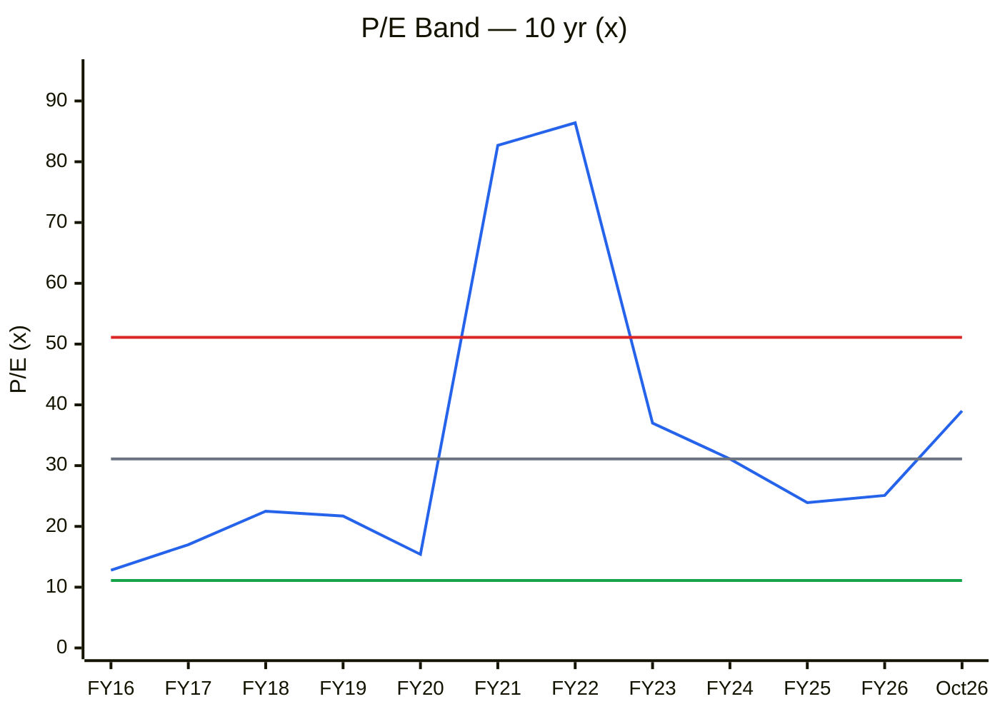
🟦 P/E · ⬜ Median 31.1× · 🟥 +1SD 51.1× · 🟩 −1SD 11.1×

**Read:** P/E is at the **71st percentile (39×)**, up from 25× at FY26 year-end. The FY21–22 spike (83–86×) was a small-cap mania that de-rated by ~70% over four years while EPS rose ~45%. In FY16–FY20, when ROCE was 21–29%, the stock traded at 13–23×.

**Business inference:** The median of 31× is inflated by the 2021–22 bubble. When Paushak was earning its best-ever returns (FY18–20), the market paid ~20×. Today's 39× is paid for a business earning a third of those returns, on the hope that Q1 is the start of a sustained ramp. The multiple is rewarding the narrative, not the economics.

### CY2 — P/B Band (with ROE)

| | FY16 | FY17 | FY18 | FY19 | FY20 | FY21 | FY22 | FY23 | FY24 | FY25 | FY26 | Oct-26 |
|---|---|---|---|---|---|---|---|---|---|---|---|---|
| P/B (×) | 2.8 | 2.7 | 4.5 | 5.5 | 2.9 | 11.2 | 10.7 | 6.3 | 4.2 | 3.2 | 1.9 | 3.5 |
| ROE (%, PAT / avg equity) | 19.2 | 14.6 | 21.4 | 26.9 | 17.3 | 14.8 | 13.2 | 16.4 | 14.2 | 11.2 | 8.2 | ~9 TTM |

**Median 4.6×, SD 2.6 → band 2.0–7.2×; current 3.5× = 26th percentile.**

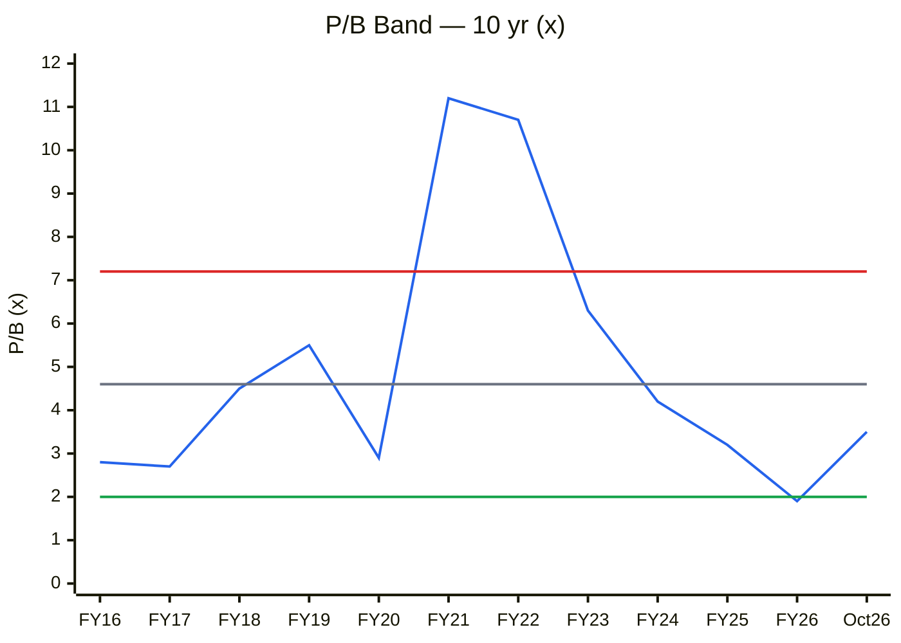
🟦 P/B · ⬜ Median 4.6× · 🟥 +1SD 7.2× · 🟩 −1SD 2.0×

**Read:** On book, the stock sits **below its median (26th percentile)**, and FY26's 1.9× was a decade low. But ROE has fallen from 15–27% to ~8–9%. Justified P/B at a through-cycle ROE of ~14% (Ke 12.5%, g 7%) is **~1.3×**. 3.5× prices an ROE of ~26%.

**Business inference:** The cheap-looking P/B reflects a much larger, lower-returning book: ₹150 Cr of treasury plus ₹466 Cr of plant that has not yet earned its keep. Book value is cheap only if the enlarged asset base earns legacy-like returns, which is the same bet the P/E is making.

### CY4 — Price vs EPS Index (FY16 = 100)

| | FY16 | FY17 | FY18 | FY19 | FY20 | FY21 | FY22 | FY23 | FY24 | FY25 | FY26 | Oct-26 |
|---|---|---|---|---|---|---|---|---|---|---|---|---|
| Price (₹, bonus-adjusted) | 72.6 | 72.4 | 160.8 | 253.5 | 227.7 | 1,097 | 1,244 | 777 | 637 | 565 | 371 | 691 |
| EPS (₹, adjusted; TTM for Oct-26) | 4.85 | 4.27 | 8.39 | 15.84 | 14.19 | 15.16 | 15.29 | 21.96 | 22.09 | 20.07 | 15.95 | 17.19 |

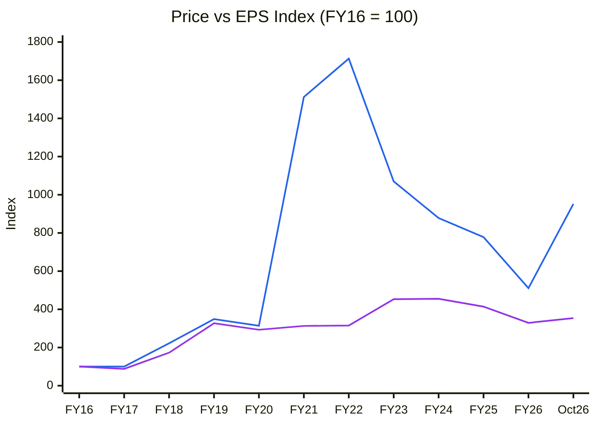
🟦 Price index · 🟪 EPS index

**Read:** Until FY20 price and EPS moved together (both ~3×). In FY21–22 price ran to 17× while EPS stayed at ~3×, then spent four years de-rating back to 5× (FY26) even as EPS rose. Since March 2026, price is up 86% (511 → 952) while TTM EPS rose 8% (329 → 354).

**Business inference:** Paushak's long-run shareholder return (~25% CAGR over 10 years) came from genuine earnings compounding to FY20 and then from a bubble and its unwinding. The 2026 rally is the market re-pricing future EPS off one strong quarter. If the ramp delivers ~₹24 EPS by FY28, today's price is fair. If it doesn't, the 2022–26 de-rating shows how far the multiple can fall.

### C13 — Scenario Targets (2-yr, FY28E EPS × multiple)

| Scenario | Driver | FY28E revenue | EBITDA margin | FY28E EPS | P/E | Target | Prob. |
|---|---|---|---|---|---|---|---|
| Bear | Q1 was lumpy; ramp stalls; China pricing | ₹300 Cr | 25% | ₹13.9 | 22× | **₹305** | 25% |
| Base | Ramp to ~₹370 Cr; margin ~28% | ₹370 Cr | 28% | ₹24.0 | 30× | **₹720** | 50% |
| Bull | Plant full by FY28; CDMO mix lifts margin | ₹450 Cr | 31% | ₹35.5 | 32× | **₹1,135** | 25% |
| **Expected value** | | | | | | **₹720** | |

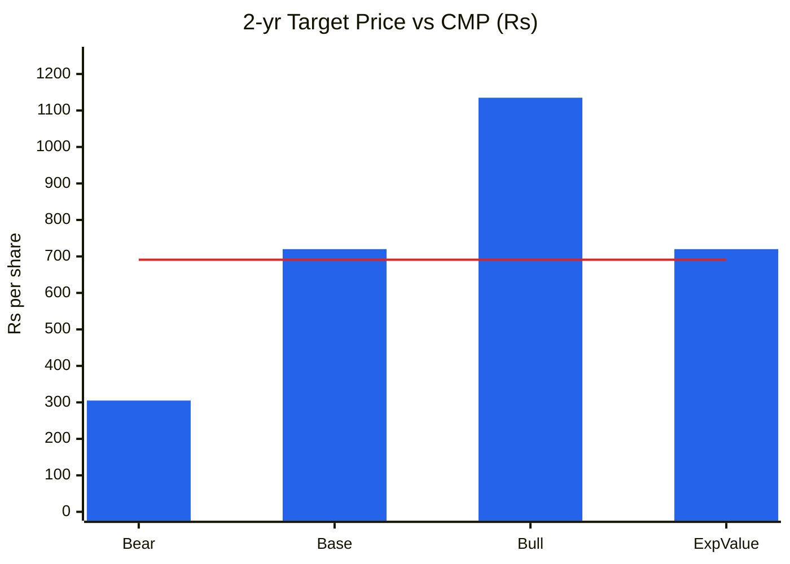
🟦 Scenario price · 🟥 CMP ₹691

**Read:** Expected value **₹720 (+4% over 2 years)**; base +4%; bull +64%; bear −56%. **U/D = 1.15:1**, so the hard stop is triggered. The return comes almost entirely from the bull case.

**Business inference:** At ₹691 the market has priced a successful ramp at a 30× multiple. An investor is paid for the risk only if the plant fills *and* margins improve beyond Q1's mix. The phosgene moat makes the downside less severe than for a commodity chemical, but not small enough to justify a 2:1 skew against the buyer.

### Cycle Position Dashboard

| Dimension | Current | 10-yr median | Percentile | Signal |
|---|---|---|---|---|
| P/E | 39× | 31.1× | 71% | Expensive (vs FY18–20 ~20×) |
| P/B | 3.5× | 4.6× | 26% | Fair (ROE-adjusted: expensive) |
| EBITDA margin | 28–31% | 29% | ~50% | Mid |
| Gross margin | ~65% (Q1) / 79% (FY26) | 75% | Q1 at decade low | Mix diluting |
| ROCE | 8% (FY26) → ~13% (Q1 run-rate) | 20% | 0% → ~15% | Trough, recovering |
| Asset turnover | 0.47× → 0.72× | 1.9× (FY17–26) | 0% | Trough, filling |
| **Overall cycle position** | | | | **EARLY RAMP (operations) · MID-TO-RICH (valuation)** |

**Consistency:** matches Module 1b (neutral → mild tailwind) and Module 1c (early ramp-up). Valuation is ahead of the operating recovery.

**Graham number:** √(22.5 × 5-yr avg EPS ₹19.1 × BV ₹199) = **₹292**. **MoS:** −4% vs relative base, −70% vs base DCF → **Inadequate.**

---

## MODULE 10 — Technical Stage (Weinstein + CANSLIM)
| Item | Reading (Screener, 9 Oct 2026) |
|---|---|
| Price | ₹691; 52-wk ₹342–827 |
| Path | ₹371 (27 Mar) → ₹445 (29 May) → results 30 Jul ₹572 → ₹768 (24 Aug) → ₹661 (29 Sep) → ₹691 |
| 50-DMA / 200-DMA | ₹683 / ₹605; 200-DMA turning up; price 1% / 14% above |
| Volume | ~36k shares/day avg; spike to 83k on 6 Oct |
| RS vs Nifty | Positive over 3 and 6 months (stock +86% from March low vs Nifty −6%) |

**Stage 2 (early), consolidating** after a post-results breakout. Price is holding the 50-DMA and the 200-DMA has turned up. *(The July report's "Stage 3 / early Stage 4" call was invalidated by the Q1 print.)* No fresh entry signal: the stock is mid-range between ₹661 support and ₹785 resistance. **Stop for holders:** weekly close < ₹600 (200-DMA).
**CANSLIM:** C ✓ (Q1 EPS +26% YoY) · A ✗ (3-yr EPS −13% CAGR) · N ✓ (new plant) · S ✓ (2.46 Cr shares, tight float) · L ~ (outperforming, not sector leader) · I ✗ (no institutions) · M ✗ → **3.5 / 7.**

---

## MODULE 11 — Forward View: 2–3 Year Thesis

### Capex classification
| Capex type | FY27E | FY28E | FY29E | In AT model? |
|---|---|---|---|---|
| Growth (completion / debottlenecking) | ~10 | ~10 | ~15 | ✅ |
| Maintenance (≈ depreciation ₹34–38 Cr, partly) | ~20 | ~25 | ~25 | ❌ |
| CWIP ₹26 Cr (FY26) | capitalised FY27 | — | — | ✅ when commissioned |
| **Total** | **~30** | **~35** | **~40** | |

### C14 — Gross Block → Revenue bridge (history + base case)

| ₹ Cr | FY22 | FY23 | FY24 | FY25 | FY26 | FY27E | FY28E | FY29E |
|---|---|---|---|---|---|---|---|---|
| Gross Block | 175 | 190 | 206 | 210 | 466 | 500 | 530 | 560 |
| Revenue | 150 | 212 | 206 | 211 | 219 | 320 | 370 | 420 |
| AT (×) | 0.86 | 1.12 | 1.00 | 1.00 | 0.47 | 0.64 | 0.70 | 0.75 |

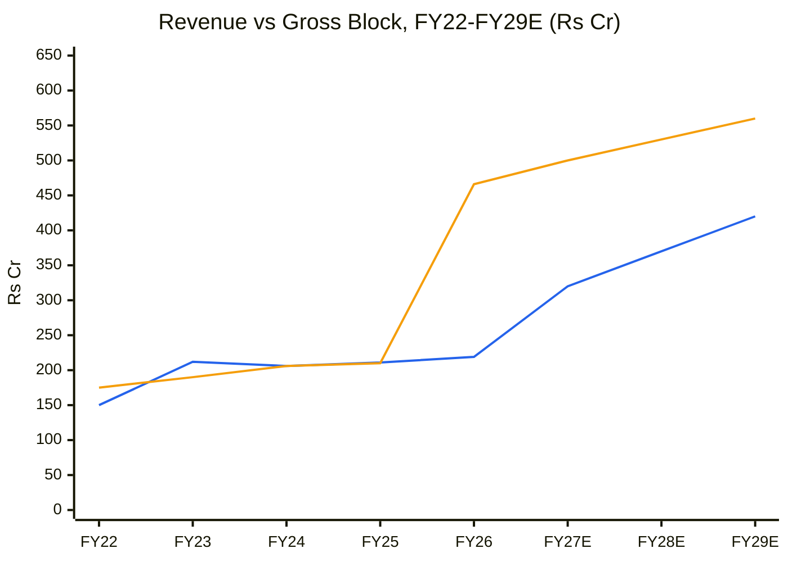
🟦 Revenue · 🟧 Gross block

**Read:** The base case takes revenue from ₹219 Cr to ₹420 Cr (**1.9×**) on a 20% larger gross block. AT recovers to 0.75×, below the FY23–25 ~1.0×. **Incremental ROIC:** ΔRevenue ~₹200 Cr × EBIT margin ~19% × 0.78 ≈ ₹30 Cr NOPAT ÷ (growth capex ~₹270 Cr + WC ~₹70 Cr) ≈ **9%** (≈ 12% excluding WC) **vs WACC 11.5% → value-neutral**. Capex-model revenue CAGR FY26–29: **24%**. PIE implies ~18–20% to FY31, so the market is roughly in line with capacity to FY29 but needs new capex beyond.

**Business inference:** The ramp can plausibly double revenue by FY29, and EPS should follow. Yet the money spent to get there earns only about its cost of capital, because the new products carry less gross margin and lock up more inventory. Paushak is growing bigger rather than more valuable per rupee invested. That is acceptable at a 20–25× multiple and expensive at 40×.

### Base-case earnings
| ₹ Cr | FY27E | FY28E | FY29E |
|---|---|---|---|
| Revenue | 320 | 370 | 420 |
| EBITDA (margin) | 93 (29%) | 104 (28%) | 118 (28%) |
| D&A / Interest / Other income | 34 / 5 / 12 | 36 / 4 / 12 | 38 / 3 / 13 |
| PAT | ~51 | ~59 | ~70 |
| EPS (₹, 2.464 Cr sh) | 20.9 | 24.0 | 28.5 |
| ΔWC (35%) | ~35 | ~18 | ~18 |
| FCF | ≈ +20 | ≈ +40 | ≈ +50 |

**FCF inflection: FY27–FY28.** **Debt:** ₹77 Cr, repayable from FY28 FCF; net treasury positive.

### Key catalysts
1. **Q2 FY27 results (16 Oct 2026):** revenue ≥ ₹80 Cr confirms the step-up; gross margin trend.
2. Inventory days normalising toward ~180 (WC release).
3. Custom-synthesis/CDMO contract announcements (higher-margin fill).
4. Agro restocking extending through FY27.

### Key risks
1. **Q1 was lumpy** (campaign or restocking order) and revenue reverts toward ₹60 Cr per quarter: **Medium**.
2. **Low-margin fill**: gross margin settles at ~60–65%, EBITDA ~25%: **Medium-High**.
3. **De-rating** from 40× toward a mid-20s multiple if ROCE stays in the low teens: **Medium-High**.
4. **Illiquidity** (~36k shares/day, no institutions) amplifies drawdowns: **Medium**.
5. **Phosgene safety/environmental incident**: low probability, high severity.

**Thesis:** A genuine phosgene moat whose new plant is now filling, but with lower-value molecules that earn about the cost of capital. Q1 FY27 moved the business from "will it ramp?" to "at what return?". At ₹691 the price assumes a strong answer to both.

---

## Checklist Summary
**Section 0 (Existing Report Protocol):** ✓ (prior report read; validation table above; renamed via `git mv`)
**Section A (Business Quality):** 14 / 18 (no concalls; scuttlebutt not done; pledge not re-sourced)
**Section B (Forensics):** 8 / 9 · **Section C (Statements):** 11 / 12 · **Section D (KPIs & Peers):** 6 / 7 (export share not disclosed)
**Section E (Market Size & Share):** 5 / 7 · **Section F (Valuation):** 10 / 10 · **Section G (Technical):** 7 / 8
**Section H (Forward View):** 22 / 28 (segment / molecule-level capacity not disclosed)
**Section I (Charts):** 5 / 5 (C9 omitted by rule: promoter holding flat; CY5/CY6 omitted: no sourced industry series; every chart has Read + Business inference)
**Order Book Tracker:** Not applicable (merchant/custom molecule seller; no disclosed order book)
**Hard Stops Triggered:** **Upside/downside < 1.5:1** (1.15:1).

---

## Investment Decision
**Recommendation: WATCHLIST (Quality at Wrong Price).** The U/D hard stop applies at ₹691.
**Conviction Score: 5 / 10** (Cycle 0.6 · Industry 1.0 · Moat 1.5 · Management 0.6 · Financial quality 1.0 · Valuation 0.2 · Technical 0.4; rounded).
**Position size:** 0% now; 1–2% in the buy zone.
**Entry (buy-below):** **₹420–470** (U/D ≥ 2:1 vs ₹720 base / ₹305 bear needs ≤ ₹443; ≈ 18–20× FY28E EPS; ≈ 2.2× book).
**Stop-loss (if owned):** weekly close < ₹600.
**Target (base, 2-yr):** ₹720.
**Review triggers:** *Upgrade* if Q2 and Q3 FY27 revenue ≥ ₹80 Cr with gross margin ≥ 70% and inventory days falling, or a price pullback into the buy zone with the ramp intact. *Downgrade* if Q2 revenue < ₹65 Cr or EBITDA margin < 25%.

**One-line thesis:** The plant is filling, but with cheaper molecules. A real moat, a fair business at mid-20s P/E, and an expensive stock at 40×.

---

## Data Sources & Citations
- [Screener.in — PAUSHAKLTD](https://www.screener.in/company/PAUSHAKLTD/): 12-yr P&L, balance sheet, cash flow, ratios, fixed-asset/expense/borrowing/other-income schedules, shareholding, P/E, P/B, price data (accessed 9 Oct 2026)
- [ScanX — Q1 FY27 results](https://scanx.trade/stock-market-news/companies/paushak-ltd-q1-results-net-profit-rises-26-yoy-to-151-0-million/46959139) · [MarketsMojo — Q1 FY27 analysis](https://www.marketsmojo.com/news/result-analysis/paushak-q1-fy27-stellar-revenue-surge-masks-margin-pressure-and-valuation-concerns-4129289) · [EquityBulls — Q1 FY27](https://www.equitybulls.com/category.php?id=373712)
- [StockPil — markets 5 Oct 2026](https://stockpil.com/india-markets-today-2026-10-05/)
- Peers: Screener.in peer table (9 Oct 2026); BALAMINES_BalajiAmines_2026-10-09.md (Vinati)
- Prior report: PAUSHAKLTD_Paushak_2026-07-30.md (git history), for the moat, Five Forces, Fisher and WTT inputs carried forward

**Remaining data gaps:** pledge status (re-source), export share, new-plant capacity in tonnes, molecule/segment mix, FY26 annual-report KAMs and RPT schedule.

---
*Report generated by Stock Fundamental Analysis Skill v3.3 | Indian Markets Context*
*Save path: C:\Users\anubh\Documents\Anubhav\Stock Analysis\Stock Analysis\*
*DISCLAIMER: For informational purposes only; not investment advice. FY27E–FY31E, DCF and scenario values are the analyst model's estimates.*
