# Stock Analysis Report — Sterlite Technologies Limited (NSE: STLTECH)
**Date:** 2026-10-09
**Analyst:** Claude (Stock Fundamental Analysis Skill v3.3)
**Investment Horizon:** 2–3 Years
**Recommendation:** AVOID at current price → WATCHLIST (buy-below ~₹300–350)
**Conviction Score:** 3.5 / 10

## Revision Log
| Version | Date | Recommendation | Conviction | Price | Key change |
|---|---|---|---|---|---|
| Current | 2026-10-09 | Avoid at CMP → Watchlist (buy ₹300–350) | 3.5/10 | ₹980 | Initial report |

**Validation of previous report:** Initial report (no earlier STLTECH file in the library; STL appeared only as a peer in the HFCL and Bajel reports).

---

## Executive Summary

STL (Sterlite Technologies) makes optical fibre preform, fibre, optical-fibre cable (OFC) and data-centre connectivity products. After demerging its loss-making Global Services business into STL Networks (effective 31 Mar 2025), it is now a focused optical company in the middle of the strongest demand upturn in its history. Q1 FY27 revenue was **₹1,910 Cr (+87% YoY)** with an EBITDA margin of **20.8%** and record PAT of ₹197 Cr. The order book rose **2.4× in one quarter to ₹18,618 Cr**. A ₹1,500 Cr QIP made the company **net-cash (₹483 Cr)**. Since then STL has announced three more hyperscaler/telecom supply agreements and a **$1.2 bn LTSA** (1 Oct 2026). In September it unveiled a "Lakshya" target of **₹20,000 Cr revenue and >27% EBITDA margin by FY29**, backed by a ₹3,000 Cr plan to add ~50% capacity ([Q1 FY27 call](https://stl.tech/wp-content/uploads/2026/07/Transcript-July-24-2026.pdf); [Sahi](https://www.sahi.com/news/sterlite-technologies-approves-3-000-crore-capex-to-boost-capacity-by-50-by-fy29-3280-PE1_COR); [DSIJ](https://insights.dsij.in/appmindshare/sterlite-technologies-shares-hit-5-upper-circuit-as-company-unveils-ambitious-fy29-roadmap-fiis-and-diis-increase-stake-59401)).

**The price has run ahead of the story.** The stock went from **₹176 (30 Mar 2026) to ₹980, 5.6× in six months** (52-week low ₹84.6). It trades at **213× TTM P/E, 21× book (100th percentile of its 10-year range) and ~60× EV/TTM EBITDA**. Every order announced since the demerger is a **framework / long-term supply agreement valued at "prevailing prices"**: 54% of the Q1 FY27 book and ~80% of today's tracked book. On firm orders alone, revenue cover is ~1.5×, not 3.3×. The current price is roughly **15× the FY29 EPS that Lakshya would produce if delivered in full and on time**, so the market is already paying for the target. Even our bull-case DCF (₹526–823) is below the price. Expected 2-year value is **₹782 (−20%)**, and upside/downside is **0.6:1**, which triggers the hard stop.

**What is genuinely good, and why this is still "watch, don't own":** cash conversion is strong (11-year cumulative CFO is 2.9× PAT), the balance sheet is now net cash, the business is vertically integrated and holds 785+ patents, and hyperscalers are signing multi-year supply deals, which is evidence of real supply tightness. These are reasons to follow the stock closely. They are not reasons to pay 21× book for a business whose 10-year median ROCE is 11%.

### C1 — Growth Index: Revenue vs Fixed Assets vs Profit (FY16 = 100)

| ₹ Cr | FY16 | FY17 | FY18 | FY19 | FY20 | FY21 | FY22 | FY23 | FY24 | FY25 | FY26 | 10-yr CAGR |
|---|---|---|---|---|---|---|---|---|---|---|---|---|
| Revenue | 2,144 | 2,449 | 3,177 | 5,087 | 5,154 | 4,825 | 5,437 | 6,925 | 4,083 | 3,996 | 4,745 | 8.3% |
| Gross Block | 1,989 | 2,314 | 2,402 | 3,809 | 4,659 | 5,043 | 5,557 | 5,703 | 5,928 | 5,814 | 6,233 | 12.1% |
| EBITDA | 459 | 519 | 746 | 1,120 | 1,069 | 811 | 665 | 895 | 471 | 416 | 569 | 2.2% |
| PAT | 160 | 218 | 364 | 578 | 424 | 265 | 45 | 127 | −57 | −123 | 56 | n/m |

*Source: Screener.in consolidated; gross block from the fixed-asset schedule (includes ~₹400 Cr intangibles). FY16 is the first year after the power-transmission demerger. **Break in series:** FY19–FY23 revenue includes the asset-light Global Services business (demerged 31 Mar 2025); FY24–FY26 P&L is continuing operations. TTM (Jun 2026): revenue ₹5,642 Cr, EBITDA ₹829 Cr, PAT ₹243 Cr.*

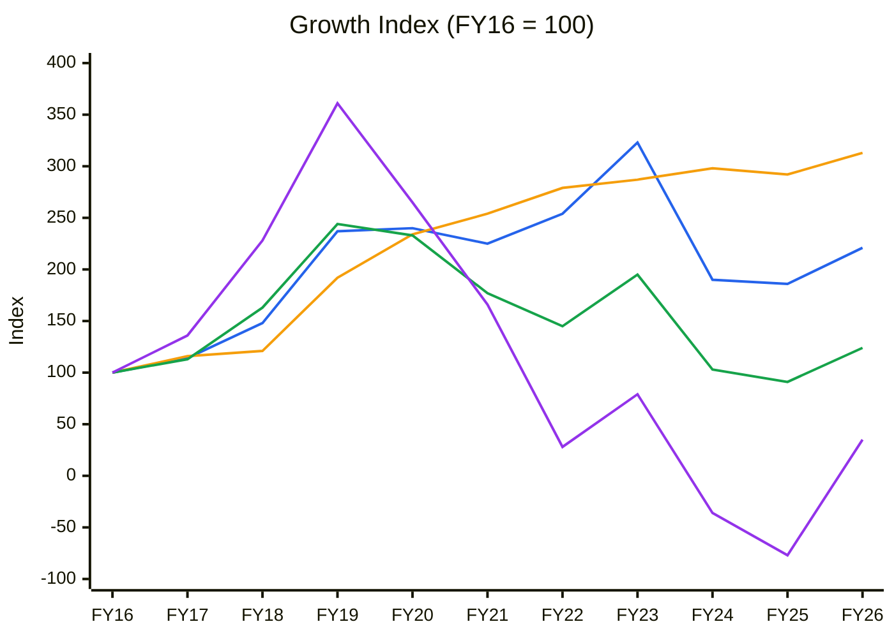
```mermaid
%%{init: {"themeVariables": {"xyChart": {"plotColorPalette": "#2563eb, #f59e0b, #16a34a, #9333ea"}}}}%%
xychart-beta
    title "Growth Index (FY16 = 100)"
    x-axis [FY16, FY17, FY18, FY19, FY20, FY21, FY22, FY23, FY24, FY25, FY26]
    y-axis "Index" -100 --> 400
    line [100, 114, 148, 237, 240, 225, 254, 323, 190, 186, 221]
    line [100, 116, 121, 192, 234, 254, 279, 287, 298, 292, 313]
    line [100, 113, 163, 244, 233, 177, 145, 195, 103, 91, 124]
    line [100, 136, 228, 361, 265, 166, 28, 79, -36, -77, 35]
```
🟦 Revenue (CAGR 8.3%) · 🟧 Gross Block (12.1%) · 🟩 EBITDA (2.2%) · 🟪 PAT (n/m, losses FY24–25)

**Read:** Fixed assets grew **3.1×** in ten years, but EBITDA only **1.24×** and PAT fell. The FY18–FY19 fibre-price peak (🟪 361) was followed by six years in which revenue was propped up by a low-margin services business while EBITDA and PAT collapsed (PAT index −77 in FY25). On continuing operations, FY26 revenue (221) is still well below the gross-block index (313). TTM revenue of ₹5,642 Cr (index 263) is the first sign of the gap closing.

**Business inference:** For a decade, shareholders paid for a large, expensive glass-to-cable asset base that only earned well during the 2017–19 fibre shortage. The diversification into services and acquisitions in between destroyed value and was eventually demerged. The AI-fibre cycle is the first time since FY19 that this plant is being filled. Profit growth now depends on utilisation and fibre pricing, not on further capital, which is why earnings can rise very fast and fall just as fast.

**Order book (Module 7):** ₹18,618 Cr at Q1 FY27 (3.3× TTM revenue) · **firm, ex-framework ~₹8,600 Cr (1.5×)** · implied book-to-bill Q1 FY27 6.9× · tracked book today ~₹35,800 Cr before Q2 execution, ~80% of it framework LTSAs at prevailing prices.

---

## Business Primer

STL makes the full optical chain: it converts silicon into ultra-pure glass preforms, draws them into optical fibre, builds fibre into cables (including high-fibre-count cables for data centres) and sells connectivity products (pre-terminated trunks, MMC assemblies, FTTH kits) that make the fibre usable on site. Its customers are global and Indian telcos, neutral fibre-network builders, government rural-broadband programmes (BharatNet, US BEAD) and, increasingly, hyperscale data-centre operators. North America was 54% of Q1 FY27 revenue, Europe 25% and the rest of the world 22%. Data centres went from ~1% of FY26 revenue to 21% in Q1 FY27, and management expects data centre plus enterprise to reach ~50% in FY27. Revenue is fibre-km volume × price plus a rising "attach rate" of connectivity products (16% of OFC revenue, targeted at 25% by Q4 FY27). Returns depend on two things: keeping very capital-intensive plants full, and global fibre/cable prices, which have historically swung with Chinese capacity.

This is an **asset-heavy, vertically integrated manufacturer of a historically cyclical commodity, now riding a structural (AI data-centre) plus cyclical (supply shortage) upswing**. The key value drivers are volume × price and utilisation. The key risks are the fibre price cycle, concentration in a few hyperscaler customers, raw-material availability (germanium, helium) and US trade policy. One structural feature colours everything. The listed entity has been reshaped twice: power transmission was demerged in FY16 and Global Services in FY25. Long-run financials therefore mix businesses, and only FY24 onward is the "clean" optical company. The equity base has also been diluted by two QIPs (2024 and 2026) and promoter warrants priced at ₹110 against today's ₹980.

**New Segment Protocol:** Telecom Equipment OEM block (line 415 of the KPI reference) covers STL ✓. Top KPIs: order book/revenue, customer concentration, gross margin, CCC.

---

## Module 1 — Broad Market Cycle

Nifty 50 at 22,556 (5 Oct 2026, ~−6% since June), India VIX 14.7, persistent FII selling absorbed by DIIs ([StockPil](https://stockpil.com/india-markets-today-2026-10-05/)). **Verdict: CAUTIOUS.** The broad market is grinding lower while a narrow AI-infrastructure theme (STL, HFCL, cable makers) is in a speculative phase. FIIs have bought STL (4.75% → 19.71% in 11 quarters) while selling India broadly, which makes it a crowded thematic trade.

---

## Module 1b — Sector Cycle: Tailwinds & Headwinds

**Secular:** AI data centres (fibre per rack and per campus rising sharply as GPU links move from 400G to 800G and 1.6T), FTTH (US BEAD, BharatNet), 5G densification. Management cites CRU: global optical-cable demand +8.2% in 2026, data-centre cable demand +63% in 2026, North America 18.6% CAGR to 2030 ([Q1 FY27 call](https://stl.tech/wp-content/uploads/2026/07/Transcript-July-24-2026.pdf)). These are real and multi-year.

**Cyclical:** Optical fibre is a classic capital-cycle industry. Prices spiked in 2017–18 (China shortage), collapsed in 2019–23 (STL's ROCE fell from 30% to 3%) and are tight again in 2025–26. The +87% Q1 growth is **partly secular (data-centre mix, attach rate) and partly cyclical** (utilisation recovering from a weak base and tight supply: "demand now consistently outpacing domestic supply in North America", per the call). Management also said it now has to "pick and choose" orders on capacity, which is a classic late-upcycle signal.

**Supply response is already under way:** STL plans +50% capacity by FY29 (₹3,000 Cr) plus ₹500 Cr/yr of upgrades and debottlenecking, and a $100 mn US connectivity plant. HFCL is expanding fibre from 28 to 34 mn fkm and OFC from 34 to 43 mn fkm. Corning, Prysmian and YOFC are adding AI-fibre capacity. **CY5 (industry capacity vs demand) and CY6 (fibre price cycle) are not charted:** no sourced public time series of fibre-km capacity, demand or price was found, and charts are never built from estimates. Peer valuations stand in for the capital-cycle read.

| Company | CMP | 52-wk low | Multiple of low | P/E | ROCE |
|---|---|---|---|---|---|
| STL | ₹980 | ₹84.6 | **11.6×** | 213× | 7.7% |
| HFCL | ₹258 | ₹59.8 | 4.3× | 68.5× | 10.8% |
| Birla Cable | ₹359 | ₹104 | 3.5× | 23.3× | 8.9% |
| Vindhya Telelinks | ₹2,777 | ₹960 | 2.9× | 14.0× | 8.2% |

*Source: Screener.in, 9 Oct 2026 (HFCL and Vindhya from the HFCL report of the same date).* Every listed Indian fibre/cable name has tripled or more in a year **while sector ROCE is still single-digit**. That is the Chancellor "capital floods in" phase.

**Raw-material and trade risk:** germanium and helium prices are up "significant multiples" (CFO, Q1 call) and are holding gross margin flat despite a richer mix. US tariffs on Indian imports were flagged as a headwind in Q2 FY26 ([ScanX](https://scanx.trade/stock-market-news/earnings/sterlite-technologies-reports-q2-fy26-results-revenue-growth-amid-us-tariff-challenges/25020447)). The South Carolina connectivity facility is a partial hedge. **Net FX:** ~80% of revenue is ex-India, so STL has a long-USD/EUR exposure and benefits from INR weakness.

**Sector cycle verdict: STRONG TAILWIND (12–24 months), late-stage in valuation terms.** Do not embed FY27's growth as durable. The durable baseline is **~12–15% revenue growth** (data-centre fibre plus FTTH at 8–19% CAGR, plus attach-rate gains).

---

## Module 1c — Stock Cycle: Company Positioning

### C2 — Quarterly YoY Growth

| Quarter | Q1FY25 | Q2FY25 | Q3FY25 | Q4FY25 | Q1FY26 | Q2FY26 | Q3FY26 | Q4FY26 | Q1FY27 |
|---|---|---|---|---|---|---|---|---|---|
| Revenue (₹ Cr) | 872 | 1,074 | 998 | 1,052 | 1,019 | 1,034 | 1,257 | 1,441 | 1,910 |
| Revenue YoY % | — | — | — | — | +16.9 | −3.7 | +26.0 | +37.0 | +87.4 |
| EBITDA (₹ Cr) | 64 | 117 | 106 | 125 | 132 | 129 | 120 | 195 | 385 |
| EBITDA YoY % | — | — | — | — | +106 | +10 | +13 | +56 | +192 |
| OPM % | 7 | 11 | 11 | 12 | 13 | 12 | 10 | 14 | 20 |

*Source: Screener.in quarterly (consolidated, continuing operations; company-reported Q1 FY27 EBITDA is ₹397 Cr). FY24 quarters are not on a comparable continuing-ops basis, so YoY starts at Q1 FY26.*

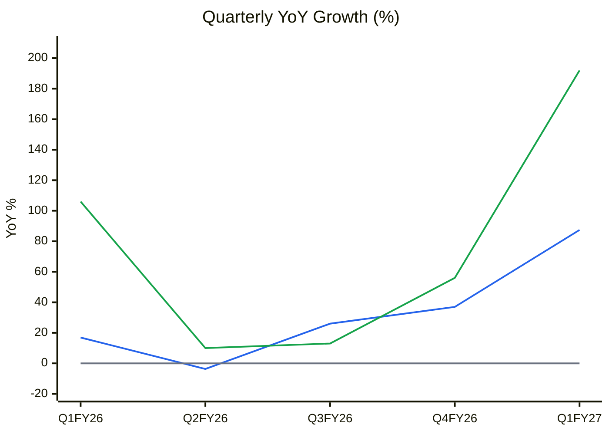
```mermaid
%%{init: {"themeVariables": {"xyChart": {"plotColorPalette": "#2563eb, #16a34a, #6b7280"}}}}%%
xychart-beta
    title "Quarterly YoY Growth (%)"
    x-axis [Q1FY26, Q2FY26, Q3FY26, Q4FY26, Q1FY27]
    y-axis "YoY %" -20 --> 210
    line [16.9, -3.7, 26.0, 37.0, 87.4]
    line [106, 10, 13, 56, 192]
    line [0, 0, 0, 0, 0]
```
🟦 Revenue YoY % · 🟩 EBITDA YoY % · ⬜ zero line

**Read:** Growth has **accelerated for three straight quarters** (−4% → +26% → +37% → +87%), and EBITDA growth is running at about 2× revenue growth, which is operating leverage on a fixed-cost plant. Q1 FY27 also had a soft base (Q1 FY26 ₹1,019 Cr). The Q2 FY27 executable book (₹2,228 Cr) points to another quarter above ₹2,000 Cr.

**Business inference:** STL has moved from fighting for volume to rationing capacity. That is the best phase of a manufacturing cycle: price, mix and utilisation all improve together, and every extra rupee of revenue carries a high margin. It is also the phase that attracts new capacity across the industry. YoY growth will peak within 2–3 quarters as the base catches up, and the market will then judge STL on margins and order conversion rather than growth.

### Capacity and utilisation
Utilisation is "around 70%" and rising quarter on quarter (company does not disclose a figure; [DSIJ](https://insights.dsij.in/appmindshare/sterlite-technologies-shares-hit-5-upper-circuit-as-company-unveils-ambitious-fy29-roadmap-fiis-and-diis-increase-stake-59401)). The Q1 FY27 run-rate of ~₹7,600 Cr/yr at ~70% implies **~₹10,900 Cr of revenue at full utilisation** on today's capacity and today's prices. With +50% capacity by FY29, the ceiling is **~₹14,700–16,400 Cr at 90–100% utilisation**. Lakshya's ₹20,000 Cr therefore needs **another ~25–35% from price/mix** (attach rate, DC products) or capacity that has not been announced. See the physical plausibility check in Module 9.

### Operating leverage
Q1 FY27 vs Q1 FY26: revenue +87%, EBITDA +192% → **DOL ≈ 2.2×** at the EBITDA line. Interest is now small (₹55 Cr/qtr, falling after the QIP), so DFL is ≈ 1.1. A 15% price reversal at today's cost base would take EBITDA margin back to ~10–12%, the FY24–26 level.

### CY7 — EBITDA Margin & ROCE vs their own cycle

| | FY16 | FY17 | FY18 | FY19 | FY20 | FY21 | FY22 | FY23 | FY24 | FY25 | FY26 | Q1FY27 |
|---|---|---|---|---|---|---|---|---|---|---|---|---|
| EBITDA margin % | 21 | 21 | 23 | 22 | 21 | 17 | 12 | 13 | 12 | 10 | 12 | 20 |
| ROCE % | 8 | 20 | 27 | 30 | 19 | 12 | 8 | 11 | 3 | 3 | 8 | — |

EBITDA margin: 10-yr median 17%, SD 4.7 → band 12.3–21.7%. ROCE: median 11%, SD 8.8 → band 2.2–19.8%.

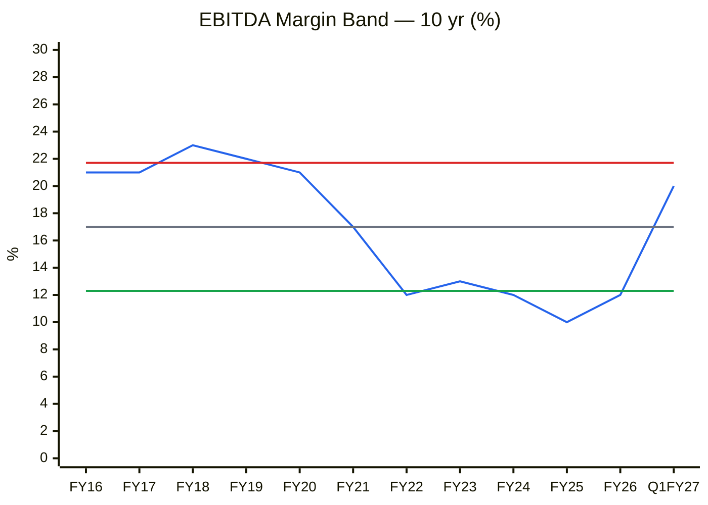
```mermaid
%%{init: {"themeVariables": {"xyChart": {"plotColorPalette": "#2563eb, #6b7280, #dc2626, #16a34a"}}}}%%
xychart-beta
    title "EBITDA Margin Band — 10 yr (%)"
    x-axis [FY16, FY17, FY18, FY19, FY20, FY21, FY22, FY23, FY24, FY25, FY26, Q1FY27]
    y-axis "%" 0 --> 30
    line [21, 21, 23, 22, 21, 17, 12, 13, 12, 10, 12, 20]
    line [17, 17, 17, 17, 17, 17, 17, 17, 17, 17, 17, 17]
    line [21.7, 21.7, 21.7, 21.7, 21.7, 21.7, 21.7, 21.7, 21.7, 21.7, 21.7, 21.7]
    line [12.3, 12.3, 12.3, 12.3, 12.3, 12.3, 12.3, 12.3, 12.3, 12.3, 12.3, 12.3]
```
🟦 EBITDA margin · ⬜ Median 17% · 🟥 +1SD 21.7% · 🟩 −1SD 12.3%

**Read:** Q1 FY27's 20% margin is back near the top of the 10-year band (≈ 80th percentile), close to the FY16–FY20 levels of 21–23% earned in the last fibre upcycle. FY22–FY26 sat at or below −1SD. Management's 23% FY27 guidance would sit above +1SD, and Lakshya's >27% would be a decade high by 4 points.

**Business inference:** STL has done this before: 21–23% margins in FY17–FY20, then a collapse when Chinese capacity reset prices. The new elements are data-centre mix and connectivity attach, which plausibly lift the through-cycle margin by a few points. They do not remove the cycle. Valuation should anchor on ~17–19% through-cycle EBITDA, not on the 23–27% that management is targeting at the top of the upturn.

**Stock cycle classification: MID-TO-LATE UPCYCLE.** Revenue is accelerating, margins are back at prior-peak levels, capacity is being added, orders are being rationed and the sector is re-rating as a group. Per the framework: +5–10pp wider MoS and smaller position size.

### FCF inflection
FY26 FCF was +₹344 Cr (CFO 520 − capex 193 + other). FY27–FY29 capex steps up to ~₹700–1,200 Cr/yr (₹3,000 Cr expansion plus ₹500 Cr/yr upgrades, partly overlapping), so FCF stays positive but thin (~₹250–550 Cr/yr in the base case). **FCF inflection: FY30**, once the expansion is commissioned.

**Guidance accuracy:** see Module 4 (WTT 0.75, MODERATE on a short sample).

---

## Module 2 — Industry Structure & Capital Cycle

**Five Forces:** entry barriers **moderate-high** (preform technology and scale; only a handful of integrated players outside China), supplier power **rising** (germanium and helium are concentrated and price-volatile), buyer power **high** (hyperscalers and telcos buy on allocation contracts with capped penalties and tender competitively), substitutes **low** (copper loses at 800G+; fibre is the only medium), rivalry **high but currently muted by shortage** (Corning, Prysmian, Fujikura, YOFC, HFCL). **Verdict: Neutral.** Demand is excellent, but structure caps through-cycle returns. STL's 10-year median ROCE of 11% is below a ~12% WACC.

**Capital cycle:** STL's capex/depreciation was 1.8, 1.3, 2.5, 4.3, 1.4, 1.6, 2.2, 1.2, 0.9, 0.4, 0.6× over FY16–FY26, a disciplined trough since FY23. It now steps up to ~2–3× (₹3,000 Cr over three years against ~₹320 Cr/yr depreciation). Peers are expanding at the same time, and sector equity windows are open (STL QIP ₹1,500 Cr at ₹583 in July 2026). **Signal: capital flooding in. Returns are excellent for now, with a deterioration phase likely in 2–3 years when FY28–FY29 capacity lands.** *(CY8 industry chart not built: peer capex series not compiled.)*

---

## Module 3 — Business Quality & Moat

**Greenwald:** (1) cost advantage **partial**: full glass-to-gigabit integration and claimed lowest-cost producer in India, but not cost leader vs Chinese majors; (2) customer captivity **partial and rising**: hyperscaler qualification (US Conec MMC certification), multi-year allocation LTSAs and specialty cables (Celesta high-density; the European patent dispute with Fujikura was won in 2026) create stickiness, while telecom OFC remains tendered; (3) local scale **moderate**: 9% global ex-China OFC share, #1 Indian integrated player. **Buffett 10% price test: Fail historically** (margins collapsed 2019–25), currently passing only because of the shortage. **Moat: NARROW, widening in data-centre connectivity.**

### C4 — Margin trend

| % | FY16 | FY17 | FY18 | FY19 | FY20 | FY21 | FY22 | FY23 | FY24 | FY25 | FY26 |
|---|---|---|---|---|---|---|---|---|---|---|---|
| Gross margin (1 − material %) | 55 | 59 | 60 | 51 | 52 | 50 | 49 | 52 | 59 | 50 | 50 |
| EBITDA margin | 21 | 21 | 23 | 22 | 21 | 17 | 12 | 13 | 12 | 10 | 12 |
| PAT margin | 7.5 | 8.9 | 11.5 | 11.4 | 8.2 | 5.5 | 0.8 | 1.8 | −1.4 | −3.1 | 1.2 |

*Source: Screener.in expense schedule. FY24 gross margin is distorted by the mixed restated P&L.*

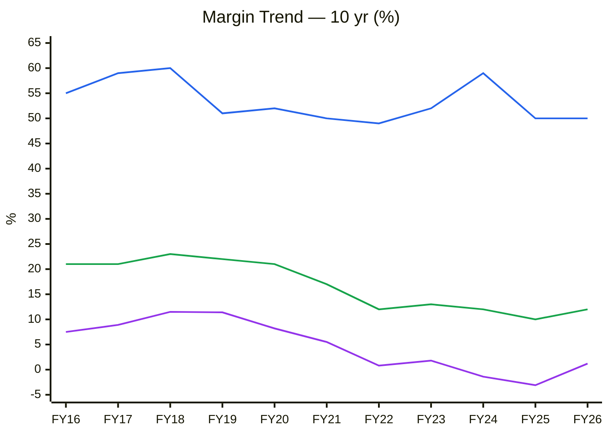
```mermaid
%%{init: {"themeVariables": {"xyChart": {"plotColorPalette": "#2563eb, #16a34a, #9333ea"}}}}%%
xychart-beta
    title "Margin Trend — 10 yr (%)"
    x-axis [FY16, FY17, FY18, FY19, FY20, FY21, FY22, FY23, FY24, FY25, FY26]
    y-axis "%" -5 --> 65
    line [55, 59, 60, 51, 52, 50, 49, 52, 59, 50, 50]
    line [21, 21, 23, 22, 21, 17, 12, 13, 12, 10, 12]
    line [7.5, 8.9, 11.5, 11.4, 8.2, 5.5, 0.8, 1.8, -1.4, -3.1, 1.2]
```
🟦 Gross margin · 🟩 EBITDA margin · 🟪 PAT margin

**Read:** Gross margin stayed around 50% after FY19 while EBITDA margin halved (23% → 10–12%) and PAT margin went to zero. Costs below gross profit (manufacturing overhead, employee cost at 13–18% of sales, interest of ₹220–310 Cr/yr and depreciation of ~₹310 Cr) absorbed everything. Q1 FY27's 20% EBITDA and 10% PAT margin came with *flat* gross margin.

**Business inference:** STL's profit problem was never the price of each kilometre of fibre. It was under-used plant and a heavy, debt-funded cost base. That makes the upturn very profitable: fill the plant, retire the debt, and most incremental gross profit drops to PAT. The same leverage works in reverse, so the earnings base is fragile if volumes or prices slip.

**Fisher 15-point (summary):** ~29/45. Strong on R&D (785+ patents, hollow-core and multi-core fibre), market potential and product development. Weak on long-range profit orientation (FY19–FY24 diversification), cost control and dilution (Point 13). Point 15 integrity: **Pass** (no SEBI or auditor issues surfaced; two Big-4 auditors).

---

## Module 4 — Management & Capital Allocation

### C9 — Promoter & institutional holding (12 quarters)

| % | Dec23 | Mar24 | Jun24 | Sep24 | Dec24 | Mar25 | Jun25 | Sep25 | Dec25 | Mar26 | Jun26 | Jul26 |
|---|---|---|---|---|---|---|---|---|---|---|---|---|
| Promoters | 53.99 | 53.98 | 44.18 | 44.17 | 44.17 | 44.16 | 44.41 | 44.46 | 44.45 | 44.44 | 44.52 | 42.29 |
| FIIs | 4.75 | 5.02 | 7.77 | 8.36 | 8.71 | 7.28 | 6.74 | 11.28 | 10.93 | 11.47 | 18.22 | 19.71 |
| DIIs | 1.96 | 2.00 | 11.73 | 10.69 | 9.42 | 11.60 | 11.33 | 10.79 | 11.04 | 10.84 | 11.43 | 13.27 |

*Source: Screener.in shareholding (Jul 2026 = post-QIP filing).*

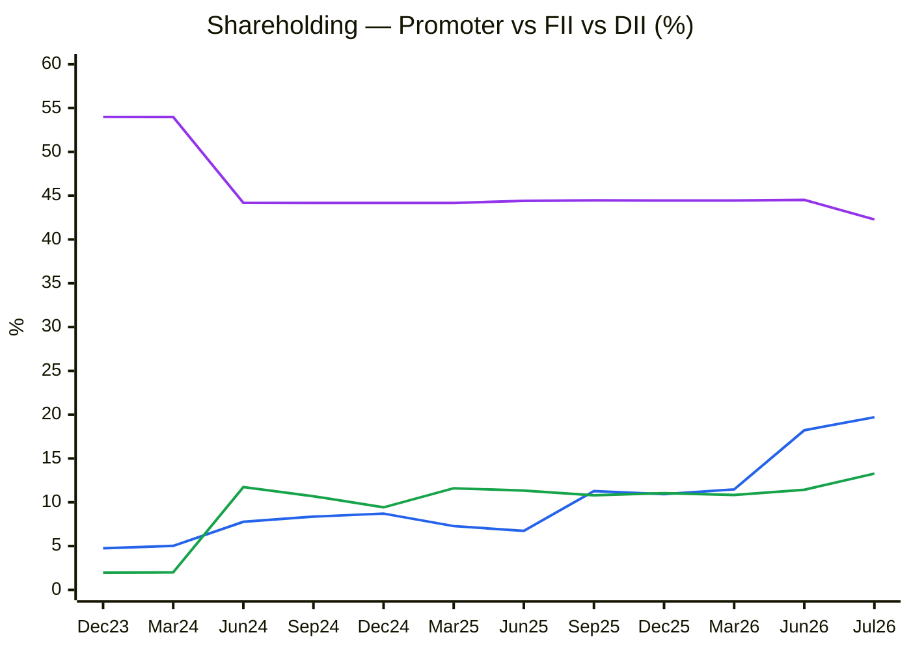
```mermaid
%%{init: {"themeVariables": {"xyChart": {"plotColorPalette": "#9333ea, #2563eb, #16a34a"}}}}%%
xychart-beta
    title "Shareholding — Promoter vs FII vs DII (%)"
    x-axis [Dec23, Mar24, Jun24, Sep24, Dec24, Mar25, Jun25, Sep25, Dec25, Mar26, Jun26, Jul26]
    y-axis "%" 0 --> 60
    line [53.99, 53.98, 44.18, 44.17, 44.17, 44.16, 44.41, 44.46, 44.45, 44.44, 44.52, 42.29]
    line [4.75, 5.02, 7.77, 8.36, 8.71, 7.28, 6.74, 11.28, 10.93, 11.47, 18.22, 19.71]
    line [1.96, 2.00, 11.73, 10.69, 9.42, 11.60, 11.33, 10.79, 11.04, 10.84, 11.43, 13.27]
```
🟪 Promoters · 🟦 FIIs · 🟩 DIIs

**Read:** The promoter stake fell by ~10pp in Jun 2024 when the ₹1,000 Cr QIP placed ~9 Cr new shares with institutions, and by another 2.2pp in Jul 2026 after the ₹1,500 Cr QIP at ₹583. There were no open-market promoter sales. Institutions went from 6.7% to **33%**, and FIIs quadrupled. Promoter pledge is **nil** (released by Twin Star Overseas). In March 2026 the board allotted **4.53 Cr warrants to the promoter at ₹110** (₹498 Cr; [Arihant](https://www.arihantcapital.com/company-information/companynewsdetails/25040010088)), which takes the promoter to ~47–48% on full conversion.

**Business inference:** STL repaired its balance sheet with other people's equity: two QIPs plus promoter warrants turned a levered company into a net-cash one. That was the right call, and the promoter is buying in (warrants rather than selling), which is a genuine conviction signal. But the warrants were priced at ₹110, and the stock was ₹980 seven months later. Minorities are effectively paying the promoter ~₹3,900 Cr of value on conversion (4.53 Cr × ₹870). Today's register is also dominated by momentum money that arrived late (FII 11.5% → 19.7% in two quarters).

| Item | Reading |
|---|---|
| Pledge | **Nil** (Mar 2026 onward) |
| Dilution | Shares 39.5 Cr (FY16) → 51.4 Cr today → ~55.9 Cr with warrants (**+42%**) |
| Dividend | Nil since FY24 (paid 25–33% payout FY17–FY23) |
| Capital allocation (10 yrs) | Acquisitions and services build-out (Elitecore, Metallurgica, Clearcomm, global services, ~₹1,000+ Cr into subsidiaries FY16–FY22) earned below cost and ended in demerger. ROCE fell from 30% to 3%. **Rating: Poor (history) → Improving (FY25 onward)** |
| RPT / ICD | No adverse items surfaced in public summaries (annual report RPT schedule not reviewed: data gap) |
| Three C's | Candor ✓ (discloses order book by execution timing, litigation updates) · Competence ~ (technology ✓, capital allocation ✗) · Caring ~ (warrants at a deep discount) |

### Walk-the-Talk Scorecard

| Quarter guided | Statement | Guided | Actual | Verdict |
|---|---|---|---|---|
| Q4 FY26 call | EBITDA margin 20% by end FY27 | 20% by Q4 FY27 | 20.8% in Q1 FY27 | ✅ (beat) |
| FY26 calls | Become net-debt-free during FY27 | FY27 | Net cash ₹483 Cr by Jun 2026 (QIP-funded) | ✅ |
| Q4 FY26 call | DC + enterprise ~30% of FY27 revenue | 30% | DC alone 21% in Q1; guidance raised to ~50% | ✅ (beat) |
| Q2 FY26 call | Q3 FY26 executable book ₹820 Cr | — | Revenue ₹1,257 Cr (book is a floor, not guidance) | ⚠️ Not a guidance point |
| FY19–FY22 (historical) | Services/solutions-led growth to raise returns | ROCE up | ROCE 30% → 3%; business demerged | ❌ |
| Q1 FY27 call | Attach rate >20% from Q2, 25% by Q4 FY27 | 25% | Pending | — |

**WTT Score: 0.75 / 1.00 → MODERATE** (3 hits, 1 historical miss; short sample, as recent guidance is mostly qualitative and management does not guide revenue). **Pattern:** delivers on margins and balance sheet. The FY19–FY24 strategic record was poor. **Insider action:** promoter warrant subscription at ₹110 (bullish on conviction, dilutive in price). **DCF impact:** Lakshya (₹20,000 Cr FY29) is treated as the bull case only; base case revenue haircut ~35%. **Credibility: MODERATE.**

---

## Module 5 — Financial Forensics

| Test | Result |
|---|---|
| CFO vs PAT | 11-yr cumulative CFO ₹5,868 Cr vs PAT ₹2,057 Cr (**2.9×**). Healthy, helped by ~₹310 Cr/yr D&A and supplier credit |
| Sloan accrual (CF, FY26) | (56 − 520 + 485) / avg TA 5,867 = **+0.4%** → clean |
| Beneish M (FY26, est.) | DSRI ~1.09, TATA −0.07 (CFO ≫ PAT) → estimated **< −2.2 (unlikely manipulator)** |
| Altman Z'' (FY26) | ~2.2 (grey) pre-QIP; **> 2.6 (safe) post-QIP** with net cash |
| Piotroski F (FY26) | ~7/9 (back to profit, CFO > NI, AT up; gross margin flat) |
| Payables | 188–472 days historically (includes LC acceptances, i.e. supplier credit acting as quasi-debt); 204 days FY26 |
| Tax rate | Erratic (54%, 40%, 48% in profit years): losses in subsidiaries not tax-deductible |
| Contingent liabilities | GST demands (Goa ₹5.5 Cr; MP demand passed to STL Networks per demerger). Annual-report KAMs not reviewed (data gap) |
| Auditor | Two Big-4 auditors; no qualification surfaced |

### C7 — Cumulative PAT vs CFO vs FCF (₹ Cr)

| | FY16 | FY17 | FY18 | FY19 | FY20 | FY21 | FY22 | FY23 | FY24 | FY25 | FY26 |
|---|---|---|---|---|---|---|---|---|---|---|---|
| Cum. PAT | 160 | 378 | 742 | 1,320 | 1,744 | 2,009 | 2,054 | 2,181 | 2,124 | 2,001 | 2,057 |
| Cum. CFO | 215 | 703 | 1,432 | 2,063 | 2,759 | 3,397 | 3,981 | 4,209 | 5,000 | 5,348 | 5,868 |
| Cum. FCF (CFO − capex) | −9 | 267 | 540 | 368 | 681 | 865 | 857 | 736 | 1,280 | 1,506 | 1,850 |

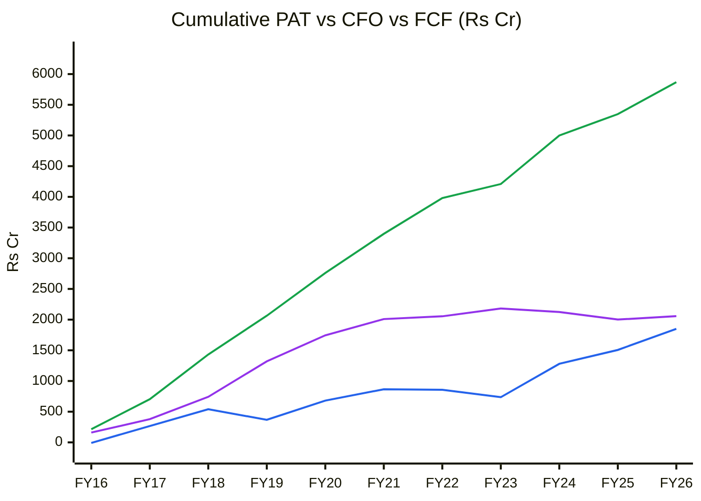
```mermaid
%%{init: {"themeVariables": {"xyChart": {"plotColorPalette": "#9333ea, #16a34a, #2563eb"}}}}%%
xychart-beta
    title "Cumulative PAT vs CFO vs FCF (Rs Cr)"
    x-axis [FY16, FY17, FY18, FY19, FY20, FY21, FY22, FY23, FY24, FY25, FY26]
    y-axis "Rs Cr" -200 --> 6400
    line [160, 378, 742, 1320, 1744, 2009, 2054, 2181, 2124, 2001, 2057]
    line [215, 703, 1432, 2063, 2759, 3397, 3981, 4209, 5000, 5348, 5868]
    line [-9, 267, 540, 368, 681, 865, 857, 736, 1280, 1506, 1850]
```
🟪 Cumulative PAT · 🟩 Cumulative CFO · 🟦 Cumulative FCF (CFO − capex)

**Read:** Operating cash has run well **ahead** of reported profit every year (cumulative CFO/PAT 2.9×), the opposite of HFCL's 0.42. Cumulative FCF of ₹1,850 Cr is smaller than cumulative **interest paid of ~₹2,180 Cr** (FY16–FY26), and ~₹1,000+ Cr more went into acquisitions and subsidiaries.

**Business inference:** STL's earnings are real and cash-backed, so accounting quality is not the problem. Capital allocation is. For a decade, the cash the plant produced went to lenders and to acquisitions that were later written down or demerged, not to shareholders. Now that the debt has been cleared with equity, upturn cash flow can finally reach equity holders, which is a genuine change from the past.

### C8 — Working-capital days

| Days | FY16 | FY17 | FY18 | FY19 | FY20 | FY21 | FY22 | FY23 | FY24 | FY25 | FY26 |
|---|---|---|---|---|---|---|---|---|---|---|---|
| Debtor | 121 | 102 | 100 | 97 | 111 | 110 | 115 | 96 | 143 | 75 | 82 |
| Inventory | 78 | 122 | 97 | 87 | 67 | 95 | 121 | 92 | 178 | 134 | 139 |
| Payable | 141 | 164 | 188 | 281 | 212 | 296 | 319 | 238 | 472 | 188 | 204 |
| CCC | 57 | 60 | 8 | −97 | −34 | −91 | −83 | −50 | −151 | 22 | 16 |

*Source: Screener.in ratios. FY24 is distorted (restated P&L against a pre-demerger balance sheet).*

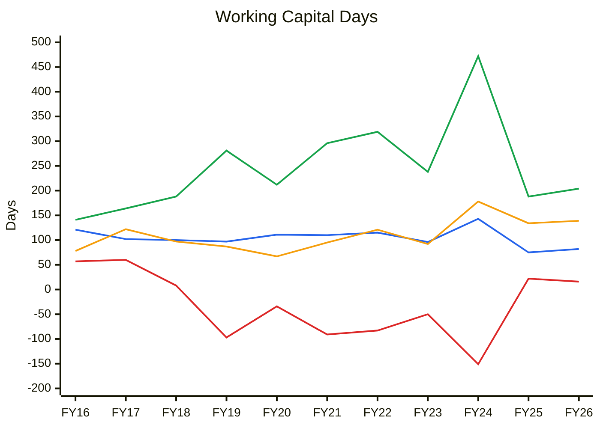
```mermaid
%%{init: {"themeVariables": {"xyChart": {"plotColorPalette": "#2563eb, #f59e0b, #16a34a, #dc2626"}}}}%%
xychart-beta
    title "Working Capital Days"
    x-axis [FY16, FY17, FY18, FY19, FY20, FY21, FY22, FY23, FY24, FY25, FY26]
    y-axis "Days" -200 --> 500
    line [121, 102, 100, 97, 111, 110, 115, 96, 143, 75, 82]
    line [78, 122, 97, 87, 67, 95, 121, 92, 178, 134, 139]
    line [141, 164, 188, 281, 212, 296, 319, 238, 472, 188, 204]
    line [57, 60, 8, -97, -34, -91, -83, -50, -151, 22, 16]
```
🟦 Debtor days · 🟧 Inventory days · 🟩 Payable days · 🟥 Cash conversion cycle

**Read:** From FY19 to FY23, payables of 210–320 days pushed the CCC *negative*, because suppliers and LC acceptances financed the services build-out. After the demerger, payables normalised to ~190–200 days and CCC is ~+20 days. Debtor days (75–82) are the best in a decade, and inventory (~139 days) is the one line to watch as the company stocks germanium and builds for LTSAs.

**Business inference:** Working capital is a strength, not a trap. Customers pay in under three months and suppliers still fund most inventory, so growth needs relatively little cash (~12% of incremental revenue). This is the main operational difference from HFCL and is why STL can fund a ₹3,000 Cr expansion largely from internal cash. The risk is the reliance on supplier credit: if acceptances tighten, the CCC could jump by 50–100 days.

**Forensic verdict: MINOR CONCERNS.** Earnings are cash-backed. The flags are erratic tax, heavy reliance on supplier credit, and past acquisition write-downs. **Red-flag count 2/15**, so no hard stop.

---

## Module 6 — Earnings Quality & Financial Statements

**ROIC:** FY26 EBIT ₹331 Cr × 0.75 = NOPAT ₹248 Cr ÷ invested capital (equity 2,268 + debt 1,942 − cash 323 − investments 467) ₹3,420 Cr = **7.3%**. TTM: EBIT ₹580 Cr → NOPAT ₹435 Cr ÷ post-QIP IC ~₹2,950 Cr = **~15%**. Q1 FY27 annualised: ~**30%+**. **WACC ~12%.** ROIC has crossed WACC only in the last two quarters.

### C5 — ROCE vs WACC

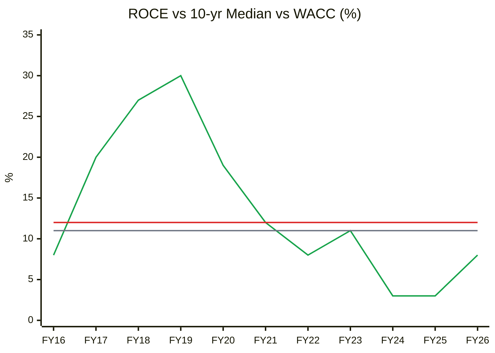
```mermaid
%%{init: {"themeVariables": {"xyChart": {"plotColorPalette": "#16a34a, #6b7280, #dc2626"}}}}%%
xychart-beta
    title "ROCE vs 10-yr Median vs WACC (%)"
    x-axis [FY16, FY17, FY18, FY19, FY20, FY21, FY22, FY23, FY24, FY25, FY26]
    y-axis "%" 0 --> 35
    line [8, 20, 27, 30, 19, 12, 8, 11, 3, 3, 8]
    line [11, 11, 11, 11, 11, 11, 11, 11, 11, 11, 11]
    line [12, 12, 12, 12, 12, 12, 12, 12, 12, 12, 12]
```
🟩 ROCE (pre-tax, Screener) · ⬜ 10-yr median 11% · 🟥 WACC 12%

**Read:** ROCE was above WACC in only **5 of 11 years** (FY17–FY21) and below it every year from FY22 to FY26 (3–11%). The 10-year median (11%) sits below WACC. On TTM and Q1 FY27 run-rate earnings, ROCE is back to 15–30%, i.e. FY18–FY19-style peak returns.

**Business inference:** Over a full cycle STL has not earned its cost of capital, so it has no proven moat in returns. It earns excess returns only when fibre is scarce. The current spike may last longer than the 2018 one because of data-centre demand, but a price that assumes 25–30% ROCE is permanent is betting on a cycle that STL's own history says ends.

### C6 — Asset Turnover (Revenue / Gross Block)

| | FY16 | FY17 | FY18 | FY19 | FY20 | FY21 | FY22 | FY23 | FY24 | FY25 | FY26 | TTM |
|---|---|---|---|---|---|---|---|---|---|---|---|---|
| AT (×) | 1.08 | 1.06 | 1.32 | 1.34 | 1.11 | 0.96 | 0.98 | 1.21 | 0.69 | 0.69 | 0.76 | 0.91 |

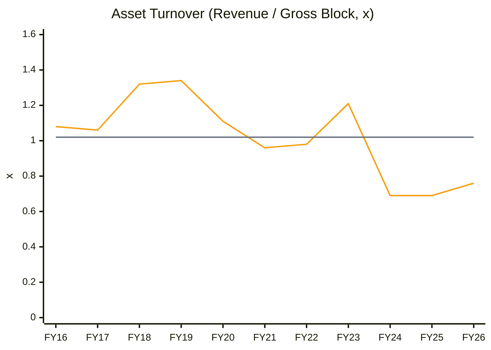
```mermaid
%%{init: {"themeVariables": {"xyChart": {"plotColorPalette": "#f59e0b, #6b7280"}}}}%%
xychart-beta
    title "Asset Turnover (Revenue / Gross Block, x)"
    x-axis [FY16, FY17, FY18, FY19, FY20, FY21, FY22, FY23, FY24, FY25, FY26]
    y-axis "x" 0 --> 1.6
    line [1.08, 1.06, 1.32, 1.34, 1.11, 0.96, 0.98, 1.21, 0.69, 0.69, 0.76]
    line [1.02, 1.02, 1.02, 1.02, 1.02, 1.02, 1.02, 1.02, 1.02, 1.02, 1.02]
```
🟧 AT · ⬜ 10-yr average 1.02×

**Read:** On continuing operations, AT bottomed at **0.69× (FY24–25)**. FY19–FY23 readings were flattered by asset-light services revenue. TTM is back to 0.91×, and the Q1 FY27 run-rate gives ~1.2×, near the FY18–FY19 peak.

**Business inference:** This is a business that needs roughly ₹1 of plant per ₹1 of annual revenue, so growth is capital-hungry unless it comes from price. The current jump in AT is mostly utilisation and price on existing plant, which is the cheapest growth STL will ever have. The ₹3,000 Cr expansion will push AT back toward ~1.1–1.3× at best. Module 11 uses ~1.3× for FY28–29, an AT that STL has reached only at the top of a cycle.

### DuPont (summary, FY22–FY26; FY24 mixed basis)
| Year | EBIT margin | AT (Rev/TA) | Equity mult. | Interest burden | Tax burden | ROE |
|---|---|---|---|---|---|---|
| FY22 | 6.2% | 0.62 | 4.46 | 0.29 | 0.46 | 2.3% |
| FY23 | 7.5% | 0.79 | 4.21 | 0.40 | 0.60 | 6.1% |
| FY24 | 5.7% | 0.49 | 4.09 | n/m (loss) | n/m | −2.8% |
| FY25 | 2.1% | 0.73 | 2.74 | n/m (loss) | n/m | −6.2% |
| FY26 | 7.0% | 0.75 | 2.77 | 0.32 | 0.52 | 2.5% |

**Verdict:** ROE was crushed by the **interest burden** (interest absorbed 60–70% of EBIT) on top of a thin EBIT margin. Leverage was high (equity multiplier > 4×) and was *not* producing returns. Post-demerger and post-QIP, the multiplier is ~2.8× and falling, so **financing now turns from a drag into a tailwind** and operating gains flow almost fully to ROE. **AT trend → base-case forward AT 1.2–1.3×** (rising on utilisation, then diluted by new capacity).

**O'Glove flags: 2/15** (tax rate; capex/depreciation > 2.5× in FY18–FY19, though that was a growth period).

---

## Module 7 — Industry KPIs & Peer Analysis

| KPI (Telecom Equipment OEM block) | STL | Healthy | Red flag | Status |
|---|---|---|---|---|
| Order book / TTM revenue | 3.3× headline / ~1.5× firm (ex-framework) | > 1.5× | < 0.7× | ✅ but framework-heavy |
| Book-to-bill (TTM) | ~3.4× (implied inflow ₹19,372 Cr / revenue ₹5,642 Cr) | > 1.0× | < 0.7× | ✅ |
| Customer concentration | Not disclosed; two hyperscaler LTSAs ≈ ₹21,500 Cr potential value | < 30% | > 50% | ⚠️ Likely rising sharply |
| Gross margin | ~50% | 35–50% | < 25% | ✅ |
| Cash conversion cycle | ~16 days | < 120 | > 200 | ✅ |
| R&D | 785+ patents; R&D % not re-sourced | 8–15% | < 5% | ⚠️ Data gap |

### Order Book Tracker (BSE Reg 30 filings since the demerger; ledger and snapshots in sections 5–6)
*Generated 2026-10-09 by scripts/order_book_tracker.py from 5 order announcements (0 follow-ups excluded) and 9 period snapshots. Ledger coverage starts 2025-04-01 (continuing operations after the Global Services demerger; the BharatNet J&K order of ₹2,631 Cr, announced Nov 2024–Jun 2025, belongs to STL Networks and is excluded). Earlier periods show '—' for announced inflow (unknown, not zero).*

#### 1. Disclosed vs tracked order book (reconciliation)

| Period | Revenue (₹ Cr) | Order book (₹ Cr) | Announced inflow | of which Framework | Implied inflow | Announced coverage | OB cover (× TTM rev) | Source |
|---|---|---|---|---|---|---|---|---|
| Q1FY25 | 872 | — | — | — | — | — | — | Screener revenue (continuing ops) |
| Q2FY25 | 1,074 | — | — | — | — | — | — | Screener revenue (continuing ops) |
| Q3FY25 | 998 | — | — | — | — | — | — | Screener revenue (continuing ops) |
| Q4FY25 | 1,052 | 4,378 | — | — | — | — | 1.1 | FY26 results press release (FY25 comparative) |
| Q1FY26 | 1,019 | 4,888 | 0 | — | 1,529 | 0% | 1.2 | Q1FY26 results (HDFC Sky) |
| Q2FY26 | 1,034 | 5,188 | 0 | — | 1,334 | 0% | 1.3 | Q2FY26 results (FilingReader) |
| Q3FY26 | 1,257 | 5,325 | 0 | — | 1,394 | 0% | 1.2 | Q3FY26 earnings call (Yahoo Finance) |
| Q4FY26 | 1,441 | 7,309 | 0 | — | 3,425 | 0% | 1.5 | FY26 results (Whalesbook) |
| Q1FY27 | 1,910 | 18,618 | 10,000 | 10,000 | 13,219 | 76% | 3.3 | Q1FY27 earnings call transcript |

*Implied inflow = OB(t) − OB(t−1) + order-linked revenue(t). Announced coverage = announced ÷ implied: < 50% means most orders are below the disclosure threshold (or the OB is restated); > 120% means cancellations, de-scoping or slow-burn framework value not yet in the reported book.* **Reconciliation check:** implied inflow matches the company's disclosed order intake almost exactly (Q1 FY26 ₹1,529 vs ₹1,529 Cr; Q2 FY26 ₹1,334 vs ₹1,340 Cr; FY26 ₹7,682 vs ₹7,687 Cr; Q1 FY27 ₹13,219 vs ₹13,100 Cr). The disclosed order books are internally consistent. **0% coverage in FY26 is normal**: STL's telecom orders are many and small, below the Reg 30 threshold.

#### 2. Announced orders aggregated by quarter

| Quarter | # orders | Total (₹ Cr) | Firm | Framework | Largest single | Export | Govt/PSU/Defence | Private domestic |
|---|---|---|---|---|---|---|---|---|
| Q1FY27 | 1 | 10,000 | 0 | 10,000 | 10,000 | 10,000 | 0 | 0 |
| Q2FY27 | 3 | 5,691 | 0 | 5,691 | 2,736 | 4,731 | 0 | 960 |
| Q3FY27 | 1 | 11,500 | 0 | 11,500 | 11,500 | 11,500 | 0 | 0 |

#### 3. Macro picture

| Metric | Value |
|---|---|
| Latest disclosed order book | ₹18,618 Cr (Q1FY27) |
| Orders announced since that disclosure | ₹17,191 Cr (4 orders) |
| Tracked order book today (before execution since Q1FY27) | ₹35,809 Cr (≈ ₹33,600 Cr after the ₹2,228 Cr slated for Q2) |
| Order book cover (latest) | 3.3 × TTM revenue |
| Framework / 'potential value' agreements in ledger | ₹27,191 Cr (54% of the Q1 book; ~80% of the tracked book) |
| Orders announced, last 12 months | ₹27,191 Cr (5 orders; avg ₹5,438 Cr) |
| Top-2 hyperscaler LTSAs | ₹21,500 Cr (~60% of tracked book) |

**Geography mix, last 12 months:** Export 96% · Domestic 4%
**Customer type mix, last 12 months:** Export (hyperscalers and telecom infrastructure) 96% · Private 4%
**Segment mix, last 12 months:** Optical connectivity (DC) 79% · OFC (high density) 17% · OFC 4%
**Firmness mix, last 12 months:** Framework 100% (all are multi-year allocation agreements; POs released periodically; mutual capped liabilities)

#### 4. Charts

**OB-1 — Order book vs revenue (TTM), index = 100 at Q4FY25**

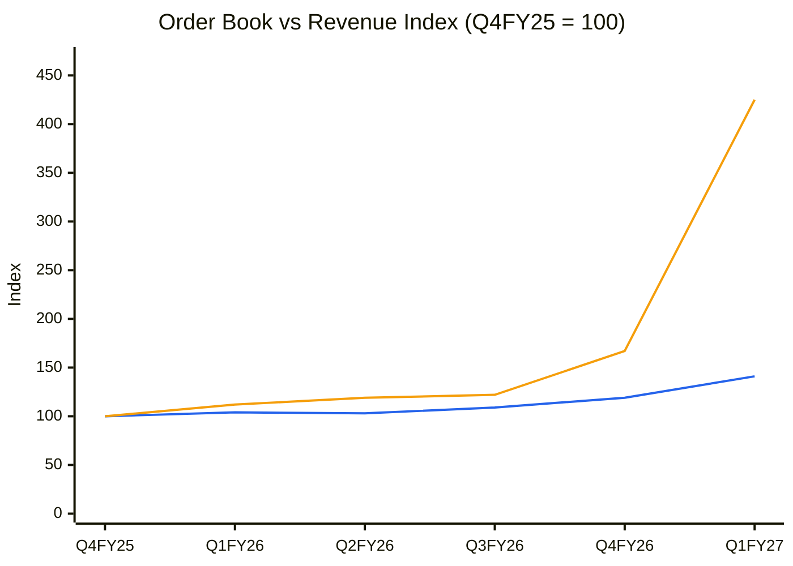
```mermaid
%%{init: {"themeVariables": {"xyChart": {"plotColorPalette": "#2563eb, #f59e0b"}}}}%%
xychart-beta
    title "Order Book vs Revenue Index (Q4FY25 = 100)"
    x-axis [Q4FY25, Q1FY26, Q2FY26, Q3FY26, Q4FY26, Q1FY27]
    y-axis "Index" 0 --> 470
    line [100, 104, 103, 109, 119, 141]
    line [100, 112, 119, 122, 167, 425]
```
🟦 Revenue (TTM) · 🟧 Order book (disclosed points only)

**Read:** For four quarters after the demerger, the order book (🟧) and revenue (🟦) grew roughly together (index 100 → 122 vs 109). In Q4 FY26 and Q1 FY27 the book jumped to **4.25×** its starting level while TTM revenue reached 1.41×. More than half of that jump is one $1.11 bn hyperscaler allocation running through FY29.

**Business inference:** Demand has stopped being STL's constraint. The binding constraints are now capacity, germanium/helium supply and execution, which is why management is rationing orders and expanding by 50%. Revenue for the next two years is set by how fast STL can produce, not by how many orders it wins. Any plant or raw-material hiccup will show up directly as a revenue miss, even with a full order book.

**OB-2 — Order book cover (years of TTM revenue)**

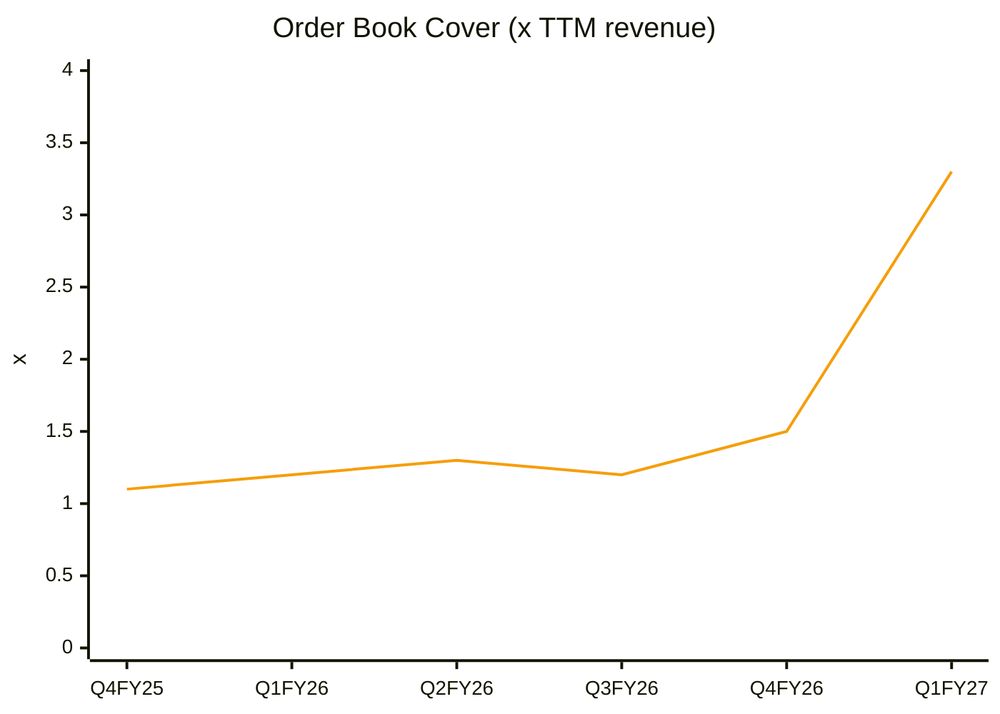
```mermaid
%%{init: {"themeVariables": {"xyChart": {"plotColorPalette": "#f59e0b"}}}}%%
xychart-beta
    title "Order Book Cover (x TTM revenue)"
    x-axis [Q4FY25, Q1FY26, Q2FY26, Q3FY26, Q4FY26, Q1FY27]
    y-axis "x" 0 --> 4
    line [1.1, 1.2, 1.3, 1.2, 1.5, 3.3]
```
🟧 Order book / TTM revenue

**Read:** Cover was a steady 1.1–1.5× (a 12–18-month order cycle typical of telecom OFC), then jumped to **3.3×**. Excluding the ₹10,000 Cr framework LTSA, firm cover is **~1.5×** (₹8,618 Cr ÷ ₹5,642 Cr), still the best level since the demerger but not a step change.

**Business inference:** STL's revenue visibility now rests mostly on allocation agreements, not firm purchase orders. They are valued at today's prices and carry capped penalties if the customer's demand falls short. Hyperscalers signing multi-year allocations is strong evidence of real supply tightness. It also means the "₹18,600–35,800 Cr" book is a call option held by the customer: if AI capex slows or prices fall, both volume and value can shrink with limited compensation.

**OB-3 — Aggregated announced orders vs revenue, by quarter (₹ Cr)**

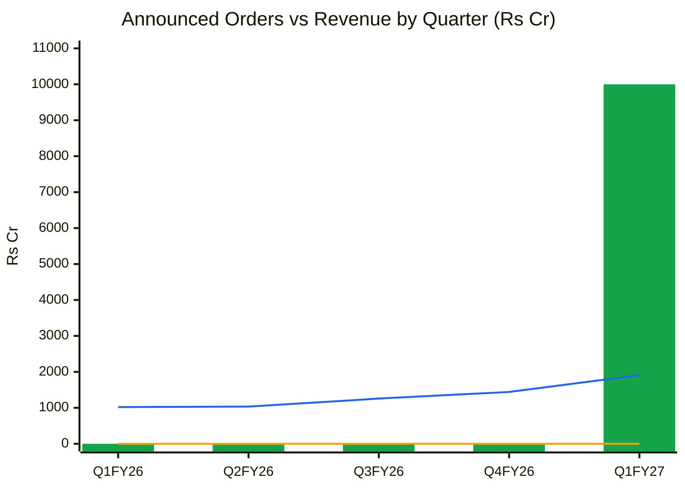
```mermaid
%%{init: {"themeVariables": {"xyChart": {"plotColorPalette": "#16a34a, #f59e0b, #2563eb"}}}}%%
xychart-beta
    title "Announced Orders vs Revenue by Quarter (Rs Cr)"
    x-axis [Q1FY26, Q2FY26, Q3FY26, Q4FY26, Q1FY27]
    y-axis "Rs Cr" 0 --> 11000
    bar [0, 0, 0, 0, 10000]
    line [0, 0, 0, 0, 0]
    line [1019, 1034, 1257, 1441, 1910]
```
🟩 All announced orders (bars) · 🟧 Firm orders only (excl. framework / potential-value agreements) · 🟦 Revenue

**Read:** No order was large enough to need a Reg 30 filing in FY26. Telecom business arrived as many small POs, which the order book captures. Since May 2026, every filing has been a multi-year framework agreement (Q1 ₹10,000 Cr; Q2 ₹5,691 Cr; Q3 to date ₹11,500 Cr), and **the firm-order line (🟧) is zero throughout.**

**Business inference:** STL's growth story has changed from "many telecom customers" to "a few hyperscalers on long allocation contracts". That brings scale and longer visibility, but also customer concentration and pricing power on the buyer's side. Two hyperscaler LTSAs alone (~₹21,500 Cr) would be roughly four years of FY26 revenue. For the stock, the credibility test is whether these agreements turn into recurring POs at the stated values, which will show up as revenue of ₹2,500 Cr+ per quarter by FY28.

**OB-4 — Implied order inflow (from disclosed order book) vs revenue (₹ Cr)**

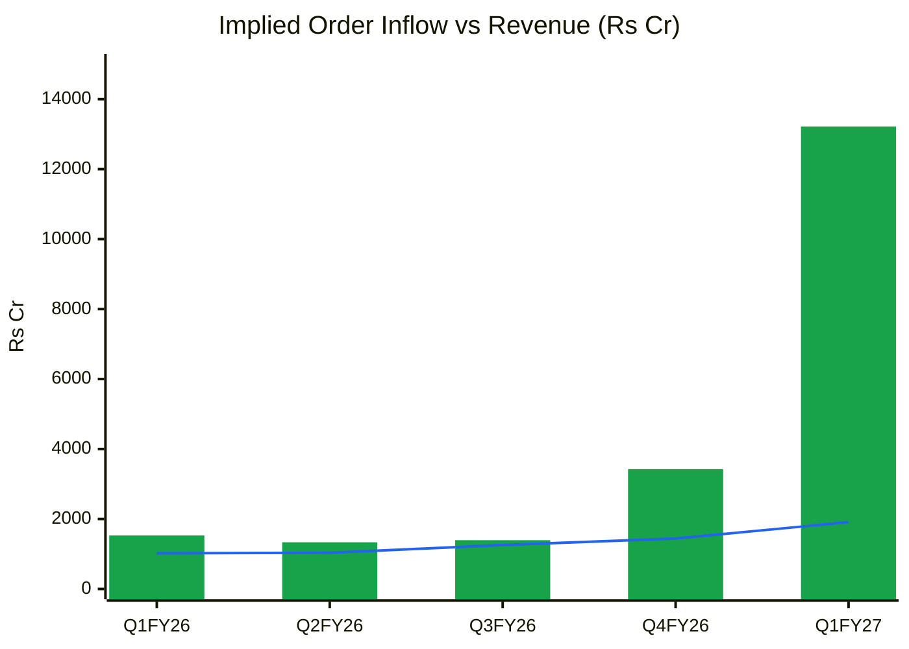
```mermaid
%%{init: {"themeVariables": {"xyChart": {"plotColorPalette": "#16a34a, #2563eb"}}}}%%
xychart-beta
    title "Implied Order Inflow vs Revenue (Rs Cr)"
    x-axis [Q1FY26, Q2FY26, Q3FY26, Q4FY26, Q1FY27]
    y-axis "Rs Cr" 0 --> 15000
    bar [1529, 1334, 1394, 3425, 13219]
    line [1019, 1034, 1257, 1441, 1910]
```
🟩 Implied inflow = ΔOB + order-linked revenue · 🟦 Revenue

**Read:** Book-to-bill was 1.1–1.5× through Q1–Q3 FY26, 2.4× in Q4 FY26 and **6.9×** in Q1 FY27. Even excluding the $1.11 bn LTSA, Q1 FY27 inflow was ~₹3,200 Cr, or **1.7× revenue**, and management describes underlying intake as "sufficient" despite capacity-based selectivity.

**Business inference:** Underlying (non-LTSA) order momentum is healthy at roughly 1.5–2× revenue, enough to support 30–40% growth for 4–8 quarters if capacity allows. The big LTSAs add a multi-year floor *if* hyperscaler capex holds. Revenue growth in FY28–FY29 therefore depends more on the timing of the capacity expansion than on new orders, so watch commissioning dates as closely as order announcements.

#### 5. Order Ledger — every announced order (source of truth; the next run appends here)

| order_id | date | customer | customer_type | segment | geography | value_cr | currency | value_fc | firmness | tenor_months | linked_to | source | notes |
|---|---|---|---|---|---|---|---|---|---|---|---|---|---|
| ST-2605-01 | 2026-05-22 | Hyperscale partner (Product Award Letter) | Export | Optical connectivity (DC) | Export | 10000 | USD | 1110 | Framework | 34 |  | [BSE](https://www.bseindia.com/xml-data/corpfiling/AttachHis/64f3c101-b5e2-4ac4-9962-d6c16d80cc2a.pdf) | Potential value at prevailing prices; FY27-FY29; POs released periodically; capped mutual liabilities. INR per press reports (filing USD only) |
| ST-2608-01 | 2026-08-01 | Domestic telecom operator | Private | OFC | Domestic | 960 | INR |  | Framework | 24 |  | [BSE](https://www.bseindia.com/xml-data/corpfiling/AttachHis/9fde852c-2802-4edd-bf26-2bbdbf505161.pdf) | Multi-year supply agreement FY28-FY29; extendable 2 yrs |
| ST-2608-02 | 2026-08-05 | Leading telecom infrastructure company | Export | OFC (high density) | Export | 1995 | USD | 210 | Framework | 36 |  | [BSE](https://www.bseindia.com/xml-data/corpfiling/AttachHis/d235378b-3b9c-4580-9eab-77789e3131a1.pdf) | LTSA CY27-CY29; INR at ~Rs95/USD (filing USD only) |
| ST-2608-03 | 2026-08-29 | Leading hyperscaler | Export | OFC (high density) | Export | 2736 | USD | 288 | Framework | 36 |  | [BSE](https://www.bseindia.com/xml-data/corpfiling/AttachHis/7ec5a7a8-ca79-4d6b-9f50-096a00ab6e1a.pdf) | LTSA CY27-CY29 (+2 yr option); allocation-based POs; INR at ~Rs95/USD |
| ST-2610-01 | 2026-10-01 | Hyperscale partner (WOS) | Export | Optical connectivity (DC) | Export | 11500 | USD | 1200 | Framework | 51 |  | [BSE](https://www.bseindia.com/xml-data/corpfiling/AttachHis/e32c6959-6efd-446d-9fac-efef5c96b41d.pdf) | LTSA CY26-CY30 potential value at prevailing prices; INR per press reports |

#### 6. Order Book Snapshots — revenue and disclosed order book per period

| period | revenue_cr | revenue_ttm_cr | order_book_cr | order_linked_share | as_of_date | source |
|---|---|---|---|---|---|---|
| Q1FY25 | 872 |  |  | 1 |  | Screener revenue (continuing ops) |
| Q2FY25 | 1074 |  |  | 1 |  | Screener revenue (continuing ops) |
| Q3FY25 | 998 |  |  | 1 |  | Screener revenue (continuing ops) |
| Q4FY25 | 1052 | 3996 | 4378 | 1 |  | FY26 results press release (FY25 comparative) |
| Q1FY26 | 1019 | 4143 | 4888 | 1 |  | Q1FY26 results (HDFC Sky) |
| Q2FY26 | 1034 | 4103 | 5188 | 1 |  | Q2FY26 results (FilingReader) |
| Q3FY26 | 1257 | 4362 | 5325 | 1 |  | Q3FY26 earnings call (Yahoo Finance) |
| Q4FY26 | 1441 | 4751 | 7309 | 1 |  | FY26 results (Whalesbook) |
| Q1FY27 | 1910 | 5642 | 18618 | 1 |  | Q1FY27 earnings call transcript |

*Every number above traces to the ledger / snapshot rows (source column).*

**Order-book verdict:** Headline cover 3.3× · **firm cover (ex-framework) ~1.5×** · framework / potential-value agreements **100% of announced orders** (54% of the Q1 book) · top-2 hyperscaler LTSAs ~60% of the tracked book · implied book-to-bill 1.7× ex-LTSA in Q1 FY27 · **tracked book today ~₹33,600–35,800 Cr** · mix 96% export over the last 12 months. Execution rate: **Rising** (capacity-limited).
**Forward link (Module 11):** FY27 revenue ≈ firm opening book ₹8,618 Cr × ~55% execution + LTSA call-offs (~₹2,500 Cr in FY27) + in-year telecom inflow × ~35% burn ≈ **₹7,500–8,500 Cr**. Base case ₹8,000 Cr. **The bull case needs the LTSAs to run at full potential value for 3–5 years at today's prices, which is a direct bet on AI capex and fibre pricing.**

### Peer comparison

| Metric | STL | HFCL | Birla Cable | Vindhya Telelinks | Tejas Networks |
|---|---|---|---|---|---|
| Mcap (₹ Cr) | 50,378 | 39,537 | 1,077 | 3,290 | 7,968 |
| P/E (TTM) | 213 | 68.5 | 23.3 | 14.0 | loss |
| ROCE % | 7.7 | 10.8 | 8.9 | 8.2 | −14.6 |
| TTM OPM % | 15 | 19 | 10 | 7 | −50 |
| CCC (days) | 16 | 218 | 124 | 283 | n/m |
| EV / TTM revenue | ~8.8× | ~6.9× | ~1× | ~1× | n/m |

*Source: Screener.in peer table, 9 Oct 2026; HFCL/Vindhya ratios from the HFCL report of the same date.*

### C12 — P/E vs Peers

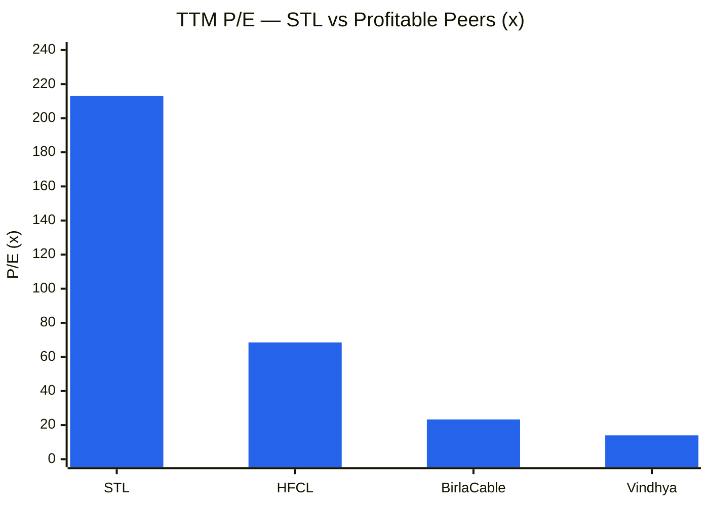
```mermaid
%%{init: {"themeVariables": {"xyChart": {"plotColorPalette": "#2563eb"}}}}%%
xychart-beta
    title "TTM P/E — STL vs Profitable Peers (x)"
    x-axis [STL, HFCL, BirlaCable, Vindhya]
    y-axis "P/E (x)" 0 --> 240
    bar [213, 68.5, 23.3, 14.0]
```

**Read:** STL trades at **3.1× HFCL's P/E and 9–15× the smaller cable makers'**, with the *lowest* ROCE in the group (7.7%). On EV/revenue (8.8×) it is priced like a global optical-connectivity franchise (Corning, Ciena class), not an Indian fibre maker (KPI reference FY26 benchmark: "STL ~0.5× (distressed)").

**Business inference:** The market has moved STL from "distressed Indian cable maker" to "AI-infrastructure compounder" within a year. Parts of that re-rating are earned: the best cash cycle in the group, net cash, data-centre product certification and hyperscaler LTSAs. But no peer, and no year in STL's own history, shows the sustained 25%+ returns that a 200× trailing multiple requires. The gap to HFCL is the market paying for data-centre mix and better cash conversion, and paying for them several times over.

**Peer positioning: Premium, partly justified on quality (cash conversion, DC mix); not justified on returns.**

---

## Module 8 — Market Size & Market Share

Global optical fibre/cable market ~$13–15 bn, ex-China the relevant pool. AI data-centre interconnect and in-building cabling is the fastest-growing slice (CRU via the Q1 call: DC optical cable demand +63% in 2026; North America 18.6% CAGR to 2030; global cable +8.2% in 2026). **STL global ex-China OFC share: 8% (FY26) → 9% (Q1 FY27)** ([Screener key points](https://www.screener.in/company/STLTECH/consolidated/); Q1 call). Revenue growth (TTM +36%; Q1 +87%) far exceeds market growth (8–19%), so **share is being gained, mainly in North American data centres**, plus some price. Attach rate (connectivity as % of OFC revenue) went from 15% to 16% and is targeted at 25%, a mix-led, more durable gain. **Verdict: taking share; durable part = DC connectivity + attach rate; cyclical part = price and utilisation.**

---

## Module 9 — Valuation: PIE First, Then DCF

**CMP ₹980 (9 Oct 2026, Screener) · Mcap ₹50,378 Cr · net cash ₹483 Cr (Jun 2026) · EV ~₹49,900 Cr · TTM EPS ₹4.98 · P/E 213× (Screener) · P/B 21.1× (BV ₹46.5) · EV/TTM EBITDA ~60× · EV/TTM revenue 8.8×. Diluted shares incl. promoter warrants: ~55.9 Cr.**

### PIE (reverse DCF)
Quick form: g = (EV × 12% − NOPAT₀)/(EV + NOPAT₀) = (49,895 × 0.12 − 435)/(49,895 + 435) = **11.0% perpetual NOPAT growth** from a TTM base that is already rising fast. That is essentially WACC: the price capitalises growth at the cost of capital forever. Two-stage version: to earn 12% from here, FY31 equity value must be ~₹88,000 Cr. At a mature multiple of ~12–20× NOPAT, that needs **FY31 NOPAT of ~₹4,400–7,500 Cr**, i.e. **revenue of ~₹29,000–50,000 Cr** at a 15% NOPAT margin (≈ 24–25% EBITDA).

| PIE driver | Market-implied | My base case | Gap |
|---|---|---|---|
| Revenue FY29 | ≈ Lakshya ₹20,000 Cr and growing beyond | ₹12,500 Cr | **Market far more optimistic** |
| Steady-state EBITDA margin | 25–27% (Lakshya) | 21% FY29 → 18% through-cycle | **Market optimistic** |
| Investment rate | Capacity +50% delivers 4× revenue | +50% capacity + price/mix ≈ 2.6× revenue | Market pricing unannounced capacity or permanent price gains |

**Physical plausibility check:** Today's capacity at full utilisation and today's prices supports ~₹10,900 Cr. With +50% capacity by FY29, the ceiling is ~₹14,700–16,400 Cr. **The PIE-implied ₹20,000 Cr+ requires either unannounced capacity beyond the ₹3,000 Cr plan or a further ~25–35% rise in realisation and mix.** Our view is that partial delivery (~₹12,500 Cr) is the realistic base: capacity ramps take 1–2 years, and the WTT history argues for a haircut.

**Expectations treadmill:** To beat the price, STL must deliver Lakshya in full and on time (₹20,000 Cr, >27% margin, FY29), *and* the market must still pay ~15× for it at a cyclical peak. **Positive triggers:** Q2 FY27 revenue ≥ ₹2,200 Cr at ≥ 22% margin; another firm (not framework) hyperscaler PO; early commissioning of expansion phases; attach rate ≥ 20% in Q2. **Negative triggers:** any quarter-on-quarter revenue dip; germanium/helium shortfall; hyperscaler capex cut; competitor capacity announcements; further equity issuance.
**SVAR:** bear-case price ₹145 → **SVAR 85%** (> 40% = unfavourable asymmetry).

### Own DCF (5-yr explicit, then g / RONIC terminal; WC 12% of Δrevenue; 55.9 Cr diluted shares; net cash ₹483 Cr)

| ₹/share | WACC 12%, g 6%, RONIC 15% | 11.5%, 6%, 20% | 11%, 6.5%, 25% |
|---|---|---|---|
| Bear (FY31 rev ₹7,300 Cr, margin → 14%) | 68 | 82 | 101 |
| **Base (FY31 rev ₹14,200 Cr; margin 22% → 18%)** | **221** | **271** | **341** |
| Bull (Lakshya: FY29 ₹20,000 Cr, FY31 ₹23,500 Cr, margin 27% → 24%) | 526 | 649 | 823 |

*Capex: base ₹700 / 1,200 / 1,200 / 600 / 550 Cr (FY27–FY31). Model in this session's scratchpad.*
**DCF note:** Even the Lakshya bull case is worth ₹526–823 per share, **16–46% below the price**. Unlike HFCL, STL's DCF is not crushed by working capital (its cash cycle is excellent). It is crushed by how much of the valuation rests on terminal earnings at peak-cycle margins.

### Relative (2-year, FY28E EPS × multiple)
FY27E: revenue ~₹8,000 Cr, EBITDA 22%, PAT ~₹1,010 Cr, **EPS ~₹18** → forward P/E **54×**. FY28E base EPS ~₹24.9 → **39× FY28E**. Lakshya FY29 EPS (~₹66 if fully delivered) → **15× FY29E**.

### CY1 — P/E Band

| | FY16 | FY17 | FY18 | FY19 | FY20 | FY21 | FY22 | FY23 | FY24 | FY25 | FY26 | Oct-26 |
|---|---|---|---|---|---|---|---|---|---|---|---|---|
| P/E (×, fiscal year-end) | 20.6 | 16.9 | 31.1 | 12.5 | 3.4 | 24.3 | 28.5 | 26.1 | 30.0 | n/m (loss) | n/m (EPS ~₹1) | 213 |

376 weekly observations since Oct 2016 (excluding loss periods): **median 20.8×, SD 16.7 → band 4.1–37.5×; current 213× = 100th percentile (a new high by 5.7×).** *(Screener.in P/E chart data.)* The chart stops at FY24 because Mermaid cannot plot the FY25–26 loss gap.

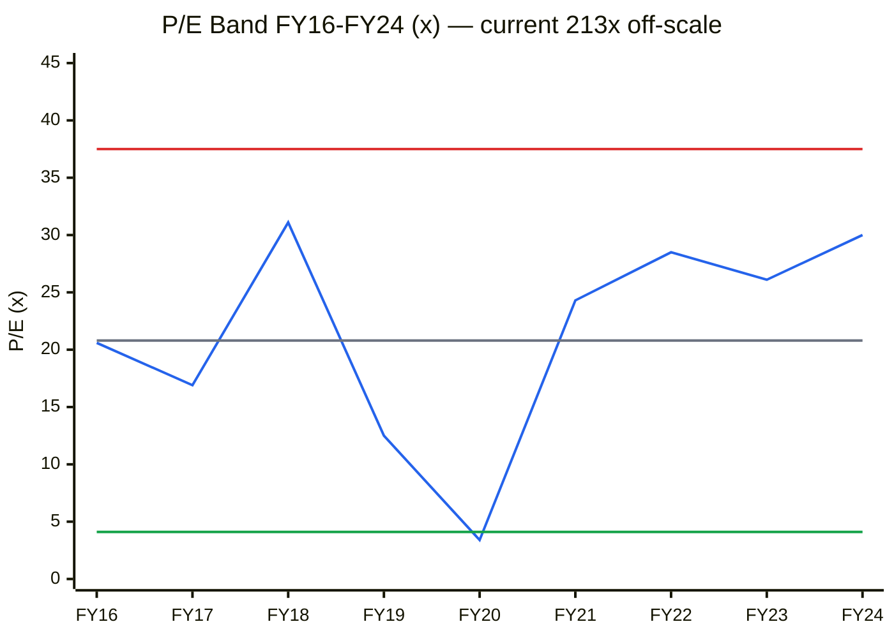
```mermaid
%%{init: {"themeVariables": {"xyChart": {"plotColorPalette": "#2563eb, #6b7280, #dc2626, #16a34a"}}}}%%
xychart-beta
    title "P/E Band FY16-FY24 (x) — current 213x off-scale"
    x-axis [FY16, FY17, FY18, FY19, FY20, FY21, FY22, FY23, FY24]
    y-axis "P/E (x)" 0 --> 45
    line [20.6, 16.9, 31.1, 12.5, 3.4, 24.3, 28.5, 26.1, 30.0]
    line [20.8, 20.8, 20.8, 20.8, 20.8, 20.8, 20.8, 20.8, 20.8]
    line [37.5, 37.5, 37.5, 37.5, 37.5, 37.5, 37.5, 37.5, 37.5]
    line [4.1, 4.1, 4.1, 4.1, 4.1, 4.1, 4.1, 4.1, 4.1]
```
🟦 P/E · ⬜ Median 20.8× · 🟥 +1SD 37.5× · 🟩 −1SD 4.1×

**Read:** Over a decade STL never traded above ~31× year-end trailing earnings, including at the FY18 fibre-shortage peak, when EPS was at a record. Today's **213× is 5.7× the +1SD line**. Even on FY28E base EPS (39×) it would be above the band.

**Business inference:** The last time STL's earnings peaked (FY18–19), the market paid 12–31× for them, and the stock then fell ~80% as the cycle turned (FY20 P/E 3.4×). Today the market is paying a multiple usually reserved for a decades-long compounder, at the start of what STL's own history says is a cyclical earnings peak. That is the "double peak" risk, here in an extreme form: peak multiple on rising, not yet peak, earnings.

### CY2 — P/B Band (with ROE)

| | FY16 | FY17 | FY18 | FY19 | FY20 | FY21 | FY22 | FY23 | FY24 | FY25 | FY26 | Oct-26 |
|---|---|---|---|---|---|---|---|---|---|---|---|---|
| P/B (×) | 1.9 | 4.8 | 9.3 | 4.9 | 1.0 | 3.2 | 3.1 | 2.2 | 1.5 | 1.0 | 4.4 | 21.1 |
| ROE (%, PAT / avg equity) | 17.4 | 26.7 | 35.4 | 39.9 | 23.3 | 13.6 | 2.3 | 6.3 | −2.8 | −6.1 | 2.6 | ~8 TTM |

518 weekly observations since Oct 2016: **median 2.7×, SD 3.0 → +1SD 5.7×; 10-year low 1.0×; current 21.1× = 100th percentile.**

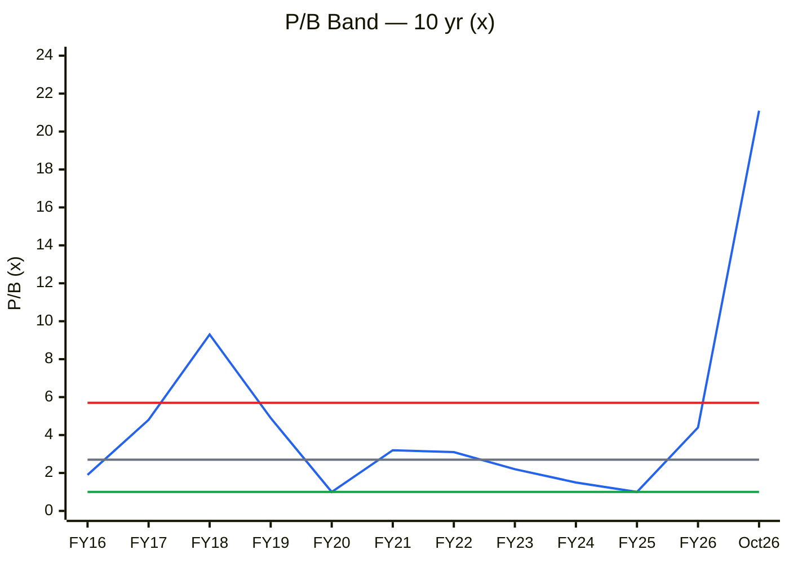
```mermaid
%%{init: {"themeVariables": {"xyChart": {"plotColorPalette": "#2563eb, #6b7280, #dc2626, #16a34a"}}}}%%
xychart-beta
    title "P/B Band — 10 yr (x)"
    x-axis [FY16, FY17, FY18, FY19, FY20, FY21, FY22, FY23, FY24, FY25, FY26, Oct26]
    y-axis "P/B (x)" 0 --> 24
    line [1.9, 4.8, 9.3, 4.9, 1.0, 3.2, 3.1, 2.2, 1.5, 1.0, 4.4, 21.1]
    line [2.7, 2.7, 2.7, 2.7, 2.7, 2.7, 2.7, 2.7, 2.7, 2.7, 2.7, 2.7]
    line [5.7, 5.7, 5.7, 5.7, 5.7, 5.7, 5.7, 5.7, 5.7, 5.7, 5.7, 5.7]
    line [1.0, 1.0, 1.0, 1.0, 1.0, 1.0, 1.0, 1.0, 1.0, 1.0, 1.0, 1.0]
```
🟦 P/B · ⬜ Median 2.7× · 🟥 +1SD 5.7× · 🟩 10-yr low 1.0×

**Read:** P/B is **2.3× the FY18 peak (9.3×)**, which came with a 35–40% ROE, and **3.7× the +1SD line**. The 10-year median ROE is 13.6%, so justified P/B at Ke 12.5% and g 7% is **~1.2×**. Even the FY19 peak ROE of 40% justifies ~6×. **21× book prices an ROE of ~80–120% for years**, or a book value that has to multiply quickly.

**Business inference:** Book value is the most stable gauge for a capital-intensive cyclical, and on it STL has never been this expensive. The market is not valuing the assets STL owns. It is valuing several more years of peak-level returns from assets it has not built yet. That bet pays only if this time the cycle really is different.

### CY4 — Price vs EPS Index (FY16 = 100)

| | FY16 | FY17 | FY18 | FY19 | FY20 | FY21 | FY22 | FY23 | FY24 | FY25 | FY26 | Oct-26 |
|---|---|---|---|---|---|---|---|---|---|---|---|---|
| Price (₹, demerger-adjusted) | 52.6 | 91.2 | 226.3 | 158.4 | 46.3 | 140.7 | 162.7 | 106.6 | 80.3 | 58.7 | 185.9 | 980 |
| EPS (₹, as reported; TTM for Oct-26) | 3.89 | 5.06 | 8.34 | 13.98 | 10.74 | 6.95 | 1.51 | 3.54 | −1.28 | −2.52 | 1.15 | 4.98 |

*Caveat: Screener's price series is adjusted for the FY25 demerger, while pre-FY25 EPS includes the demerged business, so the long-run comparison is approximate. The FY26 → Oct-26 comparison is clean.*

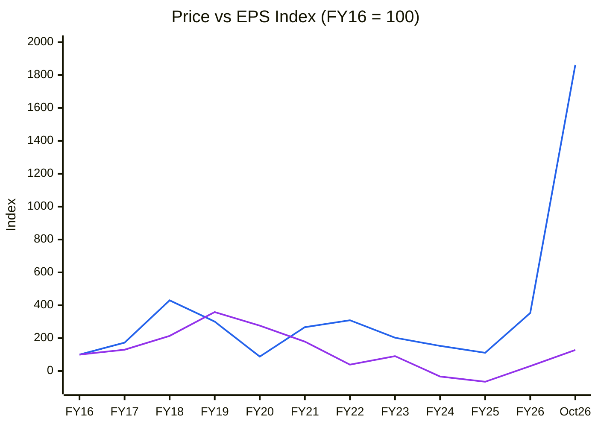
```mermaid
%%{init: {"themeVariables": {"xyChart": {"plotColorPalette": "#2563eb, #9333ea"}}}}%%
xychart-beta
    title "Price vs EPS Index (FY16 = 100)"
    x-axis [FY16, FY17, FY18, FY19, FY20, FY21, FY22, FY23, FY24, FY25, FY26, Oct26]
    y-axis "Index" -100 --> 2000
    line [100, 173, 430, 301, 88, 267, 309, 203, 153, 111, 353, 1862]
    line [100, 130, 214, 359, 276, 179, 39, 91, -33, -65, 30, 128]
```
🟦 Price index · 🟪 EPS index

**Read:** Since March 2026 the price index went from **353 to 1,862 (5.3×)** while TTM EPS went from 30 to 128 (4.3× off a near-zero base). Over the full decade, price is up ~18.6× and EPS ~1.3×. In FY18 the price ran ahead of EPS (430 vs 214) and then fell 80% by FY20.

**Business inference:** Past returns for STL shareholders have come from the market re-pricing the cycle, not from earnings compounding. The last time price ran this far ahead of profit, it took two years to give it all back. Today's price assumes EPS will multiply roughly 10–13× from TTM (to ₹50–66 by FY29). Future returns are borrowed from that delivery, with no cushion if the cycle disappoints.

### C13 — 2-year Scenario Targets (FY28E EPS × multiple; 55.9 Cr diluted shares)

| Scenario | Driver | FY28E revenue | EBITDA margin | FY28E EPS | P/E | Target | Prob. |
|---|---|---|---|---|---|---|---|
| Bear | Fibre cycle turns in 2028; LTSA call-offs at capped minimums; hyperscaler capex pause | ₹7,000 Cr | 15% | ₹7.2 | 20× | **₹145** | 25% |
| Base | Debottlenecking + phase-1 expansion; DC mix ~50%; margin 22% | ₹10,500 Cr | 22% | ₹24.9 | 30× | **₹745** | 50% |
| Bull | Lakshya trajectory; LTSAs at full value; attach 25% | ₹14,000 Cr | 26% | ₹42.6 | 35× | **₹1,490** | 25% |
| **Expected value** | | | | | | **₹782** | |

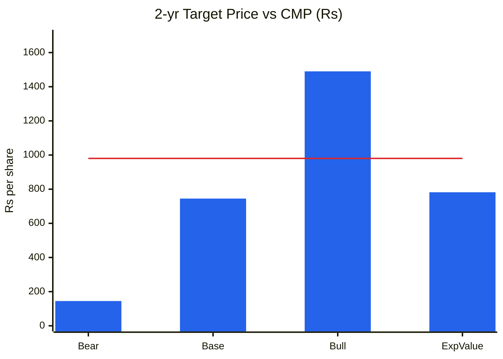
```mermaid
%%{init: {"themeVariables": {"xyChart": {"plotColorPalette": "#2563eb, #dc2626"}}}}%%
xychart-beta
    title "2-yr Target Price vs CMP (Rs)"
    x-axis [Bear, Base, Bull, ExpValue]
    y-axis "Rs per share" 0 --> 1700
    bar [145, 745, 1490, 782]
    line [980, 980, 980, 980]
```
🟦 Scenario price · 🟥 CMP ₹980

**Read:** Only the bull case is above the price (+52%). The base case is −24%, the bear case −85%, and the expected value −20%. **U/D = 0.6:1** (bull upside vs bear downside), so the hard stop is triggered. The base multiple of 30× is already generous: it is near the top of STL's own 10-year P/E band.

**Business inference:** The market is pricing the bull case as the base case: full Lakshya delivery, sustained peak margins and LTSAs at full value. A good outcome (revenue doubling in two years at 22% margins) still loses money from ₹980. The business may well thrive. At this price the investor carries all of the cyclical risk without being paid for it.

### Cycle Position Dashboard

| Dimension | Current | 10-yr median | Percentile | Signal |
|---|---|---|---|---|
| P/E | 213× | 20.8× | 100% | **Extreme** |
| P/B | 21.1× | 2.7× | 100% | **Extreme** |
| EBITDA margin | 20% (Q1) / 15% (TTM) | 17% | ~80% (qtr) | **Late / near-peak** |
| ROCE | 8% (FY26) → ~15% TTM → 30%+ run-rate | 11% | 70% → 100% | Rising to peak |
| Asset turnover | 0.91× TTM (~1.2× run-rate) | 1.02× | ~45% → 90% | Utilisation peak approaching |
| Order book cover | 3.3× (1.5× firm) | 1.2× | 100% | Strongest ever (framework-led) |
| Capex / depreciation | 0.6× → ~2–3× planned | 1.4× | Turning up | **Capital flooding in** |
| Sector valuations | STL 11.6× off low; peers 3–4× | — | — | **Euphoric** |
| **Overall cycle position** | | | | **MID-TO-LATE operating cycle; PEAK valuation** |

Consistent with Module 1b (strong tailwind, late valuation stage) and Module 1c (mid-to-late upcycle). The valuation rows are one to two phases ahead of the operating rows: the market has priced the peak before the earnings have arrived.

**Graham number:** √(22.5 × 5-yr avg EPS ₹0.48 × BV ₹46.5) = **₹22**. Graham screen fails on every valuation criterion. **MoS: negative** (−24% vs relative base, −72% vs base DCF).
**Misprice reason:** None for a buyer. The stock is *over*-priced by thematic momentum (AI-infrastructure trade, FII inflows, LTSA headlines). **Catalyst for re-pricing:** Q2 FY27 results (23 Oct 2026).

---

## Module 10 — Technical Stage (Weinstein + CANSLIM)

| Item | Reading (Screener price data, 9 Oct 2026) |
|---|---|
| Price | ₹980 (intraday, −3.1%); 52-wk ₹84.6–1,054 |
| Weekly path | 176 (30 Mar) → 624 (22 Jun) → 529 (21 Jul, QIP pullback) → 694 (1 Sep) → 1,012 (8 Oct): higher highs and higher lows |
| 50-DMA / 200-DMA | ₹786 / ₹501, both rising steeply; price **25% / 96% above** |
| Volume | 10.8 mn shares on 9 Oct; rising on up-weeks |
| RS vs Nifty | Extreme (+754% 1-yr vs Nifty negative) |
| Institutions | FII 11.5% → 19.7% (2 quarters); DII 13.3% |
| Nifty stage | Stage 3/4 (below June levels, FII selling) |

**Stage 2 (advancing), parabolic.** The price is nearly double its 200-DMA, and there is no topping evidence yet. Trend-followers own it and valuation does not stop a trend, but the risk/reward of a new entry at 96% above the 40-week line is poor (Weinstein: buy within 10–15% of the breakout, not after a 5.6× run). **Stop for holders:** weekly close < ₹800 (Sep breakout zone; 50-DMA ₹786).
**CANSLIM:** C ✓ (Q1 EPS +1,870%) · A ✗ (3-yr EPS negative) · N ✓ (LTSAs, Neuralis, new highs) · S ✗ (two QIPs + warrants) · L ✓ (sector leader by RS) · I ✓ (institutions 6.7% → 33%) · M ✗ (Nifty weak) → **4 / 7.**

---

## Module 11 — Forward View: 2–3 Year Thesis

### Capex classification (FY27–FY29)

| Capex type | FY27E | FY28E | FY29E | In AT model? |
|---|---|---|---|---|
| Expansion (+50% capacity, ₹3,000 Cr by FY29) | ~450 | ~900 | ~900 | ✅ |
| Upgrades / debottlenecking (₹500 Cr/yr programme, partly overlapping) | ~250 | ~300 | ~300 | ✅ (brownfield, fast ramp) |
| Maintenance (≈ depreciation ~₹320–480 Cr; partly inside the above) | — | — | — | ❌ |
| US connectivity plant ($100 mn over 5 yrs) | small | small | small | ✅ when commissioned |
| **Total cash capex** | **~700** | **~1,200** | **~1,200** | |

**CWIP:** only ₹19 Cr at Mar 2026, so near-term capacity gains come from debottlenecking, not from projects already built. **Funding:** internal accruals and/or debt (company); base-case FCF stays positive.

### C14 — Gross Block → Revenue bridge (history + base-case forecast)

| ₹ Cr | FY22 | FY23 | FY24 | FY25 | FY26 | FY27E | FY28E | FY29E |
|---|---|---|---|---|---|---|---|---|
| Gross Block | 5,557 | 5,703 | 5,928 | 5,814 | 6,233 | 6,900 | 8,100 | 9,300 |
| Revenue | 5,437 | 6,925 | 4,083 | 3,996 | 4,745 | 8,000 | 10,500 | 12,500 |
| AT (×) | 0.98 | 1.21 | 0.69 | 0.69 | 0.76 | 1.16 | 1.30 | 1.34 |

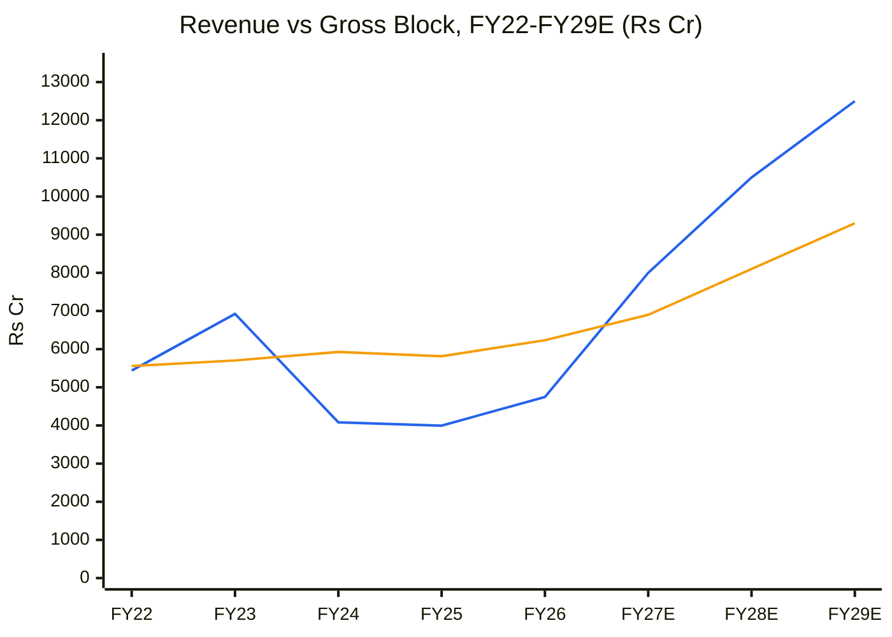
```mermaid
%%{init: {"themeVariables": {"xyChart": {"plotColorPalette": "#2563eb, #f59e0b"}}}}%%
xychart-beta
    title "Revenue vs Gross Block, FY22-FY29E (Rs Cr)"
    x-axis [FY22, FY23, FY24, FY25, FY26, FY27E, FY28E, FY29E]
    y-axis "Rs Cr" 0 --> 13500
    line [5437, 6925, 4083, 3996, 4745, 8000, 10500, 12500]
    line [5557, 5703, 5928, 5814, 6233, 6900, 8100, 9300]
```
🟦 Revenue · 🟧 Tangible gross block (incl. ~₹400 Cr intangibles)

**Read:** The base case takes revenue from ₹4,745 Cr to ₹12,500 Cr (**2.6×**) on a **1.5×** larger asset base. AT rises from 0.76× to 1.34×, matching STL's all-time best (FY19). **Incremental ROIC** on ~₹3,100 Cr growth capex + ~₹930 Cr working capital: ΔEBIT ~₹1,820 Cr × 0.75 / ₹4,030 Cr ≈ **34% vs WACC 12%**, strongly value-creating *at 21% margins*. Capex-model revenue CAGR FY26–29 is **38%**; PIE-implied is **~60%** (Lakshya), so the market is pricing growth beyond the announced capacity.

**Business inference:** Expansion economics are excellent while fibre is scarce. A rupee of new plant pays back in about three years at today's margins, which is why management is right to expand. The same maths is driving every competitor to expand, and the base case already assumes record asset turnover and 21% margins through FY29. The investment case rests on the cycle lasting through the commissioning of the new capacity (FY28–FY29), exactly when industry-wide supply additions land.

### Base-case earnings

| ₹ Cr | FY27E | FY28E | FY29E |
|---|---|---|---|
| Revenue | 8,000 | 10,500 | 12,500 |
| EBITDA (margin) | 1,760 (22%) | 2,310 (22%) | 2,625 (21%) |
| D&A / Interest | 350 / 120 | 420 / 100 | 480 / 80 |
| Other income | 60 | 60 | 60 |
| PAT | ~1,010 | ~1,390 | ~1,595 |
| EPS (₹, 55.9 Cr sh) | 18.1 | 24.9 | 28.5 |
| ΔWC (12%) | ~280 | ~300 | ~240 |
| FCF | ≈ +320 | ≈ +250 | ≈ +550 |
| Net debt / EBITDA | net cash | ~0 | net cash |

**FCF inflection: FY30** (after expansion capex). **Debt ceiling:** comfortable (< 1× EBITDA even if the expansion is fully debt-funded).

### Key catalysts
1. **Q2 FY27 results (23 Oct 2026):** revenue ≥ ₹2,200 Cr, margin ≥ 22%, attach rate ≥ 20%.
2. **LTSA call-offs turning into POs** at the stated run-rates (visible as ₹2,500 Cr+ quarterly revenue by FY28).
3. **Debottlenecking and phase-1 expansion commissioning** (FY28).
4. **Raw-material security** (germanium/helium contracts or lower-germanium process).
5. **Promoter warrant conversion** (₹373 Cr balance cash; signals continued commitment).

### Key risks
1. **Fibre price cycle turns** as industry capacity (STL +50%, HFCL, Corning, Prysmian, YOFC) lands in FY28–29: **High** over 2–3 years.
2. **Hyperscaler concentration / AI capex pause:** two customers ≈ 60% of the tracked book; LTSAs carry capped penalties: **Medium-High**.
3. **Raw-material shortage** (germanium, helium) capping output: **Medium**.
4. **US trade policy** (tariffs on Indian imports): **Medium**.
5. **Valuation de-rating** from 213× P/E / 21× P/B even on good results: **High**.

**Thesis:** STL is a genuinely improved business. It is focused, net cash, cash-generative, integrated and certified at hyperscalers, and it is riding the strongest fibre demand cycle it has seen. But at ₹980 the market capitalises the FY29 target as if it were already delivered and permanent. A good operating outcome loses money, and a normal cyclical outcome loses most of it.

---

## Checklist Summary
**Section 0 (Existing Report Protocol):** ✓ (initial report; no prior file)
**Section A (Business Quality):** 14 / 18 (scuttlebutt beyond filings not done; RPT schedule and ICDs not reviewed; market-share history partial)
**Section B (Forensics):** 7 / 9 (annual-report KAMs and RPT notes not reviewed; Beneish/Altman estimated)
**Section C (Financial Statements):** 10 / 12 (FY24 mixed basis; peer DuPont qualitative)
**Section D (KPIs & Peers):** 5 / 7 (customer concentration and R&D % not disclosed)
**Section E (Market Size & Share):** 5 / 7 (TAM from management-cited CRU data)
**Section F (Valuation):** 10 / 10
**Section G (Technical Stage):** 7 / 8 (sector index stage not separately charted)
**Section H (Forward View):** 21 / 28 (segment-level capex/AT not disclosed; project-wise CWIP n/a)
**Section I (Charts):** 4 / 5 (CY5, CY6, CY8 omitted by rule: no sourced industry series; every chart has Read + Business inference)
**Order Book Tracker:** Run (5 Reg 30 orders; 9 snapshots; reconciles with disclosed intake)
**Hard Stops Triggered:** **Upside/downside < 1.5:1** (0.6:1). ROIC < WACC for 5 years (FY22–26), but a turnaround thesis now exists, so this is not applied as a hard stop.

---

## Investment Decision
**Recommendation:** **AVOID at ₹980 (hard stop: U/D < 1.5:1) → WATCHLIST**
**Conviction Score:** 3.5 / 10 (Cycle 0.3 · Industry 0.5 · Moat 1.0 · Management 0.5 · Financial quality 1.4 · Valuation/PIE 0.0 · Technical 0.8; financial quality is the one clear strength)
**Suggested Position Size:** 0% now. In the buy zone: max 2% (late-cycle × 0.5 modifier).
**Entry Price Range:** **₹300–350** (U/D ≥ 2:1 against ₹745 base / ₹145 bear needs ≤ ₹345; ≈ 12–14× FY28E base EPS; ≈ 4–5× post-QIP book)
**Stop-Loss (existing holders):** weekly close < ₹800
**Target Price (Base, 2-yr):** ₹745
**Review Triggers:**
- *Upgrade:* two quarters of ≥ ₹2,200 Cr revenue at ≥ 22% margin **and** LTSA POs released at stated run-rates; a firm (non-framework) large order; price correcting toward ₹350–500 while the order book holds.
- *Further caution:* quarter-on-quarter revenue decline; EBITDA margin < 17%; germanium/helium supply commentary worsens; another equity issue; competitor capacity announcements accelerating; hyperscaler capex guidance cuts.

---

## Data Sources & Citations
- [Screener.in — STLTECH consolidated](https://www.screener.in/company/STLTECH/consolidated/): 12-yr P&L, balance sheet, cash flow, ratios, fixed-asset, expense and investing schedules, shareholding, P/E, P/B and price chart data (accessed 9 Oct 2026)
- [STL Q1 FY27 earnings call transcript (24 Jul 2026)](https://stl.tech/wp-content/uploads/2026/07/Transcript-July-24-2026.pdf)
- [ANI / Business Standard — Q1 FY27 press release](https://aninews.in/news/business/stl-delivers-record-financial-performance-in-q1-fy27-reports-highest-ever-quarterly-revenue-ebitda-and-order-book20260724165941/)
- BSE Reg 30 filings (order agreements): [22 May 2026](https://www.bseindia.com/xml-data/corpfiling/AttachHis/64f3c101-b5e2-4ac4-9962-d6c16d80cc2a.pdf) · [1 Aug 2026](https://www.bseindia.com/xml-data/corpfiling/AttachHis/9fde852c-2802-4edd-bf26-2bbdbf505161.pdf) · [5 Aug 2026](https://www.bseindia.com/xml-data/corpfiling/AttachHis/d235378b-3b9c-4580-9eab-77789e3131a1.pdf) · [29 Aug 2026](https://www.bseindia.com/xml-data/corpfiling/AttachHis/7ec5a7a8-ca79-4d6b-9f50-096a00ab6e1a.pdf) · [1 Oct 2026](https://www.bseindia.com/xml-data/corpfiling/AttachHis/e32c6959-6efd-446d-9fac-efef5c96b41d.pdf) · BharatNet J&K (demerged): [8 Nov 2024](https://www.bseindia.com/xml-data/corpfiling/AttachHis/62b8bc32-cea2-47d6-8c16-aa79ab421ce1.pdf), [27 Mar 2025](https://www.bseindia.com/xml-data/corpfiling/AttachHis/4be4854b-7eda-4f0f-835e-525a29842151.pdf), [11 Jun 2025](https://www.bseindia.com/xml-data/corpfiling/AttachHis/356d814d-ae7e-49e4-a2c8-86c72501a08d.pdf)
- Order book history: [HDFC Sky — Q1 FY26](https://hdfcsky.com/news/stl-q1fy26-results-revenue-rises-17-percent-yoy-to-rs-1019-cr-pat-turns-positive) · [FilingReader — Q2 FY26](https://filingreader.com/news-wire/mumbai/2025-11-18/sterlite-technologies-reports-q2-fy26-growth-strong-order-book) · [Yahoo Finance — Q3 FY26 call](https://finance.yahoo.com/news/sterlite-technologies-ltd-bom-532374-010200979.html) · [Whalesbook — FY26](https://www.whalesbook.com/corporate-news/Hinglish/tech/Sterlite-Tech-FY26-Revenue-Jumps-188percent-to-indian-rupee4745-Cr-Order-Book-Hits-indian-rupee7309-Cr/69f1c15a08235f0c2a167a01)
- Capex & Lakshya roadmap: [Sahi](https://www.sahi.com/news/sterlite-technologies-approves-3-000-crore-capex-to-boost-capacity-by-50-by-fy29-3280-PE1_COR) · [DSIJ](https://insights.dsij.in/appmindshare/sterlite-technologies-shares-hit-5-upper-circuit-as-company-unveils-ambitious-fy29-roadmap-fiis-and-diis-increase-stake-59401) · [Multibagg — ₹1,500 Cr capex plan](https://www.multibagg.ai/market-pulse/articles/sterlite-technologies-capex-fibre-contracts-cmtlhnys700072orhr6g14nlw)
- $1.2 bn LTSA: [Business Today](https://www.businesstoday.in/markets/stocks/story/sterlite-tech-shares-gain-5-as-arm-wins-1-2-billion-supply-agreement-558989-2026-10-01) · [Sahi (₹11,500 Cr)](https://www.sahi.com/news/sterlite-tech-wins-optical-connectivity-order-worth-us-1-2-billion-or-11-500-crore) · $1.11 bn PAL: [Sahi (₹10,000 Cr)](https://www.sahi.com/news/sterlite-technologies-secures-10-000-crore-optical-connectivity-deal-for-completion-by-2029-3280-PE1_COR)
- QIP: [Angel One — floor price ₹613.69](https://www.angelone.in/news/stocks/sterlite-technologies-share-price-locked-in-5-upper-circuit-qip-opens-at-613-69-floor-price) · [Multibagg — ₹1,500 Cr at ₹583.01](https://www.multibagg.ai/market-pulse/articles/sterlite-technologies-qip-raises-1500cr-cmr96t19v2866qx0jam7a2c3e) · Promoter warrants: [Arihant Capital](https://www.arihantcapital.com/company-information/companynewsdetails/25040010088)
- Demerger: [Angel One — STL Networks](https://www.angelone.in/news/share-market/sterlite-technologies-demerges-services-business-to-form-stl-networks)
- [ScanX — Q2 FY26 / US tariffs](https://scanx.trade/stock-market-news/earnings/sterlite-technologies-reports-q2-fy26-results-revenue-growth-amid-us-tariff-challenges/25020447)
- [StockPil — markets 5 Oct 2026](https://stockpil.com/india-markets-today-2026-10-05/)
- Peers: Screener.in peer table (9 Oct 2026); HFCL_HimachalFuturistic_2026-10-09.md

**Remaining data gaps:** customer concentration, R&D % of revenue, segment (OFC vs connectivity vs Digital) revenue and margin, FY26 annual-report KAMs / RPT / contingent liabilities, capacity in physical units, germanium contract terms.

---
*Report generated by Stock Fundamental Analysis Skill v3.3 | Indian Markets Context*
*Save path: C:\Users\anubh\Documents\Anubhav\Stock Analysis\Stock Analysis\*
*DISCLAIMER: For informational purposes only; not investment advice. FY27E–FY31E, DCF and scenario values are the analyst model's estimates, not company guidance.*
