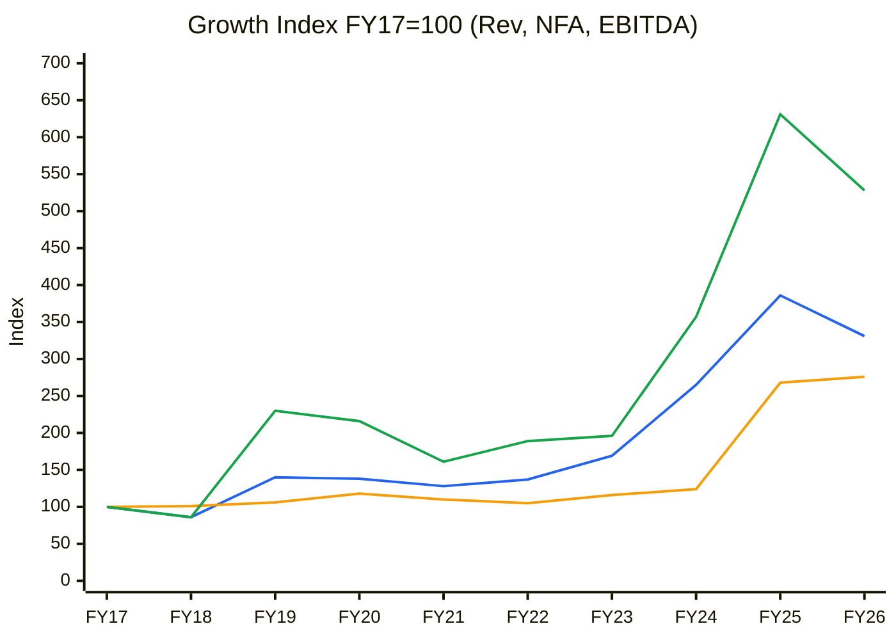
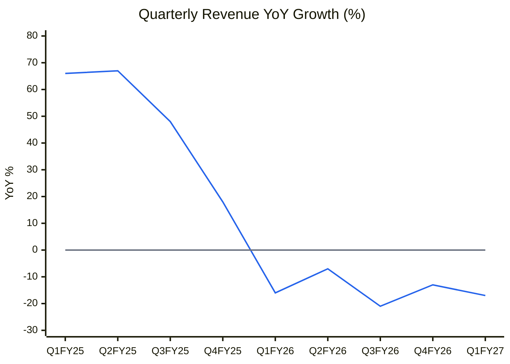
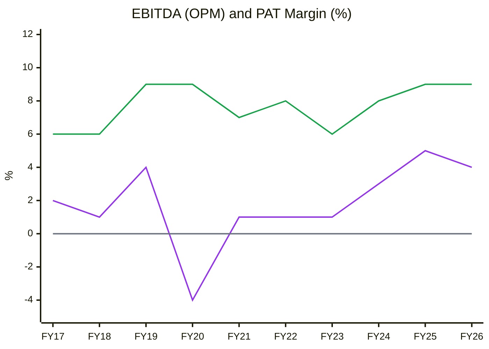
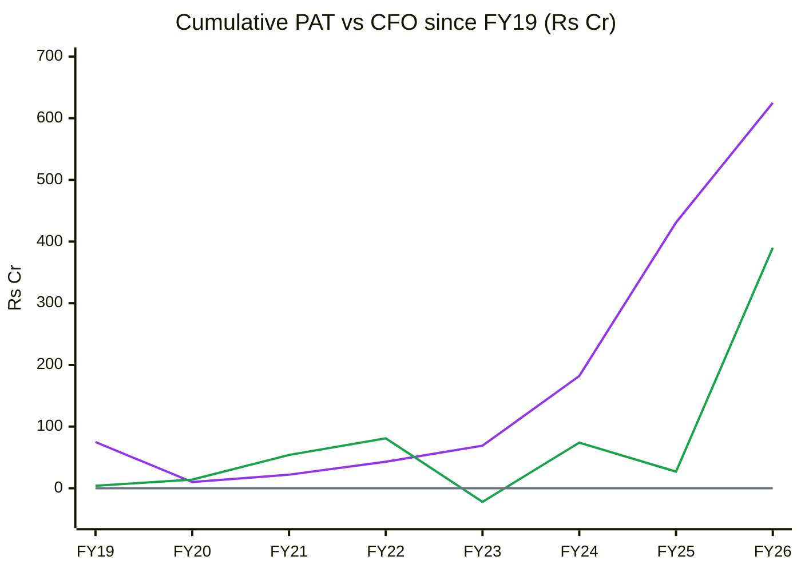
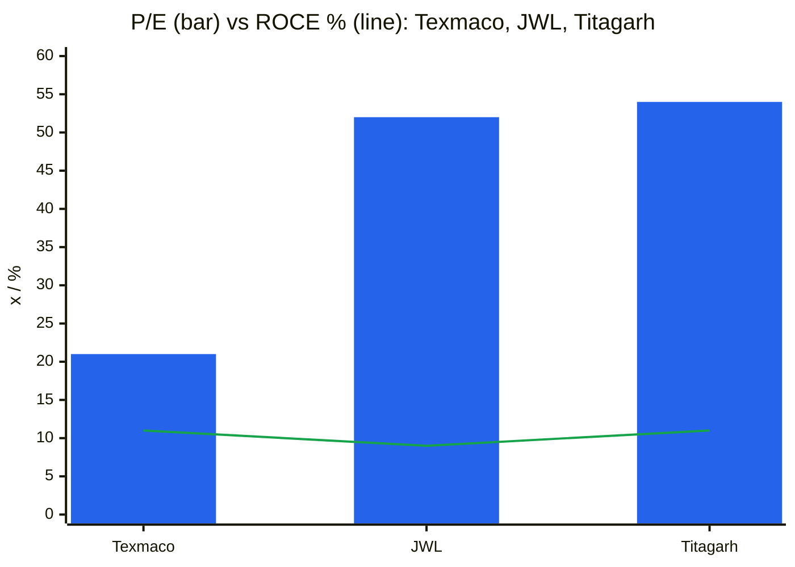
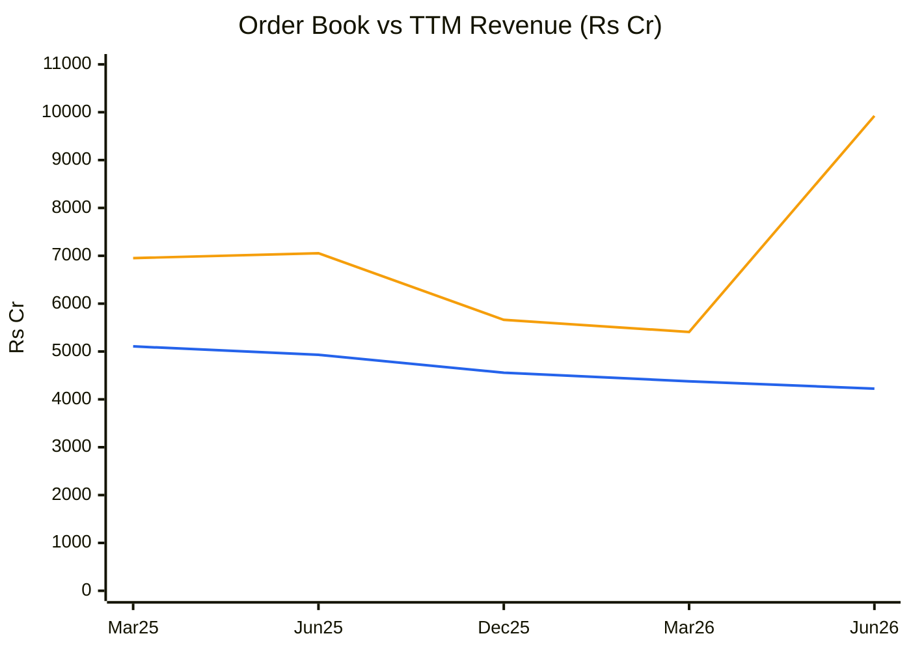
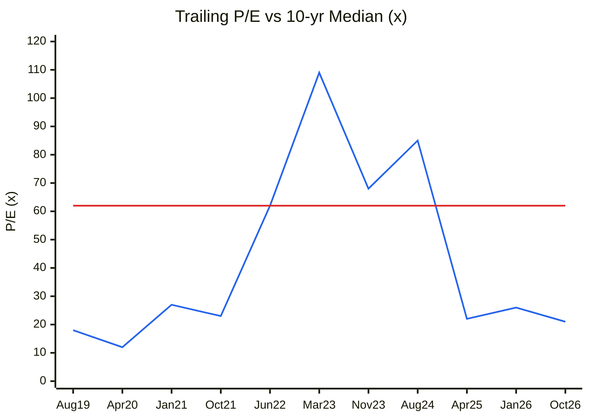
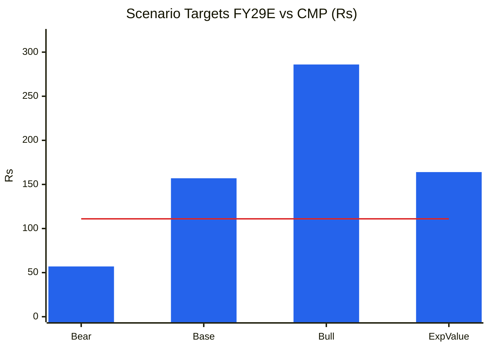

# Stock Analysis Report — Texmaco Rail & Engineering Ltd (NSE: TEXRAIL | BSE: 533326)
**Date:** 2026-10-09
**Analyst:** Claude (Stock Fundamental Analysis Skill v3.3)
**Investment Horizon:** 2–3 Years
**CMP:** ₹111 (9 Oct 2026) · **M-cap:** ₹4,512 Cr · **EV:** ~₹4,956 Cr (company-reported net debt ₹444 Cr; CARE consolidated debt ₹1,515 Cr)
**Recommendation:** AVOID (accounting/governance hard stop): "cheap but flawed" on headline multiples
**Conviction Score:** 3 / 10

## Revision Log
| Version | Date | Recommendation | Conviction | Price | Key change |
|---|---|---|---|---|---|
| Current | 2026-10-09 | AVOID | 3/10 | ₹111 | Initial report |

**Validation of previous report:** Initial report. No earlier Texmaco file in the library.

---

## Business Primer

Texmaco, Kolkata-based and part of the Saroj Kumar Poddar-led **Adventz group**, is India's largest freight-wagon maker. It claims to build "one out of every four wagons on the IR network" and has installed capacity of 15,400 wagons/yr, including the 2,400-wagon Nymwag JV commissioned Apr-26 ([CARE, Jul-26](https://www.careratings.com/upload/CompanyFiles/PR/202607150702_Texmaco_Rail_&_Engineering_Limited.pdf)). The **Freight Car Division** (~78–81% of revenue) sells wagons to Indian Railways, private logistics and industrial groups, and export markets, plus AAR-accredited steel castings from two foundries (48,000–50,000 MTPA). The **Infra-Electrical** arm (ex-Bright Power: railway OHE and electrical, ₹610 Cr revenue in FY26, +66%) is growing. The **Infra-Rail & Green Energy** arm (ex-Kalindee: track, signalling, hydro-mechanical) is loss-making and being demerged. JVs and partnerships cover leasing (Touax), brakes (Wabtec), interiors (Saira Asia), RVNL and Trinity. Revenue is **wagons × realisation plus EPC billing**. Returns depend on **wagon order flow** (IR tenders, private and export demand) and **wheelset supply** (~32% of wagon cost, sourced from RWF and imports).

This is a **cyclical, order-driven, low-margin (8–10% EBITDA) heavy-engineering business** with an EPC tail that ties up working capital. The value driver is volume and utilisation: FY26 deliveries of 8,372 are ~54% of capacity. Key risks are **tender timing, wheelset supply, legacy EPC receivables** and, above all in this report, **accounting and governance**. In FY26 the board created a **₹700 Cr "provision for contingencies" charged directly to free reserves** (₹494 Cr general reserve + ₹206 Cr retained earnings), not through the P&L. It is linked to no specific obligation. The auditor **qualified** the accounts, and **public institutions reportedly voted ~99.9% against adopting the accounts**, which passed on promoter votes ([Ranganathan, Substack](https://ranganathan.substack.com/p/can-astrology-improve-accounting)). The provision is **3.6× FY26 PAT and larger than the company's aggregate FY23–26 profit**. Any future release flows back into reported earnings. This "cookie jar" colours every earnings number from FY27 onward.

*Segment: Railway Rolling Stock (Wagons, Coaches & Components). KPI reference available ✓ (references/05-industry-kpis-india.md, line 2579; block added 2026-10-09).*

---

## Executive Summary

On headline numbers Texmaco is the **cheapest listed wagon maker**: 21× TTM P/E, 1.9× P/B and ~13× EV/EBITDA vs JWL and Titagarh at 52–54×. It has a **record ₹9,923 Cr order book**, lifted by a ~₹4,100 Cr South African wagon-and-locomotive contract, a fast-growing electrical-infra arm and a plan to demerge its loss-making EPC unit. The bull case is a re-rating as volumes recover. **We cannot underwrite it.** The ₹700 Cr reserve-funded contingency provision is a qualified-audit, non-Ind-AS-37-compliant **cookie-jar reserve**. It lets management absorb future write-offs (₹2,100 Cr+ of inventory and receivables) or release income without touching the P&L. Q1 FY27's PAT (₹52 Cr) exceeding PBT (₹44 Cr) is already a question to answer. FY26 revenue fell 14% and Q1 FY27 a further 17%, wagon deliveries hit a multi-year low (1,054), and cumulative CFO is ~27% of PAT over a decade. FIIs and DIIs are exiting. **AVOID until the provision is reversed to reserves or its use is transparently disclosed quarter by quarter.** Only then does this become a "Cheap but Flawed" value candidate.

**Order book ₹9,923 Cr at 30-Jun-26 (2.35× TTM revenue) · ex-South Africa ~₹5,800 Cr (1.38×) · freight car 62% of OB, of which 96.4% private/export · FY26 book-to-bill 0.65; Q1FY27 inflow ₹5,272 Cr (one export order)**

### C1 — Growth Index (FY17 = 100)
| FY | Revenue | Net Fixed Assets | EBITDA | PAT | Rev idx | NFA idx | EBITDA idx |
|---|---|---|---|---|---|---|---|
| FY17 | 1,324 | 370 | 74 | 29 | 100 | 100 | 100 |
| FY18 | 1,135 | 372 | 64 | 13 | 86 | 101 | 86 |
| FY19 | 1,858 | 393 | 170 | 75 | 140 | 106 | 230 |
| FY20 | 1,832 | 437 | 160 | −65 | 138 | 118 | 216 |
| FY21 | 1,689 | 406 | 119 | 12 | 128 | 110 | 161 |
| FY22 | 1,814 | 389 | 140 | 21 | 137 | 105 | 189 |
| FY23 | 2,243 | 431 | 145 | 26 | 169 | 116 | 196 |
| FY24 | 3,503 | 460 | 264 | 113 | 265 | 124 | 357 |
| FY25 | 5,107 | 993 | 467 | 249 | 386 | 268 | 631 |
| FY26 | 4,377 | 1,023 | 391 | 194 | 331 | 276 | 528 |

*PAT is not indexed because FY20 was a loss. FY25 NFA jump = Jindal Rail Infrastructure acquisition (~₹614 Cr, Sep-24). Source: [Screener.in consolidated](https://www.screener.in/company/TEXRAIL/consolidated/).*

🟦 Revenue · 🟧 Net fixed assets · 🟩 EBITDA. CAGR FY17–26: Revenue 14%, NFA 12%, EBITDA 20%.

**Read:** Revenue was range-bound at ₹1,700–2,250 Cr for six years (FY18–23), then nearly tripled in FY24–25 on the 2022 IR tender, and fell 14% in FY26. Fixed assets doubled in FY25 through an acquisition.

**Business inference:** Texmaco's history is a long, low-return plateau punctuated by tender booms. The FY24–25 surge was cyclical (IR mega-tender), not a structural step-up, and the Jindal Rail acquisition bought private-sector capacity and customers right before the IR cycle turned. Normalised earnings power is much closer to FY24 than FY25.

---

## Module 1 — Broad Market Cycle
Nifty 50 ~22,556, VIX ~14.7, FII selling ([StockPil](https://stockpil.com/india-markets-today-2026-10-05/)). **Verdict: CAUTIOUS.**

## Module 1b — Sector Cycle
Same sector read as the JWL report of the same date: **near-term HEADWIND on a structural TAILWIND.** The ~₹40,000 Cr IR wagon mega-tender was reported as imminent in May-26 but is **not floated as of Oct-26**. The FY26 wheelset shortage from RWF cut industry output, and Q1 FY27 deliveries were hit by oil/gas-linked supply disruption. Texmaco's IR share of the freight-car order book collapsed from 79% (FY25) to 21% (FY26) to 3.6% (Q1 FY27), so the company is now a private/export story ([Q1FY27 call, Yahoo/GuruFocus](https://finance.yahoo.com/markets/stocks/articles/texmaco-rail-engineering-ltd-bom-010212080.html)).
**Geopolitical/FX:** The South Africa order (~₹4,100 Cr incl. 15 years of maintenance; execution mainly FY28) brings **ZAR/currency and sovereign-customer risk** (Transnet-type counterparty ⚠️ unverified). Exports of castings to the US face tariff headwinds (Q4FY26 commentary). This is a **structural** FX exposure, so widen MoS by 5 pp.

## Module 1c — Stock Cycle

### C2 — Quarterly revenue YoY growth & wagon deliveries
| Qtr | Q1FY25 | Q2FY25 | Q3FY25 | Q4FY25 | Q1FY26 | Q2FY26 | Q3FY26 | Q4FY26 | Q1FY27 |
|---|---|---|---|---|---|---|---|---|---|
| Revenue ₹Cr | 1,088 | 1,346 | 1,326 | 1,346 | 911 | 1,258 | 1,042 | 1,167 | 757 |
| YoY % | +66 | +67 | +48 | +18 | −16 | −7 | −21 | −13 | −17 |
| Wagons delivered | 2,374 | 2,927 | 2,714 | 2,597 | 1,815 | 2,334 | 2,027 | 2,196 | 1,054 |

*Wagon units from [Q4FY26 presentation (BSE)](https://www.bseindia.com/xml-data/corpfiling/AttachHis/6337425c-95e2-4749-b657-117317562c9b.pdf) and Q1FY27 call.*

🟦 YoY revenue growth · ⬜ zero line

**Read:** Five straight quarters of YoY decline. Q1 FY27 deliveries of 1,054 wagons were the lowest since Q3 FY23 and ~64% below the Q2 FY25 peak (2,927).

**Business inference:** Texmaco's own Feb-26 presentation says it is "currently manufacturing 2,500–3,000 wagons per quarter". Actual deliveries have not exceeded 2,334 in five quarters. Utilisation is ~30% (Q1 annualised 4,216 vs 15,400 capacity). The South Africa order adds volume only from FY28, so **FY27 is a volume trough** unless the IR tender lands.

**Revenue decomposition:** Volume down 21% in FY26. Mix: private and special-purpose wagons carry higher realisation but need new approvals. **Infra-Electrical is the only growing segment** (+66% to ₹610 Cr, EBIT margin 10.8%).
**Operating leverage:** EBITDA margin has been stable at 8–10% despite volume swings. The cost base is variable-heavy (material ~80% of revenue), so DOL ≈ 1.5×. Interest of ₹117–123 Cr against EBIT of ~₹330 Cr (ex-OI) gives **ICR ≈ 2.8–3.2×**, near the 2.5× flag in weak quarters (Q1 FY27: EBIT ~₹67 Cr vs interest ₹25 Cr = 2.7×).
**FCF inflection:** FY26 FCF was +₹196 Cr (CFO ₹363 Cr) after −₹579 Cr in FY25. That came from WC release in a down year, not a structural inflection.
**Stock cycle classification: TROUGH (volumes)** with a lumpy export order bridging to FY28.

---

## Module 2 — Industry Structure & Capital Cycle
Same Five-Forces read as JWL: **supplier power high (wheelsets), buyer power high (IR monopsony + large private groups), rivalry high in commodity wagons.** **Industry verdict: NEUTRAL-to-UNATTRACTIVE.**
**Capital cycle: Late.** Industry capacity is being added (Texmaco +2,400 Nymwag in Apr-26, Titagarh, JWL) while IR orders pause. Wheel plants are being built across the industry. Texmaco itself raised equity through a QIP and warrants in FY24–25 (reserves +₹1,133 Cr in FY24).

---

## Module 3 — Business Quality & Moat
1. *Supply/cost advantage:* modest. In-house AAR-accredited foundry (castings, bogies, couplers) and 309 acres across 7 sites, but EBITDA margin (8–10%) is **lower** than JWL (11–14%) and Titagarh (10–12%). Scale has not translated into superior cost.
2. *Customer captivity:* none (tendered/competitive).
3. *Local scale:* largest Indian wagon maker by capacity, but share is not durable across tender cycles.
**Buffett 10% price test:** Fail. **Moat verdict: NONE.** Scale without pricing power.
**Market share:** ~25% of IR wagons historically (company claim). FY26 output was 8,372 vs JWL 5,498, so Texmaco lost less volume than JWL in the shortage.

### Fisher 15-Point
| # | Point | Score | Note |
|---|---|---|---|
| 1 | Market potential | 3 | Rail freight push, exports, electrification |
| 2 | New products | 2 | Interiors, metro/Vande Bharat entry, defence ("core capital allocation"), leasing JV |
| 3 | R&D | 1 | Mostly licensed/partner technology |
| 4 | Sales organisation | 2 | Won ₹4,100 Cr South Africa order |
| 5 | Profit margin | 1 | 8–10% EBITDA, 4–5% PAT |
| 6 | Margin management | 2 | Held margin through FY26 volume drop |
| 7 | Labour relations | 2 | West Bengal base; no specific data |
| 8 | Executive relations | 2 | |
| 9 | Management depth | 2 | Professional MD and Vice-Chairman |
| 10 | **Accounting controls** | **1** | **₹700 Cr reserve provision, qualified audit** |
| 11 | Industry advantages | 2 | Foundry backward integration |
| 12 | Long-range orientation | 2 | Vision 2030 (₹10–12k Cr revenue) |
| 13 | Dilution | 1 | QIP + warrants FY24–25; stock now below issue levels ⚠️ |
| 14 | Candor in adversity | 1 | Declines FY27 guidance; capacity claims ("2,500–3,000/qtr") not matched by output |
| 15 | **Integrity** | **2 (watch)** | No fraud finding, but provision against minority wishes (institutions ~99.9% against). **Not a veto yet; one step from it** |
| **Total** | | **26 / 45** | |

---

## Module 4 — Management & Capital Allocation
**Promoters:** 48.34% (Adventz/Poddar), down from 58.70% (Sep-23) via QIP and warrant dilution. **Pledge:** not verified ⚠️. **Institutions exiting:** FII 11.04% (Mar-24) → 5.01% (Jun-26), the sharpest drop in the Jun-26 quarter (7.22 → 5.01, the quarter after the provision); DII 8.80% → 5.13%. Retail has risen to 41.5% (3.83 lakh holders).
**Capital allocation:**
- FY24 equity raise (QIP + warrants, ~₹1,100 Cr) → Jindal Rail acquisition (₹614 Cr, Sep-24) plus WC and debt reduction. Net debt fell ₹667 Cr → ₹444 Cr ([Q4FY26 presentation](https://www.bseindia.com/xml-data/corpfiling/AttachHis/6337425c-95e2-4749-b657-117317562c9b.pdf)).
- Leasing JV (Trinity/Touax, ~₹1,800 Cr over 3–5 years at JV level, Texmaco 34%), RVNL JV, Saira Asia, Nymwag. **Many small ventures. Returns not disclosed.**
- **₹700 Cr contingency provision from reserves.** Not a cash outflow, but it **re-labels shareholders' equity as a liability at the board's discretion**, which a capital allocator should not need to do.
- Demerger of loss-making Infra-Rail & Green Energy (positive if it isolates legacy receivables).
**Capital allocation rating: POOR** (diversification sprawl + discretionary reserve engineering).
**Three C's:** Candor Low · Competence Moderate · Caring Low (minority vote overridden).

### The ₹700 Cr Provision: forensic deep dive (mandatory under 4A "qualified opinion → immediate deep dive")
| Item | Finding | Source |
|---|---|---|
| What | "Provision for contingencies" of ₹700 Cr as of 31-Mar-26 for "trade uncertainties, supply chain disruptions, escalation of costs and foreign exchange risks" | NSE results filing 12-May-26 (via search) |
| How booked | **Charged to free reserves** (₹494 Cr general reserve + ₹206 Cr retained earnings), not the P&L | [Ranganathan](https://ranganathan.substack.com/p/can-astrology-improve-accounting), [CARE](https://www.careratings.com/upload/CompanyFiles/PR/202607150702_Texmaco_Rail_&_Engineering_Limited.pdf) |
| Ind AS 37 test | A provision needs a *present obligation from a past event*. General future business risk does not qualify. **Fails** | Ind AS 37 principle |
| Auditor | **Qualified opinion** on the FY26 accounts (the Board's view: contingencies arise "neither from operational issues nor from identifiable individual risks") | AR 2025-26 (via search) |
| Size | ₹700 Cr = **3.6× FY26 PAT**, ~24% of pre-provision net worth (₹2,902 Cr at Sep-25 → ₹2,412 Cr at Mar-26) | Company presentation |
| Shareholder vote | Accounts adopted on promoter votes; public institutions ~99.9% against | Ranganathan (⚠️ secondary) |
| Effect on equity/leverage | Net worth −₹490 Cr in H2 FY26; CARE gearing 0.56× → 0.65× | CARE Jul-26 |
| **Future earnings risk** | Any **write-back or utilisation** (against inventory/receivables ~₹2,100 Cr, cost escalation or FX) can **flatter future P&L** (cookie jar, Schilit EMS #6) | Analysis |
| Early warning | **Q1 FY27 PAT ₹52 Cr > PBT ₹44 Cr** (≈ nil tax plus JV share). ⚠️ Verify that no provision utilisation or deferred-tax effect reached the P&L | Q1FY27 call/Screener |
| Mitigant | No cash left the company. CARE reaffirmed A/Stable. Debt is stable. The provision *reduces* reported equity (conservative on the balance sheet) | CARE |

**Verdict:** The provision does not inflate *past* earnings. It **impairs the reliability of all future earnings** and shows a board willing to override auditors and institutional minorities. That is enough for an **earnings-quality verdict of "Concerning"** under the skill, which is a hard stop.

### Walk the Talk Scorecard
| Guided | Statement | Guided | Actual | Verdict |
|---|---|---|---|---|
| FY25 calls | FY26 growth / "meaningful improvement" | Growth | FY26 −14% | ❌ Miss |
| Feb-26 presentation | "Currently manufacturing 2,500–3,000 wagons per quarter" | 2,500–3,000 | Q3FY26 2,027; Q4 2,196; Q1FY27 1,054 | ❌ Miss |
| FY25–26 | EBITDA margin ≥ ~10% (incl. OI) | ~10% | 10.3% FY26 | ✅ Hit |
| Feb-26 | Nymwag facility operational "within a year" | ≤ Feb-27 | Commissioned Apr-26 | ✅ Hit |
| Q4FY26 | FY27 meaningful topline improvement; Q2 > Q1, H2 > H1 | Growth | Q1FY27 −17% YoY | ⏳ Pending |
| Q1FY27 | Mid-teen EBITDA margin "journey"; Vision 2030 ₹10–12k Cr | — | — | ⏳ Aspirational |

**WTT Score: 0.50 / 1.00 — LOW** (4 scored: 2 hits, 2 misses). Small sample: management mostly declines to guide.
**Key pattern:** Avoids hard numbers (no FY27 guidance). Operational capacity claims overstate actual output. **Selective disclosure:** strong on vision, silent on the provision's use.
**Insider action:** No open-market promoter buying found ⚠️. Promoter stake is flat at 48.3%. **NEUTRAL.**
**Overall credibility: LOW.**

---

## Module 5 — Financial Forensics
| Test | Value | Read |
|---|---|---|
| **Audit opinion** | **Qualified (FY26)** | 🔴 Immediate deep dive (done above) |
| Beneish M (FY26 vs FY25, approx.) | ≈ −2.8 (DSRI 1.06, SGI 0.86, LVGI 1.26 due to provision in liabilities, TATA −0.033) | Unlikely manipulator *on FY26 P&L* |
| Altman Z'' (FY26) | ≈ 4.5 | Safe |
| Piotroski F (FY26) | 4 / 9 | Average-weak |
| Sloan CF accrual (FY26) | (194 − 363 + 228) / 4,946 = 1.2% | OK (FY26 WC release) |
| 10-yr CFO/PAT (FY17–26) | 181 / 667 = **0.27** | 🔴 Very weak |
| Other income / PBT (FY26) | 56 / 277 = 20% | ⚠️ > 15% |
| Effective tax | FY23 44%, FY24 41%, FY25 35%, FY26 30%, **Q1FY27 ~nil** | ⚠️ Q1 anomaly |
| Receivables | Debtor days 104 (FY26). CARE: "significant blockage of funds in slow-moving receivables (including unbilled revenue)" in Infra-Rail | ⚠️ |
| Institutional vote against accounts | ~99.9% (reported) | 🔴 Governance |
| Pledge | Not verified | ⚠️ |

**Schilit:** EMS #6 (cookie-jar reserve): **triggered**. EMS #1 (unbilled revenue in EPC): flagged by CARE. CFS: CFO swings with WC (FY25 −₹47 Cr → FY26 +₹363 Cr).
**Forensic red-flag count: 5 / 15** (qualified audit, cookie-jar reserve, CFO/PAT, other income, Q1 tax anomaly). **≥ 3 → deep investigation; hard stop "forensic flags ≥ 3 unresolved" triggered.**
**Overall forensic verdict: SIGNIFICANT CONCERNS.**

---

## Module 6 — Earnings Quality & Financial Statements
**ROIC:** FY26 EBIT ex-OI ≈ 400 − 56 = ₹344 Cr × (1 − 0.30) = NOPAT ~₹240 Cr. Invested capital = pre-provision equity ~₹3,074 Cr + net debt ₹444 Cr ≈ ₹3,500 Cr, so **ROIC ≈ 6.9% vs WACC 13% → value-destroying**. Company-reported ROCE: 14.4% / 17.0% / 13.6% (FY24/25/26, incl. JV share and on a different base).
⚠️ Post-provision equity (₹2,374 Cr) **flatters** ROE/ROCE ratios from FY27 onward by ~25%. Always compute returns on pre-provision equity.

### DuPont (5-factor; year-end equity as reported)
| Year | EBIT Margin | Asset Turnover | Equity Multiplier | Interest Burden | Tax Burden | ROE |
|---|---|---|---|---|---|---|
| FY22 | 6.9% | 0.68 | 2.00 | 0.21 | 0.81 | 1.6% |
| FY23 | 6.1% | 0.66 | 2.43 | 0.15 | 1.30* | 1.9% |
| FY24 | 8.4% | 0.84 | 1.65 | 0.55 | 0.70 | 4.5% |
| FY25 | 9.4% | 1.06 | 1.73 | 0.72 | 0.72 | 8.9% |
| FY26 | 9.1% | 0.87 | 2.13† | 0.69 | 0.70 | 8.2% |

*JV share/tax credits. †Equity multiplier inflated by the ₹700 Cr reserve charge. On pre-provision equity FY26 ROE ≈ 6.3%.
**Operating contribution:** Improved FY23 → FY25 (margin and AT), slipped in FY26. **Financing contribution:** Interest burden is the chronic drag. Interest consumed 30–85% of EBIT for a decade. **DuPont verdict:** Texmaco has never earned its cost of equity across a full cycle (10-yr ROE ~5%, Screener). FY26's apparent ROE stability is partly the provision shrinking the denominator. **AT trend: volatile, declining in FY26 (1.06 → 0.87).**

### C4 — Margin trend
| FY | FY17 | FY18 | FY19 | FY20 | FY21 | FY22 | FY23 | FY24 | FY25 | FY26 |
|---|---|---|---|---|---|---|---|---|---|---|
| OPM % | 6 | 6 | 9 | 9 | 7 | 8 | 6 | 8 | 9 | 9 |
| PAT % | 2 | 1 | 4 | −4 | 1 | 1 | 1 | 3 | 5 | 4 |

🟩 OPM · 🟪 PAT margin · ⬜ zero line

**Read:** OPM has sat in a 6–9% band for ten years. PAT margin has never exceeded 5%.

**Business inference:** This is a structurally thin-margin assembler/EPC business. "Mid-teen EBITDA" (Vision 2030) would be unprecedented in its own history and among wagon peers. Treat it as aspirational, and value on 8–10%.

### C7 — Cumulative PAT vs CFO (₹ Cr, from FY19)
| FY | FY19 | FY20 | FY21 | FY22 | FY23 | FY24 | FY25 | FY26 |
|---|---|---|---|---|---|---|---|---|
| Cum. PAT | 75 | 10 | 22 | 43 | 69 | 182 | 431 | 625 |
| Cum. CFO | 4 | 14 | 54 | 81 | −22 | 74 | 27 | 390 |

🟪 Cumulative PAT · 🟩 Cumulative CFO · ⬜ zero line

**Read:** Cumulative CFO trailed PAT throughout the FY24–25 boom and caught up only in FY26, a down year, when WC was released (₹390 Cr vs ₹625 Cr).

**Business inference:** Cash comes in when the business shrinks, not when it grows. Growth phases lock cash into receivables (especially EPC unbilled revenue) and inventory. This is why CARE flags weak returns despite "healthy" gearing, and why reported PAT overstates distributable earnings.

**OCF/NI (10-yr):** 0.27 → **LOW. O'Glove flags: 6/15** (NI vs OCF, other income, tax anomaly, auditor qualification, non-recurring provision, receivables).

---

## Module 7 — Industry KPIs & Peer Analysis
**Sector:** Railway Rolling Stock

| KPI | Texmaco | Peers (JWL / Titagarh) | Assessment |
|---|---|---|---|
| Utilisation (FY26) | 8,372 / ~13,000 (pre-Nymwag) ≈ **64%**; Q1FY27 ~30% | JWL ~50–60% | In-line / low |
| Order book / TTM revenue | 2.35× (ex-SA 1.38×) | JWL 1.46× | Above (with SA) |
| EBITDA margin (TTM, ex-OI) | 8.9% | JWL 11.5%, Titagarh ~10–12% | **Below** |
| IR share of wagon OB | 3.6% | JWL ~20% | Diversified (but IR-tender optionality now lower) |
| WC days (FY26) | 84 | JWL 88, Titagarh 76 | In-line |
| Backward integration | Foundry (castings) ✓; wheelsets ✗ (RWF-dependent, a stated risk) | JWL building wheels | Partial |

### Peer comparison (Screener, 9-Oct-26)
| Metric | **Texmaco** | JWL | Titagarh |
|---|---|---|---|
| M-cap ₹Cr | 4,512 | 9,176 | 10,478 |
| Revenue FY26 ₹Cr | 4,377 | 2,916 | 3,186 |
| OPM FY26 | 9% | 12% | 10% |
| PAT FY26 ₹Cr | 194 | 166 | 123 |
| ROCE / ROE | 11.2% / 7.3% | 9.1% / 6.4% | 10.9% / 6.8% |
| P/E (TTM) | **20.8** | 51.6 | 53.9 |
| P/B | 1.9 (1.5 on pre-provision book) | 3.1 | 4.3 |
| EV/Sales | ~1.1× | ~3.1× | ~3.3× |
| Latest qtr YoY | Rev −17%, PAT +72% | Rev +46%, PAT −16% | Rev +13%, PAT +71% |

**Peer positioning:** a **~60% discount** to peers on P/E and ~65% on EV/Sales, with the largest revenue base and comparable ROCE. **Justified?** Partly. Lower margins, a decade of sub-par ROE, the EPC drag and now a governance discount explain most of it. The multiple gap is the market pricing the provision as a credibility event.

### C12 — Peer valuation vs returns

🟦 P/E (×) · 🟩 ROCE (%)

**Read:** Texmaco earns the same ~11% ROCE as Titagarh at well under half the multiple.

**Business inference:** If the accounting overhang were removed, Texmaco would be the obvious relative-value pick in the group. The discount is the price of the provision and the vote. **The catalyst to watch is governance (reversal or disclosure), not wagons.**

### Order Book Tracker
**Order Ledger (announced, partial ⚠️)**
| # | Date | Customer | Item | ₹ Cr | Firmness | Qtr |
|---|---|---|---|---|---|---|
| 1 | FY26 (several) | Private customers | Wagons (aggregate "₹377.56 Cr orders in FY26" per filings) | 377.6 | Firm | FY26 |
| 2 | ~Mar-26 | Touax Texmaco Railcar Leasing (JV, **related party**) | Wagons, delivery by Jul-26 | 132 | Firm (RPT) | Q4FY26 |
| 3 | Apr-26 | Sushila Transport | Special wagons, delivery by end-2026 | 41.5 | Firm | Q1FY27 |
| 4 | Q1FY27 | South Africa (customer ⚠️ unverified) | 2,200 wagons + 30 diesel locos + 15-yr maintenance | ~4,045–4,100 | Firm; wagons mainly FY28, maintenance 30–35% over 15 yrs | Q1FY27 |
*Sources: [Multibagg (₹377.56 Cr FY26)](https://www.multibagg.ai/market-pulse/articles/texmaco-rail-orders-377-crore-cmradn03klh8hoi0ikcg3w7xy), [Multibagg ₹132 Cr](https://www.multibagg.ai/market-pulse/articles/texmaco-rail-132cr-wagon-order-cmpye0z587usnnz0jn9arhy9c), [Whalesbook ₹41.47 Cr](https://www.whalesbook.com/corporate-news/English/industrial-goodsservices/Texmaco-Rail-Wins-indian-rupee4147-Crore-Wagon-Order-Delivery-by-End-2026/69cd42433f30946a72444d72), [CARE](https://www.careratings.com/upload/CompanyFiles/PR/202607150702_Texmaco_Rail_&_Engineering_Limited.pdf). The South Africa maintenance component (~₹1,300 Cr) is long-dated, annuity-like and should be treated as framework-like for near-term visibility.*

**Order Book Snapshots**
| Date | OB ₹Cr | Split | Source |
|---|---|---|---|
| 31-Mar-25 | 6,951 | Wagons 79% IR | CARE |
| 30-Jun-25 | 7,053 | | Q1FY26 |
| 31-Dec-25 | 5,661 | FC 41.8% / Infra-Rail 9.3% / Infra-Elec 32.3% / subs-JVs 16.6%; FC 60.3% IR | Q3FY26 presentation |
| 31-Mar-26 | 5,408 | FC 38.5% / Infra-Rail 9.8% / Infra-Elec 34.8% / subs-JVs 16.9%; FC 21% IR | Q4FY26 presentation |
| 30-Jun-26 | 9,923 | FC 62.3% / Infra-Elec 18.2% / Infra-Rail 9.9% / others 9.6%; FC 3.6% IR | Q1FY27 |

**Reconciliation**
| Period | Opening | Revenue | Closing | Implied inflow | Announced | Coverage |
|---|---|---|---|---|---|---|
| Q1FY26 | 6,951 | 911 | 7,053 | 1,013 | n/a | — |
| Q2+Q3 FY26 | 7,053 | 2,300 | 5,661 | 908 | partial | — |
| Q4FY26 | 5,661 | 1,167 | 5,408 | 914 | ~173 | ~19% (most orders not individually disclosed) |
| Q1FY27 | 5,408 | 757 | 9,923 | **5,272** | ~4,140 | 79% ✅ |
| **FY26** | 6,951 | 4,377 | 5,408 | **2,834** | | book-to-bill **0.65** |

**Macro metrics:** Book-to-bill FY26 0.65 🔴 → TTM 1.68 (single export order) · cover 2.35× (ex-SA 1.38×) · top order (SA) = **~41% of OB** (concentration) · FY27 execution guidance ~20–30% of OB (secondary source ⚠️) ≈ ₹2,000–3,000 Cr from backlog.

### OB-1 — Order book vs TTM revenue (₹ Cr)
| Date | Mar-25 | Jun-25 | Dec-25 | Mar-26 | Jun-26 |
|---|---|---|---|---|---|
| Order book | 6,951 | 7,053 | 5,661 | 5,408 | 9,923 |
| TTM revenue | 5,107 | 4,930 | 4,558 | 4,377 | 4,223 |
| Cover (×) | 1.36 | 1.43 | 1.24 | 1.24 | 2.35 |

🟦 TTM revenue · 🟧 Order book

**Read:** The order book drained by ~₹1,650 Cr over FY26, then jumped ₹4,500 Cr in one quarter on the South Africa contract. TTM revenue has declined every quarter (₹5,107 Cr → ₹4,223 Cr).

**Business inference:** The headline 2.35× cover is **one export contract deep**, and that contract mostly bills in FY28+. Domestic visibility (~1.4×) is no better than JWL's. FY27 revenue rests on existing private orders, Infra-Electrical and whatever IR tender arrives. Expect FY27 revenue of roughly ₹4,000–4,400 Cr, i.e. flat to down.

---

## Module 8 — Market Size & Share
- Domestic wagon TAM ~₹12,000–18,000 Cr/yr (see JWL report). Texmaco freight-car revenue ₹3,419 Cr (FY26) is **~20–25% share**, consistent with the "one in four" claim.
- Rail electrification (Infra-Electrical) is a large, growing addressable market (IR budget ₹2.93 lakh Cr). Bright Power is a small player growing 66%.
- Export castings: management expects 3–5× growth in 2–3 years; US tariffs are a headwind.
**Verdict: holding share in wagons (lost less than JWL in FY26); gaining in electrical infra.**

---

## Module 9 — Valuation

### 9A. PIE
Inputs: EV ~₹4,956 Cr; WACC 13%; g 6%; EBIT margin 7.5% (EBITDA ~9% − D&A ~1.1% − leakage); WC 20% of Δrevenue; net capex 1% of revenue; tax 28%.
| Driver | Market-implied | My base | Gap |
|---|---|---|---|
| Revenue CAGR (5-yr from ₹4,377 Cr) | **~27%** | ~12% (₹6,200 Cr by FY29 incl. SA) | **Optimistic** |
| EBIT margin | 7.5% (if 10%: implied CAGR ~15%) | 7.5–8% | Mid-teen EBITDA would close the gap |
| Investment rate | 20% of ΔRev | 20–25% | ≈ |

**Classification: OPTIMISTIC on a DCF basis, PESSIMISTIC on a peer-multiple basis.** On cash flows a ~9% EBITDA, sub-WACC-ROIC business is not cheap even at 21× P/E. On relative value it is the cheapest of three expensive peers.
**Triggers (+):** provision reversed to reserves or its use fully disclosed; IR tender award; Infra-Rail demerger completed; South Africa execution on time.
**Triggers (−):** provision released into P&L to "beat" numbers; SA delays or FX losses; further FII/DII exit; a wheelset crunch again.
**SVAR (bear ₹57):** **~49%.** Unfavourable.

### 9B. Intrinsic value
| Method | Bear | Base | Bull |
|---|---|---|---|
| DCF (13% WACC; 8% / 12% / 15% 5-yr CAGR at 7.5% EBIT) | ~₹46 | ~₹55 | ~₹63 |
| Relative (FY29E EPS × 12× / 16× / 20×) | ₹57 | ₹157 | ₹286 |
| P/B (pre-provision book ~₹75/sh × 0.9 / 1.5 / 2.2) | ₹68 | ₹113 | ₹165 |
| **Consensus range** | ₹55–70 | ₹110–155 | ₹165–285 |

- **Graham Number:** √(22.5 × 5-yr avg EPS ₹3.0 × BVPS ₹58.4) = **₹63**.
- **Graham defensive screen:** fails (EPS negative FY20, dividend inconsistent, P/B ok, P/E ok, revenue > ₹2,000 Cr ✓, current ratio ✗).
- **Margin of safety vs base (~₹130):** **~15%.** Inadequate for a small-cap with governance risk (requires 40–50%).
- **Upside/downside (base ₹157 vs bear ₹57):** +41% / −49% = **0.85:1 → Unacceptable.**
- **Misprice reason:** a genuine **governance/complexity overhang** (provision, EPC tail, JV sprawl) plus institutional exit. This is the *right kind* of misprice for a value investor **only if** the overhang is resolvable and resolved.

### CY1 — P/E band (Screener; 10-yr median 62×, distorted by trough-EPS years)
| Date | Aug-19 | Apr-20 | Jan-21 | Oct-21 | Jun-22 | Mar-23 | Nov-23 | Aug-24 | Apr-25 | Jan-26 | Oct-26 |
|---|---|---|---|---|---|---|---|---|---|---|---|
| P/E | 18 | 12 | 27 | 23 | 62 | 109 | 68 | 85 | 22 | 26 | 21 |
| Median | 62 | 62 | 62 | 62 | 62 | 62 | 62 | 62 | 62 | 62 | 62 |

🟦 Trailing P/E · 🟥 "Median" (62×)

**Read:** P/E is near the bottom of its 7-year range (21×, vs 12–27× when earnings were "normal" in FY19–22). The 62× median is an artefact of near-zero EPS years.

**Business inference:** Texmaco is back at the multiple it historically commands as a low-ROE cyclical. It is **not cheap versus its own normal history**, only versus a sector that re-rated. The re-rating story of FY23–24 (to 85–109×) has fully unwound.

### C13 — Scenario targets vs CMP (FY29E)

🟦 Scenario target · 🟥 CMP ₹111

**Read:** The base and expected value (~₹157–164) sit ~40–48% above CMP over 2.5 years, but the bear case is −49%.

**Business inference:** Texmaco is the only one of the three names where the base case beats the cost of equity. Its bear case is driven by an accounting and credibility risk that standard modelling cannot price. That asymmetry is why a hard stop overrides the attractive expected value.

### Cycle Position Dashboard
| Dimension | Current | Normal (FY19–24) | Signal |
|---|---|---|---|
| P/E | 21× | 12–27× | Fair-to-cheap vs own history |
| P/B | 1.9× (1.5× pre-provision) | 1.0–2.5× | Fair |
| EBITDA margin | 8.9% | 6–9% | Mid-to-high |
| ROCE | ~11% (co. 13.6%) | 6–14% | Mid |
| Utilisation | ~30% (Q1FY27) / 64% (FY26) | — | Oversupplied / supply-bottlenecked |
| **Overall** | | | **Operations trough · valuation fair · governance discount** |

---

## Module 10 — Technical Stage
Data: Screener price/DMA (9-Oct-26).
| Item | Reading |
|---|---|
| Nifty 50 / sector | Cautious / rail basket Stage 4 |
| **Stock** | **Stage 1 (basing).** Fell from ₹147 (Sep-25) to the ₹89 low (Mar-26). Since then a ₹89–126 range for ~7 months. 200-DMA flattening (₹163 → ₹117, now flat ₹116–117). 50-DMA ₹115 turning up. Price ₹111 just below both |
| 52-wk | High ₹143 / low ₹78 (Screener range) |
| RS vs Nifty (1-yr) | −23% vs Nifty ~flat. Negative but improving since Mar-26 (+25% off low) |
| Volume | 50-day avg 30 lakh. Recent 53–57 lakh-share days in both directions (churn) |
| Pivot / resistance | **₹126–127** (Sep-26 high); ₹135–147 |
| Support | ₹100–102, then ₹89 |
| Stop (if held) | Weekly close < ₹99 |

**CANSLIM:** C ✓ (Q1 PAT +72%, but quality-questionable) · A ✗ · N ✓ (SA order, demerger) · S ✗ · L ✗ · I ✗ (FII/DII falling) · M ✗ → **2 / 7**.
**Stage + fundamentals: misaligned.** A Stage-1 base is forming, but the fundamental hard stop (accounting) blocks any buy on a breakout.

---

## Module 11 — Forward View

### Capex and asset-turnover frame
| FY | Revenue | Net FA | AT (×) |
|---|---|---|---|
| FY22 | 1,814 | 389 | 4.66 |
| FY23 | 2,243 | 431 | 5.20 |
| FY24 | 3,503 | 460 | 7.62 |
| FY25 | 5,107 | 993 | 5.14 |
| FY26 | 4,377 | 1,023 | 4.28 |
| **5-yr avg** | | | **5.4** |

Capacity is not the constraint: 15,400 wagons/yr vs 8,372 delivered. **Growth capex is low** (CWIP ₹165 Cr: Nymwag, foundry, possibly a South Africa local footprint of ₹200–300 Cr ⚠️ per call). Revenue is driven by orders and wheel supply, not assets. At 5-yr avg AT (5.4×) the existing ₹1,023 Cr net block supports ~₹5,500 Cr. **Physical ceiling at full utilisation ~₹7,000–7,500 Cr.**
**Incremental ROIC:** Low capex need makes incremental ROIC on fixed capital high, but WC (~25% of Δrevenue) and 8% EBIT margins cap it at ~20–25% pre-tax on WC-heavy growth. That is marginally above WACC only if WC days stay < 90.

### Earnings model (base)
| ₹ Cr | FY26A | FY27E | FY28E | FY29E |
|---|---|---|---|---|
| Wagons delivered | 8,372 | 7,500 | 10,500 | 11,500 |
| Revenue | 4,377 | 4,200 | 5,500 | 6,200 |
| EBITDA (ex-OI) margin | 8.9% | 9% | 9.5% | 10% |
| EBITDA | 391 | 378 | 523 | 620 |
| D&A | 47 | 52 | 58 | 60 |
| Interest | 123 | 110 | 115 | 110 |
| Other income + JV share | 56 + ~30 | 60 + 30 | 60 + 30 | 60 + 30 |
| PBT (pre-JV) | 277 | 276 | 410 | 510 |
| PAT (28% tax) + JV | 194 | ~225 | ~325 | ~397 |
| EPS (40.6 Cr sh) | 4.8 | 5.5 | 8.0 | 9.8 |
| ICR | 3.3× | 3.4× | 4.1× | 5.1× |

**Debt ceiling:** Debt/EBITDA ~2.3× (company net debt ~1.1×). Within the safe zone. CARE A/Stable.
**PIE cross-check:** Base 12% CAGR vs PIE ~27% (DCF basis). The market prices a margin step-up (Vision 2030) more than volume.

### Catalysts
1. **Governance:** reversal of the ₹700 Cr provision to reserves, or transparent quarterly disclosure of its use (highest-value catalyst).
2. Infra-Rail & Green Energy demerger completed (removes the slow-moving receivables segment).
3. IR wagon mega-tender award (H2FY27–FY28).
4. South Africa execution start and locomotive mandate finalisation (FY28).
5. Infra-Electrical sustaining 40%+ growth.

### Risks
1. **Provision released into P&L to manufacture growth** (Medium-High), or used to bury EPC receivable write-offs.
2. Wheelset dependence on RWF (management-acknowledged) (Medium).
3. South Africa: counterparty, FX, local-content capex (Medium).
4. Further institutional exit / index deletion pressure (Medium).
5. IR tender slips (High probability, medium impact given the low IR share).

### Scenarios (FY29E)
| Scenario | Assumption | Revenue | EBITDA % | EPS | P/E | Target | Prob. |
|---|---|---|---|---|---|---|---|
| Bull | IR tender + SA on time + governance fixed → re-rating | ₹7,500 Cr | 11.5% | ₹14.3 | 20× | ₹286 | 25% |
| Base | Private/export-led recovery, SA from FY28 | ₹6,200 Cr | 10% | ₹9.8 | 16× | ₹157 | 50% |
| Bear | Tender slips, SA delays, provision games, governance discount persists | ₹4,300 Cr | 8.5% | ₹4.75 | 12× | ₹57 | 25% |
| **Expected value** | | | | | | **₹164** | |

**Return from CMP (EV):** +48% over ~2.5 years (≈ 17% a year), above the hurdle **on paper**, but the bear case is sourced from risk the model cannot price.

---

## Checklist Summary
| Section | Complete | Notes |
|---|---|---|
| 0 Existing report protocol | 3/3 | Initial |
| A Business quality | 15/18 | Pledge/Form C not verified |
| B Forensics | 9/9 | Qualified-audit deep dive done |
| C Financial statements | 11/12 | |
| D KPIs & peers | 7/7 | |
| E Market size | 5/7 | |
| F Valuation | 10/10 | |
| G Technical | 8/8 | |
| H Forward view | 24/31 | Segment PPE split unavailable |
| I Charts | 5/5 | C1, C2, C4, C7, C12, OB-1, CY1, C13 |
| **Order Book Tracker** | **Run** (ledger partial) | |

**Hard stops triggered:** (1) **Earnings quality "Concerning"**: ₹700 Cr reserve-funded contingency provision with qualified audit opinion. (2) **Forensic red flags ≥ 3 unresolved** (5). (3) **Upside/downside < 1.5:1** on base vs bear. Not triggered: Stage 4 (the stock is in Stage 1), pledge (unverified), auditor resignation (none).

**Pre-buy behavioural check:** The "cheapest wagon stock at 21× with a record order book" framing is anchoring bait. The order book is one contract deep, and the earnings stream is now subject to board discretion.

---

## Investment Decision
**Recommendation:** **AVOID** (hard stop). Reclassify to **"Cheap but Flawed: special-situation watch"** if the provision is reversed or its use is fully disclosed.
**Conviction Score:** **3 / 10** (Cycle 0.25 · Industry 0.25 · Moat 0.25 · Management 0 · Financial quality 0.25 · Valuation 1.5 · Technical 0.5)
**Position size:** 0%.
**Re-entry conditions:** (1) the provision is reversed to reserves, or the auditor's qualification is removed in FY27 accounts; (2) quarterly deliveries ≥ 2,500 wagons; (3) weekly close above ₹127 on ≥ 1.5× average volume (Stage-2 breakout). If all three are met, a starter of 1–2% is reasonable at **≤ ₹120** (≈ 12× FY29E base EPS).
**Stop-loss (if held):** Weekly close < ₹99.
**Base target (2.5-yr):** ₹157 (only if the governance overhang clears).
**Review triggers:** Q2FY27 results (Nov-26): check for any provision utilisation or write-back in the notes, tax rate normalisation and deliveries. AGM FY27 vote outcome. Demerger record date.

### Data gaps
Full auditor qualification text and Note 1.37 (standalone); exact movement in the provision during Q1 FY27; promoter pledge; South Africa customer identity and payment terms; RPT schedule (Touax JV orders, Adventz group); complete FY26–27 Reg-30 order ledger.

### Sources
[Screener.in Texmaco](https://www.screener.in/company/TEXRAIL/consolidated/) · [CARE Ratings, Jul-2026](https://www.careratings.com/upload/CompanyFiles/PR/202607150702_Texmaco_Rail_&_Engineering_Limited.pdf) · [Q4FY26 presentation (BSE)](https://www.bseindia.com/xml-data/corpfiling/AttachHis/6337425c-95e2-4749-b657-117317562c9b.pdf) · [Q3FY26 presentation](https://www.texmaco.in/wp-content/uploads/2026/02/Q3-FY26-Texmaco-Earnings-Presentation.pdf) · [Q1FY27 call (Yahoo/GuruFocus)](https://finance.yahoo.com/markets/stocks/articles/texmaco-rail-engineering-ltd-bom-010212080.html) · [Whalesbook: Q1FY27](https://www.whalesbook.com/corporate-news/English/industrial-goodsservices/Texmaco-Rail-Q1-FY27-PAT-Jumps-86percent-to-indian-rupee52-Crore-Order-Book-at-indian-rupee9923-Crore/6a7174db10bce1fd203b5398) · [Whalesbook: ₹700 Cr provision](https://www.whalesbook.com/corporate-news/English/industrial-goodsservices/Texmaco-Rail-FY26-Profit-indian-rupee193Cr-indian-rupee700Cr-Provision-Draws-Auditor-Concern/6a0363f28b07706dac7f2dd1) · [Ranganathan: "Can Astrology Improve Accounting?"](https://ranganathan.substack.com/p/can-astrology-improve-accounting) · [Texmaco AR FY26](https://www.texmaco.in/wp-content/uploads/2026/08/Annual-Report-2025-26.pdf) · [Goodreturns: IR tender](https://www.goodreturns.in/news/irfc-titagarh-rail-jupiter-wagons-rally-up-to-9-as-indian-railways-plans-mega-rs-40-000-crore-tender-1510729.html)

---
*Report generated by Stock Fundamental Analysis Skill v3.3 | Indian Markets Context*
*Save path: C:\Users\anubh\Documents\Anubhav\Stock Analysis\Stock Analysis\TEXRAIL_TexmacoRailEngineering_2026-10-09.md*
