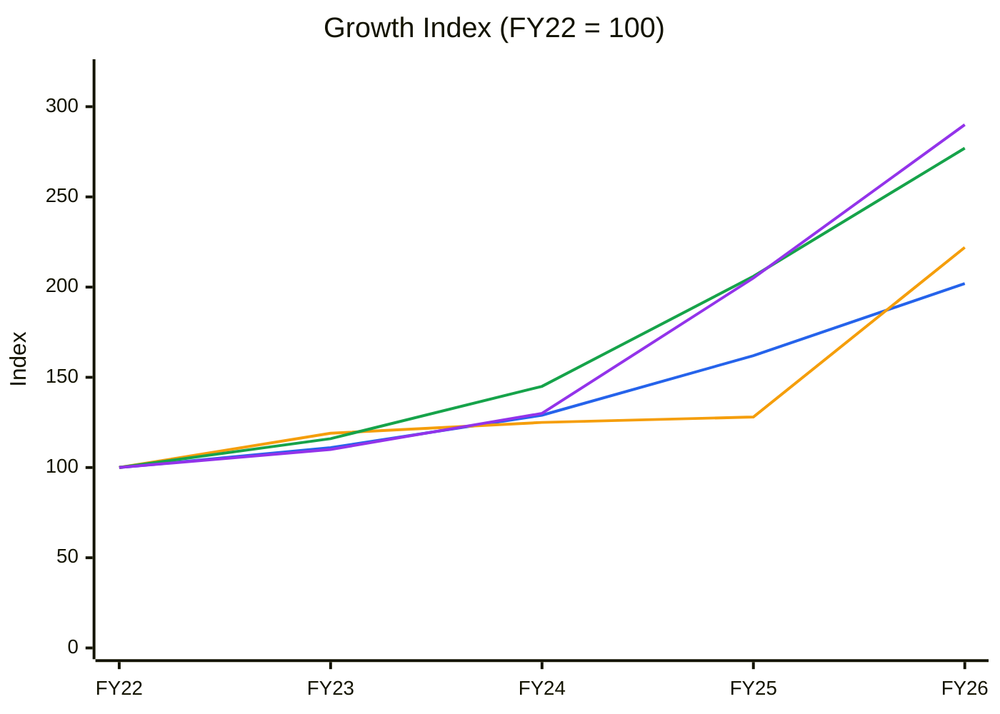
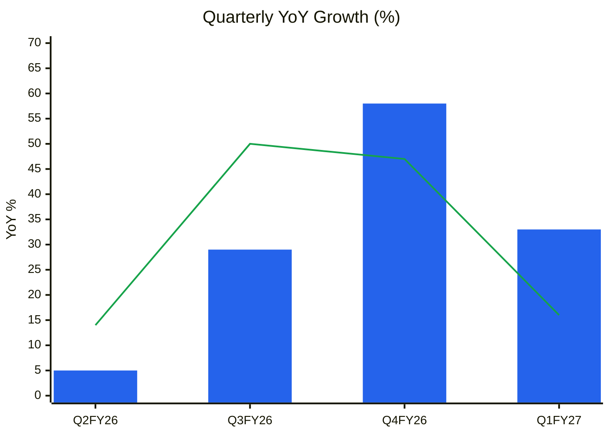
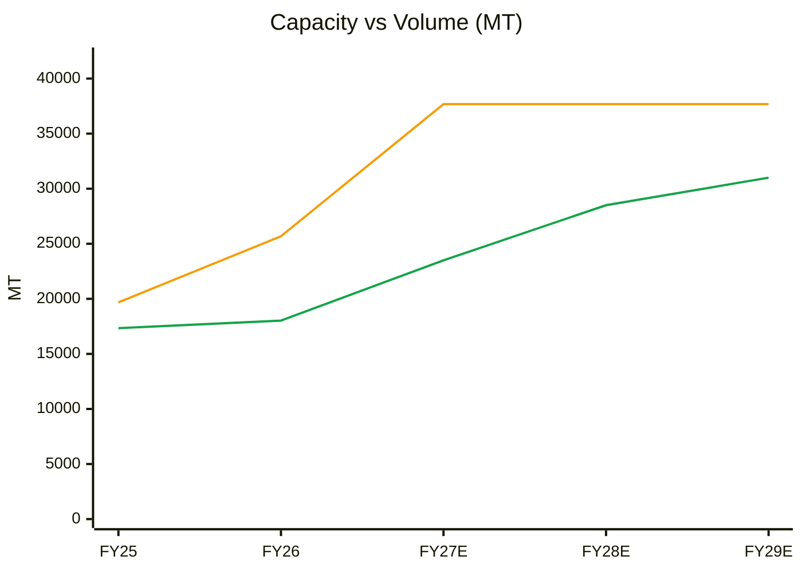
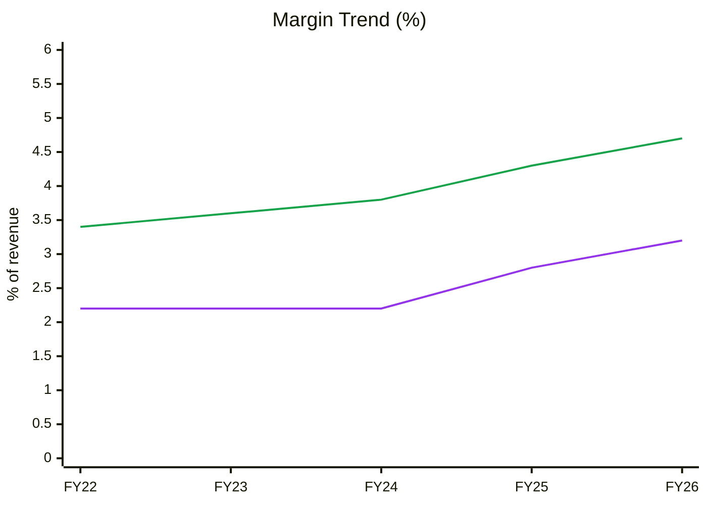
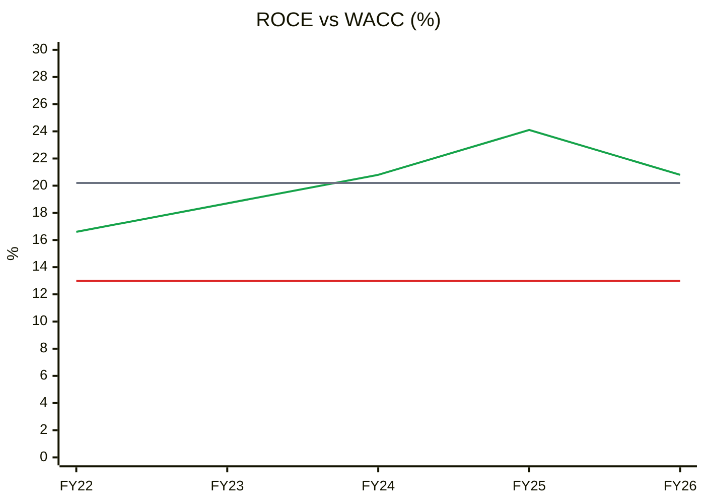
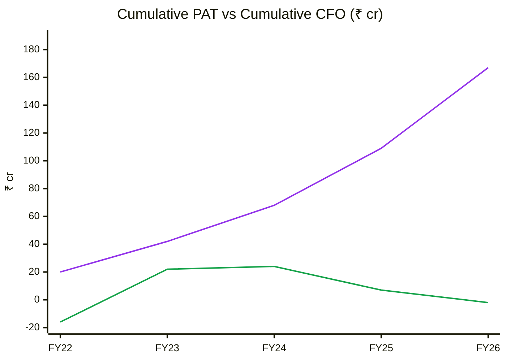
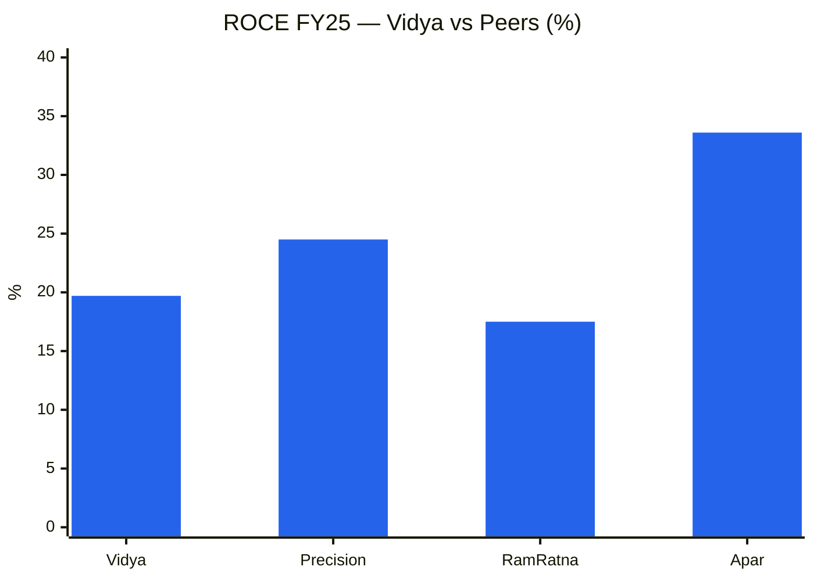
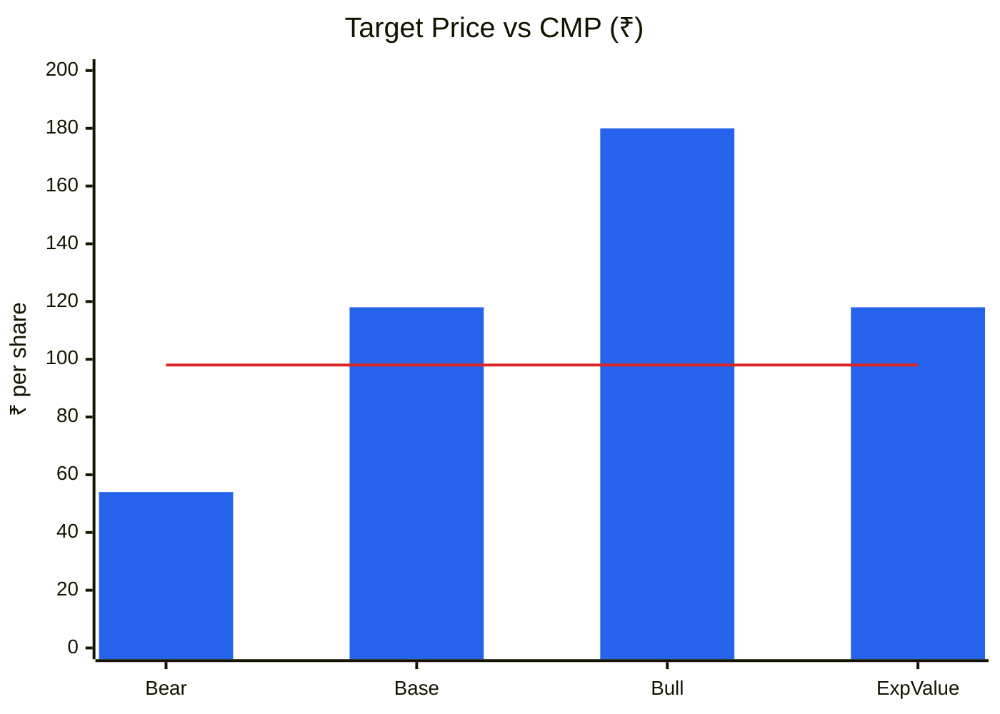
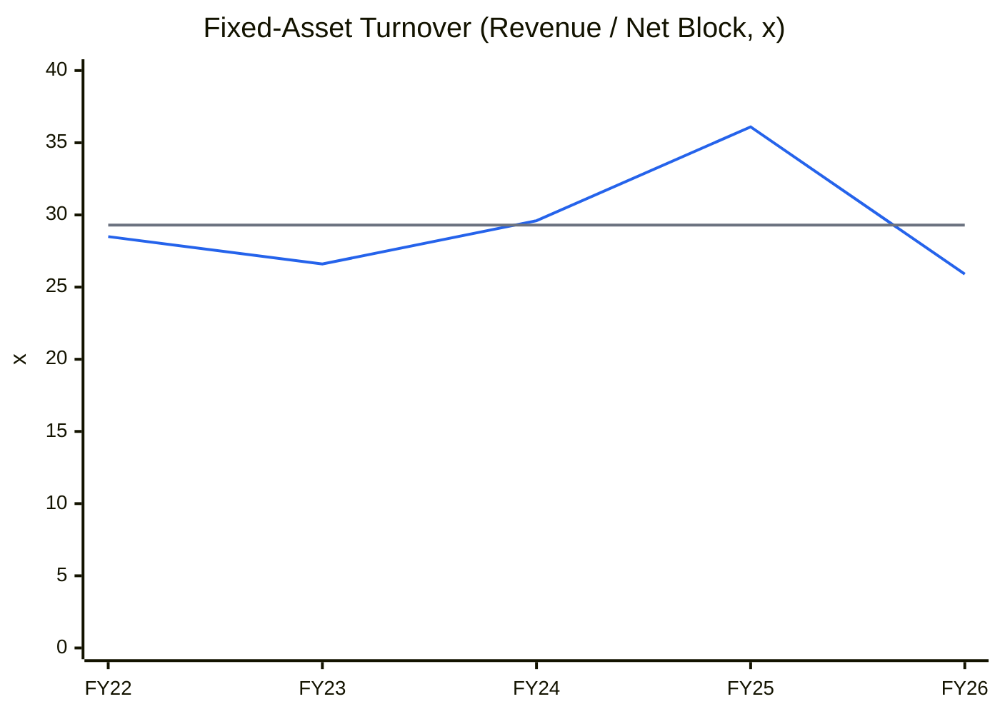

# Stock Analysis Report — Vidya Wires Ltd (NSE: VIDYAWIRES | BSE: 544633)
**Date:** 2026-10-09
**Analyst:** Claude (Stock Fundamental Analysis Skill v3.1)
**Investment Horizon:** 2–3 Years
**CMP:** ₹98.0 | **Market Cap:** ₹2,085 cr | **TTM P/E:** 33.6× | **P/B:** 4.3×
**Recommendation:** WATCHLIST — *Quality at Wrong Price*
**Conviction Score:** 5 / 10

---

## Executive Summary
Vidya Wires is India's 4th-largest maker of copper and aluminium winding wires and conductors (5.7% of industry capacity). It listed in December 2025 at ₹52 and is now nearly doubling capacity (19,680 → 37,680 MT) through its ALCU subsidiary. The business is clean, lightly levered and executing well, and its end-markets have a real T&D/transformer tailwind. But the price already discounts ~41% revenue CAGR for 5 years, which the doubled capacity cannot physically deliver. On top of that, five-year cumulative operating cash flow is roughly zero against ₹167 cr of cumulative profit, because working capital absorbs all earnings. Wait for a better price (below ~₹60–65, ideally near the ₹52 IPO level) or for proof that ALCU can lift EBITDA/kg and convert profit into cash.

🟦 Revenue (CAGR 19.2%) · 🟧 Net Fixed Assets* (22.1%) · 🟩 EBITDA (29.0%) · 🟪 PAT (30.5%)
*Net block from Screener (consolidated). The tangible gross-block PPE note was not extracted; FY21 is missing from Screener, so the chart starts at FY22.
**Read:** PAT above EBITDA above revenue shows operating leverage working. The FY26 jump in fixed assets (ALCU) has not yet shown up in revenue, which is the capex-then-ramp pattern. Note that revenue growth is inflated by copper prices (FY26 volume grew only ~4–6.5% against revenue +24%).

---

## Business Primer

Vidya Wires, of Anand in Gujarat, makes "winding and conductivity products": enamelled copper and aluminium wires, rectangular strips, paper-insulated copper conductors (PICC), copper busbars, bare conductors and PV ribbon. These go into transformers, motors, generators, switchgear, solar modules and EV motors. Customers are B2B OEMs: 318 customers, none above 9% of revenue, including Schneider, Suzlon, Transformers & Rectifiers and Hammond Power, and the company is a pre-approved PowerGrid supplier (SMIFS IPO note, Dec 2025). Revenue is volume × (LME-linked metal price + conversion charge). Metal is passed through back-to-back, so the company earns a **conversion spread per kg**, not a percentage margin (Q4FY26 concall). FY26 mix by end-use was Power & Transmission 51%, Electrical 27%, General Engineering 13%, Renewables/EV 7% and Consumer Durables 3%. About 96% of revenue is copper and 12% is exported. The economics rest on two things: transformer/T&D capex demand, and the ability to fill new capacity at a rising EBITDA per kg.

This is a **commodity-adjacent conversion manufacturer**. Reported revenue and OPM % are distorted by copper prices, so the true value drivers are volume (MT) × EBITDA/kg. The structural features that colour the analysis are: (1) a step change in capacity from the ₹140 cr IPO-funded greenfield ALCU plant at Narsanda (phased start 7 Feb 2026, full ramp by ~Oct 2026); (2) a working-capital-heavy model that has swallowed all operating cash flow for five years; (3) a recent listing with no valuation history, and DII holdings that collapsed from 10.5% to 3.4% in the June 2026 quarter, after the anchor-investor lock-in ended. The key risk is simultaneous capacity additions across the industry compressing conversion spreads just as Vidya doubles capacity.

**Segment check:** Winding Wires & Copper/Aluminium Conductors. KPI block **added to the reference today** with user approval ✓ (`05-industry-kpis-india.md`, final block).

---

## Module 1 — Market, Sector & Stock Cycle

### 1a. Broad Market (Marks)
| Indicator | Reading (8 Oct 2026) | Source |
|---|---|---|
| Nifty 50 | 22,232. −13.5% YoY, −15.7% from 52-wk high (26,373), at its 52-wk low (22,180) | Yahoo Finance weekly |
| Nifty vs 30-wk MA | Below a **declining** 30-wk MA (23,699, from 23,969 five weeks ago) | Computed |
| India VIX | 15.3, up 34% in 4 weeks (52-wk range 8.9–28.9) | Yahoo Finance |
| Macro | Middle East conflict since late Feb 2026; freight and packing costs up (Vidya Q4FY26 concall) | Concall |

**Assessment: Cautious → Fearful.** The pendulum has swung away from greed: the index is in a weekly downtrend at its 52-wk low and volatility is rising. Valuations are improving, but the trend is not supportive. **Sizing:** normal-to-small until Nifty regains its 30-wk MA.

### 1b. Sector Cycle — Winding Wires / T&D components
- **Secular vs cyclical:** The industry is ~343,000 MT (FY25, CRISIL via DRHP). Secular drivers are transformer and T&D capex (RDSS, green corridors, data-centre load), renewables (solar 186 GW by FY27, wind 72.8 GW) and EV motors. **Estimate:** ~10–12% secular volume growth; the T&D transformer upcycle adds another ~5–8% that is cyclical (order backlogs at transformer OEMs) and should not be capitalised permanently.
- **Price component:** Most FY26 revenue growth was copper. Volume grew ~4–6.5% (18,024 MT vs 17,338 MT) while revenue grew 24% (Q4FY26 concall). The price element will mean-revert with LME.
- **Competitive capacity:** Vidya is adding +18,000 MT, and peers Precision Wires (~49,000 MT) and Ram Ratna (~48,600 MT) are also expanding (KPI block context). Simultaneous additions are a **watch item for EBITDA/kg**.
- **Geopolitics/input:** 40–50% of copper rod/cathode is imported. The Middle East conflict raised freight; supply was not disrupted (Q4FY26 call). Classed as **transient**.
- **FX:** 12% export revenue against ~45% imported metal leaves a net USD-short position, but metal is LME-booked back-to-back, so the residual exposure is small.

**Sector verdict: TAILWIND** (multi-year T&D/transformer demand), with a mid-term supply-side risk from peer capex.
*CY5/CY6 industry capacity vs demand and spread charts: no sourced 7–10 year industry series is available (only the FY25 point of 343,000 MT), so they are omitted rather than invented.*

### 1c. Stock Cycle
**Quarterly growth trajectory**

| Quarter | Revenue ₹cr | YoY | EBITDA ₹cr | YoY |
|---|---|---|---|---|
| Q2FY26 | 381 | +5% | 16 | +14% |
| Q3FY26 | 448 | +29% | 24 | +50% |
| Q4FY26 | 599 | +58% | 28 | +47% |
| Q1FY27 | 550 | +33% | 22 (Screener) / 25.2 (company) | +16% / +26% |

🟦 Revenue YoY % (bars) · 🟩 EBITDA YoY % (line, Screener operating profit). Only 4 YoY quarters exist, because pre-listing quarterly data on Screener starts in Sep-24.
**Read:** Growth accelerated into Q4FY26 on copper prices plus the start of ALCU. Q1FY27 EBITDA growth (+16–26%) **lagged** revenue (+33%), with margin down to 4.0–4.6% from 4.85%. ALCU ramp costs are absorbing the operating leverage, so this is **stable-to-decelerating at the EBITDA line**.

**Volume / price / mix (FY23–FY26)**
| Driver | Evidence | Durability |
|---|---|---|
| Volume | 13,415 MT (FY23) → 17,338 (FY25) → 18,024 (FY26). Utilisation 70% → 94.5% (Q1FY26) | Was capped at ~92% of 19,680 MT; ALCU removes the cap |
| Price | FY26 revenue +24% on volume +4–6.5% | Fragile (LME copper) |
| Mix | EBITDA/kg **₹37 (FY25) → ₹47.6 (FY26)** (EBITDA ÷ MT). New VAP: CTC, PV ribbon, Al paper-covered strip | Most durable, if it holds through the ALCU ramp |

**Physical capacity model**
| Year | Capacity (MT, year-end) | Volume (MT) | Utilisation | Source |
|---|---|---|---|---|
| FY25 | 19,680 | 17,338 | 88% | DRHP |
| FY26 | ~25,680 (ALCU 6–7k installed) | 18,024 (ALCU ~800) | ~83% of avg | Q4FY26 call |
| FY27E | 37,680 (full by ~Oct-26) | 23,500 | ~75% of avg installed | Mgmt: ALCU 50–60% in FY27 |
| FY28E | 37,680 | 28,500 | 76% | Mgmt: "optimum ~80%" in FY28 |
| FY29E | 37,680 | 31,000 | 82% | Base case |

🟧 Installed capacity (year-end) · 🟩 Volume sold (FY27E–FY29E = base-case estimates)
**Read:** The **capacity ceiling arrives in FY29–FY30** (~85–90% of 37,680 MT ≈ 32–34k MT). Beyond that, growth needs EBITDA/kg gains or a new phase. Management says land is available, but no new phase has been announced.

**Operating leverage:** Contribution is hard to isolate. With metal ~85% of cost, fixed cost is small and DOL is modest (~1.5–2×). DFL = EBIT 86 / (86 − 13) = 1.18× (FY26). After the IPO debt repayment, Q1FY27 interest is ₹1 cr, so DFL is ~1.05×. **ICR is comfortable** (> 6×) in every forecast year.

**FCF inflection year:** FY29E (see Module 10). FY27 is a cash burn year from ALCU working capital.

**Stock cycle classification: EARLY CYCLE / RAMP-UP.** Capex is heavy, revenue is accelerating and margins are slightly suppressed during the ramp. Standard MoS.

---

## Module 2 — Industry Structure & Capital Cycle
| Force | Assessment | Signal |
|---|---|---|
| New entrants | Low capital intensity (₹140 cr for 18,000 MT). Barriers are BIS/UL certification, OEM approval cycles (2–3 months per customer) and working-capital funding | Moderate barriers |
| Supplier power | Copper rod/cathode from Hindalco, Adani and importers; LME-priced; payables only 2–5 days | **High**: suppliers give almost no credit |
| Buyer power | Transformer/motor OEMs are concentrated and price-sensitive; 30–45-day credit | Moderate-high |
| Substitutes | Aluminium for copper in transformers (Vidya makes both, so this is a partial hedge); CTC replacing PICC | Low; Vidya is on both sides |
| Rivalry | Fragmented: top 5 = 46.4% (CRISIL); Precision, Ram Ratna and KSH compete on 50–60% of SKUs | Moderate-high |

**Industry verdict: NEUTRAL.** It is a conversion business with low pricing power, but demand is structurally growing and organised players are consolidating share from unorganised ones.
**Capital cycle:** **Mid-to-late upcycle.** Returns are above historical levels (Vidya ROCE 21–24%, Precision ~24%), several players are adding capacity, and the sector is attracting IPOs (Vidya Dec 2025, KSH International). These are deteriorating-returns signals on the Chancellor table. *CY8 (industry capex/depreciation) is not built because peer 10-year capex series were not retrieved.*

---

## Module 3 — Business Quality & Moat
| Greenwald barrier | Test | Verdict |
|---|---|---|
| Supply/cost advantage | Fixed-asset turnover 36× vs peers 10–23× (FY25 DRHP); 35–40% backward integration into OFC rod; lean working capital vs peers (58 vs 75–90 days, concall) | **Partial**: operating efficiency, but replicable by spending |
| Customer captivity | 94% repeat revenue (FY25); OEM qualification audits; PowerGrid approval | **Weak-moderate**: approvals create stickiness, not lock-in |
| Local scale | 71% of revenue from Gujarat/Maharashtra; logistics near Hazira/Mundra | Regional cost edge, not dominance (5.7% share) |

**Buffett 10% price test:** **Fail.** Conversion charges are negotiated against LME and peers.
**Market share:** 5.7% of capacity (FY25), rising to ~11% post-ALCU *if* filled (management slide). There is no 5–10 year share series, so **stability is untested**.

**Moat verdict: NARROW-TO-NONE.** Efficiency and approvals, but no structural barrier.

**Fisher 15-point (1–3 each):** Market potential 3 · New products 3 (8 new SKUs at ALCU) · R&D 2 · Sales org 2 · Margin level 1 · Margin improvement 2 · Labour 2 · Exec relations 2 · Depth below CEO 1 (family-run: Rathi family) · Cost controls 2 · Industry advantages 2 · Long-range orientation 2 · Dilution 2 (one-time IPO) · Candor in adversity 2 (untested; listed < 1 yr) · **Integrity 2 (pass; no red flags found)** → **30 / 45**.

---

## Module 4 — Management & Capital Allocation
**Promoter holding:** 72.80% (flat for 3 quarters since listing) | **Pledge:** none disclosed → **Normal**
**Institutional flow:** DIIs 9.53% → 10.46% → **3.37%** (Jun-26). FIIs rose 0.68% → 1.98%, public rose 15.6% → 21.8% and shareholder count rose 60.7k → 83.7k. **Read:** institutions (largely IPO anchors) sold to retail after lock-in expiry. This is a **bearish** demand signal.
**Share count:** 16.0 cr → 21.27 cr (IPO, +33%). One-time dilution to fund growth and deleverage.
**FCF/share vs EPS:** 5-yr cumulative FCF is −₹130 cr consolidated, while EPS compounded ~30%. The gap is the working-capital story (Module 5), not manipulation.
**Capital allocation: GOOD.** The IPO went to growth capex (₹94 cr deployed) plus ₹100 cr of debt repaid; ₹46 cr remained unspent at 31-Mar-26. There is a GST-subsidy angle (45–50% of ALCU investment refundable over 10 years, per concall), no dividend so far, and no acquisitions.
**RPT:** Nothing material found in the documents reviewed. ALCU is a 100% subsidiary funded with ₹125 cr of preference shares (Q1FY27).
**Remuneration:** Not extracted; no flag raised.
**Three C's:** Candor **Moderate**: the company declined to give FY27 guidance or Q4 volumes ("will get back"), and booked a Q4 other-expense catch-up (₹2.8 cr → ₹8.3 cr) with a thin explanation. Competence **Good**: ROCE 17–24% through FY22–26. Caring **Moderate**: no payout yet, though that is acceptable mid-capex.

### Walk the Talk Scorecard
| Source | Statement | Guided | Actual | Verdict |
|---|---|---|---|---|
| DRHP / IPO note (Dec-25) | ALCU commercial operations | Q3FY26 | Phased start 7-Feb-26 (Q4FY26) | ⚠️ ~1 qtr late |
| DRHP | ₹100 cr of IPO money to repay debt | ₹100 cr | ₹100 cr repaid by Mar-26 | ✅ |
| DRHP / Q4 call | Lower interest burden | ↓ | Q1FY27 interest ₹1 cr vs ₹3 cr | ✅ |
| Q4FY26 call | Other expenses normalise to revenue % | Normalise | Q1FY27 EBITDA margin 4.0–4.6% (vs 4.7% in Q4) | ✅ broadly |
| DRHP / Q4 call | Exports to 25–30% of revenue by FY28 | Rising | FY25 13.6% → FY26 ~12% | ❌ moving the wrong way |
| Q4FY26 call | ALCU full capacity "before Diwali" (~Oct-26) | Oct-26 | Not yet verifiable (Q2FY27 not reported) | ⏳ pending |
| Q4FY26 call | Working-capital cycle 60 → 50–52 days; debtors 41 → 35 | Lower | Not yet verifiable | ⏳ pending |

**WTT score:** (0.5 + 1 + 1 + 1 + 0) / 5 = **0.70 → MODERATE** (small sample: listed < 1 year, 2 concalls)
**Key pattern:** Delivers on financial housekeeping (debt, costs). Timelines slip modestly. Avoids quantitative guidance (*selective disclosure*: no volume or EBITDA/kg guidance).
**Insider action:** No open-market promoter trades identified (Form C not retrieved). Institutional exit after lock-in is the notable action → **mildly BEARISH**.
**DCF impact:** Growth guidance haircut 10–15%. ALCU ramp assumed one quarter slower than guided.
**Management credibility: MODERATE.**

---

## Module 5 — Financial Forensics
| Model | FY26 value | Interpretation |
|---|---|---|
| Beneish M-score (proxy) | **−1.43** after neutralising AQI* | Above −1.78. Driven by **TATA 0.11** (PAT ₹58 cr vs CFO −₹9 cr) and SGI 1.24 (copper-inflated sales). An accrual build-up, not evidence of manipulation |
| Altman Z'' | 11.2 (FY26); 6.2–6.3 (FY24–25) | **Safe** (IPO cash inflates FY26) |
| Piotroski F | **4 / 9** | Average-weak. Fails CFO>0, ΔROA, CFO>NI, no-dilution, asset turnover |
| Sloan accrual (CF) | +45.9% FY26 / +22.8% FY25 | **Warning**. FY26 is inflated by IPO capex in CFI, but FY25 (pre-IPO) was already +23% |
| 5-yr cumulative CFO / PAT | **−₹2 cr / ₹167 cr ≈ 0.0** | 🔴 Red flag |

*AQI as computed (13.3) is a CWIP artefact: ₹72 cr of ALCU capex sits outside both net block and current assets. Set to 1.0.*

**Indian-specific checks**
- Pledge: none ✓ · ICDs to group: none found ✓ · RPT: subsidiary funding only ✓
- Auditor: not reviewed in detail (FY26 AR not parsed). No qualification reported in news ⚠️ *verify*
- Revenue quality: debtor days 29 → 35 → 40 (FY24–26), rising while revenue is copper-inflated. **Schilit EMS #1 watch.**
- Payables only 2–5 days: suppliers are cash-and-carry, so working capital is structurally self-funded.

**Schilit screen:** Other income/EBIT = 9/82 = 11% (OK). Capex/depreciation = 37× in FY26, but this is genuine greenfield (ALCU is visible as CWIP). No one-offs except the Q4 expense catch-up. No factoring visible (debtor days are *rising*, not falling).
**Forensic red flags: 3 / 15** (CFO vs NI; Sloan; Beneish proxy). These are **explained**: copper-price inflation of receivables and inventory, a growth-phase working-capital build, IPO-year capex, and a 2-day payables model. That clears the hard-stop rule, but this is the **#1 diligence item**.
**Overall forensic verdict: MINOR-TO-SIGNIFICANT CONCERNS.** Earnings are real, but cash conversion has to be proven.

---

## Module 6 — Earnings Quality & Financial Statements
**ROCE (pre-tax, avg capital employed):** FY26 20.8% · 5-yr avg 20.2% | **WACC:** 13% (Rf 7% + β ~1.1 × 6%; minimal debt)
**ROIC (post-tax):** ~13% FY26 on IPO-inflated capital (NOPAT ₹64.5 cr / invested capital ~₹495 cr); ~19% pre-IPO
**Spread:** ROCE +7.8pp over WACC → **value creating**. Post-tax ROIC is only ~WACC until ALCU fills.
**Economic profit:** positive pre-IPO; ~0 in FY26 (cash drag)

| Year | EBITDA % | PAT % | ROCE % | CFO ₹cr | PAT ₹cr |
|---|---|---|---|---|---|
| FY22 | 3.4 | 2.2 | 16.6 | −16 | 20 |
| FY23 | 3.6 | 2.2 | 18.7 | 38 | 22 |
| FY24 | 3.8 | 2.2 | 20.8 | 2 | 26 |
| FY25 | 4.3 | 2.8 | 24.1 | −17 | 41 |
| FY26 | 4.7 | 3.2 | 20.8 | −9 | 58 |
*(Screener consolidated; ROCE computed = (PBT + interest) / average (equity + borrowings))*

🟩 EBITDA margin · 🟪 PAT margin. Gross margin is not meaningful (metal pass-through).
**Read:** Margins rose four years in a row, even with rising copper (which mechanically depresses OPM %). This is real EBITDA/kg improvement (₹37 → ₹47.6 per kg). The **FY26 OPM of 4.7% is +0.7pp above the 5-yr average of 4.0%, roughly +1SD**: a peak-ish level going into the ramp. Q1FY27 has already dipped to 4.0–4.6%.

🟩 ROCE · 🟥 WACC 13% · ⬜ 5-yr average 20.2%
**Read:** ROCE has beaten WACC every year (spread +4 to +11pp). FY26 sits exactly at its 5-yr average, so it is **mid cycle** on returns. The dip from FY25 is IPO cash and CWIP not yet earning.

🟪 Cumulative PAT · 🟩 Cumulative CFO
**Read:** Cumulative CFO/PAT is **≈ 0.0×** (healthy ≥ 0.9, red flag < 0.7). Every rupee of profit since FY22 has gone into receivables and inventory. Standalone CFO is slightly better (₹16 cr cumulative). This is the visual O'Glove flag #1 and the single biggest earnings-quality issue.

**DuPont (5-factor, consolidated, average-balance basis)**
| Year | EBIT margin | Asset turnover | Equity multiplier | Interest burden | Tax burden | ROE |
|---|---|---|---|---|---|---|
| FY22 | 3.6% | 4.33× | 2.71× | 0.79 | 0.77 | 25.6% |
| FY23 | 3.7% | 4.81× | 2.36× | 0.78 | 0.76 | 24.7% |
| FY24 | 3.8% | 5.17× | 2.02× | 0.76 | 0.76 | 23.0% |
| FY25 | 4.5% | 5.12× | 1.98× | 0.83 | 0.75 | 28.1% |
| FY26 | 4.9% | 3.93× | 1.45× | 0.86 | 0.74 | 18.0% |
| **Δ FY22→26** | **+1.3pp** | **−0.40×** | **−1.26×** | **+0.07** | −0.03 | **−7.6pp** |

**Operating contribution (EBIT margin × AT):** improving (15.6% → 19.3%) · **Financing contribution:** falling sharply (deleveraging + IPO equity)
**DuPont verdict:** the ROE decline is **purely financial dilution from IPO cash**. Operations improved. This is the opposite of the leverage-masking red flag.
**AT trend → Module 10 base:** declining in FY26 (CWIP/IPO cash). Use the 5-yr average fixed-asset turnover (~29×), haircut for new capacity.
**O'Glove flags: 3 / 15** (NI vs OCF, Sloan, Beneish proxy). **Ind AS 116:** immaterial.

---

## Module 7 — Industry KPIs & Peer Analysis
**Sector:** Winding Wires & Cu/Al Conductors (new KPI block)

| KPI | Vidya | Benchmark | Assessment |
|---|---|---|---|
| EBITDA/kg | ₹37 (FY25) → **₹47.6 (FY26)** | Healthy ₹30–45; an analyst on the call claimed peers ~₹66/kg (unverified) | Above range ✓ (copper-boosted?) |
| Volume growth / utilisation | +4–6.5% FY26; 94.5% utilisation pre-ALCU | > 10% growth, > 80% utilisation | Volume capped in FY26 ✗; utilisation ✓ |
| Value-added mix | Not disclosed (management: "we average it out") | Rising | ⚠️ undisclosed |
| Cash conversion cycle | 50 → 57 → **64 days** (FY24–26) | < 60 days | Slipping above threshold ⚠️ |
| Metal pass-through | Back-to-back LME booking (call) | Gains/losses < 10% of EBITDA | ✓ per management |
| Fixed-asset turnover | 36× (FY25) → 26× (FY26) | 10–25× | ✓ best-in-class |
| Export share | 13.6% → ~12% | 15–30% | Below range ✗ |

**Peer comparison (FY25, SMIFS IPO note from DRHP data; P/E as of 1-Dec-25)**
| Metric | Vidya | Precision Wires | Ram Ratna Wires | Apar Ind. |
|---|---|---|---|---|
| Revenue ₹cr | 1,486 | 4,015 | 3,677 | 18,581 |
| Revenue CAGR (2-3 yr) | 21.2% | 15.0% | 17.8% | 13.9% |
| EBITDA margin | 4.32% | 4.13% | 4.22% | 8.33% |
| ROCE | 19.7% | 24.5% | 17.5% | 33.6% |
| Capacity (MT) | 19,680 | 49,000 | 48,600 | n/a |
| P/E (Dec-25) | ~27× at IPO | 48.8× | 40.5× | n/a |

**Read:** Vidya's returns are in line with its pure-play peers (between Precision and Ram Ratna), and Apar's diversified mix earns more. Vidya has *faster growth*, not superior returns. A **P/E of 33.6× (TTM) is now in the peer range of 40–49×** (Dec-25 data), so the IPO discount has fully closed.
**Peer positioning:** In-line to slight discount. Justified? Yes. It is smaller, younger and has weaker cash conversion.

---

## Module 8 — Market Size & Market Share
**TAM:** ~343,000 MT (FY25, India production). At ~₹1,000/kg that is roughly ₹34,000 cr | **Growth:** ~9–10%/yr (management's market figure on the call; CRISIL DRHP)
**Penetration / share:** 5.7% of capacity; ~5.1% of volume (17,338 / 343,000)
**5-yr share trend:** Gaining modestly. Volume grew 29% over FY23–25 vs market ~18–20%.
**Post-ALCU share target:** ~11% of capacity. That implies taking roughly 1.5–2pp of share a year from Precision, Ram Ratna, KSH and unorganised players.
**Driver:** Structural (organised players gaining, new VAP categories), but it requires price competition to fill 18,000 MT.
**Verdict:** **Taking share**, but its pace from FY27 depends on how fast ALCU fills, which is not yet proven.

---

## Module 9 — Valuation: PIE First, Then Intrinsic Value

### 9A. Price-Implied Expectations (two-stage reverse DCF)
*EV ₹2,100 cr (market cap ₹2,085 + borrowings ₹85 − cash and unspent IPO funds ~₹70) · TTM revenue ₹1,978 cr · NOPAT ₹64.5 cr (3.26%) · sales-to-capital 5.0× · WACC 13% · terminal growth 6% · 5-yr growth fading to 6% by year 10*

| PIE value driver | Market-implied | My base case | Gap |
|---|---|---|---|
| Revenue CAGR (5 yr) | **~41%** | ~18% (FY26–29E; volume +20% plus mix, copper flat) | **−23pp (optimistic gap)** |
| NOPAT margin | 3.3% held | 3.0–3.4% | ≈ |
| Investment rate | 20% of Δrevenue | ~25–30% (working capital ~15% of revenue plus capex) | Market under-prices the reinvestment need |

**Physical plausibility check:** 41% NOPAT/revenue CAGR for 5 years means ~₹360 cr of NOPAT by FY31. At ₹50/kg that needs about **98,000 MT, 2.6× even the expanded 37,680 MT**. The market is pricing an **unannounced expansion or a step change in EBITDA/kg**. This is the most actionable disagreement in the report.
**Treadmill:** To outperform, Vidya must fill ALCU *and* hold EBITDA/kg ≥ ₹48, *and* announce phase 3 by FY28, *and* convert profit into cash.
**Positive triggers:** ALCU at > 80% utilisation by Q4FY27; disclosed EBITDA/kg ≥ ₹50; CFO turning positive; CTC/PV ribbon orders; phase-3 announcement.
**Negative triggers:** EBITDA/kg slipping below ₹40 during the ramp; working capital > 70 days; peers' capacity causing price cuts; copper correction shrinking optical revenue growth.
**SVAR** (growth at 70% of PIE, margin −25%): downside value ≈ ₹23 → **SVAR 77%**. Very unfavourable on an absolute DCF basis.

### 9B. Intrinsic value
| Method | Bear | Base | Bull |
|---|---|---|---|
| DCF (13% WACC; 15/20/25% 5-yr CAGR, 3.4% NOPAT margin) | ₹41 | ₹48 | ₹58 |
| Relative (FY27E EPS ₹3.5 × 21 / 30 / 40× peer band) | ₹73 | ₹104 | ₹139 |
| EPV (no-growth NOPAT / WACC − net debt) | ₹23 | ₹23 | ₹23 |
| **Consensus range** (DCF and relative weighted equally) | **₹57** | **₹76** | **₹99** |

**CMP ₹98 vs base ₹76 → 29% premium. MoS gate FAILS** (small-cap requires 40–50% *discount*).
**Graham Number:** √(22.5 × 5-yr avg EPS ₹1.57 × BVPS ₹22.6) = **₹28**. **Reverse DCF:** 41%, aggressive.
**Misprice reason:** none. This is fairly-to-richly priced post-IPO momentum, with a sector narrative of energy transition and transformers.
**Catalyst:** ALCU at full utilisation (H2FY27) and the first EBITDA/kg disclosure.

**Scenario targets (exit-multiple basis, ~Sep-2028 on FY29E EPS; see Module 11)**

🟦 Scenario price (2-yr) · 🟥 CMP ₹98
**Read:** Measured against market multiples, the expected value of ₹118 is +20% over ~2 years (~10%/yr, below the cost of equity). Bear is −45% and bull +84%, so **U/D is 1.9:1**: the reward does not compensate for the risk of multiple compression from 26× to 18×.

*CY1 (P/E band), CY2 (P/B band) and CY4 (price vs EPS index): not possible. The stock listed on 10-Dec-2025, so there are fewer than 4 year-end observations. This is noted rather than charted.*

### Cycle Position Dashboard
| Dimension | Current | Reference | Percentile | Signal |
|---|---|---|---|---|
| P/E (TTM) | 33.6× | Peer 40–49× (Dec-25) | n/a (no history) | Fair vs peers; rich vs DCF |
| P/B | 4.3× | n/a | n/a | — |
| EBITDA margin | 4.7% (FY26) / 4.0–4.6% (Q1) | 5-yr avg 4.0%, ~+1SD | ~100% of 5-yr series | Upper-mid |
| ROCE | 20.8% | 5-yr avg 20.2% | 50% | Mid |
| Industry utilisation | Vidya ~94% pre-ALCU; industry n/a | — | — | Tightening → supply wave (peers adding) |
| EBITDA/kg | ₹47.6 | ₹37 (FY25) | high | Upper; at risk during the ramp |
| **Overall cycle position** | | | | **Early (company ramp) / mid-late (industry)** |
Consistent with Module 1c (Early/Ramp-up) and Module 1b (Tailwind with supply risk) ✓

---

## Module 10 — Technical Stage (Weinstein + CANSLIM)
| Item | Reading |
|---|---|
| Nifty 50 stage | **Stage 4.** Below a declining 30-wk MA at its 52-wk low |
| Sector index | Nifty Infra/Capital Goods data could not be retrieved. Defaulting to the market (Stage 4 risk) |
| Stock stage | **Stage 2 (mature).** Price ₹98 vs **rising** 30-wk SMA ₹88.6 (₹81.8 five weeks ago). 52-wk range ₹42.5–117.4 |
| Base | 12-week range ₹86–98 (Jul–Oct 2026) under the ₹117 high |
| RS vs Nifty | **Strongly positive.** 26-wk +40.8% vs Nifty −8.7% |
| Volume | Last 4-wk average 7.4m vs 20-wk average 13.9m. The push to ₹98 is on **below-average volume** → unconfirmed |
| Pivot / entry | Valid breakout = weekly close > ₹117 on ≥ 1.5× average volume |
| Stop-loss | ₹85 (below the 12-wk base low and the 30-wk MA) |

**CANSLIM:** C 1 (Q1 EPS +42%) · A 1 (3-yr PAT CAGR 38%, ROE ~18%) · N 1 (new plant, new products) · S 0 (volume declining; post-lock-in float overhang) · L 1 (RS leader) · I 0 (DIIs exiting) · M 0 (Nifty Stage 4) → **4 / 7**
**Stage + fundamentals:** Misaligned. The technicals are constructive, but the market is Stage 4 and valuation fails.

---

## Module 11 — Forward View: 2–3 Year Thesis

### Capex classification
| Capex type | FY27E | FY28E | FY29E | In model? |
|---|---|---|---|---|
| Tangible growth (ALCU balance: ₹46 cr unspent IPO funds) | 45 | 5 | 8 | ✅ |
| Maintenance (≈ depreciation) | 5 | 10 | 12 | ❌ sustains only |
| Intangibles | ~0 | ~0 | ~0 | ❌ |
| CWIP at 31-Mar-26: **₹72 cr** (ALCU), transferring to PPE in FY27 | — | — | — | Highest-certainty input |
| **Total capex** | **50** | **15** | **20** | |

| Year | Net fixed assets (₹cr) | Revenue (₹cr) | FAT (×) |
|---|---|---|---|
| FY22 | 32 | 913 | 28.5 |
| FY23 | 38 | 1,011 | 26.6 |
| FY24 | 40 | 1,182 | 29.6 |
| FY25 | 41 | 1,481 | 36.1 |
| FY26 | 71 (+72 CWIP) | 1,840 | 25.9 |
| **5-yr avg** | | | **29.3×** |

🟦 Fixed-asset turnover · ⬜ 5-yr average 29.3×
**Read:** FY25's 36× was a peak-utilisation outlier. New ALCU assets (higher-spec VAP lines) will run at lower turnover, so **the model uses volume × EBITDA/kg (KPI-native) rather than AT**, and treats AT only as a cross-check (FY29E ≈ 3,250 / ~200 = 16×).

**Incremental ROIC (ALCU):** ΔEBITDA ≈ 13,000 MT × ₹46/kg = ₹60 cr → NOPAT ~₹41 cr ÷ (capex ₹140 cr + working capital ~₹205 cr at 15% of Δrevenue) = **~12% vs WACC 13% → VALUE-NEUTRAL**. Including the GST subsidy (~₹6–7 cr/yr) it is ~14%, marginally value-creating. On fixed capital alone it is 29%, but **working capital is the real investment** in this business.
**Capex-model implied revenue CAGR (FY26–29E):** 20.9% (volume-led) **vs PIE 41%** → the market is pricing an **unannounced expansion**.

### Capex-to-earnings model (base)
| Metric | FY27E | FY28E | FY29E |
|---|---|---|---|
| Volume (MT) | 23,500 | 28,500 | 31,000 |
| EBITDA/kg (₹) | 45 | 46 | 46 |
| Revenue (₹cr, at ~₹1,050/kg flat copper) | 2,470 | 2,990 | 3,250 |
| EBITDA (₹cr) | 106 | 131 | 143 |
| D&A | 9 | 11 | 11 |
| EBIT | 97 | 120 | 132 |
| Interest | 6 | 8 | 9 |
| Other income | 8 | 6 | 6 |
| ICR (×) | 16× | 15× | 15× |
| PBT | 99 | 118 | 129 |
| PAT (25.2% tax) | 74 | 88 | 96.5 |
| EPS (₹, 21.27 cr shares) | 3.48 | 4.14 | 4.54 |
| ΔWorking capital (15% of Δrevenue) | −95 | −78 | −39 |
| Capex | −50 | −15 | −20 |
| **FCF (₹cr)** | **−62** | **+6** | **+48** |
| Net debt / EBITDA | ~0.7× | ~0.6× | ~0.3× |

**FCF inflection year:** FY29E. **Debt ceiling:** well within the safe zone (peak ~0.7× EBITDA).

### Catalysts
1. ALCU full ramp, with Q3/Q4FY27 volumes disclosed: H2FY27
2. CTC (3,000 MT phase 1) and PV ribbon commercialisation; transformer OEM approvals: Q3FY27–FY28
3. Working capital back to 50–52 days and CFO turning positive: FY27 results (May-27)
4. Export ramp via UL-certified US magnet-wire supply: FY28
5. Phase-3 capacity announcement (land available): FY28

### Risks
1. **EBITDA/kg compression** as Vidya, Precision, Ram Ratna and KSH add capacity at once: **Medium-High**
2. **Working capital absorbing all profit** (CFO ≤ 0 again in FY27): **High** (built into the model)
3. Copper price correction shrinking revenue growth optics (EPS impact is limited): **Medium**
4. Post-IPO de-rating as remaining lock-ins expire and institutions exit: **Medium**
5. Transformer/T&D order cycle slowing after FY28: **Low-Medium**

### Scenario analysis (volume × EBITDA/kg driven)
| Scenario | Volume FY29E | EBITDA/kg | Revenue FY29E | EBITDA margin | EPS FY29E | Exit P/E | Target | Prob. |
|---|---|---|---|---|---|---|---|---|
| Bull | 33,500 MT (89%) | ₹52 | ₹3,520 cr | 4.9% | ₹5.63 | 32× | **₹180** | 25% |
| Base | 31,000 MT (82%) | ₹46 | ₹3,250 cr | 4.4% | ₹4.54 | 26× | **₹118** | 50% |
| Bear | 26,000 MT (69%) | ₹38 | ₹2,730 cr | 3.6% | ₹2.99 | 18× | **₹54** | 25% |
| **Expected value** | | | | | | | **₹118** | |

**Return from CMP (expected value):** +20% over ~2 years (~9–10% CAGR) → below the 13% hurdle.

---

## Checklist Summary
**Section A (Business quality):** 15 / 18. Scuttlebutt is limited to concall and IPO-note sources; no Form C check.
**Section B (Forensics):** 7 / 9. Auditor report/KAMs not read; Beneish is a proxy.
**Section C (Financial statements):** 10 / 12. ROIC series is only 5 years; tangible gross block not extracted.
**Section D (KPIs & peers):** 7 / 7
**Section E (Market size & share):** 5 / 7. No 5-yr market share series.
**Section F (Valuation):** 10 / 10
**Section G (Technical):** 7 / 8. Sector index stage not retrieved.
**Section H (Forward view):** 24 / 28. Gross block replaced by a volume model (KPI-native).
**Section I (Charts):** 4 / 4. C1, C2, C4, C5, C6, C7, C10, C12, C13 and CY7-equivalent included; CY1/CY2/CY4 not possible (listing < 1 yr) and CY5/CY6 not sourced, both stated.
**Hard stops triggered:** None. The Beneish proxy above −1.78 is *explained* by copper inflation, growth working capital and IPO-year capex, but it stays a watch item.
**Pre-buy check:** Fails the MoS gate. The "why is it mispriced?" question has no answer: it isn't mispriced, it's fully priced.

---

## Investment Decision
**Verdict:** **QUALITY AT WRONG PRICE → WATCHLIST**
**Conviction score:** 5 / 10 (cycle 0.5 · industry 0.5 · moat 1 · management 0.5 · financial/earnings quality 1 · valuation 0.5 · technical 0.5 + rounding up for growth visibility = ~5)
**Suggested position size:** 0% now. A 1–2% starter is acceptable only on a confirmed breakout above ₹117 *and* a Nifty Stage 2 recovery.
**Buy-below price:** **₹60–65** (≈ 15% below the blended base value of ₹76), or near the **₹52 IPO price** for a full 30%+ MoS
**Stop-loss (if a position is held):** ₹85 weekly close
**Target price (base, 2-yr):** ₹118 (exit multiple) / ₹76 (blended intrinsic)
**Review triggers:** (1) Q2/Q3FY27 volume and EBITDA/kg disclosure. Add if ≥ ₹48/kg with ALCU > 60% utilised. (2) FY27 CFO: if negative again, downgrade to *Cheap but Flawed* at any price. (3) Phase-3 capacity announcement, which would close the PIE plausibility gap.

---
*Sources: Screener.in (consolidated and standalone, accessed 9-Oct-2026); Vidya Wires Q4FY26 earnings call transcript (BSE filing, 18-May-2026); SMIFS IPO note (2-Dec-2025, from DRHP/CRISIL data); company Q1FY27 results (via multibagg.ai / ScanX summaries); Yahoo Finance price data (weekly, to 8-Oct-2026).*
*Report generated by Stock Fundamental Analysis Skill v3.1 | Indian Markets Context*
*Save path: C:\Users\anubh\Documents\Anubhav\Stock Analysis\Stock Analysis\*
