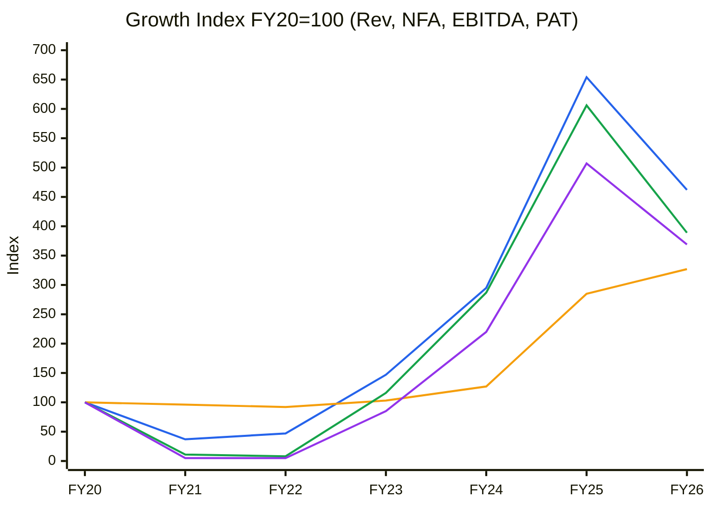
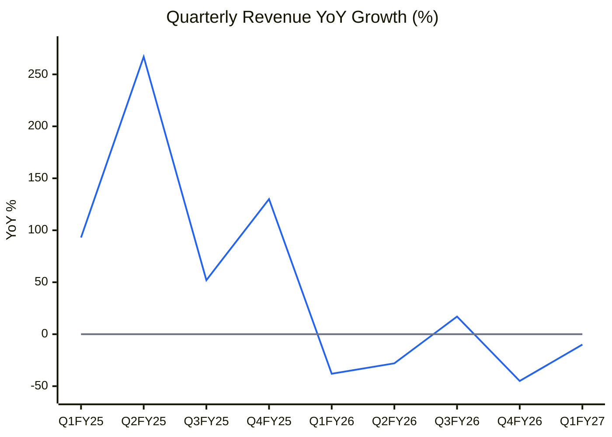
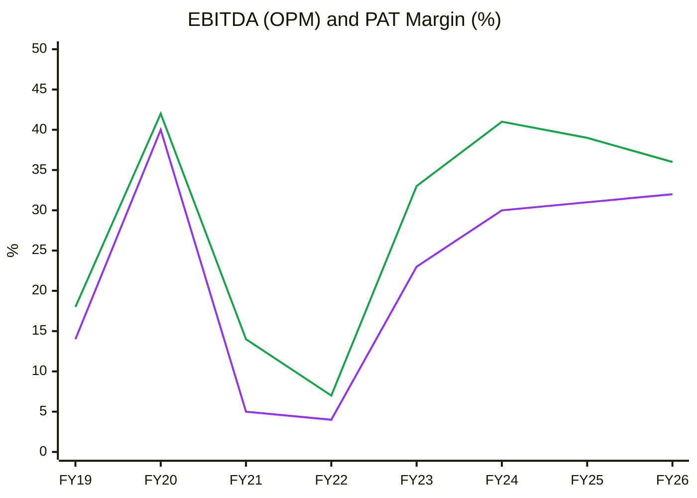
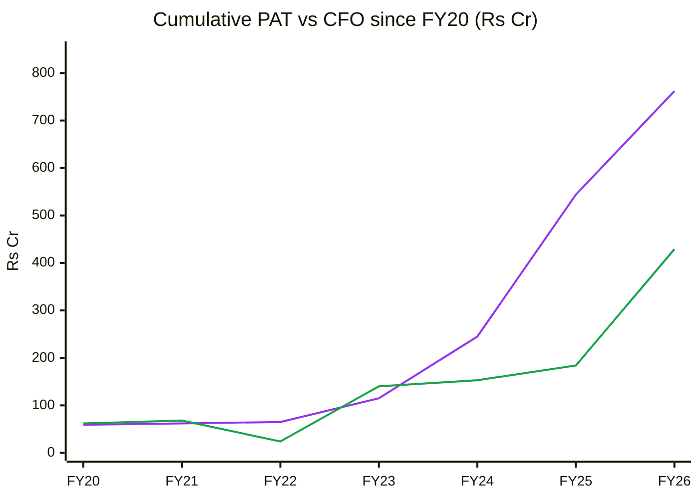
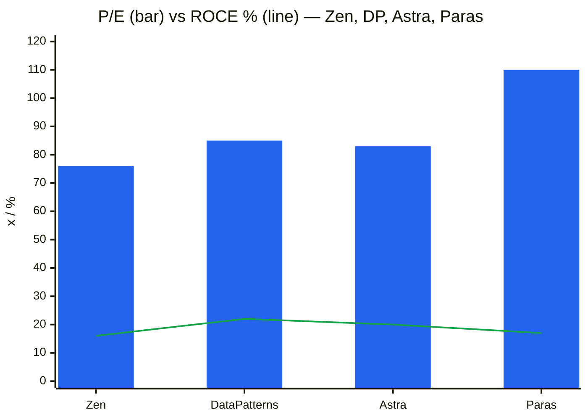
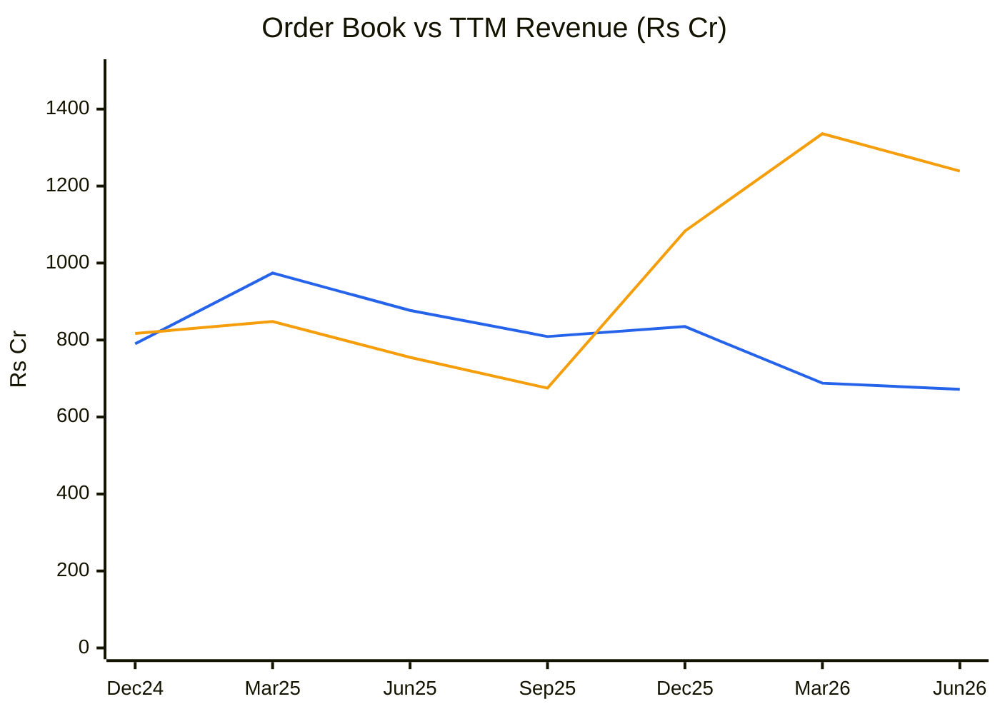
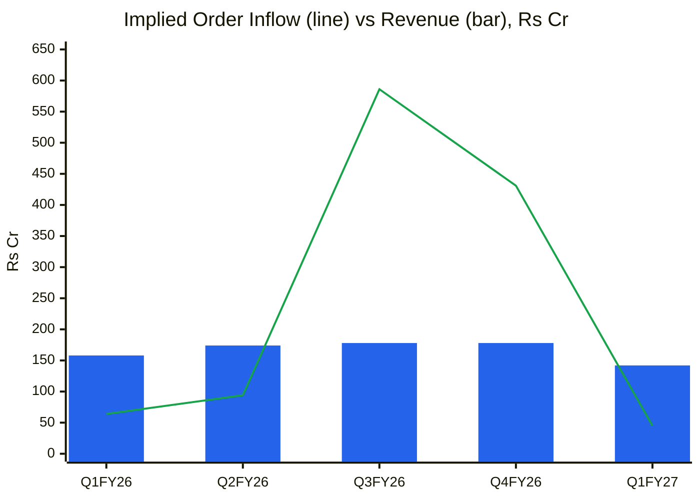
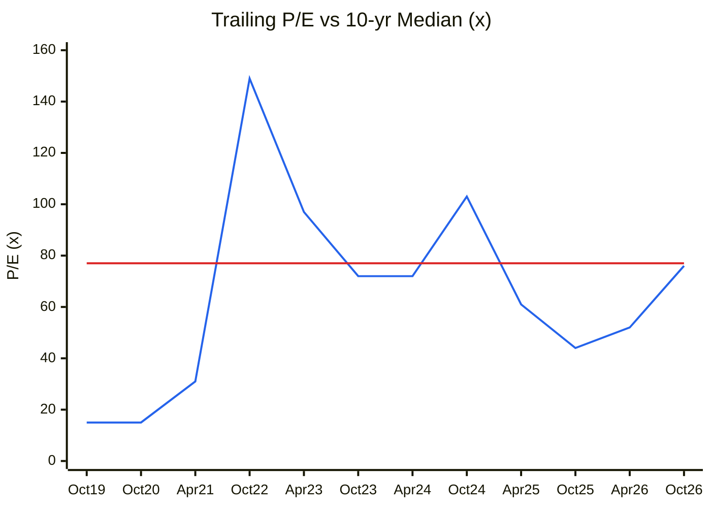
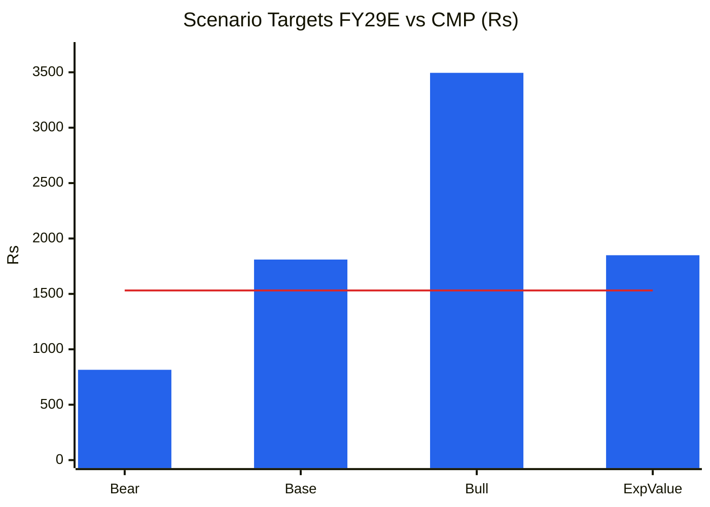

# Stock Analysis Report — Zen Technologies Ltd (NSE: ZENTEC | BSE: 533339)
**Date:** 2026-10-09
**Analyst:** Claude (Stock Fundamental Analysis Skill v3.3)
**Investment Horizon:** 2–3 Years
**CMP:** ₹1,531 (9 Oct 2026, 3:18 pm) · **M-cap:** ₹13,823 Cr · **EV:** ~₹12,625 Cr (net cash ~₹1,198 Cr)
**Recommendation:** WATCHLIST (Quality at Wrong Price, technically weakening)
**Conviction Score:** 5 / 10

## Revision Log
| Version | Date | Recommendation | Conviction | Price | Key change |
|---|---|---|---|---|---|
| Current | 2026-10-09 | WATCHLIST | 5/10 | ₹1,531 | Initial report |

**Validation of previous report:** Initial report. No earlier Zen file in the library.

---

## Business Primer

Zen Technologies, based in Hyderabad, designs and sells **combat training simulators** and **anti-drone systems** (counter-UAS), and earns recurring **annual maintenance contracts (AMC)** on the installed simulator base. Its simulators train tank crews (T-72/T-90 gunnery), artillery and air-defence gunners (the L70 Integrated Air Defence Combat Simulator), infantry (IVTSS, laser-based live training) and drivers. Products are designed in-house and protected by a growing patent portfolio. The customer is almost entirely the Indian Ministry of Defence (Army first, then paramilitary and police). Revenue is **project-based**: a tender is won, delivered in 6–12 months and then serviced under AMC, so quarterly revenue swings with order timing. Exports are about 7% of the order book. Since FY25 it has bought small capability companies: Applied Research International (simulation, 100% by Oct-2025), Vector Technics (drone propulsion), Bhairav Robotics and TISA Aerospace. Returns rest on two things: **MoD procurement timing** and Zen's position as the incumbent, IP-owning vendor for Indian Army simulators.

This is a **capital-light, IP/design-led defence electronics business** with a gross margin of about 73%. The cost lies in working capital, not plant: inventory and supplier advances are built ahead of deliveries, and the working-capital cycle is ~257 days. The value driver is **order inflow volume**. Margins are structurally high, but because the cost base is fixed, a revenue gap collapses EBITDA margin (Q1 FY27: 27% vs a 35% guided band). The key risk is **customer and timing concentration**: one buyer, tender-driven, with no control over when RFPs are floated. Two features shape the whole analysis. First, the ₹1,000 Cr QIP of FY25 left ~₹1,217 Cr of cash, which makes **other income ~29% of PBT** and depresses reported ROE. Second, the company has a history of boom-bust revenue: FY20 ₹149 Cr → FY21 ₹55 Cr → FY25 ₹974 Cr → FY26 ₹688 Cr.

*Segment: Aerospace & Defence (A&D) Manufacturing. KPI reference available ✓ (references/05-industry-kpis-india.md, line 46; Zen is listed there as a covered player).*

---

## Executive Summary

Zen is a genuine indigenous IP franchise in Army simulation and counter-drone systems. It is debt-free, holds ₹1,217 Cr of cash, carries a ~73% gross margin and owns patents across its training products. After a weak FY26 (−29% revenue) the order book is being rebuilt: ₹675 Cr (Sep-25) → ₹1,239 Cr (Jun-26) → ~₹1,711 Cr tracked today after the July/August MoD wins. **The problem is price.** At ₹1,531 the stock trades at 76× reported and ~90× core (ex-other-income) TTM earnings, and 58× EV/EBITDA. A reverse DCF shows the market is paying for **~45% revenue CAGR for five years at 32% EBIT margins**. That is essentially management's old 50%-CAGR plan, which was missed badly in FY26 and quietly replaced. The key risks are another year of tender slippage (anti-drone RFPs still not floated) and a chart that has just lost its 50- and 200-DMA. **Watchlist; accumulate only below ~₹1,150–1,200, or on evidence that the ₹2,500 Cr FY27 order-book target is being met.**

**Order book ₹1,239 Cr at 30-Jun-26 (1.85× TTM revenue) · equipment (firm) ₹921 Cr = 1.37× · AMC ₹318 Cr · book-to-bill TTM 1.72 · tracked today ~₹1,711 Cr (incl. ₹472.5 Cr announced Jul–Aug-26, GST-inclusive)**

### C1 — Growth Index (FY20 = 100)
| FY | Revenue | Net Fixed Assets* | EBITDA | PAT | Rev idx | NFA idx | EBITDA idx | PAT idx |
|---|---|---|---|---|---|---|---|---|
| FY20 | 149 | 73 | 63 | 59 | 100 | 100 | 100 | 100 |
| FY21 | 55 | 70 | 7 | 3 | 37 | 96 | 11 | 5 |
| FY22 | 70 | 67 | 5 | 3 | 47 | 92 | 8 | 5 |
| FY23 | 219 | 75 | 73 | 50 | 147 | 103 | 116 | 85 |
| FY24 | 440 | 93 | 181 | 130 | 295 | 127 | 287 | 220 |
| FY25 | 974 | 208 | 382 | 299 | 654 | 285 | 606 | 507 |
| FY26 | 688 | 239 | 245 | 218 | 462 | 327 | 389 | 369 |

*Screener consolidated "Fixed assets" (net block). The gross block split is not on Screener. FY25's jump includes acquired assets (ARI, Vector Technics). Source: [Screener.in consolidated](https://www.screener.in/company/ZENTEC/consolidated/).*

🟦 Revenue · 🟧 Net fixed assets · 🟩 EBITDA · 🟪 PAT. CAGR FY20–26: Revenue 29%, NFA 22%, EBITDA 25%, PAT 24%.

**Read:** Revenue grew 4.6× over six years, but the path was FY21–22 down 60%, FY23–25 up ~14×, then FY26 down 29%. EBITDA and PAT swing even harder than revenue.

**Business inference:** This is a lumpy, tender-cycle business, not a smooth compounder. Fixed assets have grown mostly through acquisitions while revenue retreated, so earnings power has to be judged on 3-year averages and order book, not on a peak year. A multiple built on FY25's ₹31 EPS has already been shown to be a peak multiple.

---

## Module 1 — Broad Market Cycle (Marks)
Nifty 50 was ~22,556 on 5 Oct 2026, about 6% below its June level. India VIX ~14.7. FIIs are persistent sellers and DIIs are absorbing them (cross-referenced from the same-day Aeroflex report, [StockPil](https://stockpil.com/india-markets-today-2026-10-05/)). Theme pockets (AI/data-centre, defence) still trade at speculative multiples while the index is weak.
**Verdict: CAUTIOUS.** Sizing: smaller than normal for new positions.

## Module 1b — Sector Cycle: Indian Defence
**Secular component (durable):** India's defence capital outlay is rising. Positive-indigenisation lists ban imports of specified training systems, so simulators are effectively reserved for Indian vendors. Counter-drone demand has become a doctrine-level priority after Operation Sindoor (May-2025). The defence-export push is a further driver. A structural **15–20% sector baseline** is defensible.
**Cyclical component (fades):** Emergency procurement (EP) rounds after Op Sindoor pulled anti-drone orders forward: ₹289 Cr (Nov-25) and ₹332 Cr (Jan-26). Emergency procurement is episodic. Management said on the Q1 FY27 call that there are **"no recent tenders"** for anti-drone and simulators. Roughly a third of FY26–27 counter-UAS inflow looks event-driven rather than run-rate.
**Inventory/input cycle:** Electronics, optics and sensors are partly imported, so FX and supply risk are moderate. Zen has raised supplier advances, which drove WC days up to 257.
**Competitive capacity:** Entry is open to well-funded players. BEL, Adani Defence, Tata Advanced Systems and several start-ups (counter-drone) are bidding, along with foreign OEMs through Indian partners for simulators.
**Geopolitical:** A western/northern border flare-up is a positive demand shock for this sector. Export orders face end-use certification and are small (₹85 Cr of the order book).
**Sector cycle verdict: TAILWIND (structural), with a near-term order-timing air-pocket.** The sector index has re-rated heavily (FY24–26). Do not embed the post-Sindoor EP burst as permanent growth.

## Module 1c — Stock Cycle: Company Positioning

### C2 — Quarterly YoY Revenue Growth
| Qtr | Q1FY25 | Q2FY25 | Q3FY25 | Q4FY25 | Q1FY26 | Q2FY26 | Q3FY26 | Q4FY26 | Q1FY27 |
|---|---|---|---|---|---|---|---|---|---|
| Revenue ₹Cr | 255 | 242 | 152 | 325 | 158 | 174 | 178 | 178 | 142 |
| YoY % | +93 | +267 | +52 | +130 | −38 | −28 | +17 | −45 | −10 |

🟦 YoY revenue growth · ⬜ zero line

**Read:** Growth went from +267% to −45% within six quarters. Four of the last five quarters were negative, and quarterly revenue has flat-lined at ₹142–178 Cr.

**Business inference:** Execution follows the order book with a 2–3 quarter lag. Orders were thin in Q4FY25–Q2FY26 (₹64 Cr and ₹94 Cr of inflow), and that is what produces today's revenue trough. The ₹1,017 Cr booked in Q3–Q4 FY26 should lift H2 FY27 revenue. **Decelerating → re-accelerating** is the bet, but it has not shown up yet.

**Revenue decomposition:** Volume (number of systems delivered) and mix (simulators vs anti-drone vs AMC) drive revenue. Price is tender-set (L1), so there is no pricing lever after the bid. Gross margin held at ~73% through the downturn (Q1 FY27 presentation), which points to **design-led value-add, not price erosion**.

**Operating leverage:** Fixed opex (employees, R&D, overheads) is roughly ₹70–75 Cr a quarter. EBITDA margin was 41% at ₹255 Cr revenue (Q1FY25) and 27% at ₹142 Cr (Q1FY27). That implies **DOL ≈ 2.0–2.5×**. DFL ≈ 1.0 (no debt). ICR is not a concern.

**Guidance accuracy:** see the Walk-the-Talk section (score 0.57, LOW).

**FCF inflection:** FY26 FCF was ₹185 Cr, the first meaningful positive year since FY23. It came from a WC release as receivables were collected. FCF is lumpy and **inverse to growth**, because WC (inventory and advances) is built ahead of execution.

**Stock cycle classification: TROUGH/RECOVERY in operations** (revenue and margins depressed for an identifiable, reversible reason: order timing), **but valuation is not at trough.** The two disagree, and that is the core of the verdict.

---

## Module 2 — Industry Structure & Capital Cycle

| Force | Assessment | Signal |
|---|---|---|
| New entrants | Moderate-high barriers: Army trials and user evaluation take 2–4 years; patents (T-72/T-90 gunnery, IVTSS, 60mm mortar, laser combat training); the indigenisation list excludes foreign suppliers | Favourable |
| Supplier power | Low-moderate. COTS electronics, optics, displays; some imported sensors | Neutral |
| Buyer power | **Very high.** Single monopsony buyer (MoD) with L1 tendering and tender timing at its discretion | Unfavourable |
| Substitutes | Low. Live-fire training is costlier and limited; simulation substitutes *for* it | Favourable |
| Rivalry | Rising in counter-drone (BEL, Adani-Elbit, Tata, start-ups); moderate in simulators (Zen is the dominant Army incumbent) | Mixed |

**Industry verdict: NEUTRAL-to-ATTRACTIVE.** Strong barriers in simulators are offset by monopsony buyer power and lumpy demand.

**Capital cycle:** Capital is **flooding in**. Defence IPOs/QIPs (Zen's own ₹1,000 Cr QIP in FY25, Data Patterns, Paras, several SMEs) and the counter-drone start-up wave are both signs. Sector ROIC sits well above its 10-year average. **Late-cycle signals on the supply side for counter-UAS; simulators are less exposed.**

---

## Module 3 — Business Quality & Moat

**Greenwald barriers:**
1. *Supply/cost advantage:* partial. Gross margin of ~73% has held for years. In-house design and software are reused across simulator platforms, so engineering cost is amortised.
2. *Customer captivity:* **yes, the main moat.** An installed base of Army simulators creates AMC annuities (₹318 Cr in the order book) and upgrade orders. The Jul-26 ₹177.5 Cr order was an *upgrade and integration* of tank gunnery simulators Zen had already installed. Switching platforms means re-training instructors and re-certifying.
3. *Local economies of scale:* within Army land-systems simulation, Zen is the dominant domestic supplier. There is no public share data.

**Buffett 10% price test:** not applicable in the usual sense, because tender pricing is L1. The real moat test is single-vendor and upgrade orders, which Zen does win.
**Patent/IP:** 15+ patents granted in FY24 alone, and a competing patent was revoked in Zen's favour (Aug-2025) ([company press releases](https://www.zentechnologies.com/press-releases)).
**Market share stability:** No public 5–10-year share data. ⚠️ Data gap.

**Moat verdict: NARROW** (installed-base captivity plus IP in simulators; no moat in counter-drone, which is a contested, crowded field).

### Fisher 15-Point (1–3)
| # | Point | Score | Note |
|---|---|---|---|
| 1 | Market potential | 3 | Simulators, C-UAS and exports; US ambition ($100M in 3 years) |
| 2 | New products | 3 | High-altitude man-portable anti-drone (Jul-26), ISBS border suite, RCWS, robots, arms licence (Apr-26) |
| 3 | R&D effectiveness | 3 | Patents convert to orders (T-90/T-72 simulators) |
| 4 | Sales organisation | 2 | Single-customer selling; exports still small |
| 5 | Profit margin | 3 | 73% gross, ~35% EBITDA through-cycle |
| 6 | Margin management | 2 | Fixed cost base causes margin swings |
| 7 | Labour relations | 2 | No data; engineering-heavy |
| 8 | Executive relations | 2 | Founder-led (Atluri family) |
| 9 | Management depth | 2 | CFO change history ⚠️; heavy reliance on the founder |
| 10 | Cost/accounting controls | 2 | Provision reversal flattered Q1FY26 margin (see M4) |
| 11 | Industry advantages | 3 | Indigenisation list and patents |
| 12 | Long-range orientation | 3 | Acquisitions to build capability, licences |
| 13 | Dilution | 2 | ₹1,000 Cr QIP (FY25), ESOPs; cash still unused |
| 14 | Candor in adversity | 1 | ₹6,000 Cr 3-year target reiterated in Jul-25, then replaced without an explicit withdrawal; each soft quarter called "timing" |
| 15 | Integrity | 2 | No SEBI enforcement found; no RPT red flags in order filings. **Pass** |
| **Total** | | **35 / 45** | |

---

## Module 4 — Management & Capital Allocation

**Promoters:** Ashok Atluri (CMD) and family. **Holding 48.51%** (Jun-26), down from 57.45% (Sep-23). Most of the fall is QIP dilution (Sep-24 quarter: 55.07 → 51.26) and the Dec-24 quarter (51.26 → 49.05). ⚠️ Whether the Dec-24 step was a promoter sale or further allotment is not verified. **Pledge:** none flagged on Screener. ⚠️ Not confirmed against the NSE SHP. **Institutional:** DII 0.15% → 10.42% and FII 6.47%, both rising (CANSLIM "I" ✓). Retail shareholders peaked at 3.30 lakh (Dec-25) and are now 2.91 lakh (retail exiting).

**Capital allocation:**
- FY25 QIP of ~₹1,000 Cr (CFF +₹1,007 Cr). The cash sits mostly in deposits and is not yet deployed beyond small acquisitions (ARI, Vector Technics, Bhairav, TISA: all bolt-ons, undisclosed or small values). It is earning ~7% (other income ₹86 Cr in FY26), which dilutes ROE from 29% (FY24) to 11.5% (FY26).
- Dividend payout is 5–7%. That is low, but the business is reinvesting in WC and acquisitions.
- **FCF/share vs EPS (FY22–26 cumulative):** CFO ₹361 Cr vs PAT ₹700 Cr. **Only 52% cash conversion**, structurally weak because of defence WC.
- No buybacks.
**Capital allocation rating: AVERAGE.** The raise was opportunistic and well-timed (near highs). Deployment and return on the cash are not yet proven.

**RPT:** Each order filing states the contracts are not related-party and promoters have no interest in the awarding entity. No ICD concerns seen. ⚠️ The annual-report RPT schedule was not reviewed (AR not fetched).

**Buffett 3 C's:** Candor **Low-Moderate** (repeated "timing" framing, target reset without acknowledgement) · Competence **High** (IP, margins, patents) · Caring **Moderate** (low payout, large dilution, but cash preserved).

### Walk the Talk Scorecard
| Quarter guided | Statement | Guided | Actual | Verdict |
|---|---|---|---|---|
| FY25 (FY24 calls) | FY25 revenue ~₹900 Cr+ | ≥ ₹900 Cr | ₹974 Cr | ✅ Hit |
| FY25 | EBITDA margin ~35% | 35% | 39% | ✅ Hit |
| Q1FY26 call (Jul-25) | 50% CAGR, **₹6,000 Cr cumulative revenue FY26–28** | FY26 ≈ ₹1,460 Cr implied | FY26 ₹688 Cr (−29%) | ❌ Miss |
| Q1FY26 call (Jul-25) | "Deferred Q1 revenue recognised next quarter"; FY26 guidance intact | Q2 rebound | Q2FY26 ₹174 Cr (−28% YoY) | ❌ Miss |
| Q1FY26 call | EBITDA margin 35% FY26 | 35% | 35.6% | ✅ Hit |
| Q1FY26 call | PAT margin 25% FY26 | 25% | 31.7% (helped by other income) | ✅ Hit |
| Q4FY26 call (May-26) | ₹6,000 Cr FY26–28 **replaced** by ₹4,000 Cr FY27+FY28 | — | Reset, not acknowledged as a cut | 🔴 Reversal |
| Q4FY26 call | ~₹1,000 Cr of order book to execute in FY27 | ₹1,000 Cr | Q1 = ₹142 Cr (needs ₹286 Cr/qtr for the rest) | ⏳ Pending |
| Q1FY27 call | Order book ₹2,500 Cr by FY27-end | ₹2,500 Cr | ~₹1,711 Cr tracked (Oct-26) | ⏳ Pending |

**WTT Score: 0.57 / 1.00 — LOW** (7 scored: 4 hits, 0 near misses, 2 misses, 1 reversal).
**Key pattern:** **Margins are delivered; revenue and timing guidance are not.** Every revenue miss has been described as "timing". That is true in a tender business, and it is also why management's revenue numbers cannot anchor a DCF.
**Insider action:** No open-market promoter buying found. Promoter stake has drifted down. **NEUTRAL-to-BEARISH.** ⚠️ BSE Form C not individually checked.
**DCF impact:** The ₹4,000 Cr FY27–28 target is **haircut ~45%** (base case ₹2,200 Cr cumulative) and the model is built from the order book instead.
**Overall management credibility: MODERATE on operations, LOW on forecasts.**

---

## Module 5 — Financial Forensics

| Test | Value | Read |
|---|---|---|
| Beneish M-Score (FY26 vs FY25, approx.) | **≈ −3.0** (DSRI 0.77, GMI ~1.0, AQI ~1.05, SGI 0.71, DEPI ~0.9, SGAI ~1.2, LVGI ~0.95, TATA −0.013) | Unlikely manipulator |
| Altman Z'' (FY26) | **≈ 16** (WC/TA 0.76, RE/TA 0.87, EBIT/TA 0.14, BVE/TL 7.1) | Safe |
| Piotroski F (FY26) | **6 / 9** (fails ΔROA, ΔGM, ΔAT) | Average |
| Sloan accrual (FY26) | (218 − 245 + 162) / 2,102 ≈ **+6.4%** | Acceptable (CFI includes treasury moves) |
| 10-yr CFO/PAT (FY17–26 ex-FY18) | ₹380 / ₹782 Cr = **0.49** | ⚠️ Weak cash conversion |
| Other income / PBT (FY26) | 86 / 297 = **29%** | ⚠️ >15%: treasury income on QIP cash |
| Inventory days (FY26) | 415 (FY25: 118) | ⚠️ Inventory and advances built ahead of orders |
| Debtor days | 119 (FY26) / 122 (Q1FY27) | ✅ Improving and well below peers (Data Patterns 287, Paras 278) |
| Pledge | None reported | ✅ |
| Auditor | No qualification/EOM reported in coverage | ⚠️ AR KAMs not read |

**Schilit screen:**
- #3 one-time boosts: **Q1FY26 EBITDA margin inflated by a provision reversal.** The CFO says it would have been ~35% instead of 40.9% (Q1FY27 call) ⚠️.
- #6 cookie-jar: the same item. Watch provision movements across quarters.
- #4 capitalisation: capex is modest. Capitalised development cost is ⚠️ unverified.
- CFS: no factoring or SCF disclosed. DPO rose 25 → 109 days in FY26, which helped CFO ⚠️ (payables stretch, partly a timing reversal of FY25).

**Forensic red-flag count: 3 / 15 (minor):** low CFO/PAT, high other income, provision-reversal margin flattery. Each has a business explanation (defence WC, QIP cash, one quarter's reversal), so this is **not** a hard stop. **Overall forensic verdict: CLEAN with minor concerns.**

---

## Module 6 — Earnings Quality & Financial Statements

**Reformulation (FY26):** Capital employed ₹1,908 Cr, of which cash/investments ~₹1,217 Cr. Operating invested capital is ~₹690 Cr. Core EBIT (ex other income) = 245 − 24 = ₹221 Cr. **Pre-tax ROIC on operating capital ≈ 32%, post-tax ≈ 24%** vs WACC 12.5%, so **value-creating**. Headline ROCE of 16% is distorted by cash.
Ind AS 116: leases are immaterial.

### DuPont (5-factor, year-end equity; EBIT includes other income)
| Year | EBIT Margin | Asset Turnover | Equity Multiplier | Interest Burden | Tax Burden | ROE |
|---|---|---|---|---|---|---|
| FY22 | 7.1% | 0.19 | 1.30 | 0.60 | 0.79 | 1.1% |
| FY23 | 34.7% | 0.46 | 1.50 | 0.95 | 0.69 | 15.8% |
| FY24 | 42.7% | 0.59 | 1.67 | 0.99 | 0.70 | 29.0% |
| FY25 | 43.6% | 0.48 | 1.20 | 0.96 | 0.74 | 17.6% |
| FY26 | 44.6% | 0.32 | 1.14 | 0.97 | 0.73 | 11.5% |

**Operating contribution:** Margin is stable to rising. **Asset turnover collapsed from 0.59 to 0.32** because revenue fell and the QIP cash inflated assets.
**Financing contribution:** Falling (equity multiplier 1.67 → 1.14). There is no leverage engineering.
**DuPont verdict:** The ROE decline is *entirely* an asset-turnover story: idle QIP cash plus a revenue air-pocket. Unit economics (margin) are intact. ROE recovers mechanically if revenue returns to ~₹1,000 Cr+ or the cash is deployed.

### C4 — Margin trend
| FY | FY19 | FY20 | FY21 | FY22 | FY23 | FY24 | FY25 | FY26 |
|---|---|---|---|---|---|---|---|---|
| OPM % | 18 | 42 | 14 | 7 | 33 | 41 | 39 | 36 |
| PAT % | 14 | 40 | 5 | 4 | 23 | 30 | 31 | 32 |

🟩 OPM · 🟪 PAT margin

**Read:** Margins have held at 33–41% for four years (FY23–26) after a deep FY21–22 trough. The PAT margin now exceeds its FY24 level even though OPM is lower.

**Business inference:** The PAT margin is propped up by ₹86 Cr of treasury income. On core operations FY26 PAT margin is ~23%. FY21–22 shows what happens to this fixed-cost model when orders dry up. That is the bear-case template, and it is the reason a 10-year average margin (~29%) belongs in the bear case.

### C7 — Cumulative PAT vs CFO (₹ Cr)
| FY | FY20 | FY21 | FY22 | FY23 | FY24 | FY25 | FY26 |
|---|---|---|---|---|---|---|---|
| Cum. PAT | 59 | 62 | 65 | 115 | 245 | 544 | 762 |
| Cum. CFO | 62 | 68 | 24 | 140 | 153 | 184 | 429 |

🟪 Cumulative PAT · 🟩 Cumulative CFO

**Read:** Over seven years, CFO is 56% of PAT. The gap opened in FY24–25 (growth years) and partly closed in FY26 (₹245 Cr CFO).

**Business inference:** Growth consumes cash in this model because inventory and supplier advances lead deliveries by 2–3 quarters. A re-acceleration in FY27–28 will pull CFO down again. Valuation should be anchored on EV/EBITDA and owner earnings after WC, not on P/E alone.

**OCF/NI (5-yr):** 0.52 → **Medium-Low quality** (structural, not manipulative). **O'Glove flags: 3/15.**

---

## Module 7 — Industry KPIs & Peer Analysis

**Sector:** Aerospace & Defence (IP/design-led sub-systems)

| KPI | Zen | Peer avg (DP/Astra/Paras) | Assessment |
|---|---|---|---|
| Order book / TTM revenue | 1.85× (firm equipment 1.37×) | 2.5–4× (sector reference) | **Below**: short visibility |
| Book-to-bill (TTM) | 1.72 | ~1.2–1.5 | Above (rebuild phase) |
| EBITDA margin (FY26) | 35.6% | 31.7% | Above |
| Receivable days (FY26) | 119 | 260 | **Well above** (better) |
| WC days (FY26) | 543 (Screener) / 257 (co., Q1FY27) | 299 | Below (worse); definitions differ |

### Peer comparison (Screener, 9 Oct 2026)
| Metric | **Zen** | Data Patterns | Astra Microwave | Paras Defence |
|---|---|---|---|---|
| M-cap ₹Cr | 13,823 | 22,897 | 15,714 | 10,214 |
| Revenue FY26 ₹Cr | 688 | 925 | 1,163 | 477 |
| Rev growth FY24→26 CAGR | **+25%** (but FY26 −29%) | +33% | +13% | +37% |
| OPM FY26 | 36% | 40% | 29% | 26% |
| PAT FY26 ₹Cr | 218 | 271 | 193 | 89 |
| ROCE | 16.2% | 21.9% | 20.3% | 17.2% |
| ROE | 10.7% | 15.2% | 16.0% | 12.4% |
| P/E (TTM) | 76.0 | 84.7 | 83.1 | 110 |
| P/B | 7.3 | 13.2 | 11.7 | 14.1 |
| Debtor days | 119 | 287 | 216 | 278 |
| Net D/E | net cash | net cash | low | low |

**Peer positioning:** Zen trades at a **slight discount to peers** on P/E and P/B. It is justified: it is the only one of the four whose revenue *fell* in FY26, its order-book cover is the shortest, and ~29% of its PBT is treasury income. Its debtor days are the best in the group, a real quality point. **The whole basket is expensive.** Zen is the cheapest of four expensive names, which is not the same as cheap.

### C12 — Peer P/E vs ROCE

🟦 P/E (×) · 🟩 ROCE (%)

**Read:** P/E ranges from 76× to 110× against ROCE of 16–22%. There is almost no relationship between returns and multiple across the group.

**Business inference:** The sector is priced as a theme, not on returns. A sector de-rating (from FII selling, an end to emergency procurement, or execution misses) would hit all four. Zen's lower ROCE comes from idle cash rather than weak operations, which gives it slightly more cushion than its headline numbers suggest.

### Order Book Tracker (references/13-order-book-tracking.md)

**Order Ledger: announced orders (company press releases / exchange filings)**
| # | Date | Customer | Product | ₹ Cr | Firmness | Quarter |
|---|---|---|---|---|---|---|
| 1 | 27-Mar-25 | MoD | Integrated Air Defence Combat Simulator (L70) | 152 | Firm | Q4FY25 |
| 2 | 11-Oct-25 | MoD | Advanced anti-drone systems | 37 | Firm | Q3FY26 |
| 3 | 03-Nov-25 | MoD | Rapid anti-drone system upgrades | 289 | Firm | Q3FY26 |
| 4 | 28-Nov-25 | MoD | Tank simulators | 108 | Firm | Q3FY26 |
| 5 | 05-Dec-25 | MoD | Combat Training Node, Infantry School Mhow | 120 | Firm | Q3FY26 |
| 6 | 16-Jan-26 | MoD | Anti-drone/C-UAS ₹332 Cr + simulators ₹72 Cr | 404 | Firm (1-yr execution) | Q4FY26 |
| 7 | 21-Jul-26 | MoD | Tank and crew gunnery simulator upgrade/integration | 177.5 | Firm (1-yr) | Q2FY27 |
| 8 | 10-Aug-26 | MoD | Supply of simulators (incl. GST) | 295 | Firm (1-yr) | Q2FY27 |
| — | earlier (FY24) | MoD/Govt/export | 16 orders Mar-23 → Oct-24 incl. ₹340 Cr export (Jul-23), ₹227.65 Cr (Sep-23) | ~1,900 | Firm | FY24–25 (history) |

*Sources: [Zen press releases](https://www.zentechnologies.com/press-releases), [Business Standard (₹404 Cr)](https://www.business-standard.com/markets/news/zen-technologies-share-price-jumps-over-9-on-404-cr-order-win-from-defence-ministry-126011600362_1.html), [Upstox (₹177.5 Cr)](https://upstox.com/news/market-news/stocks/zen-technologies-shares-jump-over-4-after-177-crore-defence-order-update-what-investors-should-know/article-197301/), [Angel One (₹295 Cr)](https://www.angelone.in/news/stocks/zen-technologies-shares-surges-over-3-on-receiving-295-crore-order-from-ministry-of-defence). Several announced values include GST, while the reported order book is likely ex-GST, so coverage can exceed 100%.*

**Order Book Snapshots (consolidated)**
| Date | Order book ₹Cr | Equipment | AMC | Source |
|---|---|---|---|---|
| 31-Dec-24 | 816.9 | — | — | Q3FY25 presentation (via search) |
| 31-Mar-25 | ~848 (derived) | — | — | = Jun-25 OB + Q1FY26 revenue − Q1FY26 inflow |
| 30-Jun-25 | 754.6 | — | — | Q1FY26 release (incl. ₹148.6 Cr subsidiaries) |
| 30-Sep-25 | 675.0 | — | — | Q2FY26 (domestic 554.1 / export 120.9) |
| 31-Dec-25 | 1,082.8 | — | — | Q3FY26 |
| 31-Mar-26 | 1,336 | — | — | Q4FY26 |
| 30-Jun-26 | 1,239.0 | 920.6 | 318.4 | Q1FY27 presentation |
| Oct-26 (tracked) | ~1,711 | — | — | Jun-26 OB + ₹472.5 Cr announced (before Q2 execution) |

**Reconciliation: implied inflow = OB(t) − OB(t−1) + revenue(t)**
| Quarter | Opening OB | Revenue | Closing OB | Implied inflow | Announced | Coverage |
|---|---|---|---|---|---|---|
| Q1FY26 | 848 | 158 | 755 | 64 (co.: 64.3) | 0 | — (small unannounced orders) |
| Q2FY26 | 755 | 174 | 675 | 94 | 0 | 0% (sub-threshold orders) |
| Q3FY26 | 675 | 178 | 1,083 | 586 | 554 | 95% ✅ |
| Q4FY26 | 1,083 | 178 | 1,336 | 431 | 404 | 94% ✅ |
| Q1FY27 | 1,336 | 142 | 1,239 | 45 (co.: 44.6) | 0 | — |
| **TTM** | | **672** | | **1,156** | | |

**Macro metrics:** Book-to-bill TTM **1.72** · cover **1.85×** (firm equipment 1.37×; AMC is multi-year) · FY26 execution rate = FY26 revenue / opening OB = 688/848 = **0.81** · top-3 announced orders (404 + 295 + 289) = 988, **~58% of tracked OB** (concentrated) · domestic 93%.

### OB-1 — Order book vs TTM revenue (₹ Cr)
| Date | Dec-24 | Mar-25 | Jun-25 | Sep-25 | Dec-25 | Mar-26 | Jun-26 |
|---|---|---|---|---|---|---|---|
| Order book | 817 | 848 | 755 | 675 | 1,083 | 1,336 | 1,239 |
| TTM revenue | 790 | 974 | 877 | 809 | 835 | 688 | 672 |
| Cover (×) | 1.03 | 0.87 | 0.86 | 0.83 | 1.30 | 1.94 | 1.85 |

🟦 TTM revenue · 🟧 Order book

**Read:** The order book sat below TTM revenue for most of FY25–26 (cover <1×). It crossed above in Dec-25 and has held ~1.9× since, while TTM revenue slid to ₹672 Cr.

**Business inference:** FY26's revenue slump was visible in advance. The book had been drawn down below one year of revenue by mid-2025. The rebuild since Dec-25 is real and firm (MoD orders with one-year execution), so **FY27 revenue should rise to ₹850–1,000 Cr**. At <2× cover, though, Zen still needs ~₹1,000 Cr+ of fresh inflow every year just to grow, which is why tender timing dominates the stock.

### OB-3 — Quarterly inflow vs revenue (₹ Cr)

🟦 Revenue · 🟩 Implied inflow

**Read:** Inflow came in bursts: ₹1,017 Cr in Q3–Q4 FY26 against just ₹203 Cr across the other three quarters.

**Business inference:** Zen is a "two good quarters a year" order business tied to MoD's fiscal-year-end and emergency-procurement windows. Q2FY27 has already logged ₹472.5 Cr (GST-incl.). Reaching ₹2,500 Cr by March 2027 needs another ~₹1,000–1,100 Cr in H2, which in turn needs the anti-drone RFPs management says have not yet been floated.

**Order-book verdict:** Firm visibility **~1.4 yrs** (equipment) · book-to-bill 1.72 · framework share 0% (all firm MoD) · top-3 concentration ~58% · execution rate 0.81 and lumpy.

---

## Module 8 — Market Size & Market Share
- **TAM (India, training and simulation):** Not reliably sourced. Industry estimates put Indian military simulation and training spend at ~US$0.5–1 bn a year ⚠️ (unverified). Zen's ~₹700–1,000 Cr revenue implies a **large share of the Army land-simulator niche** and small share of total training spend.
- **Counter-UAS (India):** Management calls it "several thousand crore" and a "very large" high-altitude market. ⚠️ No independent sizing.
- **US:** Management cites a $10 bn addressable US market and targets $100M of US revenue in 3 years via prime-vendor partnerships (AVT Simulation). **Treat as an option, not base case.** ITAR/compliance work is still in progress.
- **Share trend:** No public share data. Zen's win-rate on Army simulator tenders appears high (installed-base upgrades), while counter-drone share is contested.
**Verdict: growing with the market in simulators; unproven share in C-UAS and the US.**

---

## Module 9 — Valuation: PIE First, Then DCF

### 9A. Price-Implied Expectations (Mauboussin)
Inputs: EV ₹12,625 Cr; WACC 12.5% (Rf 7% + β~1.0 × ERP 5.5%); terminal g 6%; steady EBIT margin 32% (EBITDA ~35% less D&A ~3%); WC reinvestment 55% of Δrevenue (consistent with ~200-day net WC); growth fades to 6% over years 6–10.

| PIE value driver | Market-implied | My base case | Gap |
|---|---|---|---|
| Revenue CAGR (5-yr, from FY26 ₹688 Cr) | **~45%** (→ ~₹4,400 Cr by FY31) | ~20% (→ ~₹1,700 Cr) | **−25 pp: optimistic gap** |
| EBIT margin (steady) | 32% | 30% | −2 pp |
| Investment rate (WC / ΔRev) | 55% | 55–60% | ≈ |

**Classification: OPTIMISTIC GAP.** The price embeds management's *original* 50%-CAGR plan. That plan was missed by ~40% in its first year and has since been replaced by a smaller target.
**Expectations treadmill:** To outperform from here, Zen must take revenue to **~₹2,000 Cr by FY29** (≈ the full ₹4,000 Cr FY27–28 target plus continued growth) while holding a 35% EBITDA margin. Merely delivering FY27 recovery to ₹900–1,000 Cr earns no excess return.
**Positive triggers:** (1) anti-drone RFPs floated and won (₹1,000 Cr+); (2) FY27 order book ≥ ₹2,500 Cr; (3) first US/EU prime-partner order.
**Negative triggers:** (1) H2FY27 revenue < ₹550 Cr (FY27 < ₹850 Cr); (2) EP rounds end with no regular tenders; (3) a large acquisition at a rich price using the QIP cash.
**SVAR:** In the downside scenario (growth −30% vs PIE, margin at the 10-yr average of ~29%, multiple 35×), price is ~₹815. **SVAR ≈ 47%. Asymmetry unfavourable.**

### 9B. Intrinsic value (own model)
| Method | Bear | Base | Bull |
|---|---|---|---|
| DCF (12.5% WACC, 10-yr fade; 15% / 20–25% / 30% 5-yr CAGR) | ₹475 | ₹570–680 | ₹830 |
| Relative (FY29E EPS × exit P/E 35× / 45× / 50×) | ₹815 | ₹1,810 | ₹3,495 |
| EPV (core NOPAT ~₹160 Cr / 12.5% + net cash) | ₹1,550 Cr → **₹172** + cash ₹133 = **₹305** | | |
| **Consensus range** | ₹600–815 | ₹1,100–1,350 (blend, discounted to today) | ₹2,500–3,500 |

The gap between DCF (₹570–680) and exit-multiple value (₹1,810) **is the valuation question**. Today's price is supportable only if the sector keeps a 45×+ multiple through FY29. Cash-flow fundamentals alone support well under half the current price.

- **Graham Number:** √(22.5 × 5-yr normalised EPS ₹14.8 × BVPS ₹209) = **₹264**. Fails Graham comprehensively (P/E 76, P/B 7.3).
- **Margin of safety (base blend ₹1,250):** **−22%** (price above value). **Inadequate.**
- **Upside/downside (expected value ₹1,849 vs bear ₹815):** +21% / −47% = **0.44:1 → Unacceptable** (needs ≥ 2:1).
- **Misprice reason:** none in the buyer's favour. Any mispricing runs the other way (thematic defence premium).
- **Catalyst:** H2FY27 execution plus anti-drone tenders. Timing uncertain.

### CY1 — P/E band (Screener, consolidated; 10-yr median 77×)
| Date | Oct-19 | Oct-20 | Apr-21 | Oct-22 | Apr-23 | Oct-23 | Apr-24 | Oct-24 | Apr-25 | Oct-25 | Apr-26 | Oct-26 |
|---|---|---|---|---|---|---|---|---|---|---|---|---|
| P/E | 15 | 15 | 31 | 149 | 97 | 72 | 72 | 103 | 61 | 44 | 52 | 76 |
| Median | 77 | 77 | 77 | 77 | 77 | 77 | 77 | 77 | 77 | 77 | 77 | 77 |

🟦 Trailing P/E · 🟥 10-yr median (77×)

**Read:** P/E is back at its 10-year median (76× vs 77×), up from 44× a year ago, even though trailing EPS fell from ₹31 to ₹20.

**Business inference:** The stock rose ~10% over the year while EPS fell 36%. All of the return was **re-rating, none earnings**. The 77× "median" is itself inflated by trough-EPS years (FY21–23). A median P/E on a cyclically *depressed* EPS could look cheap, but only if FY27–28 earnings recover as the order book implies. That is the bull argument, and it is unproven.

### C13 — Scenario target prices vs CMP (₹)

🟦 Scenario target · 🟥 CMP ₹1,531

**Read:** Only the bull case clears the CMP by a wide margin. The base case is +18% over ~2.5 years (~7% a year) and the bear case is −47%.

**Business inference:** At this price the investor is betting on the bull case (₹2,000 Cr+ revenue and anti-drone scale-up). The base case, which is already more generous than the DCF, does not beat the cost of equity.

### Cycle Position Dashboard
| Dimension | Current | 10-yr median | Percentile | Signal |
|---|---|---|---|---|
| P/E | 76× | 77× | ~50th | Fair vs own history; expensive vs earnings power |
| P/B | 7.3× | ~4–5× ⚠️ | ~75th | Expensive |
| EBITDA margin (TTM) | 33% | ~33% (FY17–26) | ~55th | Mid |
| ROCE | 16% (cash-diluted) | ~16% | ~50th | Mid (operating ROIC ~32% = high) |
| Revenue vs order book | trough revenue, rising OB | — | — | Early recovery |
| **Overall** | | | | **Operations: early recovery · Valuation: mid-to-late** |

---

## Module 10 — Technical Stage (Weinstein + CANSLIM)
Data: Screener price and DMA series, 9-Oct-26.

| Item | Reading |
|---|---|
| Nifty 50 stage | **Stage 3/4** (index ~6% off June high, FII selling) |
| Sector (defence basket) | Stage 3 (topping; names off highs, P/Es still 75–110×) |
| **Stock stage** | **Stage 3 → early Stage 4 breakdown.** Rally ₹1,279 (30-Mar-26) → ₹1,878 (25-Aug-26). Now ₹1,530, **below the 50-DMA (₹1,701, rolling over) and below the 200-DMA (₹1,647, flattening/turning down)**. 30-week MA ≈ 50-DMA zone, now declining |
| Price vs 52-wk | 25% below the ₹2,044 high, 24% above the ₹1,223 low |
| RS vs Nifty (1-yr) | Mildly positive (+7% vs Nifty negative) but deteriorating sharply since Aug |
| Volume | Distribution: 6.5 lakh shares on the 8-Oct down day vs ~3–4 lakh average |
| Support | ₹1,450 (Apr-26 breakout zone), then **₹1,223–1,280** (Jan/Mar-26 double bottom) |
| Resistance | ₹1,650 (200-DMA), ₹1,700 (50-DMA), ₹1,880 |
| Stop-loss (if held) | Weekly close < ₹1,440 |

**CANSLIM:** C ✗ (Q1 EPS −28%) · A ✗ (FY26 EPS −31%) · N ✓ (new products, arms licence) · S ✗ (equity expanded via QIP) · L ✗ (laggard vs DP/Astra on growth) · I ✓ (DII 0.15% → 10.4%) · M ✗ (market cautious) → **2 / 7**.
**Stage + fundamental alignment: MISALIGNED.** Technicals are breaking down while fundamentals are only beginning to recover. Do not buy into a Stage 3→4 transition.

---

## Module 11 — Forward View: 2–3 Year Thesis

### Capex classification (capital-light; order-book model applies)
| Capex type | FY27E | FY28E | FY29E | In model? |
|---|---|---|---|---|
| Tangible growth (Goa R&D/manufacturing MoU, Vector Technics propulsion line to 3 lakh units/yr) | ~₹40 Cr | ~₹40 Cr | ~₹30 Cr | Minor |
| Maintenance (≈ D&A) | ~₹30 Cr | ~₹35 Cr | ~₹40 Cr | Sustains |
| Acquisitions (intangibles/goodwill) | Unknown (cash ₹1,217 Cr available) | | | ❌ Excluded |
| CWIP (Mar-26) | ₹15 Cr | | | — |

The gross-block asset-turnover model is **not the revenue driver** here (revenue/net fixed assets swings 0.8×–4.7×). Revenue is built from the **order book × execution rate** (Module 1c / 13-order-book protocol).

### Revenue anchor (order-book model)
`Revenue(FY27) ≈ opening firm OB × execution rate + in-year inflow × in-year burn`
= ₹1,336 Cr × ~0.55 (net of AMC tail; equipment OB is mostly 1-year orders) + ~₹1,300 Cr in-year inflow × ~0.15 ≈ ₹735 + ₹195 ≈ **₹930 Cr** (management implies ~₹1,000 Cr+). After Q1's ₹142 Cr this needs ~₹265 Cr a quarter. **Base FY27E ₹850–900 Cr.**

### Earnings model (base)
| ₹ Cr | FY26A | FY27E | FY28E | FY29E |
|---|---|---|---|---|
| Revenue | 688 | 875 | 1,150 | 1,400 |
| EBITDA margin | 35.6% | 32% | 33% | 33% |
| EBITDA | 245 | 280 | 380 | 462 |
| D&A | 24 | 32 | 36 | 40 |
| Other income | 86 | 80 | 75 | 70 |
| Interest | 10 | 8 | 8 | 8 |
| PBT | 297 | 320 | 411 | 484 |
| PAT (25% tax) | 218 | 240 | 308 | 363 |
| EPS (9.03 Cr sh) | 21.4 | 26.6 | 34.1 | 40.2 |
| ΔWC (55% of ΔRev) | — | −103 | −151 | −138 |
| FCF (PAT + D&A − capex − ΔWC) | 185 | ~100 | ~118 | ~195 |

**ICR / debt:** Not applicable (net cash). **FCF inflection:** FY29 at the earliest, because growth years absorb WC.
**Incremental ROIC:** Δrevenue ₹712 Cr (FY26→29) × 30% EBIT × 0.75 = ₹160 Cr NOPAT on ~₹470 Cr of incremental WC and capex = **~34% → value-creating** (well above 12.5% WACC). The business model is excellent at the margin. The issue is only how much of that is already in the price.
**PIE cross-check:** Base revenue CAGR ~27% (FY26→29) vs PIE ~45%. **The market is pricing growth beyond the visible order pipeline**, i.e. anti-drone, exports or US scale-up that is not yet ordered.

### Key catalysts
1. Anti-drone/C-UAS RFPs (regular and high-altitude) floated and won. Timing: H2FY27–FY28.
2. Order book ≥ ₹2,500 Cr by Mar-27 (management target). Check at Q4FY27 results, May-27.
3. Q2/Q3 FY27 revenue ≥ ₹250 Cr/quarter, which confirms the "timing" thesis. Q2 results due late Oct-26 (trading window closed from 1-Oct).
4. First US/EU order through prime partners (AVT Simulation, TXT). FY28+.
5. Deployment of the QIP cash into an accretive acquisition (would lift asset turnover and ROE).

### Key risks
1. **Tender slippage** (High). No anti-drone or simulator tenders floated per Q1FY27 call, and EP windows are episodic.
2. **De-rating of the defence basket** (Medium-High). FII selling, sector P/Es at 75–110×.
3. **Competitive intensity in C-UAS** (Medium). BEL, Adani, Tata and start-ups compress L1 margins.
4. **Margin volatility** (Medium). Fixed cost base: FY27 margin at 27–32% if revenue stays below ₹200 Cr/qtr.
5. **Capital allocation** (Low-Medium). A large, richly priced acquisition with QIP cash.

### Scenario analysis (order-book driven; FY29E)
| Scenario | Order-book assumption | Revenue FY29 | EBITDA margin | EPS FY29 | Exit P/E | Target | Prob. |
|---|---|---|---|---|---|---|---|
| Bull | OB ₹2,500 Cr by FY27, C-UAS scale-up, US start | ₹2,200 Cr | 37% | ₹69.9 | 50× | ₹3,495 | 20% |
| Base | OB ~₹1,800 Cr, steady MoD simulators + AMC | ₹1,400 Cr | 33% | ₹40.2 | 45× | ₹1,810 | 50% |
| Bear | OB stalls ~₹1,300 Cr, EP ends | ₹950 Cr | 28% | ₹23.3 | 35× | ₹815 | 30% |
| **Expected value** | | | | | | **₹1,849** | |

**Return from CMP (expected value):** +21% over ~2.5 years ≈ **7–8% a year**, below the 12.5% cost of equity and well below the 30–40% MoS a mid-cap needs.

---

## Checklist Summary
| Section | Complete | Notes |
|---|---|---|
| 0 Existing report protocol | 3/3 | Initial report |
| A Business quality | 15/18 | Market share data, AR RPT schedule and Form C not verified |
| B Forensics | 8/9 | Auditor KAMs not read |
| C Financial statements | 11/12 | Gross block (not net) unavailable |
| D KPIs & peers | 7/7 | |
| E Market size | 4/7 | TAM unsourced (⚠️) |
| F Valuation | 10/10 | |
| G Technical | 8/8 | |
| H Forward view | 20/31 | Capex-AT items N/A (order-book business) |
| I Charts | 5/5 | C1, C2, C4, C7, C12, OB-1, OB-3, CY1, C13 |
| **Order Book Tracker** | **Run** | Ledger + snapshots in report |

**Hard stops triggered:** **Upside/downside < 1.5:1** (0.44:1) → the stock fails the buy gate at today's price. The **Stage 3→4 transition** has not yet confirmed a declining 30-week MA (watch). No integrity, forensic or pledge stops.

**Pre-buy behavioural check:** The thematic "defence + drones" narrative and the recent ₹472 Cr of orders make this an easy story to fall for. The numbers say FY26 earnings fell 31% while the stock re-rated. Avoid anchoring on the ₹2,044 high as "value".

---

## Investment Decision
**Recommendation:** **WATCHLIST: QUALITY AT WRONG PRICE**
**Conviction Score:** **5 / 10** (Cycle 0.5 · Industry 0.5 · Moat 1.5 · Management 0.5 · Financial quality 1.5 · Valuation 0 · Technical 0.5 → 5.0)
**Suggested position size:** 0% now. Starter of 1–2% only on a trigger below.
**Entry zone:** **₹1,150–1,250** (≈ 30–35× FY29E base EPS, near the Jan/Mar-26 double-bottom of ₹1,223–1,280). Alternatively, enter at any price on **evidence** (FY27 order book ≥ ₹2,200 Cr *and* two quarters of revenue ≥ ₹250 Cr) together with a Stage-2 re-base above ₹1,880 on volume.
**Stop-loss (if already held):** Weekly close < ₹1,440.
**Base target (2.5-yr):** ₹1,810
**Review trigger:** Q2FY27 results (late Oct-26): revenue < ₹200 Cr or inflow < ₹400 Cr → downgrade to AVOID. Anti-drone RFP awards ≥ ₹1,000 Cr → upgrade review.

### Data gaps (to close in the next revision)
- FY26 annual report: RPT schedule, KAMs, capitalised R&D, acquisition consideration for ARI/Vector/TISA.
- Promoter Dec-24 stake change (sale vs dilution) and pledge (NSE SHP).
- Equipment/AMC split of order book before Jun-26. Mar-25 order book is derived, not reported.
- Primary concall transcripts (secondary summaries used for Q4FY26 and Q1FY27).

### Sources
[Screener.in consolidated](https://www.screener.in/company/ZENTEC/consolidated/) · [Zen press releases](https://www.zentechnologies.com/press-releases) · [Q1FY27 call highlights (GuruFocus/Yahoo)](https://finance.yahoo.com/markets/stocks/articles/zen-technologies-ltd-bom-533339-190019399.html) · [Investing.com Q1FY27 slides](https://www.investing.com/news/company-news/zen-technologies-q1-fy27-slides-revenue-timing-weighs-on-results-93CH-4814052) · [ScanX: ₹2,500 Cr OB / $100M US](https://scanx.trade/stock-market-news/companies/zen-technologies-q1-results-earnings-call-recording-released-for-q4fy26/46721239) · [Business Today: ₹6,000 Cr FY26–28 target](https://www.businesstoday.in/amp/markets/stocks/story/zen-tech-share-price-targets-cut-after-soft-q1-key-trigger-ahead-486705-2025-07-29) · [Sahi: ₹4,000 Cr FY27–28](https://www.sahi.com/news/zen-technologies-targets-4-000-crore-combined-revenue-and-100-million-us-sales-3258-PE1_COR) · [Business Standard ₹404 Cr](https://www.business-standard.com/markets/news/zen-technologies-share-price-jumps-over-9-on-404-cr-order-win-from-defence-ministry-126011600362_1.html) · [Upstox ₹177.5 Cr](https://upstox.com/news/market-news/stocks/zen-technologies-shares-jump-over-4-after-177-crore-defence-order-update-what-investors-should-know/article-197301/) · [Angel One ₹295 Cr](https://www.angelone.in/news/stocks/zen-technologies-shares-surges-over-3-on-receiving-295-crore-order-from-ministry-of-defence) · Screener for [Data Patterns](https://www.screener.in/company/DATAPATTNS/), [Astra Microwave](https://www.screener.in/company/ASTRAMICRO/consolidated/), [Paras](https://www.screener.in/company/PARAS/consolidated/)

---
*Report generated by Stock Fundamental Analysis Skill v3.3 | Indian Markets Context*
*Save path: C:\Users\anubh\Documents\Anubhav\Stock Analysis\Stock Analysis\ZENTEC_ZenTechnologies_2026-10-09.md*
