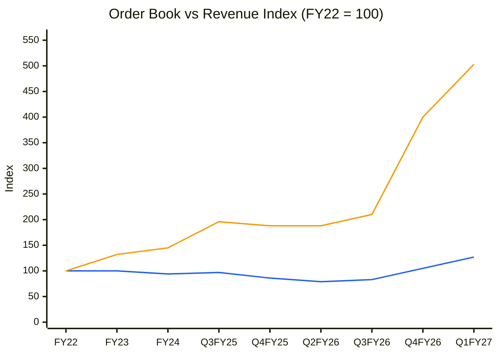
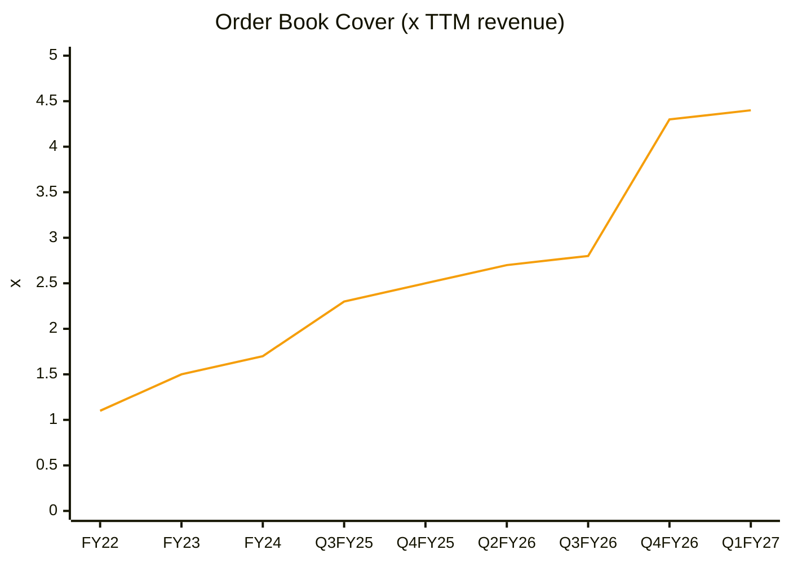
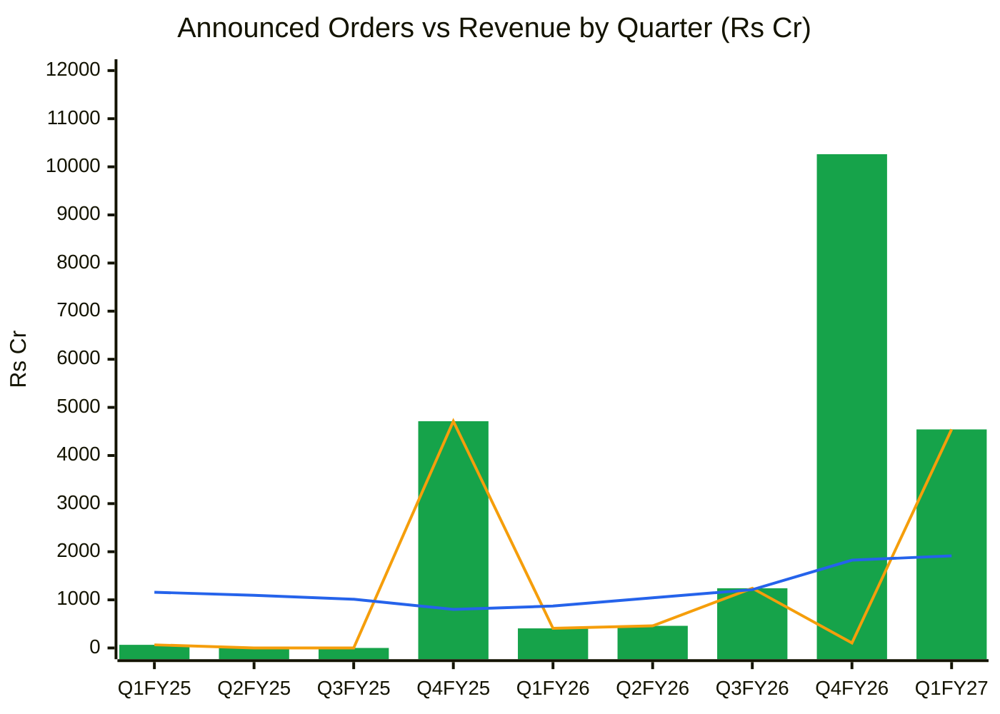
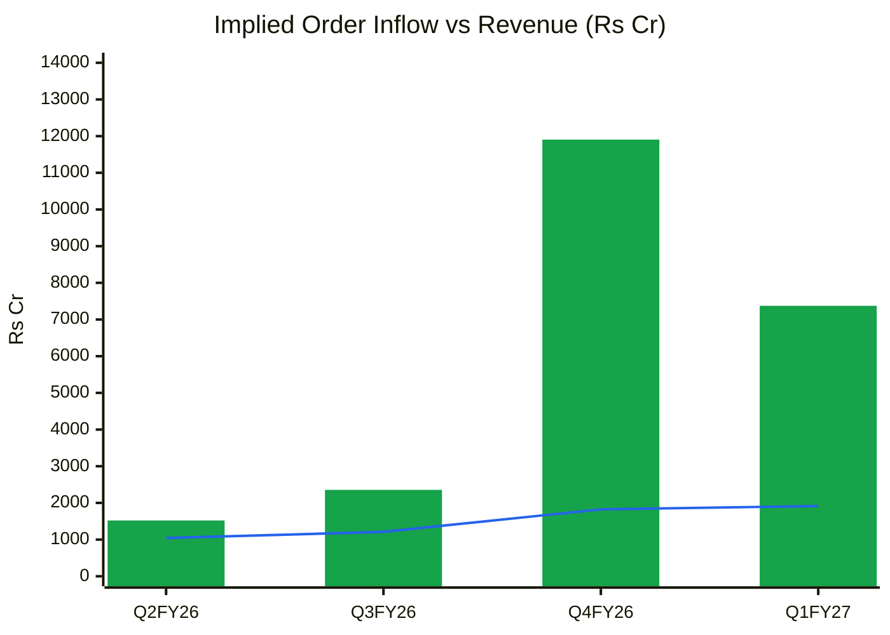

## Order Book Tracker — HFCL
*Generated 2026-10-09 by scripts/order_book_tracker.py from 27 order announcements (1 follow-ups excluded) and 12 period snapshots. Ledger coverage starts 2024-04-01; earlier periods show '—' for announced inflow (unknown, not zero). (est.) = tracked estimate: previous disclosed order book + announced orders − order-linked revenue.*

### 1. Disclosed vs tracked order book (reconciliation)

| Period | Revenue (₹ Cr) | Order book (₹ Cr) | Announced inflow | of which Framework | Implied inflow | Announced coverage | OB cover (× TTM rev) | Source |
|---|---|---|---|---|---|---|---|---|
| FY22 | 4,727 | 5,300 | — | — | — | — | 1.1 | CARE Ratings Jul-2022 |
| FY23 | 4,743 | 7,010 | — | — | 6,453 | — | 1.5 | Company disclosure (The Machine Maker) |
| FY24 | 4,465 | 7,685 | — | — | 5,140 | — | 1.7 | Company disclosure (DSIJ) |
| Q1FY25 | 1,158 | 6,592 (est.) | 65 | — | — | — | 1.4 | Screener revenue |
| Q2FY25 | 1,094 | 5,498 (est.) | 0 | — | — | — | 1.2 | Screener revenue |
| Q3FY25 | 1,012 | 10,410 | 0 | — | 5,924 | 0% | 2.3 | Q3FY25 results (Muthoot Securities) |
| Q4FY25 | 801 | 9,967 | 4,713 | — | 358 | 1,317% | 2.5 | FY25 results (prior report) |
| Q1FY26 | 871 | 9,503 (est.) | 407 | — | — | — | 2.5 | Screener revenue |
| Q2FY26 | 1,043 | 9,981 | 460 | — | 1,521 | 30% | 2.7 | Q2FY26 results (Muthoot Securities) |
| Q3FY26 | 1,211 | 11,125 | 1,241 | — | 2,355 | 53% | 2.8 | Q3FY26 results (Muthoot Securities) |
| Q4FY26 | 1,824 | 21,206 | 10,262 | 10,159 | 11,905 | 86% | 4.3 | Q4FY26 results |
| Q1FY27 | 1,915 | 26,665 | 4,542 | — | 7,374 | 62% | 4.4 | Q1FY27 results (Business Standard) |

*Implied inflow = OB(t) − OB(t−1) + order-linked revenue(t). Announced coverage = announced ÷ implied: < 50% means most orders are below the disclosure threshold (or the OB is restated); > 120% means cancellations, de-scoping or slow-burn framework value not yet in the reported book.*

### 2. Announced orders aggregated by quarter

| Quarter | # orders | Total (₹ Cr) | Firm | Framework | Largest single | Export | Govt/PSU/Defence | Private domestic |
|---|---|---|---|---|---|---|---|---|
| Q1FY25 | 1 | 65 | 65 | 0 | 65 | 0 | 0 | 65 |
| Q4FY25 | 3 | 4,713 | 4,713 | 0 | 2,501 | 0 | 4,713 | 0 |
| Q1FY26 | 4 | 407 | 407 | 0 | 174 | 59 | 174 | 174 |
| Q2FY26 | 2 | 460 | 460 | 0 | 358 | 358 | 102 | 0 |
| Q3FY26 | 3 | 1,241 | 1,241 | 0 | 656 | 1,241 | 0 | 0 |
| Q4FY26 | 3 | 10,262 | 103 | 10,159 | 10,159 | 10,201 | 0 | 61 |
| Q1FY27 | 6 | 4,542 | 4,542 | 0 | 2,666 | 290 | 2,801 | 1,450 |
| Q2FY27 | 4 | 3,789 | 1,460 | 2,329 | 2,329 | 3,789 | 0 | 0 |

### 3. Macro picture

| Metric | Value |
|---|---|
| Latest disclosed order book | ₹26,665 Cr (Q1FY27) |
| Orders announced since that disclosure | ₹3,789 Cr (4 orders) |
| Tracked order book today (before execution since Q1FY27) | ₹30,454 Cr |
| Order book cover (latest) | 4.4 × TTM revenue |
| Framework / 'potential value' agreements in ledger | ₹12,488 Cr (47% of latest disclosed OB) |
| Orders announced, last 12 months | ₹20,294 Cr (18 orders; avg ₹1,127 Cr) |
| Top-3 orders (last 12 m) as % of disclosed OB | 57% |

**Geography mix, last 12 months:** Export 78% · Domestic 15% · Unspecified 7%
**Customer type mix, last 12 months:** Export 78% · PSU 14% · Unspecified 7% · Private 1% · Defence 1%
**Segment mix, last 12 months:** OFC (high fibre count) 62% · OFC 22% · EPC/Network 13% · Data-centre connectivity 2% · Services/AMC 1% · Defence 1%
**Firmness mix, last 12 months:** Framework 62% · Firm 38%

### 4. Charts

**OB-1 — Order book vs revenue (TTM), index = 100 at FY22**

🟦 Revenue (TTM) · 🟧 Order book (disclosed points only; x-axis mixes FY and quarter-ends where history is annual)
**Read:** _[Is the order book compounding faster than revenue (visibility building / execution lagging) or slower (book being consumed)?]_

**OB-2 — Order book cover (years of TTM revenue)**

🟧 Order book / TTM revenue
**Read:** _[Visibility trend; > 3x with flat revenue = execution / tenor question]_

**OB-3 — Aggregated announced orders vs revenue, by quarter (₹ Cr)**

🟩 All announced orders (bars) · 🟧 Firm orders only (excl. framework / potential-value agreements) · 🟦 Revenue
**Read:** _[Book-to-bill on announced firm orders; how much of the headline is framework value?]_

**OB-4 — Implied order inflow (from disclosed order book) vs revenue (₹ Cr)**

🟩 Implied inflow = ΔOB + order-linked revenue · 🟦 Revenue
**Read:** _[Quarterly book-to-bill; does implied inflow match the announced ledger (coverage)?]_

*Every number above traces to orders.csv / snapshots.csv rows (source_url / source columns).*
